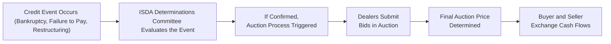

## 12.7 Credit Event Settlement (Bankruptcies, Restructurings)

Imagine you’re at a gathering with fellow finance enthusiasts. Everything’s fun and games until someone casually mentions that a major corporation has just filed for bankruptcy protection. Suddenly, everyone’s chatting about whether that triggers a “credit event” on certain Credit Default Swaps (CDS). If you’re new to this, it can feel like diving into a swirling ocean of acronyms, definitions, and stressful what-ifs. But don’t worry—this section breaks it down in a way designed to be as approachable as possible.

Let’s look closely at what a credit event is, why it matters in the CDS world, and how the settlement process unfolds. We’ll also walk through some real-life experiences, potential pitfalls, and, of course, the official regulatory frameworks that keep it all in check.

---
  
### Understanding Credit Events and Why They Matter

In a Credit Default Swap, a protection buyer pays periodic premiums to a protection seller, anticipating that the reference entity (often a corporation or government) might default on its debt. A CDS basically acts like an insurance policy against the risk of default (or another “credit event”). But the burning question is: when exactly does this “credit event” happen?

A credit event is typically triggered when a severe negative outcome befalls the reference entity. Common triggers include:

• Bankruptcy  
• Failure to pay (i.e., missed coupon or principal repayment)  
• Restructuring (e.g., changing the terms, extending maturities, or reducing coupons)

Once triggered and validated by relevant bodies—usually in line with the International Swaps and Derivatives Association (ISDA) definitions—settlement between the CDS buyer and seller kicks in. This settlement can be physical (handing over defaulted bonds in exchange for par value) or cash-based, but in modern markets, folks often prefer a cash settlement (thanks to standardized ISDA Auctions, which we’ll cover in a minute).

---
  
### ISDA Determinations Committee: The Gatekeeper

So who decides whether a credit event has really occurred? This is where the ISDA Determinations Committee (or “DC” for short) steps in. As an organization, ISDA fosters global standards to bring consistency to derivative contracts, credit definitions, and so forth. But the DC is not just some random group of bureaucrats. It’s composed of market participants (e.g., banks, asset managers) who have a direct stake in the CDS market. They vote on whether a reported event meets the contractual definition of a “credit event.”

Here’s a quick rundown of how it works:

1. Market rumors or official news emerges: “Company X has filed for bankruptcy protection.”  
2. A request is submitted to the ISDA Determinations Committee for that region, asking: “Does this count as a bankruptcy under the ISDA definitions?”  
3. The DC reviews the documentation (like actual court filings, corporate announcements, etc.) and the relevant ISDA definitions.  
4. A consensus-based or supermajority-based vote decides if a credit event is recognized.  
5. If the DC rules “yes,” then the official settlement process for CDS referencing Company X can proceed.

---
  
### Bankruptcy

Bankruptcy is probably the easiest credit event to wrap your head around because, well, it’s commonly known in day-to-day life. If a reference entity declares bankruptcy (or goes into insolvency proceedings) and fails to make its debt obligations, you can basically think, “Yes, that’s a clear cut credit event.”  

Once declared, the CDS contract typically transitions to a settlement phase. If it’s a cash settlement, the ISDA Auction helps find a fair market price (the “recovery value") for the now-defaulted bonds and sets the final payment that the protection seller owes the protection buyer.

**Potential Pitfall:** Just because you hear a rumor that a company is “going under” doesn’t automatically lock in a credit event. The formal definition requires that certain conditions be met (e.g., the entity must be subject to a formal bankruptcy proceeding under applicable law). Always watch for official announcements and the DC’s final verdict.

---
  
### Failure to Pay

Another type of credit event is failure to pay, which is triggered when the reference entity literally doesn’t hand over the money it owes (principal or interest). The missed payment must be material—meaning a small technical glitch or a very minor short payment might not qualify.

**Tip:** If you’re referencing corporate debt, the precise thresholds for “material” and the grace periods for late payments are spelled out in the ISDA Credit Derivatives Definitions. Don’t guess: always confirm the details because the DC will do precisely that.

---
  
### Restructuring: The Tricky One

Restructuring can be more complicated than a standard failure to pay or filing for bankruptcy. Why? Because restructuring may not mean the entity is insolvent. Rather, it’s when the debtor negotiates easier terms with creditors. This can include:

• Extending maturity dates (giving the entity more time to pay)  
• Reducing coupon rates (slashing interest costs)  
• Subordinating certain bonds (changing priority in the capital structure)

Still, “restructuring” qualifies as a valid credit event in many CDS contracts, but definitions can differ across regions. In European markets, for instance, it’s fairly standard to keep full restructuring provisions in the contract. In North America, many CDS contracts limit or modify the types of restructuring events that count (these are known as “Modified Restructuring,” “Modified-Modified Restructuring,” etc.).  

**Real-World Anecdote:** I remember working with a team once that got blindsided by a bond indenture change they thought was inconsequential. Turned out, the ISDA Determinations Committee considered it a potential “distressed” restructuring event. Lesson learned: read the fine print.

---
  
### How the Settlement Occurs: Enter the ISDA Auction

Once a credit event has been confirmed, the next big question is how to settle. Nowadays, one of the most prevalent methods for settlement is the ISDA Auction process (sometimes called the “credit fixing” process). Here’s the gist:

1. **Auction Announcement:** ISDA sets a date and time for an auction to find the fair market value of the defaulted (or restructured) debt.  
2. **Initial Bidding:** Dealers submit confidential bids that reflect the price at which they’re willing to buy or sell the underlying bonds (or other reference obligations).  
3. **Determination of Auction Price:** An algorithm processes these bids to determine a final “auction clearing price” or “final price.”  
4. **Cash Settlement:** If your CDS contract is set for cash settlement, the final price is used to calculate the payout. For example, if the final price is 30% of par, the protection seller pays the protection buyer (100% - 30%) = 70% of par for the notional of the CDS.

This system provides a transparent, market-driven approach to discover how the defaulted instruments are valued. Since multiple dealers participate, it helps clamp down on the risk of manipulative or inconsistent pricing.

---
  
### Diagram: Credit Event Settlement Flow

Below is a mermaid diagram illustrating how a credit event typically flows from occurrence to settlement.

As you can see, once the event is confirmed by the ISDA DC, the auction ensures an orderly determination of the CDS settlement price.

---
  
### Cash Settlement vs. Physical Settlement

Although cash settlement via the ISDA Auction process is most common these days, there is also physical settlement. Under physical settlement:

• The protection buyer tenders eligible deliverable obligations (the defaulted or restructured bonds).  
• The protection seller pays par (or the face value) for those obligations.

However, for operational simplicity, many market participants choose cash settlement, especially for large or complex positions. This is often more efficient and less messy, especially when the actual underlying bonds are scattered across multiple custodians or market participants.

---
  
### Impact on Canadian Markets and CIRO Oversight

Within Canada, most major financial institutions that trade CDS also abide by global ISDA standards. CIRO (the Canadian Investment Regulatory Organization) oversees investment dealers, ensuring they comply with rules and regulations on derivatives activities, including credit derivatives.  

• Dealers must maintain robust risk management, capital requirements, and keep track of exposures.  
• CIRO sets out guidelines and can coordinate with the CSA (Canadian Securities Administrators) on issues concerning trade reporting, margin requirements, and more.  

It’s always wise to check the CIRO website (https://www.ciro.ca) for up-to-date resources on how credit derivatives are regulated in Canada, especially if you’re planning to structure or trade in these products.

---
  
### Common Pitfalls and Best Practices

• **Underestimating Restructuring Terms:** It’s easy to assume that small changes to bond terms won’t matter, but if they trigger the restructuring clause, you may find yourself in a credit event settlement unexpectedly.  
• **Failing to Monitor Grace Periods:** A late payment might be a non-issue if made within the contractual grace period. Jumping to conclusions can lead to misinformed trades.  
• **Relying on Rumors:** Always confirm official announcements and wait for the ISDA DC’s verdict. Don’t assume a rumor or social media post is definitive.  
• **Inadequate Documentation:** This is huge. Make sure your CDS contracts (and any netting agreements) reference the latest ISDA Credit Derivatives Definitions.  
• **Ignoring Auction Mechanics:** If you’re a seller of protection, you should understand how your final payout is calculated. Familiarize yourself with the ISDA Auction Primer (available on ISDA’s website) so you know the timeline and mechanics.

---
  
### Practical Example: Bankruptcy Settlement Scenario

Let’s say Company ABC, a mid-sized retailer, suddenly declares bankruptcy after failing to cope with e-commerce disruptions. The news hits on Monday. By Tuesday, an official DC request is submitted. By Wednesday, the Determinations Committee votes and rules that a credit event (bankruptcy) has indeed occurred.

• As a CDS protection buyer referencing ABC’s debt, you’re entitled to a payout.  
• The next week, ISDA announces an auction date. Dealers submit bids reflecting the value of ABC’s now-defaulted bonds.  
• The final auction price is determined at 25%.  
• The protection seller then pays you (100% - 25%) = 75% of the notional.  

You can keep that payout, which compensates you for the loss in value of ABC’s underlying debt. You might also receive the defaulted bond if physical settlement was chosen, but in the modern era, most go with cash settlement.

---
  
### Glossary Recap

• **Bankruptcy:** A legal process where an entity cannot repay its debts, leading to court-administered solutions for creditors.  
• **Failure to Pay:** Triggered when a reference entity fails to meet a payment obligation on its debt securities.  
• **Restructuring:** Adjusting the terms of debt (e.g., maturity extension, coupon reduction) that can still qualify as a credit event under ISDA definitions.  
• **ISDA Determinations Committee:** A group of market participants who decide if a credit event has occurred.  
• **Auction Settlement:** A standardized process where the final price (or “recovery rate”) is determined by competitive bidding.

---
  
### Regulatory and Reference Materials

• **ISDA:** https://www.isda.org  
  - The ISDA website houses credit event histories, DC rules, and the all-important “ISDA Credit Derivatives Auction Primer.”  
• **CIRO:** https://www.ciro.ca  
  - Canada’s national self-regulatory organization for investment dealers.  
• **CSA (Canadian Securities Administrators):** Coordinates provincial and territorial regulation of derivatives markets and trade reporting.  
• **Open-Source Tools/Market Data Platforms:** Some tech-savvy traders leverage open-source libraries (e.g., quant libraries in Python) for real-time CDS pricing.  
• **Bourse de Montréal:** While more focused on equity and interest rate derivatives, be aware of announcements or cross-listing updates that might indirectly affect the credit markets.

---
  
### Final Thoughts

Credit events might sound scary—and sometimes they are—but they also form the hidden backbone of risk management in fixed-income markets. Whether you’re a risk manager at a bank, a hedge fund trader, or a curious finance student, understanding the nuts and bolts of how these events are defined, validated, and settled can sharpen your overall market insight.

Maybe next time someone casually name-drops “credit event” after hearing about another corporate restructuring, you’ll feel a bit more prepared to join the conversation. And, truly, that’s what learning about derivatives is all about—being ready, being informed, and hopefully being a step ahead in navigating the complexities of global finance.

---

## Sample Exam Questions: Credit Event Settlement Essentials



### In a CDS contract, which entity typically confirms whether a credit event has officially occurred?

- [ ] A government agency
- [x] The ISDA Determinations Committee
- [ ] A bankruptcy court judge
- [ ] The reference entity’s management

> **Explanation:** The ISDA Determinations Committee is responsible for reviewing evidence and deciding if a credit event has taken place under the contract’s terms.

### Which of the following is a valid credit event under standard ISDA definitions?

- [x] Bankruptcy
- [x] Failure to pay
- [ ] Systemic risk
- [x] Restructuring

> **Explanation:** Standard credit events include bankruptcy, failure to pay, and restructuring. Systemic risk is not typically a trigger for a single-credit CDS.

### What is a key advantage of the ISDA Auction process for cash settlement?

- [x] It offers a transparent, market-driven price for the defaulted debt.
- [ ] It allows for automated physical delivery of all deliverable obligations.
- [ ] It eliminates the need for any documentation.
- [ ] It has no cost to participants.

> **Explanation:** The ISDA Auction process ensures a fair, transparent way to establish a recovery value, improving accuracy and reducing disputes.

### When does a restructuring event generally trigger a credit event in a CDS contract?

- [ ] Only if the reference entity is also bankrupt
- [ ] When coupons are raised beyond the original agreement
- [x] When the reference entity extends maturities or reduces coupons in a distressed situation
- [ ] If the CDS counterparty requests it

> **Explanation:** Restructuring involves material changes in terms that usually benefit the debtor but can harm the creditor’s position, thus potentially triggering a CDS credit event.

### Under physical settlement of a CDS, what occurs?

- [ ] The protection buyer pays par and receives no bonds in return
- [x] The protection buyer delivers defaulted bonds and receives par value in cash
- [ ] Both parties deliver defaulted bonds to a central clearinghouse
- [ ] The auction process automatically determines the exchange of the bonds

> **Explanation:** In physical settlement, the protection buyer delivers the underlying defaulted claims (bonds) to the seller in exchange for par value.

### Which of the following statements about the ISDA Determinations Committee (DC) is correct?

- [x] The DC is composed of market participants who decide credit event questions by vote.
- [ ] The DC is a branch of the Canadian federal government.
- [ ] The DC can only declare bankruptcies in the United States.
- [ ] The DC replaces bankruptcy courts.

> **Explanation:** The DC is a private body of market participants established by ISDA to rule on credit event occurrences, not a governmental institution.

### Which scenario is most likely to trigger a “failure to pay” event in a CDS contract?

- [ ] The reference entity pays its interest obligation one day after the agreed grace period.
- [x] The reference entity completely misses a significant coupon payment past its grace period.
- [ ] The reference entity refinances its debt at a higher interest rate.
- [ ] The reference entity undergoes a minor internal restructuring that doesn’t affect bond terms.

> **Explanation:** Failure to pay usually refers to a missed payment (interest or principal) that is significant and beyond the grace period.

### What is a common pitfall when dealing with restructuring credit events?

- [x] Underestimating the minor changes in bond terms that could trigger a credit event.
- [ ] Overreporting events to the ISDA DC
- [ ] Reading the fine print and verifying each bond covenant
- [ ] Employing the latest ISDA definitions in every contract

> **Explanation:** Many market participants underestimate how “small” bond term changes might be interpreted as a distressed restructuring, which can unexpectedly trigger a credit event.

### How does the ISDA Auction process determine the final price for defaulted debt?

- [ ] By negotiating with the bankrupt entity’s legal counsel
- [ ] By applying a fixed standard rate of 50% for all defaults
- [ ] By referencing only the opinion of credit rating agencies
- [x] Through competitive bidding by multiple dealers

> **Explanation:** The final price in an ISDA Auction is determined through a market-based bidding process involving dealers, leading to a transparent and fair recovery rate.

### Credit Default Swaps in Canada fall under regulatory oversight by which entity?

- [x] CIRO
- [ ] OCC
- [ ] FINRA
- [ ] The Bank of Canada

> **Explanation:** CIRO is the Canadian self-regulatory organization that oversees investment dealers, including credit derivatives transactions under its remit.


