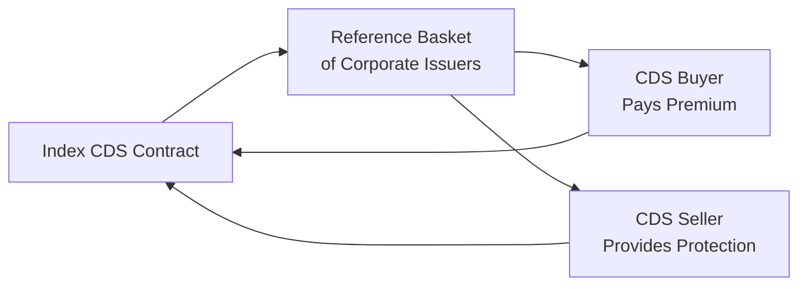
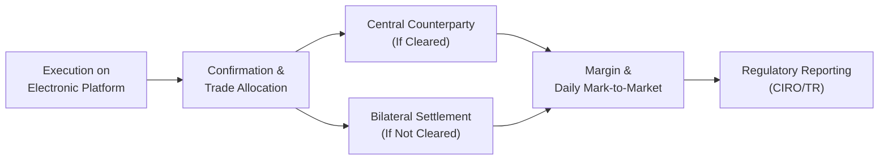

## 12.8 Standardization via ISDA & Market Trends (Index-Based CDS)

Have you ever tried to coordinate a group of friends for a weekend trip? Everyone has a slightly different preference, a slightly different schedule, and, at times, it can feel like you’re negotiating a complex contract. Well, credit default swaps (CDSs) aren’t all that different—except the stakes are generally a lot higher! To avoid massive confusion and support smoother negotiations, the International Swaps and Derivatives Association (ISDA) stepped in to create standard rules that everyone can rely on. The result: more accessible, liquid, and transparent credit derivatives markets, highlighted by the increasing prevalence of index-based CDS. Let’s explore how standardization via ISDA has shaped these markets, how index-based CDSs have evolved, and what this means for Canadian market participants under the Canadian Investment Regulatory Organization (CIRO).

**A Quick Personal Anecdote**  
Back in my early days learning about derivatives, I felt overwhelmed by all the specialized vocabulary, the multiple settlement standards, and the messy documentation. I’d open up a CDS contract (digitally or physically) and think: “Wait, we’re all talking about the same product, right?” Standardization changed the game for me. Suddenly, referencing the same definitional book—ISDA’s “Credit Derivatives Definitions”—makes reviewing contracts and their settlement triggers so much simpler. It’s like we’re all finally speaking the same financial language.

---

### The Role of ISDA in Standardizing Credit Derivatives

**ISDA’s Mission**  
ISDA exists to foster safe and efficient markets in derivatives. They publish standardized legal documentation and definitions so that when two counterparties enter a CDS, they know exactly the set of credit events, settlement procedures, and payment calculations to expect. Standardization isn’t just about making the documents look tidy—it’s about removing legal uncertainty and promoting liquidity. When a contract is recognized and enforced similarly across many jurisdictions, investors become more confident and more willing to trade.

**Why Standardization Matters**  
• **Legal Certainty:** A unified approach to definitions and settlement ensures each party knows their rights and obligations. This lowers disputes and legal friction.  
• **Market Liquidity:** With standardized terms, more participants enter the market, because they don’t need to grapple with custom (and potentially risky) variations. This increases the volume of trades, improving liquidity.  
• **Transparency and Price Discovery:** Standardized documentation and transparent credit events help reduce confusion about how a CDS might behave. When everything is uniform, pricing and risk management become more straightforward.

**ISDA “Credit Derivatives Definitions”**  
A key resource is the ISDA’s “Credit Derivatives Definitions,” which specifically clarify:  
• The recognized credit events (e.g., bankruptcy, restructuring, failure to pay).  
• The standard settlement methods (physical vs. cash settlement).  
• Valuation methods for determining final settlement amounts.  

Canadian regulators, such as CIRO and the CSA (Canadian Securities Administrators), rely on or reference these definitions to help keep the credit derivatives market stable and consistent with global norms.

---

### Technological Advances and Electronic Trading Platforms

I remember the days when calling a dealer on the phone was the main route to trade a CDS. Today, we have advanced electronic trading platforms like Bloomberg SEF, Tradeweb, and various other aggregator systems that automatically match buyers and sellers. Real-time quotes and trade reporting are now standard in many jurisdictions, including Canada. The outcome? Narrower bid-ask spreads, greater transparency, and the chance for more institutional players—like pension funds, alternative mutual funds, and insurance companies—to step in.  

**Key Benefits of Electronic Platforms**  
• **Speed and Efficiency:** Trades can be matched and confirmed quickly, reducing operational risk.  
• **Real-Time Data:** Market data feeds enhance price discovery, letting traders gauge market sentiment instantly.  
• **Regulatory Reporting:** These platforms often feature built-in tools to handle post-trade reporting to regulators (like CIRO), ensuring compliance.  

---

### Rise of Index-Based CDS

Now, let’s dig into the real star of this discussion: index-based CDS. Rather than buy protection on, say, a single corporate issuer, you can purchase (or sell) protection on an entire basket of issuers, all packaged neatly into one tradable index. The most common example globally is the Markit CDX or iTraxx in Europe, each referencing a pool of corporate or sovereign credits.

**Why Index-Based CDS Has Become So Popular**  
• **Diversification:** You spread risk across multiple reference entities. If one issuer defaults, it may not hammer your entire position.  
• **Transparency:** Index rules are usually published, so you know exactly which entities are in the index and why.  
• **High Liquidity:** Because so many people trade the same standardized index, you often get narrower bid-ask spreads.  
• **Efficient Hedging:** If you think corporate credit risk in general is about to rise or fall, an index-based CDS is a quick, broad-market bet.  

In tough times, index-based CDS typically retain better liquidity than single-name CDS. It’s a bit like if you’re worried about the real estate market, you might prefer an ETF covering the entire sector rather than only the stock of a single property developer.

---

### Market Trends in Canada

Under CIRO’s evolving market integrity standards, participants trading credit derivatives in Canada are expected to follow best execution practices and transparent trade reporting rules. As more Canadian institutional investors (pension funds, insurers, etc.) incorporate credit derivatives, index-based CDS is often a first step. It’s simpler, more transparent, and offers a built-in diversification.

**Case Study: A Pension Fund Hedging Corporate Bond Exposure**  
Let’s say a Canadian pension fund has exposure to a broad portfolio of Canadian and U.S. corporate bonds. Rather than hedging each issuer individually, the pension fund can purchase protection on an index-based CDS referencing a wide range of corporate issuers. This single transaction yields a streamlined approach—reducing both transaction costs and administrative complexity. If market credit risk spikes, their total exposures may be offset by gains in the CDS position.

---

### Anatomy of an Index-Based CDS

Index-based CDS instruments are often rebalanced or “rolled” on a regular schedule (e.g., every six months). During these rolls, new issuers may be added if they meet the criteria, and dropped issuers might be replaced (e.g., if they defaulted or no longer meet the liquidity/credit requirements). If you picture an ETF’s periodic rebalancing, it’s a similar concept.

Below is a high-level diagram showing how index-based CDS is structured:

In a typical arrangement, the buyer of protection pays a periodic premium (spread) to the seller of protection. If one or more issuers in the reference basket experience a credit event, the CDS seller compensates the buyer for the loss (according to the contract’s settlement provisions).  

---

### Benefits of Standardization for Index CDS

• **Uniform Credit Events:** Thanks to ISDA guidelines, when a default happens, everyone knows how to proceed.  
• **Consistent Documentation:** Fewer errors and disputes if all participants follow the same contract language.  
• **Enhanced Liquidity:** The more uniform the product, the easier it is to find a counterparty.  
• **Ease of Offsetting Trades:** If you want to exit a position, you can typically enter an offsetting trade quickly, especially when the contract is well-known and widely used.  

**Pitfall to Watch Out For**  
One common misconception is that just because it’s an index, it’s risk-free. The basket can contain high-yield issuers or a sizable representation of certain sectors. If that sector collapses, the index can still drop in value significantly, so it’s not a magic bullet.

---

### Broader Market Access

Historically, credit derivatives were mostly in the domain of large banks and sophisticated hedge funds. Now, we see more participation by smaller asset managers, insurance companies, and even some alternative mutual funds that have the internal capability to handle or hedge credit exposures. Why? Because standardization made everything simpler, from documentation to risk modeling. Additionally, the cost barrier dropped as electronic trading platforms proliferated.

**Impact on Canadian Investors**  
Canadian institutional investors looking to hedge or gain exposure to global credit markets can do so quickly and efficiently via index CDS. At the same time, regulators (CIRO and CSA) keep a close eye on these activities to ensure they align with best execution, transparency, and margin requirements.  

---

### Legal Certainty and Regulatory Support

**How Standardization Helps Canadian Market Participants**  
• **Harmonized Global Framework:** By adopting ISDA definitions, Canadian players aren’t out of step with global markets.  
• **CIRO’s Role:** CIRO bulletins often underscore the importance of robust documentation and best-execution standards. They also emphasize the need for trade reporting to recognized trade repositories, ensuring regulators have a clear view of systemic risks.  
• **CSA Guidelines:** The Canadian Securities Administrators coordinate with CIRO to maintain consistent rules for derivatives. For instance, they oversee how credit derivatives are reported, how margin is calculated, and how exposures are aggregated system-wide.

**Spotlight on Clearing**  
Some index CDS trades might be cleared at central counterparties (CCPs), depending on the size of the transaction and regulatory mandates. Central clearing can further reduce credit risk between individual counterparties, but it also introduces new operational structures (like margin requirements, daily settlement, etc.).

---

### Evolving Market Technology and Post-Trade Infrastructure

From phone calls to cloud-based systems, the post-trade process for CDS has changed massively. Straight-through processing means that once a trade is executed on a platform, the contract details feed directly into the clearinghouse or the counterparties’ internal systems, drastically reducing the chance of manual error.

**Diagram: Post-Trade Workflow for Index CDS**

**Best Practices**  
• Double-check trade details (e.g., notional amount, index version, reference obligations) immediately after execution.  
• Monitor margin requirements closely if the trade is centrally cleared.  
• Report trade details in real time (or within mandated periods) to ensure compliance with CIRO or CSA rules.

---

### Market Observations and Future Trends

1. **Geopolitical Events and Credit Spreads**  
   Analysts carefully watch indices like CDX IG (Investment Grade) or CDX HY (High Yield) as barometers of overall market sentiment. During volatile periods, the volume of trades in index-based CDS often spikes as participants flock to the liquidity these products offer.

2. **ESG-Friendly Variations**  
   With environmental, social, and governance (ESG) considerations gaining popularity, the market is beginning to see specialized index-based CDS that track “green” or “sustainable” corporate credits. Regulators and index administrators are still working out the best ways to define and measure these criteria.

3. **Technological Integration**  
   We’re seeing blockchain-based platforms and decentralized finance (DeFi) prototypes discussing on-chain CDS. While still early stage, it hints at the ongoing push for more automated, transparent, and possibly cheaper ways to trade credit protection.

4. **Regulatory Evolution**  
   CIRO and CSA might introduce new guidelines around the clearing and margin framework specific to index CDS if they deem systemic risk concerns significant. It pays to stay updated with bulletins and releases from these bodies.

---

### Common Pitfalls and Challenges

• **Overreliance on Index Coverage:** Index-based CDS can mask individual credit risks in the basket. If you specifically need to hedge one issuer, a broad index might offer imperfect protection.  
• **Mispriced Basis Risk:** If your actual holdings differ subtly from the index constituents, the hedge may only partially work.  
• **Operational Complexity:** Despite standardization, each roll date can bring changes to index constituents. Failing to track rebalancing can lead to mismatched hedges.  
• **Counterparty and Clearing Risk:** Central clearing reduces bilateral credit risk but introduces reliance on the financial health and operational resilience of the clearinghouse.

---

### Practical Example: Using Index-Based CDS for Portfolio Hedging

Let’s say you manage a Canadian corporate bond portfolio with 50 different names. You sense credit spreads might widen due to an expected economic downturn. You decide to buy protection on a recognized, standardized North American investment-grade index. By doing so:  
• You pay a periodic premium based on the index’s spread.  
• If defaults or credit events occur in that index basket, your CDS position should partly offset losses in your bond portfolio.  
• Liquidity remains fairly robust, allowing you to adjust or unwind the position as needed.  

It’s a cost-effective hedge, though not a perfect one—if your bond selection differs from the basket’s composition, you’ll have some basis risk.

---

### References and Additional Resources

• **ISDA “Credit Derivatives Definitions”**  
  (https://www.isda.org) – The cornerstone of standardized CDS documentation.  
• **CIRO**  
  (https://www.ciro.ca) – Guidance on market integrity, margin requirements, and reporting obligations in Canada.  
• **CSA**  
  (https://www.securities-administrators.ca) – Coordinates Canadian securities regulation and offers comprehensive resources on derivatives rules.  
• **Bloomberg SEF**  
  (https://www.bloomberg.com/professional/solution/execution-and-routing/) – A popular platform for trading and reporting derivatives, including CDS.  
• **Tradeweb**  
  (https://www.tradeweb.com) – Offers electronic marketplaces for multiple asset classes, including credit derivatives.

---

### Concluding Thoughts

Standardization via ISDA has revolutionized credit derivatives, making them more transparent, liquid, and accessible to a broader range of participants. Index-based CDS, in particular, highlight how such standardization—combined with technological innovation—can transform a once-esoteric market into a vital hedging and investment vehicle. For Canadian investors, following CIRO regulations and CSA guidelines provides a robust framework for participating in these markets while maintaining best practices in risk management.

As you continue exploring credit derivatives, remember: standardization doesn’t eliminate risk—it simply clarifies it. You still need thorough analysis and prudent risk management. But at least now, we’re all reading from the same playbook. That, in itself, is a huge step forward.

---

## Sample Exam Questions: Standardization via ISDA & Index-Based CDS



### Which of the following best describes how ISDA has influenced standardization in the credit derivatives market?

- [ ] By banning exotic CDS structures altogether.
- [x] By publishing standardized legal documentation and definitions.
- [ ] By forcing all CDS to clear in a single centralized repository.
- [ ] By eliminating the need for counterparties to negotiate terms.

> **Explanation:** ISDA’s core role is in developing standardized documentation and definitions that market participants can rely on for clarity and uniformity.

---

### Which of the following is a key reason index-based CDS instruments are popular?

- [ ] They are custom-tailored to individual credit events.
- [ ] They exclude large financial institutions from the reference basket.
- [x] They offer broader market exposure and typically greater liquidity.
- [ ] They have no need for margin or collateral.

> **Explanation:** Index-based CDS provide exposure to a basket of issuers, which typically enhances liquidity and diversification.

---

### What is one potential pitfall when using an index-based CDS to hedge a portfolio of corporate bonds?

- [x] Basis risk due to differences between the index constituents and the actual holdings.
- [ ] Guaranteed profit, which limits upside potential.
- [ ] Too many phone calls required to confirm trades.
- [ ] Regulators do not allow index-based CDS for pension funds.

> **Explanation:** When the bonds in one’s portfolio do not match the index’s reference entities, the hedge may be less effective.

---

### How does electronic trading impact credit derivatives markets?

- [ ] It eliminates the need for ISDA documentation.
- [ ] It increases operational risks due to phone-based confirmations.
- [ ] It favors only large broker-dealers.
- [x] It provides faster execution and more transparent price discovery.

> **Explanation:** Electronic platforms streamline trading, facilitate real-time quotes, and automate post-trade processes, improving overall market efficiency.

---

### Which Canadian regulatory body is primarily responsible for overseeing investment dealers and derivatives market integrity today?

- [ ] IIROC (currently active)
- [ ] MFDA (currently active)
- [x] CIRO
- [ ] FDIC

> **Explanation:** As of 2025, CIRO is the self-regulatory organization in Canada responsible for market integrity and oversight of investment dealers. The MFDA and IIROC no longer exist as separate entities.

---

### In an index CDS transaction, how is the rebalancing typically handled?

- [ ] The buyer and seller negotiate new terms every day.
- [ ] Only the buyer decides which entities to include or remove.
- [x] The index is refreshed periodically (e.g., every six months) by adding/removing reference entities as outlined by the index rules.
- [ ] The federal government mandates weekly reconstitutions.

> **Explanation:** Index CDS are periodically “rolled” to reflect updated constituent lists, typically based on rules set by the index administrators.

---

### What key document from ISDA governs the events and terms in a credit derivative?

- [ ] The Commodity Futures Modernization Act
- [ ] The Bourse de Montréal Trading Models
- [x] The ISDA Credit Derivatives Definitions
- [ ] The CSA White Paper on Short Selling

> **Explanation:** The ISDA “Credit Derivatives Definitions” specify essential terms such as credit events, settlement types, and relevant procedures for CDS.

---

### Which of the following best describes the role of central clearing in an index-based CDS?

- [ ] It guarantees no margin calls will occur.
- [ ] It eliminates the need for standard collateral arrangements.
- [x] It transfers counterparty risk to a clearinghouse, which requires margin and daily settlement.
- [ ] It is only available for single-name CDS, not index CDS.

> **Explanation:** Central clearing involves a clearinghouse standing between buyers and sellers, managing daily margin and mitigating bilateral credit risk.

---

### What is one function of CIRO’s trade reporting requirements for credit derivatives?

- [ ] They make the credit derivatives market entirely risk-free.
- [x] They ensure regulators have real-time insight into market exposures.
- [ ] They allow the parties to remain completely anonymous forever.
- [ ] They permit the use of custom contracts not adhering to ISDA standards.

> **Explanation:** CIRO’s reporting requirements enhance transparency, giving regulators a clearer picture of systemic risk and market participants’ exposures.

---

### True or False: Standardization via ISDA means all CDS now have zero risk.

- [ ] False
- [x] True
- (This is intentionally reversed to see if you’re paying attention!)

> **Explanation:** This was a trick question. Standardization does not eliminate market risk or credit risk; it merely clarifies the terms and promotes more efficient trading.


