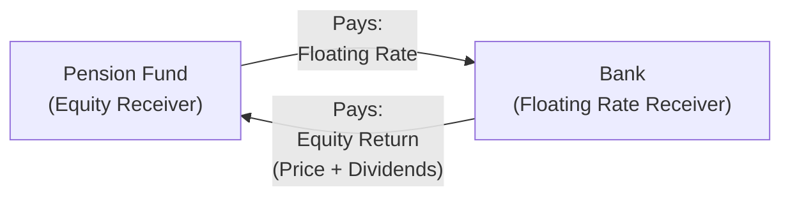

## 13.1 Equity Swaps

Equity swaps are often described as the hidden gems among equity derivatives. They can sound complicated at first, and trust me, I’ve had my fair share of confused looks when I first tried to explain them during a team meeting at a small asset management firm. But once you get the hang of how they operate, the concept starts to click, and you’ll realize why so many institutional players love them. Imagine wanting exposure to a certain stock or index—like the S&P/TSX Composite—without actually buying the shares outright. Equity swaps let you do just that.

They’re typically over-the-counter (OTC) instruments, meaning they’re not traded on an exchange like a standard equity option or future. Instead, two parties (called “counterparties”) enter into a private agreement that says, “I’ll pay you the return on this equity if you pay me something else—maybe a floating interest rate—over a particular period.” That’s pretty much the heart of it.

Below, we’ll walk through the nuts and bolts of equity swaps, explore their structure, highlight their uses and benefits, examine associated risks, and connect to the Canadian regulatory environment. We’ll also show a little diagram to visualize the payment flows so you can keep track of who pays what, to whom, and when. Let’s dive right in.

Introduction to Equity Swaps  
Equity swaps are bilateral contracts that exchange the returns of an equity (or basket of equities or an equity index) for a fixed or floating rate of interest. The notional principal—an agreed-upon amount—remains untouched in most cases; no one typically pays or delivers that principal. Instead, each party agrees to swap the performance on that notional amount. So if you’re the party receiving the equity leg, you get any eventual gain on the equity price plus notional dividends (subject to contract terms), and in return, you pay out a rate such as the Canadian Overnight Repo Rate Average (CORRA) or a fixed rate plus/minus some spread.

Key Concepts in Equity Swaps  

• Notional Amount  
This is the “pretend” principal used only for calculation purposes. You never physically exchange it—so if the notional is $10 million, the party receiving the equity returns might be receiving those returns (like capital appreciation and dividends) on $10 million worth of stock. But no one forks over $10 million in cash at inception.

• Equity Leg  
This side is tied to the performance of a specific stock, a basket of stocks, or an equity index. Performance includes price changes and could also include dividend payments, but that depends on the swap agreement’s structure. If you’re on the receiving side, you get the notional equity return; if you’re on the paying side, you’re effectively short that return.

• Floating Rate Leg (or Fixed Rate Leg)  
The other side of the swap is typically an agreed-upon interest rate. It could be CORRA or some other reference like the Secured Overnight Financing Rate (SOFR) or even a fixed rate. Sometimes, the floating rate is determined monthly or quarterly, and you pay or receive the difference accordingly.

• Dividend Adjustments  
In many equity swaps, the party receiving the equity exposure is also credited with something representing dividends. But hey, in real life, dividends can be taxed or subject to withholding. So there’s usually a “dividend adjustment” that accounts for these complexities. That means you might get credited a net dividend, reflecting the after-tax amount (depending on your jurisdiction).

• Mark-to-Market  
The value of the swap is adjusted over time as equity prices fluctuate and interest rates move. This is a typical feature in derivatives markets—it ensures both sides understand their positions’ current market value and track potential gains or losses.

How Equity Swaps Work  

Let’s unpack a straightforward example. Suppose you’re a Canadian pension fund. You want exposure to the S&P/TSX Composite, but you don’t really want to buy the shares for reasons like transaction costs, regulatory constraints, or maybe you’re being super strategic with your balance sheet. Instead, you enter into an equity swap with a bank. The terms might say:

• You receive the total return on the S&P/TSX Composite (price appreciation or depreciation plus dividends) on a notional of CA$50 million.  
• You pay the bank a floating rate, say CORRA + a spread of 0.25%, on the same notional.  

Once the swap kicks in, the bank pays you if the notional equity appreciation (plus dividends) is positive over each settlement period. In turn, you pay them the periodic floating rate. And if the index goes down, you might owe the bank the difference in price performance (plus you’ll still owe the floating rate). No shares actually change hands here—it’s all about exchanging the difference in value.

Let’s look at a simple diagram to visualize these flows:

In this setup:
• A (the Pension Fund) receives the equity return on a chosen index or stock basket.  
• A pays a floating rate to B (the Bank).  
• B receives the floating rate from A.  
• B pays the equity return to A.

You’ve effectively gained the desired equity exposure without owning a single share.

Practical Example  

Let’s make it more tangible with numbers—though keep in mind, actual market quotes, fees, and credit spreads can vary significantly. You sign a 12-month swap at a notional of $10 million. The swap will settle quarterly. So after the first three months:

• Equity Leg: Suppose your referenced equity index is up 5% (including reinvested dividends). That’s a $500,000 notional gain (5% * $10 million).  
• Floating Leg: Let’s say CORRA is 4.50% annualized, plus a 0.25% spread = 4.75% total annual. Over one quarter, that’s roughly 1.1875% (since 4.75% ÷ 4). On a $10 million notional, that’s $118,750 for the three-month period.  

Net Settlement for that quarter  
• If you’re the equity receiver, you get $500,000 minus $118,750 = $381,250 from your counterparty.  
• If the index had gone down, you might owe the counterparty the difference.  

Keep in mind, that $381,250 might be subject to certain adjustments, especially if the contract’s dividend structure is net of any withholding taxes or foreign exchange considerations. But this example captures the basic gist.

Who Uses Equity Swaps?  

• Institutional Investors: Canadian pension funds, insurance companies, large asset managers. They might want to fine-tune their portfolio exposures without incurring direct transaction costs or public market footprint.  
• Hedge Funds: They often love equity swaps because they can gain or reduce exposure quickly or construct complex long/short strategies without physically trading all the underlying stocks.  
• Corporates: Sometimes, they want to hedge existing equity holdings or manage compensation-related equity exposure.  
• Global Investors: They might use equity swaps to bypass certain investment restrictions in foreign markets. However, local regulations can be quite strict on this front, so always consult compliance and legal experts.  

Major Benefits  
• Flexibility: You pick your notional, index, reference rate, contractual period, everything.  
• Lower Transaction Costs: You may avoid some direct trading fees or market impact—though the swap spread can offset that.  
• Balance Sheet Efficiency: Without holding actual shares, you might optimize capital usage and reduce certain regulatory capital burdens (depending on your jurisdiction).  
• Confidentiality: No immediate reporting of large positions in publicly traded equities, although in Canada you still have reporting obligations under CIRO/CSA rules for certain large exposures or where beneficial ownership thresholds are triggered.

Primary Risks  

• Counterparty Credit Risk: Because you’re dealing OTC, there’s a chance the other side can default. With a bank or a hedge fund, you need to be aware of their credit standing. Collateralization mitigates this but doesn’t eliminate it fully.  
• Mark-to-Market Volatility: If the equity leg tumbles, you’re on the hook to pay. Also, changes in interest rates might impact your floating leg quite a bit.  
• Operational Risk: Getting your settlement calculations right can get tricky.  
• Regulatory/Legal Risk: If you fail to comply with Canadian regulations on trade reporting or clearing (where mandated), you could face fines or other sanctions.

Regulatory Framework in Canada  

You might be thinking, “So how does all of this fit into Canadian rules?” Yeah, that’s a key question. Canada has a robust system of oversight for derivatives. Here are some highlights:

• CIRO (Canadian Investment Regulatory Organization): Post-2023, CIRO is the national self-regulatory body for investment dealers and mutual fund dealers, also overseeing market integrity on equities, debt, and derivatives marketplaces. Any firm offering equity swaps to clients must ensure compliance with CIRO registration categories, documentation, and suitability rules.  
• CSA (Canadian Securities Administrators): The CSA’s National Instruments, particularly NI 94-101 and NI 94-102, set out requirements for mandatory clearing of certain OTC derivatives and for reporting those transactions to recognized trade repositories. Equity swaps might be in scope depending on the notional size, counterparties, and if they’re standardized enough for clearing.  
• Collateralization: Many equity swaps are subject to margining or collateral agreements to mitigate counterparty risk. You’ll see references to Variation Margin, Initial Margin, or even central clearing services if available.  
• Trade Reporting: Trades typically need to be reported to a recognized trade repository—like the Canadian Derivatives Repository (CDS) or others recognized by the CSA. If you skip this, you’re definitely not in compliance.

ISDA Master Agreements  

The International Swaps and Derivatives Association (ISDA) is a global driving force in standardizing derivatives documentation. If you enter an equity swap in Canada, chances are your lawyers will provide an ISDA Master Agreement. This lays out the common definitions, default provisions, netting rules, and credit support annex to collect collateral. The actual trade details live in separate “confirmations” that specify the notional, the reference equity, the settlement terms, and so on.

Collateralization and Credit Risk  

When I was analyzing an equity swap at a prior job, I found that a huge chunk of time was spent focusing on collateral requirements. And it wasn’t just my firm being paranoid—counterparty credit risk is a major worry. If you end up in the money by $5 million, you want to ensure the other side can actually pay you. That’s where collateralization protocols come in. Under an ISDA Credit Support Annex (CSA), each side might agree to post cash or liquid securities if the swap’s mark-to-market hits a certain threshold. This helps cover potential losses if the counterparty walks away. You know, it’s basically the old trust-but-verify approach.

Dividend Adjustments  

Remember earlier, we said the equity leg might include dividends. That’s usually a big part of an equity’s total return, especially if you’re referencing established Canadian banks or utilities with healthy dividend payouts. But how those dividends flow through to the receiver can vary:  
• Gross Dividends: Some swaps pay the full dividend.  
• Net Dividends: Others deduct expected withholding or local taxes.  
• Specific Contract Provisions: The swap confirmation might even detail the exact calculation of how the dividend is credited.  

It’s super important to read the fine print because if you’re modeling projected returns, you’ll want to know if you’re receiving the full dividend or a fraction of it.

Mark-to-Market  

Like many derivatives, equity swaps are regularly marked-to-market. This means the contract’s fair value is recalculated, reflecting changes in the underlying equity price and movement in the interest rate leg. If the equity price soars higher than it was at the start, the receiver of the equity leg has an “in the money” position, so that might trigger margin calls from the floating rate payer. If the stock or index plummets, the equity receiver might have to post more collateral to the other side. This process can happen daily or weekly, depending on the agreement. Gains or losses might be realized periodically, and the notional settlement usually occurs at maturity.

Common Pitfalls and Best Practices  

• Inadequate Collateral Arrangements: Neglecting to set up robust collateral or margin procedures can lead to major exposures.  
• Misunderstanding Dividend Adjustments: If you assume you’ll receive full dividends but the contract states net dividends after a 15% or 30% withholding, your returns may be lower than expected.  
• Overlooking Regulatory Requirements: If you’re a Canadian investment dealer or a portfolio manager, you absolutely have to follow CIRO and CSA guidelines. Noncompliance can be, shall we say, “very bad news.”  
• Documentation Gaps: Not specifying certain details in the confirmation can give rise to disputes.  
• Interplay with Corporate Actions: Equity swaps can get complicated if the underlying stock or index experiences mergers, delistings, or other corporate events.

Additional Resources  

If you’re eager to delve deeper into the theory, pricing, and advanced nuances, consider these resources:

• John Hull’s “Options, Futures, and Other Derivatives.” A standard reference with thorough coverage of swaps and their pricing.  
• The ISDA website (https://www.isda.org/): You can find templates for Master Agreements, definitions, and various guides on equity derivatives.  
• CIRO (https://www.ciro.ca/): Look out for regulatory notices and guidelines related to derivatives.  
• National Instruments 94-101 and 94-102 under the CSA: These provide the nuts and bolts of clearing and reporting.  
• QuantLib (https://www.quantlib.org/): Amazingly robust open-source library for modeling derivatives and performing risk analytics.  
• Professional Development: CSI’s advanced courses on derivatives and, of course, the “Derivative Fundamentals and Options Licensing Course (DFOL)” for more specialized training.

A Few Parting Thoughts  

Anyway, that’s the whirlwind tour of equity swaps. They’re a powerful tool for managing equity exposure, especially when you need to be stealthy or efficient about it, or you want to circumvent direct ownership complexities. Just remember the cardinal rule: always do your homework on credit risk, collateral, and the regulatory environment before jumping in.  

If you treat them with the right mix of caution and savvy, equity swaps can be a real game-changer in your derivatives toolkit.  

---

## Sample Exam Questions: Equity Swaps



### Which of the following best describes the concept of a notional amount in an equity swap?
- [ ] The actual cash that is physically exchanged between parties.  
- [x] A principal used only for calculating payment obligations.  
- [ ] The market value of the underlying shares purchased.  
- [ ] A fixed amount of dividends owed at swap inception.  

> **Explanation:** In equity swaps, the notional amount is strictly the reference principle used to calculate payments; it is typically not exchanged.

### Which component of an equity swap represents the interest-based payments?
- [ ] Equity Leg  
- [ ] Dividend Leg  
- [x] Floating Rate Leg  
- [ ] Collateral Annex  

> **Explanation:** In a standard equity swap, one leg is based on stock or index returns (the equity leg), and the other is often a floating rate payment.

### A Canadian pension fund enters an equity swap to receive the total return on an index in exchange for paying CORRA plus a spread. Which risk is most prominent?
- [x] Counterparty credit risk  
- [ ] Physical settlement risk  
- [ ] Foreign exchange risk  
- [ ] Regulatory risk on exchange-traded products only  

> **Explanation:** Since most equity swaps are OTC, the pension fund faces significant credit risk if the dealer (counterparty) defaults.

### Which entity in Canada oversees the compliance of OTC equity swaps trade reporting and dealer registration requirements post-2023?
- [ ] The now-defunct IIROC  
- [ ] The MFDA  
- [x] CIRO  
- [ ] The Office of the Superintendent of Financial Institutions  

> **Explanation:** As of 2023, CIRO (Canadian Investment Regulatory Organization) is Canada’s self-regulatory body overseeing both investment dealers and mutual fund dealers.

### In an equity swap referencing a Canadian equity paying quarterly dividends, the receiver of the equity leg is likely to receive:
- [ ] No dividends since the swap has no ownership stake.  
- [x] A dividend credit, which may be adjusted for withholding taxes.  
- [ ] Double the dividend if there’s a spread included.  
- [ ] A single, lump-sum dividend at the end of the contract only.  

> **Explanation:** Most equity swaps include a dividend pass-through mechanism. However, it’s often net of any applicable taxes or fees.

### When an equity swap is marked-to-market, what usually happens?
- [x] The net present value of each leg is recalculated, and margin may be adjusted.  
- [ ] The notional amount changes.  
- [ ] No changes occur until contract maturity.  
- [ ] The floating rate is replaced by a fixed rate.  

> **Explanation:** Mark-to-market revalues the contract regularly, leading to potential margin requirements, especially if one side significantly gains or loses value.

### One of the primary reasons institutions use equity swaps is:
- [ ] To avoid any form of risk.  
- [x] To gain or reduce exposure to an equity index without directly trading shares.  
- [ ] To eliminate the need for any documentation.  
- [ ] To avoid regulatory oversight.  

> **Explanation:** Equity swaps are a convenient tool for obtaining equity exposure without the transaction costs or footprints of directly trading the underlying shares.

### Why might parties choose to include a collateral agreement or central clearing in an equity swap?
- [ ] To avoid paying dividends.  
- [ ] To reduce the notional principal.  
- [x] To mitigate counterparty credit risk.  
- [ ] To bypass regulatory reporting requirements.  

> **Explanation:** Collateral agreements and clearing are mechanisms to reduce counterparty default risk in OTC derivatives.

### Which document typically governs the legal framework for OTC equity swaps?
- [ ] Prospectus  
- [x] ISDA Master Agreement  
- [ ] Insurance policy  
- [ ] Exchange rulebook  

> **Explanation:** The ISDA Master Agreement is the standard template for most OTC derivatives, including equity swaps.

### Equity swaps are generally traded:
- [x] Over the counter (OTC)  
- [ ] Exclusively on derivatives exchanges  
- [ ] As mandatory centrally cleared instruments on the Bourse de Montréal  
- [ ] On stock exchanges alongside common shares  

> **Explanation:** Equity swaps are typically private, customized agreements transacted bilaterally OTC, although some may be cleared through central counterparties if eligible.


