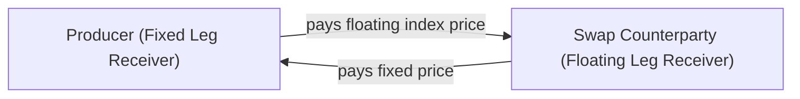

## 13.2 Commodity Swaps

Commodity swaps are fascinating financial instruments that let you trade the price risk (or price opportunity) associated with physical commodities—like crude oil, natural gas, metals, or agricultural products—without ever needing to store barrels of oil in your garage or keep a silo full of wheat in your backyard. I remember the first time I heard about commodity swaps. I was at a trading firm, and the head of risk management said something like, “Well, we can't easily store all that natural gas physically, so let's just swap the price.” And for a moment, I was like, “Um, how do we do that exactly?” It’s amazing how these paper-based contracts can be so essential to real-world logistics. So let’s dive in.

Commodity swaps are agreements where one side pays a fixed price over a certain period for a specific commodity, while the other side pays the floating or market-indexed price. It’s a classic meeting of two needs: one party wants price certainty (like a producer or consumer of the commodity), while the other might want exposure to the commodity’s price variability (often a speculator or an institution needing diversification). Anyway, before we get lost in the details, let’s break it down step by step.

### Understanding the Basics

A commodity swap involves two legs:
• The Fixed Leg: One party pays a fixed amount (per unit) of the commodity—think of it as locking in the price.  
• The Floating Leg: The other party pays a price that references a known benchmark (like WTI for crude oil, Henry Hub for natural gas, or the LME index for metals).

So, if you’re an oil producer, maybe you want to ensure that for the next year you sell your oil at a flat US$70 per barrel. You agree to a commodity swap with a financial counterparty (like a bank or trading company). Every month, on a notional volume (say 10,000 barrels), you settle the difference between US$70 and the actual market price. If the price soars to US$80, you pay the difference because you effectively “sold” it at US$70. If it collapses to US$60, you’re protected, because the counterparty compensates you for the shortfall. No barrels exchange hands—just money.

#### Hedgers and Speculators  
• Hedgers: Let’s say you’re an oil producer worried about a price drop. Locking in a fixed swap price ensures stable cash flow. A consumer, like a utility, might likewise want to lock in future fuel costs to avoid those stomach-churning volatility swings.  
• Speculators: A speculator who thinks the price will rise might be happy to take the floating leg—collecting gains if the index goes higher than the agreed-upon fixed price. However, they risk losing if the index falls below the fixed price.

### Key Advantages

• No Physical Delivery: With a commodity swap, you rarely (almost never) deliver the actual commodity. Settlement is typically in cash. Heck, given how complicated it can be to transport or store many commodities, who wants to manage that headache if you’re just interested in the financial aspect, right?  
• Tailored Hedging: Commodity swaps can be custom-designed to meet specific volume, price, and duration needs. That’s a big plus for large businesses with unique operational requirements.  
• Potential Cost Savings: By avoiding the operational costs of physical delivery (storage, insurance, shipping, you name it), counterparties can reduce overall expenses.  
• Efficient Exposure: For financial entities wanting to bet on or hedge commodity price moves, swaps often provide a simpler route than holding or trading large futures positions.

### Real-World Example

I once worked with a metal fabrication company that used large amounts of aluminum. They hated how the price jumped all over the place. A big price spike could cripple their margins. So they entered into a commodity swap with a bank: paying a fixed leg that mirrored the aluminum LME index. Each month, they’d settle up the difference in cash. If aluminum soared, they’d lose on the swap’s net payments, but at least their actual aluminum purchases stayed the same. Overall, the net effect was stable—and for them, that peace of mind was priceless.

### Mechanics of Commodity Swaps

Despite their behind-the-scenes nature, commodity swaps are fairly straightforward from a mechanical standpoint.

1. Agreement on Notional Amount: The parties begin by determining the product (e.g., crude oil), quantity, and timeline (e.g., monthly settlement for one year).  
2. Determination of Fixed Rate: They’ll negotiate a “fixed price” (like US$70/barrel) based on market expectations, current spot prices, futures curves, and the risk premium demanded by the floating-leg counterparty.  
3. Floating Leg Index: The reference index is specified (e.g., WTI spot price, LME price for aluminum).  
4. Settlement Frequency: They set times (like monthly or quarterly) to settle. Usually, net cash changes hands.  
5. Net Cash Settlement: At settlement, if the floating price is above the fixed, the fixed payer owes the floating payer. If the floating price is below the fixed, the floating payer owes the fixed payer.

#### Mermaid Diagram: Payment Flows

Below is a simple flowchart of how the cash flows might look between two parties, labeling each node carefully:

In many cases, it’s just netted out as one payment. The diagram is conceptual—it shows the two directions of cash. In reality, the net difference is all that’s actually exchanged.

### Pricing Considerations and Benchmark Indices

Pricing a commodity swap often boils down to your expected future price of the commodity plus any risk premiums for credit, liquidity, or seasonal factors (particularly in energy commodities). Let’s say for a U.S. natural gas swap referencing Henry Hub. Parties look at the forward curve in the futures market, weigh in any supply or demand factors (heating seasons, production expansions, pipeline capacity issues), and then figure out a fair fixed rate.

Common benchmark indices include:  
• West Texas Intermediate (WTI) for crude oil.  
• Henry Hub for natural gas.  
• London Metal Exchange (LME) indices for metals like aluminum, copper, or nickel.  
• Various agricultural indices (such as the Chicago Mercantile Exchange references for corn, wheat, soybeans, etc.).  

If a Canadian energy swap references Western Canadian Select (WCS) crude, they’ll incorporate local market differentials too. So basis risk can creep in if your actual commodity price doesn’t exactly track the index. For example, if you’re in a location with supply bottlenecks, your local price might differ from a widely-used benchmark.

### Settlement and Credit Risk

Settlement in commodity swaps is almost always cash-based, which is super convenient if you’re, say, a trader at a desk in downtown Calgary and not on a drilling platform in the middle of nowhere. However, because these are typically over-the-counter (OTC) transactions, you do have to trust your counterparty to keep their word. If they default, you might be left in the lurch. 

#### Ways to Mitigate Credit Risk  
• **Clearing**: Some commodity swaps can be cleared through a derivatives clearing organization, which acts as the middleman. That’s analogous to how futures are cleared on an exchange. You post margin with the clearinghouse, not with the other party directly.  
• **Collateral**: In bilateral arrangements, counterparties might post collateral, adjusted daily or weekly, to cover changes in the swap’s value.  
• **Credit Support Annex (CSA)**: Under an ISDA Master Agreement, many parties have a CSA that spells out the collateral mechanics, thresholds, and haircuts.

### Application in Canadian Markets

Now, if you’re in Canada, you might be using commodity swaps for energy, agriculture, or metals that are vital to our economy. Commodity swaps are integrated into the broader financial system under the oversight of the Canadian Investment Regulatory Organization (CIRO) for dealer members. Under CIRO guidance, many of these swap transactions have mandated reporting to trade repositories, as required by Canadian Securities Administrators (CSA) rules—particularly National Instrument 94-102. 

#### CIRO Margin Guidelines  
CIRO’s Rule Book outlines margin requirements for derivatives. Even though these are OTC products, the spirit is ensuring enough capital or liquid collateral is in place to mitigate systemic risk. If you’re part of a CIRO member firm dealing in commodity swaps, make sure you reference their margin guidelines. 

#### Reporting Obligations  
National Instrument 94-102 states that transaction details (counterparties, notional amounts, settlement, etc.) must be reported to an approved trade repository. This ensures regulators track large derivative exposures and can intervene if the system is under stress. For more details on official guidelines, check out the CSA site (https://www.securities-administrators.ca/) or CIRO’s official website (https://www.ciro.ca).

### Hedging Strategies

Producers and consumers are the big players. Producers (like oil exploration companies) hedge against falling prices. Consumers (like airlines or transportation firms) hedge against rising prices. Let’s highlight a straightforward scenario:

• **Oil Producer Hedge**: Suppose an Alberta-based oil producer wants to lock in current prices for six months. They enter a swap as the fixed-price receiver (floating-price payer). If the market price for WTI falls from US$70 to US$60, they’ll receive the US$10 difference on their notional volume from the swap. This effectively keeps their realized sales price near US$70.  

• **Airline Hedge**: A commercial airline, worried about jet fuel costs, might use a commodity swap referencing a refined products index. They become the fixed-price payer (floating-price receiver). If jet fuel prices spike, they benefit from the swap to offset the higher operating cost.  

### Speculative Opportunities

You might say, “Wait, why would a speculator want to do this?” Because if they anticipate significant price moves, a commodity swap can let them directly gain or lose based on that forecast without handling a futures margin account or physical delivery. Banks, hedge funds, or other investors might jump in because they think, for example, gas prices are going to surge during a harsh winter, or oil prices will plummet due to oversupply. Commodity swaps are typically customized, so the speculator can negotiate specific terms, volumes, and settlement schedules that suit their market outlook.

### Basis Risk

Commodity swaps aren’t a magic bullet. If your actual underlying commodity isn’t perfectly aligned with the benchmark used in the swap, you can still have “basis risk.” This is the difference between your local or physical commodity price and the index price used in the swap. Basis risk can sting if, for instance, the standard index moves differently than your local market. 

Example: A gas producer in Western Canada might see local pipeline constraints cause big price discounts relative to Henry Hub, which is the U.S. benchmark. If your swap is pegged to Henry Hub, but your realized price is at a more severely discounted local marker, the hedge might be less effective.  

### Margin Requirements

In an OTC setting, margin requirements for commodity swaps are typically governed by your bilateral agreement or mandated under regulation. Margin can be posted as cash or safe collateral, generally in proportion to your net exposure. This can be re-evaluated daily or weekly; if the mark-to-market value of the swap moves against you, you need to top up your margin. If you fail to do so, your counterparty might have the right to close out the position. 

Under current CIRO guidelines, dealer members must hold adequate capital for their open swap exposures. Meanwhile, clearinghouses (for cleared swaps) set standardized margin rules akin to futures. And while margin calls can feel like an annoyance (or a panic) for some businesses, they’re critical in limiting systemic risk.

### Regulatory Landscape and CIRO Oversight

Historically, commodity swaps were largely unregulated and transacted in hush-hush bilateral negotiations. Then came post-2008 reforms in global derivative markets. In Canada, the CSA introduced a series of rules on derivative reporting, clearing, and data collection. CIRO also provides oversight for investment dealers. Now, many standardized commodity swap transactions can funnel through clearing, which helps reduce credit risk.

From January 1, 2023, the Investment Industry Regulatory Organization of Canada (IIROC) and the Mutual Fund Dealers Association of Canada (MFDA) merged into CIRO. All references to the predecessor SROs (IIROC, MFDA) are historical. CIRO is your single go-to for registration and oversight for investment dealers handling commodity swaps.

### Practical Example: Locking in Fuel Costs

Imagine you run a large trucking fleet. Your fuel expenses are a big chunk of your overhead, and maybe you’re worried that rising diesel costs will throw off your budget. One straightforward solution is to enter a “diesel swap”—effectively locking in a price on some portion of your expected diesel usage for the year. That way, you know that no matter how the market whipsaws, your largest cost driver remains predictable. 

• If diesel leaps in price, your trucking operations face higher actual fuel costs, but your floating leg of the swap also brings in a gain to offset that. Net effect: near-unchanged total cost.  
• If diesel collapses, you might lose on the swap, but you’ll pay less physically at the pump. Again, net effect: near-unchanged total cost.  

Sure, it’s not exciting in that you don’t get to “win big” if market prices tumble. But for a real business, stability might matter more.

### Common Pitfalls and Best Practices

• **Mismatch in Volumes**: If you hedge more volume than you produce or consume, you’re effectively speculating. If you hedge less, you leave some portion of exposure unprotected. Striking the right notional volume is essential.  
• **Inaccurate Benchmark**: If you pick a swap index that doesn’t match your local commodity or the timing of your exposure, you’ll face basis risk.  
• **Collateral Management**: Failing to manage your margin or collateral can lead to forced liquidations or being in default on the swap.  
• **Documentation and Legal Terms**: Commodity swaps often rely on ISDA Master Agreements, which can be complicated. Make sure your legal and compliance teams thoroughly review them.  
• **Booking Errors**: In practice, it’s easy to mis-book the details, especially if you have multiple swaps. Double-check each contract’s start date, volume, and fixed price to avoid confusion.  
• **Overconfidence in Forecasts**: If you’re a speculator, chasing that “big payoff” might lead to unintended consequences if the market goes against you.

### Tools and Resources

• **CIRO Rule Book**: Check for updated margin and capital guidelines. (https://www.ciro.ca)  
• **CSA National Instrument 94-102**: Outlines derivative trade reporting requirements in Canada.  
• **Bourse de Montréal**: Provides standardized commodity futures and options on some products (https://m-x.ca/). While not exactly the same as swaps, futures can sometimes serve a similar hedging function.  
• **Energy Risk: Valuing and Managing Energy Derivatives by Dragana Pilipovic**: A deep dive into energy derivative pricing models and risk-management strategies.  
• **Natural Resources Canada**: Offers comprehensive data on energy and minerals.  
• **U.S. Energy Information Administration (EIA)**: For open-source data on global energy markets relevant to cross-border trades.

### Putting It All Together

Commodity swaps might sound complex, but at their core, they’re about transferring risk from one entity to another in a way that keeps both parties comfortable. Maybe you’re a farmer worried about falling wheat prices or an aluminum customization shop terrified of surging input costs, or a hedge fund spotting an opportunity in the oil forward curve. Commodity swaps help transform a chaotic, volatile price environment into something more predictable—or, for speculators, create an avenue to (hopefully) profit from volatility.

They can be custom-made to match any duration, volume, or pricing index. Just remember to watch out for basis mismatches, ensure your collateral is in good order, and pay attention to the regs, especially if you’re in Canada, where CIRO wants to make sure these transactions are done responsibly. And sure, it’s a bit complicated at first, but once you see how it all fits together, you’ll realize that commodity swaps are part of everyday risk management for countless businesses—and even for some adventurous speculators.

### A Final Word of Encouragement

If you’re new to commodity swaps, don’t sweat it. Remember that an underlying logic unites all derivative products: you’re either transferring risk or taking on risk. Commodity swaps just happen to deal with everything from crops to crude. If you keep that in mind and remain attentive to the details—like volumes, durations, margins, and credit arrangements—then you’re in a good position to use these instruments effectively and responsibly.

And if you find yourself in doubt, bounce your questions off someone more experienced—like a risk manager or an industry veteran. Trust me, even the savviest traders had a first day in the commodity swaps market and probably asked plenty of “dumb” questions. It’s all part of the learning curve, so keep asking, keep exploring, and adapt the strategies to your unique situation.

---

## Sample Exam Questions: Commodity Swaps Essentials



### Which of the following statements best describes a commodity swap?
- [x] An OTC agreement where one party pays a fixed price and the other pays a floating price for a commodity.
- [ ] A standardized futures contract requiring physical delivery of a commodity.
- [ ] A type of foreign exchange swap exchanging principal in two currencies.
- [ ] A repurchase agreement used for short-term financing.

> **Explanation:** A commodity swap is an over-the-counter contract in which fixed-price payments are exchanged for payments at a floating (market-based) commodity price.

### What is the primary reason producers use commodity swaps?
- [ ] To speculate on favorable price movements in the commodity.
- [ ] To reduce margin requirements on futures trades.
- [x] To hedge against falling commodity prices and stabilize cash flows.
- [ ] To eliminate credit risk in their operations.

> **Explanation:** Producers typically enter commodity swaps to ensure predictable revenue by locking in a fixed sales price, thereby hedging against price drops.

### How does a net cash settlement in commodity swaps typically work?
- [ ] Parties exchange the physical commodity each month.
- [x] Only the price difference between the fixed and floating legs is paid in cash.
- [ ] Both parties must deposit the entire notional amount in a third-party escrow.
- [ ] A swap is automatically terminated if the commodity’s spot price goes to zero.

> **Explanation:** In most commodity swaps, the respective payments are netted out, and only the difference is paid in cash.

### Which of the following is a valid benchmark index in a commodity swap for crude oil?
- [x] West Texas Intermediate (WTI)
- [ ] Seasonal Temperature Index
- [ ] ARMs Index
- [ ] LIBOR

> **Explanation:** WTI is one of the most commonly used benchmarks for crude oil, while indices like Henry Hub reference natural gas.

### In commodity swaps, “basis risk” refers to:
- [ ] Credit exposure from posting insufficient margin.
- [ ] The risk that market volatility will wipe out the value of both legs.
- [x] The discrepancy between a hedger’s specific commodity price and the benchmark used in the swap.
- [ ] The risk of physical delivery failure.

> **Explanation:** Basis risk arises when the price of the hedger’s actual commodity varies from the reference index price.

### Which regulatory authority in Canada oversees investment dealers that engage in commodity swaps?
- [ ] IIROC (in its current form)
- [ ] MFDA (in its current form)
- [x] CIRO (formerly IIROC and MFDA)
- [ ] Canada Revenue Agency (CRA)

> **Explanation:** As of January 1, 2023, the Investment Industry Regulatory Organization of Canada (IIROC) and the Mutual Fund Dealers Association of Canada (MFDA) amalgamated into CIRO, the single self-regulatory organization.

### If an airline wants to protect itself against rising jet fuel costs, it would likely:
- [ ] Receive a fixed price and pay the floating price.
- [x] Pay a fixed price and receive the floating price.
- [ ] Enter a spread betting contract for energy.
- [ ] Buy physical futures on crude oil to ensure supply.

> **Explanation:** By paying the fixed leg, the airline locks in the price. If the actual market price rises, the swap offsets the increased cost of physical fuel purchases.

### Which of the following statements about margin in commodity swaps is correct?
- [ ] Margin is never required because all commodity swaps settle physically.
- [x] Collateral or margin may be posted to mitigate credit risk in bilaterally negotiated swaps.
- [ ] Margin calls are not permitted in OTC agreements.
- [ ] Collateral is not needed if the notional is under a certain dollar threshold.

> **Explanation:** OTC swaps often require collateral (sometimes daily) to mitigate counterparty credit risk, though the terms vary by agreement and regulation.

### What type of risk is specifically reduced by clearing some commodity swaps through a central clearinghouse?
- [ ] Basis risk
- [x] Counterparty credit risk
- [ ] Regulatory risk
- [ ] Price risk

> **Explanation:** Central clearing primarily addresses counterparty credit risk by interposing the clearinghouse as the counterparty to both sides.

### True or False: Commodity swaps typically involve taking physical delivery of the underlying commodity.
- [x] True
- [ ] False

> **Explanation:** Despite sounding contradictory, it’s actually “False” that they involve physical delivery. The typical arrangement is cash-settled. Probably best to read the question carefully—commodity swaps nearly always settle in cash, not in physical barrels or bushels.


