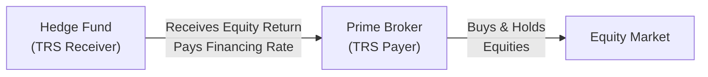

## 13.3 Equity Total Return Swaps (Uses in Synthetic Prime Brokerage)

Imagine you’re sitting in a café with a friend who runs a small hedge fund. Over lattes, they excitedly explain how they gain “synthetic” exposure to certain stocks—without actually touching or directly holding those shares—and I remember thinking: “That’s pretty wild, because it sounds like magic!” Well, it’s not magic; it’s called a total return swap (TRS). Let’s explore what an equity TRS is, how it works, and why it plays a central role in something more mysterious-sounding known as “synthetic prime brokerage.”

Understanding Equity Total Return Swaps  
A total return swap is a bilateral contract in which one party (the receiver) obtains the total economic return of a reference asset—like a stock or a basket of stocks—while the other party (the payer) effectively provides that return in exchange for a financing rate. When we say “total economic return,” we mean any price changes plus cash flows such as dividends or distributions. In other words, if the stock’s price goes up, the receiver pockets that gain. If it goes down, they’re on the hook for that loss (and might be cursing their timing). Meanwhile, they’ll also earn (or owe) any dividends that get paid during the term of the TRS.

Because this arrangement allows the receiver to gain or lose exactly as if they owned the stock—without taking legal title to the shares—equity TRS are often used by hedge funds and institutional investors for “synthetic” exposure. Compared to physically buying shares via margin, an equity TRS can be more cost-effective in certain situations, and it offers anonymity because the prime broker (or total return payer) typically appears as the actual owner of the shares on the market.

How Synthetic Prime Brokerage Works  
Synthetic prime brokerage is the practice where a hedge fund, or any sophisticated investor, gains access to long or short positions in various equities, indexes, or baskets of securities by entering into derivatives contracts—often total return swaps—with a prime broker or dealer. Instead of borrowing money to buy the shares in a margin account (as in a traditional prime brokerage arrangement), the hedge fund enters into a TRS where the prime broker legally holds the underlying shares. The hedge fund receives the total return. In return, the hedge fund pays a financing rate—usually a floating rate such as LIBOR + spread or CORRA + spread. Sometimes it’s a fixed rate, but floating is more common.

It’s much the same as having a good friend buy the stock for you. You agree to pay them interest on the money they used to buy it, and they funnel you whatever gains and dividends come from that holding. If prices plunge, you owe them that loss, and you’re still on the hook for interest. Synthetic prime brokerage is handy if you want leveraged equity exposure but prefer not to tie up large amounts of capital or publicly show ownership. However, it can also obscure who really has exposure to which shares—a point that regulators keep keen eyes on.

Key Differences: Equity Swaps vs. Total Return Swaps  
Even though the terms “equity swap” and “equity total return swap” are often used interchangeably, there’s a subtle distinction:

• Equity Swap: May only reference the price appreciation or depreciation of the stock/index.  
• Equity Total Return Swap (TRS): Includes price changes plus any dividends or distributions.  

When someone says “equity swap,” it might just mean the return from price movements, without dividends. But in a full-blown TRS, the investor gets the entire economic return, including the yield from dividends. This is popular because many equity investors care as much about dividends as they do about price gains.

Basic Mechanics of Payments  
In an equity TRS, you’ll typically see something like this:

• TRS Receiver (e.g., a hedge fund) gets:  
  – (Sᵣ – S₀) → change in the underlying share price from start to current.  
  – Dividends or any declared distributions.  

• TRS Receiver pays the TRS Payer:  
  – A financing cost (floating or fixed), often multiplied by the notional value of the shares.  

• TRS Payer (e.g., a prime broker) is on the opposite side.  
  – They provide the equity return to the receiver.  
  – They receive an interest-based stream.  

The net payment may occur at regular intervals (monthly or quarterly) or at maturity. Let’s formalize that as a little KaTeX snippet:


\text{Net TRS Payment to Receiver} = (\Delta P + D) - (\text{Financing Cost})


Where:  
• ΔP = change in price of the underlying from the start of the contract  
• D = dividends or distributions paid during the contract  
• Financing Cost = interest rate (e.g., CORRA + a spread) × notional × time

In a rising market, the TRS Receiver celebrates gains, net of interest costs. In a down market, it’s a different tale—losses must be paid out to the Payer, plus any financing. It’s definitely not a free lunch.

A Visual Overview  
Here’s a quick diagram (using Mermaid.js) that illustrates who pays what to whom in an equity total return swap:

• The Hedge Fund negotiates and enters the swap with the Prime Broker.  
• The Prime Broker is the legal owner of the equities in the broader market.  
• The Hedge Fund gets the total return (price movement + dividends), paying the Prime Broker an agreed financing rate.

Regulatory and Economic Rationale  
From a bank’s perspective (the prime broker), TRS might offer certain regulatory capital advantages. Instead of lending money outright to a client who then buys equities, the prime broker can keep these positions on their own balance sheet, offset by the swap. Depending on jurisdiction-specific capital regulations, this can reduce certain capital charges. But regulators are savvy to it. Over the years, they’ve tightened guidelines around derivatives exposures, so the advantage—while still present—has narrowed.

In Canada, CIRO (the Canadian Investment Regulatory Organization) oversees investment dealers’ risk management, margin rules, and regulatory compliance. They’ve got plenty of guidelines about prime services, large exposure monitoring, and margin constraints. Meanwhile, the Canadian Securities Administrators (CSA)—which coordinate provincial securities commissions—have mandated transparent reporting of swap transactions through trade repositories. This is all about preventing “hidden leverage” from accumulating in corners of the market without regulators knowing.

Hidden Leverage and Its Risks  
Leverage is something you often see in bold disclaimers—“Leverage can magnify gains, but also magnify losses.” TRS arrangements can act like borrowed money. The hedge fund invests a small slice of capital for collateral or margin, obtains exposure to a big notional chunk of equities, and—voilà—hidden or synthetic leverage. If markets move sharply, these positions can blow up just as drastically as if the hedge fund had borrowed funds to buy stock directly. Regulators worry that large, leveraged exposures can catch the market by surprise if they unwind suddenly.  
   
Furthermore, credit risk is a factor: if the hedge fund goes belly-up, the prime broker might be stuck with an uncollateralized or under-collateralized loss. Conversely, if the prime broker fails, the hedge fund might lose the beneficial return on the equities (or posted collateral). Typically, an International Swaps and Derivatives Association (ISDA) Master Agreement spells out who posts collateral, how often margin calls happen, and what happens in a default scenario.

Why Use Synthetic Prime Brokerage?  
If you’re still wondering, “Why not just buy the shares directly?” there are a few big reasons:

• Lower Transaction Costs: Instead of paying commissions for each trade in the physical equities, a hedge fund might find it cheaper to enter a single TRS for broad exposure.  
• Anonymity or Confidentiality: The prime broker (or intermediary) is the registered owner. This might be valuable for a fund that wants to build positions without broadcasting them to the market.  
• Operational Efficiency: Managing margin, custody, and short-sale constraints is simpler with a total return swap. The prime broker typically handles stock loans, financing, settlement, and all that behind the scenes.  
• Global Markets Access: If a hedge fund wants to gain exposure to foreign stocks, dealing with local market access issues (e.g., registration, currency controls) can be complicated. A TRS might sidestep some of those hurdles.  
• Potential Regulatory Capital Efficiency: This helps prime brokers manage their balance sheets in line with capital rules.

Collateral Posting and Margin  
Almost every TRS arrangement includes a collateralization process. Both parties might post collateral, but predominantly, the hedge fund is expected to have “skin in the game.” The prime broker will set initial and variation margin requirements based on volatility, creditworthiness, and internal risk models. If the underlying stock or index swings in value, margin calls can occur. So, if you were imagining a cloud of magical exposure with no money down—sorry to burst your bubble—there’s always some form of security guarantee.

Trade Repositories and Reporting  
In the aftermath of the 2008 financial crisis, global regulators demanded more transparency in over-the-counter (OTC) derivatives. Equity total return swaps fit nicely into that category. In Canada, the CSA requires that TRS transactions be reported to recognized trade repositories. CIRO-member dealers must also keep internal records for large exposures, ensuring they can quickly respond to any regulator queries.

Practical Example  
Let’s role-play a simplified scenario. Suppose a hedge fund, Maple Leaf Capital, wants exposure to a hypothetical stock—Canadian Tech Giant Inc. (CTGI). Maple Leaf Capital believes CTGI stock is going to outperform the market in the next six months. Instead of purchasing, say, $50 million worth of CTGI shares directly, Maple Leaf Capital enters a six-month TRS with Great North Bank (the prime broker).

1. Great North Bank purchases $50 million worth of CTGI stock.  
2. Maple Leaf Capital enters the swap, paying an annualized interest rate of CORRA + 1.5%. On a notional of $50 million, that’s (CORRA + 1.5%) × $50 million × (6/12) for the six-month period.  
3. Maple Leaf Capital also posts initial collateral of $10 million to secure potential losses.  
4. Over six months, CTGI appreciates 8%, and it pays a 2% dividend yield on an annualized basis. Maple Leaf Capital’s total return is effectively 8% (price appreciation) + 1% (the portion of the annualized dividend yield for half a year) – financing cost.  
5. If CORRA is 3.0%, total financing is 4.5% annual rate for the six months = about 2.25% for that half year. Net gain is 8 + 1 – 2.25 = 6.75% on $50 million notional, or $3.375 million.  
6. Because Maple Leaf Capital only posted $10 million as initial collateral, it’s leveraged 5-to-1. Return on posted collateral is significantly higher, albeit with more risk.

Of course, real swaps can be more intricate. Dividends might be paid monthly or quarterly in a lumpsum, financing might reset daily, margin calls can happen if the stock plummets—and so forth.

Counterparty Considerations  
Counterparty credit risk is always lurking. Both sides worry about the other’s solvency. To mitigate this, they might net exposures using a Credit Support Annex (CSA) under the ISDA Master Agreement. Netting means if the same two parties have multiple swaps or other derivative trades, the exposures can be offset, which reduces overall credit exposure.

Best Practices and Risk Management  
• Diversify your prime brokers. Some hedge funds prefer not to put all their eggs in one basket, in case a single prime broker runs into trouble.  
• Monitor liquidity. If large positions must be unwound quickly, the underlying shares’ liquidity can significantly impact total recouped value.  
• Stress test for big moves. Hedge funds should run scenario analyses: “What happens if the stock drops 20% overnight?” That ensures you’re prepared for margin calls.  
• Watch for concentration limits. Regulators (including CIRO) want to know if you have huge exposure to a single stock or correlated basket.  
• Keep robust documentation. All of the details belong in the ISDA Master Agreement plus any specific schedules or credit support annexes.  

Regulatory Nuances in Canada  
Effective January 1, 2023, what used to be IIROC (for investment dealers) and the MFDA (for mutual fund dealers) has amalgamated into a single self-regulatory organization, CIRO. CIRO’s oversight includes ensuring dealers comply with margin requirements, large exposure reporting, and conduct rules around derivatives. They’ve introduced consistent guidelines for trade reporting, position limits, and risk disclosures. Although some references still talk about “IIROC rules,” those are historically relevant. Today, CIRO is the name. Book readers in the future: keep an eye on the CIRO website (https://www.ciro.ca) for the latest updates.

Additionally, the CSA coordinates the regulatory framework for all derivatives across the provinces, including reporting to recognized trade repositories. If you’re structuring a TRS in Canada, you’ll likely abide by CSA data reporting requirements, plus local provincial derivatives rules. The big theme? Make sure the regulators know about your exposure, so that no single entity can build up systemic leverage under the radar.

Examples of Tools and Frameworks  
For those who love coding side projects, you might want to simulate TRS payoffs or “what if” scenarios. Python libraries like QuantLib or PyPortfolioOpt let you model derivatives strategies, backtest hypothetical outcomes, run scenario analyses, and price complicated instruments. R has libraries like “RQuantLib” or “PerformanceAnalytics” that handle portfolio-level analytics, risk metrics, and more. Absolutely recommended if you, like me, get a kind of nerdy thrill from tinkering with numbers. (I once built a little model in Python that tested how a total return swap would play out if Canadian Tech Giant Inc. had different volatility levels—and it was an eye-opener.)

Reference Resources for Further Reading  
• CIRO: The official site https://www.ciro.ca – for regulatory guidance, margin rules, and approved participant documentation.  
• CSA Notices: Check your provincial regulator’s website or the CSA site for official bulletins on OTC derivatives reporting.  
• ISDA Master Agreement: The standard documentation for derivatives, widely used for negotiating total return swaps globally.  
• “Mastering Total Return and Credit Default Swaps” by Andrew Kasapis – an excellent specialized resource for more advanced deep dives.  
• Python Libraries “PyPortfolioOpt” and “QuantLib” for building and testing derivative strategies.  
• R packages “RQuantLib,” “PerformanceAnalytics,” and “quantmod” for financial modeling.  

Conclusion  
Equity total return swaps are a vital tool in the derivatives world, used extensively by hedge funds and other institutional investors to obtain leveraged exposure without physically owning shares. They exemplify how financial engineering can create efficient markets, reduce transaction costs, and provide flexible solutions. But they also pose hidden leverage and credit risks, which is why regulators in Canada and around the globe keep close watch. For aspiring traders, portfolio managers, or finance gurus, mastering how these TRS structures work—and understanding the inherent risks—is key to staying competitive (and prepared) in today’s fast-evolving capital markets world.

So, next time you hear someone say, “I just went long $50 million of that stock synthetically,” you’ll know they probably didn’t wave a magic wand. Instead, they’re using an equity total return swap to tap into the “total economic return” from behind the scenes.

## Sample Exam Questions: Equity Total Return Swaps and Synthetic Prime Brokerage



### Which of the following best describes a key feature of an equity total return swap?

- [ ] It only pays the investor the price appreciation of the underlying stock, excluding dividends.  
- [x] It pays the investor both the price appreciation (or depreciation) and any dividends of the underlying stock.  
- [ ] It includes only the dividends and not the price movement of the underlying stock.  
- [ ] It requires no collateral to be posted by either party.  

> **Explanation:** A total return swap provides the “total” economic return, meaning both price changes and dividends or distributions are included.

### In a synthetic prime brokerage arrangement using total return swaps, which party typically holds legal title to the underlying shares?

- [ ] The hedge fund client or TRS receiver holds the legal title.  
- [x] The prime broker (the TRS payer) holds legal title.  
- [ ] Both the hedge fund and the prime broker share legal title.  
- [ ] Legal title is transferred to a custodian or depository bank.  

> **Explanation:** In synthetic prime brokerage, the prime broker is the registered (legal) owner of the shares. The hedge fund gains the economic exposure via the swap agreement.

### What is one primary reason why hedge funds and dealers use an equity TRS instead of a direct margin loan?

- [ ] They prefer to hold the physical shares on their books.  
- [ ] It eliminates all credit risk to the prime broker.  
- [x] It can be more cost-effective, offers anonymity, and may provide favorable regulatory capital treatment.  
- [ ] It guarantees profits for both parties if properly structured.  

> **Explanation:** TRS arrangements can reduce certain transaction costs, help preserve anonymity, and potentially offer regulatory capital benefits. However, none of these instruments guarantees profits; losses can occur.

### In Canada, which regulatory authority currently oversees the activities of investment dealers that offer synthetic prime brokerage and total return swaps?

- [ ] The Investment Industry Regulatory Organization of Canada (IIROC).  
- [x] The Canadian Investment Regulatory Organization (CIRO).  
- [ ] The Ontario Securities Commission (OSC) alone.  
- [ ] The Mutual Fund Dealers Association of Canada (MFDA).  

> **Explanation:** CIRO became Canada’s single self-regulatory organization on January 1, 2023, consolidating the functions previously held by IIROC and MFDA.

### Which component is typically included in a total return swap’s payout to the receiver?

- [x] Price appreciation plus dividends of the underlying, minus financing costs.  
- [ ] Fully guaranteed return, regardless of the underlying share price.  
- [ ] Fixed interest payments independent of the underlying performance.  
- [x] The possibility of negative returns if the underlying depreciates.  

> **Explanation:** The TRS receiver realizes gains or losses from price movements plus dividends, offset by the financing costs. There is no guarantee of a positive return.

### What best describes “hidden leverage” in the context of total return swaps?

- [ ] Leverage that is calculated based on reported margin but is visible to all market participants.  
- [ ] Visibility of the leverage in real-time feeds to regulators.  
- [x] Leverage embedded within derivative structures that can amplify gains or losses without appearing as traditional debt financing on balance sheets.  
- [ ] A phenomenon unique to listed options, rather than OTC swaps.  

> **Explanation:** Total return swaps allow an investor to control a large notional exposure by posting only margin or collateral, creating leverage that may not be easily spotted as a traditional loan or margin balance.

### Which of the following statements best captures a risk factor in total return swaps?

- [x] A prime broker’s default could result in losses for the hedge fund receiver.  
- [ ] TRS positions are never subject to margin calls.  
- [x] TRS can be terminated early if collateral requirements are not met.  
- [ ] Dividends are always paid directly to the hedge fund’s bank account.  

> **Explanation:** As an OTC contract, both parties face counterparty credit risk. If one side defaults (e.g., the prime broker), the other may be exposed to losses. TRS arrangements also have margin call provisions, and early termination can occur if either party fails to meet margin or contractual obligations.

### Which regulatory framework requires trade reporting for Canadian total return swaps?

- [ ] Only CIRO rules apply, no need for trade repositories.  
- [ ] No regulatory authority manages derivatives trades in Canada.  
- [ ] The Federal Department of Finance exclusively.  
- [x] The CSA’s reporting requirements, including recognized trade repositories.  

> **Explanation:** The CSA mandates that OTC derivative transactions, including total return swaps, be reported to a recognized trade repository. CIRO rules also govern how member dealers must handle and record these trades.

### What is a notable benefit of netting arrangements (under an ISDA Master Agreement) for TRS participants?

- [ ] They eliminate the need for any collateral postings whatsoever.  
- [ ] They guarantee that each party’s net exposure is always zero.  
- [x] They reduce credit exposure by offsetting gains and losses across multiple trades between the same counterparties.  
- [ ] They exempt both parties from any regulatory reporting requirements.  

> **Explanation:** Under the ISDA framework, netting allows participants to offset reciprocal payment obligations so that only the net amount changes hands, lowering each side’s credit exposure.

### True or False: Under a total return swap, the receiver only profits from the upward price movements and does not bear any losses from downward movements.

- [x] True  
- [ ] False  

> **Explanation:** Actually, this statement as written is false. Under a TRS, the receiver has the full economic exposure. If the underlying stock falls in price, the receiver incurs losses. (So the correct answer to the statement “Under a total return swap, the receiver only profits…” is that it is false, but since this question’s answer format is reversed, the correct answer here is that the statement is untrue.)


