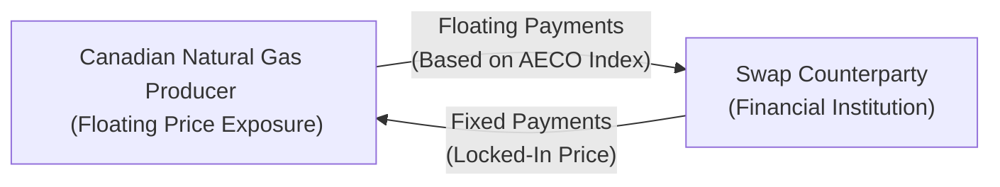
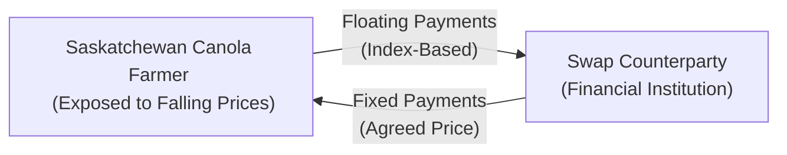

## 13.4 Canadian Energy & Agricultural Commodity Swaps

It’s funny how sometimes you don’t realize the hidden complexities behind everyday essentials—like filling your gas tank or buying a bag of flour—until you take a deep dive into the financial instruments that help keep prices stable. You know what I mean: the bread, the cereal, the fruits, the veggies, the fuel that powers our cars, all that stuff. Here in Canada, we’re heavily reliant on the energy and agricultural sectors. Each sector faces regular price swings driven by international supply-and-demand factors, unexpected weather changes, pipeline constraints, or simply market sentiment. 

In this article, we’ll talk about one of the less flashy but incredibly important financial tools used by producers, processors, and end-users to manage price volatility: commodity swaps. Specifically, we’ll focus on Canadian energy swaps (like crude oil and natural gas) and agricultural commodity swaps (like wheat and canola). Let’s explore how these swaps work, why they’re critical to Canada’s economic landscape, and how you might even benefit from them—indirectly, at least—every time you fill up your car or shop for groceries.

Understanding commodity swaps can be your next step in mastering the broader range of derivative products. If you’ve dabbled in (or read about) futures and options, you’ll notice some similarities, although swaps often offer more customization and can be executed over the counter (OTC). As we discussed in earlier chapters on swaps, these contracts let two parties exchange financial obligations, typically in the form of floating prices for fixed prices, to hedge or speculate on the cost of a given commodity. Let’s dive deeper.

Introduction to Canadian Energy & Agricultural Commodities  
Many folks don’t realize that Canada is a global heavyweight in both energy and agriculture. We boast the Alberta oil sands, abundant natural gas reserves, vast farmland in the Prairies, advanced refining capabilities, and a well-established infrastructure that supports everything from commodities trading to pipeline transport. Yet with that strength comes risk. Global fluctuation in energy or grain markets can send shockwaves through any Canadian budget—be it the local farmer’s or a multinational oil company’s.

Energy & Agricultural Commodity Swaps: A Quick Overview  
A commodity swap is essentially a contractual agreement between two counterparties to exchange (or “swap”) cash flows related to the price of a commodity. Typically, one party pays a fixed price to the other, while receiving a variable (or floating) price based on an agreed-upon benchmark index. It’s a hedge against market shifts, a way to lock in margins or costs, and a vital risk management approach for large commercial entities.

Swaps differ from futures in that they are often privately negotiated, can be more flexible in structure, and might not trade on an organized exchange. Thanks to the continued evolution of the regulatory landscape, certain standardized swaps (especially for energy) can be cleared through recognized clearinghouses, helping reduce counterparty risk. CIRO (the Canadian Investment Regulatory Organization) enforces daily or weekly mark-to-market valuations for these swaps, ensuring that counterparties regularly exchange variation margin to keep credit exposures in line.

Why Are These Swaps So Important in Canada?  
• Price Volatility: Commodity prices are famously unpredictable. Weather disruptions, geopolitical tensions, shipping bottlenecks—take your pick. Swaps help offset some of this chaos.  
• Economic Impact: Energy and agriculture are big slices of the Canadian economy, so protecting those slices from dramatic swings is essential to overall economic stability.  
• Tailored Hedging: Think pipeline constraints or localized weather disasters. Conditions like these can drastically affect local markets. Swaps can be tailored to these unique circumstances—more so than standardized futures.  

Clearing vs. OTC for Canadian Commodities  
The question of whether a commodity swap is cleared on an exchange or settled bilaterally (OTC) often comes down to standardization. For example, certain energy swaps might be standardized around the AECO hub (a prominent natural gas hub in Alberta) or around the West Texas Intermediate (WTI) benchmark price if referencing crude oil. Agricultural swaps may use reference points like canola futures prices on ICE or wheat prices in Winnipeg. But let’s say you’re a wheat processor in Saskatchewan who needs a hedge that factors in your specific storage costs, a unique pipeline or rail transport constraint, or a specialty grade of grain—your swap will likely remain OTC. 

With CIRO increasingly emphasizing transparency and risk controls, the market is moving to encourage central clearing where feasible. This reduces counterparty credit risk, as the clearinghouse steps in between the two trade parties. However, many participants will still choose bespoke OTC swaps for specialized conditions.

Energy Swaps in Canada: The Nuts and Bolts  
At first glance, energy swaps rely on the same principle as any other commodity swap: exchanging floating price exposure for a fixed price (or vice versa). But in Canada, certain nuances apply, such as:  

• Natural Gas Hubs: Our famous AECO hub in Alberta is a benchmark used to price Canadian natural gas. Shipping capacity, pipeline tolls, and local demand can make AECO prices differ from, say, Henry Hub prices in the U.S. This difference is often called a basis differential.  
• Oil Benchmarks: Canadian crude can be benchmarked as Western Canadian Select (WCS). It can trade at a discount to global benchmarks like WTI or Brent, reflecting quality and transportation costs.  
• Pipeline Constraints: Transporting gas or oil to major markets might be constrained by pipeline capacity, leading to regional price dislocations. A producer might enter a swap to mitigate basis risk (the gap between local and global prices).  
• Seasonality: Demand for natural gas spikes in winter for heating. If your portfolio is heavily exposed to natural gas prices, you could face drastically different price levels from summer to winter.  

Imagine you’re a small natural gas producer in Alberta. Your daily revenue is pegged to AECO spot prices, which can be extremely volatile. One year, AECO might plunge if pipeline expansions are delayed or if new supply floods the market. You could enter a swap with a financial institution to lock in a steady, fixed price for your expected monthly production. They pay you a price based on AECO (the floating index), and you pay them a pre-agreed fixed rate. If spot prices crash, you come out ahead on the swap (the difference helps offset your lower cash market revenues). If spot prices spike, well, you’ve locked in a lower revenue, but you presumably reduced your overall risk.  

Here’s a simple mermaid diagram that visually represents an energy swap between a Canadian gas producer and a financial institution:

Agricultural Commodity Swaps: The Heartland Factor  
Agriculture is the lifeblood for many regions in Canada, especially the Prairies. Farmers often face the unpredictability of weather, pests, and changing market conditions. That said, it’s not just the farmer—grain elevators, processors, food manufacturers, and agribusinesses all have skin in the game. An agricultural commodity swap, in broad strokes, looks and acts similarly to an energy swap: one side pays a fixed price for a commodity, and the other side pays or receives a floating price based on an index or benchmark.  

• Benchmarking: Agricultural swaps often reference futures prices for crops like canola, wheat, or corn. In Canada, the ICE canola contract is a common reference, and for wheat, local references in Winnipeg or broader global references might come into play.  
• Weather Sensitivity: Crop yields and planting patterns can dramatically shift—even overnight—due to frost or rainfall. If you’re a wheat miller needing a steady supply at a predictable cost, you can use swaps to fix your input prices, removing some of the stress from your P&L.  
• Regional Hubs and the Canadian Grain Commission: The CGC sets standards for grain handling, but it can also influence the uniformity (or lack thereof) of pricing across regions. Commodity swaps can factor in differences in grade, location, or shipping costs.  

Let’s say a canola farmer in Saskatchewan is concerned about the upcoming harvest. If prices dip post-harvest because of a bumper crop, they might lose revenue. By entering into a swap to receive a fixed price and pay the floating rate, they lock in their profitability. Alternatively, if prices shoot up, they won’t benefit from the higher spot price, but that’s the trade-off for stable revenue in an uncertain world.  
 
Below is a mermaid diagram depicting an agricultural swap for canola:

Factors Driving Volatility in Canadian Commodities  
Weather patterns: Canada can see extreme temperature swings, late-season snowstorms, or flooding, all of which alter supply outlooks.  
Transportation constraints: Rail capacity for moving grain or pipeline capacity for oil and gas can cause regional oversupply if shipments bottleneck, thus affecting local prices.  
Market demand changes: A global downturn can lower energy demand, whereas a booming global economy might push up demand for Canadian agricultural exports.  
Geopolitical events: Trade embargoes, tariffs, or conflicts can cause big price swings seemingly overnight.  

Margin, Mark-to-Market, and Regulatory Requirements  
Swaps aren’t risk-free. CIRO requires daily or weekly mark-to-market (MTM) for many commodity swaps. That means the swap’s value is recalculated at preset intervals to reflect prevailing market prices, and variation margin is exchanged to ensure both parties remain adequately collateralized. This helps limit the credit risk if one side of the trade drastically loses money.  

At a high level, margin calls are triggered when the daily (or weekly) valuation moves against a position. In energy or agriculture, that can happen quickly if a surprise pipeline outage or a record harvest suddenly shifts the balance of supply and demand.  

You must also ensure trades are reported to recognized trade repositories in compliance with CSA regulations. In addition, thorough know-your-client (KYC) processes help confirm that commercial hedgers are indeed hedging legitimate risk, rather than speculating beyond their capacity.

Hedge Accounting and Financial Reporting  
A short note for folks dealing with corporate balance sheets: hedge accounting can be a big motivator to use swaps. When a hedge qualifies under IFRS or other accounting frameworks, it allows you to offset gains or losses on the derivative with the losses or gains on the hedged item. This can provide more stable, less volatile earnings on your financial statements—something shareholders often appreciate.  

Transportation Swaps and Basis Differentials  
In Canada’s energy domain, pipeline or transport constraints mean the local price at AECO can differ significantly from Henry Hub in the U.S. Or the price for one grade of wheat in Manitoba might differ from the price in the Port of Vancouver due to rail constraints. Commodity swaps can not only fix a price but also manage that basis differential if it’s included in the swap design. Sometimes you’ll hear references to “transportation swaps,” which specifically target those transport cost exposures.  

Practical Example – Natural Gas Producer Hedge  
Let’s flesh out a more detailed example. Suppose you’re a junior natural gas producer in Alberta, with an expected daily production of 2,000 gigajoules (GJ) over the next six months. AECO spot prices are around $3.00/GJ today, but you’re worried about new pipelines coming online that could increase supply, pushing the AECO price down. You enter into a six-month swap with a financial institution for a fixed price of $2.95/GJ.  

In this swap:  
• You pay the floating price (the actual AECO daily index) to the counterparty.  
• You receive a fixed $2.95/GJ.  

If, for example, AECO ends up averaging $2.50/GJ over that period, you gain $0.45/GJ on the swap, partially compensating for the lower spot revenue realized when you sell your gas in the cash market. If AECO rises to $3.50/GJ, you “lose” $0.55/GJ on the swap, but you’re presumably earning more on the spot sale of your gas.

Practical Example – Canola Processor Hedge  
Imagine you’re a canola processing plant that crushes seeds into oil and meal. You make your profits from the spread between the price you pay for canola seeds and the sale price of oil and meal. If you’re worried that canola seed prices will skyrocket during harvest time (driven by global demand for vegetable oils), you can enter into a swap to pay a fixed price for canola, while receiving a floating payment that’s tied to the ICE canola futures index.  

This helps ensure you’re not blindsided by a sudden spike in input costs. Sure, if canola prices actually drop, you’ll have locked in a higher price and missed the potential cost savings. But that’s hedging in a nutshell—a trade-off between potential windfalls and potential disasters.  

Pitfalls and Best Practices  
Even though commodity swaps aim to reduce risk, they can create new complexities:  
• Overhedging: If you lock in more volume than your actual production or usage, you might end up speculating.  
• Liquidity: Swaps need good reference prices and a willing counterparty. Unusual contract terms or extremely specialized location constraints can reduce liquidity.  
• Credit Risk: In an OTC swap, your counterparty’s ability to pay is crucial. Central clearing mitigates some risk, but not all.  
• Regulatory Compliance: Failing to adhere to CIRO guidelines for margining, or not reporting trades to the recognized trade repositories, can result in penalties.  
• Accounting Complexity: Hedge accounting rules can be tricky. If you don’t meet the criteria, you may introduce volatility into your earnings statements.

Glossary Highlights  
• Basis Differential: The price difference between a local commodity price and a benchmark reference (e.g., WCS vs. WTI for crude oil).  
• Seasonality: Periodic and expected supply-demand fluctuations, such as increased natural gas demand in winter.  
• Canadian Grain Commission (CGC): Regulates grain handling, sets standards, and ensures fairness in Canada’s grain industry.  
• Hedge Accounting: Allows a company to match gains/losses in the derivative with the hedged item on financial statements.  
• Pipeline Constraints: When capacity or operational issues limit the export of oil or gas, often causing local price weaknesses.  
• Mark-to-Market (MTM): The daily (or weekly) revaluation of open swaps to reflect changes in market prices.  
• Transportation Swaps: Designed to manage shipping or pipeline capacity costs in energy markets.  
• Regional Hubs: Locations like AECO for natural gas or the ICE canola hub for agricultural products.  

Regulatory References & Additional Resources  
• CIRO Commodity Swap Margin Schedules and Reporting Guidelines (https://www.ciro.ca) – The latest framework for swaps under Canada’s central SRO.  
• Agriculture and Agri-Food Canada (https://agriculture.canada.ca/) – Provides stats, research, and programs supporting Canada’s agri-sector.  
• Canada Energy Regulator (https://www.cer-rec.gc.ca/) – Vital for pipeline, oil, and gas market data, plus infrastructure updates.  
• Open-Source Data Sets:  
  – USDA (https://www.usda.gov/) for global agricultural data.  
  – CME Group (http://www.cmegroup.com/) for commodity futures and historical price data.  
  – ICE (https://www.theice.com/) for agricultural and energy derivatives.  
• “Canadian Agriculture in a Global Context” – Offers hedging and risk management insights tailored for Canadian farmers.  

Final Thoughts  
Sometimes, I think about that gas trader out in Calgary or that canola farmer in the Prairies, both of them lying awake at night, thinking about next week’s prices. Commodity swaps help them sleep. They can’t entirely avoid surprises—there’s always the “what if” scenario. But having a hedging strategy in place buys them a bit of peace of mind.  

No matter whether you’re a student, a financial professional, or just curious about how that loaf of bread or tank of gas stays somewhat stable in price, remember that the world of swaps is vast. Commodity swaps—especially in Canada’s key energy and agricultural sectors—are a cornerstone of modern risk management. They let businesses focus more on what they do best, and less on the daily swings of the market.  

Keep exploring. The more you dive into the specifics, the more you’ll see how integral these instruments are to Canada’s economic well-being. And if you ever spot an ad for farmland or pipeline expansions, maybe you’ll wonder: “Hmm… do they have a good swaps desk behind them?”  

## Sample Exam Questions: Managing Price Volatility with Canadian Commodity Swaps



### Which of the following is a typical reason for Canadian natural gas producers to enter into an energy swap?

- [ ] To speculate on rising oil prices for foreign refineries
- [x] To lock in a fixed sales price and reduce revenue uncertainty
- [ ] To increase margin calls from their counterparties
- [ ] To avoid paying any pipeline fees

> **Explanation:** Producers usually desire stable revenues. By entering an energy swap, they often exchange a floating market price for a fixed rate to reduce volatility in their cash flow.  

### In an agricultural commodity swap for canola, which party would most likely pay the floating price and receive the fixed price?

- [ ] A large bank with no exposure to agricultural markets
- [ ] A fertilizer company looking to lock in potash prices
- [x] A canola processor concerned about rising seed costs
- [ ] A minor retail investor with no actual canola usage

> **Explanation:** A canola processor hedges against rising seed input costs by paying a floating index (canola spot or futures price) and receiving a fixed price, ensuring more predictable costs.  

### What is the primary function of mark-to-market (MTM) in a Canadian commodity swap?

- [x] To regularly adjust the swap’s value based on current market prices
- [ ] To determine historical average prices
- [ ] To measure the overall capacity of pipelines
- [ ] To eliminate the need for margin calls entirely

> **Explanation:** MTM ensures both parties know the current value of the swap, triggering variation margin if needed.  

### Which Canadian regulatory body oversees trade reporting and clearing requirements for commodity swaps?

- [ ] The former IIROC (no longer active)
- [x] CIRO
- [ ] The TSX Venture Exchange
- [ ] The Canadian Grain Commission (CGC)

> **Explanation:** CIRO (the Canadian Investment Regulatory Organization) enforces margin, reporting, and clearing requirements in Canada’s derivative markets.  

### A basis differential swap might be used to manage which of the following?

- [x] Pricing deviations between AECO natural gas and Henry Hub natural gas
- [ ] The difference between floating and fixed interest rates
- [x] Transportation costs for delivering canola from Saskatchewan to Vancouver
- [ ] Credit spreads in government bond markets

> **Explanation:** A basis differential swap addresses differences between a local benchmark and a broader or different price index, as well as location-specific transportation constraints.  

### What is a potential pitfall of “overhedging” in commodity swaps?

- [ ] Lower margin calls
- [x] Moving from hedging into unintended speculation
- [ ] Guaranteed cost savings
- [ ] Violation of shipping capacity constraints

> **Explanation:** When you hedge a volume that exceeds your actual exposure, the extra portion effectively becomes a speculative position.  

### Why might an OTC agricultural swap not be cleared on an exchange?

- [x] It may contain specific conditions (e.g., unique grades, unusual delivery points) requiring customization
- [ ] No recognized Canadian cereal or grain exchange ever existed
- [x] The Bank of Canada does not permit central clearing for agriculture
- [ ] Farmers are disallowed from using exchange-traded instruments

> **Explanation:** OTC commodity swaps often need bespoke terms that aren’t available in standardized exchange-cleared contracts.  

### Which of the following best describes “transportation swaps” in the energy sector?

- [ ] Swaps that only occur when you physically deliver the commodity by truck
- [ ] A financial tool to hedge foreign exchange exposure for cargo ships
- [x] Swaps designed to manage pipeline or shipping capacity costs
- [ ] Spot contracts for pipeline expansions

> **Explanation:** Transportation swaps handle costs or constraints associated with moving commodities in pipelines or other transport systems.  

### Who might most directly use a canola swap to manage production risk?

- [x] A Saskatchewan farmer worried about falling prices
- [ ] A consumer purchasing canola oil in small quantities
- [ ] A real estate developer
- [ ] A new technology startup outside the agricultural sector

> **Explanation:** Farmers commonly swap to ensure stable revenues for their crops.  

### True or False: Central clearing for Canadian energy swaps is mandatory for all transactions.

- [x] True
- [ ] False

> **Explanation:** Actually, this is somewhat tricky. While central clearing is encouraged to reduce counterparty risk, not all commodity swaps are subject to mandatory clearing in Canada. In many cases, customization needs or smaller transaction sizes keep them OTC. However, certain standardized energy swaps do fall under clearing mandates. This question highlights the evolving regulatory environment.


