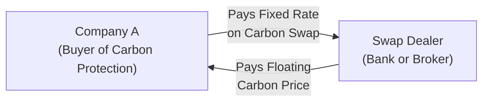
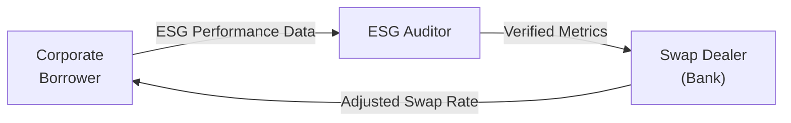

## 13.5 Carbon/Emissions Swaps & Other ESG-Oriented Products

Sometimes, when I first heard about carbon swaps, I was like, “Wait—swaps on emissions? Seriously?” And it took me a moment to realize that yes, in the same spirit that we have interest rate swaps or credit default swaps, we also have carbon or emissions-based swaps. These instruments let companies or investors manage their exposure to the cost (or potential volatility) of carbon credits or greenhouse gas (GHG) emission allowances. And let me tell you, with the planet facing climate change pressures and regulators raising the bar for environmental responsibility, these swaps are rapidly becoming a big deal. 

Below, we’ll explore what carbon/emissions swaps are, how they work, and how they connect to the broader market for ESG (Environmental, Social, and Governance) derivatives. This includes coverage of sustainability-linked swaps and an overview of the Canadian regulatory landscape under CIRO (the Canadian Investment Regulatory Organization), with references to relevant federal and provincial programs.

---

### Introduction to Carbon/Emissions Swaps

Carbon/emissions swaps are derivatives that enable one party to lock in a certain price for carbon credits or emission allowances, while the other party takes on the floating side of that price exposure. If you recall from earlier chapters, a swap typically involves exchanging cash flows. So, for instance, in an interest rate swap, you might exchange a fixed interest payment for a floating interest payment pegged to a benchmark rate like CORRA (in Canada) or SOFR (in the U.S.).

In a carbon swap, the reference or “floating” rate is usually tied to the market price of emission allowances—like the allowance prices in the European Union’s Emissions Trading Scheme (EU ETS) or the California Carbon Allowances (CCA) market. Some carbon swaps also reference “voluntary” carbon credits, which are outside of regulated compliance programs and are used for corporate social responsibility or net-zero aims.

#### Why Are Carbon Swaps Important?

• Compliance Hedging: If you’re a power company or an industrial manufacturer in a jurisdiction with a cap-and-trade system, you’re required to purchase enough allowances to cover your emissions. If you expect allowance prices to skyrocket, you might use a carbon swap to lock in a predictable cost.  
• Risk Management: Volatility in carbon prices can be significant, fluctuating on policy changes, supply constraints, or unexpected regulatory announcements. A swap provides a hedge.  
• ESG Commitments: With increased shareholder scrutiny and regulatory push, many firms incorporate ESG risk management into their overall financial strategies.

---

### Basic Definitions

Before we dive too deep, let’s clarify a few terms that pop up a lot in carbon swaps and ESG derivatives:

- **Carbon Credit**: A tradable certificate that represents the right to emit one tonne of CO₂ (or equivalent GHG). These credits can be derived from offset projects—say, planting trees or investing in renewable energy.  
- **Emission Allowance**: A permit, typically government-issued, letting you emit a specific quantity of greenhouse gases. In a cap-and-trade system, participants must hold enough allowances to match their emissions.  
- **Cap-and-Trade**: A regulatory approach that sets a “cap” on total emissions. Firms buy/sell allowances (the “trade” part) depending on whether they have shortfalls or surpluses of allowances.  
- **ESG (Environmental, Social, and Governance)**: A framework that investors and organizations use to evaluate a company’s ethical and sustainability practices.  
- **Greenwashing**: Overstating or misrepresenting environmental credentials, often done to appear more sustainability-focused than one actually is.  
- **Regulatory Risk**: The uncertainty that arises from changes in government policy or regs (like altering carbon tax levels or offset rules).  
- **Voluntary vs. Compliance Market**: Voluntary markets let companies or individuals purchase credits to meet self-imposed greening targets. Compliance markets are structured by law (like the EU ETS) and typically carry stricter verification protocols.

---

### Market Structure for Carbon/Emissions Swaps

A wide range of participants play in this space: industrial emitters, power producers, aviation companies, energy traders, financial institutions, and even governments themselves. While some of these swaps might be standardized, many remain customized over the counter (OTC). Let’s face it, carbon is not (yet) as liquid as foreign exchange or equity index futures. This can be a challenge for smaller entities trying to hedge.

In the Canadian context, we have both a federal Output-Based Pricing System (OBPS) and some provincial or regional programs (like Québec’s cap-and-trade, which links with California’s system). The interplay among these frameworks can create a patchwork of pricing mechanisms, leaving participants with exposure to multiple local prices. 

**Example**: Say a Canadian cement manufacturer also sells to jurisdictions within California’s cap-and-trade system. They might want to secure allowances in both markets. A carbon swap can help them lock in a cost for California’s allowances by exchanging the floating price of CCAs for a fixed payment in Canadian dollars.

---

### Mechanisms and Participants

To understand how these swaps work, let’s break down a simple structure:

You have Company A that wants to lock in a fixed price for carbon allowances. It enters into a swap with Bank B. Under the swap:

1. Company A pays Bank B a fixed rate (e.g., CA$30 per tonne of CO₂) multiplied by some notional quantity.  
2. Bank B pays Company A the floating market price of the allowances, referencing a recognized carbon price index.  

If the market price for allowances goes above CA$30, Company A receives a net benefit because it essentially “receives” the difference from the bank. If the market price stays below CA$30, A pays the difference to the bank—but at least it’s hedged from a potential large spike.

Here’s a small Mermaid diagram depicting the relationship:

In reality, Company A may or may not physically take delivery of allowances—just like in many commodity or currency swaps, it can be purely cash-settled based on index references.

---

### ESG-Oriented Swaps: Sustainability-Linked Structures

Carbon swaps are sometimes considered a subset of the broader ESG swap category. But guess what? There’s a lot more going on in ESG derivatives—and it can get pretty creative. A sustainability-linked swap might tie the interest rate or the swap spread to a company’s performance on certain sustainability metrics—like waste reduction, renewable energy usage, or water conservation. 

**Example**: A manufacturer could enter into an interest rate swap with a bank under which the fixed rate they pay is reduced if they meet a defined carbon emissions reduction target or if they obtain a certain ESG rating from an external auditor. If they fall short, the rate might increase, in effect penalizing them financially for not meeting sustainability goals.

This approach aligns a company’s borrowing costs or derivative costs with its ESG performance. But be mindful: verifying these metrics can sometimes be tricky. The last thing anyone wants is to pay for ambitious ESG results that turn out to have been overstated or mislabeled (i.e., greenwashing).

Here’s a quick Mermaid diagram illustrating a sustainability-linked swap:

---

### Regulatory Considerations

Regulation around carbon derivatives is still evolving. The Canadian Investment Regulatory Organization (CIRO) oversees derivatives activity in Canada, ensuring compliance with local and federal standards, along with relevant provincial securities commissions. If a swap is used to hedge emissions compliance obligations, there may be special margin or reporting treatments, especially if you’re classified as a commercial hedger.

From a policy standpoint, changes in climate regulation pose a key risk. For example, if the federal government were to significantly raise the carbon price floor or expand coverage to new sectors, demand for allowances might increase, pushing up prices. That’s a boon if you’re receiving floating on a carbon swap. But it could hurt if you’re paying the floating side and your costs spike.

#### Key Canadian Programs

- Federal **Output-Based Pricing System (OBPS)**: Targets large industrial emitters.  
- **Québec’s Cap-and-Trade**: Linked with California, creating a broader carbon market for those regions.  
- **Ontario’s Offset Protocols**: Although Ontario ended its cap-and-trade program in 2018, it still has offset protocols for certain use cases.  
- **Environment and Climate Change Canada** (https://www.canada.ca/en/environment-climate-change.html): Official info on the federal approach to GHG emissions.

#### Global Comparisons

- **EU Emissions Trading Scheme (EU ETS)**: One of the largest and most developed carbon markets, covering power, industrial, and airline emissions within the EU.  
- **California Cap-and-Trade**: Linked with Québec, creating the Western Climate Initiative (WCI).

---

### Risks and Challenges

Carbon swaps, though promising, come with their own sets of challenges—some of which are unique to this market:

• **Policy or Regulatory Risk**: Maybe the government changes the rules, or a state/provincial program ends. This can trigger big price moves.  
• **Liquidity Concerns**: Certain carbon markets can be illiquid, leading to wide bid-ask spreads. This can make it expensive or difficult to enter or exit a position.  
• **Verification and Data Quality**: How do you confirm that the carbon credits are legit and represent real emission reductions? Effective auditing is critical.  
• **Market Fragmentation**: Different standards, different jurisdictions, and overlapping programs can make it complicated to piece together a cohesive hedging strategy.  
• **Greenwashing Hazards**: The risk of inflated claims. If an entity’s offsets aren’t genuine, the entire purpose of the swap might be undermined.

---

### Practical Examples

Let’s look at a scenario. Suppose you’re an industrial company in Ontario. You produce about 500,000 tonnes of CO₂ annually. You must comply with the OBPS for your facility. You expect the cost of compliance to be CA$65 per tonne next year, up from CA$50 per tonne. To manage that potential cost escalation, you work with a swap dealer to pay a fixed price of CA$58 per tonne while receiving the floating OBPS allowance price. 

If the actual market price goes to CA$62, you only effectively pay CA$58 (saving CA$4 per tonne on 500,000 tonnes = CA$2 million). If, on the other hand, the market price stays at CA$55, you lose out on CA$3 per tonne in opportunity cost. But you still have the benefit of stable budgeting.

Another example: A sustainability-linked swap that ties an interest rate discount for a large retailer’s debt to its ability to reduce single-use plastics by 30% within two years. If the retailer meets that target, the swap rate is lowered by 0.10%. If it doesn’t, the rate is increased by 0.15%. This structure incentivizes real sustainability efforts, though measuring and confirming the plastic reduction might require third-party verification.

---

### Best Practices and Strategies

• **Define Your Emission Profile**: Understand whether your compliance obligations are baseline (quite certain) or if your emissions might vary widely from year to year. This shapes how much you hedge.  
• **Verify Offsets**: If you’re using offset-based carbon credits, pick a reputable registry (e.g., Verified Carbon Standard or Gold Standard) to minimize greenwashing risks.  
• **Monitor Policy Developments**: With climate policy evolving, keep an eye on changes in carbon taxes or allowances.  
• **Sustainability Metrics**: If you’re doing an ESG-linked swap, set realistic, auditable goals. Overly ambitious or poorly defined targets can lead to disputes and credibility damage.  
• **Align with Corporate Strategy**: Use these swaps as part of a broader ESG strategy, not just a quick fix. The more integrated your plan, the more synergy you’ll realize.

---

### Conclusions and Additional Resources

Carbon and emissions swaps (and more broadly, sustainability-linked or ESG-oriented swaps) are becoming central to modern risk management. They provide a real, market-based incentive for pursuing sustainable progress and help corporations comply with mandatory caps on emissions. But proceed carefully—these products come with serious challenges, not least of which is the risk of policy changes and the complexity of verifying environmental claims.

If you want to dive deeper:

- **Environment and Climate Change Canada**: https://www.canada.ca/en/environment-climate-change.html  
- **Québec Cap-and-Trade**: Official site for Quebec’s carbon market details.  
- **International Emissions Trading Association (IETA)**: For global policy updates, offset standards, and pending developments.  
- **“Sustainable Investing: Revolutions in Theory and Practice” by Herman Bril, Georg Kell, and Andreas Rasche**: A thorough read on ESG integration.  
- **Open-Source Climate Finance Data**: The World Bank and CDP (Carbon Disclosure Project) offer data to help model compliance scenarios.

While these instruments can be fairly technical, I think the underlying idea is simple: tie financial performance to a company’s environmental track record. By doing so, we all collectively push the needle forward on sustainability. And that, you know, is something worth getting excited about—even if the mechanics of carbon swapping initially sounded a bit strange.

---

## Sample Exam Questions: Carbon/Emissions Swaps and ESG-Oriented Derivatives



### Which type of derivative is specifically designed to lock in a price for carbon allowances or credits while paying or receiving a floating payment tied to the market price?

- [ ] Interest rate swap
- [x] Carbon swap
- [ ] Currency swap
- [ ] Commodity swap

> **Explanation:** In a carbon swap, parties exchange fixed payments for a floating rate tied to carbon allowance prices or carbon credit indices.

### What is the main purpose of carbon/emissions swaps in a compliance market?

- [ ] To speculate on currency movements
- [ ] To lower a firm’s interest expenses
- [x] To hedge regulatory or compliance obligations for emissions
- [ ] To offer a fixed premium on currency forward contracts

> **Explanation:** Corporations use carbon/emissions swaps primarily to manage the risk of rising costs for emission allowances or credits within mandated cap-and-trade or carbon-pricing programs.

### What is the key difference between voluntary and compliance carbon markets?

- [x] Voluntary markets trade credits for corporate social responsibility, whereas compliance markets trade allowances to meet legal obligations.
- [ ] Voluntary markets only operate in Europe, while compliance markets are worldwide.
- [ ] Compliance markets never allow trading of allowances.
- [ ] There is no effective difference.

> **Explanation:** Voluntary markets are used by companies or individuals to offset emissions without a regulatory requirement, while compliance markets exist under legal frameworks requiring covered entities to hold allowances matching their annual emissions.

### In a sustainability-linked swap, how might a borrower’s swap rate be adjusted if certain ESG performance benchmarks are met?

- [ ] The swap rate is held constant but the maturity of the swap is shortened.
- [ ] The notional amount is automatically doubled.
- [x] The swap rate might be reduced, rewarding the borrower for meeting ESG targets.
- [ ] The swap is canceled without any settlement if benchmarks are reached.

> **Explanation:** A sustainability-linked swap ties better ESG performance (e.g., emissions reduction, waste reduction) to improved financial terms for the borrower.

### Which of the following poses a significant risk specific to carbon swaps?

- [ ] Changes in the prime lending rate
- [x] Shifting government regulations on carbon pricing
- [ ] Seasonal fluctuations in agricultural yields
- [ ] A rise in corporate bond defaults

> **Explanation:** Regulatory risk is paramount in carbon markets. Government policy changes can drive large price swings in emission allowances, directly impacting the value of carbon swaps.

### Which entity in Canada took over the SRO roles of the former IIROC and MFDA, ensuring compliance with derivatives regulations?

- [ ] Ontario Securities Commission
- [ ] Alberta Securities Commission
- [ ] Montreal Exchange
- [x] CIRO (Canadian Investment Regulatory Organization)

> **Explanation:** As of January 1, 2023, the MFDA and IIROC amalgamated into CIRO, which now oversees investment dealers, mutual fund dealers, and equity/debt markets.

### When parties enter a carbon swap where one pays fixed and receives floating on the carbon allowance price, who benefits if allowance prices drop below the fixed rate?

- [ ] The receiving-floating party
- [x] The paying-fixed party
- [ ] Both parties benefit equally
- [ ] The regulator

> **Explanation:** If the actual floating price is below the fixed rate, the party that is paying fixed (and receiving floating) ends up paying more than the market price. Consequently, the counterparty paying floating and receiving fixed benefits (i.e., the receiving-fixed party is “overpaid”). Hence, the paying-fixed side is at a relative loss and the receiving-fixed side benefits.

### Which statement best describes greenwashing?

- [x] Communicating misleading claims about a company’s environmental practices
- [ ] Offering additional carbon credits to non-regulated entities
- [ ] Subsidizing fossil fuel projects through carbon offsets
- [ ] The practice of halting trading when a carbon price hits its daily limit

> **Explanation:** Greenwashing occurs when an organization exaggerates or falsely represents its sustainability credentials, potentially undermining trust and market integrity.

### Which of the following is a best practice when setting up a carbon swap?

- [ ] Never verify the origin or legitimacy of carbon credits to streamline the transaction.
- [ ] Use unregistered offset registries to save costs.
- [ ] Only hedge once actual emissions data is available at year-end.
- [x] Ensure carbon credits meet reputable standards (e.g., Verified Carbon Standard or Gold Standard) to avoid greenwashing.

> **Explanation:** Proper due diligence around the quality and legitimacy of the carbon credits or allowances being traded is essential to avoid inflated claims and maintain credibility.

### True or False: Sustainable metrics like waste reduction can trigger changes to the financial terms of a swap agreement.

- [x] True
- [ ] False

> **Explanation:** In sustainability-linked swaps, meeting or failing ESG objectives can reduce or increase the cost of the derivative, aligning a company’s financial outcomes with its environmental or social performance.


