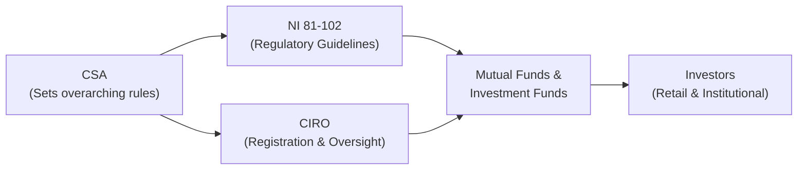

## 14.1 Regulatory Framework for Canadian Investment Funds and Structured Products

Imagine you’re chatting with an old friend who’s excited about investing in mutual funds but is also curious about all those “structured notes” their neighbor keeps mentioning. Well, that’s often how I feel when I first tell people about the rules that keep our investment world humming safely along: a mix of excitement and a slight dash of confusion. But, not to worry. Let’s walk through Canada’s regulatory framework for investment funds—and highlight why the rulebook matters and how it shapes the use of derivatives within these products.

---

### A Friendly Overview

Before we get super technical, let’s ground ourselves in the big picture. Investment funds in Canada—whether they’re your trusty vanilla mutual funds, alternative mutual funds that use short-selling or leverage, or those spiffy exchange-traded funds (ETFs)—operate under a consistent set of guidelines laid down by the Canadian Securities Administrators (CSA). And guess what? There’s a further enforcement layer by the Canadian Investment Regulatory Organization (CIRO). CIRO was formed when the Mutual Fund Dealers Association of Canada (MFDA) and the Investment Industry Regulatory Organization of Canada (IIROC) amalgamated. This means if you ever come across references to those older acronyms, they’re historical only. Today, CIRO is in charge.

But enough about organizational acronyms. The goal of these regulations is to keep the investing environment fair, transparent, and safe. Regulators don’t want unscrupulous managers running off with your money, nor do they want funds using derivatives in a hidden or reckless way. They also push for consistent disclosure, so everyday investors know exactly what they’re getting themselves into.

---

### Who Are the Key Players?

Let’s do a quick who’s who:

• **CSA (Canadian Securities Administrators):** This is not a single agency, but rather an umbrella group of provincial and territorial securities regulators. They coordinate and harmonize securities regulation across the country. So if you live in Alberta, Ontario, or Nova Scotia (or anywhere else in Canada), you still come under the CSA’s overarching framework.

• **CIRO (Canadian Investment Regulatory Organization):** As of 2023, it’s Canada’s national self-regulatory organization for both investment dealers and mutual fund dealers. Essentially, it sets and enforces rules that keep financial advisors and investment firms on the straight and narrow.

• **CIPF (Canadian Investor Protection Fund):** This is the sole investor protection fund in Canada, providing coverage in case a member firm becomes insolvent. CIPF is separate from CIRO but works very closely in ensuring investor confidence.

• **National Instrument 81-102 Investment Funds (NI 81-102):** Picture NI 81-102 as the big rulebook for mutual funds and many other types of investment funds. It spells out the do’s and don’ts: permissible investment strategies, rules around leverage, derivatives usage, borrowing, and more.

• **Structured Products:** These can range from Principal-Protected Notes (PPNs) to more exotic combinations of debt and derivative contracts. They’re designed to offer unique payoff structures or risk-return profiles.

---

### The Heart of the Regulation: NI 81-102

If you think of the CSA as the “sports league commissioner,” then NI 81-102 is the official rulebook for all the players—particularly mutual funds. Let’s highlight a few key points:

**1. Permitted Investments:** NI 81-102 restricts a fund’s exposure to certain high-risk or overly illiquid assets. A typical mutual fund must avoid, or strictly limit, very speculative derivatives positions that deviate from its stated mandate.

**2. Derivatives Usage:** Funds can use derivatives for hedging purposes or as part of an investment strategy, provided they meet certain disclosure requirements and risk management guidelines. For instance, a bond fund might want to use interest rate futures to hedge the interest rate risk of its fixed-income holdings. NI 81-102 ensures that the fund’s use of derivatives aligns with its stated purpose, so you don’t inadvertently invest in a bond fund that’s secretly trading exotic currency options.

**3. Borrowing Limits:** Traditional mutual funds generally have limited ability to borrow money (leverage). Excessive leverage can amplify returns but also amplify risk. NI 81-102 sets caps on how much a fund manager can borrow, preventing them from turning a staid equity fund into a highly leveraged, high-octane hedge fund.

**4. Alternative Mutual Funds Exception:** There’s a category called “alternative mutual funds,” which can use alternatives strategies to a greater extent (e.g., short-selling or using a higher degree of leverage). They still operate under securities regulation, but a separate set of guidelines exist, allowing them more flexibility in derivatives usage—think short positions and more advanced option strategies. Of course, they also have stricter disclosure and risk reporting obligations.

**5. Disclosure and Transparency:** NI 81-102 requires funds to publish clear, concise information via their simplified prospectus. This ensures that if a fund uses derivatives, the reason, risks, and potential impact on returns must be spelled out in everyday language. Investors can’t make informed decisions if everything is hidden behind a thick veil of legal jargon.

---

### What About Structured Products?

You might hear your neighbor say, “I just bought a Principal-Protected Note from my bank. It’s basically a guaranteed return, right?” Well, maybe. PPNs and other structured products come with certain complexities. In Canada, many of these products also fall under the CSA’s broad regulatory umbrella. They can be issued by banks or other financial institutions, and they often embed derivatives to create specific payoff profiles—like guaranteeing principal while still offering upside if a certain index rises.

For instance, a PPN might combine:

• A zero-coupon bond (to ensure your original principal)  
• A call option on an equity index (to provide the “growth potential”)

This is great in theory (you get your principal back plus some potential upside), but the devil’s in the details. The product might cap your returns, or the method used to calculate the index’s gains might reduce real returns. That’s why the rules require clarity: how exactly is your return calculated, and under what conditions might you lose out?

From a regulatory standpoint, these products—though not strictly “mutual funds”—must adhere to guidelines on suitability, disclosure, and oversight by CSA and CIRO. So, if your financial advisor recommends a particular leveraged note or PPN, they must first check that it fits your risk tolerance and your daredevil or conservative investment style. That’s the crux of the KYC (Know-Your-Client) and Suitability rules.

---

### CIRO’s Role: KYC, Suitability, and Beyond

When the old MFDA and IIROC merged to form CIRO, the intention was to create a single, unified body to oversee all relevant dealers in Canada. This is quite helpful because:

1. **Uniform Standards:** Regardless of whether you’re dealing with someone who used to be exclusively a “mutual fund dealer” or an “investment dealer,” the same fundamental rules apply across the board.

2. **Know-Your-Client (KYC) Rules:** Advisors must understand your financial situation, investment objectives, and risk tolerance. If you’re 25, with no debt, a stable job, and extra disposable income, an alternative mutual fund with a derivatives strategy might be suitable. But if you’re 85, living on a fixed pension, that same recommendation might be entirely off-base.

3. **Suitability:** Even if a product is legal and properly disclosed, it doesn’t mean it’s suitable for every client. CIRO enforces the principle that your advisor or dealer must ensure any product aligns with your profile. Piling into a derivatives-laden new fund might be a big “nope” if your risk appetite is minimal.

4. **Sales Practices:** CIRO also monitors how products are sold. So if a salesperson promises guaranteed returns on a structured note that’s anything but guaranteed, that’s a regulatory red flag. Complaints can be investigated; sanctions can be imposed. This fosters trust in the Canadian market.

---

### The Simplified Prospectus: The Secret Weapon of Disclosure

I remember the first time I flipped open a simplified prospectus for a mutual fund in Canada—thin, easy-to-read, and filled with helpful breakdowns of what the fund does and how it does it. It wasn’t as breezy as a novel, of course, but wow, was it more straightforward than some massive 100-page long form you see in other markets.

**Key Items in the Simplified Prospectus:**
- Investment objectives (e.g., “Generate stable income from Canadian bonds.”)  
- Investment strategies (including whether the fund uses derivatives for hedging or speculation)  
- Fees (including any ongoing management fees, performance fees, trailer fees, etc.)  
- Risks (market risk, leverage risk, currency risk, liquidity risk, derivative risk, and more)  

Funds must highlight how they use derivatives. For instance, a balanced fund might mention it engages in covered call writing to enhance yield. Another might say it uses currency forwards to hedge foreign-exchange exposure. This is all about making sure the everyday investor isn’t blindsided by hidden derivative strategies.

---

### A Quick Mermaid Diagram of Regulatory Oversight

Below is a simple mermaid diagram showing how Canadian investment funds interact with the regulator, the SRO, and the investor. It’s simplified but might help visualize the flow:

Here, the Canadian Securities Administrators (CSA) is the high-level regulatory group that has the power to set national instruments (like NI 81-102). CIRO registers and supervises the dealers who distribute funds to end investors, ensuring KYC and suitability. The funds themselves must comply with NI 81-102 to remain in good standing.

---

### Practical Examples and Case Studies

#### Example 1: A Simple Bond Fund

Let’s say we have a mutual fund with the mandate of investing in Canadian corporate bonds. Under NI 81-102, it can use interest rate futures or options to hedge risk. If the interest rate environment changes drastically, the derivatives positions can partially offset losses. The simplified prospectus spells out which derivatives might be used. CIRO ensures the advisor selling it to you verifies that a bond fund with moderate risk lines up with your risk tolerance. Easy-peasy.

#### Example 2: Alternative Mutual Fund with Short-Selling

An alternative mutual fund might short-sell up to 50% of its assets, going long on undervalued equities and shorting overvalued ones, while also layering in some equity index futures for hedging broad market movements. NI 81-102 still applies, but alternative funds get an extra set of guidelines allowing them more freedom. They must disclose these advanced strategies. They might appeal to investors looking to potentially profit in both rising and falling markets. But if you’re new to investing, your advisor must highlight that short-selling and leverage come with higher risk.

#### Example 3: Principal-Protected Note from a Bank

You invest $10,000 in a PPN. The marketing materials promise your initial investment is guaranteed at maturity, plus potential upside if a certain stock index goes up over the next five years. This PPN is effectively a structured product combining a bond with an equity option. The bank that issues it might be regulated by OSFI (the Office of the Superintendent of Financial Institutions) and overseen by the CSA’s rules for offering documents. If your financial advisor recommended it, CIRO’s suitability standard requires that they show you the product’s limitations—like what happens if the underlying index doesn’t rise above a threshold or if there’s a cap on your maximum gains.

---

### Risk Management and the Regulatory Rationale

At the end of the day, regulators aren’t here to squash innovation. They simply want to ensure that if a fund or structured product uses derivatives, it’s done in a prudent manner with robust risk management. That means:

• Limits on how much exposure a fund can take.  
• Mandatory risk disclosure to investors.  
• Ongoing oversight to confirm the fund sticks to its stated objectives.  

We all know that derivatives can be a double-edged sword—fantastic for hedging, tricky if used for naked speculation. Canada’s system aims to keep the edge from cutting unsuspecting investors.

---

### Helpful Resources

Here are a few places you can turn to for more detailed information:

• **CSA Website:**  
  http://www.securities-administrators.ca/  
  (For official notices, full texts of National Instruments, and more.)

• **CIRO Website:**  
  https://www.ciro.ca/  
  (Check for the latest regulatory updates, proficiency, and registration requirements.)

• **National Instrument 81-102 Investment Funds:**  
  Available on each provincial securities regulator’s website. This is the gold standard for understanding the allowable scope of derivatives usage and other rules for mutual funds.

• **Bourse de Montréal:**  
  https://www.m-x.ca/  
  (A prime resource for derivatives education in Canada, especially futures and options.)

• **Recommended Reading:**  
  “Investment Funds in Canada” by Joe Kan for deeper insights into regulatory requirements.

• **Online Courses & Platforms:**  
  Look to Coursera or edX for fundamentals in finance and derivatives, especially if you want real-world examples of how derivatives are integrated into fund structures.

---

### Common Pitfalls and Best Practices

• **Not Reading the Prospectus:** It’s easy to skip the prospectus, but crucial info about derivatives usage, fees, and risks are in there. A five-minute read can save you from surprises later.

• **Overlooking Suitability:** Just because a product can legally use derivatives doesn’t mean it’s right for you. Advisors should ensure your risk tolerance lines up with the product’s risk profile.

• **Assuming Guarantees:** Some structured products appear “guaranteed” because principal might be protected. But read the fine print—there might be conditions that can still result in lower-than-expected returns.

• **Ignoring Fees:** Leverage, short-selling, and derivative strategies often come with higher management costs or embedded fees. Always check how these fees stack up against potential returns.

• **Comparing Apples to Oranges:** Alternative mutual funds and standard mutual funds might both hold equity, but their risk profiles can be dramatically different. Don’t treat them as interchangeable just because they’re both “funds.”

---

### My Personal Take

I once sat down with a friend who was thrilled about a new “guaranteed” structured note. She just saw “principal guarantee” and assumed it was the same as a standard savings account. We spent an hour going through the simplified offering document, and as it turned out, the note had a convoluted performance cap. If the underlying market soared more than 20%, she wouldn’t get that full upside. And early redemption fees were steep. That day, I realized how easily marketing terms can mislead the average investor—hence the importance of these rules.

---

### Concluding Thoughts

Fund regulations in Canada, particularly NI 81-102, aim to strike a balance: letting investment funds innovate, especially with derivatives, while making sure investors are adequately protected. These frameworks are about transparency, suitability, and strong oversight—factors that help keep our markets functioning and trustworthy.

If you recall just one thing from our chat, let it be this: always, always take a second look at how a fund or structured product uses derivatives. The rules say they have to tell you, so make the most of that information. And if you still have questions, your CIRO-registered advisor or the official regulatory documents are just a click or phone call away.

---

## Sample Exam Questions: Regulatory Framework for Canadian Investment Funds



### Which organization serves as the national self-regulatory body overseeing investment dealers and mutual fund dealers in Canada?

- [ ] The Mutual Fund Dealers Association of Canada (MFDA)
- [ ] The Investment Industry Regulatory Organization of Canada (IIROC)
- [ ] The Office of the Superintendent of Financial Institutions (OSFI)
- [x] The Canadian Investment Regulatory Organization (CIRO)

> **Explanation:** MFDA and IIROC are defunct predecessor SROs. As of 2023, these two organizations amalgamated to form CIRO, which now oversees dealers nationwide.

### Which Canadian regulation primarily governs the operations and permitted activities of mutual funds?

- [ ] National Instrument 45-106 (Prospectus Exemptions)
- [x] National Instrument 81-102 (Investment Funds)
- [ ] National Instrument 31-103 (Registration Requirements)
- [ ] National Instrument 94-101 (Central Counterparty Clearing)

> **Explanation:** NI 81-102 covers the operational framework and permissible investments for mutual funds across Canada.

### Under NI 81-102, which of the following summarizes the role of a simplified prospectus?

- [ ] To provide an informal brochure with marketing slogans.
- [x] To disclose investment objectives, strategies, fees, and risks in a streamlined form.
- [ ] To provide an internal document shared only with regulators.
- [ ] To serve only as a record of daily trading activities.

> **Explanation:** The simplified prospectus is a concise but comprehensive disclosure document given to investors, explaining the fund’s strategy, risks, costs, and use of derivatives.

### What is one key reason why the Canadian regulatory regime limits leverage in traditional mutual funds?

- [x] Excessive leverage can amplify risk, making funds more volatile and potentially inconsistent with their stated objectives.
- [ ] Leverage produces only guaranteed returns and not enough risk.
- [ ] To ensure the fund never hedges or enters into short positions.
- [ ] It is purely to reduce administrative paperwork for fund managers.

> **Explanation:** Regulators want to protect investors from the higher risk that comes with leveraged strategies. NI 81-102 ensures that funds adhere to their risk profiles.

### What is the primary goal of the Know-Your-Client (KYC) regulation enforced by CIRO?

- [ ] To promote competition among mutual funds.
- [x] To ensure registered dealers understand a client’s financial situation and recommend suitable products.
- [ ] To allow advisors to share client data with marketers.
- [ ] To exempt advisors from verifying their client’s identity.

> **Explanation:** KYC means understanding your client’s objectives, risk tolerance, and overall profile. It’s a cornerstone of suitability.

### Which of the following statements best describes structured products like Principal-Protected Notes (PPNs)?

- [x] Financial instruments using derivatives to create specific payoff profiles, often with partial or full principal protection.
- [ ] Plain-vanilla bond funds offering guaranteed returns.
- [ ] Direct equity investments without complexity.
- [ ] Derivative-based financial instruments that never involve debt components.

> **Explanation:** PPNs blend a fixed-income component (often a zero-coupon bond) with one or more derivative contracts that provide upside potential.

### Which body provides investor protection if a member firm becomes insolvent?

- [ ] The Bank of Canada
- [ ] The Canada Deposit Insurance Corporation (CDIC)
- [x] The Canadian Investor Protection Fund (CIPF)
- [ ] The CSA

> **Explanation:** CIPF is Canada’s sole investor protection fund for investors of insolvent CIRO-registered member firms.

### An “alternative mutual fund” in Canada typically:

- [x] Has broader latitude to use derivatives, short-selling, and leverage beyond standard mutual fund limits.
- [ ] Cannot invest in equities or fixed income.
- [ ] Is always risk-free to the investor.
- [ ] Cannot be offered to retail investors.

> **Explanation:** Alternative mutual funds are allowed to use more complex strategies than traditional funds, including greater leverage and short-selling, but remain regulated under NI 81-102 with enhanced requirements.

### Why is CIRO’s suitability requirement crucial for investors dealing in mutual funds with derivative exposure?

- [ ] It ensures these products have no risk.
- [ ] It gives advisors freedom to invest client assets in any product.
- [x] It guarantees that products recommended align with each client’s risk tolerance and investment goals.
- [ ] It only applies to institutional investors, not retail clients.

> **Explanation:** Suitability ensures that advisors offer products appropriate for the individual investor’s profile, especially important when derivatives can magnify risk.

### True or False: The simplified prospectus of a mutual fund must clearly indicate if and how the fund uses derivatives in its investment strategy.

- [x] True
- [ ] False

> **Explanation:** NI 81-102 requires explicit disclosure of all material aspects of the fund’s strategy, including derivatives usage, within the simplified prospectus.


