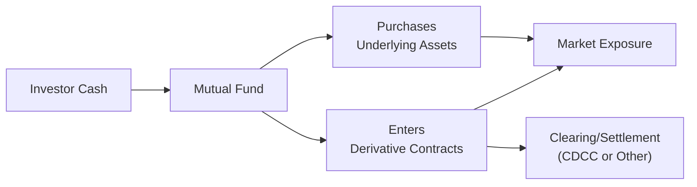

## 14.2 Use of Derivatives in Mutual Funds

Mutual funds have long served as a key investment vehicle for individuals and institutions who want professional portfolio management and diversification. Well, you might have heard friends or co-workers say, “I invest in this mutual fund because it’s stable and easy,” and it’s true—most folks associate mutual funds with diversification, straightforward regulations, and daily liquidity. But the behind-the-scenes reality can be a little bit more interesting: many mutual funds actually utilize sophisticated tools, like derivatives, to accomplish their objectives. Let’s explore how and why they do it.

### Why Mutual Funds Use Derivatives

Let’s start with a simple question: if mutual funds pool together money to buy stocks and bonds, why on earth would they need derivatives? Interestingly, there are several good reasons:

• Hedging Against Risks: Mutual funds use derivatives such as futures, options, and swaps to reduce potential losses in their portfolios. For instance, if an equity mutual fund manager foresees some short-term volatility, they might purchase equity index put options to hedge against possible downward price moves.

• Enhancing Returns: Some mutual funds use derivatives to generate additional income. A classic example is writing (selling) covered calls on stocks the fund already holds. If the fund’s investment mandate allows this, option premiums can add to the fund’s returns.

• Gaining or Reducing Exposure Quickly: Mutual funds that want exposure to a particular market index may find that buying futures contracts is faster and more cost-efficient than buying every stock in the index right away. This tactic also keeps the fund from moving the market by purchasing large blocks of shares on short notice.

• Maintaining Liquidity: If the fund wants to avoid less-liquid assets (maybe it’s eyeing a thinly traded corporate bond), it can gain synthetic exposure through derivatives—like an interest rate swap—while still preserving a high level of liquidity to meet daily redemptions.

• Currency Hedging: If a Canadian mutual fund invests in U.S. stocks or other foreign assets, the manager might use currency forwards or futures to “lock in” exchange rates or reduce the impact of exchange-rate fluctuations. As a quick anecdote, I remember a friend in Vancouver who was invested in a global equity fund. He was so surprised when he read that the fund uses currency futures. He thought, “Wait, I didn’t sign up for foreign exchange trading!” But in reality, these contracts helped protect him from a sudden drop in the CAD/USD exchange rate.

### Key Derivative Instruments for Mutual Funds

Let’s look at the most common derivative products:

#### Futures
Futures are standardized contracts obligating a buyer or seller to transact an underlying asset—like an equity index or a commodity—at a specified price and date. For a mutual fund:
• Equity Index Futures: Often used to adjust equity exposure quickly.  
• Interest Rate Futures: Used by bond funds to manage duration risk.  
• Commodity Futures: Possible for funds that want exposure to oil, gold, and agricultural products.

#### Forward Contracts (Forwards)
Forwards work much like futures but aren’t standardized or exchange-traded. Instead, they’re customized between two parties, often used for currency hedging or specific commodity exposures where a standardized futures contract might not be available or might not perfectly match the fund’s needs.

#### Options
Options provide the right, but not the obligation, to buy (call) or sell (put) an underlying asset at a set price by a certain date. Mutual funds typically use options for:
• Downside Protection: Buying puts on equity positions.  
• Enhancing Income: Writing covered calls on a portion of their holdings.  
• Strategic Positioning: Using long calls, for instance, to capture upside on an index if it surges unexpectedly.

#### Swaps
A swap is a private agreement to exchange different streams of cash flow. You’ll often see interest rate swaps (where a fund exchanges fixed for floating rates) or total return swaps (used to gain exposure to an index or basket of securities). In Canada, currency swaps are also common if a fund wants ongoing foreign currency exposure but seeks to moderate exchange risk or interest rate differentials.

### Aligning with Investment Objectives

Canadian mutual funds must disclose their investment strategies, including the use of derivatives, in their Simplified Prospectus and Annual Information Form. This is mandated under National Instrument (NI) 81-101 in Canada. Every mutual fund’s usage of derivatives must align with (and be consistent with) its stated objectives.

For example:
• A bond fund with the stated goal of stable income and moderate interest rate risk might use interest rate futures to reduce its duration risk.  
• An equity growth fund that invests mostly in Canadian stocks might buy put options on an index to hedge short-term market downturns—without being forced to sell the stocks the fund manager wants for the long haul.

### Regulatory Landscape in Canada

When it comes to derivatives usage, mutual funds are subject to NI 81-102, which spells out restrictions on leveraging, asset coverage, and risk exposure. These rules exist to protect investors from excessive volatility or speculation in products they might not fully understand. Canadian securities regulators, under the guidance of the Canadian Securities Administrators (CSA), issue staff notices—sometimes referred to collectively as “Canadian Mutual Fund Regulators’ Approach to Derivatives”—which offer further interpretation and guidelines.

An essential point: The new Canadian Investment Regulatory Organization (CIRO) oversees investment dealers and mutual fund dealers, ensuring compliance with derivatives rules in Canada. Historically, you might recall the “Mutual Fund Dealers Association” (MFDA) or the “Investment Industry Regulatory Organization of Canada” (IIROC). The reality now (post-2023) is that we have CIRO, the single, national self-regulatory organization that continues to update best practices around derivatives usage in mutual funds. For official updates or more details, you can always check their website at [https://www.ciro.ca](https://www.ciro.ca).

Canada also has the Canadian Investor Protection Fund (CIPF), which covers client assets at member firms if insolvency occurs. This doesn’t directly govern how funds use derivatives, but it underscores how the entire system aims to safeguard investor interests.

### Diagram: Mutual Fund and Derivatives Flow

It can sometimes help to visualize. Here’s a simple depiction of how mutual funds interact with the derivatives markets:

In this diagram:  
• Investor Cash flows into the Mutual Fund.  
• The Mutual Fund purchases underlying assets (like stocks or bonds) and/or enters into derivative contracts.  
• The clearing and settlement of those derivatives (D) happen through entities like the Canadian Derivatives Clearing Corporation (CDCC) or other clearinghouses.  
• Both direct holdings and derivative positions feed into the mutual fund’s broader market exposure, eventually determining returns for investors.

### Liquidity Management

One of the big draws of mutual funds is the ability for investors to redeem shares daily. That daily redemption requires the fund to have enough liquid assets (or quickly convertible assets) to meet redemptions. Derivatives often come in handy here:

• Using derivatives to gain exposure means the fund might not have to hold large positions in less-liquid underlying securities.  
• If a manager expects inflows or redemptions, using futures can allow them to quickly “ramp up” or “ramp down” exposure without fussing with numerous individual stock or bond transactions.

### Currency Hedging

Many Canadian mutual funds invest globally. When they hold assets denominated in USD, EUR, GBP, or other currencies, they face the risk that a strengthening Canadian dollar could reduce returns. Conversely, if the Canadian dollar weakens, it might boost returns. Funds often use:

• Currency Forwards: A promise to buy or sell foreign currency at a future date and set exchange rate.  
• Currency Futures: Similar, but standardized and exchange-traded.  
• Currency Options: Gives the fund the right (not obligation) to transact at a specified rate.

A straightforward example involves a Canadian equity fund that invests in U.S. technology companies. The manager might enter into USD/CAD currency forwards to lock in a particular exchange rate. This ensures that returns from that U.S. investment aren’t heavily eroded by currency swings.

### Leverage and Risk Mitigation

Derivatives can introduce leverage, which is essentially amplifying potential profits (and losses!). Under NI 81-102, Canadian mutual funds generally must have “full asset coverage” for their derivative positions. This means they cannot exceed certain threshold levels of leverage. The regulators want to prevent the fund from collapsing under wild, leveraged speculation. So, a mutual fund has to carefully measure its overall exposure, ensuring it remains consistent with risk policies.

I’ve personally chatted with a friend who works on the compliance side of a medium-sized mutual fund. She often remarks, “We can’t just go and load up on leveraged derivatives because it might create massive swings. Our compliance department would have a meltdown!” That’s real talk from inside the industry—some funds do want to take advantage of derivatives for alpha, but the guardrails are quite strict.

### Practical Example: Interest Rate Hedging in a Bond Fund

Imagine a Canadian bond fund that aims for modest returns while safeguarding principal. Interest rates might jump upwards, driving bond prices down. So the fund manager can short interest rate futures (i.e., sell bond futures) to offset some of that risk. If bond prices drop, the futures short position may yield a profit that offsets part of the decline in the fund’s main bond holdings.

One of my colleagues once described it like putting on a raincoat when you see dark clouds. You’re not trying to turn a massive profit from the coat; you’re trying to avoid getting soaked. That’s what hedging with derivatives feels like: you pay some cost or potentially forego some upside, but you’re safer if a storm hits.

### Best Practices and Common Pitfalls

• Clear Investment Policy: The use of derivatives must be clearly described to unitholders. If a fund is going to sell calls for income generation, it needs to be spelled out in the prospectus.  
• Risk Management: Fund managers typically use VAR (value-at-risk) models or stress tests to gauge how derivative positions might behave in volatile markets.  
• Limits and Monitoring: Compliance teams stay vigilant about exposure limits and the authorized uses of derivatives to ensure compliance with NI 81-102.  
• Potential Liquidity Mismatch: Even though derivatives can assist with liquidity, a mismatch in the assets underlying the derivative contract can cause complications—because derivatives settle daily in margin accounts, but the fund itself might hold long-dated bonds.  
• Roll Costs: Futures and forward contracts don’t last forever; they have expiration dates. Funds need to “roll” positions periodically, incurring transaction costs and potential slippage.

### Additional Resources

• “Canadian Mutual Fund Regulators’ Approach to Derivatives” (CSA Staff Notices) – Official guidance on derivative usage.  
• National Instrument 81-101 – Rules for simplified prospectus and fund facts.  
• National Instrument 81-102 – Detailed rules outlining derivative exposure limits for funds.  
• [CDCC](https://www.cdcc.ca/) – The Canadian Derivatives Clearing Corporation’s website has information on clearing processes.  
• Free Market Data Tools: [Bloomberg](https://www.bloomberg.com/) or [Yahoo Finance](https://finance.yahoo.com/) for real-time tracking of derivatives prices.  
• Fundamentals of Futures and Options Markets by John C. Hull – A reliable textbook that dives deeper into how derivatives function.  
• [CIRO Website](https://www.ciro.ca) – Canada’s self-regulatory body resources for compliance updates.

### Glossary of Key Terms

Hedging: Using derivatives to offset potential losses in a similar or related investment.  
Leverage: Amplifying potential returns (and losses) by investing more than one’s actual capital (often through derivatives).  
Futures: Standardized contracts to buy or sell an asset at a preset time, price, and quantity on an exchange.  
Forward Contract: A customized, off-exchange agreement to buy or sell an asset at a specified date/price (often used for currencies).  
Options: Contracts granting the right, but not the obligation, to buy (call) or sell (put) an asset at a fixed strike price by a certain date.  
Swaps: Private contracts to exchange cash flows, such as interest payments or returns on asset baskets.  
Duration Risk: The sensitivity of bond prices to changes in interest rates.  
Currency Hedging: A strategy to mitigate the impact of currency fluctuations on investment returns.

### Concluding Thoughts

Anyway, that was a big-picture overview of how mutual funds integrate derivatives into their day-to-day operations. Sometimes, the use of derivatives can sound super complex—like rocket science. But the motivations at their core are actually pretty straightforward: risk management, efficient exposure, and overall optimization of returns.

From the outside looking in, it may appear “magical” that a mutual fund can remain steady in a volatile market or quickly shift exposures without rebalancing everything in the portfolio. In practice, that magic is often spelled d-e-r-i-v-a-t-i-v-e-s. As always, though, these strategies come with their own set of risks and must be used responsibly and transparently, especially under Canada’s robust regulatory umbrella.

If you’d like to read more, definitely check out the references suggested above or explore your mutual fund’s Simplified Prospectus for the exact details on its derivatives usage strategy. If you see something in there that intrigues you—like currency swaps or credit hedging—feel free to keep a watchful eye on how these positions impact the fund’s performance over time.

Remember, knowledge is power, and understanding how your mutual fund invests (and hedges) can help you remain confident, especially when those market storms roll in.

---

## Sample Exam Questions: Use of Derivatives in Mutual Funds



### A mutual fund that invests in U.S. equities but wants to mitigate currency risk would most likely use which of the following derivatives?

- [ ] Equity index futures
- [x] Currency forwards
- [ ] Interest rate options
- [ ] Total return swaps

> **Explanation:** To mitigate (hedge) currency risk, the fund generally uses currency instruments such as forwards or futures rather than equity index derivatives.

### Which Canadian regulatory instrument primarily governs the degree of leverage and exposure limits for mutual funds using derivatives?

- [ ] National Instrument 81-101
- [x] National Instrument 81-102
- [ ] National Instrument 43-101
- [ ] National Instrument 51-102

> **Explanation:** NI 81-102 places restrictions on leverage and ensures that mutual funds maintain acceptable risk levels when using derivatives.

### How might a fund manager hedge a bond fund against rising interest rates?

- [ ] Buying bond futures
- [x] Selling (shorting) bond futures
- [ ] Writing equity call options
- [ ] Entering a total return swap on equities

> **Explanation:** If interest rates rise, bond prices tend to fall. By selling bond futures, the manager profits if bond prices drop, offsetting some of the losses in the physical bond holdings.

### A Canadian mutual fund invests heavily in an overseas commodity, but the fund manager wants to avoid physically holding the commodity. Which derivative strategy is most likely?

- [x] Purchasing commodity futures
- [ ] Writing covered calls on an equity index
- [ ] Entering an interest rate swap
- [ ] Buying put options on the fund’s own shares

> **Explanation:** One of the standard ways to get exposure without physical delivery is using commodity futures.

### Which of the following is the best description of “full asset coverage” for a mutual fund’s derivatives positions?

- [x] Having sufficient liquid securities or cash to cover potential losses
- [ ] Having insurance for all transactions at the clearinghouse
- [x] Ensuring that short calls are always matched with puts
- [ ] Verifying margin calls are always made intraday

> **Explanation:** In Canadian regulations, “full asset coverage” generally means the fund can demonstrate it has adequate assets (cash, equivalents, or securities) to cover potential losses on its derivative contracts.

### Which of the following statements is most accurate concerning a mutual fund using interest rate swaps?

- [x] It can swap fixed-rate payments for floating-rate payments to reduce duration risk.
- [ ] It must be an exchange-traded instrument.
- [ ] It cannot be used for hedging.
- [ ] It is identical in structure to a forward contract.

> **Explanation:** An interest rate swap typically involves exchanging fixed for floating payments, addressing duration or interest rate risk. Swaps are private agreements, not exchange-traded like futures.

### Which regulatory body is currently responsible for overseeing investment dealers and mutual fund dealers in Canada?

- [x] CIRO
- [ ] MFDA
- [ ] IIROC
- [ ] CIPF

> **Explanation:** As of 2023, CIRO is the amalgamated self-regulatory organization. MFDA and IIROC are historical, now-defunct SROs. CIPF remains a separate fund that protects investors in case a member firm becomes insolvent.

### A mutual fund manager notices a potential surge in market volatility and wants to protect a portion of the equity portfolio from a steep drop in prices. Which derivative is most suitable?

- [x] Buying put options on an equity index
- [ ] Selling put options on an equity index
- [ ] Writing covered calls on the fund’s own holdings
- [ ] Purchasing interest rate calls

> **Explanation:** Purchasing put options offers downside protection against falling prices.

### If a Canadian mutual fund invests in a broad U.S. equity index and does not hedge the currency, which outcome is possible if the CAD appreciates significantly?

- [ ] The fund’s returns in CAD terms will increase dramatically.
- [x] The fund’s returns in CAD terms could be negatively impacted.
- [ ] The fund will see no impact.
- [ ] It automatically gains a currency gain on top of equity returns.

> **Explanation:** If the Canadian dollar grows stronger against the U.S. dollar, the fund’s returns in CAD might diminish when those U.S. equities are converted back into Canadian funds.

### True or False: Under National Instrument 81-102, mutual funds are generally allowed unlimited leverage through derivatives.

- [x] False
- [ ] True

> **Explanation:** NI 81-102 imposes limits on leverage; mutual funds cannot use unlimited derivative leverage. They are subject to “asset coverage” requirements.


