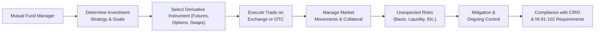

## 14.3 Risks of Derivatives Use by Mutual Funds

There’s a moment I recall from a few years back when a colleague of mine—managing a modest mutual fund—found herself on the edge of her seat, monitoring derivative positions that were meant (in theory) to protect the fund from market volatility. Well, it didn’t exactly go as planned. The hedge had some basis risk. The underlying asset didn’t move in perfect sync with the derivative. Cue a lot of tense chatter and very long nights. That experience, while stressful, proved enlightening. It highlighted that using derivatives in mutual funds can be a double-edged sword. They can hedge unwanted risk, but they can also bring in new, unexpected exposures.  

Below, we’ll explore the biggest offenders that can throw a mutual fund off-balance: market risk, counterparty risk, liquidity risk, operational risk, basis risk, and regulatory/compliance risk. We’ll also discuss some best practices for risk management, because let’s face it, if you’re going to engage with derivatives, you need to get it right.  

### Why Mutual Funds Use Derivatives

Before diving into the risks, it helps to see why mutual funds would want to dabble in derivatives at all. You might be thinking, “Aren’t these instruments super complex? Couldn’t a fund just stick to stocks and bonds?” Well, yes, but derivatives play many roles:

• They can hedge systemic or sector-specific risk.  
• They allow managers to adjust market exposures quickly and (potentially) cheaply.  
• They can provide synthetic exposures when direct access is limited (e.g., foreign markets).  
• They’re sometimes used for yield enhancement (e.g., writing covered calls).  

Still, derivatives aren’t straightforward. Bars of soap in a bathtub is what comes to mind: easy to drop if you’re not careful, and you can slip big time.

### Market Risk

Market risk is, in a nutshell, the possibility that the value of a derivative (whether it’s a futures contract, an option, or a swap) could move in a direction that goes against the mutual fund’s strategy. Even if a manager intends to hedge, there’s always the chance the hedge won’t hold under abnormal market moves.

• Think about a fund using equity index futures to hedge a basket of Canadian stocks. If market shocks ripple through global indexes, the derivative’s performance might deviate from the actual holdings.  
• High volatility can amplify these differences.  

You know that feeling when your seatbelt locks up too tightly? The seatbelt itself is a safety measure, but if it’s not well-fitted, it can be uncomfortable or even harmful if it malfunctions. Derivatives can be like that safety feature: great if they engage at the right time, but if they don’t, watch out.

### Counterparty Risk

If the derivative is traded over the counter (OTC)—like a swap or forward—then it’s not guaranteed by a central clearinghouse. That means the mutual fund faces the creditworthiness of its counterparty. If the person (or institution) on the other side of the trade fails or refuses to pay up, the fund could be left with a big hole in its risk management plan.

• When you’re dealing with big banks or well-known brokers, that risk might seem smaller, but it never vanishes.  
• A meltdown—like the global financial crisis—can disrupt entire institutions, making once “safe” counterparties suddenly vulnerable.

Here’s a friendly memory: a friend of mine once joked, “Counterparties are your BFFs… until they’re not.” You’re basically in a short-term marriage for the duration of the contract, trusting that the other side stays solvent and honest.

### Liquidity Risk

Derivatives can sometimes become illiquid, especially during turbulent markets. Maybe you entered a thinly traded forward contract or a specialized option with low daily volume. If volatility surges and no one wants to take the other side, the fund might be stuck in the position. Exiting could mean selling at a bad price and absorbing big losses.

• Exchange-traded derivatives like futures and listed options are typically more liquid than certain OTC derivatives, but the liquidity can still evaporate if the market seizes up.  
• For a mutual fund that promises daily redemptions, the last thing you want is an illiquid derivative tying up capital that you can’t unwind easily.

### Operational Risk

Operational risk sounds dull—until it isn’t. This is about the behind-the-scenes piping: your internal controls, compliance systems, data analytics, and the skill level of your trading desk. Imagine a scenario:

• The back-office agent incorrectly enters a swap’s notional amount.  
• The portfolio manager sets a leveraged futures position but doesn’t properly track the margin account.  
• The compliance oversight team is short-staffed and fails to detect an over-concentration in certain derivatives.

These slip-ups can be catastrophic because they can cause large, hidden exposures or losses. I once saw a fund realize months later that their derivative positions were double what they thought, all because of a coding error. “Fat finger” mistakes do happen, and you know what, they can be huge.

### Basis Risk

Basis risk creeps in when the derivative you use for hedging isn’t a perfect twin of your actual holdings. Let’s say you have a portfolio of Canadian mid-cap energy stocks, and you decide to hedge using a broad Canadian equity index future. Well, the movement of that index might not match your mid-cap energy weighting. So if the mid-cap space crashes while large-cap names in other sectors rally, the future might not offset your losses at all. You basically get an “Uh-oh, that didn’t work” moment.

• The closer the underlying derivative is to your actual holdings, the lower your basis risk.  
• Perfect hedges are near-mythical. There’s almost always some mismatch.

### Regulatory and Compliance Risk

Canada’s regulatory ecosystem for mutual funds is set by the CSA (Canadian Securities Administrators), with National Instrument (NI) 81-102 being a big piece. This regulation seeks to ensure mutual funds use derivatives responsibly, limiting:

• Excessive leverage.  
• Concentration risk.  
• Improper marketing of leveraged returns.  

CIRO oversees adherence to certain conduct rules for investment dealers and other fund distributors. And keep in mind that historical references to IIROC or MFDA basically point to the defunct organizations that merged into CIRO. So if a fund manager oversteps these bounds, the financial and reputational damage can be real.  

• Not abiding by these guidelines might result in regulatory sanctions or even forced unwinding of positions.  
• Frequent or unmonitored usage of derivatives can also lead to a higher risk classification under CSA Staff Notice 81-330.

### Visualizing the Flow of Derivative Risks

Below is a simple Mermaid.js diagram to illustrate how a mutual fund interacts with different risk factors when using derivatives. It’s not a piece of fine art, but it helps outline the process from strategy selection to eventual risk exposures:

At each step, different risks—market, counterparty, liquidity, basis, operational, regulatory—can appear. Proper monitoring can help, but mistakes or oversights can cascade and become costly.

### Best Practices for Mitigating Risks

It isn’t all gloom and doom. Yes, derivatives can be powerful when used correctly, and many mutual funds use them effectively every day. Here are some tips:

• Establish Clear Policies: A robust derivative use policy ensures everyone knows the do’s and don’ts. This includes concentration limits, permissible instruments, and required approvals.  
• Diversify Counterparties: When using OTC derivatives, don’t tie all your deals to a single institution. This lowers the potential damage if one entity defaults.  
• Use Central Clearing Where Possible: Central clearing mitigates counterparty risk by having a clearinghouse guarantee trades.  
• Maintain Adequate Liquidity: Keep some easy-to-sell assets to meet margin calls or collateral requirements for derivative positions.  
• Stress Testing and Scenario Analysis: This can reveal hidden pockets of risk, especially under extreme situations like a market crash or a credit freeze.  
• Ongoing Compliance Oversight: Make sure you have up-to-date knowledge of CIRO bulletins and NI 81-102 guidelines. Overstepping these can lead to forced liquidations and reputational harm.  
• Good Operational Infrastructure: Employ knowledgeable staff, implement checks and balances, and use recognized or open-source GRC (governance, risk, and compliance) tools, such as IBM OpenPages, to track and manage exposures.  

### Operational Infrastructure and Oversight

We can’t overstate how important infrastructure is. It’s like the plumbing in your house: you want it to flow smoothly, not leak or back up. Mutual fund companies typically build this in layers:

• Front Office: Portfolio managers and traders who design and execute strategies.  
• Middle Office: Risk management systems that conduct real-time or near real-time oversight of positions and exposures.  
• Back Office: Settlements, confirmations, collateral management.  
• Compliance Department: Ensures adherence to NI 81-102 and CIRO bulletins, monitors leverage limits, and provides regular reporting to regulators.

Any break or weakness in these layers can invite operational risk. For instance, a mismatch between front office and back office data could mean margin calls are not met on time or compliance breaches go undetected.

### Real-World Example and Lessons Learned

Suppose a hypothetical fund, Maple Growth Fund, invests in Canadian equities. One day, the manager notices increased volatility and decides to buy futures on the S&P/TSX Composite Index to hedge possible downside. The manager anticipates that if the market tumbles, these short futures might offset some of the losses in the fund’s portfolio. But:

1. The fund is overweight in energy stocks, which differ from the broader index composition.  
2. A surprise event drives up energy stock prices but drags down the broader market.  
3. The short futures position loses money, while the energy-heavy portfolio gains less than expected (due to basis mismatch).

The manager is stuck with an imperfect hedge that ironically created new market risk exposures. Stressful? Absolutely. This scenario underlines how basis risk rears its head in real portfolios.

### Additional Resources for Deep Dives

For those wanting to dig deeper, here are a few references and frameworks worth checking:

• **CSA Staff Notice 81-330**: Offers helpful guidance on how mutual funds in Canada should measure and disclose risk.  
• **CIRO Bulletins**: Access best practices and compliance updates at:  
  [https://www.ciro.ca](https://www.ciro.ca)  
• **Risk Management and Financial Institutions by John C. Hull**: A thorough look at counterparty risk, operational risk, market risk, and more.  
• **IBM OpenPages** or other open-source GRC tools: Large (and sometimes mid-sized) asset managers rely on enterprise solutions to track compliance, manage risk, and automate reporting.

### Closing Thoughts

Using derivatives in the mutual fund space isn’t inherently a bad thing. Indeed, many portfolio managers consider them a key component of modern finance. But let’s be honest: it’s easy to misfire. Market risk, counterparty default, liquidity crunches, operational snafus, basis mismatches, and regulatory run-ins can all converge if you’re not well-prepared.

Yet, by rigorously analyzing positions, maintaining robust internal controls, and respecting the guidelines laid out by CIRO and the CSA, funds have a solid chance of reaping the benefits of derivatives—while sidestepping the pitfalls. Maybe one day those seatbelt malfunctions (in my little anecdote) will be a distant memory for everyone.

---

## Sample Exam Questions: Risks of Derivatives Use by Mutual Funds



### Which of the following best describes basis risk in a mutual fund’s derivative strategy?

- [ ] The risk that a fund’s counterparty will default on its contractual obligations.  
- [ ] The risk that the fund manager’s operational controls will fail.  
- [ ] The risk that the underlying asset’s price is extremely volatile.  
- [x] The risk that the hedge does not move in sync with the underlying portfolio.  

> **Explanation:** Basis risk arises when the derivative used as a hedge doesn’t perfectly track or mirror the underlying assets in the fund’s portfolio.

### A mutual fund employs an OTC interest rate swap to hedge its exposure to floating-rate securities. Which statement is correct regarding counterparty risk?

- [ ] Counterparty risk is always eliminated because of central clearing.  
- [ ] Counterparty risk only applies to exchange-traded derivatives.  
- [x] The fund may face credit exposure if the swap dealer fails to honor the contract.  
- [ ] The fund faces no credit exposure because it is the floating-rate receiver.  

> **Explanation:** With OTC derivatives, the fund bears the credit risk of the swap dealer potentially defaulting on its obligations.

### A mutual fund relying heavily on proprietary software and manual trade reconciliation might be more vulnerable to which type of risk?

- [ ] Currency risk  
- [x] Operational risk  
- [ ] Liquidity risk  
- [ ] Volatility risk  

> **Explanation:** Operational risk can arise from inadequate systems, errors in processes, or insufficient human oversight within the organization.

### In the Canadian regulatory context, which body primarily oversees compliance and regulatory framework for investment dealers and mutual fund dealers as of 2025?

- [ ] IIROC  
- [ ] MFDA  
- [x] CIRO  
- [ ] OCC  

> **Explanation:** Effective January 1, 2023, the Investment Industry Regulatory Organization of Canada (IIROC) and Mutual Fund Dealers Association (MFDA) amalgamated into the Canadian Investment Regulatory Organization (CIRO).

### What might trigger liquidity risk for a mutual fund holding derivatives?

- [x] A sudden market event causing no buyers or sellers for its derivative positions  
- [ ] The use of derivatives listed on a heavily traded exchange  
- [x] Restrictive trading limits set by the fund’s compliance staff  
- [ ] Daily rebalancing of well-traded ETFs  

> **Explanation:** Liquidity risk manifests when a mutual fund cannot exit or adjust derivative positions easily without incurring material losses, often due to market disruptions or low trading volume.

### When a mutual fund has exposure to an index future that does not fully correlate with its portfolio, this is an example of:

- [ ] Volatility risk  
- [ ] Counterparty risk  
- [x] Basis risk  
- [ ] Regulatory risk  

> **Explanation:** Basis risk is the mismatch in performance between the derivative instrument and the actual underlying holdings.

### Which of the following measures can help mitigate counterparty risk for OTC derivatives?

- [x] Diversifying counterparties  
- [ ] Relying solely on margin call procedures  
- [x] Using collateral agreements or CSA (Credit Support Annexes)  
- [ ] Assuming centralized clearing is unnecessary  

> **Explanation:** Spreading exposures across different counterparties and having proper collateral arrangements can significantly reduce the chance of major losses if one counterparty defaults.

### Under NI 81-102, Canadian mutual funds are expected to:

- [x] Limit the extent of leverage they can utilize  
- [ ] Have no regulatory constraints on derivative usage  
- [ ] Only use exchange-traded derivatives  
- [ ] Seek risk classification from CIPF  

> **Explanation:** NI 81-102 restricts how much leverage mutual funds can use and outlines guidelines for derivatives usage.

### Stress-testing a mutual fund’s derivative exposure helps primarily in:

- [ ] Eliminating market risk altogether  
- [ ] Increasing the fund’s leverage capacity  
- [ ]]>

Hide the complexities of compliance from regulators  
- [x] Identifying potential losses under extreme market scenarios  

> **Explanation:** Stress testing reveals how the fund’s derivative positions might behave under severe market conditions, providing insight into potential high-stress losses.

### A mutual fund manager uses derivatives to enhance yield. True or False? This objective can introduce additional risks beyond traditional long-only equity or bond strategies.

- [x] True  
- [ ] False  

> **Explanation:** Using derivatives for yield enhancement may create leverage and exposure to counterparty or liquidity risks not present in a simple long-only approach.


