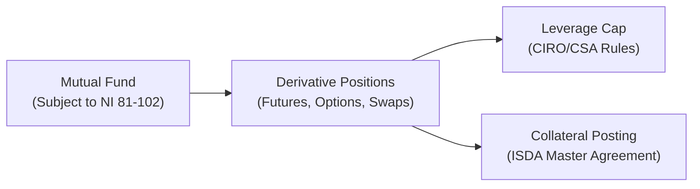

## 14.4 Limits on Derivative Use & Leverage (under CIRO/CSA Rules)

Sometimes, when folks picture “mutual funds,” they see these stable, slow-and-steady investment vehicles that grandma might use. But guess what: mutual funds can and do use derivatives—even if carefully. Learning about the rules around that usage (and the leverage it can create) is super important for both new and experienced investors. I remember my first experience analyzing a fund that had a small futures position. It completely changed my understanding of how funds manage risk and return. You’d think, “Oh, mutual funds don’t do complicated stuff,” but you'd be surprised at how some funds employ options, swaps, caps, floors—just to name a few. Under NI 81-102, however, funds must follow some pretty strict guidelines about how far they can go with derivatives, especially regarding leverage. Let’s talk through these rules and how CIRO, the Canadian Securities Administrators (CSA), and relevant regulations keep all of this in check.

  
The Regulatory Context

In Canada, mutual funds fall under National Instrument (NI) 81-102, which sets out the framework for investment funds’ overall governance, investment restrictions, and operational rules. Part 2 of NI 81-102 focuses specifically on the use of derivatives. And we now have CIRO (the Canadian Investment Regulatory Organization), i.e., our unified regulator that succeeded IIROC and the MFDA effective January 1, 2023. CIRO ensures that market participants—investment fund dealers, mutual funds, and so on—are abiding by these rules. It also sets additional margin rules for derivative transactions. Whenever you see a mutual fund’s simplified prospectus talking about “how we manage risk” or “derivatives strategy,” you can be sure there’s a behind-the-scenes compliance person making sure all that talk aligns with NI 81-102 and CIRO guidelines.

A quick note: On January 1, 2023, the Investment Industry Regulatory Organization of Canada (IIROC) and the Mutual Fund Dealers Association of Canada (MFDA) amalgamated into one entity, CIRO. References to IIROC or MFDA are purely historical. Today, it’s all about CIRO in the Canadian regulatory landscape.  

  
Understanding Leverage Caps

Leverage in mutual funds typically refers to total exposure from borrowed funds, short sales, or derivative contracts above the net asset value (NAV). Under NI 81-102, funds must not exceed a certain ratio of derivative exposure to their NAV—often known as the “leverage cap.” This effectively means that if a fund is worth $100 million, they can’t accumulate risk exposures that blow past an allowable threshold (the exact figure depends on how the regulations interpret and measure net notional exposure). Regulators don’t want a mutual fund that everyday Canadians rely on for stable growth turning into a high-octane speculative machine.

One could wonder: “Why so careful with this derivative exposure?” The short answer is that leverage can amplify returns but also amplify losses. If a fund excessively amps up leverage, a tough market environment could cause outsized losses, damaging the integrity of the asset pool. In other words, the fund might not meet investors’ expectations for risk management. NI 81-102 is like that friendly fence telling us: “You can go play in the yard, but you can’t wander off onto the highway.”

  
Hedging vs. Non-Hedging Distinctions

Now, the rules treat hedging a bit differently than speculation. Hedging is viewed as a defensive strategy—like wearing a seatbelt. If your mutual fund invests in U.S. stocks, you might hedge the currency risk by using futures or forward contracts on the CAD/USD exchange rate. Such transactions are mostly exempt from the same strict position limits that apply to speculative strategies. This is because the aim is risk reduction rather than risk creation.

Non-hedging or speculative transactions are those in which the fund basically says, “We think an asset’s price is headed up (or down), and we want to profit by taking a derivative position.” That’s more akin to seeking an upside or a pure directional bet. Regulators generally keep a closer eye on these positions, and they enforce stricter margin and collateral requirements.

  
Cover Requirements

Cover requirements are all about ensuring that a mutual fund isn’t nakedly exposed to potential losses without something to back it up. For instance, if a fund writes (sells) a call option on a stock, it must own an adequate amount of that stock (or a correlated derivative) so that if the option is exercised, the fund isn’t scrambling to buy the stock at a much higher price. Alternatively, if the fund has written a put option, it may be required to hold cash equivalent to the potential purchase obligation. These rules aim to reduce risk of a short squeeze or forced liquidation that can harm the fund’s liquidity and its investors.

In practical terms, think of “cover” as having enough “stuff” in your back pocket to pay for unforeseen obligations that might arise from your derivative positions. For exchange-traded products (like equity options), the Bourse de Montréal and CIRO both oversee these coverage obligations alongside the guidelines in NI 81-102.

  
Collateral Arrangements

When it comes to over-the-counter (OTC) derivatives, mutual funds often have International Swaps and Derivatives Association (ISDA) Master Agreements with counterparties. These agreements specify who posts collateral, how much is posted, and under what conditions. Funds might have to put up a certain percentage of the notional contract’s value as initial margin, then post variation margin (or “margin calls”) when the market moves against them.

Of course, you don’t want to be forced into selling the fund’s stable, long-term holdings at an unfavorable time just to meet a margin call. So mutual funds typically keep a chunk of liquid assets—often short-term government securities or cash—set aside to meet these obligations. This approach helps ensure that the core portfolio can survive storms without being fully dismantled.

  
Stress Testing

One best practice many mutual funds undertake is performing internal stress tests or scenario analysis. Picture it: the fund’s managers sit down and ask, “What if interest rates suddenly spike by 2%, or if the price of oil collapses, or if volatility in the equity market doubles overnight?” They feed these hypothetical moves into a model that approximates how the fund’s derivative positions would react. This helps the fund manager see if they might breach certain risk limits or face liquidity shortfalls. CIRO, along with global frameworks like Basel guidelines for bank capital, strongly encourages robust stress testing as a tool for ensuring that funds remain stable under extreme conditions.

Open-source statistical software (like R or Python’s pandas library) can help with scenario analysis. Some risk managers even use specialized financial libraries or cloud-based risk platforms that let them run thousands of market “paths” in a matter of minutes. The bottom line is that a forward-looking approach can detect vulnerabilities early, so the fund can be proactive in stepping down positions or increasing collateral.

  
Disclosure of Leverage

Funds must disclose in their simplified prospectus and other regulatory filings (like the Annual Information Form) if they utilize leverage from derivative strategies. This helps potential investors understand that the fund’s performance might be more volatile than a fund employing no derivatives. It’s important to note that even a so-called “conservative” fund can temporarily boost returns (or try to keep performance stable) via derivatives, but investors deserve transparency. If you’re reading a fund’s marketing materials and see phrases like “we use derivatives to enhance returns,” that is essentially a form of leverage that is subject to these regulatory requirements.

A lot of the time, you’ll see language detailing whether the derivatives are primarily used for hedging or speculation. This is a key difference both from a risk perspective and a regulatory vantage point. Remember: hedging gets more lenient treatment, while speculation is more heavily policed.

  
Real-World Example: Commodity Linked Mutual Fund

Let’s pretend we have a Canadian natural resources equity fund that invests mainly in shares of mining and energy companies. The fund manager is worried about an upcoming OPEC meeting. Suppose they believe crude oil might be extremely volatile. So the fund invests in crude oil futures to hedge some of its exposure or, in certain cases, might even hold put options on an oil ETF to protect against a downward move in commodity prices.

Because these derivatives add or modify the fund’s risk, the manager monitors them daily. If the positions get too large relative to the fund’s net assets, the manager may face a choice: reduce the position or post more collateral. Meanwhile, the fund’s compliance officer ensures that the total notional value of derivatives does not break the ceilings established in NI 81-102. If those positions are for pure speculation on a short-term price move, more constraints apply. Also, the fund must disclose the presence of these strategies in its prospectus, highlighting them as integral to the overall investment approach.

  
Mermaid Diagram of Key Relationships

Below is a simple Mermaid diagram illustrating how mutual fund derivative usage interacts with regulatory requirements, collateral, and the broader leverage cap.

In this simplified flow:
• The mutual fund initiates derivative positions.  
• These positions are subject to a leverage cap enforced by CIRO/CSA regulators.  
• The fund may need to post collateral under an ISDA Master Agreement if the derivatives are OTC.  

  
Practical Considerations and Common Pitfalls

• Liquidity Crises: If a fund needs to quickly free up cash to meet margin calls, it might be forced to sell assets at inopportune times.  
• Operational Complexity: Tracking daily valuations of derivative positions and ensuring continuous compliance with NI 81-102 can be quite resource-intensive.  
• Counterparty Risk: On OTC derivatives, the fund is exposed to potential default by the other side (though posting collateral and using credit support annexes help mitigate this).  
• Overconfidence: Some fund managers might believe they grasp derivatives thoroughly, only to find out in a volatile market environment that real-world conditions can differ from theory.  

  
Best Practices

• Thorough Hedging Documentation: Keep well-organized records that prove a given derivative position is genuinely for hedging and not speculation if you’re benefiting from more lenient margin or coverage rules.  
• Robust Internal Limits: Aside from regulatory thresholds, many funds self-impose stricter internal limits (e.g., “No more than 10% of the NAV in uncollateralized derivative exposure”).  
• Frequent Stress Tests: Conduct scenario analysis at least once a quarter, or even weekly for more volatile strategies.  
• Transparent Investor Communications: Make sure the simplified prospectus is actually simple. If the fund’s derivative usage is complicated, consider producing educational materials for investors.  

  
References for Further Exploration

• NI 81-102, Part 2: For specific rules on the use of derivatives by Canadian mutual funds.  
• CIRO’s Official Website (https://www.ciro.ca/): Check margin requirements, regulatory updates, and guidance on compliance with derivative transactions.  
• ISDA (https://www.isda.org/): For standard documentation practices relating to OTC derivatives and collateral arrangements.  
• “Leveraged Financial Markets: A Comprehensive Guide to Loans, Bonds, and Other High-Yield Instruments” by William Maxwell and Mark Shenkman: Offers broader perspectives on how leverage is used across different financial instruments.  
• Open-Source Tools: Software like R or Python for scenario testing, or specialized libraries like QuantLib for valuations.  

I think one of the biggest lessons I’ve learned is that while derivatives can be powerful, they’re also a fairly sharp double-edged sword. The fact that mutual funds must operate under these rules—caps on leverage, coverage requirements, margin rules, and robust internal controls—ensures that they don’t slash themselves (and their investors) in wild markets. By staying within the lines of NI 81-102, employing stress testing, and being transparent, mutual funds can harness derivatives in a way that’s consistent with the best interests of the unitholders.  

Anyway, hopefully this section clears up how these rules function. Let’s shift to a quick self-check to see if these concepts have sunk in.

  
## Sample Exam Questions: Limits on Derivative Use & Leverage (under CIRO/CSA Rules)



### Which regulatory instrument primarily governs the use of derivatives by Canadian mutual funds?

- [ ] National Instrument 31-103
- [x] National Instrument 81-102
- [ ] Canadian Trust Law, Section 101
- [ ] Basel III Guidelines

> **Explanation:** NI 81-102 sets out detailed provisions for mutual funds, including derivatives usage, leverage limits, and disclosure requirements in Canada.

### A mutual fund writes (sells) a call option on a stock it does not own. Which regulatory concept ensures it must maintain appropriate assets to cover this obligation?

- [x] Cover requirements
- [ ] Leverage ratio
- [ ] Hedging distinction
- [ ] Margin call

> **Explanation:** Cover requirements mandate that a fund have enough underlying holdings or cash-like equivalents to meet potential obligations from derivative positions, such as written calls.

### Under CIRO/CSA rules, which statement best describes the difference between hedging and speculative derivatives transactions?

- [x] Hedging reduces existing risk, while speculation aims to profit from price movements.
- [ ] Hedging increases market exposure, while speculation reduces it.
- [ ] Both hedging and speculation are treated the same under NI 81-102.
- [ ] Speculation is only permitted for government bond funds.

> **Explanation:** Regulatory rules treat hedges more leniently because they focus on risk mitigation, whereas speculative positions add risk to a portfolio.

### What is a primary purpose of stress testing mutual fund derivative positions?

- [ ] To reduce the expense ratio of the fund
- [x] To evaluate how the fund performs under extreme market movements
- [ ] To enhance the marketing materials of the fund
- [ ] To establish guaranteed returns for investors

> **Explanation:** Stress testing involves simulating extreme or unexpected market events to ensure the fund can remain within risk limits and meet obligations.

### A mutual fund invests primarily in U.S. equities. It uses currency derivatives to protect against USD/CAD fluctuations. Switch the derivative strategy to a purely speculative one?

- [x] If the derivatives exceed the notional exposure needed to hedge the portfolio’s currency risk.
- [ ] If the fund manager documents the hedging intention thoroughly.
- [ ] If the derivatives are exchange-traded instead of OTC.
- [ ] If the derivatives are used to reduce currency risk.

> **Explanation:** Using more derivatives than the underlying exposure requires indicates speculation rather than pure hedging.  

### Which document commonly governs collateral arrangements in OTC derivative transactions for mutual funds?

- [ ] Financial Statement Analysis Agreement (FSAA)
- [ ] Risk Disclosure Statement
- [x] ISDA Master Agreement
- [ ] NI 31-101 Derivatives Disclosure Form

> **Explanation:** The ISDA (International Swaps and Derivatives Association) Master Agreement is the standard framework for OTC derivatives and outlines collateral posting obligations.

### Under NI 81-102, what is the main reason for imposing a leverage cap on mutual funds?

- [x] To prevent excessive risk-taking that could harm unitholders
- [ ] To guarantee a minimum return on the fund
- [ ] To ensure the fund manager can invest in only government bonds
- [ ] To allow unlimited exposure to derivatives

> **Explanation:** Regulators protect investors by capping how much a fund can amplify exposure through derivatives, thus limiting potential outsized losses.

### When a mutual fund is required to maintain enough cash or liquid assets to meet potential losses on derivative positions, it is addressing:

- [x] Margin calls and cover requirements
- [ ] Hedging inefficiency
- [ ] Tax obligations
- [ ] Redemption gating

> **Explanation:** Maintaining liquid assets ensures the fund can promptly meet margin calls or respond to unexpected market moves related to derivatives.

### A mutual fund employing derivatives to enhance returns should disclose this practice in:

- [x] Its simplified prospectus and other required filings
- [ ] A private letter to all institutional investors only
- [ ] No disclosure is needed if the derivative use is short-term
- [ ] A footnote in its marketing brochure

> **Explanation:** Mutual funds must be transparent about leverage and derivative strategies in official regulatory disclosures such as the simplified prospectus and annual information form.

### True or False: Speculative derivatives positions always have more lenient margin requirements than hedging positions under CIRO rules.

- [ ] True
- [x] False

> **Explanation:** In fact, speculative positions typically have stricter margin requirements and are more closely monitored, because they add risk instead of offsetting it.


