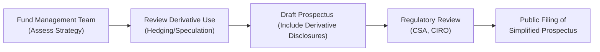

## 14.5 Disclosure of Derivative Strategies in Simplified Prospectuses

So, I remember the first time I flipped through a mutual fund’s simplified prospectus—maybe I was in my early days of investing and, honestly, I felt a little intimidated. All those definitions, disclaimers, and references to complex-sounding “derivative strategies” left me scratching my head. But guess what? We’re going to break it all down here. This section is an in-depth guide to how mutual funds disclose their derivative strategies in a simplified prospectus, why they do it, what it means for investors, and what regulators expect. And, along the way, I’ll share a few anecdotes that might help you relate these rules to real life. Anyway, let’s dive in!

### Importance of Clear Disclosure

When a mutual fund uses derivative products—like futures, options, or swaps—it creates a layer of complexity beyond traditional stock or bond holdings. Derivatives can help the fund manage risk (like hedging against currency fluctuations), enhance returns (through speculative positions), or simply replicate a certain market exposure at a lower cost. But here’s the catch: these instruments can also magnify losses if used incorrectly.

That’s why clear, accessible disclosure in a simplified prospectus is so essential. Under Canadian securities regulations, including National Instrument (NI) 81-101 Mutual Fund Prospectus Disclosure, each mutual fund must provide a concise, plain-language explanation of how and why derivatives are employed, what sorts of risks are involved, and how these strategies might impact the fund’s performance. Think of this as the fund’s “promise” to keep investors informed before they invest a single dollar.

### Incorporating Derivatives into Investment Objectives & Strategies

One of the central points any prospectus should address is how derivatives fit into the fund’s broader investment objectives and strategies. For instance, if a fund aims to generate stable, low-volatility returns, it might primarily employ derivatives for hedging—like currency forwards or interest rate swaps—to reduce unwanted fluctuations. Conversely, if a fund’s objective is growth with a higher risk tolerance, the prospectus might reveal that it uses options or futures contracts to enhance returns, potentially taking on more price volatility.

#### Example: A Hedging-Focused Fund

Imagine a Canadian mutual fund that invests in global equities but wants to minimize the fluctuations caused by foreign exchange rates between CAD and USD. The simplified prospectus would highlight a currency-hedging strategy—perhaps using currency forwards—to ensure that currency swings don’t overshadow the fund’s underlying equity performance. So you might read lines like: “To achieve the fund’s objective of stable, long-term growth, the manager uses forward contracts on USD, EUR, and GBP exposures to reduce currency risk.”

#### Example: A Speculative-Position Fund

In another scenario, a resource-focused fund might use oil futures to increase its exposure to energy prices, anticipating that oil prices will rise. The simplified prospectus might note: “The manager may use futures contracts on crude oil to gain or reduce exposure to energy markets, aiming to capitalize on price trends.” The language must clarify that these positions carry elevated risk and can boost volatility in the fund’s returns.

### Specifying the Risk Factors

Let’s be real: derivatives can be intimidating. Words like “margin calls,” “counterparty risk,” or “illiquidity” might send shivers down our spines if we’re not sure what they mean. The prospectus should address these issues plainly. Besides general market risk, the fund’s risk disclosure section should reference:

• Counterparty Risk: If a counterparty (like a bank in an over-the-counter swap) fails to meet its obligations, the fund might suffer losses.  
• Leverage Risk: Because derivatives often require only a fraction of the notional value as margin, the fund can have outsized gains—or rapid losses.  
• Liquidity Risk: Some derivative markets may be thinly traded, making it tough to unwind a position without incurring losses.  
• Volatility Risk: The use of options or futures can exacerbate price swings, particularly if speculating.  

Clearly and explicitly addressing these risks is crucial because regulators and investors alike need to know what they’re getting into.

### Historical Performance Impact

While funds aren’t absolutely required to dissect the past impact of derivatives, many managers choose to highlight how using derivatives has affected their returns or volatility historically. This might show up in a fund’s Management Report of Fund Performance (MRFP) or, occasionally, in the simplified prospectus when it’s deemed significant or “material.” For instance, a fund might say, “During the 20XX market downturn, the fund’s put option strategy partially offset equity losses, mitigating the overall drawdown.”

Of course, disclaimers are typically added to emphasize that past performance isn’t always indicative of what may happen in the future. But, as investors, these insights can be super helpful, right? They offer a snapshot of how effectively the fund manager has used derivative hedges or opportunistic derivative positions in real-world scenarios.

### Ongoing Responsibility of Fund Managers & Trustees

Fund managers and trustees carry the ultimate responsibility for ensuring that the simplified prospectus remains accurate and up to date when it comes to derivative usage. Maybe the fund used to stick to vanilla currency forwards, but now they’ve decided to incorporate some advanced equity index options. In that case, the simplified prospectus must be amended to reflect the new strategies, since they introduce potentially different risk factors and performance outcomes.

Furthermore, each manager must have robust internal controls—policies and procedures to ensure that derivatives are monitored, valuations are accurate, and risk exposures aren’t exceeding pre-set limits. If a fund manager changes strategy mid-year, they must account for that in annual or interim updates to ensure you, the investor, are always in the know.

### Regulatory Review Process: Provincial Commissions & CIRO

Canadian securities regulators, including the provincial or territorial securities commissions, and the Canadian Investment Regulatory Organization (CIRO) have the power to review fund prospectuses for compliance. If they spot deficiencies—say, a fund fails to mention the kind of derivatives it uses, or it glosses over the risk implications—they can require amendments or potentially put restrictions on the fund’s marketing. Before 2023, we might have heard references to the Mutual Fund Dealers Association of Canada (MFDA) or the Investment Industry Regulatory Organization of Canada (IIROC). Those were the predecessor organizations that amalgamated into CIRO, our current single self-regulatory organization for investment dealers and mutual fund dealers in Canada.

Anyway, this oversight ensures that funds can’t simply bury important risks or disclaimers. The regulatory environment is designed to protect investors and maintain a high level of trust in Canadian capital markets.

### Key Definitions

• **Simplified Prospectus:** A concise legal document describing a mutual fund’s investment strategy, objectives, risks, and fees. It’s required by securities regulators under Canada’s NI 81-101. Think of it as a streamlined introduction to the fund’s “who, what, and why.”  
• **Material Risks:** Risks significant enough that a reasonably informed investor would consider them critical when deciding whether to invest. If a fund uses derivatives extensively, that’s material because it transforms how the fund behaves under different market conditions.  
• **Fund Managers & Trustees:** These are the people or firms legally responsible for the fund’s operations, compliance, and performance. They’re like the captain and crew of the investment “ship.”  
• **Volatility:** Reflects how wildly the price of a security (or entire fund) can swing. Derivatives can either reduce volatility (i.e., through hedges) or amplify it (through leverage).  
• **Amendments (Prospectus Updates):** Significant changes, such as employing new types of derivatives or shifting their risk management approach, must be noted in updated prospectus documents.

### A Visual Overview of the Disclosure Process

Let’s look at a quick diagram that might give a bird’s-eye perspective on how derivative use is disclosed in a simplified prospectus:

The process starts when the fund managers decide on the kind of derivative strategy they want to implement. They evaluate whether it aligns with the fund’s overall goals—hedging, speculation, or maybe a combination of both. Then they incorporate that into the draft prospectus, ensuring the required derivatives disclosure is provided (e.g., the rationale, risk details). The document is then submitted to the relevant regulators—chiefly the Canadian Securities Administrators (CSA) and CIRO in 2025—for a compliance review before becoming available to the public.

### Common Pitfalls and Best Practices

- **Vague Risk Disclosure:** Some funds have historically been too general in describing possible derivative losses. Best practice is to be specific about the nature of instruments (e.g., equity index options, currency forwards) and how they may fail.  
- **Lack of Clarity on Intended Use:** Funds should clarify whether derivatives will be used primarily for hedging, for return enhancement, or for both. This distinction, while subtle, can really matter if the fund’s volatility rises more than shareholders expect.  
- **Ignoring Fund Mandate:** Derivative strategies can drift outside the original mandate if not carefully monitored. Disclosure must remain consistent with the fund’s stated objectives.  
- **Forgetting to Update Prospectus:** If you change your derivative strategy, you must swiftly update your prospectus, or risk providing misleading information to current and prospective investors.

### Real-World Scenario: Currency-Hedged Global Bond Fund

Let’s say a Canadian fund invests in a basket of global government and corporate bonds, from U.S. Treasuries to European corporate debt. The manager actively employs currency forwards to hedge the currency risk back to Canadian dollars (CAD). In the simplified prospectus, the manager will likely include:

• **Investment Objective:** “To provide stable returns and capital preservation through investment in a diversified portfolio of global bonds.”  
• **Derivatives Used:** “Currency forward contracts to hedge foreign currency exposure primarily against the Canadian dollar. Forward contracts may also be used periodically to hedge interest rate risk.”  
• **Risk Disclosure:** “While currency hedging limits fluctuations due to foreign exchange rates, it introduces the risk that the forward contract might be illiquid or that counterparties could default. As a result, the fund may face material losses if these events occur.”  

Additionally, the historical performance section might note that, in prior periods of high USD volatility, the fund’s returns remained steadier thanks to the hedging strategy. This helps prospective investors see tangible evidence of how derivative usage factored into the fund’s track record.

### Regulatory Requirements & Canadian Context

Canada’s regulatory framework is robust. If you’re diving deeper, you’ll come across National Instrument 81-101, which sets out the rules for mutual fund prospectus disclosure. The Canadian Securities Administrators (CSA) have also issued various staff notices and policy statements clarifying how funds should communicate risks to retail investors. CIRO, as the single self-regulatory organization overseeing both investment dealers and mutual fund dealers, continuously updates guidelines to ensure compliance and clarity—especially regarding new, more exotic derivatives or innovative strategies that funds may adopt.

For further reading, you might visit:

- NI 81-101 Mutual Fund Prospectus Disclosure (on the official CSA website).  
- CSA Policy Statements on risk disclosure (easily found online via the CSA resource center).  
- CIRO’s official site at https://www.ciro.ca for updates and guidance on mutual fund compliance in Canada.  
- The Canadian ETF Association (CETFA) website, which often includes best practices for disclosing derivatives usage, applicable to ETFs and, by extension, relevant to mutual funds.

### Conclusion

Here’s the bottom line: derivatives can be exceptionally versatile tools in a mutual fund’s arsenal—offering ways to hedge, speculate, or enhance returns. But with that potential for better performance or reduced risk comes the responsibility to inform and protect investors. The simplified prospectus is the main channel for that transparency, helping you and me understand what’s going on behind the scenes.

From specifying objectives and strategies to clarifying how derivatives affect risk, fund managers and trustees must ensure everything’s spelled out in plain language. And let’s not forget: regulators like the CSA and CIRO are keeping watch, ready to enforce the rules. So, if you ever find yourself flipping through a simplified prospectus again—maybe you’re bored on a Tuesday night or genuinely curious—remember these guidelines. They’re there to help you make an informed decision, free from unwelcome surprises.

---

## Sample Exam Questions: Disclosure Requirements for Derivatives in Mutual Funds



### Mutual Fund Derivative Disclosures

- [ ] Derivative use does not need to be disclosed if the fund only hedges currency risk.
- [x] A mutual fund must disclose the nature, purpose, and risks of any derivative strategies in its simplified prospectus.
- [ ] Prospectus disclosure is only necessary if the fund consistently loses money on its derivative positions.
- [ ] Fund managers are not required to disclose changes in derivative strategy until the next fiscal year.

> **Explanation:** Under NI 81-101, mutual funds must disclose all material aspects of using derivatives. This includes hedging, speculating, or any other derivative-based approach.

### Importance of Plain-Language Explanations

- [ ] Plain language in the prospectus is not a requirement but a recommendation for convenience.
- [x] Plain language is mandated because investors should easily grasp the nature and implications of derivative investments.
- [ ] Only a section on complicated legal language is required.
- [ ] Plain language is discouraged as it might oversimplify numeric disclosures.

> **Explanation:** Canadian securities regulations demand that prospectus disclosures be understandable so retail investors can make informed decisions.

### Currency-Hedged Funds

- [x] Typically use forward contracts to manage foreign exchange fluctuations.
- [ ] Are prohibited from using derivatives unless explicitly stated by CIRO.
- [ ] Are not required to disclose the type of derivatives used if currency exposure is small.
- [ ] Usually aim for higher volatility than non-hedged funds.

> **Explanation:** Currency-hedged funds commonly use forwards to stabilize returns. This strategy must be disclosed in the simplified prospectus, including risks such as counterparty and liquidity risks.

### Risk Factors Associated With Derivatives

- [ ] Only credit risk is relevant to derivatives disclosure.
- [x] Counterparty, leverage, liquidity, and volatility risks are among the material risks that must be outlined.
- [ ] There is no need to reference derivative risks unless the fund invests more than 50% of assets in derivatives.
- [ ] Risk factors are only discussed once in the fund’s annual report, not in the simplified prospectus.

> **Explanation:** Funds must disclose each material risk related to their derivative activities, ensuring investors understand potential downsides.

### Historical Performance Impact

- [ ] Simplified prospectuses must always include an in-depth breakdown of every derivative gain or loss since inception.
- [ ] Historical performance is irrelevant to investors and omitted from the prospectus.
- [x] Some funds highlight how derivatives contributed to past returns or volatility if it’s material for investor understanding.
- [ ] Including performance data is strictly prohibited by NI 81-101.

> **Explanation:** Many funds voluntarily offer insights on how derivatives influenced past returns to give investors a clearer picture, though exhaustive detail might be in other documents.

### Role of Fund Managers & Trustees

- [ ] They can delegate disclosure responsibilities entirely to external consultants.
- [ ] They are not liable for errors in the simplified prospectus.
- [ ] Once the prospectus is filed, their responsibility ends.
- [x] They must ensure the prospectus accurately reflects all derivative strategies and update it if strategies change.

> **Explanation:** Fund managers and trustees are responsible for ongoing accuracy of all disclosures, especially concerning derivatives, which can evolve over time.

### Regulatory Review by CSA and CIRO

- [ ] Occurs only after a fund has been operational for at least five years.
- [x] Can lead to demands for amendments if disclosures are unclear or incomplete.
- [ ] Is conducted by the defunct IIROC and MFDA.
- [ ] Only applies to new funds, not existing ones.

> **Explanation:** Both the Canadian Securities Administrators (CSA) and CIRO conduct reviews to maintain market integrity and investor protection.

### Material Risks Definition

- [ ] Only includes external economic risks, such as inflation and recession.
- [x] Consists of any risks a reasonable investor would consider important before investing.
- [ ] Is limited to systemic market risk if the fund invests in derivatives.
- [ ] Refers solely to risks related to the fund’s distribution channels.

> **Explanation:** Material risks cover any threats significant enough to potentially impact an investor’s decision, encompassing derivatives and broader market factors.

### Vague vs. Specific Derivative Risk Disclosure

- [x] Specific disclosure about instruments used (e.g., swaps, forwards, options) is considered best practice.
- [ ] General statements like “some derivatives risk may apply” is typically sufficient.
- [ ] Funds are prohibited from explicitly naming derivative instruments in the prospectus.
- [ ] No references to derivative strategies are ever mandated in Canada.

> **Explanation:** Best practices and regulatory expectations require that funds detail not just that derivatives are used but also how they are used and why.

### True or False: Simplified Prospectus Amendments

- [x] True
- [ ] False

> **Explanation:** A simplified prospectus must be updated or amended whenever there are significant changes to the fund’s derivative strategies or material new risks introduced.


