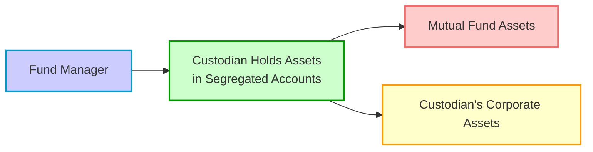

## 14.6 Custodians’ Role in Monitoring Exposure

When I first started exploring mutual funds and their use of derivatives, I was a bit intimidated by the complexity of day-to-day oversight. It seemed like there were countless moving parts—leverage rules, margin calls, compliance checks, you name it. But after chatting with a friend who worked at a large Canadian bank acting as a custodian, I realized there’s this entire “behind-the-scenes” world. Custodians—those specialized financial institutions entrusted with safeguarding fund assets—play a quiet yet critical role in ensuring that any derivative usage lines up with regulations, investment objectives, and risk limits.

Below, we’ll walk through how custodians monitor derivative exposures in mutual funds, illustrate the processes with practical scenarios, and highlight best practices for managing these exposures. In keeping with Canadian regulations under NI 81-102, custodians are absolutely central to the whole safety net for investors, making sure that every margin transfer is checked, every open position is reconciled, and every potential breach in risk limits is flagged.

### Custodial Oversight

Mutual funds are generally required by law—and by good business sense—to appoint a custodian that focuses on safety, transparency, and compliance. Under the Canadian rules in NI 81-102, a mutual fund’s assets must be held by a separate, qualified custodian. A typical custodian might be a major bank or a trust company (often overseen by the Office of the Superintendent of Financial Institutions (OSFI) if they operate in Canada).

Why the need for a custodian in the first place? Well, imagine a world where the fund manager held all the positions and also owned the accounts that physically held the assets. One glitch or unscrupulous move, and the investors’ money might be at major risk. A custodian keeps everything separate—kind of like a neutral vault—while also providing critical oversight of the fund’s derivative transactions and daily operational checks.

Let’s say a Canadian mutual fund invests in equity futures and interest rate swaps. Each day, the custodian checks how these derivative positions change in value and ensures the fund manager is complying with regulatory or internal leverage limits. If something looks off (like the fund is over-extended or margin calls aren’t met), the custodian steps in to alert relevant parties and possibly restrict or correct the activity. This custodial oversight ensures that the entire process remains above board and within acceptable risk parameters.

### Verification of Collateral Movements

When a mutual fund enters into derivative transactions—especially over-the-counter (OTC) deals—collateral or margin must be posted. This might be in the form of cash, government securities, or other liquid assets. Now, from time to time, I’ve heard people say, “Well, as long as we have enough collateral overall, what’s the big deal?” But the big deal is: If those transfers aren’t done promptly or accurately, the mutual fund and its investors could face losses or even default risk.

Custodians verify each margin or collateral movement to confirm:

• The transaction meets the regulatory requirements under NI 81-102.  
• The margin posted (or received) is allocated correctly.  
• The logs of collateral usage match the daily trading records of the fund.  

OSFI provides guidance on capital and risk requirements for banks. They typically incorporate robust procedures around vetting collateral. This is why the custodian’s daily or periodic checks are essential. They effectively protect the fund (and by extension, the investor) from any calculation errors or possible shortfalls in collateral.

### Position Reconciliation

Position reconciliation might sound like a tedious back-office function, but it’s actually a pivotal process that ensures no mismatch exists between the fund manager’s records and the custodian’s records. While it might feel about as exciting as balancing a checkbook, trust me, it’s incredibly important. In a typical scenario, the custodian receives data feeds from the fund manager, the exchange, or the OTC counterparty. Then, the custodian compares those feeds to its own records to confirm that every derivative position is accounted for.

If you’ve ever used a personal budgeting tool and found a random $20 discrepancy, you’ll know how frustrating that can be. Now, multiply that scenario by millions of dollars, across thousands of positions—reconciliation is a big job. It’s done to ensure:

• The fund manager’s open derivative contracts match the custodian’s list.  
• Unrealized gains/losses and daily margin requirements are consistently reported.  
• The fund’s internal risk limits are monitored in real time.  

If there is a discrepancy—say an unrecorded futures position—the custodian and the fund manager investigate promptly. This daily or near-daily reconciliation is often mandated by the fund’s internal policies and by regulatory bodies.

### Audit and Reporting

Now, let’s talk audits. “Audit” is one of those words that can make folks a little uneasy. But in practice, it’s just an extra layer of verification. Custodians work closely with internal auditors (within the fund manager’s organization), external auditors (independent accounting firms), and sometimes even regulatory examiners to provide evidence that each derivative transaction was done properly.

Audits usually require more detailed data than a daily check. They might pull sample transactions and track them from initial trade to final settlement. They might also look at the fund’s official statements to confirm that the derivative exposures and valuations have been reflected accurately. For exchange-traded derivatives, the prices are typically straightforward. With OTC derivatives, custodians help confirm valuations with third-party pricing services or reference market data. This fosters transparency so that watchers—institutional clients, external regulators, or even fund investors—can see how the derivative usage is affecting the fund’s risk-return profile.

Moreover, the custodian’s reports feed into the audited financial statements, ensuring that the fund’s net asset value (NAV) correctly reflects any derivative gains or losses. This type of transparency is especially crucial if market conditions shift abruptly. A thorough audit approach, supported by the custodian, helps confirm that no corners are cut and no exposures are hidden.

### Maintaining Segregation of Assets

One of the biggest responsibilities for custodians under NI 81-102 is maintaining segregation of assets, which basically means not mixing the fund’s assets with other accounts or with the custodian’s own corporate assets. This is designed to protect the mutual fund’s holdings in the event the custodian or the fund manager faces insolvency.

By segregating assets in specialized trust accounts, the custodian ensures that the money is only used for its intended purpose—covering positions, meeting margin checks, or fulfilling redemption requests. If the manager or the custodian itself were to fail, these segregated accounts would be walled off from other creditors to help ensure that investors remain protected.

Here’s a simple mermaid diagram illustrating how a mutual fund’s assets remain separate, highlighting the custodian’s response in different scenarios:

In the diagram above, the custodian (B) ensures that the mutual fund’s assets (C) are stored distinctly from its corporate assets (D). Even if the custodian or the manager (A) experiences financial trouble, the fund’s holdings remain shielded.  

### Monitoring Market Movements

Markets, as we all know, don’t stand still. Equity prices jump. Interest rates climb. Commodity prices dive. And each of those movements can change the value of a mutual fund’s derivative positions in a split second. So, if a market swing pushes a fund’s derivative usage beyond the threshold laid out in its prospectus or internal risk metrics, the custodian (often automatically via real-time systems) can flag that discrepancy.

• Example: A mutual fund that invests in gold futures sees the price of gold skyrocket overnight. This might cause the notional exposure of the fund’s positions to exceed the limit specified by the fund’s investment policies. The custodian’s system immediately notices that risk is nearing the limit and alerts the fund manager to take corrective actions—maybe by closing or reducing positions.

Custodians typically set up real-time or near-real-time monitoring tools. Combined with the fund manager’s own risk systems, these tools create a safety net that helps the fund stay within regulatory guidelines (like maximum permitted leverage under NI 81-102) and any additional constraints set by the manager’s internal risk committee.

### Practical Example: Equity Index Futures

Let’s say a Canadian balanced mutual fund uses equity index futures (such as the S&P/TSX 60 futures) to temporarily adjust equity exposure. While the manager focuses on optimal asset allocation, the custodian tracks real-time positions daily.

1. The mutual fund decides to take a long position in S&P/TSX 60 futures for a notional value of $20 million.  
2. The custodian verifies that an initial margin of, say, $1 million is posted, consistent with the clearing broker’s rules.  
3. As the value of these futures moves with the market, the custodian tracks daily settlements, ensuring that any variation margin is transferred appropriately.  
4. If a sudden spike in the index leads to a large daily gain, the custodian ensures margin call proceeds are credited to the fund. If there is a drop in the index, the custodian makes sure the fund posts additional margin on time and in the correct amount.  
5. At month-end, the custodian’s statements align with the fund manager’s statements, external trading records, and the clearing corporation’s records.  

By overseeing these steps, the custodian greatly reduces operational and financial risk, helping the mutual fund manager stay on track with strategies, while also safeguarding investor assets along the way.

### Glossary

• **Custodian:** A financial institution (often a trust company or large bank) responsible for keeping a mutual fund’s assets safe. Custodians also oversee and verify derivative positions to ensure compliance with investment guidelines and regulations (such as NI 81-102).  

• **Collateral:** Assets pledged to secure a derivative position or a loan. This is used by counterparties to mitigate default risk. In the case of a mutual fund, the custodian often verifies and tracks these collateral movements.  

• **Reconciliation:** The process of matching and verifying positions or transactions across different records (e.g., between the fund manager’s system and the custodian’s system).  

• **Audit:** An independent examination of a mutual fund’s financial records. External or internal auditors cooperate with custodians to confirm accuracy and compliance with accounting and regulatory standards.  

• **Segregation of Assets:** The practice of keeping a fund’s assets separate from the manager’s and from other clients’ accounts. This helps protect the fund’s investments if the manager or custodian were to become insolvent or commit wrongdoing.

### Best Practices and Common Pitfalls

It’s all well and good to talk about how custodial oversight is supposed to work, but sometimes real life throws a curveball.

• **Maintaining Detailed Records:** In my opinion, one of the best ways to avoid problems is to keep highly detailed records. A lapse in recordkeeping can lead to small discrepancies that morph into big headaches during an audit.  

• **Communication Between Fund Managers and Custodians:** A frequent challenge is miscommunication between the fund manager and custodian, especially with time-sensitive margin calls. If the custodian doesn’t receive timely information, margin calls can be missed.  

• **Ensuring Infrastructure for Real-Time Monitoring:** In addition to daily checks, real-time feed integrations can help minimize big swings in exposure. Funds with robust technology infrastructures see fewer compliance violations than funds relying on delayed processes.  

• **Regulatory Alignment:** People sometimes think of regulations like NI 81-102 as “checklists,” but they’re more akin to embedded safety belts. Always be aware if new guidance or amendments are introduced by Canadian Investment Regulatory Organization (CIRO) or by the Canadian Securities Administrators (CSA).  

• **Global Comparisons:** If the fund invests internationally, it might also be subject to margin and collateral rules from organizations like the Bank for International Settlements (BIS). Keeping track of cross-border requirements is essential to avoid regulatory friction.

### References & Additional Resources

• **NI 81-102:** The definitive Canadian regulation for mutual funds, covering custody, permitted derivatives usage, and much more.  
• **CIRO (Canadian Investment Regulatory Organization):** Canada’s self-regulatory organization that oversees investment dealers and mutual fund dealers. See [https://www.ciro.ca](https://www.ciro.ca) for updated guidelines.  
• **OSFI:** Guidance on capital adequacy and risk management for banks and trust companies acting as custodians.  
• **Bank for International Settlements (BIS):** Publications on margining practices and collateral management.  
• **“Custody Risk” by Philippa Foster Back:** A resource from the Chartered Institute for Securities & Investment, diving deeper into custodianship.  
• **Open-Source Tools:** Python-based libraries (like Pandas) or specialized reconciliation software (e.g., Open Recon Tools) can help automate daily position checks.

### Bringing It All Together

Custodians form the bedrock of trust in the mutual fund industry. They combine high-tech systems, strict internal protocols, and a deep understanding of regulatory frameworks to ensure that the fund’s derivative exposures are handled appropriately. With daily position reconciliation, collateral verification, and the segregation of assets, custodians help maintain a stable financial environment where the unexpected doesn’t spiral out of control.

Anyway, the moral of the story? When you see “custodian” in a mutual fund document, remember there’s a lot of heavy lifting happening behind the scenes—24/7 risk checks, margin verifications, audits, and everything else. It all keeps the system working smoothly, and that’s ultimately in every investor’s best interest.

## Sample Exam Questions: Custodian's Role for Derivatives in Mutual Funds



### A custodian’s primary function in a mutual fund structure is to:
- [ ] Actively trade derivatives on behalf of the fund.
- [ ] Provide investment advice and decide on fund allocations.
- [x] Safeguard the fund’s assets and oversee key functions like collateral verification.
- [ ] Create and market new derivative products for the fund.

> **Explanation:** The custodian’s role is to securely hold the fund’s assets and monitor derivative exposure, not to make investment decisions or market derivative products.

### Which of the following best describes “position reconciliation” in a custodial context?
- [ ] Ensuring the fund manager’s trades follow the investment policy.
- [x] Matching the custodian’s records of derivative positions with the fund manager’s records.
- [ ] Adjusting the asset allocation based on market trends.
- [ ] Calculating the net asset value (NAV) of the fund daily.

> **Explanation:** Position reconciliation is about verifying that both the custodian and the fund manager have consistent records of open positions and valuations.

### Under Canadian regulations such as NI 81-102, custodians must:
- [ ] Merge their corporate assets with the mutual fund’s assets to reduce admin costs.
- [ ] Maintain exclusive brokerage rights for the mutual fund’s trading activity.
- [ ] Oversee the fund’s marketing initiatives and investor outreach.
- [x] Segregate mutual fund assets in trust or segregated accounts separate from the custodian’s assets.

> **Explanation:** Segregation of assets is mandated to protect investors and to ensure the fund’s monies are not commingled with the custodian’s own assets, meeting the requirements of NI 81-102.

### Why is verifying margin or collateral movements important for custodians?
- [ ] Because custodians must decide which new derivatives the fund should trade.
- [ ] It helps custodians earn additional returns on the fund’s collateral.
- [x] To ensure that the fund’s margin requirements are met promptly along with regulatory compliance.
- [ ] So that the custodian can underwrite new derivative issuance.

> **Explanation:** A key aspect of the custodian’s role is ensuring correct collateral and margin transfers, reducing counterparty and operational risks.

### Which entity replaced IIROC and MFDA to form a single organization to oversee investment dealers and mutual fund dealers in Canada?
- [ ] The Bank for International Settlements (BIS)
- [ ] The Office of the Superintendent of Financial Institutions (OSFI)
- [x] The Canadian Investment Regulatory Organization (CIRO)
- [ ] The Canadian Securities Administrators (CSA)

> **Explanation:** Effective 2023, CIRO became Canada’s self-regulatory organization, amalgamating the roles of IIROC and MFDA.

### In monitoring mutual fund derivatives exposure, custodians typically:
- [ ] Defer to the fund manager’s judgment at all times, with no oversight.
- [x] Track real-time or near-real-time market fluctuations to flag exposure breaches.
- [ ] Create their own derivative products and propose them to the fund.
- [ ] Have no obligation to reconcile daily positions.

> **Explanation:** Custodians monitor market movements to identify potential breaches in a fund’s risk limits and reconcile positions daily (or at specified intervals).

### If a mutual fund’s derivative use suddenly exceeds its stated risk limits, the custodian will most likely:
- [ ] Take over the fund’s portfolio management.
- [ ] Passively watch market developments without action.
- [x] Alert the fund manager and possibly enforce corrective measures.
- [ ] Automatically close all derivative positions without warning.

> **Explanation:** The custodian’s responsibility is to notify and/or enforce remedial actions if the fund breaches exposure limits, but it doesn’t unilaterally close positions.

### Which of the following ensures the mutual fund’s NAV is accurate regarding derivative positions?
- [ ] Regular marketing campaigns for the fund.
- [x] Collaboration between the custodian’s oversight process, the fund manager, and audited reporting.
- [ ] Exclusive distribution agreements with brokerage houses.
- [ ] Fund managers ignoring margin calls.

> **Explanation:** Accurate NAV calculation requires consistent data from the fund manager and custodian, typically validated in audits and daily checks.

### What is a key benefit of custody arrangements for mutual funds using OTC derivatives?
- [ ] Eliminates the need for collateral.
- [ ] Guarantees that any losses are reimbursed by the custodian.
- [ ] Allows the custodian to co-mingle all assets to boost liquidity.
- [x] Ensures collateral movements are transparent and verifiable, lowering counterparty risk.

> **Explanation:** Custodians validate margin transfers, thereby increasing transparency and lowering the risk of default or mismanagement of collateral.

### True or False: Custodians are required to use specialized trust or segregated accounts so that the mutual fund’s assets are shielded from the custodian’s own financial troubles.
- [x] True
- [ ] False

> **Explanation:** NI 81-102 requires asset segregation, protecting mutual fund assets from potential insolvency of the custodian or fund manager.


