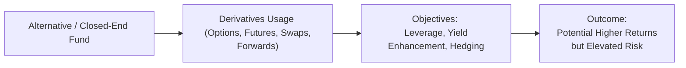

## 15.1 Use of Derivatives by Alternative Mutual Funds and Closed-End Funds

Whether you’re a first-time investor sifting through an overwhelming array of fund options or a seasoned professional looking to brush up on new regulatory rules, the world of alternative mutual funds and closed-end funds can feel both exciting and a bit tricky—especially when derivatives come into play. I remember the first time I encountered a “liquid alternative” fund that was allowed to short stocks and use futures more aggressively. I thought, “Wait... they can do that?!” Turns out, yes, they can, but only within specific guidelines set by Canadian regulators. In this section, we’ll explore how these funds use derivatives, the main regulatory frameworks they operate under, and some real-world examples to illustrate what all of this means in practice.

### Understanding Alternative Mutual Funds
Before diving into the details, let’s clarify what we mean by “alternative mutual funds.” These are mutual funds that can use strategies beyond those permitted in conventional funds. Think of it like a “regular” mutual fund with a bigger toolbox: alternative or “liquid alts” can use:

• More expansive short selling  
• Higher leverage  
• A broader set of derivatives (options, futures, swaps, forwards) for reasons other than pure hedging  

In Canada, alternative mutual funds must adhere to regulations under National Instrument (NI) 81-102 and NI 81-104 (or later updates). They also disclose their more sophisticated strategies in their prospectus, highlighting the fact that certain moves come with higher risk—particularly the risk of magnified losses through leverage.

### Closed-End Funds: A Quick Overview
A closed-end fund is another type of investment vehicle that issues a finite number of shares (or units) which then trade on an exchange. The share price can fluctuate above (premium) or below (discount) its net asset value (NAV). Closed-end funds frequently use derivatives for yield enhancement or volatility management. They, too, must comply with regulatory guidelines—especially when dealing with over-the-counter (OTC) products like swaps or bespoke forward contracts.

### Key Reasons for Employing Derivatives
Let’s be honest—derivatives can sound scary. But alternative mutual funds and closed-end funds turn to derivatives because these instruments help them:

• Hedge portfolio positions. (For example, using index futures to offset broad market risk.)  
• Generate additional income. (Covered calls, credit options, swap agreements.)  
• Gain exposure more efficiently. (Futures to get instant exposure to equity indexes, commodities, or interest rates without having to buy a large basket of securities.)  
• Leverage returns. (Sometimes they amplify gains, although the losses can also be amplified—so caution is key.)

### Regulatory Framework: CSA, NI 81-102, and CIRO
Under current Canadian securities law, alternative funds fall under National Instrument 81-102, with some provisions for alternative mutual funds under NI 81-104. These regulations outline how much leverage is permissible, how short selling is handled, and the maximum level of gross exposure allowed. In addition:

• The Canadian Securities Administrators (CSA) require that all marketing documents, prospectuses, and continuous disclosure filings clearly explain the fund’s strategies, including derivative usage and associated risks.  
• The Canadian Investment Regulatory Organization (CIRO)—formed from the historical merger of IIROC and MFDA—oversees investment dealers who distribute these funds. CIRO sets margin guidelines and minimum risk management standards.  
• Managers must ensure full compliance. This often includes advanced daily monitoring of leverage ratios, stress testing, and accurate tracking of margin to ensure no regulatory lines are crossed.

### Real-World Example: Interest Rate Hedge with Futures
Let’s imagine a Canadian alternative mutual fund anticipating a rise in interest rates. The portfolio manager holds a large allocation of investment-grade bonds and is worried that bond prices might dip if rates go up. The manager might short Canadian bond futures to partially offset any fall in the bond portfolio’s value. If rates rise and bond prices drop, the short futures position should profit, potentially offsetting losses in the physical bond holdings. On the flip side, if rates don’t move upward or somehow go down, the futures hedge might lose value while the bond portfolio gains, resulting in a net wash or smaller net effect.

### Derivatives Commonly Used by “Liquid Alts” and Closed-End Funds

• Options – Calls and puts are often used for income-generation (covered calls) or downside protection (protective puts).  
• Futures – Index futures, commodity futures, and interest rate futures can allow quick and cost-effective broad exposure or hedging strategies.  
• Swaps – These include equity total return swaps and interest rate swaps. Equity swaps can replicate the returns of a basket of stocks without actually owning them, while interest rate swaps help manage the exposure to rate movements.  
• Forwards – Less common than futures in the alternative mutual fund space, but can be used in currency management or specialized commodity exposures.

### A Diagram of Derivative Usage

Below is a simple Mermaid diagram showing a conceptual flow of a typical alternative mutual fund (or closed-end fund) that uses derivatives:

In this conceptual flow:  
• The fund (A) utilizes derivatives (B) for strategic reasons (C), which can lead to certain results (D). While the outcome may be enhanced returns, there’s also the possibility of magnified losses if the market doesn’t move in the expected direction or if leverage gets out of control.

### Compliance and Risk Management Considerations
Using derivatives for non-hedging purposes can get complicated fast. Here are a few things that managers (and you, as a potential investor) must keep an eye on:

• Limitations on Gross Notional Exposure: NI 81-102 stipulates that total leverage may not exceed certain thresholds (often up to three times NAV).  
• Margin and Collateral: Because these products can be leveraged, managers must maintain adequate margin or collateral (depending on the type of derivative). CIRO guidelines shape how much margin is required.  
• Counterparty Risk: When transacting OTC swaps or forwards, the closed-end fund or alternative mutual fund faces the risk that the other party might default. Some managers reduce this risk by using exchange-traded futures or centrally cleared swaps.  
• Disclosure: The fund’s prospectus must detail these strategies. In Canada, transparency is enforced rigorously, mainly under CSA regulations, so that investors know what they’re getting into.  
• Internal Controls and Committees: Many funds have a risk management committee or a compliance team that monitors daily exposures, ensuring that the use of derivatives aligns with both the fund’s mandate and regulatory maximums.

### Using Derivatives to Enhance Yield
Some closed-end funds might sell covered calls on large-cap equities in their portfolio to generate additional premium income. Others might use slightly more complex options strategies, like put spreads or iron condors, if permitted by their investment guidelines. Such strategies can bolster yield during stable or modestly rising markets. However, these approaches can cap upside potential and, in some cases, introduce new risks (e.g., if volatility spikes or the underlying declines unexpectedly).

### Tax Implications and Efficiency
For many alternative and closed-end funds, tax efficiency is as important as performance. Managers might choose swap-based strategies to convert potential distributions from interest to capital gains (depending on the structure and the relevant tax laws). In some scenarios:

• Futures-based exposures can result in different tax treatment than if the fund held the underlying wholeheartedly.  
• Where allowable, certain derivative trades may defer the realization of gains.  
• Like everything else with taxes, keep in mind that rules can change, and each strategy’s tax outcome depends on the fund’s governing legislation and your personal situation.

### Practical Example: Equity Total Return Swap
Suppose a closed-end fund wants exposure to a particular Canadian equity sector (like banking) but prefers not to buy bank stocks outright (due to dividend treatment or to avoid the overhead of managing multiple positions). Instead, the fund enters into an equity total return swap with a major bank as the counterparty. Here’s how it might work:

1. The closed-end fund pays a financing rate (plus a small spread) to the bank.  
2. In return, the bank pays the fund the “total return” of a chosen index or basket of bank stocks (including any dividends or appreciation).  
3. If the index rises, the closed-end fund profits net of the financing cost. If the index declines, the fund experiences a loss.  

The advantage? Efficient exposure, plus potential tax benefits (depending on structure). The risk? Counterparty default, basis risk, and the possibility that the index moves in the wrong direction.

### Internal/Regulatory Controls
It’s important for both alternative mutual funds and closed-end funds to stay within permissible limits. As managers, they often do the following:

• Run daily scenario analyses and stress tests to see how derivative positions might behave during market shocks.  
• Monitor counterparty quality, ensuring major derivatives counterparties are well-capitalized institutions.  
• Maintain robust operational processes for margin calls, trade confirmations, and settlement.  
• In some cases, use “layers” of oversight, like a compliance department plus external auditors, to verify that the fund’s derivative usage lines up with what’s outlined in the prospectus.

### A Closer Look at the Regulatory Entities
• CSA (Canadian Securities Administrators): Coordinates and harmonizes securities regulation across Canada. It’s the umbrella group for provincial regulators (like the Ontario Securities Commission (OSC), Autorité des marchés financiers (AMF) in Quebec, etc.).  
• CIRO (Canadian Investment Regulatory Organization): The main self-regulatory organization overseeing investment dealers, mutual fund dealers, and market integrity. CIRO enforces rules on margin, business conduct, and risk management.  
• Bourse de Montréal: The main exchange for listed derivatives in Canada. Some alternative mutual funds or closed-end funds might use its futures or options to hedge or gain exposure.  

### Historical Context
Prior to January 2023, the Investment Industry Regulatory Organization of Canada (IIROC) and the Mutual Fund Dealers Association of Canada (MFDA) separately supervised different categories of dealers. These organizations have been amalgamated into CIRO, which is now the single self-regulatory organization in Canada for all investment dealers and mutual fund dealers. CIRO has effectively inherited all powers and responsibilities once held by IIROC and MFDA, so references to those prior bodies are purely historical.

### Potential Benefits (and Pitfalls)
It’s easy to get starry-eyed about derivatives boosting returns, but we should also be mindful that:

• Derivatives can magnify losses just as quickly as they magnify gains.  
• Fees and spreads for certain instruments (particularly OTC swaps) can eat into returns if not carefully monitored.  
• Manager skill is critical—for every well-executed hedge or leveraged position, there could be one that goes sideways if it’s poorly timed or structured.

### Case Study: Hedging Commodity Exposure
A closed-end fund specializing in Canadian natural resource stocks might hold a broad portfolio of energy producers, mining companies, and pipeline operators. The manager is concerned about commodity price fluctuations, such as a sudden drop in oil prices. Here’s one approach:

• The fund could purchase a put option on an energy-related index or short crude oil futures to offset some losses if oil prices slump. This derivative-based hedge may cushion the fund’s performance while allowing it to remain invested in the underlying stocks.  
• The hedge comes at a cost (the put’s premium or the potential margin requirements for short futures), but that might be worth it to steady the fund’s net asset value during volatile commodity cycles.

### Best Practices for Investors
If you’re looking at an alternative mutual fund or closed-end fund that uses derivatives, here are a few rules of thumb:

• Read the Fund Facts or prospectus carefully, focusing on the “Investment Strategies” and “Risks” sections.  
• Look for plain-language disclosure about derivatives usage, maximum leverage, and potential scenarios.  
• Check the fund’s track record in both calm and volatile markets. Does management have experience with derivatives in mid-stress or high-stress environments?  
• Ask about fees. Some derivative strategies can add incremental costs, thus eroding net returns over time.

### Additional Resources and References
• CSA National Instruments 81-102 & 81-104: (https://www.securities-administrators.ca/)  
• CIRO Regulatory Guidelines on Alternative Funds: (https://www.ciro.ca/)  
• Bourse de Montréal – Derivatives Products: (https://www.m-x.ca/)  
• Book: “Investing in Alternative Mutual Funds” by Larry Swedroe and Andrew Berkin  
• Online Course: Coursera’s “Financial Markets” by Yale University  
• Open-Source Tools: QuantLib (http://quantlib.org/) for pricing complex derivatives  

These references provide a solid springboard for further exploration. Maybe you’ll discover your new favorite derivative-pricing platform or a specialized global macro strategy that piques your interest.

---

Whether you’re an investor, an advisor, or a manager, using derivatives in alternative mutual funds and closed-end funds can be a powerful way to meet investment goals—if done with caution, skill, and ample regulatory awareness. Understanding how these instruments fit within the Canadian legal framework not only helps mitigate risks but also ensures that these strategies deliver the intended benefits. Even though all the talk about “swaps” and “futures” can feel like Greek at first glance, a bit of patient study (and the occasional personal anecdote!) goes a long way toward making you more comfortable with these critical tools of modern portfolio management.

## Sample Exam Questions: Use of Derivatives by Alternative Mutual Funds and Closed-End Funds



### Which of the following is a key regulatory document governing the use of derivatives by alternative mutual funds in Canada?

- [ ] The Trade Act
- [ ] The Canadian Banking Code
- [x] National Instruments 81-102 and 81-104
- [ ] Global Investment Regulations (GIR)

> **Explanation:** Under Canadian securities regulation, NI 81-102 and NI 81-104 outline rules specifically for mutual funds, including alternative or “liquid alts.”  

### Which statement best describes a closed-end fund’s structure?

- [x] It issues a fixed number of shares that trade on an exchange at a premium or discount to NAV.
- [ ] It continuously issues units that are always redeemed at NAV.
- [ ] It is strictly for institutional investors and not listed on an exchange.
- [ ] It is a fund that only invests in short-term government bonds.

> **Explanation:** A closed-end fund has a limited number of shares and trades on exchanges, which can lead to price divergences from the NAV.  

### How might alternative mutual funds use derivatives to enhance yield?

- [x] By writing covered calls on portfolio securities.
- [ ] Only by shorting government bonds.
- [ ] By buying protective puts without offsetting them.
- [ ] By eliminating all credit risk.

> **Explanation:** Selling covered calls is a common strategy for generating extra premium income. Writing options can boost yield, but it may cap upside potential.  

### Which regulatory organization oversees Canadian dealers’ margin requirements and business conduct for derivative usage?

- [ ] The New York Stock Exchange
- [x] The Canadian Investment Regulatory Organization (CIRO)
- [ ] The Ministry of Finance
- [ ] The Bank of England

> **Explanation:** CIRO is Canada’s self-regulatory organization that enforces rules and guidelines for regulated investment dealers, including margin requirements.  

### An alternative mutual fund anticipates a sharp rise in oil prices. Which derivative strategy might they use to profit from this forecast?

- [x] Going long crude oil futures.
- [ ] Entering into an interest rate swap with a fixed_ leg.
- [ ] Buying a put option on oil stocks.
- [ ] Writing covered calls on a consumer staples index.

> **Explanation:** Going long (buying) crude oil futures is a direct way to benefit from rising oil prices.  

### Which type of derivative might a closed-end fund use to efficiently gain exposure to a specific equity sector?

- [ ] Commodity forward physically settled
- [x] Equity total return swap
- [ ] Currency fluctuations T-Bill
- [ ] Plain vanilla interest rate swap

> **Explanation:** An equity total return swap can replicate the returns of a targeted basket of shares or an index without directly holding those stocks.  

### Counterparty risk is most commonly associated with which type of derivative?

- [ ] Exchange-traded futures
- [ ] Exchange-traded options
- [ ] Listed index options
- [x] Over-the-counter swaps

> **Explanation:** OTC swaps carry counterparty risk because they are privately negotiated contracts without exchange clearing, unlike exchange-traded contracts.  

### Which of the following best describes how covered call writing in a closed-end fund might affect the portfolio?

- [ ] Eliminates downside risk completely
- [x] Caps potential upside gains but generates premium income
- [ ] Is mandatory under NI 81-102
- [ ] Exposes the fund to an unlimited risk of loss

> **Explanation:** Covered call writing generates option premium but also caps upside. It doesn’t eliminate all risk.  

### One potential tax advantage of using swap agreements in a Canadian alternative mutual fund is:

- [ ] They remove the need for foreign exchange conversions.
- [x] They may convert otherwise taxable distributions into capital gains (depending on structure).
- [ ] They guarantee no taxes are payable in any province.
- [ ] They always lead to immediate tax losses.

> **Explanation:** Some swap-based structures can transform what would have been interest income or dividends into capital gains, which might be taxed more favorably, though details vary.  

### In a scenario where a closed-end fund holds a large bond portfolio but expects rising rates, which derivative strategy helps hedge interest rate risk?

- [x] Short selling interest rate futures
- [ ] Buying call options on the same bonds
- [ ] Entering a swap arrangement to pay floating, receive fixed
- [ ] Writing a covered call on a technology stock index

> **Explanation:** Shorting interest rate futures can offset potential losses in a bond portfolio if interest rates rise and bond prices fall.  


