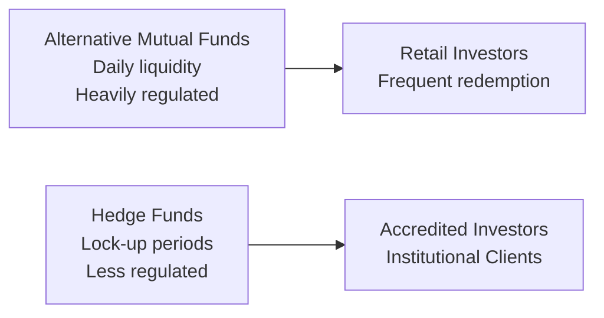

## 15.2 Hedge Funds Compared to Alternative Mutual Funds

If you’ve heard the term “hedge fund” thrown around at dinner parties—or, ironically, at backyard barbecues—maybe you’ve wondered why people speak about them with a sort of mystique. Meanwhile, “alternative mutual funds” probably sound just a teensy bit more familiar, but perhaps you’re still unsure how they differ from regular mutual funds. Well, let’s peel back the curtain and see what sets hedge funds apart from their more regulated (and more retail-friendly) alternatives.

Before we dive in, let’s remember that, by 2025, the Mutual Fund Dealers Association of Canada (MFDA) and the Investment Industry Regulatory Organization of Canada (IIROC) became part of a unified self-regulatory body known as the Canadian Investment Regulatory Organization (CIRO). So if you see any references to MFDA or IIROC, just keep in mind those are historical references. CIRO is your go-to regulator for all things related to investment dealers, mutual fund dealers, and marketplace integrity in Canada.

Anyway, back to our main event: Hedge Funds vs. Alternative Mutual Funds. Let’s explore their structures, fees, disclosure requirements—plus a few real-life glimpses of what it’s like if you decide to invest in one or the other.

---

### Understanding the Basic Structure

Hedge funds and alternative mutual funds can sometimes look the same from the outside. You often hear about “long/short,” “leverage,” or “derivatives-based” strategies applied in both. But once you see them in action, you quickly figure out that hedge funds typically have far more freedom: less regulatory restriction, more complex and nimble strategies, and, let’s be honest, some big personalities coaxing investors to jump onboard.

On the other hand, alternative mutual funds must comply with quite a bit more in the way of regulations—like National Instrument 81-102 in Canada—which means there are specific limits on leverage, short selling, and general risk exposures. They aim to give retail investors (yes, everyday folks like you and me) access to some advanced strategies that were once the sole domain of private hedge funds.

To visually break it down, let’s look at a simple flowchart:

In this diagram, you can see alternative mutual funds generally cater to a broad group of retail investors and offer the convenience of frequent redemption—often daily. Hedge funds, by contrast, target accredited or institutional investors who meet specific net worth or income criteria, and may be required to keep their funds locked up for months or years.

---

### Regulatory Landscape and Investor Eligibility

• **Hedge Funds**  
  – Typically private investment pools.  
  – Usually accessible only to “accredited investors” (e.g., high-net-worth individuals, large institutions).  
  – Follow fewer prescriptive regulatory requirements, but they still must adhere to general securities laws and relevant regulations (like prospectus exemptions found in National Instrument 45-106 in Canada).  
  – Flexibility to invest in less liquid assets, use high leverage, and employ complex derivative strategies.  

• **Alternative Mutual Funds**  
  – Publicly offered (aimed at retail investors).  
  – Subject to NI 81-102 provisions on leverage, liquidity, diversification, and more.  
  – Provide daily liquidity in most cases, so if you get cold feet, you can redeem the next business day at the net asset value (NAV).  
  – Must publish simplified prospectuses, annual information forms (AIFs), and management reports of fund performance (MRFPs).  

Sometimes, folks prefer the discipline enforced upon alternative mutual funds. Some want that extra layer of regulatory guardrails—after all, it’s always comforting to know that managers can’t gamble your entire investment on a single high-stakes bet. Others feel limited by these rules, longing for the freedom that hedge funds have, even if that freedom carries greater risk.

---

### Fees: “2 and 20” vs. Standard Retail Fees

If you’ve ever heard someone complain about hedge fund fees, they were probably referring to the “2 and 20” structure. That means the fund charges a 2% management fee—covering salaries, overhead, that super-glossy office in downtown Toronto—and then takes 20% of profits (the performance fee). Let’s say a hedge fund manager invests in a brilliant derivative strategy, generating a 25% return in a year. If you’re an investor, you pay 2% on your assets plus 20% of that 25% gain. So the manager shares handsomely in the upside.

Meanwhile, alternative mutual funds—which are generally designed for retail distribution—have standardized fee structures similar to (though often higher than) plain-vanilla mutual funds, but nowhere near as high as a typical hedge fund. Some have performance-based fees, but these are subject to stricter regulatory guidelines—ensuring that managers can’t just pull out a giant slice of the returns whenever they fancy.

On a personal note, a friend once told me he bailed out of a hedge fund after a couple of good years and realized how much he’d paid in performance fees. He said, “I felt like I was writing an extra check for my kids’ college fund, except it wasn’t going to my kids.” So, yes, the “2 and 20” can sting if you have a massive year, but many managers argue that it aligns their interests with yours—after all, they only get the big bucks if your net asset value goes up.

---

### Liquidity and Redemption Policies

• **Hedge Funds:**  
  – Frequently feature lock-up periods, during which you can’t redeem your money (e.g., 6 months, 1 year, or more).  
  – May have “gating provisions” that limit the amount an investor can withdraw at once, especially during market stress.  
  – Redemption schedules can be monthly, quarterly, or even annual.  

• **Alternative Mutual Funds:**  
  – Designed for retail with daily liquidity.  
  – Transparency in the redemption process.  
  – Subject to regulatory guidelines that require them to keep sufficient liquid assets on hand.  

If you’re investing surplus cash you won’t need for years, maybe the lock-up isn’t such a big deal. But if you might need to cover an unexpected expense next month, waiting for a redemption window could be stressful. Also, in volatile markets (like a big market crash), hedge funds might slap on a gate so that only a certain percentage of investors can redeem their funds at a time. It can be incredibly frustrating if you need your money ASAP and a gate is in place. On the flip side, alternative mutual funds typically can’t do that, so you have the benefit of a consistent redemption policy.

---

### Disclosure: Monthly Versus Daily Transparency

In Canada, hedge funds often provide less uniform disclosure—maybe monthly or quarterly updates to their investor base. They may also be more protective about disclosing their full positions, especially if they employ short selling or illiquid private investments. The last thing they want is to tip off competitors or face front-running.

Alternative mutual funds, by contrast, have mandatory continuous disclosure rules. The simplified prospectus, the management report of fund performance, and the annual information form must be made available to the public. Many alternative mutual funds publish portfolio holdings more frequently—sometimes quarterly, but occasionally with a lag to protect strategy confidentiality.

---

### Risk Management Approaches

Hedge fund managers commonly use a wide range of derivatives—options, futures, swaps, you name it—to maximize returns and hedge out (or take on) certain risks. Some adopt exotic strategies that can appear baffling to the untrained eye but can yield large absolute returns if executed correctly. That said, there’s a real possibility of large drawdowns if trades go sideways.

Alternative mutual funds may use similar tools—long/short equity positions, interest rate futures, currency hedges—but they’re typically subject to regulated position limits and constraints on how much leverage they can employ. This helps shield you (the retail investor) from exposures that might be just a tad too hot to handle on your own. CIRO imposes proficiency and conduct guidelines for these funds, ensuring that managers remain within guardrails and transparently articulate how they manage risk.

---

### Real-World Example: The 2008 Crisis

An infamous moment in recent financial history is the 2008 crisis. Back then, many hedge funds faced massive redemptions and invoked gating provisions or suspended withdrawals because their holdings suddenly became illiquid. This, understandably, sparked outrage among investors, especially those who needed liquidity during the meltdown.

In contrast, while many alternative mutual funds also faced difficulties, they were obligated under their prospectus to offer daily redemptions—some had to sell assets at unfavorable prices to meet redemptions. This flexibility, ironically, can be a double-edged sword: it’s great for investors who want out quickly, but it can also force the fund to liquidate positions at a really bad time.

---

### Historical Context and Legal Framework

In Canada, the legal framework for hedge funds is shaped by exemptions under National Instrument 45-106, which allows private placements to occur without issuing a full prospectus, so long as investors meet the “accredited investor” threshold or other exemption criteria. This is why the average investor typically can’t just walk into a hedge fund—regulators want to ensure that only those with sufficient net worth (or professional expertise) can take on the extra risk.

Meanwhile, alternative mutual funds fall under the broader Investment Funds and Structured Products framework, which includes NI 81-101, 81-102, 81-106, and more. They’re basically forced to follow the same investor protection principles as your garden-variety mutual fund, but with expanded investment powers to use derivatives, short selling, and leverage—within limits established by the securities regulators, such as CIRO.

---

### Who Invests in Which?

• **Hedge Funds:**  
  – High-net-worth individuals and family offices are prime candidates.  
  – Institutional investors (like pension funds or university endowments) that want alpha.  
  – Typically organizations/people comfortable with potentially large swings in portfolio value.  

• **Alternative Mutual Funds:**  
  – Mainly retail investors looking for diversification outside of traditional equity and bond allocations.  
  – Individuals who want to tap into hedge-fund-like strategies but within a more regulated framework.  
  – Investors who value daily liquidity and standardized disclosure.  

One might say, “Hedge funds are for heavy-hitters, alternative mutual funds are for the rest of us.” But that’s maybe an oversimplification. Some smaller hedge funds accept lower minimums to attract a broader base of accredited investors, and alternative mutual funds can carry substantial risk even under strict guidelines.

---

### Key Differences at a Glance

| Factor                      | Hedge Funds                                          | Alternative Mutual Funds                       |
|-----------------------------|-------------------------------------------------------|------------------------------------------------|
| **Access**                  | Accredited/institutional investors                   | General retail investors                        |
| **Regulatory Oversight**    | Less prescriptive; private                                  | Highly regulated (NI 81-102, CIRO guidelines)  |
| **Investment Strategies**   | Very flexible (short-selling, derivatives, etc.)     | Similar strategies but with regulatory limits  |
| **Liquidity**               | Can have lock-up periods/gating provisions           | Daily redemption (high retail liquidity)       |
| **Fees**                    | Often “2 and 20”                                      | Typically lower, no big performance cut (but can exist) |
| **Disclosure**             | Monthly or quarterly, limited details                 | Frequent, standardized (prospectus, MRFPs)     |
| **Risk Management**         | More flexible, can be very high risk                 | Structured risk limits under regulations       |
| **Redemption Constraints**  | Potential for gating or lock-ups                     | Must offer frequent (often daily) redemptions  |

---

### Best Practices and Pitfalls

• **For Hedge Fund Investors:**  
  – Thoroughly read the Offering Memorandum (OM), focusing on redemption terms, performance fee calculations, and gating provisions.  
  – Evaluate the manager’s track record, style drift, and risk controls.  
  – Be prepared for illiquidity and have a sense of your personal liquidity needs.  

• **For Alternative Mutual Fund Investors:**  
  – Don’t assume “alternative” means “no risk.” All investing entails risk, and alternative strategies can carry additional complexities.  
  – Read the simplified prospectus and watch for language around leverage and derivatives usage.  
  – Understand the fee structure: slightly higher MERs (management expense ratios) than vanilla funds can be expected.  

---

### Personal Anecdote

I remember chatting with a hedge fund manager in Toronto a few years back—let’s call him Dave—who specialized in exotic macro trades. Dave used a lot of currency swaps and commodity futures. He’d spin stories about traveling to overseas farmland to “kick the dirt” and gauge harvest yields firsthand. He told me, “I can borrow cheaply, double down on my convictions, and get the alpha my investors crave.” (That’s some bravado, right?) Anyway, he had no illusions about being illiquid. He’d say, “My investors know the deal. If you want your money next week, forget it.”

Then, after meeting with another manager who ran an alternative mutual fund, I noticed how differently they handled risk. They still used derivatives, but everything was so spelled out. They had daily valuations, strict position limits, and layers of oversight. The manager told me, “Yeah, we can’t do quite the same fancy stuff as a private hedge fund, but we get exposure to some of these growth ideas while still letting investors sleep at night.” So that’s the trade-off.

---

### References for Further Exploration

• **National Instrument 45-106 (Prospectus Exemptions) for accredited investors**  
  – Official site of the Canadian Securities Administrators:  
    (https://www.securities-administrators.ca/)

• **CIRO’s proficiency and conduct guidelines for investment fund products**  
  – (https://www.ciro.ca/)

• **Book**: “Hedge Fund Market Wizards” by Jack D. Schwager  
  – Features interviews with top hedge fund managers, delving into strategy and psychology.

• **Article**: “Differences Between Hedge Funds and Alternative Mutual Funds” by CFA Institute  
  – (https://www.cfainstitute.org/)  
  – Offers a more global viewpoint on how these products differ in both structure and regulations.

• **Open-Source Tools and Frameworks**  
  – You might find software libraries like QuantLib helpful for modeling derivatives that hedge funds might use. It’s open-source and available in multiple programming languages.  
  – For data analysis, check out Python-based open-source frameworks like pandas or NumPy to build your own fundamental or technical evaluation of alternative strategies.

---

### Final Thoughts

In a nutshell, hedge funds and alternative mutual funds may share some strategies—like short selling, derivative overlays, or leveraging up positions—but they exist in different worlds when it comes to regulatory oversight, investor base, liquidity, and transparency. Hedge funds thrive on flexibility, sometimes leaning toward secrecy, and they’re generally designed for accredited investors who can handle the possibility of bigger losses. Alternative mutual funds bring many of those same big ideas but package them in a format accessible to everyday investors, with daily liquidity and a healthier dose of required disclosures.

One isn’t automatically better than the other. It depends on your risk tolerance, your liquidity needs, and your comfort with paying performance fees. So, as the old disclaimers say, do your research, read the fine print, and consider speaking with a licensed advisor if you’re unsure. Now that you know the key differences, you can (hopefully) feel a tad more confident at that next backyard barbecue when someone starts bragging about a brand-new hedge fund they just joined.

---

## Sample Exam Questions: Hedge Funds vs. Alternative Mutual Funds



### Hedge funds frequently charge a “2 and 20” fee structure, which typically consists of:
- [ ] A 2% management fee and a 2% performance fee.  
- [x] A 2% management fee and a 20% performance fee.  
- [ ] A 20% management fee and a 2% performance fee.  
- [ ] No management fee but 20% of the annual returns.  

> **Explanation:** Hedge funds often use the “2 and 20” model: a 2% annual management fee and 20% of any profits, aligning manager incentives with performance.

### Which of the following is most characteristic of alternative mutual funds compared to hedge funds?
- [x] They generally offer daily liquidity for redemptions.  
- [ ] They require investors to possess accredited investor status.  
- [ ] They impose lock-up periods of one year or more.  
- [ ] They always charge a performance fee.  

> **Explanation:** Alternative mutual funds are accessible to retail investors, so they typically provide daily redemptions, unlike hedge funds that can have long lock-ups.

### What is a gating provision in the context of hedge funds?
- [ ] A legal requirement to disclose monthly portfolio performance.  
- [x] A limit on the percentage of investor redemptions during market stress.  
- [ ] A minimum threshold for annual returns before fees apply.  
- [ ] A mandatory lock-up of four years.  

> **Explanation:** Gating provisions are used to control large redemptions by limiting how much can be withdrawn during a redemption period.

### In Canada, hedge funds can often rely on which regulatory instrument to avoid issuing a full prospectus?
- [ ] NI 81-102.  
- [x] National Instrument 45-106 (Prospectus Exemptions).  
- [ ] NI 31-103.  
- [ ] The Income Tax Act.  

> **Explanation:** NI 45-106 allows them to qualify for accreditation-based exemptions, bypassing a full prospectus for private placements.

### Which of the following is a common requirement for alternative mutual funds under NI 81-102?
- [x] They must adhere to leverage constraints and prescribed investment limits.  
- [ ] They can apply unlimited leverage.  
- [ ] They can only invest in small-cap stocks.  
- [ ] They must always charge a performance fee.  

> **Explanation:** NI 81-102 outlines constraints on leverage, short selling, and the use of derivatives, ensuring investor protection.

### How often do alternative mutual funds typically disclose their NAV (Net Asset Value) for redemption?
- [ ] Once a quarter.  
- [ ] Once a month.  
- [x] Daily.  
- [ ] Once a year.  

> **Explanation:** Alternative mutual funds, like conventional mutual funds, generally provide daily liquidity and calculate NAV each business day.

### Why do hedge funds appeal to institutional investors like pension funds?
- [x] They can offer higher potential returns through flexible strategies and leverage.  
- [ ] They have daily redemption for better liquidity.  
- [ ] They typically charge lower fees than retail mutual funds.  
- [ ] They must adhere strictly to NI 81-102.  

> **Explanation:** Institutions sometimes seek above-average returns or diversification benefits from hedge funds’ more flexible, sometimes aggressive strategies.

### Which statement best illustrates a difference between hedge fund disclosures and alternative mutual fund disclosures?
- [x] Hedge funds usually provide limited details, often monthly or quarterly, while alternative mutual funds follow more standardized, frequent disclosure.  
- [ ] Both must produce daily holdings reports to the public.  
- [ ] Hedge funds disclose more than alternative mutual funds.  
- [ ] Neither is bound by CIRO guidelines.  

> **Explanation:** Alternative mutual funds must comply with regulatory disclosure requirements (e.g., simplified prospectus, MRFPs), whereas hedge funds have more lenient reporting obligations.

### Which of the following statements about lock-up periods is correct?
- [ ] Alternative mutual funds must have a three-year lock-up period.  
- [x] Hedge funds may restrict redemptions for a set time (e.g., six months or more) to ensure portfolio stability.  
- [ ] Both hedge funds and alternative mutual funds are legally required to have lock-up periods.  
- [ ] Lock-up periods refer to daily redemption schedules.  

> **Explanation:** A lock-up period is typical for hedge funds, limiting early withdrawals, whereas alternative mutual funds rarely implement such restrictions.

### True or False: Hedge funds can be sold to the general public in Canada, just like alternative mutual funds.
- [ ] True  
- [x] False  

> **Explanation:** Hedge funds are generally private offerings accessible only to accredited or institutional investors, unlike alternative mutual funds marketed to retail investors.


