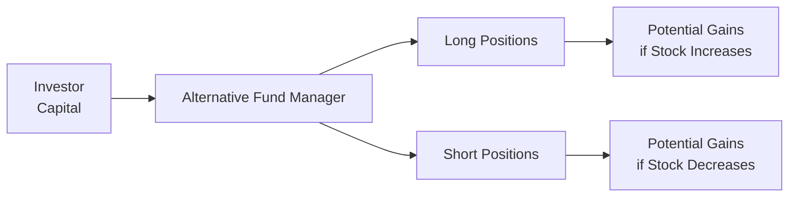

## 15.3 Types of Alternative Strategies

Sometimes, when I first heard about “alternative strategies,” I thought, “Well, how different can they really be?” But as I dug deeper, I realized they’re not just a small tweak on standard mutual fund investing; they often represent entirely different mindsets about markets, risk, and returns. This section explores the most common approaches used by liquid alternative funds and hedge funds. I’ll sprinkle in a few personal anecdotes, too—things I’ve seen or read about that might help illustrate these strategies in a simple and relatable way.

You’ll see references to “Canadian alternative mutual funds.” These funds are typically subject to certain regulatory constraints, limiting how much leverage or short selling they can do, as well as the extent of derivatives usage. Meanwhile, hedge funds—depending on their structure, jurisdiction, and offering documents—often have more flexibility. Of course, with that flexibility comes more responsibility for the manager and, arguably, higher risks for investors.

Below, we’ll lay out the six major types of alternative strategies: Long/Short Equity, Market-Neutral, Credit, Global Macro, Event-Driven, and Managed Futures. Each approach aims to deliver absolute returns, which essentially means they’re trying to make money regardless of whether the market is soaring or tanking. Along the way, we’ll talk about the unique risks of each and some best practices to keep in mind.

  
### Introduction to Alternative Strategies

Alternative investment strategies have gained popularity because traditional “buy-and-hold” equity or bond portfolios can sometimes fail to mitigate risk in turbulent markets. By weaving in an alternative strategy, investors may reduce correlations to mainstream assets, potentially buffering their portfolios from the big swings. But it’s not all sunshine and roses. Some alternative strategies have high fees, limited transparency, or lock-up periods (especially in the hedge fund world). Liquidity constraints may also arise—you might not be able to quickly withdraw your money.

Still, alternative strategies remain a big draw. The promise is diversification, less sensitivity to broad market movements, and a shot at better absolute performance. Some managers are essentially saying, “We want to make money if the market’s up, down, or sideways.” Let’s see how that actually plays out in practice.

### Long/Short Equity

In a plain-vanilla mutual fund, you typically buy (go long) stocks you like. You ride them up if they do well, and you lose money if they slump. Long/Short Equity managers, on the other hand, not only purchase stocks they think will appreciate but also short-sell those they believe might tank. Short selling, at its core, is borrowing shares from someone else, selling them at, say, $100, and hoping you can buy them back cheaper later (maybe at $70), pocketing the difference.

The real advantage here is that if the market overall declines, a stock you’re short might drop in value and earn you a profit, offsetting the pain of falling prices on your long positions. Of course, it’s not always perfect; sometimes your longs will fall at the same time your shorts rally. One friend of mine who worked at a hedge fund joked, “I never realized how many ways you can be wrong at once—it’s humbling.”

Long/Short Equity managers often analyze companies fundamentally. They might look at balance sheets, growth prospects, product pipelines, or management teams. They attempt to find undervalued gems for their long book and overhyped losers for their short book. Canadian liquid alt funds that adopt a long/short strategy will often have strict guidelines: for instance, their net market exposure (long minus short positions) can’t exceed a certain threshold set by regulators. This is done partly to limit leverage, ensuring the fund doesn’t blow up quickly if both longs and shorts move against them.

Below is a simple visualization of how capital flows into a long/short equity strategy:

In the above diagram, you can see how the manager allocates capital to both long and short exposures to pursue returns from multiple market directions.

### Market-Neutral Strategies

Market-Neutral strategies take the long/short concept one step further. The goal is to keep the fund’s net exposure to the market at (or near) zero. In other words, for every $1 in long exposure, the fund will have $1 in short exposure. This doesn’t guarantee the fund won’t lose money, but it means it shouldn’t lose money solely because the overall market goes down. Ideally, you’re “neutral” to market swings—rather than being whipsawed by the S&P/TSX or the S&P 500.

One way to do this is “pair trading.” For example, you might go long a stock that you think is undervalued and short a comparable stock that you believe is overvalued. Maybe if both move in tandem with the general equity market, you’re hedged. Your net profit or loss depends on the difference in performance between the two. If your chosen “long” outperforms your “short,” you earn a spread (the “market-neutral alpha”).

Market-Neutral funds generally have lower volatility because they aim to profit primarily from stock-picking skill rather than from broad market direction. However, low volatility doesn’t always mean low risk. If the manager’s picks are systematically poor, the fund can still generate negative returns.

Canadian alternative mutual funds that employ market-neutral approaches often comply with rules limiting short-selling to a certain percentage of the fund’s NAV (Net Asset Value). They also use derivatives, like equity futures, to manage their overall beta exposure. Hedge funds can be more aggressive, but in principle, the approach is the same: focus on idiosyncratic opportunities, not a big directional bet on the market.

### Credit Strategies

Credit-focused managers dive into the debt side of capital markets—corporate loans, bonds, distressed debt, and structured credit (like mortgage-backed securities or asset-backed securities). They may also use credit default swaps (CDSs) to either hedge exposure or to speculate on a company’s creditworthiness.

Let’s say a distressed-debt manager sees a chance to buy a failing company’s bonds at 40 cents on the dollar, believing they’ll be repaid at 60 cents in a restructuring scenario—bundled with some newly issued equity. If the manager’s analysis is correct, that’s a neat profit. But if the company fully defaults, the bonds might be worthless, and the manager takes a heavy loss.

Credit risk can be heavily influenced by economic cycles. During recessions, defaults tend to rise, but credit managers can sometimes capitalize on the dislocation by picking up undervalued debt instruments. A well-known example was after the 2008 financial crisis, when major banks and insurers sold off distressed mortgage debt at fire-sale prices. Various hedge funds stepped in, scooped up these assets, and made sizable profits when the housing market eventually recovered.

Regulatory constraints in Canada require alternative mutual funds to carefully manage concentrations in illiquid debt securities. For instance, you might see a liquidity buffer or a limit on how many distressed assets the fund can hold. Hedge funds approach these topics differently, often employing gating provisions or lock-ups for investors so the manager can invest in less liquid instruments without worrying about daily redemptions.

### Global Macro

Global Macro managers take a top-down view—like being an eagle perched high above, scanning the entire horizon of markets. They’ll look at macroeconomic trends, interest rates, currencies, and even political developments around the globe. These managers might buy or sell futures or currencies based on interest rate expectations, or jump into equity index futures if they think a certain country’s economy will boom (or falter).

A classic Global Macro trade, made famous by George Soros, involved shorting the British pound in 1992 because he believed the Bank of England would have to devalue the currency. While not every Global Macro manager hits that kind of home run, the general approach is to anticipate big macro moves: changes in U.S. Federal Reserve policy, currency interventions, or a shift in commodity demand driven by emerging markets.

Sometimes, these managers will use interest rate swaps to position for or against shifts in yield curves. They might also look at inflation swaps, volatility derivatives, or even cross-border arbitrage opportunities. The key is flexibility—Global Macro funds are known for jumping in and out of markets quickly based on the manager’s evolving thesis.

In Canada, an alternative mutual fund with a Global Macro tilt must still abide by certain risk guidelines, including rules on currency exposure and use of derivatives. Hedge funds with a Global Macro approach might have fewer restrictions, enabling them to take large, concentrated bets.

### Event-Driven

Event-Driven strategies capitalize on events like mergers, acquisitions, reorganizations, bankruptcies, or spin-offs. Let’s say Company A announces it’s merging with Company B. Often, the target stock’s price jumps closer to the proposed deal price but might trade at a discount reflecting uncertainty that the transaction might fail. An Event-Driven manager might buy the target’s stock and short sell the acquirer’s stock—this is known as a “merger arbitrage” trade. If the deal goes through, the spread narrows, and the manager profits.

Of course, if the deal collapses (due to regulatory intervention, changing market conditions, or a shift in the acquirer’s financing), the target’s stock might tumble. Event-Driven strategies can also extend to activism—a hedge fund manager might buy a stake in a company and then agitate for changes (e.g., new board members, strategic pivots) to unlock value for shareholders.

Event-Driven funds thrive when corporate activity is high—lots of mergers, acquisitions, or spin-offs to exploit. In calmer markets with fewer deals, they might struggle to build positions or generate strong returns.

### Managed Futures

Managed Futures strategies use futures contracts on commodities, currencies, equity indices, or interest rates, often employing systematic computer-driven models to detect trends or market momentum. If everybody’s piling into oil futures because there’s a supply disruption, a trend-following manager might jump in, hoping to “ride the wave.” Alternatively, contrarian models attempt to fade extreme market moves, believing they’ll revert to the mean.

These managers typically rely on robust risk management—stop-loss orders, daily rebalancing, or a volatility target. I once saw a deeply data-driven manager who would run hundreds of backtests to see how a single futures contract performed in different volatility regimes. The complexity can be intimidating, but the objective is usually clear: identify patterns in market prices and attempt to exploit them, often with little correlation to traditional stock or bond performance.

Canadian alternative mutual funds that employ Managed Futures must have a certain level of derivative expertise in-house. They also have to navigate margin requirements regulated by CIRO. Hedge funds face less mandated regulation on these points but still must meet disclosure and risk constraints outlined in their offering memoranda (and possibly in private contractual agreements with investors).

### Key Risks and Considerations

While alternative strategies can be super appealing, each one carries unique risks. Here are a few common themes:

• Leverage risk: You might have leveraged bets go sour quickly. Even a small market move in the wrong direction can lead to disproportionate losses.  
• Liquidity constraints: Illiquid credit instruments or other thinly traded assets can be hard to value or sell in a pinch.  
• Strategy complexity: Some trades, like interest rate swaptions or distressed debt, can be complex. It’s easy to misunderstand the payoff structure.  
• Regulatory constraints and compliance: In Canada, alternative mutual funds must stay within certain short-selling, leverage, and concentration limits, as mandated by CSA. At the same time, managers dealing in futures or other derivatives should be aware of CIRO margin requirements (https://www.ciro.ca/).  
• Operational risk: Hedge funds, especially smaller ones, can face disruptions if their service providers are under-resourced or if they lack robust internal controls.  

For a quick snapshot, here’s a small table summarizing each strategy and its usual pros and cons:

| Strategy           | Potential Upside                           | Common Risks                       |
|--------------------|--------------------------------------------|------------------------------------|
| Long/Short Equity  | Earn from both rising & falling stocks     | Wrong picks on both sides; leverage blowups |
| Market-Neutral     | Lower correlation to equities              | Manager underperformance can lead to negative returns |
| Credit             | High upside if distressed securities rebound | Credit risk, liquidity risk, default risk |
| Global Macro       | Potential for significant gains if macro calls are right | Large swings possible if market moves unexpectedly |
| Event-Driven       | Profits from M&A, spin-offs, restructurings | Deal collapse, event delays, regulatory issues |
| Managed Futures    | Trend-following or contrarian approaches can thrive in volatile markets | Whipsawed by rapid price reversals; model risk |

  
### Canadian Regulatory Framework

The Canadian Securities Administrators (CSA) enacted rules allowing for “alternative mutual funds” (colloquially known as “liquid alts”), which are subject to National Instrument 81-102. These funds can use derivatives, short-selling, and leverage, albeit with specific caps to ensure retail investor protection. You can find more detailed guidance at the CSA’s official website (https://www.securities-administrators.ca/).

On the self-regulatory side, the Canadian Investment Regulatory Organization (CIRO) sets oversight for investment dealers and margin requirements for derivatives positions (https://www.ciro.ca/). Before 2023, these functions were handled by the Investment Industry Regulatory Organization of Canada (IIROC) and the Mutual Fund Dealers Association of Canada (MFDA). They have since amalgamated into CIRO. Any historical references to IIROC or MFDA simply reflect their roles prior to 2023.

Hedge funds in Canada are often offered under exemptions to accredited investors and must comply with CSA rules regarding offering memoranda, continuous disclosure, and marketing materials. They’re not obligated to follow the same constraints as retail-oriented mutual funds, though they may be subject to derivative trade reporting and clearing obligations, especially if they engage in OTC derivatives.

### Putting It All Together

At this point, you might be thinking, “So many strategies—how do I, as an investor or analyst, piece them together?” The answer often depends on what you want from your portfolio. If you’re seeking equity-like returns but with some downside protection, maybe a Long/Short Equity strategy is appealing. If you want something that aims for minimal correlation with equity markets, Market-Neutral or Managed Futures might catch your eye.

An investor might view these strategies as “toolkits.” In the same way a contractor picks the right tool for the job, portfolio managers choose the right combination of alternative strategies to handle varying market conditions. During stable market periods, a Global Macro fund might not shine if there aren’t any big macro dislocations. During turbulent times, that same Global Macro fund (or a Distressed Debt strategy) might uncover extraordinary pricing opportunities. It’s all about timing, approach, and risk tolerance.

Just remember: alternative funds and hedge funds, no matter how tempting their marketing pitch, can still lose money. The complexity of these strategies demands thorough due diligence, strong operational controls, and a real understanding of the trades being made. Nothing is foolproof—when the market becomes volatile, even “hedged” strategies can sometimes experience painful drawdowns.

### Glossary of Key Terms

Long/Short Equity  
: Investing long in stocks deemed undervalued and short-selling those deemed overvalued, aiming to benefit regardless of market direction.

Market-Neutral  
: A strategy that seeks to have zero net market exposure. Managers typically match long positions with short positions to eliminate broad market risk.

Distressed Debt  
: Bonds or other debt instruments issued by companies in or near bankruptcy. Investors may benefit from a restructuring or an eventual recovery.

Global Macro  
: A top-down strategy focused on macroeconomic, political, and global thematic trends. Managers use derivatives (e.g., futures, swaps) to capitalize on anticipated shifts in interest rates, currencies, or global equities.

Event-Driven  
: Investment approach that exploits mispricing or opportunities around specific corporate events (M&A, spin-offs, restructurings).

Managed Futures  
: A strategy primarily using futures contracts across various asset classes. Often involves systematic trend-following or quantitative models.

### Best Practices, Pitfalls, and Strategic Insights

• Diversify. Even within alternative strategies, diversification matters. For instance, combining a Market-Neutral approach with a Credit strategy may help offset different sets of risk factors.  
• Understand fees. Hedge funds can charge “2 and 20” (2% management fee, 20% performance fee), or variations of that. Liquid alts have somewhat lower fees, but always read the fine print.  
• Assess operational resilience. Especially in hedge funds, do they have capable administrators, prime brokers, and compliance systems?  
• Stress test. Ask, “What happens if my doomsday scenario occurs?” Engaging in a “worst-case scenario” helps reveal hidden vulnerabilities, especially for leveraged or illiquid strategies.  
• Monitor regulatory changes. The CSA may periodically adjust rules about leverage or short selling for liquid alt funds. Similarly, CIRO might revise margin requirements. Stay current.  
• Evaluate manager skill. Alternative strategies rely heavily on the manager’s ability. Past performance doesn’t guarantee future results, but a thorough track record can offer insights into the manager’s approach.

### Additional Resources

• CSA regulations on alternative funds:  
  https://www.securities-administrators.ca/  

• CIRO margin requirements for futures and derivatives:  
  https://www.ciro.ca/  

• Online Course – EdX’s “Introduction to Hedge Funds”:  
  https://www.edx.org/course  

• Book – “More Money Than God: Hedge Funds and the Making of a New Elite” by Sebastian Mallaby  

• Open-Source Financial Tools & Frameworks  
  – R’s “quantmod” Package: for analyzing and visualizing markets  
  – Python’s “PyAlgoTrade” or “Backtrader”: for building and testing trading strategies  

Explore these resources if you want a deeper dive into how these strategies are regulated, reported, or implemented in day-to-day operations. In my experience, reading about how managers tackled previous financial crises is probably the best crash course on how they might behave in future.
  

## Sample Exam Questions: Alternative Strategies in Hedge Funds and Liquid Alts



### Which of the following best describes a key objective of a market-neutral strategy?

- [ ] Achieve the highest possible leverage in equity markets
- [x] Minimize or eliminate overall market exposure
- [ ] Invest only in emerging markets
- [ ] Ensure an exact 50/50 split of equities and bonds

> **Explanation:** A market-neutral strategy aims to have zero net exposure to the overall market, typically by balancing long and short positions.  

### In a long/short equity strategy, which statement best reflects the relationship between the long and short positions?

- [ ] They are always in the same asset class, creating minimal risk.
- [ ] They ensure complete elimination of market risks.
- [x] They can generate returns from both appreciating and depreciating stocks.
- [ ] They avoid leverage or any use of derivatives.

> **Explanation:** Long positions may gain if those stocks rise, while short positions can gain if the shorted stocks fall in price.  

### What is a typical risk for Event-Driven strategies?

- [ ] No exposure to corporate actions
- [x] M&A deals might fail, causing losses
- [ ] Limited capital requirements from regulators
- [ ] Guaranteed profit if deals go through

> **Explanation:** Event-Driven strategies, such as merger arbitrage, are subject to the risk that mergers or acquisitions fail to close, often resulting in losses.  

### Which of the following best characterizes Global Macro strategies?

- [ ] Primarily single-stock long/short picks
- [x] Top-down investing focusing on interest rate trends, currencies, and geopolitical factors
- [ ] Exclusive use of short-selling distressed bonds
- [ ] A requirement to hold strictly Canadian equities

> **Explanation:** Global Macro managers analyze broad macroeconomic and geopolitical factors, frequently using diverse derivatives such as futures, swaps, and currencies.  

### Managed Futures strategies often rely on:

- [x] Trading across commodities, currencies, and equity indices via futures contracts
- [ ] Strictly buying and holding high-dividend equities
- [x] Trend-following or contrarian signals produced by quantitative models
- [ ] Purely fundamental analysis without derivatives

> **Explanation:** Managed Futures typically employ futures across various markets and may utilize systematic signals or models to inform trades.  

### In a credit-focused strategy, the use of credit default swaps (CDSs) can serve to:

- [x] Hedge credit exposure or speculate on a borrower’s default risk
- [ ] Guarantee a profit in all market conditions
- [ ] Eliminate interest rate risk entirely
- [ ] Leverage Canadian government bond positions only

> **Explanation:** CDS contracts allow managers to protect against or bet on the creditworthiness of specific bonds or issuers.  

### What is the primary reason alternative mutual funds in Canada limit short exposure?

- [ ] They are not legally allowed to short individual stocks.
- [ ] Regulators prohibit derivatives of all types.
- [x] To comply with regulatory constraints on leverage and portfolio risk.
- [ ] Excessive short exposure leads to certain tax liabilities in Canada.

> **Explanation:** Canadian regulators cap the percentage of short positions and total leverage to safeguard retail investors, ensuring the portfolio doesn’t become over-leveraged.  

### A typical scenario where a distressed debt strategy might be profitable is when:

- [ ] A healthy company with improving fundamentals issues new equity.
- [ ] A bond trades above par due to stable interest rates.
- [x] A struggling company’s bonds trade well below face value, and the manager expects recovery.
- [ ] The manager invests in precious metals futures.

> **Explanation:** Distressed debt managers often look for undervalued bonds of troubled companies, hoping for a restructuring or recovery to realize gains.  

### Which of the following is most accurate regarding liquidity constraints in hedge funds?

- [ ] Hedge funds cannot impose lock-up periods on investors.
- [x] Some hedge funds use gating provisions or lock-ups to manage illiquid investments.
- [ ] All hedge funds must offer daily liquidity like mutual funds.
- [ ] Liquidity in hedge funds is mandated by CIRO.

> **Explanation:** Hedge funds are not obligated to provide daily liquidity; they frequently impose lock-ups or gating to manage redemptions, especially when investing in illiquid assets.  

### True or False: Canadian hedge funds are subject to the exact same leverage and short-selling restrictions as Canadian alternative mutual funds.

- [ ] True
- [x] False

> **Explanation:** Hedge funds in Canada typically have fewer mandated constraints because they cater to accredited investors and follow offering memorandum exemptions, unlike retail-oriented alternative mutual funds which must comply with stricter rules.  


