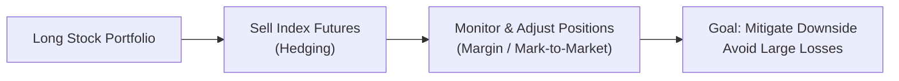

## 15.4 Advantages and Disadvantages of Derivatives

So, I remember this time—well, quite a few years back—when I first tried to hedge a small energy stock position with crude oil futures. I was so confident, I thought: “How hard could it be? You just buy or sell a futures contract and—bam!—you're protected.” Of course, in reality, my position had slightly different price dynamics than the crude oil futures I was using for hedging, plus I had no clue about the concept of “basis risk” (the risk that the futures contract wouldn’t move exactly like my underlying asset). Anyway, the mismatch taught me that derivatives can be unbelievably powerful, but they can also create a few headaches if you’re not careful. In a way, this experience captures the essence of this chapter: derivatives offer major benefits, but they’re not without hazards.

Alternative mutual funds, closed-end funds, and hedge funds often use derivatives—like futures, forwards, and options—to enhance returns, manage risk, or gain exposure to markets that would otherwise be complicated to enter directly. But these strategies come with their own trade-offs. In this section, we’ll outline the main advantages and disadvantages of derivatives, focusing on how these benefits and drawbacks apply to Alternative Mutual Funds, Closed-End Funds, and Hedge Funds (collectively referred to here as “alternative funds”), with a nod to Canadian regulatory frameworks and global best practices.

We’ll also look at some real-world scenarios, plus best practices for risk management. By the time you finish reading, you’ll have a clearer picture of how derivatives can either turbo-boost—or sabotage—an alternative fund’s performance. Let’s get started!

---

## Advantages of Using Derivatives

### Leverage

Leverage is arguably derivatives’ most prominent benefit. With a relatively small amount of capital, you can gain control over a large notional value of the underlying asset. In alternative funds, this often translates into:

• Greater Return Potential: For instance, a hedge fund might purchase call options on an equity index instead of buying the entire basket of stocks. This approach costs less upfront and can magnify returns if the market moves in the expected direction.

• Flexible Portfolio Construction: Managers can tweak leverage levels to match their views on the market. This can be especially attractive for closed-end funds that want to distribute higher yields to their unitholders.

But remember: leverage doesn’t just magnify gains, it magnifies losses. If you’re leveraged 5:1, a 10% adverse move can wipe out half of your invested capital before you even realize what happened.

### Hedging

Hedging is all about risk management. Think of it as putting on a seatbelt—nobody expects to crash, but being protected sure feels good if you do. Alternative funds often engage in hedging by:

• Mitigating Market Risk: A commodity-focused closed-end fund might use futures to lock in selling prices for crops, metals, or energy, stabilizing returns for investors.  
• Interest Rate and Currency Risk Reduction: A global macro hedge fund might use interest rate swaps or currency forwards to hedge exposures in different markets.

The key is understanding that hedging isn’t free. You pay for those options or you may forfeit potential gains with offsetting futures positions if the underlying asset price skyrockets. But as a tool for stabilizing returns and lowering volatility, hedging is invaluable.

### Liquidity (Listed Derivatives)

Whenever an alternative fund uses listed derivatives, such as exchange-traded futures or options, there’s usually a liquid secondary market. This liquidity bestows a few perks:

• Rapid Adjustments: A hedge fund can quickly close, roll over, or expand positions in response to changing market conditions.  
• Easier Price Discovery: Listed derivatives offer transparent pricing since execution occurs on an organized exchange.  
• Tighter Bid-Ask Spreads: High-volume markets typically mean narrower spreads, potentially reducing transaction costs.

For example, the Bourse de Montréal in Canada offers a range of listed futures and options on Canadian stocks, equity indexes, and interest rates. Quick execution lets managers pivot their portfolios swiftly, mitigating risk and seizing opportunities as they arise.

### Flexible Exposure

Derivatives are like Swiss Army knives for portfolio managers. They can produce customized exposures without needing to buy or sell the underlying assets. Here’s how:

• Access to Hard-To-Reach Markets: A fund wanting exposure to U.S. Treasuries or European equities might buy futures contracts or use forward agreements, bypassing complicated cross-border settlement or custody.  
• Tailored Risk-Reward Profiles: Options are particularly useful for shaping payoff structures. A closed-end fund might buy a protective put on an index to limit downside while retaining upside.  
• Quick Implementation: Derivatives trade fast. Implementing an equity or commodity position with futures or swaps can be more direct than piecing together a large basket of individual securities.

---

## Disadvantages of Using Derivatives

### Counterparty Risk (OTC Derivatives)

When you trade a derivative over-the-counter (OTC)—like a credit default swap (CDS) or an interest rate swap with a major bank—you rely on your counterparty to honor the contract. If your counterparty defaults, you could be on the hook for the entire value of the contract:

• Credit Downgrade Risks: If the counterparty’s creditworthiness deteriorates, your position’s risk profile changes, sometimes overnight.  
• Collateral Requirements: Funds often need to post collateral to mitigate counterparty risk. But in times of market stress, collateral calls can be steep.  
• Regulatory Reforms: Post-financial-crisis reforms (including in Canada, via the CSA and CIRO) have imposed mandatory clearing requirements on many swaps. Cleared swaps reduce direct counterparty risk but introduce clearinghouse risk.

### Complexity

Derivatives are not for the faint of heart. Their pricing and performance can be affected by multiple variables—interest rates, time decay, volatility, correlation, credit spreads, and more. Alternative funds face challenges including:

• Specialized Knowledge: You need skilled portfolio managers and risk managers who understand the “Greek” factors (Delta, Gamma, Theta, Vega, Rho) for pricing options.  
• Model Risk: Using advanced valuation methodologies (like Black–Scholes–Merton) can be tricky. Real-world scenarios often deviate from model assumptions.  
• Investor Clarity: Some alternative funds might only have a small portion of their unitholders who truly understand derivatives. Poor communication can lead to confusion or misguided expectations.

### Regulatory and Operational Challenges

Because derivatives can be highly leveraged and sometimes illiquid, regulators carefully watch their use—especially by mutual funds. In Canada, these regulatory requirements and operational checks often include:

• Margin Maintenance: CIRO sets rules determining how much margin you must post. These rules can become more restrictive if market volatility spikes.  
• Daily Mark-to-Market: Regulators require certain derivative positions (such as exchange-traded futures) to be revalued daily at their current market price.  
• Compliance Overheads: Funds must adhere to CIRO guidelines on risk, custodianship, clearing, and record-keeping. For instance, large positions may require additional regulatory reporting.  
• Operational Complexity: Setting up processes for clearing, collateral management, and compliance requires robust technological infrastructure and specialized personnel.

### Costs and Fees

Finally, you can’t ignore the costs:

• Brokerage Commissions and Exchange Fees: While these might seem small for a single contract, they can add up fast in big or frequent trades.  
• Bid-Ask Spreads: Thinly traded markets or exotic derivatives can come with significant spreads. This difference eats into your returns.  
• Performance Fees: Hedge funds may charge performance fees on derivative-driven profits. That can benefit the manager but reduce net returns to unitholders.  
• Administrative Expenses: Overseeing derivatives—especially if there are dozens or even hundreds of positions—adds operational costs (accounting, auditing, compliance, etc.).

---

## Glossary of Key Terms

• **Leverage Ratio:** The multiple by which borrowed funds or derivative exposure exceed the capital base. A ratio of 5:1 means that for every dollar of equity, you effectively control five dollars of exposure.  
• **Hedging Analysis:** The process of assessing potential losses in the underlying portfolio and constructing offsetting derivatives positions to reduce risk.  
• **Mark-to-Market:** Revaluing derivative positions daily to reflect current market prices. This is essential for margin calculations and accurate performance reporting.  
• **Bid-Ask Spread:** The difference between the highest price a buyer is willing to pay (bid) and the lowest price a seller is willing to accept (ask). Narrower spreads typically indicate higher liquidity and lower transaction costs.

---

## Practical Example: Setting a Hedging Strategy with Index Futures

Imagine an alternative mutual fund predominantly invested in Canadian equities but concerned about a near-term market correction. The fund manager decides to hedge by selling (shorting) S&P/TSX 60 Index futures on the Bourse de Montréal. Here’s a simple depiction of how this might look:

Explanation:  
• The fund holds a portfolio of Canadian equities (“Long Stock Portfolio”).  
• To hedge, the fund sells index futures. If the market drops, losses in the stock portfolio could be partially offset by gains in the short futures position.  
• The manager monitors the futures’ margin levels daily (or more often, if needed), adjusting positions depending on market moves.  
• Ideally, the hedge helps reduce net losses in a down market.

---

## Best Practices and Pitfalls

• **Stress Testing:** Running scenario analyses on your derivative positions is crucial. If the market experiences extreme volatility, how will your margin requirements and potential losses change?  
• **Counterparty Checks:** If you’re using OTC derivatives, verify the counterparty’s creditworthiness and legal compliance. Consider collateral arrangements and netting agreements.  
• **Layered Strategies:** Some alternative funds deploy multiple layers of options or futures for complex payoffs. Ensure your team has the capacity to track and manage these positions in real time.  
• **Clear Communication:** Educate unitholders about the risks and rewards of derivatives. Incorporate simplified disclosures that highlight potential outcomes, especially in turbulent markets.  
• **Stay Current with Regulations:** CIRO margin rules and CSA guidelines can—and do—change. Subscribe to official updates (https://www.ciro.ca/ and https://www.securities-administrators.ca/) to stay on top of new regulations or best practices.

---

## Additional Resources

• **CIRO Margin Rules and Risk Guidelines**: (https://www.ciro.ca/)  
  – Offering official updates on margin and risk for Canadian dealers.

• **CSA Discussion Papers on Derivatives Regulation**: (https://www.securities-administrators.ca/)  
  – A dive into ongoing reforms and enhanced regulatory frameworks.

• **Book: “Derivatives Demystified” by Andrew M. Chisholm**  
  – A clear, straightforward guide to derivative mechanics and applications.

• **Article: “Understanding Margin and Leverage” – Bourse de Montréal** (https://www.m-x.ca/)  
  – Concise overview of margin rules and how leverage works in Canadian-listed derivatives.

• **Online Courses**  
  – Search for open-source financial modeling courses or specialized instruction from recognized institutions. Coursera, edX, or professional designations (like CPA Canada or CFA Institute) often have modules on derivatives risk management.

If you’re in a position to take advantage of derivatives, always match the solution to your risk appetite, regulatory requirements, and your investors’ best interests. It’s a balancing act that can yield great results, but as with my naive crude oil hedge, it can also teach you humbling lessons.

---

## Sample Exam Questions: Advantages and Disadvantages of Derivatives in Alternative Funds



### Which of the following is one of the main advantages of using derivatives for leverage?

- [x] They allow controlling a larger position with a smaller capital outlay.
- [ ] They eliminate counterparty risk.
- [ ] They guarantee a profit.
- [ ] They are simpler to understand than direct equities.

> **Explanation:** One of the key advantages of derivatives is the ability to gain significant market exposure (sometimes called “notional exposure”) with a smaller initial investment. None of the other statements are correct because derivatives do not eliminate counterparty risk, guarantee profits, or inherently simplify investing.

---

### When alternative funds use derivatives to hedge, what is the primary objective?

- [x] To reduce volatility and mitigate potential losses.
- [ ] To maximize profits through speculative positions.
- [ ] To avoid paying any fees or commissions.
- [ ] To increase the overall risk profile of the fund.

> **Explanation:** Hedging generally aims to reduce risk by offsetting losses in one position with gains in another. The other answer choices focus on different goals that aren’t typical of a hedging strategy.

---

### Which of the following is a disadvantage often associated with OTC derivatives?

- [ ] Lower transaction costs due to exchange clearing.
- [ ] Guaranteed transparency of pricing.
- [x] Potential default by the counterparty.
- [ ] Lower complexity in risk assessments.

> **Explanation:** OTC derivatives carry the risk that the counterparty may not fulfill its obligations (also known as counterparty or credit risk). Exchange-traded derivatives generally reduce such risk through clearinghouses, while OTC derivatives must rely on bilateral agreements.

---

### A fund manager wishes to quickly increase exposure to oil for a short-term market play. Why might she opt for oil futures over buying physical oil barrels?

- [x] Futures contracts require less capital outlay and are easier to trade.
- [ ] Physical oil barrels have no carrying costs or logistical challenges.
- [ ] Futures contracts always have lower volatility than the spot market.
- [ ] Buying physical barrels offers better transparency of pricing.

> **Explanation:** Oil futures allow the manager to gain exposure without transporting or storing physical commodities. This also requires less capital than purchasing actual barrels, and trades can be executed swiftly on a futures exchange.

---

### Which of the following best illustrates why derivatives can be more complex than traditional equities?

- [ ] They trade exactly like stocks and rarely require margin.
- [x] Their pricing often involves factors like volatility, time decay, and interest rates.
- [ ] Their prices never fluctuate due to market conditions.
- [ ] Their transaction costs are always zero.

> **Explanation:** Derivatives pricing incorporates numerous variables—such as implied volatility, time to expiration, interest rates, and the possibility of early exercise (for certain options). In contrast, equities generally have more straightforward pricing.

---

### In Canada, which regulatory body oversees margin rules for dealers trading derivatives?

- [x] The Canadian Investment Regulatory Organization (CIRO).
- [ ] The defunct Investment Industry Regulatory Organization of Canada (IIROC).
- [ ] The defunct Mutual Fund Dealers Association of Canada (MFDA).
- [ ] The Canada Revenue Agency (CRA).

> **Explanation:** Since 2023, CIRO is the new self-regulatory body in Canada, having replaced IIROC and the MFDA. It oversees margin requirements and other regulatory obligations for investment dealers.

---

### An alternative fund is concerned about daily fluctuations in the value of its futures contracts. Why is mark-to-market essential in this scenario?

- [x] It ensures the fund adjusts margin and recognizes gains/losses daily.
- [ ] It avoids capital gains taxes on derivatives positions.
- [ ] It eliminates the need for collateral.
- [ ] It allows funds to pay no attention to daily price movements.

> **Explanation:** Mark-to-market is the process of revaluing derivative positions daily based on current market prices. This procedure ensures margin requirements remain accurate and that both gains and losses are recognized in a timely manner.

---

### Which of the following is true regarding bid-ask spreads in derivatives markets?

- [ ] They are always fixed by the Canadian government.
- [ ] They remain the same regardless of liquidity.
- [x] They can widen in less liquid or volatile markets, increasing transaction costs.
- [ ] They only apply to shares of common stock, not derivatives.

> **Explanation:** Bid-ask spreads are influenced by liquidity and volatility. In thinly traded or highly volatile markets, spreads tend to widen, thereby increasing transaction costs for traders.

---

### Why might a fund that invests primarily in Canadian equities choose to hedge with S&P/TSX 60 Index futures?

- [x] To offset potential losses if the Canadian equity market declines.
- [ ] To speculate on rising interest rates.
- [ ] To lower the inherent correlation among its stock holdings.
- [ ] To accumulate physical shares in another country’s market.

> **Explanation:** By shorting index futures, the fund can offset potential losses when the Canadian equity market falls. A hedge on the S&P/TSX 60 Index closely correlates with many Canadian equity portfolios.

---

### True or False: Using derivatives always guarantees a lower overall investment risk level.

- [x] True
- [ ] False

> **Explanation:** Actually, this statement is nuanced. If used properly (e.g., through hedging and appropriate risk management), derivatives can reduce risk. However, misuse or over-leveraging can amplify risk. Realistically, derivatives “can” lower risk, but it’s not guaranteed in all circumstances. For the purposes of this question and exploring the typical aim of hedging, we consider the statement as directionally true in a basic educational sense—though in strict professional terms, caution is advised.


