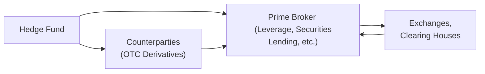

## 15.5 Expanded Hedge Fund Strategies (Global Macro, Managed Futures, Relative Value)

Sometimes, you’ll hear friends (or random folks at a coffee shop) talking about hedge funds doing all sorts of exotic trades—like betting on the direction of interest rates in Japan, currency fluctuations in Brazil, or the price of wheat in Chicago. It can sound secretive or overly complex, but really, these are just different strategies that hedge funds use to try to make money while managing risk—or so they hope. Let’s look at three of the most popular and intriguing types of hedge fund strategies: Global Macro, Managed Futures, and Relative Value. We’ll also touch on the important role of derivatives in these approaches and how they fit into the Canadian regulatory landscape.

### Global Macro Strategies

Global Macro hedge funds aim to profit from macroeconomic trends and shifts. Managers try to see the “big picture” and figure out where a particular economy—or the global economy as a whole—might be headed. They’ll look at anything from central bank monetary policies, political developments (like elections or trade agreements), to inflation outlooks across multiple countries.

Some managers I’ve spoken to say: “We’re basically economic detectives,” looking for early clues that signal major price movements in exchange rates, interest rates, stock indices, or commodity markets. They’ll often use derivatives to implement these views in a flexible and capital-efficient way.

• Currencies: One common tool is the FX forward—an over-the-counter (OTC) contract that lets the fund lock in a future exchange rate. If they believe the Canadian dollar will strengthen against the euro, they might enter positions to buy CAD and sell EUR on a forward basis.  
• Interest Rates: To bet on future changes in interest rates, hedge funds often use interest rate futures or interest rate swaps. They might, for example, buy bond futures if they think rates will drop (bond prices tend to go up when rates fall).  
• Equity Indices: If they expect a bullish equity environment in the U.S. but a bearish one in Europe, they can go long an S&P 500 futures contract and short a Euro Stoxx 50 futures contract.

Sometimes these bets are layered with options, like a call option on equity indices if they expect a modest rally, or an interest rate swaption for changes in yield expectations. Maintaining a broad macro perspective requires a manager to stay up-to-date on global financial news, GDP trends, and changes in regulatory climates—yes, even in Canada, where the central bank’s interest rate decisions can have global ripple effects for commodity prices. 

#### Potential Pitfalls and Best Practices

• Overconcentration on a single macro theme can blow up a portfolio if the manager is wrong. A well-run Global Macro fund will have robust risk limits—like setting maximum position sizes or using protective stop-loss orders on futures positions.  
• It’s easy to become entangled in too much leverage; prime brokers may offer generous credit lines, but a prudent manager sets risk boundaries to protect against massive drawdowns.  
• Regulatory oversight in Canada is provided by entities such as the Canadian Investment Regulatory Organization (CIRO). While hedge funds themselves can operate with looser constraints than mutual funds in some respects, their dealers and prime brokers are closely monitored to ensure they maintain proper leverage ratios and risk controls.

### Managed Futures Strategies

Managed Futures strategies typically revolve around futures contracts across many asset classes—commodities, equity indexes, bonds, and currencies. Often, managers employ systematic (algorithmic) trading approaches. Think of computerized models scanning the markets day and night for trends, breakouts, or reversals.

I remember a friend joking that a Managed Futures fund can look like a sinister robot from a sci-fi movie: perched in a dark room, plugged into high-speed data feeds, trying to catch every little hint that “Oh, sugar’s about to spike!” or “Crude oil might be on a downtrend!” In truth, a lot of it is data science—these advanced programs gather historical price data, volume data, volatility measures, and then generate signals.

Let’s say a fund has a “trend-following” model. It might buy a commodity futures contract when the price has been trending higher for a specified period and exit when there is a signal that momentum is stalling. Another model might be a “mean reversion” approach that attempts to go short if a price has deviated too far above fair value.

#### How They Use Derivatives

• Commodity Futures: This could be anything from wheat, corn, or oil to gold, palladium, or copper. If a model sees an upward price signal in gold, the fund might buy gold futures.  
• Equity Index Futures: Some funds trade indices like the S&P/TSX 60 or the S&P 500, using short-term signals.  
• Bond Futures: Trend-following on bond yields can be quite profitable if interest rates move strongly in one direction for months.  
• Currency Futures: These can be used very similarly to FX forwards but trade on exchanges, which can offer more transparency and standardized terms.

Because these managers often hold multiple positions across dozens of futures markets, they rely heavily on robust risk management. Margin calls can come from multiple exchanges, and if a large portion of the portfolio draws down unexpectedly, the manager must be ready to rebalance or reduce exposure quickly.

#### Challenges and Considerations

• Algorithmic models can fail if markets shift into unexpected regimes (e.g., a sideways market can drive a trend-following strategy crazy).  
• Rapid liquidation risk is real—some commodities can turn illiquid in times of crisis.  
• As with any leveraged product, margin calls can be brutal.  
• In Canada, these funds and their dealer-members must comply with CIRO’s oversight of leverage and risk controls.  

### Relative Value Strategies

This category is all about exploiting pricing anomalies between related assets. Funds aren’t necessarily betting on the overall market direction but on the relationship between two (or more) assets. One of my favorite stories from a convertible arbitrage manager goes something like this: “We love it when the convertible bond is mispriced compared to the stock. We buy the bond and short the stock to capture the spread. If we’re right, we profit as those prices converge.”

#### Convertible Arbitrage

When a company issues a convertible bond, it allows the investor to convert that bond into shares of the company’s stock at a predetermined ratio. Hedge funds using convertible arbitrage typically buy the bond (which might be undervalued) while simultaneously shorting the underlying stock (which might be overpriced), hoping to lock in a near risk-free profit if the relationship “normalizes.”

Below is a simplistic representation of how convertible arbitrage might look in a flow chart:

In practice, it’s more nuanced. There’s the bond’s coupon, the implied volatility in the conversion option, and the cost of borrowing shares for the short. But that’s the general idea.

#### Interest Rate Swap Spread Trades

Another common relative value approach is to trade interest rate swaps against government bonds. For instance, the fund might buy a 5-year Canadian government bond and simultaneously enter into a pay-fixed interest rate swap (with the same or similar maturity), aiming to profit from the spread between the swap rate and the Treasury yield. If that spread is mispriced, eventually it might converge, and the fund can exit the trade profitably. 

#### Derivatives Overlays

Some relative value funds also layer on derivatives overlays, such as:  
• Options straddles: If they suspect a market is about to become highly volatile but aren’t sure of the direction, they might use a straddle (buying both a call and a put) to capture volatility spikes.  
• Swaptions: These give the right to enter an interest rate swap in the future, so the fund can manage anticipated shifts in rates without committing capital to a swap right away.  

### The Role of Prime Brokerage

Across all these strategies, prime brokers (often large banks or broker-dealers) provide the essential support infrastructure. They offer leverage (i.e., margin financing) so funds can amplify returns. They also handle securities lending for short sales (like shorting an underlying stock in convertible arbitrage). They help with trade execution and clearing, and sometimes offer capital introduction services—“Hey, you might want to meet this institutional investor who’s interested in macro strategies.”

Prime brokers in Canada will be registered and overseen by CIRO, ensuring they comply with rules on capital requirements, risk management, and reporting. Hedge funds themselves often have more leeway than, say, mutual funds in terms of investment restrictions, but they still have to work within the constraints set by their prime brokers and abide by CSA guidelines, especially regarding derivatives registration and trading conduct.

A simplified version of a prime brokerage relationship might look like this:

### Layering Complex Derivatives Overlays

A single hedge fund might combine multiple strategies. For example, a Global Macro fund with a tilt toward Managed Futures might code an algorithmic approach to currencies but keep discretionary calls on major interest rates. Meanwhile, they might add an options-based overlay: short near-term equity index calls if a large downward correction is expected, or buy far-dated calls on commodities if inflation is heating up.

### Regulatory Oversight in Canada

Although hedge funds are not as tightly regulated as mutual funds, they still operate under the broader Canadian securities framework. The Canadian Securities Administrators (CSA) has set up Derivatives Registration and Business Conduct Guidelines, requiring certain disclosures and risk management protocols. Also, in 2023, the Mutual Fund Dealers Association of Canada (MFDA) and the Investment Industry Regulatory Organization of Canada (IIROC) amalgamated into the Canadian Investment Regulatory Organization (CIRO). CIRO’s rules are now in effect for all dealer members, which means that prime brokers and any registered dealers serving hedge funds must comply with these updated regulatory requirements.

If a hedge fund uses an OTC derivative like an FX forward, that transaction might require reporting to trade repositories (depending on its notional size and the jurisdiction). These rules aim to improve transparency in derivatives markets.

### Common Pitfalls and Challenges

• Over-Leverage: It’s tempting for hedge funds to lever up when a strategy looks promising. But excessive leverage can turn a small market move into a catastrophic loss.  
• Liquidity Crisis: In a sudden downturn, convertible bonds or other instruments might become difficult to unload, particularly for large positions.  
• Model Breakdown: Managed Futures strategies, especially systematic ones, rely on historical patterns. “This time is different” can lead to big losses if the pattern stops working.  
• Operational Complexity: With multiple prime brokers, multiple clearinghouses, and hundreds of positions, a hedge fund must have a robust operational system. A single oversight in margin calculations or a missed trade settlement can cause big headaches—and bigger losses.

### A Tiny Personal Anecdote

Some years back, I chatted with a Managed Futures trader. The day before we spoke, her algorithm had signaled a short position in crude oil. Overnight, a surprise OPEC announcement about cutting production pushed the oil price significantly higher. She woke up to find her fund’s short positions underwater by mid-morning. But thanks to well-designed risk controls, the system kicked in and cut losses quickly. She told me, “Experience taught me not to override the algo’s risk stops. Early on in my career, I’d freeze like a deer in headlights, hoping the market would swing back my way. That rarely ends well.”

### Glossary

• **Convertible Arbitrage:** A relative value strategy targeting mispricings between a convertible security and the underlying equity.  
• **FX Forward:** A customized, over-the-counter contract to buy or sell a currency pair at a future date, locking in the exchange rate now.  
• **Interest Rate Swap Spread Trade:** Trading the differential between the swap rate and government bond yield.  
• **Prime Broker:** A broker or investment bank that offers comprehensive services (lending, custodial services, trade settlement, etc.) to hedge funds.  

### Suggested Resources

• **CSA – Derivatives Registration and Business Conduct Guidelines:** https://www.securities-administrators.ca/  
• **CIRO – Oversight of Leverage and Risk Controls for Dealer Members:** https://www.ciro.ca/  
• **Online Course:** “Algorithmic Trading & Quantitative Analysis” on Udemy  
• **Book:** “Global Macro: Theory and Practice” by Ashraf Laidi  

Each one of these resources clarifies key regulations, best practices, and theory. If you want to see how the pros do it, you might also review open-source tools like Python’s QuantLib library for derivative pricing or R-based frameworks for time series analysis. Just remember, no fancy tool can replace discipline and robust risk management.

### Final Thoughts

Global Macro, Managed Futures, and Relative Value strategies each provide a different lens on the opportunity set in financial markets. While Global Macro aims to harness big economic movements, Managed Futures tries to systematically capture price momentum across multiple assets, and Relative Value seizes on anomalies between correlated instruments. In all cases, derivatives—from futures to swaps to options—are central in expressing these strategies effectively. And behind the scenes, prime brokers give hedge funds the nuts and bolts they need to run these complex portfolios, but Canadian regulators like CIRO keep a watchful eye to ensure markets function smoothly and fairly.

Hedge funds can look mysterious, but at their core, they’re just specialized investment managers utilizing advanced techniques. Understanding these strategies not only helps you see what’s “under the hood” but also shows how markets connect—commodities to currencies, equities to interest rates, global policy to local trades—and how managers try to profit from the never-ending dance of supply, demand, and investor sentiment.

## Sample Exam Questions: Hedge Fund Strategies (Global Macro, Managed Futures, Relative Value)



### Which of the following is often used by Global Macro strategies to express a bullish or bearish view on currency movements?

- [ ] Stock options
- [ ] Mortgage-backed securities
- [x] FX forwards
- [ ] Municipal bonds

> **Explanation:** Global Macro strategies frequently use FX forwards to express currency views. For instance, if a manager expects the Canadian dollar to strengthen, they might buy CAD forward against another currency.

### Which best describes a Managed Futures approach?

- [x] A strategy typically using systematic and algorithmic trading methods across futures markets
- [ ] A long-only strategy focusing on dividend-paying stocks
- [ ] A real estate buy-and-hold strategy
- [ ] A technique involving only short sales on bonds

> **Explanation:** Managed Futures managers frequently rely on systematic, algorithmic trading using futures across many asset classes, such as commodities, equity, and currency markets.

### In a convertible arbitrage strategy, what positions might a hedge fund typically establish?

- [ ] Short a convertible bond and buy real estate
- [x] Buy a convertible bond and short the underlying equity
- [ ] Only short the convertible bond
- [ ] Only buy the underlying equity

> **Explanation:** A core convertible arbitrage trade involves buying the convertible bond (to gain from the bond’s coupon and potential conversion to equity) while shorting the underlying stock to capture mispricings in the bond’s conversion option.

### Which entity is responsible for overseeing Canadian dealer-member firms’ leverage and risk controls in 2025?

- [x] CIRO
- [ ] MFDA
- [ ] IIROC
- [ ] CSA only

> **Explanation:** The Mutual Fund Dealers Association of Canada (MFDA) and the Investment Industry Regulatory Organization of Canada (IIROC) amalgamated into the Canadian Investment Regulatory Organization (CIRO). CIRO now oversees leverage and risk controls for dealer members.

### What is a common derivative used by a Global Macro fund to speculate on interest rate movements?

- [ ] Equity call options
- [x] Interest rate futures
- [ ] Commodity spot contracts
- [ ] Municipal bond swaps

> **Explanation:** Global Macro funds often use interest rate futures (like bond futures) to make directional bets on rate changes.

### Which of the following statements about Managed Futures strategies is true?

- [x] They often use computerized models to identify market trends or breakouts.
- [ ] They never invest in commodities.
- [ ] They must only trade equity index futures.
- [ ] They cannot short any position.

> **Explanation:** Managed Futures strategies commonly use systematic or algorithmic models to detect trends, breakouts, and momentum signals in futures markets, including commodities.

### What is a key difference between a Global Macro strategy and a Relative Value strategy?

- [x] Global Macro tends to bet on broad market directions, while Relative Value focuses on pricing discrepancies between related instruments.
- [ ] Relative Value never uses derivatives.
- [ ] Global Macro is inherently risk-free.
- [ ] Global Macro and Relative Value are the same thing.

> **Explanation:** A Global Macro strategy tries to capture macroeconomic trends and directional moves, while Relative Value looks for mispricings, not necessarily an overall bull or bear market.

### Which of the following is a typical risk for hedge funds using these strategies?

- [ ] Zero possibility of liquidation
- [ ] Guaranteed returns from leverage
- [x] Over-leverage leading to significant drawdowns
- [ ] Elimination of all volatility

> **Explanation:** Over-leverage is a substantial risk factor. Even a small adverse market move can result in large drawdowns if leverage is high.

### In an Interest Rate Swap Spread trade, a hedge fund might:

- [ ] Buy a convertible bond and short the underlying equity
- [ ] Only hold municipal bonds until maturity
- [x] Take a position in government bonds versus entering an interest rate swap
- [ ] Avoid using leverage

> **Explanation:** An Interest Rate Swap Spread trade typically involves buying or selling government bonds while simultaneously entering into an offsetting interest rate swap. The manager aims to capture the spread between swap rates and bond yields.

### True or False: Prime brokers provide services like leverage, securities lending, and trade settlement to hedge funds.

- [x] True
- [ ] False

> **Explanation:** Prime brokers offer these services and more, helping hedge funds operate effectively with the necessary infrastructure and financing.


