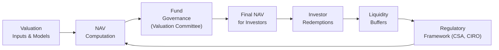

## 15.6 Valuation & Liquidity Challenges in Alternative Products

Sometimes, when folks hear about “alternative” funds—whether they’re called alternative mutual funds, closed-end funds, or hedge funds—they get a little wary. And honestly, I can’t blame them! There’s this sort of mystique around alternative products because they can hold complex instruments, trade in obscure or less liquid markets, and use derivatives that don’t exactly have a price flashing all day on some popular exchange. One time, I remember analyzing a small hedge fund that was big into private placement debt and micro-cap emerging market equities. Trying to figure out the “real” net asset value (NAV) of that portfolio was basically like searching for definitive proof of Bigfoot. And that’s me being nice.

Below, we’ll try to demystify some of the spookiness behind how these alternative products get valued, and how managers juggle the need to keep enough cash on hand to let investors redeem (especially in the case of certain alternative mutual funds). So let’s dive in.

---

### Valuation Issues

Before we talk about the actual liquidity part, let’s look at where things get a bit hairy: valuation. You know, the question that’s always lurking in the background—“What is this fund actually worth right now?”

#### Reliance on Pricing Models and Subjective Inputs
Many derivatives used in alternative strategies—like certain types of over-the-counter (OTC) swaps or exotic options—don’t have a clearly visible market price. You can’t just hop on the Bourse de Montréal website to see the “last trade” or “closing price.” Instead, you have to rely on internal pricing models or value them using quotes from dealers. But, hey, sometimes dealers aren’t exactly the busiest bees providing quotes. One might say, “This swap is worth X,” and another might offer a different number. This reliance on dealer quotes can introduce subjectivity, or at times, some friction in net asset value computations.

Model risk is another biggie: If the model you’re using has a flawed assumption or if your staff misapplies it, you might end up with a price that’s nowhere near what the market deems to be fair. Maybe your volatility input is out of date, or your correlation assumptions are too simplistic. That can cause real trouble for a fund promising daily pricing to investors.

#### Illiquid or Thinly Traded Securities
Now, it’s not only derivatives that cause headaches—plenty of “real-world” assets, like certain corporate bonds, private loans, or shares of small companies in emerging markets, are barely traded each day. Heck, some of them might not trade for weeks at a time. So if you’re an alternative mutual fund manager, how do you figure out the per-share NAV each evening?

• One approach is to use independent third-party pricing services. These firms compile quotes, run valuation models, and (in theory) provide an unbiased price.  
• In some situations—like a truly illiquid bond or a direct loan to a private company—you might have to rely on an in-house valuation committee. Obviously, the big risk here is conflict of interest: The fund manager might be tempted to price it a bit more favorably.

The good news is that regulators (including the Canadian Securities Administrators, or CSA) generally expect funds to adopt robust processes. That includes written valuation policies, documentation of methodologies, and reliance on multiple sources wherever possible. CIRO, Canada’s current self-regulatory organization, also has rules on pricing transparency and best execution. Although CIRO’s direct pricing rules focus mostly on securities with visible market quotations, the spirit of fair dealing extends to alternative funds, too.

#### Stress Testing and Regulatory Expectations
When you’re dealing with uncertain pricing or complicated derivatives, you need a reality check every so often. Stress testing is basically that reality check. Funds might ask themselves: “What happens if interest rates jump by 300 basis points tomorrow?” or “What if the private credit issuer we’re holding defaults on half its obligations?” or “What if volatility spikes in our exotic options?” By running these stress tests, fund managers can (hopefully) see if their net asset value could go haywire under extreme market conditions and then plan accordingly.

Regulators in Canada, via CSA National Instrument 81-102 for investment funds, encourage robust liquidity planning and risk controls. Stress testing is not only good practice but often a regulatory expectation to confirm a fund can handle extreme volatility without widely deviating from its stated NAV.

---

### Liquidity Management

Alright, let’s shift gears. Suppose an investor wants to redeem tomorrow, or maybe a major chunk of investors decide to redeem at once. Well, for some alternative mutual funds, they can’t just say, “Oops, sorry, do you mind waiting a month?” The rules in Canada basically say if you’re an open-end fund, you typically have to redeem daily (with certain exceptions). That means you need some reliable liquidity management.

#### Daily Redemption Requirements
Alternative mutual funds that maintain daily redemption features must hold a healthy liquidity buffer—they can’t all be in complex derivatives or in illiquid securities. The last thing they want is a dreaded “liquidity mismatch,” where too much of the portfolio is locked up in assets that can’t be sold quickly at a fair price. If you can’t raise cash when needed, you run the risk of forced selling at a big discount. That, in turn, can crater the fund’s NAV and punish both exiting and remaining investors. 

Some techniques used:
1. **Redemption Fees:** By charging a small redemption fee for investors pulling out money quickly, funds can dissuade short-term “hot money.”  
2. **Short-Term Borrowing Facilities:** A fund might use a line of credit or short-term loan arrangement if it needs to meet redemptions quickly.  
3. **Cash or Treasuries for Liquidity Buffer:** Managers keep a portion of the fund’s assets in ultra-liquid securities (like Government of Canada T-bills). This chunk is specifically set aside to handle normal redemption flows.  

Of course, there’s always a cost to holding extra liquidity. If you’re holding a big chunk of cash, you might not be fully invested in the alternative strategy. So it’s a balancing act.

#### Gates and Lock-Up Periods
Now, in the hedge fund world, daily redemption is often not a thing. Hedge funds handle illiquid assets routinely—private equity deals, long-dated swap arrangements, real estate holdings, etc. If a bunch of investors run for the exits at the same time, it could force a fire sale. That’s why hedge funds often say “Sure, we’ll let you redeem, but only quarterly or annually, and by the way, we have the right to impose a gate if redemptions exceed X% of assets.” Those gates slow down or limit withdrawal amounts during market turbulence. There are also lock-up periods: an investor might commit capital for six months, a year, or even longer before they can redeem. That’s not typically permissible in a “daily redeemable” mutual fund structure under CSA rules, but in the alternative mutual fund or closed-end fund space, there can be special redemption provisions or periodic liquidity windows.  

It’s important to note that in Canada, these gating restrictions for any type of publicly offered fund must align with the rules established by the CSA. Meanwhile, private hedge funds that cater to accredited or institutional investors have more leeway (though they’re still subject to disclosure requirements and must act fairly).

#### Compliance with CSA Liquidity Requirements
As a quick aside, Canada’s CSA enforces certain liquidity requirements, especially for mutual funds, to ensure that investors can typically convert their fund holdings to cash without the kind of meltdown that puts the whole strategy (and the investor’s money) at risk. The gist is: You have to hold enough “liquid assets,” typically those that can be sold or redeemed within a set time frame without significantly affecting the price. That concept is also deeply connected to the idea of “fair value” pricing and transparency. Daily or near-daily rebalancing to meet redemption activity is part of the game for alternative mutual funds.  

---

### Putting It All Together—A Visual Overview

It might help to see how valuation inputs, internal committees, and liquidity concerns feed into each other. Here’s a simplistic Mermaid diagram to illustrate the relationship between valuation processes, fund governance, and redemption management:

1. **Valuation Inputs & Models** (A) feed into the next stage.  
2. **NAV Computation** (B) is conducted, sometimes daily, based on those model outputs and any market quotes.  
3. **Fund Governance or Valuation Committee** (C) reviews the numbers, especially for illiquid or model-priced assets.  
4. The **Final NAV** (D) is published to investors, who may then choose to redeem.  
5. The fund responds to **Investor Redemptions** (E) by tapping into **Liquidity Buffers** (F).  
6. The fund must continuously align with **Regulatory Frameworks** (G) from the CSA, CIRO, etc., which circle back to inform best practices for valuation (B).  

This cyclical process helps managers remain honest and systematic in how they manage both valuation and liquidity.

---

### Common Pitfalls

Now that we have the basics out of the way, let’s talk about some pitfalls. 

• **Overestimating Liquidity:** If a manager is too optimistic about how quickly they can sell certain derivative positions or private securities, they might not keep enough of a liquidity buffer. That’s a recipe for disaster if redemption spikes.  
• **Valuation Committee Conflicts:** An internal committee that includes portfolio managers might be biased toward more favorable prices. If there’s insufficient oversight from independent members, you can see some real conflicts.  
• **Model Blindness:** Over-reliance on one pricing model can be treacherous. If the model is missing a key risk factor (like a correlation shift during stress markets), the reported NAV could be misleading.  
• **Sudden Market Shocks:** We saw this with the pandemic-induced volatility. Funds that had large exposures to illiquid assets discovered just how fast those holdings could become even more illiquid. Stress testing scenarios that used to seem far-fetched suddenly became all too real.  

---

### Real-World Example: Hedge Fund on the Brink

Let me give a quick personal anecdote that highlights just how crucial these valuation and liquidity processes are. A friend of mine worked at a hedge fund that specialized in distressed corporate debt—stuff that had a decent yield, but came with questionable credit risk. For months, the fund used a sophisticated model to price these illiquid bonds. Everything looked pretty until the credit spreads started widening dramatically in a volatile market. Suddenly, the model’s default probability assumptions were, well, comically off.

Investors panicked, redeeming in droves. The hedge fund was obligated to meet redemptions—yeah, they had a gate, but not enough to prevent big outflows. They tried to sell some of these distressed bonds quickly, only to find near-zero demand at anything close to their “model” prices. The next revaluation day, the fund had to slash the bond prices drastically. The NAV sank, and more investors asked for their money back.

Ultimately, the hedge fund suspended redemptions (triggering legal scrutiny), and the manager basically had to restructure the entire operation. This fiasco is a cautionary tale—it underscores the vital importance of accurate valuation, well-structured liquidity management, and realistic redemption provisions.

---

### Best Practices and Strategies

1. **Use Multiple Valuation Sources**  
   Don’t rely on a single dealer quote for your OTC derivatives. Gather quotes from multiple dealers or use a robust pricing model validated independently.  

2. **Regularly Stress Test**  
   This can’t be emphasized enough. Make sure your assumptions are tested under different market conditions (e.g., high volatility, changes in interest rates, or wide credit spreads).  

3. **Maintain Transparent Processes**  
   Let’s face it, it’s easy for conflicts of interest to slip in. Clear governance policies, third-party oversight, and open communication with investors about valuation methods all help build trust.  

4. **Plan Liquidity Thoroughly**  
   If you’re an alternative mutual fund with daily (or frequent) redemptions, ensure you have a rational chunk of liquid assets. And if you’re a hedge fund using gates, ensure they’re clearly disclosed.  

5. **Adhere to Regulatory Guidance**  
   Keep an eye on CSA National Instrument 81-102 regarding liquidity requirements, as well as CIRO guidance on pricing. The regulatory environment isn’t just a bunch of rules—it’s designed to protect both the fund and its investors from meltdown scenarios.

---

### Glossary

• **NAV (Net Asset Value):** The per-unit (or per-share) value of a fund. Calculated by subtracting total liabilities from total assets, then dividing by the number of units/shares outstanding.  
• **Model Risk:** The risk that arises when a chosen pricing model is incorrect or is incorrectly implemented, leading to inaccurate valuations.  
• **External Valuation Providers:** Independent firms that specialize in valuing assets (like illiquid bonds or complicated derivatives) where no active market exists.  
• **Liquidity Buffer:** A portion of a fund’s assets held in cash or highly liquid instruments (e.g., T-bills) to facilitate redemptions without severely impacting the portfolio’s main strategy.

---

### references and further resources

If you’d like to explore more specifics about valuation and liquidity in alternative products, here are some Canadian and international resources:

• **CSA National Instrument 81-102 – Investment Funds Liquidity Requirements:**  
  Visit the CSA’s official website at  
  [https://www.securities-administrators.ca/](https://www.securities-administrators.ca/)  
  This document outlines fundamental liquidity and redemption requirements for Canadian investment funds.

• **CIRO – Rules on Pricing and Best Execution:**  
  [https://www.ciro.ca/](https://www.ciro.ca/)  
  CIRO (the Canadian Investment Regulatory Organization) sets guidelines on how investment dealers and funds should approach pricing, transparency, and best execution when interacting with markets.

• **“Asset and Liability Management Handbook” by GARP**  
  Provides a sturdy theoretical framework for managing the interplay of assets and liabilities, including strategies for dealing with illiquid holdings.

• **Open-Source Tools**  
  If you’re into do-it-yourself analytics or want to replicate some stress tests, you can explore R packages like “PerformanceAnalytics” or “xts.” They’re widely used for portfolio analysis, backtesting, and can handle some sophisticated derivative modeling with the right setup.

• **Additional Online Courses and Resources**  
  • The Global Association of Risk Professionals (GARP) offers courses on market risk and model risk.  
  • Coursera and edX have specialized modules on financial engineering, which often cover derivative valuation and liquidity management.

---

### Final Thoughts

Valuing illiquid instruments and managing liquidity in alternative funds often feels like you’re walking a tightrope. You want to push for the best returns, make use of those off-the-run, thinly traded assets or exotic derivatives, but you can’t ignore the need to reliably price them or keep enough of a liquid cushion. And if something unexpected happens—like a market crash or a credit event that impacts your core holdings—you have to be ready to handle the fallout. That’s where robust governance, transparency, independent oversight, stress testing, and strong compliance with regulatory frameworks come into play.

If you keep all these points in your mental toolkit, you’ll be well on your way to understanding—and possibly even thriving in—the alternative investment space. It might not make it any simpler to do on a day-to-day basis, but it sure makes the challenges a bit less terrifying when you know the ropes.

Anyway, I hope this helps demystify how alternative mutual funds, closed-end funds, and hedge funds tackle valuation and liquidity. Now let’s test what you’ve learned!

---

## Sample Exam Questions: Valuation and Liquidity in Alternative Products



### Which of the following best describes the main challenge in valuing OTC derivatives within alternative funds?

- [x] They are often not exchange-traded and rely on internal or dealer-based pricing models.
- [ ] They usually have transparent market prices published in real time.
- [ ] They are typically simpler to price than exchange-traded derivatives.
- [ ] They contain no model risk whatsoever.

> **Explanation:** OTC derivatives generally lack centralized exchange-based pricing and often rely on dealer quotes or in-house models, increasing valuation complexity.

### Which of these factors most commonly contributes to “model risk” in a valuation process?

- [ ] The existence of high trading volume.  
- [x] Unreliable or incomplete assumptions in the pricing models.  
- [ ] Active quotes from multiple dealers.  
- [ ] Perfect correlation assumptions with the market.  

> **Explanation:** Model risk arises when key assumptions or inputs (e.g., volatility, correlation, credit risk) are flawed or misapplied, potentially leading to large pricing inaccuracies.

### What is one key reason alternative mutual funds maintain a “liquidity buffer”?

- [ ] To invest in longer-dated, illiquid securities.  
- [x] To handle daily or frequent redemption requests without fire sales.  
- [ ] To inflate the NAV of the fund artificially.  
- [ ] To bypass regulatory requirements.  

> **Explanation:** A liquidity buffer allows funds with daily (or frequent) redemptions to meet investor outflows without selling illiquid assets at distressed prices.

### Which term refers to a mechanism hedge funds may use to limit large-scale redemptions during volatile markets?

- [ ] High-water mark.  
- [x] Gates.  
- [ ] Swing pricing.  
- [ ] Share split.  

> **Explanation:** Gates are provisions that allow hedge funds to restrict or delay redemptions if they exceed a certain percentage of the fund’s net assets, helping to prevent forced selling of illiquid assets.

### Which of the following best describes the primary goal of stress testing in alternative fund management?

- [ ] To inflate fund performance figures.  
- [ ] To remove the need for a liquidity buffer.  
- [x] To assess how the fund’s NAV might behave under extreme market conditions.  
- [ ] To eliminate the requirement for daily NAV reporting.  

> **Explanation:** Stress testing checks how the fund’s portfolio reacts to significant market movements or shocks, ensuring the NAV can remain robust or that managers can appropriately handle extremes.

### Which regulatory document in Canada specifically details liquidity requirements for investment funds?

- [ ] CIRO Rule 100.  
- [x] CSA National Instrument 81-102.  
- [ ] Basel III.  
- [ ] Canada Revenue Agency Bulletin 81-102.  

> **Explanation:** CSA National Instrument 81-102 outlines requirements for the structure, operation, and liquidity management of Canadian investment funds, including alternative funds.

### In the context of alternative funds, what is an essential safeguard against conflicts of interest in the valuation of illiquid assets?

- [ ] Relying solely on the portfolio manager’s judgment.  
- [x] Using independent third-party valuation providers or committees with no direct benefit from inflated valuations.  
- [ ] Having no formal valuation policy to avoid confusion.  
- [ ] Prohibiting external auditors from reviewing valuations.  

> **Explanation:** Independent third-party valuation providers or valuation committees that exclude the direct portfolio manager mitigate potential conflicts of interest in pricing illiquid assets.

### How does a lock-up period commonly benefit a hedge fund’s strategy?

- [ ] By allowing daily redemptions to investors.  
- [ ] By making all assets fully liquid at a moment’s notice.  
- [x] By providing the manager with stable capital, reducing forced sales in the short term.  
- [ ] By shrinking the fund’s overall asset base.  

> **Explanation:** During the lock-up, investors cannot withdraw funds, so the manager can invest in less liquid or longer-term strategies without constantly worrying about sudden outflows.

### A fund invests heavily in micro-cap emerging market equities with minimal trading volume. Which of the following practices helps ensure a more accurate NAV?

- [ ] Ignoring any market information altogether.  
- [x] Obtaining multiple pricing sources or using specialized valuation committees that consider market conditions.  
- [ ] Setting the share price at $10 every day for simplicity.  
- [ ] Performing no independent audits or oversight.  

> **Explanation:** For illiquid or thinly traded assets, it’s crucial to gather multiple price references or use committee-based decisions with thorough due diligence to ensure fair valuations.

### True or False: Hedge funds are always required by Canadian regulations to offer daily liquidity to their investors.

- [ ] True  
- [x] False  

> **Explanation:** Typical hedge funds often use gates, lock-ups, and limited redemption windows since they frequently hold illiquid assets. Canadian regulations do not mandate daily liquidity for non-retail hedge funds.


