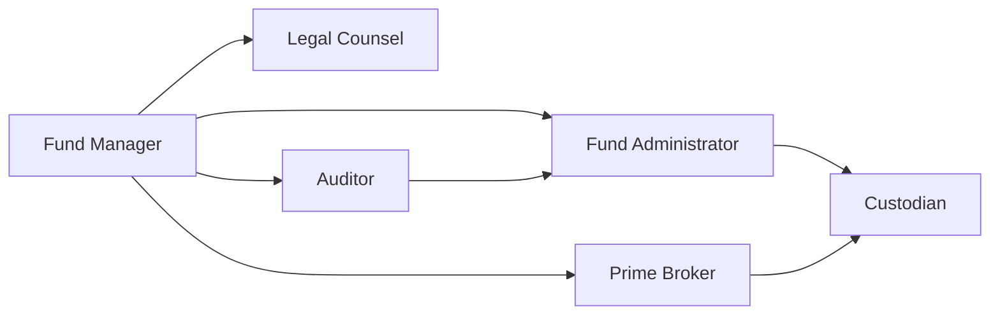

## 15.7 Operational Due Diligence (Prime Brokers, Service Providers)

Anyone who has ever embarked on building or investing in a hedge fund or alternative mutual fund knows—okay, maybe not everyone, but certainly the folks who’ve gone through it—that operations can make or break your strategy. You might have the greatest trading plan in the world, but an operational slip-up can send them all crashing down. Let’s explore the fundamental concept of operational due diligence (ODD) in the world of alternative products like hedge funds, closed-end funds, and alternative mutual funds, focusing on prime brokers and service providers.

Operational due diligence means you’re looking under the hood: you’re examining all the nuts and bolts, from who clears your trades to who calculates your net asset value (NAV). It’s that classic detective work that helps you avoid fiascos—things we want to avoid like margin call confusion or compliance fiascos. It’s not always glamorous, but trust me, it’s essential. 

Below, we’ll walk through the big ideas behind evaluating prime brokers and service providers, share some personal stories, offer a few real-world examples, and lay out best practices. Let’s hop in.

## Why Operational Due Diligence Matters

Imagine you’re a portfolio manager running an alternative mutual fund focusing on Canadian resource equities. You’ve lined up a **fantastic** strategy you’re absolutely excited about—maybe you’re going long on certain energy stocks in Alberta while shorting a few overvalued resource companies worldwide. You even have solid risk management procedures on paper. But then, behind the scenes, your fund administrator miscalculates your NAV two days in a row, or your prime broker struggles to reconcile your short positions. Clients get spooked, word of mouth travels, and suddenly, the marketing folks tell you that new subscriptions have slowed to a trickle.

Let’s not sugarcoat it: errors in operations can have a major impact on performance, credibility, and client trust, especially in alternative funds. The more complex your trading strategies, the more you lean on specialized services and the more carefully you must vet them.  

## The Role of Prime Brokers

**Prime brokers** provide a range of services to hedge funds and alternative funds, such as:

- Margin financing and leverage.  
- Securities lending for short selling.  
- Trade clearing and settlement.  
- Custody of securities (sometimes separate custody is involved).  
- Access to sophisticated trading technology.

In Canada, many prime brokerage services are offered by large banks or specialized brokerage houses. A prime broker may be crucial for your fund’s daily operations, especially if you’re an active trader dabbling in derivatives—like stock index futures or options listed right here in Canada on the Bourse de Montréal.

### Due Diligence on Prime Brokers

When evaluating a prime broker, you want to check out at least:

- **Creditworthiness**: Is your prime broker stable financially? How’s their credit rating?  
- **Technological Capabilities**: Does the broker’s platform integrate seamlessly with your own systems? Do they automate margin calculations effectively?  
- **Risk Management**: Do they have robust internal controls? Is there a well-defined margin call process?  
- **Depth of Relationship**: Are you relying too heavily on this prime broker alone? If they go south or limit your financing, can your entire operation pivot easily?

The concentration risk of relying on one prime broker is no joke. Some funds cultivate relationships with multiple prime brokers to ensure one glitch or credit problem doesn’t bring operations to a halt. Over the years, I’ve seen a few managers pick a single prime broker purely based on brand reputation—like “Oh, they’re recognized internationally, that’s enough.” But you know, it’s not always enough. If that big broker experiences back-office turmoil or changes margin requirements abruptly, your trades can be disrupted.

## Evaluation of Service Providers

Just as you wouldn’t want to drive a car without seatbelts, you probably don’t want to run an alternative mutual fund or hedge fund without reliable service providers. Let’s look at the main ones:

### Administrators

**Fund administrators** handle everything from bookkeeping your trades to reconciling your accounts, preparing financial statements, and computing the daily or periodic NAV. Their reliability directly affects how precisely your fund’s returns are reported. CIRO (historically IIROC/MFDA, now consolidated—just letting you know the backstory) requires robust accounting and administrative controls to protect investors.  

A top-tier administrator can signal credibility, because seasoned investors generally feel more comfortable knowing a respected third party is verifying your numbers. Meanwhile, a smaller or less-experienced administrator may cultivate cost savings but can create hidden risks (like data mishandling, inaccurate NAV calculation, or limited staffing).

### Custodians

A **custodian** is a financial institution that holds securities in safekeeping, ensuring they’re segregated from the fund manager’s assets. Custodians help reduce counterparty risk by keeping your fund’s assets out of the manager’s back pocket. If you’re an investor, you might sleep better at night knowing your fund’s assets are entrusted to, say, a major Canadian bank or well-known global custodian.

### Auditors

Auditors verify your fund’s financials. They check whether your track record is fairly presented and whether your valuation policies comply with the local and global standards. Selecting a reputable auditing firm is paramount since unqualified audit opinions from top-tier auditors definitely reassure potential investors. 

But let’s be frank: if you’re a micro hedge fund looking to keep costs lean, you might be tempted to use a small audit shop. There’s no shame in that, as long as they’re recognized for competence and thorough adherence to standards. However, top institutional clients typically prefer to see a well-known accounting firm with a recognized name on the statements.

### Legal Counsel

Lawyers ensure compliance with local regulations (e.g., those from CIRO and the CSA) as well as any cross-border rules if you’re raising money from outside Canada. They draft offering memoranda (in the hedge fund context) or prospectuses (for alternative mutual funds and closed-end funds). Ongoing compliance with local securities regulations—like ensuring all marketing materials meet Canadian guidelines—requires up-to-date legal advice.  

If you’re dealing with complex derivatives or cross-border strategies, counsel can also help interpret how certain trades are governed in different jurisdictions. This is an area that can get thorny fast if you’re not careful.

## Operational Reputation and Managing Risk

One misstep in operations—like a failed trade settlement or a margin call you didn’t process in time—can lead to damaging headlines in the worst-case scenario or at least some stern phone calls from your prime broker. In alternative investments, the margin for error can be razor-thin. Maintaining investor confidence hinges on solid internal controls, routine audits, and robust compliance systems.

### Internal Controls and Compliance Systems

Things like who has sign-off authority, how daily reconciliations are performed, and how quickly you alert your prime broker if something is amiss all define your operational resilience. **Good internal controls** help detect errors fast. **Strong compliance systems** ensure that any new derivative product or short-selling arrangement meets your stated guidelines and the relevant regulations.

### Business Continuity Plans

We can’t talk about ODD without mentioning **business continuity plans (BCPs)**. If an ice storm shuts down your main office in Toronto, how quickly can you shift operations to a backup site or go fully remote? CIRO sets forth requirements around business continuity planning for its member firms. They want to make sure clients’ needs can be met, trades can be processed (especially during high-volatility events), and that no client assets are put at undue risk just because your building’s power is out. 

A strong BCP might detail:  
- Communication channels with prime brokers if main telephony is offline.  
- Data backup protocols, including cybersecurity measures.  
- Staff rotation for crisis management.  

I remember in one fund I worked with, we did a thorough BCP test every six months or so. We once discovered our backup data lines didn’t have enough bandwidth for busy market days. That’s the kind of oversight that can cost you if a real crisis hits.

### Cybersecurity

Cyber threats can range from phishing emails to sophisticated hacking attempts on your fund’s data. Alternative funds are especially juicy targets, with large sums of money passing through digital pipelines every day. A well-developed cybersecurity framework—covering strong authentication, ongoing threat monitoring, and staff training—helps keep your business running smoothly and protects sensitive client information.

## Operational Due Diligence in Action

Sometimes, the best way to illustrate ODD is to share a story. A couple of years ago, a mid-sized Canadian hedge fund had a meltdown because their main prime broker updated margin terms with almost no warning. The fund had to scramble to meet margin calls, and their second prime broker wasn’t prepared to pick up the slack. The hedge fund lost the confidence of a large pension investor, who pulled out capital the next quarter. It was messy. In hindsight, had the fund performed thorough due diligence, they might have recognized that this particular prime broker was known for abrupt policy changes. Or, at the very least, the fund might have had a second prime broker on standby with a workable credit line.

## ODD Flow and Stakeholder Interactions

Let’s visualize how all these players connect. Here’s a Mermaid diagram that outlines a simplified operational framework for a hedge fund or alternative mutual fund:

- The Fund Manager interacts directly with the Prime Broker for leverage and clearing, the Administrator for NAV calculation, and Legal Counsel for regulatory compliance.  
- The Administrator works with the Custodian to reconcile assets, ensuring they are securely held.  
- The Auditor checks the Fund Manager’s records, which in turn reference the Administrator’s calculations and the Custodian’s asset confirmations.  
- The Prime Broker and Custodian also communicate, particularly when lending or settling trades.  

All these relationships must be carefully tested and monitored under your operational due diligence process.

## Common Pitfalls in Operational Due Diligence

- **Overreliance on a Single Service Provider**: If your prime broker, administrator, or custodian is your one-stop shop, you’re exposed if something goes wrong there.  
- **Neglecting Technology Checks**: Outdated or poorly integrated trading and reconciliation systems can cause big reporting errors or (worse) compliance breaches.  
- **Weak Regulatory Knowledge**: Ignoring the CIRO or CSA guidelines for business continuity or recordkeeping can lead to penalty, reputational damage, or forced closures.  
- **Lax Cybersecurity**: Even top-tier funds have fallen victim to data leaks.  
- **Insufficient Ongoing Review**: ODD isn’t a one-off. You have to keep checking your prime broker’s status, your administrator’s updated software, your BCP’s viability—over and over.

## Glossary

**Concentration Risk**: The risk you’re taking by relying heavily on one counterparty, asset class, or strategy—exposing yourself to potential failure if that counterparty or strategy falters.

**Fund Administrator**: An organization that performs day-to-day tasks such as trade booking, cash and securities reconciliation, and calculations of net asset value.

**Custodian**: A financial institution holding the fund’s securities in safekeeping, ensuring they remain segregated from the fund manager’s personal or corporate assets.

**Business Continuity Plan (BCP)**: A set of procedures designed to ensure critical business functions can continue during an emergency or unexpected event—like natural disasters, power outages, or cyberattacks.

## Practical Best Practices

- **Maintain Multiple Prime Broker Relationships**: Distribute trades or maintain a backup so you’re not left in the lurch.  
- **Select a Recognized Administrator and Auditors**: Investors want to see known names.  
- **Perform Ongoing Background Checks**: Revisit your prime broker’s credit rating or your administrator’s operational performance at least annually.  
- **Regularly Test BCP**: Make sure all staff understand how to “go remote” or “switch sites” if something goes down.  
- **Bolster Cyber Defenses**: Provide training for employees, use two-factor authentication, and schedule routine penetration testing.  
- **Stay Aligned with CIRO & CSA Guidance**: They offer official guidelines and might even post best-practice bulletins. Keep an eye on these resources online:  
  - [CIRO](https://www.ciro.ca/) – Requirements for business continuity planning  
  - [CSA](https://www.securities-administrators.ca/) – Guidance on operational risk and outsourcing  

## Additional Resources

• **“Investment Management Regulation” by Tamar Frankel and Clifford E. Kirsch**  
  This book delves into the legal and operational structures that govern investment management. Helpful if you want a deeper look into regulatory issues around fund structures.

• **Article: “What Investors Need to Know About Operational Due Diligence” by the CAIA Association**  
  [CAIA Association](https://caia.org/) is a global authority on alternative investments. Their article on ODD covers key checkpoints from the investor’s perspective.

• **Online Courses**  
  Some Canadian universities and global providers (like Coursera or edX) offer specialized courses in risk management, operational analytics, and compliance. It’s worth exploring if your team needs formal training.

• **Professional Associations**  
  Groups like the CFA Institute or the CAIA Association often publish best practices and host webinars on ODD. Local societies in major cities (Toronto, Montreal, Vancouver) frequently hold events or workshops about new trends in operational risk.

## Conclusion

Operational due diligence isn’t some stuffy chore relegated to the back-office folks—but rather it’s the backbone that gives your strategy credibility. If your operations are tidy, you can navigate margins, short selling, or even complex derivative overlays with confidence. If they aren’t, well, it won’t matter how spectacular your trades are on paper—you’ll be too busy playing damage control.

The prime broker, service providers, administrators, auditors, and the entire ecosystem of operations are the unsung heroes of a successful hedge fund, alternative mutual fund, or closed-end fund. By performing robust ODD—checking creditworthiness, verifying technology, establishing strong internal controls, and focusing on compliance—you give your investors peace of mind and prepare your fund for sustainable growth. 

Hope this was helpful. If you find yourself knee-deep in a prime broker meltdown or curious about complex legal footnotes around custodial relationships, don’t hesitate to circle back to this section or the resources linked. Remember: A strong operational foundation is half the battle in alternative investments, maybe more.

---

## Sample Exam Questions: Operational Due Diligence in Alternative Funds



### Which of the following is a primary service offered by prime brokers to hedge funds?

- [ ] Mutual fund distribution services
- [x] Securities lending and trade clearing
- [ ] Regulatory capital certification
- [ ] Retail investor marketing

> **Explanation:** Prime brokers typically assist hedge funds with margin lending, securities lending for short selling, and clearing services for trades. They’re less involved in retail marketing or capital certification.

### One major reason a hedge fund might maintain relationships with multiple prime brokers is to mitigate:

- [ ] Tax obligations
- [x] Concentration risk
- [ ] Dividend distribution
- [ ] Investor redemptions

> **Explanation:** Spreading operations among various prime brokers reduces concentration risk (the fund’s overreliance on a single service provider).

### The key responsibility of a custodian is:

- [x] Holding a fund’s securities in safekeeping
- [ ] Creating an investment strategy
- [ ] Executing trades on behalf of investors
- [ ] Calculating the fund’s NAV

> **Explanation:** A custodian is primarily responsible for the safekeeping and segregation of assets. Administrators typically calculate NAV.

### Which of the following best describes concentration risk?

- [ ] Risk of a central bank raising interest rates
- [x] Risk of over-reliance on a single counterparty or strategy
- [ ] Risk from holding multiple asset classes in a portfolio
- [ ] Risk due to currency fluctuations

> **Explanation:** Concentration risk arises when a fund depends too heavily on one provider or invests predominantly in a single asset or strategy, potentially amplifying damage if that provider or strategy fails.

### Why is an independent fund administrator generally preferred?

- [x] Ensures accurate valuations and independence from the fund manager
- [ ] Eliminates the need for annual audits
- [x] Helps maintain investor confidence through third-party oversight
- [ ] Replaces the need for a prime broker entirely

> **Explanation:** Third-party administrators improve transparency and investor confidence by providing arms-length oversight of valuations. However, they do not replace other roles like prime broker or auditor.

### In terms of operational due diligence, what does a business continuity plan (BCP) typically address?

- [ ] Investment strategy creation
- [x] Procedures for keeping operations running during emergencies 
- [ ] Dividend distribution policies
- [ ] Mergers and acquisitions

> **Explanation:** A BCP ensures the fund can operate under adverse conditions such as natural disasters or technology failures, with minimal disruption to essential business processes.

### Why might a hedge fund choose a top-tier audit firm?

- [ ] To reduce management fees
- [x] To enhance investor confidence through reputable financial verification
- [x] To ensure compliance with recognized accounting standards
- [ ] To bypass CIRO’s regulations

> **Explanation:** Choosing a recognizable audit firm can provide credibility, showing that the fund’s financials have been thoroughly and independently verified to recognized standards.

### Which of the following is an example of a specific operational mishap?

- [x] Inaccurate cash reconciliation leading to incorrect NAV
- [ ] Achieving higher than expected alpha returns
- [ ] Hiring an abundance of new portfolio managers
- [ ] Transitioning from a long-only strategy to a market-neutral one

> **Explanation:** Operational mishaps typically manifest as errors in reconciliation, valuation, compliance, or recordkeeping. Inaccurate reconciliation is a classic example.

### Which entity normally ensures day-to-day accounting and NAV calculation for a hedge fund?

- [x] Fund administrator
- [ ] Auditor
- [ ] Legal counsel
- [ ] CIRO

> **Explanation:** The fund administrator is responsible for daily accounting tasks such as NAV calculation, trade reconciliations, and sometimes investor reporting.

### True or False: A BCP should only focus on IT infrastructure and not on staffing considerations.

- [x] False
- [ ] True

> **Explanation:** A robust BCP includes technology backup protocols and ensures critical staff roles can be filled during emergencies, along with clear communication channels.


