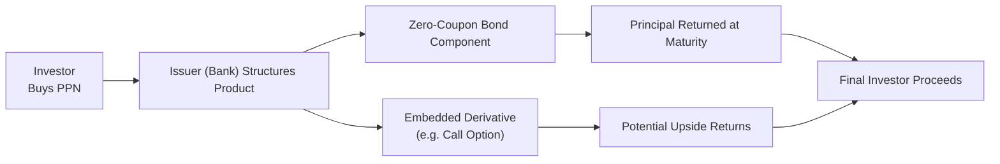

## 16.1 Principal-Protected Notes (PPNs) – What Are They?

Have you ever felt torn between investing in something that might grow your savings and being nervous about losing your hard-earned money in the process? Well, you’re not alone. A lot of us want some of the upside of markets without as much downside risk, which can feel impossible. But let me share a story: I remember chatting with a friend who was extremely anxious about leaving her savings in a place where it might drop with the next market dip. And yet, she wanted more growth than what her savings account offered. Our conversation (over a cup of coffee, of course) seemed to revolve around this idea: “Is there a product that will protect my principal while still letting me benefit if markets go up?” That’s precisely where Principal-Protected Notes (PPNs) come in.

PPNs are structured products that aim to shield your initial capital (the money you put in) while giving you a shot at earning returns that are tied to an underlying asset—like an equity index, a basket of commodities, or even a foreign currency. The hallmark of a PPN is that you get (at least in theory) a guarantee of getting your original investment back on maturity, assuming the issuer doesn’t default. So let’s clarify how these instruments work, why folks buy them, what their drawbacks might be, and how they’re regulated in Canada and beyond.

  
### The Basics: What Exactly Is a PPN?

A PPN is something like a hybrid between a bond and an option. Often, a financial institution (like one of the “Big Five” Canadian banks) will structure a note so that the investor’s principal—let’s say $1,000—is used in two main ways:

• A large portion is allocated to a zero-coupon bond. This bond is designed to grow to $1,000 at maturity, covering your original investment.  
• The remaining portion goes into one or more embedded derivatives, often call options, which attempt to give you upside exposure to a certain market or index.  

At maturity, that zero-coupon bond pays out $1,000 (in a perfect scenario), while the derivative(s) may or may not pay out gains. If they do, you get an extra return. If not, you simply get your principal back. That’s the gist of it. Because of this structure, PPNs attract folks who want downside protection but are still crossing their fingers for some potential growth.

  
### Structuring the Principal Protection

Imagine you’re constructing a PPN. You first figure out how much money must be allocated to a zero-coupon bond so it can be worth your original principal at maturity. For instance, if you have $1,000 to invest, and the zero-coupon bond is priced at $800 (assuming a certain yield curve environment and maturity date), you’d buy the bond for $800. By the time the note matures, that bond will pay out $1,000—covering the principal. That leftover $200 can be used to buy the derivative component.

So where does the money for “guaranteeing” the principal come from? Largely from the fact that the zero-coupon bond grows to par value (the principal), so that even if everything else fails or the markets tumble, the bond redemption ideally makes you whole. However, this entire promise hinges on the creditworthiness of the issuer. If the bank or issuer defaults, that “protection” might vanish into thin air.

  
### The Embedded Derivative

The other chunk of the money is put into a derivative, often a call option or a series of call options. Here’s how it might work:

1. The derivative payoff is often tied to an index—like the S&P/TSX Composite—or maybe a basket of commodities, or a foreign currency exchange rate.  
2. If that asset or index rises in value, the embedded options might produce a payoff that you, as the PPN holder, receive at maturity.  
3. If the asset or index doesn’t rise (or even falls), the embedded derivative might expire worthless. In that scenario, you wouldn’t lose your principal but also wouldn’t get any upside.

Sometimes there’s a “participation rate.” For example, you might only get 80% of the gains in the underlying. Why only 80%? Because the issuer needs to recoup the cost of the options and hedge their own risk. They’re not in the business of giving away free money, after all.

  
### No Upfront Fee—But No Free Lunch

You might hear that you don’t pay any fees to buy a PPN. That’s partially true on the surface. You typically don’t cut a separate check for a commission or management fee. Instead, fees are baked into the product’s design—like the discount the bank applies when assembling the zero-coupon bond plus the cost of the derivatives and the profit margin they require. Ultimately, you may notice that your participation rate or potential payoff is somewhat less than if you had just allocated funds directly into call options or the underlying market. There are trade-offs, but for many conservative or moderate investors, the comfort of principal protection can be a huge selling point.

  
### Typical Maturities

The time horizon for PPNs is usually several years, ranging from two or three years all the way to 10+ years. The longer the product’s term, the cheaper a zero-coupon bond can be (in theory), because discounting a future $1,000 over 10 years can significantly reduce its cost today—leaving more money for potential market exposure. On the flip side, the longer you lock up your capital, the more you rely on the issuer not defaulting over that time.

  
### Issuer Credit Risk: The Elephant in the Room

Now, it’s important to highlight that your principal protection is not bulletproof if the issuer faces insolvency. The “guarantee” in a PPN is just that the issuer is on the hook for returning your full principal at maturity—provided they can actually pay it. Always check the credit ratings of the institution issuing the PPN. If the issuer is a well-capitalized Canadian bank with high credit ratings, your risk might be judged as relatively low. But it isn’t zero.

  
### When PPNs Might Be a Fit

PPNs are often marketed to risk-averse investors who aren’t comfortable with direct equity or commodity investing, but still want more potential return than a regular GIC (Guaranteed Investment Certificate) might offer. The big allure is that you don’t need a lot of capital to get started, and you know in a worst-case scenario (apart from issuer default), you’ll get your principal back at maturity. If you were exploring simpler ways to invest in equities or commodities, you could open a brokerage account and buy shares or exchange-traded funds (ETFs). But that direct route can expose you to market swings. PPNs help offset this risk with principal protection.

  
### Potential Drawbacks

• Liquidity: Many PPNs don’t trade actively in a secondary market, so if you need your money before maturity, you may have trouble selling—or you could be forced to sell at a discount.  
• Opportunity Cost: Because you’re ensuring your principal, you might accept a lower return potential compared to investing directly in the market.  
• Complexity: PPNs can be loaded with complicated rules. The payoff formula might involve caps, participation rates, or performance averaging. This complexity can lead to confusion or unrealistic performance expectations.  
• Credit Risk: As mentioned, if the issuer can’t pay, your principal protection is compromised.

  
### A Simple Example

Let’s use numbers to drive the concept home. Suppose you have $10,000 to invest and purchase a 5-year PPN tied to an equity index. The bank calculates that it costs $8,500 today to buy a zero-coupon bond that will mature at $10,000 in five years. That leaves $1,500 to fund the derivative portion. If this derivative goes up with the market, you might earn an extra, say, $2,000 at maturity, so you’d get $12,000 total. If the market doesn’t move or moves down, you’d get only $10,000 (your principal). In either case, your original $10,000 is “protected,” again assuming the issuer meets its obligations.

  
### A Mermaid Diagram of a PPN

Below is a simplified illustration of this structure:

• The investor purchases the PPN from the issuer.  
• The issuer allocates a portion of funds to a zero-coupon bond and some to an embedded derivative.  
• At maturity, the zero-coupon bond aims to ensure principal is returned, whereas the embedded derivative provides potential upside.  
• The sum of both is what you, as the investor, end up with when the note matures.

  
### Glossary Highlights

• Principal Protection: A mechanism guaranteeing that the face amount of your investment (e.g., $1,000) is returned at maturity—subject to the issuer’s solvency.  
• Zero-Coupon Bond: A bond purchased at a discount from par (face) value. It grows to its full value at maturity, generating an implicit interest return without periodic coupon payments.  
• Embedded Derivative: A derivative, such as a call option, that is packaged within the structure of the PPN to provide upside exposure to a market.  
• Issuer Credit Risk: The chance that the issuing bank may default and fail to return principal or pay any additional gains.  
• Underlying Asset: The index or market whose performance drives the PPN’s upside potential.  
• Structured Product: A financial arrangement that combines fixed-income securities (bonds, often zero-coupon) and derivatives (options or swaps) to achieve a desired payoff profile.  
• Payoff: The amount you receive at maturity, determined by a blend of your principal protection and gains (if any) from the derivative.  
• Participation Rate: The percentage of the underlying asset’s gains that you capture through the PPN’s embedded option. For instance, a note might give you 70% of the upside of an index above some threshold.

  
### Regulatory Landscape in Canada

If you’re investing in Canada, you’ll hear about CIRO (Canadian Investment Regulatory Organization). CIRO has the mandate to regulate investment dealers, mutual fund dealers, and oversee marketplace integrity. While PPNs might also fall under other frameworks (like structured product regulations enforced by the Canadian Securities Administrators, or CSA), always ensure your dealer or advisor is in good standing with CIRO to verify they comply with robust rules for investor protection.

Here are some sources you might tap for official guidance:

• [CIRO](https://www.ciro.ca) – The national self-regulatory organization in Canada.  
• [CSA (Canadian Securities Administrators)](https://csa-acvm.ca) – Coordinates and harmonizes securities regulation across Canadian jurisdictions.  
• [Bank of Canada](https://www.bankofcanada.ca) – Monitors monetary policy, which can indirectly affect interest rates, bond prices, and PPN structures.  
• CSA Staff Notices on structured product disclosure – They issue guidelines to ensure transparency regarding fees, risks, and payoff structures.

  
### Beyond the Basics: Additional Tools and Future Exploration

If you’re a number-cruncher, or you love the idea of simulating or modeling how a PPN might behave under different market conditions, you can explore open-source financial libraries. For instance:

• QuantLib: An open-source library in C++ (with Python wrappers available) frequently used for modeling derivatives and building custom payoff profiles.  
• R’s “derivmkts” Package: For those who use the R language, “derivmkts” provides functions to handle derivative pricing, scenario analyses, and risk metrics.

These tools can help you run “what-if” scenarios. For example, if the market rises 5% yearly and interest rates remain stable, you can estimate how much your PPN might pay out. If your embedded derivative exposure is more complicated—like a spread, a collar, or a basket of multiple underlyings—these libraries can help you crunch the math behind the scenes.

  
### Real-World Mini Case Study

Let’s suppose Scotia Bank issues a 7-year PPN tied to global equity indexes, specifically the MSCI World Index. The note says:

• Principal is 100% protected at maturity (7 years from issuance).  
• Participation rate is 70%—that means if the MSCI World goes up by 50% over those 7 years, your payoff portion is 70% of 50% = 35%.  
• Maturity date is set, and you cannot redeem early at par. The issuer might offer some liquidity, but it’s not guaranteed.

If, at maturity, the MSCI World is up by 50% (from the note’s base level), you get 35% above your original $1,000, so $1,350 total. If the MSCI World is flat or down, you get $1,000. Meanwhile, if Scotia Bank’s credit rating remains stable, you have minimal credit concerns. But if something catastrophic happens to the bank’s solvency, that principal “guarantee” might get shaky.

  
### The Role of Interest Rates

An interesting aspect is how interest rates feed into PPN pricing. Zero-coupon bond prices are sensitive to prevailing interest rates. When interest rates are higher, the cost of buying a zero-coupon bond is typically lower. That means more leftover capital can be allocated to embedded derivatives, potentially increasing the note’s upside. Conversely, in a low-interest-rate environment, a larger chunk of your money might be eaten up by the zero-coupon bond cost, leaving less for derivatives and shrinking the potential upside.

Since Canada’s interest rates (and broader monetary policy) are heavily influenced by the Bank of Canada, changes in monetary policy can have a ripple effect on PPN structures. A rising rate environment might lead to improved or “juicier” participation rates—though the underlying markets might or might not behave advantageously.

  
### Common Pitfalls and Best Practices

• Not Checking Credit Risk: Always confirm the issuer’s creditworthiness. PPNs are only as secure as the institution behind them.  
• Misunderstanding Payoff Formulas: Some notes cap the maximum return or apply complicated averaging. Read the fine print.  
• Overlooking Liquidity: You might think you can dump the note whenever you want. However, many PPNs have minimal secondary markets. Assume you’ll hold it to maturity.  
• Failing to Compare to Other Products: Is there a simpler combination of individual bonds and call options that might serve your needs? Sometimes constructing a “DIY PPN” might be cheaper if you’re comfortable with the complexity.  
• Overpaying for “Peace of Mind”: PPNs can be expensive in terms of opportunity cost. Check if a lower-fee structured approach can meet your risk tolerance.

  
### Practical Tips for Analyzing a PPN

1. Check Maturity: Make sure you’re comfortable locking your money up for that length of time.  
2. Examine the Participation Rate: The higher, the better. But ensure you understand how they calculate it.  
3. Look for Caps or Barriers: Is there a maximum gain? Do certain performance thresholds limit your payout?  
4. Verify Fees: They might be embedded, but try to identify any dealer or structuring fees that effectively reduce your upside.  
5. Assess Credit Quality: The best structure in the world doesn’t matter if the issuer can’t pay.

  
### References and Further Reading

• John C. Hull, “Options, Futures, and Other Derivatives” – A comprehensive text that delves into the math and theory behind derivatives, including structured products.  
• [CIRO Website (ciro.ca)](https://www.ciro.ca) – For regulatory updates, guidance, and investor-protection information.  
• [CSA (csa-acvm.ca)](https://csa-acvm.ca) – Oversees securities regulations across Canada, including structured product disclosures.  
• [Bank of Canada (bankofcanada.ca)](https://www.bankofcanada.ca) – Provides insight into interest rates, economic forecasts, and monetary policy.  
• CSA Staff Notices – Offer clarity about how structured products must be disclosed, ensuring transparency for investors.  
• QuantLib, R’s “derivmkts” – Open-source libraries to simulate structured product payoffs and run scenario analyses.

  
### Conclusion

Principal-Protected Notes can sound almost too good to be true: you get all or part of the original principal back plus a shot at upside. But remember, as with all financial products, there’s no free ride. The cost of protection is inherently baked in, and you still face potential pitfalls—like credit risk, limited upside, or illiquidity. Nonetheless, PPNs can make sense for conservative-minded investors who want equity or commodity exposure but can’t stomach the risk of losing their principal outright.

If you’re considering a PPN, read the fine print, ask your advisor questions, and always keep an eye on the issuer’s credit rating. A bit of healthy skepticism goes a long way. And sure, while there’s no perfect investment that does everything for everyone, PPNs can serve as a middle-of-the-road approach, helping you sleep at night while staying in the game for some potential market gains.

  

## Sample Exam Questions: Principal-Protected Notes (PPNs) Fundamentals



### Which component in a Principal-Protected Note (PPN) ensures the return of the investor’s capital at maturity?

- [ ] A floating-rate bond
- [ ] A dividend-paying bond
- [x] A zero-coupon bond
- [ ] A callable bond

> **Explanation:** A zero-coupon bond is purchased at a discount and redeems at par value at maturity, providing the capital protection feature.

### What is the main credit-related risk an investor faces when purchasing a PPN?

- [ ] The risk of default by the clearing corporation
- [x] The risk that the issuer may default on its obligations
- [ ] The risk that the underlying asset pays no dividends
- [ ] The risk of sudden interest rate hikes

> **Explanation:** PPNs rely on the financial solvency of the issuer, meaning if the issuer defaults, the principal protection is jeopardized.

### In a PPN, what is the function of the embedded derivative?

- [ ] It reimburses transaction costs
- [x] It provides potential upside based on the performance of the underlying asset
- [ ] It subsidizes the purchase of more zero-coupon bonds
- [ ] It directly pays annual coupons

> **Explanation:** The embedded derivative (often a call option) is what allows the PPN to capture gains tied to an underlying asset or index.

### Why might a participation rate in a PPN be set below 100%?

- [x] To account for the cost of the embedded derivative and the issuer’s profit margin
- [ ] To protect investors from excessive volatility in the underlying asset
- [ ] Because the bond portion matures faster
- [ ] Because regulators require a lower rate for all structured products

> **Explanation:** A portion of the investor’s funds is allocated to the zero-coupon bond and fees, so the leftover amount spent on derivatives often supports only a partial capture of the underlying’s gains.

### Which regulatory authority in Canada currently oversees investment dealers offering PPNs to the public?

- [ ] The defunct Investment Industry Regulatory Organization of Canada (IIROC)
- [x] The Canadian Investment Regulatory Organization (CIRO)
- [ ] The Office of the Superintendent of Financial Institutions (OSFI)
- [ ] The Ontario Securities Commission (OSC) exclusively

> **Explanation:** Following the amalgamation of IIROC and the MFDA, CIRO is the self-regulatory body responsible for overseeing registered investment dealers and mutual fund dealers on a national level.

### If interest rates rise significantly during the life of a PPN, what effect might this have on the cost of buying a similarly structured PPN in the future?

- [x] The zero-coupon bond component might become cheaper
- [ ] The zero-coupon bond component will automatically default
- [ ] The embedded derivative will always expire worthless
- [ ] There will be no effect on future issuances

> **Explanation:** Higher interest rates can reduce the present value (or cost) of zero-coupon bonds. This can potentially allow future PPN issues to offer more attractive participation rates, because more funds can be allocated to the derivative portion.

### Which of the following best describes the liquidity risk of a typical PPN?

- [ ] PPNs are traded on major exchanges with consistently high volumes
- [ ] PPNs have zero default risk and thus are highly liquid
- [ ] PPNs can be redeemed daily at net asset value, like a mutual fund
- [x] PPNs often have limited secondary markets, making early redemption difficult

> **Explanation:** Many PPNs do not trade much on secondary markets. Investors are often advised to hold them until maturity or face potentially steep discounts if they try to sell early.

### What might be a disadvantage of having a cap on returns for a PPN?

- [ ] It reduces the issuer’s credit risk
- [x] It limits the maximum gains an investor can earn
- [ ] It eliminates any zero-coupon bond portion
- [ ] It shortens the maturity date unnecessarily

> **Explanation:** If a PPN has a cap on returns, investors cannot earn beyond that specified threshold, limiting the overall payoff potential.

### Which scenario would most likely allow the derivative component of a PPN to produce a substantial payoff?

- [x] The underlying asset or index experiences a strong upward performance
- [ ] The zero-coupon bond defaults
- [ ] The investor decides to sell the PPN before maturity
- [ ] The PPN is pegged to a market that remains flat

> **Explanation:** The embedded derivative is generally a call option or a suite of call options, which typically benefit if the underlying asset’s value rises significantly.

### True or False: Investors pay no fees for investing in Principal-Protected Notes.

- [x] True
- [ ] False

> **Explanation:** Many investors perceive PPNs as carrying “no fees,” but the reality is that costs and fees are embedded within the product structure—reflected in factors such as the participation rate or the final payoff. While there may not be a direct fee line item, fees are very much present and incorporated into the product’s pricing.


