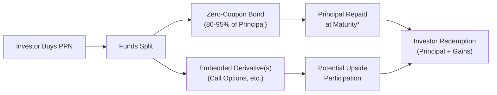

## 16.2 PPN Structures and the Use of Derivatives

Have you ever come across a financial product that promises the security of your original investment while still offering upside potential if the stock market, a commodity market, or a combination of markets climb higher? Principal-Protected Notes (PPNs) are exactly that sort of product. And, believe me, the first time I heard about PPNs, I thought it sounded almost too good to be true: “Wait, so my principal is safe, but I can still benefit if the market goes up?” It's an appealing pitch. The key to making this work, though, is a clever blend of bonds and derivatives. Let’s explore just how a PPN structure is put together, why derivatives are involved, and how these derivatives shape the potential rewards (and limitations) of this unique investment.

## Introduction

A Principal-Protected Note usually promises that you’ll get back at least the amount you invested (the “principal”) if you hold it to maturity, assuming there's no credit default by the issuer. At the same time, there may be a chance to participate—at least partially—in the growth of an underlying index, a basket of stocks, a commodity, or even something more exotic like a strategy index. It feels like a safety net combined with an opportunity to catch some upside.

But how do we secure that upside while still guaranteeing principal? The answer is derivatives—particularly options. You might wonder, “Why not just buy half stocks and half bonds, or some other mix?” Technically, you could do that, but you’d bear some risk of principal loss if the stocks went down. In a PPN, the issuer invests most of the money in a zero-coupon bond that grows to face value over the life of the note. The rest is used to buy derivatives that provide exposure to the chosen underlying asset. If everything goes smoothly, these embedded derivatives pay off, and you get yields that are higher than just the bond portion alone. If the markets tank, the derivatives expire worthless, but you still have the bond portion that returns your principal at maturity (credit risk aside).

## Basic PPN Structure

A typical PPN uses a “bond-plus-option” layout. Let’s break it down:  
• A majority (often 80–95%) of your purchase price is allocated to a zero-coupon bond. Since zero-coupon bonds are purchased at a discount and grow back to par at maturity, their redemption amount provides most or all of the principal repayment amount.  
• The remaining percentage goes toward buying one or more call options on the underlying asset(s). These options, if successful, supply the additional payoff. The strike and maturity for these options are selected to match the note’s maturity date; that way, everything settles neatly at once.  

Here’s a simple mermaid flowchart to visualize the structure:

## The Role of Derivatives

Let’s talk about the derivatives portion of the PPN:  
• The “classic” derivative in a PPN is a call option. By purchasing a call, the investor participates in any price appreciation above the strike price.  
• Sometimes, PPNs get more creative. They might use “look-back” options that let you pick the best price over a period. They might use “barrier” features, which affect the payout if the underlying crosses certain thresholds. They might even link up to a basket of multiple underlyings such as indices, currencies, or commodities.  

All these derivatives have one general objective: to amplify the chance for upside while capping how much capital is at risk. 

## Exotic Options in PPNs

I remember I once came across a PPN that used a “look-back” option. It basically looked back over the last three years and said, “We’ll pick the lowest underlying price over that entire time as the strike price for final settlement.” That’s quite advantageous if the underlying’s price soared after hitting a trough. Of course, you can bet that look-back options cost more than plain-vanilla calls. Higher derivative costs can reduce your note’s overall participation rate.

Another product I saw had a “barrier” feature: if the market dipped below a certain barrier, the option deactivated and provided no upside. That might sound harsh, but the cost was cheaper than a regular call, so the potential participation rate (if the barrier never got hit) was higher. These exotic features tailor PPNs to different investor preferences.

## Pricing Factors and Participation Rates

The cost of these derivatives is central to a PPN’s design. Options aren’t free, so if the options are expensive, you can’t buy as much of them with, say, 5–10% of your capital. This typically means a lower “participation rate” in any price appreciation. In other words, you might only get 70% or 80% of the underlying’s gains. Why does derivative pricing fluctuate? Sensitivities include:

• Implied Volatility: A high implied volatility means the market expects big price swings, driving up option premiums.  
• Time to Maturity: Longer-dated options typically cost more due to greater uncertainty.  
• Interest Rates: Higher rates reduce the present value of future option payoffs and can reduce option prices, but they can also affect the bond portion of the structure.  
• Expected Dividends: If you have calls on stocks that pay dividends, the option pricing will adjust for those dividends because the stock price might dip on ex-dividend dates.  

Ultimately, the issuer tries to fine-tune the bond component and the derivative(s) to strike a balance: enough principal set aside to mature safely, plus enough leftover money to buy the derivative exposure you want. 

## Issuer Hedging and Spread

You might be wondering how issuers manage all the risk in these products. After all, if thousands of investors buy these PPNs, the issuer can become exposed to large amounts of market risk. Typically, the issuer hedges themselves in the over-the-counter (OTC) market. For instance, they might offset each embedded call option with an opposite position or use a combination of forward agreements and swaps to manage exposure to interest rates and volatility. 

Because these hedging activities take place on the interbank or OTC markets, the issuer can capture spreads and possibly earn additional profits. This “spread” might be embedded in the cost of the note. It compensates the issuer for structuring, marketing, and hedging the PPN. From the investor’s perspective, it’s part of the cost of having someone else handle all the complexities while guaranteeing principal (less credit risk).

## A Practical Example

Let’s walk through a hypothetical scenario:

Imagine you invest $1,000 in a brand-new PPN with a five-year term. The bank (the issuer) takes $900 of your money and buys a five-year zero-coupon bond. Between now and five years from now, that $900 will grow to about $1,000 (i.e., your principal). The bank uses the remaining $100 to purchase call options on an equity index, let’s say the S&P/TSX 60, with a five-year maturity.  

• If the S&P/TSX 60 rises significantly, that $100 call option position might appreciate substantially. Maybe you end up with a $150 or $200 gain at maturity. So, your final redemption is $1,000 (principal) + $150 to $200 (option payout) = $1,150 to $1,200.  
• If the S&P/TSX 60 goes sideways or declines, the worst case is that your $100 in call options expire worthless. You still recoup your $1,000 principal (again, ignoring the possibility of default by the issuer).  

You can see how the combination has a somewhat asymmetrical payoff.  

## Risk and Regulatory Considerations

PPNs are often viewed as “safe” because of the principal protection vibe, but risk still exists. Let’s be clear:

• Credit Risk: The “protection” hinges on the issuer’s ability to pay at maturity. If your issuing bank were to default, your principal isn’t necessarily protected unless separate insurance or a government guarantee is in place.  
• Liquidity Risk: Many PPNs are not highly liquid. If you want to sell before maturity, the price you get might be less than your initial investment.  
• Opportunity Cost: While you’re holding a PPN, if the markets soar beyond your participation rate, you may regret not having direct exposure.  

From a Canadian regulatory standpoint, the Canadian Securities Administrators (CSA) require robust disclosure for structured products, such as describing fees and the cost of embedded derivatives. These structured products might be offered under a shelf prospectus or an exempt distribution, depending on circumstances. Also, the Canadian Investment Regulatory Organization (CIRO) has guidelines that address the suitability obligations when recommending complex structured products like PPNs to retail clients. Issuers must also comply with National Instrument 44-102 regarding shelf distributions if they launch PPNs repeatedly under certain guidelines.  

## Additional Tools and Resources

If you want to go deeper into the quantitative side of PPNs—maybe you’re a bit of a math or coding enthusiast—consider open-source libraries like QuantLib (quantlib.org). QuantLib provides functions for pricing an array of fixed income instruments, interest rates, exotic options, and more. You can combine methods for pricing zero-coupon bonds and calls, overlay them, and replicate what a PPN might look like under various market assumptions.  

For structured product disclosures and general regulatory guidelines, the CSA website (https://www.securities-administrators.ca) is a good place to start. CIRO, as Canada’s self-regulatory body overseeing investment dealers and marketplaces, provides resources on compliance, margin, and sales practices for these notes (https://www.ciro.ca).  

## Glossary

Call Option  
A contract that gives its owner the right, but not the obligation, to buy an asset at a specified strike price on or before the option’s expiration date. In PPNs, call options form the heart of the “upside potential” mechanism.

Participation Rate  
Refers to the fraction of the underlying’s gains that the PPN will pay out upon maturity. For example, if your PPN has an 80% participation rate and the index gains 50%, you might see a final total return of 0.8 × 50% = 40% (subject to other terms).

Maturity Matching  
Ensures the zero-coupon bond’s maturity aligns with the expiration date of the embedded derivatives. By matching maturity, the principal can “roll off” at exactly the same time the derivative pays out, keeping the structure simple and cohesive.

Implied Volatility  
The market’s projection of how widely a security’s price might swing. High implied volatility can make options more expensive, leading to lower participation rates in a PPN.

Look-Back Option  
Lets you “look back” at the underlying’s price over a certain period and pick the most advantageous strike (or price). These can boost payoffs in a rising market but come at a higher cost.  

Basket Option  
An option written on a group (or basket) of assets, like a combination of different indices or commodities. This can broaden your exposure but may also affect participation rates if some constituents have higher implied volatilities than others.

Spread (Issuer Spread)  
Represents the potential profit margin the bank or issuer earns by manufacturing and hedging the product. It is implicitly included in the pricing of the PPN.

## Bringing It All Together

A PPN is, at its essence, a zero-coupon bond plus a call option (or several). It aims to let you sleep at night knowing your principal is largely protected (aside from issuer default), while still letting you dream about potential gains from the stock market or other asset classes. Whether you’re a seasoned pro or you’re hearing about PPNs for the first time, the big ideas remain the same: stability from the bond portion, and upside from derivatives. The catch is that the upside might be capped or limited, and you’re always subject to the credit risk of the issuer.  

Now, if you’re considering investing in PPNs, it’s a good idea to ask:  
• “How might my total returns compare to a direct investment in the stock?”  
• “What’s the credit rating of the issuer?”  
• “What is the exact formula for the participation rate or payoff structure?”  
• “Is there a possibility to exit early, and if so, at what cost?”  

By understanding how derivatives power these products, you’ll be better able to evaluate whether PPNs align with your goals and risk tolerance.  

## Sample Exam Questions: PPN Structures and the Use of Derivatives



### PPN pricing dynamics often involve call options on the underlying asset. What is the main purpose of these call options in a PPN structure?
- [ ] To reduce the credit risk of the issuer. 
- [x] To provide upside participation in the underlying market. 
- [ ] To increase bond yields during maturity. 
- [ ] To ensure liquidity if the investor wants to exit early.  

> **Explanation:** In a typical PPN, call options offer the potential for gains if the underlying asset rises in value.  

### Which of the following best describes how a zero-coupon bond functions within a PPN?
- [ ] It provides a perpetual income stream to the investor.  
- [ ] It guarantees all potential gains from the underlying asset.  
- [x] It grows to par at maturity, helping return the investor’s principal.  
- [ ] It automatically offsets the cost of embedded derivatives.  

> **Explanation:** The zero-coupon bond is purchased at a discount and matures to its face value, covering principal repayment (aside from issuer credit risk).  

### Investors in a PPN face credit risk primarily related to:
- [ ] The underlying assets.  
- [ ] Other investors in the market-maker pool.  
- [x] The issuing financial institution defaulting on its obligations.  
- [ ] The call option writer failing to meet margin requirements.  

> **Explanation:** If the issuer defaults, the “principal protection” may be compromised.  

### If implied volatility in the market suddenly increases, the cost of the embedded call option in a PPN generally:
- [ ] Decreases because investors prefer safer assets.  
- [x] Increases because options become more expensive.  
- [ ] Stays the same because bond prices offset option prices.  
- [ ] Increases participation rates for the PPN.  

> **Explanation:** Higher implied volatility leads to higher option premiums, which can reduce the portion of the notional available to buy derivative coverage.  

### Barrier options in PPNs:
- [ ] Provide unlimited participation if the barrier is breached.  
- [ ] Offer a guaranteed fixed rate of return.  
- [x] Can terminate or enhance payoff if the underlying crosses a specific level.  
- [ ] Completely eliminate the issuer’s cost spread.  

> **Explanation:** Barrier options are structured to activate or deactivate once an underlying crosses a predetermined threshold.  

### Which of the following best explains the participation rate in a PPN?
- [x] The proportion of the underlying market’s gains that the investor will receive at maturity.  
- [ ] The portion of the issuer’s profits that pay for hedging activities.  
- [ ] The default probability measure for the issuing bank.  
- [ ] The calculation used to determine the zero-coupon bond price.  

> **Explanation:** Participation rates determine how much of the market’s growth is shared with the investor.  

### Look-back options differ from standard call options because they:
- [ ] Are more liquid than standard calls.  
- [x] Allow the holder to select a favorable strike over a certain observation period.  
- [ ] Always have lower premiums due to lesser flexibility.  
- [ ] Are exclusively available on equity indices.  

> **Explanation:** A look-back option confers the right to retroactively pick the best strike, hence the name “look-back.”  

### When an investor holds a PPN to maturity and the underlying asset has decreased in value:
- [ ] The investor loses their entire principal.  
- [x] The investor typically receives only the original principal (minus any issuer credit event).  
- [ ] The investor keeps the call option for future gains.  
- [ ] The investor must reimburse the issuer for lost call premiums.  

> **Explanation:** The core structure ensures the principal is returned from the zero-coupon bond at maturity, while the embedded option may expire worthless.  

### Which Canadian regulatory body oversees investment dealers and marketplaces, including the sales practices of PPNs?
- [ ] The Mutual Fund Dealers Association (MFDA).  
- [ ] The Investment Industry Regulatory Organization of Canada (IIROC).  
- [x] The Canadian Investment Regulatory Organization (CIRO).  
- [ ] The Canada Pension Plan Investment Board (CPPIB).  

> **Explanation:** MFDA and IIROC no longer exist independently. As of 2023, they have been consolidated into CIRO.  

### True or False: A PPN’s embedded derivative will always outperform direct equity investment in a rising market.
- [x] True
- [ ] False

> **Explanation:** While it might seem that a call option leverages the upside, the actual payoff can be lower than direct equity due to factors like participation rates, the cost of derivatives, and time value.  



Feel free to explore these topics further with resources like the CSA website for structured product disclosures, CIRO’s guidelines for complex product suitability, or open-source libraries (like QuantLib) to model pricing scenarios. By understanding both the bond component and the embedded derivatives, you’ll be well-equipped to evaluate how PPNs might (or might not) fit into your broader investment strategy.
