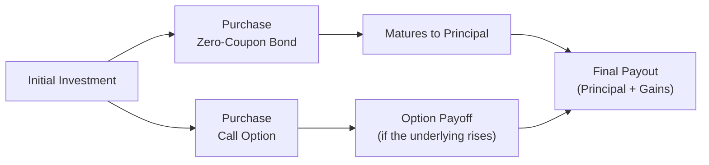
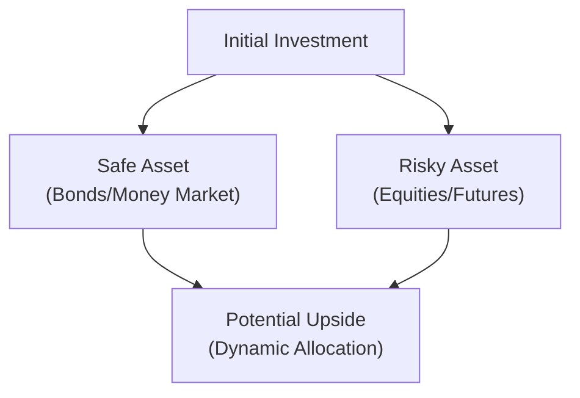

## 16.3 CPPI and Zero-Coupon Bond Plus Call Option Structures – Key Differences

Investors often seek ways to protect their principal while still gaining exposure to potential market upside. Principal-Protected Notes (PPNs) in Canada have historically provided these types of solutions—particularly for individuals who prefer their initial investment to stay intact yet want to maintain some upside potential in equity, commodity, or other asset classes. Two popular methods of constructing PPNs are (1) the “bond-plus-option” approach, and (2) Constant Proportion Portfolio Insurance (CPPI). Although both are designed to help preserve the initial principal, they differ significantly in their mechanics, complexity, and potential outcomes. Below, we’ll break down how each structure works, discuss their advantages and disadvantages, and provide some insight into how they fit within Canadian regulatory frameworks.

**A Small Personal Anecdote:**  
I remember the first time I learned about these structures. A friend of mine was absolutely convinced that financial markets were due for a major upswing, but he also didn’t want to lose a cent of his nest egg if he was wrong. That’s when I introduced him to PPNs—particularly the “bond-plus-option” structure. It was like a lightbulb turned on for him: “So I get the security of a bond and a bit of horsepower from an equity call. Why didn’t I learn about this sooner?” he said. Since then, I’ve found that a deeper dive into PPN methodologies helps many investors demystify these protective-yet-opportunistic products.

---

**Bond-Plus-Option (Zero-Coupon Bond Plus Call) Structures**  
Sometimes also called a “static protection” strategy, this is perhaps the easiest PPN construction method to grasp. Here’s the gist:

• The PPN issuer (often a bank) uses part of the investor’s funds to purchase a zero-coupon bond (ZCB). A zero-coupon bond is issued at a discount but will—in the absence of credit or default risk—accrete back to par (its face value) by maturity. This growth from discount to par is what guarantees the principal portion at the note’s maturity.  
• The remaining portion of the initial investment is used to purchase one or more call options on the underlying asset. The underlying could be an equity index, a basket of stocks, commodities, or even interest rates, depending on the product.  

At maturity, the zero-coupon bond redeems at par, thus restoring an amount roughly equal to the initial capital (assuming no defaults or credit risk events). Any gains from the call option(s) are added on top of this redemption amount, providing the investor’s potential upside.

**Simplified Diagram — Zero-Coupon Bond Plus Call Option:**

The advantage of such a structure is the simplicity: you know your principal remains protected by the bond component, and any upside is delivered via a call option. The disadvantage, though, is somewhat limited upside participation if the option cost is high or if there are constraints such as a “participation rate.” For example, if the call option is expensive due to volatility, the issuer might purchase fewer or more out-of-the-money options, capping the maximum growth potential. This approach is considered “static” because the allocation—once the zero-coupon bond and the calls are purchased—tends not to change throughout the product’s term.

**Pros**  
• Very straightforward concept for many investors.  
• Clearly defined payoff structure: principal plus an option payoff (if any).  
• The zero-coupon bond can be high-quality, reducing credit risk concerns if the issuer is reliable.

**Cons**  
• Upside might be limited by the call option’s strike or the number of contracts purchased.  
• If the underlying asset surges dramatically, a small call allocation might not capture all that upside.  
• The investor is still subject to the issuer’s credit risk (if the note is not backed by government bonds but by the issuing bank).

---

**CPPI (Constant Proportion Portfolio Insurance) Structures**  
CPPI differs by employing a *dynamic* management approach. The strategy divides the investment into two “buckets,” typically described as:  

• A “risky asset,” like equity index futures, commodity futures, or even call options, depending on the design.  
• A “safe asset,” often bonds, treasury bills, or other money-market equivalents.  

At inception, there is a ratio that determines how much of the portfolio goes into the risky side vs. the safe side. Over time, the CPPI manager (or an automated program) continues to rebalance these allocations, based on how the underlying markets move. The idea is to preserve a “floor value”—the minimum target for principal protection—while dynamically adjusting the exposure to the risky asset:

1. **If markets rise**, the model can increase equity or option exposure, potentially amplifying gains.  
2. **If markets fall**, the model reduces risky exposure and puts more into the safe asset, aiming to lock in enough value to meet the principal guarantee at maturity.  

**A Visual Overview of CPPI:**

CPPI strategies gained attention from academic and practitioner research, including works by Fischer Black and André Perold. The goal of CPPI is to maintain principal protection while never fully “locking in” a single static ratio as time goes on. This dynamic rebalancing often results in higher transaction costs and complexity, but it can also capture more upside (relative to a static bond-plus-option approach) when markets experience sustained upward trends.

**Pros**  
• More flexible than the static option approach. The manager can respond to changing market conditions.  
• Potentially higher participation in extended bull markets, because the strategy more actively shifts into the risky asset when everything is going up.  
• The rebalancing can maintain a “floor value,” giving the investor peace of mind if markets tank.

**Cons**  
• More complex to model, requiring specialized knowledge in dynamic hedging.  
• Potentially higher transaction and “slippage” costs from frequent rebalancing.  
• If markets whipsaw (rapidly fluctuate up and down), there is a risk that repeated rebalancing might degrade returns.

---

**Key Differences**  
While both methods aim to preserve principal, their construction reveals some noteworthy distinctions:

• **Static vs. Dynamic:** The bond-plus-option structure is basically “buy and hold”—you purchase your bond and your call option(s) at the start. CPPI, however, is all about continuous management, shifting the mix between safe and risky assets.  
• **Costs and Complexity:** CPPI typically entails more ongoing management costs. Bond-plus-option can be simpler and cheaper to implement but may offer less upside capture if the market surges.  
• **Potential Returns in Bull Markets:** A CPPI approach rebalances to buy more equities (or risk assets) in a rising market, so it can catch more gains if the rally is consistent. The bond-plus-option approach has a fixed amount of call coverage, which may limit gains if the rally is huge.  
• **Risk of Missing Volatile Upside:** With CPPI, if the market’s uptrend is extremely choppy, the strategy may sell equity exposure at disadvantageous times. The bond-plus-option approach doesn’t need to rebalance, which can sometimes be beneficial in certain volatile conditions (though you limit your maximum upside to the notional or payoff structure of the option).  

Some investors love the clarity of the bond-plus-option, while others appreciate the flexibility of CPPI. In practice, the choice often hinges on investor sophistication, transaction cost tolerance, and the forward-looking view of market volatility and trends.

---

**Real-World Scenarios and Practical Examples**

1. **Conservative Investor Scenario:**  
   - Suppose an investor is nearing retirement and wants absolute clarity on how the PPN will pay out. They might choose a bond-plus-option approach for its simplicity: invest enough in a zero-coupon bond to protect principal, throw in a call for upside, and then “sleep well at night” for the note’s entire term.

2. **Opportunistic Investor Scenario:**  
   - Another investor (or a fund manager) strongly believes in a long bull market with moderate volatility. They might favor CPPI, as the dynamic rebalancing can buy into rising markets more aggressively. But if that same market becomes extremely volatile, CPPI might rebalance a lot, leading to higher costs.

3. **Extreme Market Fluctuations**:  
   - In a market that is extremely volatile (spikes up then down), a CPPI strategy might whip in and out of positions, accumulating transaction costs and possibly locking in some losses. The bond-plus-option approach would remain static, so its results hinge mostly on whether the underlying ends above the strike at maturity.

In all these examples, the essential difference is how actively they adapt to market conditions.

---

**Canadian Regulatory Considerations**  
Understanding the background rules is critical, especially now that Canada’s main self-regulatory organization is the Canadian Investment Regulatory Organization (CIRO). Historically, the MFDA and IIROC were separate, but they amalgamated into CIRO, effective June 2023. When offering, structuring, and selling PPNs:

• **CIRO Proficiency Guidelines:** Advisors and dealers must ensure they understand the differences between static and dynamic approaches. Proper product knowledge is part of meeting suitability and “know-your-product” obligations.  
• **National Instrument 81-102 Investment Funds:** Funds that use derivative-based strategies—including CPPI or structured note overlays—may be subject to certain leverage and disclosure restrictions. The rules aim to ensure that retail investors aren’t taking undue risks from complex derivatives.  
• **Disclosure Requirements:** Under existing Canadian securities laws, the product’s term sheet or offering memorandum must spell out how the principal protection is achieved, the main counterparties or issuers, and potential credit or default risks associated with the note.  
• **CIRO Supervision:** Firms offering these notes should have robust internal policies to monitor how they’re distributed and to ensure that sales representatives are explaining the structures with clarity.

---

**Transaction Slippage, Dynamic Hedging, and Other Considerations**  
• **Transaction Slippage:** In CPPI, frequent reallocation can lead to smaller “frictions” that can eat into returns. Meanwhile, a static bond-plus-option approach only deals with transaction slippage at inception.  
• **Dynamic Hedging:** For CPPI, dynamic hedging is crucial—especially if derivatives are employed to gain or reduce equity exposure. The cost of hedging and the speed at which it can be executed also play a significant role.  
• **Credit Risk:** The zero-coupon bond used in the bond-plus-option approach typically comes from a government or an investment-grade issuer, but there is always some level of credit risk. With CPPI, there is also the risk of default of any bond or money market instruments, plus the broker or clearinghouse for the futures or derivative exposures.

---

**Future Reading, Tools, and References**  
• **Academic Papers:** Fischer Black and André Perold wrote widely on CPPI, explaining the theoretical underpinnings of dynamic portfolio protection. These are excellent resources if you want to get more quantitative.  
• **CIRO Resources:** Access the latest regulations, products, and guidance notes at <https://www.ciro.ca>. There, you’ll find continuing education modules on structured products and derivatives.  
• **National Instrument 81-102 Investment Funds:** Read this for guidelines around how Canadian investment funds use derivatives and how they must disclose them.  
• **Software Libraries:** Tools like Python’s “pyportfolioopt” or R’s “PortfolioAnalytics” can be used to simulate dynamic strategies, from basic rebalancing to more advanced CPPI frameworks. If you’re mathematically inclined, you can gauge how rebalancing might have fared under historical data or hypothetical market scenarios.  
• **Credit-Rating Agency Reports:** If you’re analyzing a zero-coupon bond issuer, check rating agencies (e.g., DBRS Morningstar, Moody’s, or S&P Global Ratings) for the issuer’s track record and creditworthiness.

---

**Why It Matters**  
Principal protection appeals to both new and seasoned investors. With interest rates, equity markets, and commodity prices going through fluctuations, these notes can help you achieve peace of mind that your original capital is safe. But it’s crucial to appreciate the differences:

- If you crave simplicity and want a single-step approach, the bond-plus-option might be your best bet.  
- If you’re comfortable with more complexity and you believe in active, dynamic rebalancing, CPPI can potentially provide greater upside—but it also comes with more moving parts.  

Regardless of which route you decide on, always pay attention to the costs, the creditworthiness of the issuer, the underlying assets’ liquidity, and any regulatory constraints. PPNs can be valuable for specific situations, but they’re not a universal solution. As with any strategy, they come with trade-offs and require proper due diligence.

---

**A Brief Personal Reflection**  
Ah, that friend I mentioned earlier? He ended up trying a bond-plus-option structure for a portion of his retirement funds. The comfort of knowing exactly how much principal he’d get at maturity gave him a good night’s sleep. Another friend of mine, an enthusiastic portfolio manager, embraced CPPI to capitalize on a swiftly rising tech sector—though he had to keep an eye on derivative margins and rebalancing triggers daily. Both strategies can succeed in their own context, and, for me, that’s part of what makes finance so fascinating. Everyone has a different risk appetite and worldview, so it’s cool to see how these structures cater to varying needs.

---

**Conclusion**  
Zero-coupon bond-plus-call and CPPI structures stand out as two leading approaches to building Principal-Protected Notes. The bond-plus-option arrangement remains static and straightforward: buy a ZCB to guarantee principal, and use any leftover cash to purchase call options. CPPI, by contrast, constantly rebalances between safe and risky assets, hopefully capturing more upside. Each method has its own advantages, drawbacks, and cost structures. From a Canadian investor’s perspective, it’s important to verify that any product you’re considering meets CIRO guidelines, suits your personal risk tolerance, and aligns with your broader financial goals. Because, when it comes to principal protection, details matter—and a bit of exploration can go a long way.

---

## Sample Exam Questions: CPPI vs. Bond-Plus-Option Structures



### Which best describes the primary aim of a bond-plus-option structure in a principal-protected note?
- [x] Use a zero-coupon bond to guarantee principal and a call option for upside.
- [ ] Combine long and short futures contracts to maintain capital efficiency.
- [ ] Offset margin costs through continuous rebalancing.
- [ ] Eliminate exposure to interest rate fluctuations.

> **Explanation:** The bond-plus-option approach uses a zero-coupon bond to secure principal repayment and invests the remainder in a call option for potential upside gains.

### In a CPPI strategy, the allocation to a “risky asset” dynamically changes based on what?
- [ ] Regular intervals mandated by CIRO for rebalancing schedules.
- [x] Changes in the underlying asset’s price to maintain a specified floor value.
- [ ] Fixed intervals determined by the note’s prospectus, with no price-based triggers.
- [ ] A random walk approach that keeps both assets balanced in equal proportions.

> **Explanation:** CPPI structures reallocate capital based on market price movements to maintain a predetermined floor value, which preserves principal.

### A zero-coupon bond in a bond-plus-option PPN is intended to:
- [ ] Provide ongoing coupon payments that can be used to purchase more options.
- [ ] Generate a variable payout that matches an equity index at maturity.
- [x] Accrete to par value and secure the investor’s principal at maturity.
- [ ] Hedge against currency risk in global markets.

> **Explanation:** The zero-coupon bond is bought at a discount and matures to par, ensuring the principal amount is protected (assuming no credit default).

### Which disadvantage most likely applies to a CPPI strategy?
- [x] Complexity and higher transaction costs due to frequent rebalancing.
- [ ] Lack of any potential upside in a rising market.
- [ ] Full exposure to currency risk without any hedges.
- [ ] Minimal participation in extended bull markets.

> **Explanation:** CPPI constantly rebalances between safe and risky assets and thus can incur higher transaction costs and complexity.

### Why might a bond-plus-call structure have limited upside under volatile market conditions?
- [ ] It relies entirely on short positions to profit from swings.
- [ ] The zero-coupon bond is sold prematurely to fund more options.
- [x] The call option budget may be too small to capture significant market gains.
- [ ] It is subject to frequent margin calls in a highly volatile market.

> **Explanation:** With bond-plus-option, only some portion of the investment goes into the call. If volatility is high or the market soars, the fixed call allocation might not yield the full upside.

### Which statement is generally true about CPPI compared to a bond-plus-option approach?
- [x] CPPI is more flexible and may capture more upside in certain bullish trends.
- [ ] CPPI has a simpler structure and offers a guaranteed minimum coupon.
- [ ] Bond-plus-option and CPPI have identical rebalancing metrics.
- [ ] Bond-plus-option typically outperforms CPPI in rising markets.

> **Explanation:** CPPI’s dynamic nature can opportunistically increase exposure to the risky asset during bullish trends, potentially capturing more upside.

### Under Canadian regulations, principal-protected notes typically:
- [x] Have to disclose how the principal is protected, including credit risk factors.
- [ ] Are unregulated as long as they reference a publicly traded equity index.
- [ ] Cannot be sold to retail clients unless they have a margin account.
- [ ] Never require a prospectus-like document or any form of disclosure.

> **Explanation:** Canadian securities regulations demand transparency about principal protection mechanisms, credit risks, and other product details.

### Which scenario might favor CPPI over a static bond-plus-option design?
- [ ] An investor comfortable with a single purchase of a zero-coupon bond and no rebalancing.
- [x] An investor who wants to adjust equity exposure dynamically in response to market performance.
- [ ] A scenario where the investor wants no exposure to market fluctuations.
- [ ] An investor who wants to cap potential losses and gains at the outset with no adjustments.

> **Explanation:** CPPI continuously adjusts the mix between safe and risky assets, making it ideal for investors who anticipate market moves and are comfortable with active rebalancing.

### A disadvantage of CPPI in a whipsaw market is:
- [ ] It never rebalances positions, missing possible trading opportunities.
- [ ] It automatically closes all positions if the market declines by 5%.
- [x] Frequent rebalancing can lead to transaction slippage and erosion of returns.
- [ ] Zero-coupon bonds are replaced by riskier assets with each rebalancing.

> **Explanation:** CPPI’s dynamic rebalancing may repeatedly shift between safe and risky assets, potentially incurring high transaction costs during choppy markets.

### True or False: All principal-protected notes in Canada must be structured exactly as zero-coupon bonds plus a call option.
- [x] False
- [ ] True

> **Explanation:** Principal-protected notes can be created using various methods, including CPPI and other proprietary approaches, so they are not limited to bond-plus-call structures.


