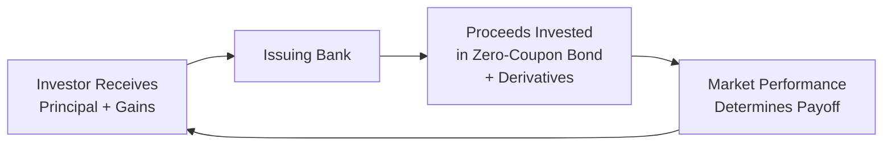

## 16.4 CSA Disclosure Standards for PPNs

Sometimes when I chat with friends about Principal-Protected Notes (PPNs), I get a bit of that raised-eyebrow look. You know, the classic, “PPNs sound so safe, right?” And sure, at first glance, they do seem like a guaranteed solution—after all, the word “principal-protected” is right there in the name! But in Canada, the reality is a little more complex, which is why the Canadian Securities Administrators (CSA) established robust disclosure standards to keep everyone well-informed and, hopefully, not too surprised down the road. In this segment, we’ll see how the CSA’s rules shine a spotlight on important elements like issuer credit risk, product structure, embedded fees, and more. Think of it as a mini road map to help you navigate the ins and outs of these products and figure out if they’re truly the right fit for you or your clients.

### The Evolution of CSA Disclosure for PPNs

Back in the day—OK, not that long ago, but still—your typical PPN might have had a fairly generic brochure telling you, “Hey, guess what, your principal is protected at maturity!” But the CSA gradually realized that many retail investors didn’t catch some crucial underlying details. What if the issuer defaults? Is my principal still really protected if there’s no secondary market for me to sell the note? What about potential caps on returns?

Over time, the CSA updated and refined their disclosure guidelines, with key references in staff notices like CSA Staff Notice 44-304 on structured notes, and cross-referencing best practices from other instruments (for instance, mutual funds under National Instrument 81-101, if the product structure parallels a fund-like vehicle). The overarching idea: keep potential investors from being blindsided. By placing standardization around what must be disclosed, the CSA effectively calls on issuers to explain the product in plain language, highlighting crucial features like the role of derivatives, the method of calculating returns, and potential redemption penalties.

### Key Elements of Effective Disclosure

The CSA imposes strict requirements on what PPN issuers need to reveal. These requirements are not meant to bury investors under legal jargon but to ensure everyone can see exactly what they’re buying. Here are some core elements that must appear in the offering documents:

* Nature of the Principal Guarantee:  
  The documentation must highlight that the guarantee of principal depends on the issuer’s creditworthiness. If the issuer goes bankrupt or suffers severe financial distress, that so-called “guarantee” might be compromised. Sometimes we forget that even big, established financial institutions have a credit rating, and if that rating slips, so might your perceived “protection.”

* Product Structure and Essential Mechanics:  
  PPNs often rely on a combination of a zero-coupon bond and a derivative overlay linked to an underlying asset or index. So, if you’re buying a PPN tied to, say, a Canadian equity index, the issuer might channel a chunk of your investment into a zero-coupon bond to ensure the principal is returned at maturity, and then use the remainder to buy derivatives, such as call options on the index. This “structure” needs to be crystal clear in the disclosures.

* Embedded Fees, Costs, and Conflicts:  
  Disclosure should mention the fees that might be embedded within the derivative components or purchased bonds. It’s funny how some folks think, “Oh, everything is baked into the product, so that’s fine.” But those internal fees can significantly impact overall returns. The CSA also wants any potential conflicts of interest spelled out—like the issuer structuring its own swaps or using its own affiliate to provide derivative coverage.

* Return Calculation Method:  
  Let’s say your PPN’s return is calculated as some leverage factor times the performance of an equity index. That’s awesome in a bull market, but how exactly is that “performance” measured? Are dividends included or excluded? Is there a performance cap or participation rate? This can be crucial. If the product is capped at a certain percentage, you might lose out on the full upside potential if the underlying index goes through the roof. The CSA wants that to be front and center in the disclosure.

* Maximum Possible Return and Upside Caps:  
  A lot of PPNs carry a “ceiling” on how much you can earn. So, if your PPN caps out at 30% over five years, you could suddenly find yourself missing out on extra gains if the underlying index soars beyond that. The CSA guidelines say that if there’s any maximum or threshold on returns, the issuer must underline it boldly so investors aren’t caught by surprise later.

* Maturity, Early Redemption Provisions, and Penalties:  
  The issuer must specify the term of the note (usually a few years, but it varies). If there’s a clause allowing early redemption—either initiated by the issuer or the investor—there should be crystal-clear language on what happens then. Are there fees if you redeem early? Does the “principal protection” still hold if you bail out before maturity?

* Liquidity and Secondary Market Availability:  
  One thing that can be a bummer about PPNs is that they usually aren’t super-liquid in the secondary market. The issuer might say they plan to make a market for the notes, but that’s not guaranteed, and the bids might be wide. The CSA calls for disclosure around these liquidity limitations so no one is left stuck, thinking they can just easily offload the note at any time.

### Real-World Example: The Principal Guarantee

A few years ago, I chatted with a friend—let’s call him Alex—who was super excited about a PPN that was “100% principal-protected.” Alex asked me: “Isn’t my risk basically zero? I mean, it’s guaranteed!” The trouble was that the note’s credit rating was directly tied to the issuing bank’s financial strength. So the big question becomes: “Is the issuer strong enough to meet its obligations?” Usually, with a top-tier Canadian bank, the risk is considered fairly low, but in a theoretical meltdown scenario—well, you can imagine what might happen.

Another crucial point, which Alex hadn’t fully grasped, was that the “principal protection” only truly applied at the note’s scheduled maturity. If he wanted out early—for example, if he needed cash for an emergency—he could potentially receive less than his initial investment because the secondary market might discount the note. This is precisely the kind of situation the CSA aims to address by requiring plain disclosure about the nature of principal protection and its relationship to the issuer’s creditworthiness.

### Scenario Analysis to Show Potential Outcomes

CSA guidelines also strongly urge issuers to show scenario analyses or hypothetical examples of how the PPN might perform in various market conditions. Instead of burying these in footnotes, they should be front and center: “Here’s a best-case scenario, a moderate scenario, and a worst-case scenario.” Why does that matter? Because in the real world, markets rarely move in a straight line. Investors should see how volatile swings can affect their potential returns. Below is a simplified conceptual table (not enumerating outcomes, just illustrating potential returns in plain language). Imagine a five-year PPN linked to an equity index:

| Market Performance After 5 Years | Index Return | Potential PPN Return   | Scenario Explanation                              |
|----------------------------------|-------------:|------------------------|---------------------------------------------------|
| Bullish Market                   | +40%         | Capped at +30% return  | The PPN’s structure caps the total gains.        |
| Sideways Market                  | +5%          | +5% return             | You match the underlying’s small gain.           |
| Bear Market                      | –20%         | 0% return (principal)  | Principal is protected, no additional gain.       |
| Extreme Bear                     | –70%         | 0% return (principal)  | Still no gain, but principal is protected (issuer credit risk applies). |

These scenarios rely on all the disclaimers we just mentioned—particularly that if the issuer cannot honor the guarantee, even the zero return is not assured. The CSA encourages such scenario breakdowns precisely because it puts all the “what ifs” on the table in a transparent manner.

### Using Plain Language about Derivatives

Ever see a set of disclaimers for a derivative-based product that basically read like, “The derivative portion is a contractual agreement to reference the market performance of the underlying, subject to blah, blah, blah, reams of text?” The CSA wants that wording to be simpler. They don’t want complicated references to advanced derivatives formulas that leave your brain spinning. Instead, the product’s term sheet should highlight that the PPN might rely on options or swaps, how the payoffs are triggered, and who is on the other side of the deal. The earlier you can see exactly how a derivative influences your payoff, the more confidently you can decide if the product suits your risk tolerance.

### Potential Conflicts of Interest

Conflicts of interest might arise if the derivative portion of the PPN is provided by the same institution issuing the PPN, or by one of its affiliates. Maybe the issuer stands to gain from the spread on the derivative transaction. Or if the product references a proprietary index that the bank itself created or manages, that’s another potential conflict point. The CSA wants these relationships clearly disclosed. In reality, seeing something like, “ABC Bank is also the calculation agent for this index,” might not mean you run away from the product, but you certainly want to know about it before investing.

### Best Practices and Common Pitfalls

I’ve heard stories—some a little heartbreaking—about folks who poured their savings into PPNs thinking, “This is essentially a guaranteed way to make money.” Then they discovered that the returns were quite muted (due to caps, fees, or simply poor underlying performance). Or they wanted to exit early but realized there was no easy secondary market. Here are a few good practices (and potential pitfalls) to consider:

* Investigate Issuer Creditworthiness:  
  Even if a PPN is from a major bank, spend a moment reading about its financial health. Familiarize yourself with the bank’s credit rating. Don’t skip this step—credit risk matters.

* Understand Fee Structures:  
  Always look for any mention of embedded fees in the term sheet. Product marketing might skip quick mention of fees, but they’re usually in the fine print.

* Pay Close Attention to Redemption Features:  
  Early redemption often means you might lose some or all of the payoff linked to your underlying investment. That’s typically spelled out up front, but read the details carefully.

* Evaluate Your Timeline:  
  If you might need these funds before maturity, a PPN might not be your best option. The CSA instructions ensure disclosures highlight the possible liquidity risk, but it’s on you (or your advisor) to interpret that properly.

* Check for Caps and Participation Limits:  
  If your underlying index soars 100% but your maximum return is set at 30% or 40%, you could miss out on a big chunk of gain. Decide whether you’re comfortable with that trade-off.

### Emphasizing Issuer Creditworthiness

Because the entire structure of most PPNs depends on the guarantee by an issuing bank or financial institution, the CSA requires issuers to be explicit about their credit status. They’ll often include references to credit rating agencies (Moody’s, S&P Global, DBRS, etc.) to give you a sense of the bank’s standing. This detail is huge when it comes to your real “principal protection.” The risk is typically small with stable banks, but never zero. So, yes, I’ve seen some folks disregard the credit rating part because, well, hey, these are big banks, right? But just remember that if the note’s underlying issuer experiences financial trouble, it can turn your so-called “protected investment” into a question mark.

### Roles of Derivatives in PPN Structures

Let’s take a visual look at how the derivatives element typically fits into a PPN. Below is a simple Mermaid diagram. Don’t be intimidated by the code—this is just to help you picture the flow.

In plain English:  
1) You, the investor, buy the PPN from the issuing bank.  
2) The bank takes your money and splits it up—some goes to purchase a zero-coupon bond (securing the principal at maturity), and the rest is used to buy derivatives (like calls or a structured option).  
3) The performance of those derivatives (often tied to a specific index) decides how much extra return beyond the principal you’ll get.  
4) At maturity, the zero-coupon bond redeems at par, so, in theory, you get your principal back, and the derivative portion might deliver a bonus if the underlying performed well.  

### Scenario Testing and CSA Guidance

The CSA strongly suggests providing different outcome scenarios in the product’s marketing documents, such as best case, moderate case, and worst case. In some cases, an “extreme worst case” might also be shown, particularly if the structured product has special features, like leveraging the underlying performance beyond 100%. By hooking your potential returns to a leveraged derivative, you might see bigger gains but also risk losing even the derivative portion entirely if markets tank. Proper scenario disclosures help illustrate that it’s not always a stable or linear path.

Beyond that, the CSA encourages the use of simplified examples. Instead of putting a complicated formula into the main body, they might say something like: “If the underlying index rises by X%, then your note’s return factor is Y, so the return is Y × X%—subject to a maximum of Z%.” The formula might also be provided in detail for the more mathematically inclined, but the plain-language approach is crucial so average investors can grasp it quickly.

### References and Additional Resources

If you’re looking for some official reading or want to see real-world examples, here are a few gems:

* CSA Staff Notice 44-304 on Structured Notes:  
  This notice outlines how issuers can meet heightened disclosure standards, specifically focusing on the complexities of structured products like PPNs.  
  Visit the **Canadian Securities Administrators** website to find the latest bulletins: https://www.securities-administrators.ca

* CIRO Guidelines on Sales Practices and Suitability:  
  The Canadian Investment Regulatory Organization (CIRO) oversees the sales practices of registered firms, ensuring that they meet suitability requirements when recommending complex products to retail clients.  
  See https://www.ciro.ca for resources and rule clarifications.

* National Instrument 81-101 Mutual Fund Prospectus Disclosure:  
  If the PPN is structured in a way that it’s deemed an investment fund or is packaged similarly, you might see cross-over applicability with mutual fund disclosure norms.

* Product Term Sheets from Canadian Institutions:  
  Many major banks post sample PPN marketing materials on their websites. You can examine RBC, BMO, TD, and other bank sites to see how they present structured notes.

* StructuredRetailProducts.com:  
  A global repository for structured products, offering data on various types of retail structures, including PPNs, from around the world.

### Concluding Thoughts

CSA disclosure standards for PPNs might sound dry at first, but in reality, they’re there to protect you from nasty surprises. If you’re an advisor, it’s your job to ensure your client fully understands these features—everything from how the derivative portion works to how safe that “principal protection” really is. And if you’re a self-directed investor, take a moment to thoroughly read the product’s term sheet. Think about your own objectives, time horizon, and risk tolerance. After all, the best time to discover hidden terms and fees is before you lock up your funds, not after.

At the end of the day, PPNs can be a very helpful tool for investors who want the comfort of principal protection while still dipping a toe into some market upside. Just remember that “protection” is only as strong as the institution backing it, and it strongly depends on you staying the course until maturity. With the CSA’s guidelines, you should at least have everything you need spelled out clearly in front of you—giving you the knowledge and confidence to decide if PPNs belong in your portfolio mix.

## Sample Exam Questions: CSA Disclosure Standards for PPNs



### Under the CSA guidelines, what key factor must be clearly disclosed when marketing a Principal-Protected Note?

- [x] The creditworthiness of the issuer and how it impacts the principal guarantee.
- [ ] The issuer's historical stock price over the last decade.
- [ ] The compensation package of the issuer’s CEO.
- [ ] The personal investment accounts of senior management.

> **Explanation:** Disclosure of the issuer’s creditworthiness is essential because if the issuer defaults, principal guarantees can fail.

### According to CSA requirements, how should PPN issuers handle the disclosure of fees?

- [x] Always include fees in plain language in the term sheet, specifying any embedded or ongoing costs.
- [ ] Include fees only if they surpass a certain percentage threshold.
- [ ] Provide fee details only upon the investor’s request.
- [ ] Omit fees from the main brochure to avoid confusion.

> **Explanation:** The CSA mandates transparent, plain-language disclosure of all fees—embedded, ongoing, or otherwise—so investors can understand the true cost of the product.

### Which of the following best describes the impact of upside caps on a PPN?

- [x] They limit the investor’s maximum gains, even if the underlying asset outperforms.
- [ ] They eliminate the issuer’s credit risk.
- [ ] They guarantee additional return if markets fall.
- [ ] They ensure zero correlation with the underlying asset.

> **Explanation:** An upside cap means there is a ceiling on how much the investor can earn from the underlying asset’s performance.

### When focusing on early redemption features of PPNs, what should the CSA disclosure highlight?

- [x] Potential penalties, fees, and the effect on principal protection if redeemed before maturity.
- [ ] A guarantee of no additional costs for redeeming early.
- [ ] The investor’s ability to freely exit with full gains at any time.
- [ ] Incentives provided by the issuer to redeem early.

> **Explanation:** CSA rules require clarity on the potential penalties or fees for early redemption, along with how it might negate the product’s principal protection.

### Which scenario would typically trigger a worst-case outcome for a PPN holder?

- [ ] The bank that issues the note releases strong quarterly earnings.
- [x] The issuer’s solvency deteriorates, undermining the principal guarantee.
- [ ] The underlying markets boom, surpassing the PPN’s cap.
- [ ] The investor sells the PPN at a profit in a liquid secondary market.

> **Explanation:** If the issuer cannot fulfill its obligation (due to insolvency), even a “principal-protected” note’s guarantee might fail.

### Why does the CSA encourage scenario analysis (best, moderate, worst) in PPN disclosure?

- [x] It helps investors visualize possible outcomes under different market conditions.
- [ ] It is required for compliance with international IFRS standards.
- [ ] It automatically lowers the cost of derivative components.
- [ ] It guarantees the PPN will outperform traditional fixed income.

> **Explanation:** Scenario analyses equip investors with an understanding of potential performance outcomes across varying market conditions.

### Which document typically contains the core information regarding PPN structure, risks, and potential conflicts of interest?

- [x] The term sheet or simplified prospectus.
- [ ] The separate annual report of a competing mutual fund.
- [ ] An internal memo not shared with the public.
- [ ] The CRA T4 slip for the issuer’s employees.

> **Explanation:** The CSA mandates that key product details be readily available to investors, usually through an official term sheet or simplified prospectus.

### Under CSA guidelines, which of the following statements is true regarding the secondary market for PPNs?

- [x] It may be limited or illiquid, and this fact must be clearly disclosed.
- [ ] It is always robust, with guaranteed liquidity for daily trading.
- [ ] It does not exist for any type of PPN.
- [ ] It is regulated in the same way as equity marketplaces.

> **Explanation:** The CSA wants transparency around the fact that many PPNs lack deep secondary markets, potentially limiting liquidity.

### If a PPN issuer uses an affiliated entity to create and manage the underlying index, how should this be disclosed?

- [x] The CSA requires disclosure of any conflicts of interest, including affiliated relationships.
- [ ] No disclosure is required if the issuer is a respected institution.
- [ ] Only minimal disclosure is required if the affiliate is located outside Canada.
- [ ] This arrangement is prohibited under all circumstances.

> **Explanation:** Conflicts of interest involving affiliates must be disclosed so investors understand potential incentives or biases.

### True or False: Under CSA guidelines, “principal-protected” means zero risk across all market conditions.

- [x] False
- [ ] True

> **Explanation:** The CSA highlights that if the issuer defaults or if the note is redeemed early, there can be risk to even the principal amount. Principal protection is not absolute, especially outside maturity conditions and when issuer credit risk is in question.


