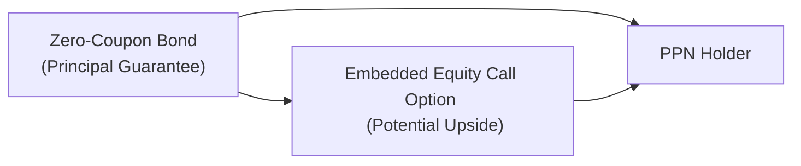

## 16.5 Embedded Derivatives & Credit Risk to Issuer

Imagine you’re driving along a highway on a bright summer day, and you see a stylish new car that touts “100% guaranteed safety features.” Maybe you think, “Wow, that’s ironclad.” But then, as you take a closer look, you realize these safety features ultimately depend on whether the car’s manufacturer remains in business to service or honor the warranty. Principal-Protected Notes (PPNs) can be a little like that. They often promote a form of “principal guarantee,” but in reality, the guarantee hinges on the financial health of the issuing institution. If the issuer falters, that so-called guarantee could falter too.  

This section explores that delicate link between embedded derivatives in PPNs and the creditworthiness of the issuer. We’ll look at who ranks where if there’s a default, how credit ratings provide (limited) insight, and why even the best returns on the underlying asset won’t help you if your issuer can’t make good on the payoff. I remember the very first time I encountered a PPN in my own portfolio—boy, did it look fancy. The broker had described all these wonderful upside potentials, but the one thing that kept me up at night was: “What if the issuer defaults?”  

Let’s break it all down, step by step.

### The Nature of Embedded Derivatives in PPNs

PPNs combine a debt instrument (usually a zero-coupon or senior unsecured note) with an embedded derivative (often a call option on an equity index, currency, commodity, or other underlying reference). The key point is that this derivative isn’t a separate, tradeable security. Instead, it’s built right into the note’s structure. That means you can’t typically sell just the derivative on its own. If the issuer fails to meet its obligations, the embedded derivative doesn’t magically float away and retain value for the holder.  

Here’s a simple visual to show how a PPN typically comes together:

In the diagram:
• The Zero-Coupon Bond portion helps fund the principal protection at maturity.  
• The Embedded Equity Call Option provides the upside potential if the underlying asset performs well.  
• Both the bond and the option are bundled to create the PPN, which the investor purchases.  

The reason we say “principal guarantee” in quotes is that the ability for you to receive your principal and any return depends on the issuer’s solvency.

### Connecting Embedded Derivatives and Issuer Credit Risk

If you hold a plain-vanilla bond from a reputable corporation, you know that your interest payments depend on that corporation’s ability to generate sufficient cash flow and remain solvent. With a PPN, you face a similar situation, but there’s a twist: the embedded derivative payoff also depends on the issuer’s future solvency. In other words, even if the call option portion of the PPN is “in the money” when the note matures, you need the issuer to be alive and kicking to deliver that payout.

What if the issuer were to enter financial distress or default? As we’ll see shortly, PPN holders are typically on the same rung of the ladder as other senior unsecured creditors. Whenever I teach a friend about PPNs, I emphasize that “principal protected” cannot be interpreted as “risk-free.” The credit risk is alive and present.

### Senior Unsecured Debt Ranking

We’ve probably all heard the phrase, “It’s first come, first served.” Well, in the prudent (if sometimes harsh) world of debt markets, it’s more like “whoever stands at the top of the seniority list gets paid first.”  

Because most PPNs are structured as senior unsecured debt of the issuing bank, the holder of a PPN ranks alongside other senior bondholders—but behind secured creditors (lenders who hold collateral) and any super-senior claims. If there’s a default, you line up with all the other folks who have senior unsecured claims, and you may recover only a fraction of your investment, or potentially nothing at all, depending on the assets left to be distributed.  

You might be wondering, “Why do issuers structure PPNs this way?” One reason is that banks and other financial entities, subject to regulations by the Office of the Superintendent of Financial Institutions (OSFI), have certain capital and solvency requirements. By issuing unsecured PPNs, they fit these notes into their existing debt framework without creating specialized collateralization needs. For investors, though, it means you have to keep an eye on the issuer’s overall debt position and capital strength.  

### Dependency on Issuers for Payoff

The next angle is how the embedded derivative payoff ties back to the issuer. If the equity market soared 50% during the term of your PPN (and the embedded option payoff soared too), that’s wonderful—at least on paper. But the real question is: Will the PPN issuer be capable of making that payoff at maturity?  

If the issuer’s credit health has deteriorated by the time your note matures, they might be unable or unwilling to fulfill the entire obligation. It’s almost like cheering for your team to win the championship, but then discovering the stadium has closed, and there’s no trophy presentation.

### The Role of Credit Ratings

I recall a friend once telling me, “Don’t worry, my PPN is issued by a top-tier bank. It’s rated A++.” However, ratings aren’t a watertight guarantee. If rating agencies (like DBRS Morningstar, Moody’s, or Standard & Poor’s) lower the issuer’s credit rating, that’s typically a red flag that your PPN might carry more risk than you initially thought. Ratings are an opinion—often valuable, but definitely not infallible.  

When rating agencies analyze a bank or financial institution, they examine factors such as:  
• Capital adequacy  
• Asset risk and loan portfolio quality  
• Corporate governance and risk-management practices  
• Likelihood of government support in extreme scenarios  

Even with all that, sudden market conditions, management missteps, or broader economic downturns can cause swift changes in credit standing. Investors should track the rating of the issuing entity throughout the life of the PPN, not just at the time of purchase.

### Regulatory Perspective

Canadian regulators, including CIRO (Canadian Investment Regulatory Organization) and CSA (Canadian Securities Administrators), caution investors about credit risk in complex instruments such as PPNs. Although these notes are sold by banks that must follow OSFI’s guidelines, the “Guarantee” in a PPN is not insured by the Canada Deposit Insurance Corporation (CDIC) in most cases. It’s essentially only as strong as the issuer’s balance sheet and regulatory capital.  

We’ve seen major regulatory reforms worldwide since the 2008 financial crisis, especially concerning how banks must structure their capital buffers. OSFI guidelines require robust capital adequacy, but that still doesn’t remove the possibility of default.  

### IFRS 9 and Embedded Derivatives

From an accounting perspective, the embedded derivative (such as the call option in a PPN) can be subject to IFRS 9 (Financial Instruments) rules. IFRS 9 addresses classification, measurement, and impairment of financial instruments, including derivatives. For investors, understanding the IFRS 9 perspective isn’t just for accountants. It can also clue you into how banks might fair-value (or not) the derivative portion and how changes might impact the issuer’s reported financials.  

• IFRS 9 typically requires entities to separate and measure embedded derivatives at fair value if certain criteria are met (unless the entire instrument is measured at fair value through profit or loss).  
• The underlying hedge or risk-management strategy of the issuer could influence how these derivatives appear on the balance sheet.  

Furthermore, any large changes in the derivative’s valuation might signal potential profitability or trouble. If you’re scanning a bank’s financial statements, fluctuations in the derivatives portfolio might be a sign of how future obligations (like those under PPNs) could play out.

### Counterparty Risk and Default

Counterparty risk is the risk that the party on the other side of a transaction (in this case, the PPN issuer) fails to perform. If the issuer goes into default, your entire principal investment is at risk—both the portion tied to the debt and the portion corresponding to the embedded derivative payoff.  

When you buy a typical corporate bond from a manufacturing firm, you know that if they default, you join the queue of unsecured creditors. The same general concept applies here, except that there might be special conditions in the note’s documentation about how the embedded derivative redemption is calculated or paid. Nonetheless, you’re essentially an unsecured creditor.

### Practical Example

Let’s consider a fictional example. Suppose RBC (Royal Bank of Canada—one of Canada’s Big Five banks) issues a PPN that matures in five years. The PPN’s embedded derivative references the S&P/TSX 60 Index. Let’s say RBC has a strong credit rating right now, like AA-. No immediate red flags. You decide to buy the note for $100,000, expecting full principal repayment plus a portion of the index’s upside.  

Now imagine that, three years in, RBC experiences a series of catastrophic loan losses and sees its credit rating downgraded to BBB. The market sees RBC as riskier. Suddenly, the secondary market value of your PPN might drop because investors are concerned about RBC’s ability to pay. Even if the S&P/TSX 60 soared 30%, enabling a handsome payoff in theory, your chance of actually reaping that depends on RBC’s solvency at maturity.  

If RBC remains solvent but in weaker financial condition, you might still get your principal back at maturity, plus any embedded derivative gains. If RBC defaults in the worst-case scenario, you and other senior unsecured creditors may have to fight over the bank’s remaining assets, and your “principal protection” may vanish.  

### Common Pitfalls

• Over-Reliance on the Word “Protection”: Sometimes, marketing around PPNs can lead investors to think they have a cast-iron guarantee. But “principal protection” is only as solid as the bond issuer.  
• Ignoring Credit Risk Over Time: Many folks check credit ratings at the time of purchase but rarely monitor the issuer’s financial health in subsequent years. That’s a mistake.  
• Misreading the Fine Print on Seniority: PPN literature often states “senior unsecured debt,” but the significance of that phrase might be underappreciated by novice investors.  

### Best Practices for Investors

• Regularly Check the Issuer’s Credit Profile: Subscribe to alerts from rating agencies or your brokerage platform. If there’s a major downgrade, know what that means for your PPN.  
• Understand OSFI’s Role: OSFI supervises banks in Canada, ensuring adequate capital levels. Visit OSFI’s website to learn more about how Canadian banks are stress-tested and regulated.  
• Read the Terms Thoroughly: Always review the official term sheet or offering memorandum for your PPN. Focus on how returns are calculated, how principal is protected, and what happens if the issuer encounters financial trouble.  
• Consider Alternatives: If you’re uneasy about an issuer’s credit risk, investigate alternatives like government treasury bills or deposit notes that may carry CDIC insurance. (Though these typically offer lower returns, they offset that risk with higher security.)

### Additional Resources

• CIRO (Canadian Investment Regulatory Organization):  
  [https://www.ciro.ca](https://www.ciro.ca)  
  CIRO often publishes investor alerts and guidance relating to complex products such as PPNs.  
• CSA (Canadian Securities Administrators):  
  [https://www.securities-administrators.ca](https://www.securities-administrators.ca)  
  The CSA website contains investor warnings and bulletins on structured notes and derivatives.  
• OSFI (Office of the Superintendent of Financial Institutions):  
  [https://www.osfi-bsif.gc.ca](https://www.osfi-bsif.gc.ca)  
  OSFI guidelines on capital adequacy can provide insight into the relative health of Canadian issuers.  
• IFRS 9 Guidance from CPA Canada:  
  [https://www.cpacanada.ca](https://www.cpacanada.ca)  
  Guidance on how to account for complex instruments may offer additional clarity on embedded derivative treatments.  
• Credit Rating Agency Methodologies:  
  • DBRS Morningstar: [https://www.dbrsmorningstar.com](https://www.dbrsmorningstar.com)  
  • Moody’s: [https://www.moodys.com](https://www.moodys.com)  
  • Standard & Poor’s: [https://www.spglobal.com/ratings](https://www.spglobal.com/ratings)  

### Concluding Thoughts

A Principal-Protected Note can sound like a foolproof, no-downside scenario—hey, who doesn’t like “no risk” and “unlimited upside”? But the ultimate story is that the credit risk belongs to the issuer. If that issuer goes belly-up, your principal might not be protected at all.  

So what’s the best strategy for an investor? Always evaluate the issuer’s credit strength, keep tabs on that credit rating throughout the life of the note, and diversify so that one troubled issuer doesn’t derail your entire portfolio. In other words, do your homework, ask questions, and never forget that “principal protection” in a PPN is not a government-guaranteed promise—it’s an obligation, and obligations are only as good as the party standing behind them.  

Anyway, that’s the bottom line. It’s not meant to scare you off PPNs altogether. They often serve a useful purpose in a portfolio, particularly for investors seeking limited downside exposure while participating in equity or commodity upside. Just be aware of whose promise you’re banking on.

## Sample Exam Questions: Embedded Derivatives and Credit Risk in PPNs



### Which statement best describes the credit risk associated with a principal-protected note (PPN)?

- [ ] PPN holders have priority over all other creditors if the issuer defaults.
- [x] PPN holders rank alongside other senior unsecured creditors in a default scenario.
- [ ] Credit risk is irrelevant if the embedded derivative is “in the money.”
- [ ] The government guarantees all Canadian PPN obligations.

> **Explanation:** PPNs are usually issued as senior unsecured debt, so if the issuer defaults, PPN holders share the same ranking as other senior unsecured creditors.

### What is the key takeaway regarding “principal protection” in PPNs?

- [ ] It is fully guaranteed by Canadian regulatory bodies through CDIC.
- [x] It depends on the issuer’s solvency and creditworthiness.
- [ ] It is guaranteed by a legally separate bankruptcy-remote entity.
- [ ] It always ensures a guaranteed payout from a separate collateral account.

> **Explanation:** Principal protection in a PPN is only as reliable as the issuer’s ability to pay. If the issuer defaults, the investor may lose principal.

### Why might a PPN’s embedded derivative payout not be honored even if the underlying market performs well?

- [ ] The derivative is canceled if the market moves favorably for the investor.
- [x] Issuer credit risk can jeopardize the payoff if the issuer is financially weak at maturity.
- [ ] The embedded derivative shifts to a new issuer automatically.
- [ ] Regulators typically freeze payouts if the market outperforms projections.

> **Explanation:** A PPN’s embedded derivative payoff is subject to issuer solvency. A financially weakened issuer might be unable to fulfill the obligation.

### When assessing a PPN’s credit risk, which external factor is most relevant?

- [ ] Real estate market performance
- [x] The credit rating of the PPN issuer
- [ ] The external agent’s stock price
- [ ] The performance of government-issued bonds

> **Explanation:** The PPN issuer’s credit rating is a key indicator of its ability to meet financial obligations.

### Which regulatory agency sets guidelines for Canadian banks’ capital and solvency, affecting their ability to honor PPN obligations?

- [ ] Canadian Deposit Insurance Corporation (CDIC)
- [ ] Canadian Investor Protection Fund (CIPF)
- [x] Office of the Superintendent of Financial Institutions (OSFI)
- [ ] Financial Consumer Agency of Canada (FCAC)

> **Explanation:** OSFI sets and oversees capital and solvency regulations for Canadian banks, which in turn impacts the banks’ ability to meet PPN obligations.

### Which accounting standard addresses the classification and measurement of embedded derivatives?

- [ ] IAS 2
- [ ] IFRS 16
- [x] IFRS 9
- [ ] IFRS 15

> **Explanation:** IFRS 9 deals with financial instruments, including embedded derivatives within structured notes like PPNs.

### In a default scenario, how are payments to PPN holders typically handled?

- [ ] They are paid before all other liabilities because of the “protected” label.
- [x] They are paid after secured creditors, on par with other senior unsecured creditors.
- [ ] They are generally guaranteed by a government bailout fund.
- [ ] They are subject to mandatory insurance from credit rating agencies.

> **Explanation:** PPNs are usually senior unsecured debt, which means they queue up on par with other senior unsecured obligations after secured creditors in a default.

### Why might the secondary market value of a PPN fluctuate even if the underlying reference asset is performing well?

- [ ] Strong performance of the reference asset reduces credit risk.
- [x] Market participants reprice the note based on shifts in the issuer’s credit risk.
- [ ] Regulatory agencies automatically freeze trading of performing PPNs.
- [ ] The zero-coupon portion eliminates all market risk, so no fluctuations occur.

> **Explanation:** The issuer’s changing credit risk can heavily influence the secondary market price, regardless of how the underlying asset is doing.

### Which of the following best describes the role of rating agencies like Moody’s or S&P in relation to a PPN?

- [ ] They guarantee full repayment, subject to regulatory verification.
- [x] They provide an opinion on the issuer’s creditworthiness, not a guaranteed outcome.
- [ ] They only rate the embedded derivative, not the debt portion.
- [ ] They are responsible for collecting payments from the PPN issuer.

> **Explanation:** Rating agencies offer ratings that reflect their view on an issuer’s creditworthiness but do not ensure repayment.

### True or False: Principal-Protected Notes are fully insured against loss of principal by the CIPF (Canadian Investor Protection Fund).

- [ ] True
- [x] False

> **Explanation:** The CIPF protects investors if a CIRO-member firm becomes insolvent, covering missing assets in brokerage accounts, not losses tied to an issuer default. Most PPNs are not covered by CDIC or CIPF insurance for principal repayment if the issuer fails.


