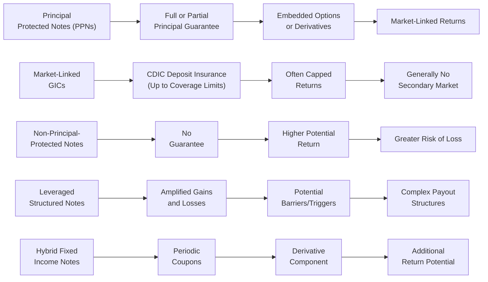

## 16.6 Comparing PPN Structures with Other Structured Notes

Have you ever caught yourself at a family gathering trying to explain what a Principal-Protected Note (PPN) is and realized you’re in a twisty maze of different structured products? Maybe your cousin invests in a fancy leveraged note, your uncle swears by market-linked GICs, and your friend from university just heard about hybrid fixed income notes. Well, you’re definitely not alone. In this section, we’ll explore how PPNs compare to other types of structured notes in Canada. We’ll walk through the benefits, risks, and unique features of each product, and we’ll take a peek at the regulatory frameworks that keep these intriguing investments in line.

Use this as a friendly guide. Sure, we’ll talk technical, but we’ll keep it conversational, share some personal experiences along the way, toss in a few visuals, and hopefully demystify how these products differ and why it matters.

  
### Setting the Stage: What PPNs Bring to the Table

Before diving into the comparison with other structured notes, here’s a quick refresher on PPNs (Principal-Protected Notes). As we discussed in previous sections of this chapter, a PPN generally combines a zero-coupon bond (or similar risk-free component) with some form of embedded derivative, such as an option on an equity index. This structure aims to protect your principal at maturity (though protection is always subject to the issuer’s creditworthiness) and still offer a chance to benefit from market gains. Most PPNs in Canada are issued by banks or large financial institutions, and their marketing often emphasizes safety (“your principal is protected!”) and the upside linked to an underlying index.

By design, PPNs cater to folks who want stock market-like exposure but really don’t want to lose money if things head south, at least not on paper at maturity. PPNs typically have a fixed term—commonly five to seven years—and potential returns that depend on the performance of an index (e.g., S&P/TSX Composite) or a strategy described in the note’s term sheet.

  
### How PPNs Differ from Other Structured Notes

Let’s go ahead and contrast PPNs with a few other structured products you’ll often see in the Canadian marketplace. They’re all part of the structured note family, but each has its own spin on risk, return, and investor goals.

  
#### Market-Linked GICs

First up are market-linked GICs. Some people call them “equity-linked GICs,” “index-linked GICs,” or “market growth GICs.” If you’ve ever strolled into your local bank branch, you’ve probably seen a pamphlet about one of these. Like PPNs, market-linked GICs provide a minimum principal guarantee at maturity. However, there’s a big difference: most market-linked GICs come with deposit insurance protection (CDIC in Canada) up to a specified limit, typically $100,000 per deposit, per institution, per insured category. This is huge for folks who want that “extra-extra” layer of security from deposit insurance.

But—and here’s the catch—market-linked GICs often impose a maximum return or a “participation rate” that can cap your upside. Maybe it’s 60% of the index’s gain, or there’s a “maximum” interest you can earn over the term. Also, GICs typically can’t be sold on a secondary market, so you’d better be prepared to hold until maturity in most cases. Liquidity-wise, PPNs might offer better potential—though not always—if they’re listed or have a more established secondary market. However, PPN liquidity can be thin, so always check your term sheet and talk to your advisor about redemption options.

  
#### Non-Principal-Protected Notes

Now, let’s look at the more adventurous cousin of PPNs: non-principal-protected notes. These products might still combine a bond or funding component with an embedded derivative, but the issuer chooses to allocate more of your investment toward the derivatives and less toward the principal guarantee. That means there’s usually no full principal protection. You’re on the hook if the underlying asset collapses.

On the flip side, these instruments can deliver higher returns if the underlying asset performs really well because a bigger share of your capital supports derivative exposure. So if you’re highly confident in the performance of the underlying index—or you just have a strong appetite for risk—it might be tempting to go for bigger returns. But remember, you might lose part or all of your principal. With PPNs, you don’t typically face that potential principal wipeout at maturity (credit risk aside). So the big question is: are you comfortable with risking more of your nest egg in pursuit of higher returns?

  
#### Leveraged Structured Notes

Let’s say you checked your account statement recently and realized that if you’d just had a bit more exposure to a certain market rally, you’d be way ahead. Cue leveraged structured notes. These products dial up the exposure to the underlying asset or index beyond your initial investment—essentially leveraging your returns. But as we all (sometimes painfully) know, leverage can cut both ways. If the market moves in your favor, you’re celebrating big gains at the finish line. If it moves against you, your losses can also pile up quickly.

This is a trickier space where you really need to be sure about your risk tolerance. Some leveraged notes attempt to offset losses by building in complex safety nets or partial protection, but it’s rarely as straightforward as a PPN’s principal guarantee. Issuers often incorporate special triggers, knockout features, or barrier levels. For instance, if the index drops below a certain threshold, you might lose your principal protection. In some structures, you not only forfeit your principal protection, but you also incur losses magnified by your leverage. So do your homework. Look at stress scenarios. Talk to an advisor. Maybe talk to a second advisor. Because leveraged structured notes can pack plenty of surprises in the term sheet’s fine print.

  
#### Hybrid Fixed Income Notes

These hybrids combine predictable, bond-like coupon payments with a derivative-based payoff that might give you a bonus if the underlying asset or strategy performs well. Picture it like having your cake and eating it, too, but the icing might be a little uncertain. Typically, you’ll see something like: “You’ll receive 3% annually, plus a potential additional coupon if XYZ Index returns exceed a certain level.”

One thing to keep in mind is that while you’re getting a partial fixed income stream, the rest of the payoff is still reliant on how that embedded derivative performs. Depending on the structure, you might get partial principal protection, zero principal protection, or even principal at risk. Each product type spells it out differently. These notes often appeal to investors seeking a hybrid approach: some predictable income plus a dash of equity or commodity-linked upside. Just remember that the “guaranteed” portion is usually limited to the coupon; the principal is at risk in many hybrid schemes if the underlying index has a terrible run.

  
### High-Level Comparison of Key Features

Below is a rough visual flowchart to distinguish how the broad categories of structured notes compare in terms of principal protection and payoff structure:

  
### Risk, Return, and Liquidity Trade-Offs

It’s fair to say that each structured product has its place in a portfolio, but the choice depends on personal goals, timeline, and risk tolerance. Let’s break down the risk, return, and liquidity angle:

• Principal Risk: PPNs generally offer full principal protection (subject to issuer credit risk) at maturity, while non-principal-protected notes, leveraged notes, and certain hybrids put principal on the line. Market-linked GICs protect principal through deposit insurance (within coverage limits), but returns are frequently capped.

• Return Potential: Non-principal-protected notes and leveraged notes tend to aim for higher returns, precisely because you’re giving up some or all of your principal protection. PPNs might generate moderate returns if the underlying index does well, but you usually won’t see blowout gains. Market-linked GICs often cap returns more tightly than PPNs, but that can vary among issuers.

• Liquidity: If liquidity is a big concern, check whether your product trades on any exchange or if the issuer offers redemptions. Many PPNs have limited secondary markets. Market-linked GICs are usually locked in until maturity (unless the bank allows early redemption with possible penalties). Non-principal-protected notes and leveraged notes might or might not have secondary market support. Always read the offering documents—sometimes you’ll find daily redemption, other times you’re stuck until maturity.

• Complexity: While PPNs can be intricate, some notes (leveraged or exotic hybrids) can be far more complicated. If you’re not comfortable with stress testing different market scenarios, watch out. Complexity can hide big risks.

  
### Regulatory Oversight and Suitability

If you’re recommending structured notes to clients or just deciding on them for your own portfolio, remember that compliance with CIRO guidelines (formerly IIROC and MFDA) is paramount in Canada. Here are a few guidelines to keep in mind:

• CIRO Suitability Rules: Advisors must ensure these products meet a client’s objectives, timeline, and risk profile. Overly risky structures for a conservative investor could raise red flags under CIRO rules.

• CSA Staff Notice 81-330: Provides helpful guidance on marketing structured products. Advisors and institutions must be transparent about the risks, fees, and overall structure. Marketing materials should avoid giving the impression of guaranteed or typical outcomes if that’s not accurate.

• OSFI Guidelines: In Canada, OSFI regulates deposit-taking institutions that issue PPNs or market-linked GICs. So if your product is from a chartered bank, OSFI guidelines help keep the bank well capitalized and stable, indirectly safeguarding your investment.

• KYC Best Practices: You’ve probably heard this a million times, but it’s still critical. Understand your client’s risk tolerance, investment timeline, knowledge level, and liquidity preferences before venturing into any structured product. Spell out the worst-case scenarios, not just the potential upside.

  
### When Suitability Is in the Spotlight

I remember a cousin who asked me about structured notes a couple of years ago. He wanted to get fancy with his portfolio, but he also hated losing money (who doesn’t, right?). He was leaning toward a leveraged structured note tied to emerging market equities—high risk, but high reward. After a few late-night chats, we concluded that a PPN or market-linked GIC might be more appropriate for him, given his aversion to capital losses. Yes, the returns might be lower, but the structure aligned better with his peace of mind.

Suitability is about those nuances. A more aggressive investor might choose a leveraged note for the possibility of high returns. Another investor might choose a hybrid fixed income note if they want some coupons along the way plus a shot at better-than-average returns. Ultimately, it’s not about which product is “supreme.” It’s about which product fits best.

  
### Practical Example: Side-by-Side Scenario Analysis

To vividly see how these products behave, consider modeling their payoffs under different market conditions. Suppose the underlying index is the S&P/TSX 60, and let’s imagine it grows at an average 5% per year over five years, but experiences a sharp dip in year three. Using open-source tools can bring these hypothetical scenarios to life:

• R’s Shiny Web Apps: Build an interactive dashboard that tracks each product’s payoff over time. Include toggles for leverage levels, principal protection, and index volatility.

• Python’s Plotly: Generate side-by-side payoff graphs. Show how each product finishes if the index ends up 25% higher than the starting level at maturity, or 25% lower.  

By overlapping those lines, you can compare how PPNs hold their principal value, how non-principal-protected notes either flourish or flounder, how leveraged notes go wild on both sides, and how a hybrid note might gently blend the results.

  
### Common Pitfalls

• Misunderstanding Principal Protection: Principal protection is not bulletproof if the issuer defaults. Also, it only applies at maturity in most cases. So if you bail out early, you might not get the full guaranteed amount.

• Ignoring Fees and Spreads: Sometimes the embedded costs in structured notes can eat into returns. Always check the product’s offering documents for management fees, hedging costs, and transaction spreads.

• Overlooking Secondary Market Liquidity: If you might need to exit early, ignoring liquidity is a huge risk. Many structured notes are not actively traded, so you might face wide bid-ask spreads or even no bids.

• Focusing Only on the Upside: It’s easy to get dazzled by marketing presentations showing double-digit returns. Make sure you also evaluate downside scenarios, including partial or total loss of principal (for notes without principal protection).

  
### Best Practices for Advisors and Investors

• Conduct Thorough KYC: Whether you’re an advisor or a self-directed investor, ensuring the product suits your (or your client’s) objectives is everything.

• Read Official Guidance: Familiarize yourself with CSA Staff Notice 81-330 for additional insights on marketing structured products. Visit [https://www.ciro.ca](https://www.ciro.ca) for the latest regulations on product due diligence.

• Stay Current on Rules: Regulations evolve. Stay tuned to OSFI guidelines if the product is from a deposit-taking institution. OSFI’s website updates relevant capital requirements and other pillars for stable financial institutions.

• Use Scenario Analysis Tools: Technology helps map out the best and worst scenarios. Tools like R Shiny or Plotly can illustrate the distribution of returns across different market conditions.

  
### Conclusion

Comparing PPNs to other structured notes is about understanding how each product is built under the hood—what portion of the investment is allocated to principal protection, how returns are generated, how risk is managed, and how (or whether) you can exit early. Market-linked GICs might feel more “plain vanilla,” but they come with deposit insurance. Non-principal-protected notes and leveraged notes can deliver bigger returns, yet that allure comes with bigger risk. Meanwhile, hybrid fixed income notes offer a bit of a balancing act: periodic coupons and an uncertain but possibly attractive bonus return.

Each type of structured note carves out a niche in the broad landscape of Canadian structured products. And let’s be real: sometimes the differences can be subtle, sometimes glaring, and always they hinge on the details. If you approach structured notes with a solid understanding of the underlying mechanics, a keen sense of your (or your client’s) risk tolerance, and robust due diligence, then you’re well on your way to selecting a product that aligns with your financial goals—be they plain old capital preservation or a dash of thrilling upside.

Remember, structured notes aren’t necessarily “set it and forget it.” Keep monitoring the creditworthiness of the issuer, track the underlying market performance, and stay on top of the regulatory environment. If in doubt, consult with professionals, crunch the numbers in scenario analysis, and ensure the product resonates with you on both risk and return. That’s the crux of structured product investing.

---

## Sample Exam Questions: Comparing PPN Structures with Other Structured Notes



### Which statement best describes the key advantage of Market-Linked GICs over PPNs in Canada?

- [ ] Market-Linked GICs offer higher potential returns than PPNs.
- [ ] Market-Linked GICs eliminate credit risk entirely for investors.
- [x] Market-Linked GICs typically have CDIC deposit insurance coverage.
- [ ] Market-Linked GIC payouts are always unlimited.

> **Explanation:** Market-Linked GICs typically provide the added security of deposit insurance (subject to coverage limits), unlike PPNs. However, their returns may be capped, and issuer credit risk is partially mitigated through deposit insurance.

### Which of the following notes generally provides the highest potential return but also the highest risk to principal?

- [ ] Market-Linked GICs.
- [ ] Principal-Protected Notes.
- [x] Non-Principal-Protected Notes.
- [ ] None of the above.

> **Explanation:** Because they do not guarantee the investor’s principal, non-principal-protected notes can devote more capital to derivative exposure and typically offer higher potential returns, but they also carry a higher risk of potential capital loss.

### A leveraged structured note with a 2x multiplier on an equity index gain may expose investors to what kind of additional risk?

- [x] Amplified downside if the index falls.
- [ ] Universal tax benefits.
- [ ] Reduced fees compared to regular notes.
- [ ] A guaranteed minimum return above inflation.

> **Explanation:** Leveraged structured notes magnify both gains and losses. If the underlying index declines, losses can be multiplied.

### In which scenario might a Hybrid Fixed Income Note be appealing to a conservative investor?

- [ ] If they are seeking the maximum equity participation possible.
- [ ] If they want to avoid coupon payments and focus solely on capital gains.
- [x] If they desire periodic coupon income plus a potential bonus tied to an index.
- [ ] If they are primarily interested in day-trading activities.

> **Explanation:** Hybrid fixed income notes can appeal to an investor seeking steady coupon income and some upside potential linked to a market index. These products usually combine fixed payments with a derivative payoff.

### Which regulatory body in Canada oversees deposit-taking institutions that might issue Market-Linked GICs or PPNs?

- [ ] CSA exclusively.
- [ ] CIPF exclusively.
- [x] OSFI.
- [ ] The Bank of Canada.

> **Explanation:** The Office of the Superintendent of Financial Institutions (OSFI) supervises and regulates banks and other federally regulated deposit-taking institutions in Canada.

### What main principle does CSA Staff Notice 81-330 emphasize about marketing structured products?

- [x] Clear and accurate disclosure of risks, fees, and product structure.
- [ ] That all notes must be fully principal-protected.
- [ ] That only institutional investors can purchase structured notes.
- [ ] That all marketing materials be limited to one page or less.

> **Explanation:** CSA Staff Notice 81-330 stresses transparent disclosure in marketing structured products so investors understand the risks, product features, and fees involved.

### Which of the following is a key difference between a PPN and a non-principal-protected note?

- [x] The principal amount in a PPN is typically protected at maturity.
- [ ] The non-principal-protected note is always cheaper in terms of fees.
- [ ] The PPN is always guaranteed by a government entity.
- [ ] The non-principal-protected note never contains an embedded derivative.

> **Explanation:** The critical difference is in the protection of principal; PPNs promise (subject to credit risk) to repay principal at maturity, whereas non-principal-protected notes may not.

### What might be one advantage of a secondary market listing for PPNs?

- [x] The ability for investors to sell their positions before maturity.
- [ ] Guaranteed liquidity at par value.
- [ ] Exemptions from all regulatory oversight.
- [ ] Lower coupon payments.

> **Explanation:** A secondary market listing can provide liquidity, enabling investors to exit their positions prior to maturity (though the price may be above or below par value).

### Which of the following is a valid reason to run scenario analysis on a structured note?

- [x] To visualize potential payoffs under various market conditions.
- [ ] To avoid reading the prospectus.
- [ ] To obtain immediate regulatory approval.
- [ ] To guarantee a specific annualized return.

> **Explanation:** Scenario analysis helps investors understand how the product behaves if markets rise, fall, or remain flat, aiding suitability and risk assessment.

### True or False: PPNs carry zero credit risk because principal is guaranteed.

- [x] True
- [ ] False

> **Explanation:** This is a trick question, and it’s actually a bit nuanced: technically, saying “zero credit risk” is misleading. While “principal-protected” suggests your invested amount is secured, that protection is contingent on the issuer’s ability to meet its obligations. If the issuer defaults, investors could lose principal. However, for exam simplification, some materials refer to PPN principal as “guaranteed.” Always remember in practice, there’s issuer credit risk.


