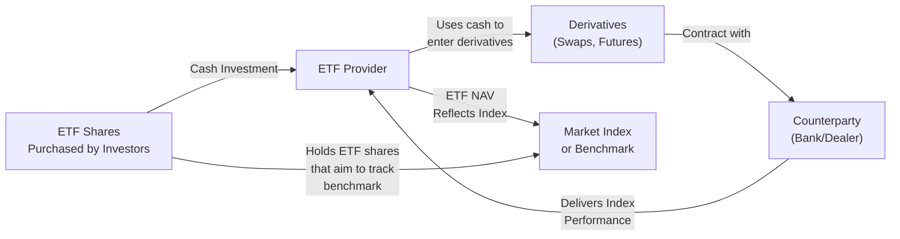

## 17.1 Introduction

Well, let's talk about derivative-based ETFs. Sometimes when I think about them, I remember the very first time I encountered an ETF that aimed to give two times the daily performance of some obscure market index. I remember thinking: “Wait, how can an ETF do that without just buying twice as many stocks?” It turned out they were using all sorts of derivatives—like futures, swaps, and options—to juice up their returns (or, you know, deliver a negative multiple). If you’ve been following along in this course, you already know that a derivative is a contract whose value is “derived” from an underlying asset. Combine that with the world of ETFs, and you can see the intriguing possibilities—and risks, of course.

This section introduces you to the realm of derivative-based exchange-traded funds. We’ll look at what they are, why they exist, and why you or your clients might be interested in them. We’ll also dip into the regulatory environment in Canada, emphasizing how the Canadian Investment Regulatory Organization (CIRO) and the Canadian Securities Administrators (CSA) ensure that, hopefully, no one strays too far into the danger zone without adequate disclosures and safeguards in place.

In a nutshell, a derivative-based ETF is an ETF that uses derivatives—futures, options, swaps, or some combination thereof—to mirror (or sometimes inversely mirror) the performance of an index, commodity, or other benchmark. Often these ETFs are chosen when physical replication (i.e., actually holding every security in the index) is downright impractical or even impossible. Synthetic replication can be a lot cheaper or more efficient in certain markets, like commodity futures for natural gas or agricultural products. Plus, derivative-based ETFs can offer leverage (two times or three times the market return), or the opposite of an index (short/inverse ETFs), making them appealing to certain investors who are comfortable with increased complexity and higher risk levels.

Below, we break down all the essential building blocks of derivative-based ETFs, from basic mechanics to the sometimes subtle pitfalls they can create in a portfolio. We’ll reference relevant Canadian regulations—like National Instrument (NI) 81‑102 and NI 81‑104—that influence product design, risk disclosure, and leverage limits. We’ll also touch on how the new rules from CIRO shape the day-to-day usage of these instruments and the ongoing compliance responsibilities faced by both advisors and investors.

### What Are Derivative-Based ETFs?

An ETF—short for exchange-traded fund—is usually a diversified basket of securities designed to track a particular index or asset class. Traditional ETFs physically hold the stocks or bonds that make up an index. But derivative-based ETFs might, for instance, hold only a handful of futures contracts or swaps coupled with some cash or collateral, rather than the underlying assets themselves. This approach is called synthetic replication.

Synthetic replication lets the ETF “mirror” the returns of a benchmark, but it also introduces some unique elements:
• Counterparty risk due to reliance on swap or futures counterparties.  
• Potential tracking error if the derivatives exposure drifts from the index.  
• Different tax treatment (depending on the jurisdiction and structure).  
• Sometimes more complexity in daily operations, especially if the ETF uses daily rebalancing to maintain leverage or inverse exposure.

#### Why Do ETFs Use Derivatives?

1. Physical Replication Isn’t Feasible in Certain Markets  
   Some indices track commodities—for example, agricultural commodities such as wheat, corn, or soybeans. It’s not exactly practical for an ETF to stash piles of wheat in a warehouse (though physically backed precious metal ETFs do exist for gold and silver). Futures-based approaches can replicate commodity exposures while avoiding some of the operational headaches, like storage and insurance costs.

2. Cost Efficiency  
   When an index has many small, illiquid securities or is geographically diverse, physically replicating that index can be expensive. Futures, options, and swaps may allow an ETF manager to gain broad exposure more cheaply, hopefully passing cost savings on to investors.

3. Leveraged and Inverse Exposure  
   Some ETFs intentionally provide returns that are, say, two times (2×) the daily performance—or negative one times (–1×)—of an index. Accomplishing that with only physical holdings is tricky. Derivatives make it easier: The fund manager can use swaps or futures to amplify or invert the returns in a cost-effective manner, although there can be substantial risk here if the market swings abruptly.

4. Access to Niche Markets  
   Not all market segments are easy to hold. Think about foreign markets with complex ownership rules or currency controls, or specialized markets like volatility futures. In those cases, derivatives might be the only feasible route for an ETF wanting to track a particular market segment.

### How Do Derivative-Based ETFs Work?

Before diving into more nuanced examples, let’s outline a general structure showing how a derivative-based ETF might be cobbled together:

1. Investors buy shares in the ETF, giving the manager cash.  
2. The manager then enters into derivatives contracts (e.g., total return swaps) with counterparties like major banks or investment dealers.  
3. The counterparty is obligated (for a fee) to deliver the performance of the underlying benchmark.  
4. The ETF’s net asset value (NAV) should, in theory, reflect the performance of the target benchmark, minus fees and expenses.  
5. Investors hold ETF shares, which trade on an exchange, just like any other stock or ETF.

### Common Motivations for Derivative-Based Structures

• Lower Tracking Error: When physical replication is tough, derivatives might track the index more closely.  
• Commodity Exposure: Hard-to-hold commodities (like crude oil, wheat, coffee) can be accessed with futures-based ETFs.  
• Leveraged/Inverse Plays: Offering amplified or inverse returns can be a big draw for certain short-term or tactical strategies.  
• Execution Efficiency: With a single contract or a small basket of swaps, an ETF can replicate the performance of a large, possibly international index.

### Key Risks and Considerations

Anytime you add derivatives to the mix, you add complexity and unique risks:

**Counterparty Risk**  
When you enter a swap or other derivative contract, there is always the risk that the counterparty—often a bank—could default on its obligations. Most derivative-based ETFs mitigate this by requiring collateral to be posted or by spreading risk across multiple counterparties. Still, it’s a factor that purely physical ETFs just don’t have to worry about (though physical ETFs have their own forms of custody risk).

**Tracking Error and Transaction Costs**  
Even though synthetic replication can be efficient, there is still the possibility that the derivative-based returns deviate from the actual benchmark. This might be due to imperfect hedge ratios, mispricing in futures markets, or higher expenses from rolling futures positions. Transaction costs such as roll-over costs in commodity futures can also erode performance.

**Leverage and Volatility**  
Leveraged and inverse ETFs typically rebalance daily to maintain a constant leverage ratio or inverse multiple. This daily reset can cause path dependency—meaning the performance over a longer period might differ significantly from a simple two or three times multiple of the index’s longer-term returns. If markets are volatile, you can even see “volatility decay,” where the daily leverage resets can degrade performance relative to what an investor might intuitively expect.

**Regulatory and Disclosure Requirements**  
Derivatives usage triggers extra scrutiny and regulation. In Canada, the CSA publishes guidelines under NI 81‑102 (Investment Funds) and NI 81‑104 (Commodity Pools) concerning the usage of derivatives in mutual funds and ETFs, including leverage limits, disclosure standards, and other operational constraints. On top of that, CIRO sets margin and reporting requirements for member firms that trade these products or recommend them to clients.

**Structure Risk**  
A derivative-based ETF might layer several structures at once (for example, a leveraged commodity ETF that also invests globally). The more layers, the bigger the potential chain of complexities. Each layer (from currency hedging to commodity roll strategies to swap financing) might add fees, risk, or potential points of failure.

### Regulatory Landscape in Canada

You’ll recall that historically, Canadian investment dealers were regulated under IIROC—the Investment Industry Regulatory Organization of Canada—and mutual fund dealers under the MFDA. As of January 1, 2023, these two organizations amalgamated into the Canadian Investment Regulatory Organization (CIRO). All references to IIROC and MFDA are purely historical now; in the present (2025), CIRO is the national self-regulatory organization overseeing investment dealers, mutual fund dealers, and market integrity.

CIRO’s Derivatives Rules  
CIRO imposes margin requirements and guidelines regarding ethical distribution of these instruments, as well as setting the bar for product suitability. Under those guidelines, advisors must ensure they truly understand the derivative-based ETF’s structure, daily resets (if any), leverage, and potential for abrupt losses. In practice, that might mean verifying that a client’s risk profile aligns with holding a 3× leveraged natural gas ETF—especially when natural gas prices can double or halve in mere months.

CSA Guidance  
The Canadian Securities Administrators (CSA) cover many aspects of fund regulation, including derivative-based ETFs, through their national instruments. Products that use complex strategies (like commodity exposures, cryptos, or inverse features) often come under the “alternative fund” or “commodity pool” classifications in NI 81‑104. Key points of focus include:

1. Levels of allowed leverage and use of derivatives.  
2. Disclosure about potential volatility and the daily compounding effect of leveraged/inverse funds.  
3. Requirements for ongoing risk monitoring and compliance.  

It’s crucial for any firm or advisor involved in recommending derivative-based ETFs to thoroughly review these guidelines and keep up with any changes. Non-compliance can result in fines or even suspension of the firm’s ability to offer such products.

### Margin Requirements

Because derivative-based ETFs carry embedded leverage (e.g., futures or total return swaps), margin requirements typically reflect the risk that these leveraged exposures could lead to more significant intraday or overnight price moves. CIRO’s margin rules outline how much capital must be posted to support leveraged or inverse ETF positions. If an ETF is simply using a plain vanilla swap to replicate an index, margin might be modest. But in more volatile underlyings or higher leverage multiples, margin rates can be much higher.

A real-life example:  
• A 2× leveraged gold-miners ETF might require a margin deposit from investors that is substantially larger than the deposit for a non-leveraged broad equity market ETF. That’s because gold-mining stocks themselves can be quite volatile, and layering 2× leverage on top multiplies that risk for the investor and, by extension, for the clearing firm.

### Daily Resets and Path Dependency

One aspect that often catches investors off guard is the rebalancing mechanics of leveraged/inverse ETFs. For example, if an ETF promises to deliver 2× the daily performance of an index, it must rebalance daily to maintain that 2× ratio. Over time, this compounding effect can create a mismatch between the leveraged ETF’s total return and 2× the total return of the index over the same period. The difference can sometimes be beneficial if the market trends steadily in one direction, but jarring if the market is volatile and oscillates.

Here’s a simplified example:

• Assume an index starts at 100. On Day 1, it gains 10%, rising to 110. A 2× leveraged ETF might go up 20%, from $100 to $120 overall. On Day 2, if the index drops 5% from 110 back to 104.5, that’s a 5% decline. But the ETF would decline roughly 10% from $120, thereby dropping to $108. If you compare the index’s total change (from 100 to 104.5) to that of the 2× ETF (from 100 to 108), you might see differences once you do the math, especially over multiple days with more volatility.

This phenomenon is important to grasp. Advisors and investors who fail to recognize the daily reset mechanics could be in for a surprise when they compare actual returns over a few months to the simple arithmetic of “double the index.”

### Practical Example: Commodity Exposure Through Derivative-Based ETFs

Maybe you’d like exposure to natural gas. Gas can be notoriously hard or expensive to store physically, and shipping it around in tankers or pipelines can be complicated. A derivative-based ETF might use near-month natural gas futures. Every month, it “rolls” its position to the next contract when the soon-to-expire contract nears delivery. If gas futures are in contango—where the next-month contract is priced higher than the current—this roll can impose a drag on returns. Conversely, if futures are in backwardation—where next-month prices are lower—rolling might create a small tailwind.  

Over time, the shape of the futures curve (contango or backwardation) can significantly impact a commodity ETF’s performance. That’s part of the reason we highlight how “simple” exposure isn't always so simple once derivatives enter the picture.

### Potential Benefits

Despite all the complexities, derivative-based ETFs remain popular for many reasons:

• Diversification: They let you access markets or asset classes you might otherwise skip.  
• Tactical Tools: Leveraged/inverse ETFs might be used for short-term hedging, speculation, or “satellite” positions around a core portfolio.  
• Cost and Liquidity: Sometimes it’s cheaper to trade a single derivative-based ETF than to buy and store a bunch of commodities or foreign securities.  
• Transparency: In many ways, an ETF’s daily disclosure of holdings (or at least indicative holdings) is more transparent than some old-school, actively managed funds.

### Suitability and Sales Practices

From a compliance standpoint, advisors must be diligent in evaluating whether derivative-based ETFs fit a client’s risk profile, net worth, and objectives. Because these products can magnify losses, CIRO rules require thorough KYC (Know Your Client) procedures, risk disclosure, and possibly even additional sign-offs for complex or alternative strategies. In certain instances, advisors could be expected to put in place disclaimers or have clients sign off that they understand how daily leverage resets can work.

For do-it-yourself investors, it’s still essential to self-educate or consult a professional. Opening an online brokerage account and hitting “buy” on a 3× leveraged biotechnology ETF might sound bold and exciting, but the potential for rapid losses is equally high if the underlying index doesn’t move as hoped.

### Additional Resources

• CIRO website (https://www.ciro.ca)  
  – For official guidelines on margin requirements, conduct rules, client disclosures, and continuing education related to derivatives.  

• Canadian Securities Administrators (https://www.securities-administrators.ca)  
  – Offers insight into NI 81‑102 (Investment Funds) and NI 81‑104 (Commodity Pools).  
  – Tracks policy developments in derivative usage by Canadian investment funds.  

• National Instrument 81-102, 81-104  
  – 81‑102: Main framework for mutual funds and ETFs, including certain derivative restrictions.  
  – 81‑104: Additional rules for commodity pools and alternative funds that can take on higher risk or more complex structures.  

• CFA Institute (https://www.cfainstitute.org/)  
  – Offers open-source learning materials on ETF mechanics, derivatives usage, and portfolio management.  

• “Exchange-Traded Funds and the New Dynamics of Investing” by Ananth Madhavan  
  – A comprehensive look at the mechanics, structure, and regulatory aspects of ETFs, including in-depth discussions of derivative-based approaches.  

### Closing Thoughts

Derivative-based ETFs truly illustrate how the evolution of financial technology can open new markets to everyday and institutional investors alike. However, they can be complicated. You might want to double-check the fine print on daily resets, watch out for contango in commodity ETFs, and ensure you’re not overextending on margin. In my opinion, these tools can be fantastic in the right hands but somewhat disastrous if misunderstood or misapplied. As always, a balanced approach—plus plenty of research—can help you make more informed choices.

Never forget the golden rule: If you don’t fully understand how an investment product achieves its returns, step back and do more homework before diving in. With that in mind, let’s continue to refine our knowledge of derivatives in various contexts, building up the expertise that ensures the best use and recommendation of these powerful instruments.

---

## Sample Exam Questions: Derivative-Based ETFs Introduction



### Which of the following best describes the main characteristic of a derivative-based ETF?

- [ ] It holds physical shares of the underlying index it tracks.
- [x] It uses swaps, futures, or other contracts to replicate index performance.
- [ ] It fully eliminates counterparty risk through diversification.
- [ ] It always charges lower fees than a similar physical ETF.

> **Explanation:** A derivative-based ETF relies on futures, swaps, and similar contracts to replicate the performance of an index or asset class, unlike a physically replicated ETF that directly holds the underlying.

### When discussing a 2× leveraged ETF, which statement best describes the daily reset mechanics?

- [ ] There is no daily reset; it automatically tracks 2× the monthly index returns.
- [ ] It rebalances every quarter to maintain leverage.
- [x] It rebalances daily to achieve approximately 2× the index’s daily return.
- [ ] It changes leverage only on trading days with significant volatility.

> **Explanation:** Leveraged (and inverse) ETFs typically reset their leverage ratio every single trading day to maintain the promised daily multiple.

### What is a major regulatory consideration for advisors recommending derivative-based ETFs in Canada?

- [ ] Advisors only need to disclose annual fees.
- [ ] Advisors can bypass margin requirements if the client has strong credit.
- [x] Advisors must ensure the product aligns with the client’s risk profile per CIRO rules.
- [ ] Advisors are required to limit client allocations to 10% of net worth.

> **Explanation:** CIRO’s regulations, alongside the broader Canadian Securities Administrators’ guidelines, emphasize suitability analysis for each client, ensuring that derivative-based ETFs fit the client’s risk tolerance and objectives.

### What is the primary driver behind “tracking error” in derivative-based ETFs that use futures contracts for exposure to commodities?

- [ ] Perfect hedging ensures they rarely deviate in performance.
- [ ] Physical commodity storage eliminates costs.
- [x] Rolling futures positions and changes in the futures curve can introduce performance variations.
- [ ] Transaction costs are absent in synthetic structures.

> **Explanation:** When an ETF uses futures, rolling positions forward each month (or each contract period) can create gains or losses due to contango or backwardation, producing tracking error.

### Why might an investor choose a derivative-based ETF instead of a physically replicated ETF?

- [ ] To avoid all possible fees and trading costs.
- [x] To gain exposure to hard-to-hold assets or to use leverage/inverse strategies.
- [ ] Because there are zero risks involved in synthetic replication.
- [ ] Because physical verification of holdings is always unreliable.

> **Explanation:** Derivative-based ETFs often serve as a gateway to commodities or markets that are cumbersome to hold physically, and they facilitate leverage or inverse exposure more efficiently than physical replication.

### Which of the following statements is correct regarding margin requirements for a 3× leveraged ETF?

- [x] They are generally higher than a non-leveraged ETF due to greater volatility risk.
- [ ] They are identical to any ETF if it tracks the same index.
- [ ] They can be waived altogether by the ETF provider.
- [ ] They only apply if the investor has insufficient collateral for the underlying index.

> **Explanation:** Because leveraged ETFs amplify movements, they usually carry higher margin requirements, reflecting the increased potential for large drawdowns in volatile conditions.

### In what market condition might an investor in a leveraged commodity ETF be most negatively affected by daily resets and compounding?

- [x] In volatile, sideways (oscillating) markets with frequent price reversals.
- [ ] In a steadily upward-trending market.
- [ ] When markets are closed on weekends.
- [ ] When the investor also holds physically replicated ETFs.

> **Explanation:** The daily reset can cause the leverage factor to re-multiply gains or losses each day, and in choppy or sideways markets, this repeated exposure can cause volatility decay over time.

### Which Canadian regulatory instrument specifically addresses commodity pools and alternative funds?

- [ ] NI 81-101
- [ ] NI 31-103
- [x] NI 81‑104
- [ ] NI 54-101

> **Explanation:** NI 81‑104 sets out the rules and requirements for commodity pools and alternative funds that can use more complex or higher-risk strategies, such as extensive derivatives.

### What role does CIRO play in overseeing derivative-based ETF trading?

- [ ] CIRO has no jurisdiction over derivative products.
- [ ] CIRO provides direct guarantees against losses for investors.
- [ ] CIRO only collects trade data for historical reporting.
- [x] CIRO enforces margin rules and suitability standards for investment dealers trading these ETFs.

> **Explanation:** CIRO, formed from the amalgamation of IIROC and MFDA, is the self-regulatory organization in Canada responsible for overseeing investment dealers, including compliance with margin and sales practice rules related to derivative-based ETFs.

### True or False: Leveraged and inverse ETFs will guarantee the exact multiple of the underlying index returns over a long-term holding period.

- [ ] True
- [x] False

> **Explanation:** Leveraged and inverse ETFs aim to provide a multiple (or opposite multiple) of an index’s performance on a daily basis, but over longer periods, the effects of daily compounding often produce results that deviate from a simple multiple of the index’s total return.


