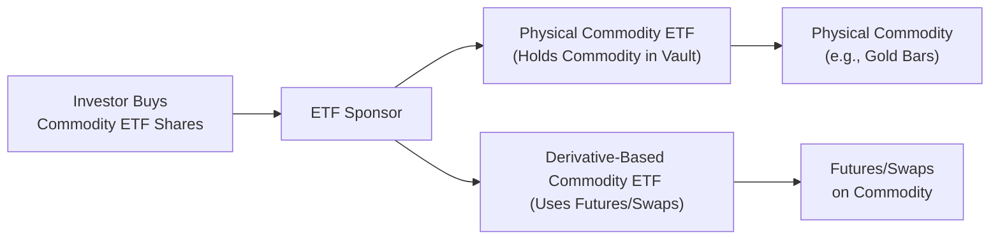
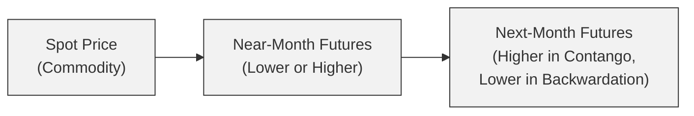

## 17.2 Commodity ETFs

Commodity exchange-traded funds (ETFs) are a popular way for investors to gain exposure to physical commodities—such as gold, oil, and natural gas—or to entire commodity indexes, without the complexities of storing or insuring the underlying assets themselves. They come in a variety of structures and investment approaches. Some Commodity ETFs hold physical commodities (for example, gold stored in a vault), while others rely on derivatives like futures or swaps to replicate the commodity’s price behavior. In Canada specifically, these ETFs face additional regulatory and disclosure requirements, which help protect investors but also add extra layers of complexity.

Maybe it’s helpful to think of Commodity ETFs like a bridge: They connect the everyday investor to the world of commodities that might otherwise seem distant or inaccessible. Let’s explore the diverse structures of Commodity ETFs, the pros and cons, and the key concepts (like contango and backwardation) that you absolutely should know before jumping in.

---

## Overview and Key Motives

One of the biggest draws of Commodity ETFs is diversification. Commodities often behave differently from equities and bonds—think about how gold prices sometimes rise when equity markets tumble. By blending a Commodity ETF into a portfolio, an investor can potentially reduce overall volatility and maybe benefit from inflation-hedging characteristics. Investors also like that Commodity ETFs are comparatively straightforward to trade, usually with lower transaction costs than, say, buying physical gold bars.

But Commodity ETFs aren’t just about diversification. Some investors want a place to park their money when they’re worried about inflation. If inflation is high, the cost of raw materials may rise, so owning a Commodity ETF that tracks those rising materials might cushion the blow to a broader portfolio. Of course, we’re dealing with markets that can be extremely volatile (oil and agricultural products, for example, have historically large price swings). So it’s not a one-size-fits-all solution.

---

## Physical vs. Derivative-Based Commodity ETFs

Though there are many variations, Commodity ETFs typically follow one of two main approaches: holding the commodity outright (“physical”) or using derivatives (like futures or swaps).

### Physical Commodity ETFs

A physical commodity ETF literally holds the underlying commodity in storage or custody. Precious metals like gold and silver can be stored in vaults, making it relatively straightforward for an ETF sponsor to manage. An example would be a gold bullion ETF, which might store gold bars in a secure vault, then issue shares that represent slices of that gold stash. These ETFs track the spot price of the commodity closely (minus management fees and expenses like insurance).

• Advantages:  
  – Direct ownership of the underlying asset.  
  – Closer tracking to spot prices, especially for metals like gold, silver, or platinum.  
  – No rolling of futures contracts, so less complexity with contango or backwardation.

• Disadvantages:  
  – Storage and insurance costs might reduce returns.  
  – Certain commodities (e.g., crude oil) are less practical to store physically, so this approach isn’t always available.

### Derivative-Based Commodity ETFs

Many Commodity ETFs rely on futures contracts or total return swaps to replicate the performance of a particular commodity or commodity index. For instance, a crude oil ETF might buy long positions in near-month futures contracts on WTI (West Texas Intermediate) oil and roll them forward at regular intervals.

• Advantages:  
  – Access to commodities that are challenging to store physically.  
  – Potential for leveraged or hedged positions.  
  – Flexibility in exposure: can be single-commodity or basket-of-commodities driven.

• Disadvantages:  
  – Subject to contango or backwardation, which can generate negative or positive roll yields.  
  – Counterparty risk with swaps or other over-the-counter derivatives (though centrally cleared futures mitigate some default risk).  
  – Possibly higher management complexity and trading costs.

Below is a simplified diagram of how Commodity ETFs can be structured, emphasizing both the physical and the derivative-based approaches:

From the investor’s perspective, both types of ETFs trade similarly on exchanges. However, how they achieve their performance goals will differ under the hood.

---

## Contango, Backwardation, and Roll Yield

When you hear folks talk about Commodity ETFs that rely on futures, the words “contango” and “backwardation” might come up. In short:

• Contango is when the futures price is higher than the spot price (or higher than a nearer-month future). Imagine you’re in an “expensive rent” environment, so to speak, if you’re constantly renewing.  
• Backwardation is the opposite scenario, where the futures price is lower than the spot or nearer-month contract.

When an ETF’s strategy involves periodically rolling over futures (letting the old contracts expire and purchasing new ones), the difference between the old contract’s settlement and the new contract’s purchase price can create a “roll yield.” Contango often leads to a negative roll yield—since you’re selling your expiring contract at a lower price and buying the next contract at a higher price. Backwardation can generate a positive roll yield—like picking up a bit of profit as you move from cheaper futures prices back to higher spot markets or at least closing out a contract at a higher price and repurchasing a cheaper future.

Here’s a visualization that might help:

• **Contango:** If C (the next-month futures) is priced above B (the near-month futures), rolling might incur a cost (negative roll yield).  
• **Backwardation:** If C is cheaper than B, rolling might result in a gain (positive roll yield).

### Example of Contango in Action

Let’s say an oil ETF invests in WTI futures. The near-month contract is trading at US$80 per barrel, but next month’s contract is at US$82. When the fund rolls forward (selling the $80 contract that’s expiring and buying the $82 contract for the next month), it has to pay an extra $2 per contract, which can erode returns over time if this pattern persists.

### Example of Backwardation in Action

If the near-month WTI contract trades at $80, but the next-month contract sits at $78, the ETF sells its near-month contract (at $80) and buys the new contract at $78, effectively pocketing the $2 difference. That difference is often referred to as a positive roll yield.

---

## Risks and Rewards of Commodity ETFs

### Potential Benefits

1. **Diversification**: Commodities often have low correlation to stocks and bonds, especially during certain market regimes.  
2. **Inflation Hedge**: Commodity prices frequently rise along with inflation, helping protect purchasing power.  
3. **Accessibility**: ETFs list on stock exchanges, so you can buy them in a regular brokerage account during normal trading hours.  

### Potential Risks

1. **Volatility**: Commodities can be whipsawed by geopolitical events, hurricanes, droughts, or production cuts, leading to dramatic price swings.  
2. **Tracking Error**: Futures-based ETFs may not perfectly match the spot price, especially if there is persistent contango.  
3. **Currency Risk**: Many commodities trade in U.S. dollars. If you’re a Canadian investor and your ETF doesn’t hedge currency exposures, exchange rate fluctuations (CAD to USD) may impact returns.  
4. **Regulatory/Tax Complexity**: Canada imposes additional disclosure requirements for Commodity ETFs (e.g., NI 81-104 for commodity pools); also, the tax treatment on returns can differ from equity-based ETFs.  

Occasionally, I’ve met investors who put a substantial portion of their portfolio into a single Commodity ETF—like a friend of mine who was absolutely convinced that gold was going to skyrocket. It seemed like an easy bet at first, especially with inflation on the rise. But guess what? Markets can move unexpectedly, and if you’re too concentrated, you might see bigger losses than you’re comfortable with. The moral? Diversify wisely, and keep your risk tolerance in check.

---

## Regulatory Framework in Canada

Commodity ETFs in Canada must comply with the guidelines set out by the Canadian Securities Administrators (CSA). Some important references here include:

• **NI 81-104**: Canadian rules for Commodity Pools.  
• **CIRO Oversight**: As of 2023, the Canadian Investment Regulatory Organization (CIRO) is the self-regulatory body overseeing investment dealers and marketplace integrity. This replaced the former IIROC and MFDA.  
• **CDCC**: The Canadian Derivatives Clearing Corporation (https://www.cdcc.ca) clears and settles derivative contracts like futures and options in Canada.  

Additionally, prospectus disclosures for Commodity ETFs in Canada are typically quite detailed. Sponsors must clarify whether they use physical holdings or derivatives, outline the specific risks related to contango/backwardation, and detail any hedging strategies. For instance, if an ETF invests in U.S. crude oil futures, the prospectus might note whether CAD/USD currency exposure is hedged to reduce currency-related fluctuations for Canadian investors.

Finally, from a suitability standpoint, under CIRO guidelines, any advisor recommending a Commodity ETF should assess a client’s investment objectives, risk tolerance, and how the ETF might fit into their overall portfolio. That’s especially true if the commodity involved has a particularly volatile past or if the client is already overexposed to certain sectors.

---

## Practical Considerations and Examples

### Storage and Delivery Issues

When dealing with physically backed metal ETFs, vault storage is typically straightforward (albeit with ongoing insurance costs). Agricultural or energy commodities are more difficult to physically store. Imagine an ETF sponsor trying to warehouse bushels of wheat or barrels of oil. Operationally, that’s not a piece of cake. Hence, many agricultural and energy funds rely on futures.

### Currency Fluctuations

If you invest in a commodity priced in U.S. dollars—crude oil, for instance—and hold an unhedged Canadian dollar ETF, your return will be influenced by the USD/CAD exchange rate. If the U.S. dollar drops in value against the loonie, your returns might be lower than the actual price appreciation of oil in USD terms. Some ETFs do hedge currency risk, but there’s a cost to that hedging, which might reduce performance if the currency doesn’t move as expected.

### Diversification and Correlation

One of the big selling points is that commodities tend to have correlations to equities that can vary widely. Within commodities, correlations differ, too—energy markets might behave differently than agricultural goods. During certain periods (e.g., an economic slowdown), multiple commodities might drop in tandem if global demand shrinks. Correlation can be tricky, so always remember that historical correlation patterns can shift.

### Example: Gold as an Inflation Hedge

Gold bullion ETFs are a classic example in Canada; they typically hold physical gold in vaults and track the spot gold price. Because gold is seen as a store of value, some investors use these ETFs as an “insurance policy” for their portfolio. If inflation goes up or if the stock market dives, gold prices might spike. However, it’s not guaranteed. Gold can underperform during times when investors shift to riskier assets or if interest rates rise significantly (since holding gold yields no interest).

---

## Case Study: The “Oil Roll” Experience

To illustrate how contango might impact returns:

• Suppose an ETF invests exclusively in near-month WTI crude oil futures.  
• Spot WTI is US$75. The near-month contract is slightly higher, at US$76. Next month’s contract is at US$78 (contango).  
• The ETF will wait until near-month expiry, then sell the $76 contract and buy the $78 contract.  
• That +$2 difference might not seem like a lot in isolation, but over multiple roll periods—especially if contango persists—it leads to higher costs. You might notice that the ETF’s returns lag behind the spot price movement of oil.  

Similar but opposite mechanics happen when the market is in backwardation. An investor who feels demand for immediate oil is strong might expect backwardation to persist, in which case rolling forward each month could actually yield incremental gains.

---

## Suitability and Best Practices

Commodity ETFs can play a valuable role in a well-diversified portfolio. With that said, here are some best practices:

• **Quantify Exposure**: Decide how much commodity exposure makes sense, given your willingness to accept volatility.  
• **Check the Expense Ratio**: Derivative-based ETFs might engage in more frequent trading, pushing costs higher.  
• **Understand Roll Strategies**: If you’re in a futures-based ETF, read up on its rolling methodology—some use monthly rolls, others might spread out the roll over a few days to reduce impact.  
• **Assess Currency Risk**: If you’re a Canadian investor, figure out if the ETF hedges currency exposure or if you’re comfortable taking on CAD/USD fluctuations.  
• **Watch for Regulatory Changes**: CSA or CIRO requirements may evolve over time, possibly impacting the permitted leverage or derivative usage in these products.  

I recall sitting down with a relative who was super excited about a “corn ETF.” They’d heard that crop shortages might push corn prices higher. However, after a few months, the global corn market changed, plus they lost money from negative roll yield. That relative discovered the hard way that limited knowledge of rolling futures can put a damper on an otherwise good directional trade idea.

---

## Glossary Highlights

• **Contango**: A market condition where futures prices exceed the expected spot price at contract maturity, potentially causing negative roll yield.  
• **Backwardation**: A condition in which futures trade below the expected spot price at contract maturity, which can create a positive roll yield.  
• **Roll Yield**: The gain or loss that arises when an expiring futures contract is sold and the next futures contract is purchased.  
• **Physical Commodity Holding**: The direct ownership of commodities (like gold bullion), held as the ETF’s assets.  
• **Hedging Costs**: Expenses associated with mitigating currency or volatility risks, which can affect ETF performance.  
• **Correlation**: A statistical measure of how two securities move relative to each other. Commodities often have different price drivers than equities or bonds, giving them diversification potential.

---

## Additional Resources

• Bourse de Montréal (https://www.m-x.ca) – Offers details on commodity derivative products in Canada, including contract specifications.  
• Canadian Derivatives Clearing Corporation (CDCC): https://www.cdcc.ca – Clearing and settlement of futures and options.  
• CSA Notices on commodity pools and NI 81-104 – Regulatory framework for funds involved in commodity markets.  
• “The Fundamentals of Commodity Futures Returns” by Gary Gorton and K. Geert Rouwenhorst – A scholarly article explaining key drivers of commodity futures returns.  
• CIRO (https://www.ciro.ca) – Canada’s self-regulatory organization overseeing investment dealers.

---

## Sample Exam Questions: Commodity ETFs Fundamentals



### When dealing with contango, which of the following is most likely to occur for a futures-based Commodity ETF when rolling contracts?

- [ ] It will consistently profit from each roll.
- [ ] It faces no impact from changes in futures prices.
- [x] It may incur negative roll yield if the next-month futures price is higher than the expiring contract.
- [ ] It only benefits from interest rate increases.

> **Explanation:** In contango markets, the next futures contract is priced higher than the expiring one, which can create a cost to roll (negative roll yield).

### Which of the following is a key advantage of physically backed Commodity ETFs?

- [ ] They always outperform spot prices.
- [ ] They use minimal storage or insurance.
- [ ] They avoid all trading costs and fees.
- [x] They generally track the spot price more closely, without roll yield issues.

> **Explanation:** Physical holding of a commodity (e.g., gold in vaults) means the ETF tracks the spot price closely, since it does not need to roll futures contracts.

### Which Canadian regulatory guideline specifically governs Commodity Pools?

- [ ] NI 81-101
- [ ] NI 81-102
- [x] NI 81-104
- [ ] NI 81-107

> **Explanation:** NI 81-104 provides rules for Commodity Pools in Canada, regulating investments that track or use commodities and related derivatives.

### A Commodity ETF that holds gold bullion in a vault and issues shares representing portions of that bullion is referred to as:

- [x] A physically backed Commodity ETF.
- [ ] A total return swap-based Commodity ETF.
- [ ] A leveraged Commodity ETF.
- [ ] A synthetic Commodity ETF.

> **Explanation:** Storing gold bullion directly indicates a physically backed ETF structure.

### In a market experiencing backwardation, rolling to the next-month futures contract will most likely:

- [x] Result in a positive roll yield.
- [ ] Have no effect on ETF performance.
- [ ] Result in a negative roll yield.
- [ ] Automatically reduce the ETF’s net asset value (NAV).

> **Explanation:** Backwardation means the next-month contract is cheaper than the current one, creating a potential gain when rolling forward.

### Which of the following is a potential downside of a physically backed Commodity ETF?

- [x] Storage and insurance costs may reduce net returns.
- [ ] It must roll futures contracts regularly, incurring roll yield.
- [ ] It has no correlation benefits with equities.
- [ ] It is not suitable for precious metals.

> **Explanation:** Holding a physical commodity incurs ongoing costs (such as vault fees and insurance) that can reduce overall performance.

### What is one key role of the Canadian Derivatives Clearing Corporation (CDCC)?

- [ ] Determining corporate actions for listed equities.
- [x] Providing clearing and settlement services for derivatives, including commodity futures and options.
- [ ] Setting federal tax rates on commodity transactions.
- [ ] Publishing daily commodity price indexes.

> **Explanation:** The CDCC is Canada’s central clearinghouse for exchange-traded derivatives, helping to manage counterparty risk and settle trades.

### If a Canadian investor buys a crude oil ETF denominated purely in USD without currency hedging, which risk factor must they also consider?

- [ ] That the ETF cannot be traded in Canada.
- [x] That fluctuations in the USD/CAD exchange rate could impact overall returns.
- [ ] That there is no correlation benefit from the commodity exposure.
- [ ] That the ETF is not regulated under NI 81-104.

> **Explanation:** Without currency hedging, the investor is exposed to USD/CAD fluctuations, which can materially affect the investment’s performance.

### Which of the following statements about Commodity ETFs is correct?

- [ ] They are completely free from CIRO or CSA oversight.
- [x] They can use futures or physical holdings to track commodity performance.
- [ ] They cannot offer any correlation benefits.
- [ ] They provide guaranteed returns above the spot market price.

> **Explanation:** Commodity ETFs commonly rely on either physical holdings or derivatives (futures, swaps) to replicate commodity returns.

### True or False: Under Canadian regulations, advisors must evaluate client suitability when recommending Commodity ETFs, especially given the volatility and unique risks involved.

- [x] True
- [ ] False

> **Explanation:** CIRO guidelines require that all investment product recommendations, including Commodity ETFs, must be suitable for a client’s financial objectives and risk tolerance.


