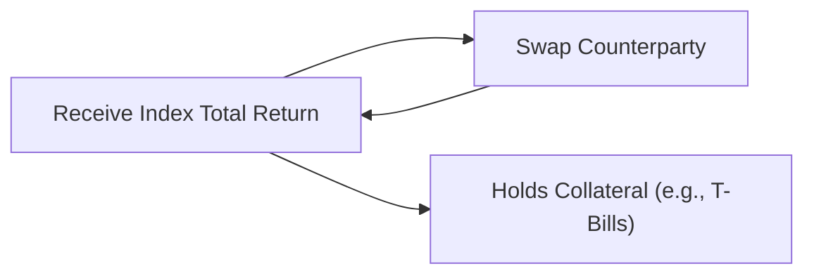
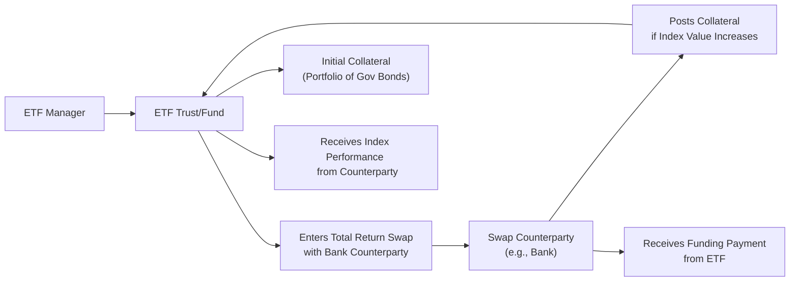

## 17.3 Swap-Based ETFs and the Synthetic Replication of Indexes

Swap-based exchange-traded funds (ETFs) have really picked up steam in recent years—especially in Canada—because they offer a nifty way to replicate an index using derivatives. The phrase “swap-based” might sound intimidating, but the basic idea is pretty straightforward: instead of owning all the individual stocks (or bonds) that make up an index, the ETF enters into a contract—often a total return swap (TRS)—with a counterparty, like a bank or a large financial institution. With that setup, the ETF aims to get the exact performance of the target index minus a small fee. And that’s the “synthetic replication” part: you’re replicating the index through a derivative agreement, so you don’t need to buy all the stocks directly.

In this section, we’ll talk about what swap-based ETFs are, why they exist, how they work, the benefits and the pitfalls, and some real-world stories (and headaches) that come with them. We’ll also delve into Canadian-specific regulations, especially the guidelines from the Canadian Investment Regulatory Organization (CIRO) and the Canadian Securities Administrators (CSA). Then, we’ll wrap up with references, a short glossary, and a quick quiz for those of you who want to test your knowledge.

Feel free to treat this conversation like we’re just sitting for coffee, exploring the inner workings of finance in a fun, casual way. I might say “um” or “well,” from time to time—so hopefully you don’t mind that. And if anything feels confusing, don’t worry; we’ll break it down step by step.

---

## Understanding the Essence of Synthetic Replication

Alright, so synthetic replication is basically using derivatives (rather than physical securities) to replicate the performance of a benchmark index. If a Canadian equity index, for instance, has 200 constituents, holding them all physically can be expensive in terms of trading costs, custody fees, and potential foreign exchange complexities if it’s a global index. 

With synthetic replication, an ETF manager can skip the hassle of replicating the index’s holdings one by one. Instead, they enter into a swap contract, typically a total return swap (TRS). In a TRS, the ETF pays an agreed rate (often a short-term floating interest rate like CORRA or sometimes a fixed rate), and in exchange, the bank (the counterparty) pays back the total return of the index: price changes plus dividends.

You might hear the phrase “total return swap” and wonder: so, do we actually own the stocks? Typically, no. The ETF doesn’t own them physically—it relies on the swap. So, if the index goes up 5% plus a 2% dividend, the ETF’s net return should be 7% (minus any fees or costs of the swap). That means if you bought shares of the ETF, you get (theoretically) the index’s 7% total return.

---

## My First Encounter with Swap-Based ETFs (Anecdote)

I recall the first time I heard about swap-based ETFs, I was sipping coffee with a friend who was an ETF product specialist. She said something like, “You know, you don’t need to buy 1,000 different stocks around the world to replicate the MSCI All Country World Index—you can just do a swap.” And I was thinking, “Wait, so you never actually own any of these shares?” She gave me one of those knowing smiles and explained how the ETF invests its cash into highly liquid securities or government bonds as collateral, while simultaneously entering a swap to get the index performance. It all sounded very neat, but it also struck me: if the bank that’s on the other side of this swap fails, that could be a serious jam. That’s precisely the reason we talk so much about counterparty risk.

---

## Bringing Total Return Swaps to Life

Let’s get deeper into the mechanics of how total return swaps power these ETFs. 

A total return swap is simply a contract where:
• The ETF pays a funding rate to the counterparty (e.g., a short-term interest rate index plus a spread).  
• The counterparty delivers the total return of the specified index to the ETF.

If the index goes up, the ETF “receives” that upside from the bank. If the index goes down, the ETF actually owes that money to the swap provider (since the total return is negative). So effectively, the ETF’s returns are 100% dependent on the index’s performance—minus those swap costs.

### A Visual Overview of the Swap Structure

Below is a simple diagram to visualize how the swap flows might look. Let’s do a quick mermaid diagram to illustrate:

• A["Swap-Based ETF"]: The fund that wants to replicate the index performance.  
• B["Swap Counterparty"]: Typically a bank or a major financial institution.  
• The ETF pays an agreed funding rate to the counterparty. In exchange, the counterparty provides the total return of the index to the ETF.  
• The ETF also holds some form of collateral or invests in other instruments to secure the arrangement or earn minimal interest.

In many Canadian swap-based ETFs, the regulator (the CSA, in conjunction with CIRO guidelines) wants to ensure that if the counterparty defaults, investors aren’t left entirely in the lurch. Hence, you’ll see all sorts of collateralization requirements and daily or weekly resets to keep track of potential exposures.

---

## Why Use Swap-Based ETFs?

1. **Lower Tracking Error**  
   A classic frustration with physically replicated ETFs is “tracking error” (the difference between the ETF’s performance and the benchmark’s performance). Tracking error can come from transaction costs, dividend taxes, withholdings, rebalancing delays, or even liquidity gaps. Swap-based ETFs promise lower tracking error because the swap provider is contractually obligated to deliver the index return, basically plugging that gap.

2. **Cost Efficiency**  
   Think about the friction costs associated with physically holding 300 or 500 stocks. You’ve got brokerage commissions, potential foreign exchange conversions, custody fees in various international markets, and so on. With a swap-based approach, a single contract may replicate the entire index. That can lead to fewer overhead costs.

3. **Access to Exotic Markets**  
   If you want exposure to an index in emerging markets or in markets with capital controls or high transaction taxes, a swap-based structure might be more straightforward. The bank that’s providing the swap might already have the infrastructure, or might hedge exposures in a cost-effective manner behind the scenes.

4. **Tax Benefits** (in some jurisdictions)  
   This one’s a bit tricky, and it varies from place to place. Sometimes, synthetic replication helps minimize certain tax liabilities (like withholding taxes on dividends), but it depends heavily on local, national, and even cross-border tax treaties. Always check a specialist on that.

---

## Key Considerations: The Dark Side of Swap Structures

1. **Counterparty Credit Risk**  
   The big, glaring risk is always: “What if the swap provider goes bankrupt or defaults?” If something goes terribly wrong at the financial institution on the other side of the contract, the ETF might lose some or all of its promised returns. That’s why Canadian regulations set strict limits on how much one ETF can have in terms of net exposure to a single derivatives counterparty.

2. **Collateralization and Margin Calls**  
   To reduce that risk, swap contracts often include collateral arrangements. This means the bank posts securities or cash that the ETF can claim if the bank defaults. And vice versa: if it’s a negative performance environment, the ETF might have to post more collateral. This daily or periodic process keeps both parties “covered” in case the market moves unfavorably.

3. **Regulatory and Disclosure Requirements**  
   National Instrument 81-102 (Investment Funds) in Canada outlines how mutual funds and ETFs must handle derivatives. There are also rules about concentration risk—so an ETF can’t exceed certain thresholds with one single counterparty. You’ll also see plenty of discussions about “CIRO guidelines” for trade reporting, margining, and oversight. All these rules are crafted to ensure that an ETF is not taking on unmanageable risk.

4. **Complexity and Transparency**  
   With a regular equity ETF, you can just open the fund’s holdings list and see which stocks they own. With swap-based ETFs, the edible “wrap” is a derivative contract. If you’re new to the concept, it might feel less transparent. That’s why regulators demand robust disclosures in the ETF’s prospectus and continuous reporting. Typically, you’ll be able to read about the identity of the counterparty, how collateral is managed, and what the fees or swap spreads are.

5. **Liquidity of the Underlying Swap**  
   If the ETF wants to exit or roll the swap, it needs a liquid market for the underlying instruments or a functional relationship with the counterparty. Most large banks can handle that, but in times of crisis (or if you’re dealing with a niche index), liquidity can dry up quickly.

---

## Canadian Regulatory Framework

### CIRO (Canadian Investment Regulatory Organization)

On January 1, 2023, two legacy bodies—IIROC and the MFDA—amalgamated into what is now CIRO. As of 2025, CIRO is the main self-regulatory organization overseeing investment dealers, mutual fund dealers, and market integrity in Canada. This includes oversight of how derivative-based ETFs deal with compliance, reporting, margin, and so on. For official updates or resources, you can visit [ciro.ca](https://www.ciro.ca).

### CSA (Canadian Securities Administrators)

The CSA is an umbrella entity comprising provincial and territorial securities regulators. They interpret and implement National Instruments like NI 81-102, which sets out the parameters for investment fund operations. That means if you’re structuring a swap-based ETF, you’ve got to keep an eye on these guidelines for derivatives exposure, collateralization, and disclosure. The regulators also impose specific “concentration limits” that cap how much of a single issuer (including a bank as a counterparty) an ETF can have.

### National Instrument 81-102 Investment Funds

This national instrument is crucial reading if you’re launching or managing any ETF in Canada. It covers:  
• Investment restrictions  
• Concentration limits (i.e., how much exposure you can have to one particular issuer or derivative counterparty)  
• Rules on leverage and derivatives  
• Disclosure requirements related to fees, investment strategy, and risk  

For swap-based ETFs, you’ll typically see a thorough breakdown in the prospectus of how the fund deals with collateral, what the maximum limit of counterparty exposure is, and how often the collateral is marked to market.

---

## Breaking Down the Structure with a More Detailed Diagram

Let’s look at a more detailed flowchart that includes the collateral process. It often helps to see how the funds and the swap counterparties move collateral, especially if the index moves significantly in one direction.

1. The ETF Manager sponsors the fund.  
2. The fund (or trust) enters into a total return swap with the swap counterparty.  
3. The ETF invests its assets in short-term government bonds, T-Bills, or other approved collateral to help secure the trade.  
4. If the index rises, the counterparty owes the ETF that positive performance (and it must post additional collateral, if required, to secure that obligation).  
5. Simultaneously, the ETF pays the bank the negotiated funding rate.  
6. If the index goes down, the ETF essentially pays the negative performance to the bank (reducing or removing the collateral posted by the bank).

---

## Real-World Example: Simplified

Let’s say we’ve got an ETF that wants to track the S&P/TSX 60 Index. Instead of buying all 60 constituents, the ETF invests its subscription proceeds (the money from investors) in a basket of Government of Canada T-Bills. Then the fund signs a swap deal with a big Canadian bank. The deal might look like this:

• **ETF Pays**: 3-month T-Bill rate + 0.20% (annualized) on the notional.  
• **Bank Pays**: The total return (price & dividends) of the S&P/TSX 60 Index.  

So if the S&P/TSX 60 goes up 10% in a year and pays 2% in dividends, the bank owes the fund 12%. Meanwhile, the fund owes the bank T-Bill yield plus 0.20%. Let’s say T-Bill yield is 4%. Then the ETF owes 4.20%. So the net result for the ETF is roughly 12% - 4.20% = 7.8% (not counting transaction fees and rebalancing costs embedded in the swap). This can come very close to the actual index performance, minus slight “swap spread” or fees.

If the S&P/TSX 60 suffers a 5% decline plus 2% dividend yield (so net -3%), the ETF has to pay that -3% to the bank on the notional. Meanwhile, it still pays the T-Bill rate plus the 0.20% spread. In that scenario, the ETF would lose more or less 3% minus 4.20% = -7.2%, depending on the exact daily resets or monthly resets in the swap. Typically, the final net performance should align with the index’s total return (positive or negative), minus the swap costs.

---

## Potential Pitfalls and Risk Management

1. **Counterparty Default**  
   Honestly, that’s the Elephant in the Room. If the bank providing the swap defaults, the ETF might lose part of its expected returns until another counterparty can be found—or, in a worst-case scenario, the ETF may have direct financial losses if the posted collateral doesn’t cover everything.

2. **Collateral Mismatch**  
   Even though the ETF invests in T-Bills or other forms of collateral, the market value of that collateral can fluctuate. If the collateral doesn’t match the size of the swap exposure, you can get mismatches that cause losses.

3. **Regulatory Changes**  
   Regulations can and do change over time (see the recent shift from LIBOR to risk-free rates like CORRA). If regulators tighten the rules on how much swap exposure an ETF can have or if they adjust margin requirements, that can alter the cost of running a swap-based ETF.

4. **Market Stress Liquidity**  
   In times of market distress (like during the early days of the COVID-19 pandemic), banks might become more conservative, and it could be more expensive or more difficult to roll over swap agreements. Funding rates can spike, and that can eat into the performance or lead to unexpected tracking error.

---

## Compliance, Reporting, and Disclosure in Canada

Because swap-based ETFs heavily rely on derivatives, they must comply with certain reporting requirements:

- **CIRO Guidance**: Since CIRO is the prime self-regulatory body, it offers guidelines on how dealers (and by extension, fund managers) must report derivatives positions, margin usage, and net exposures.  
- **CSA Derivatives Framework**: Under instruments like National Instrument 94-101 (Mandatory Central Counterparty Clearing of Derivatives) and 94-102 (Derivatives: Customer Clearing and Protection of Customer Collateral and Positions), there are also potential clearing requirements for standardized derivatives. However, total return swaps used in ETFs often do not require central clearing if they are unique or bespoke.  
- **Prospectus Disclosure**: The ETF’s prospectus must clearly outline the risk factors, including details on the swap arrangement, the identity of the counterparty (if possible), collateral obligations, any potential “swap fees,” and what happens if the swap is terminated.

In practice, you’ll see statements like, “The fund may obtain exposure to the performance of [Index Name] through a total return swap with one or more counterparties. The fund’s aggregate exposure to counterparties will not exceed 10% of the fund’s NAV, calculated on [daily or weekly] basis,” reflecting the maximum thresholds under NI 81-102.

---

## Collateralization Structures

Collaterals in swap-based ETFs often take the form of:

- **High-Quality Government Bonds**: The usual suspects—short-term T-Bills, Government of Canada bonds, or provincial bonds with a high rating.  
- **Cash and Cash Equivalents**: Sometimes used to cover daily or intraday variation margin calls.  
- **Pledging or Title Transfer**: The mechanics can differ. Some setups require the counterparty to hold collateral in a segregated account, while other models call for daily margin calls to ensure the posted collateral is always adequate.

Essentially, the system is designed so that if one party can’t fulfill its obligations, the other party has direct recourse to the collateral. That’s the safety mechanism.

---

## Global Perspectives

Swap-based ETFs aren’t just a Canadian phenomenon. You’ll see them also in Europe (often called “synthetic ETFs”), in the U.S., and basically anywhere that sophisticated investors want to replicate an index cheaply. The general approach is similar, although local rules on derivative usage, taxes, and investor protection can vary.

In Europe, for instance, UCITS (Undertakings for Collective Investment in Transferable Securities) sets out rules for ETFs that limit counterparty exposure to 10% of the fund’s assets. In the U.S., the SEC has its own rules for derivatives usage in investment companies, focusing on limiting leverage and ensuring adequate asset coverage.

---

## Best Practices and Common Pitfalls

### Best Practices

- **Diversify Counterparties**: Don’t rely on a single bank for your entire swap exposure if you can help it.  
- **Daily Mark-to-Market**: Ensure the swap is marked daily or at least weekly to keep up with moves in the index.  
- **Robust Collateral Management**: Keep detailed processes for adjusting collateral when the index value moves or when the fund’s net assets change.  
- **Transparent Prospectus**: Spell out fees, potential conflicts of interest (like if the swap counterparty is an affiliate), and risk factors.

### Common Pitfalls

- **Ignoring Swap Spreads**: Yes, the index is up 10%, but maybe the swap spread is 1%. That’s quite a drag.  
- **Underestimating Liquidity Risk**: Rolling the swap, especially in stressed markets, might cost more than you planned.  
- **Operational Overload**: You need a robust back-office structure to handle margin calls, track collateral, and respond to corporate actions on the underlying index.  
- **Overlooking Regulatory Caps**: Violating NI 81-102’s limits on exposure or skipping required disclosures can trigger regulatory censure and potentially hamper an ETF’s operations.

---

## Potential Case Study: Hypothetical Market Turmoil Scenario

Imagine a scenario where the market is super volatile:

1. The underlying index has daily swings of ±5%.  
2. The ETF has a total return swap that resets weekly.  
3. Each time the index plunges, the bank demands more margin from the ETF to cover potential losses on the negative side.  
4. If the ETF can’t post the margin in time, it could be forced to unwind the swap partly.  
5. Meanwhile, the bank’s own credit rating is downgraded, meaning the ETF might want to find a new counterparty or ask for more robust collateral.  

In that environment, you can see the complexities—a far cry from the “buy and hold 60 stocks” approach. While synthetic replication can reduce certain types of friction, it introduces its own unique brand of risk management challenges!

---

## Further Resources and Reading

- **CIRO**: [https://www.ciro.ca](https://www.ciro.ca) – Canada’s self-regulatory organization.  
- **CSA**: [https://www.securities-administrators.ca](https://www.securities-administrators.ca) – Canadian Securities Administrators.  
- **National Instrument 81-102**: Searchable on official provincial securities commission websites (e.g., Ontario Securities Commission).  
- **ISDA (International Swaps and Derivatives Association)**: [https://www.isda.org](https://www.isda.org) – Great for understanding standardized swap documentation and definitions.  
- **“ETFs and Systemic Risks: A Handbook for Practitioners”** – In-depth book on how ETFs structure derivatives and potential systemic impacts.  
- **Open-Source Tools**: Platforms like QuantLib (C++) or Python-based libraries (e.g., Pyfolio, QuantStats) can be used to simulate swap strategies and track index replication performance.

---

## Closing Thoughts

Swap-based ETFs offer a powerful mechanism for replicating the performance of indexes, often with minimal tracking error. By entering into a total return swap, the fund sidesteps direct ownership of the underlying assets. The main payoff is cost savings, potentially better tax efficiency, and simpler access to exotic or complex markets. But with that also comes a set of unique challenges, especially revolving around counterparty credit risk, collateral management, and regulatory compliance.

If you’re someone—like many Canadians—who invests in ETFs, you might eventually stumble on one of these synthetic replication funds. It’s worth reading the fund’s prospectus carefully. Check who the swap counterparty is, how they handle collateral, and what the regulatory posture is. And always remember, while synthetic replication can help track an index effectively, it’s never risk-free—especially in volatile or stressed markets.

Anyway, that’s more or less the full tour of swap-based ETFs. In my opinion, they’re a fascinating evolution of modern finance. When used responsibly and under proper oversight, they can be phenomenal instruments. But as with anything in derivatives, the devil’s in the details. Let’s keep learning and exploring so we make the best-informed decisions possible!

---

## Sample Exam Questions: Swap-Based ETFs and Synthetic Index Replication



### Which statement best describes a key advantage of a swap-based ETF over a physically replicated ETF?

- [ ] It always has higher liquidity.
- [ ] It avoids all regulatory constraints imposed by National Instrument 81-102.
- [x] It can minimize tracking error by using a total return swap.
- [ ] It always provides a guaranteed return regardless of market conditions.

> **Explanation:** One major advantage of swap-based ETFs is their ability to reduce tracking error. Because the swap counterparty commits to delivering the index’s total return (in exchange for a funding rate), the ETF doesn’t have to physically replicate all the underlying securities.

### How does collateralization typically help manage risk in a swap-based ETF structure?

- [ ] It ensures the ETF can claim actual shares in the underlying index.
- [ ] It offers a direct guarantee that the ETF will never experience losses.
- [x] It reduces counterparty credit risk by giving the ETF access to posted assets if the counterparty defaults.
- [ ] It increases the ETF’s leverage, creating higher returns.

> **Explanation:** Collateralization means each party to the swap must post secure assets (cash, T-Bills, etc.) to offload the risk of default. If the swap counterparty can’t fulfill its obligations, the ETF can access the posted collateral.

### In a total return swap arrangement for a swap-based ETF, the ETF typically:

- [x] Receives the benchmark’s total return from the counterparty.
- [ ] Pays capital gains tax directly to the counterparty.
- [ ] Assumes ownership of the underlying stocks or bonds.
- [ ] Has no obligations or payments to the counterparty at all.

> **Explanation:** In a total return swap, the ETF receives the benchmark’s total return. In exchange, it pays the counterparty a floating or fixed rate as agreed in the swap contract.

### Which regulatory framework in Canada outlines investment restrictions and disclosure requirements for ETFs using derivatives?

- [ ] National Instrument 58-101
- [x] National Instrument 81-102
- [ ] National Instrument 94-101
- [ ] NI 31-103

> **Explanation:** National Instrument 81-102 (Investment Funds) sets the operational and disclosure requirements for Canadian mutual funds and ETFs, including those using derivatives.

### Why might a swap-based ETF have lower operational costs compared to a physically replicated ETF?

- [ ] It involves no management fees whatsoever.
- [ ] It never pays dividends to investors, reducing paperwork.
- [x] It likely doesn’t incur as many transaction or custody fees because it isn’t buying all the individual index components.
- [ ] It can defer paying any taxes indefinitely.

> **Explanation:** By using a swap contract, the ETF avoids physically holding each security in the index, thereby reducing many of the trading, custody, and rebalancing costs associated with traditional replication.

### What is one of the biggest concerns for investors when considering a swap-based ETF?

- [x] Counterparty credit risk if the bank or financial institution defaults.
- [ ] Lower market exposure to the target index.
- [ ] Being required to own physical gold as collateral.
- [ ] The absolute guarantee of zero tracking error.

> **Explanation:** Counterparty credit risk is often the largest concern with swap-based ETFs. If the swap provider fails and there isn’t adequate collateral, investors could take a loss.

### Under Canadian regulations, what limit might be placed on a swap-based ETF to control counterparty exposure?

- [ ] No more than 90% of the ETF’s net assets can be exposed to one counterparty.
- [ ] No more than 50% of the ETF’s net assets can be exposed to one counterparty.
- [ ] There are no limits on counterparty exposure in Canada.
- [x] A limit of up to 10% (or similar ratio) of the ETF’s net asset value can typically be exposed to one counterparty.

> **Explanation:** Under NI 81-102 and related rules, there are concentration limits that typically cap the exposure to a single derivatives counterparty (often around 10% of NAV, depending on the fund and the structure).

### When the index that a swap-based ETF tracks rises in value, how does this affect collateral requirements?

- [ ] The ETF’s manager must reduce the posted collateral immediately.
- [ ] Collateral requirements remain unchanged regardless of market movements.
- [x] The swap counterparty must often post additional collateral to secure its promise of paying the rising index return.
- [ ] The ETF loses voting rights to the underlying shares.

> **Explanation:** If the index goes up, the swap counterparty owes more money to the ETF. They might need to post additional collateral to secure that increased liability.

### Which of the following is a reason why swap-based ETFs may have favorable tax treatment in some jurisdictions?

- [ ] They are always domiciled in tax havens.
- [x] They may avoid certain withholding taxes or local transaction costs on foreign dividends.
- [ ] They automatically receive governmental tax credits equivalent to 30% of net returns.
- [ ] They are exempt from all forms of capital gains taxes.

> **Explanation:** Depending on local regulations and international tax treaties, synthetic replication can reduce foreign withholding taxes because the ETF isn’t directly holding the underlying dividend-paying securities. However, tax benefits vary by jurisdiction.

### Swap-based ETFs primarily replicate an index through:

- [x] Derivative agreements that exchange funding rates for index returns.
- [ ] Purchasing every security in the index.
- [ ] Direct ownership of physical commodities.
- [ ] Spot market transactions that settle same-day.

> **Explanation:** Swap-based ETFs form derivative agreements (often total return swaps) to receive the full economic performance of an index without physically holding all the constituent assets.


