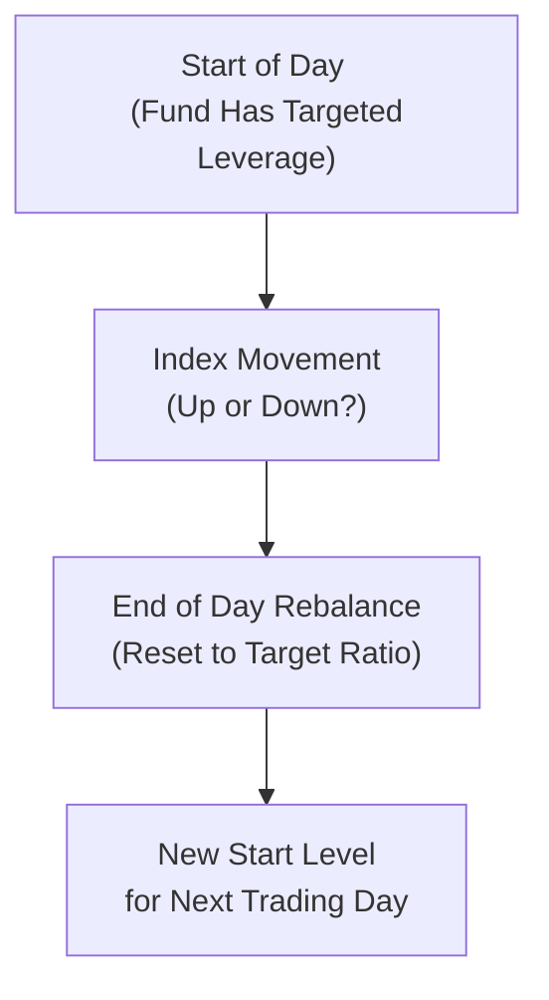

## 17.4 Leveraged and Inverse ETFs

Picture this: a friend of mine, let's call him Sam, got super excited after watching some market analysts predict a quick bounce in the technology sector. He thought, “Why buy a regular tech ETF if I can potentially get 2× or 3× the returns in the same amount of time?” So, Sam jumped into a 2× leveraged technology ETF. Initially, it was all celebrations—Sam saw big moves in a single day, and it seemed like a piece of cake. But then a streak of volatile days hit. The index dipped, then it bounced, then dipped again. Sam’s leveraged fund was rapidly rebalanced each day, compounding small losses into bigger drawdowns. Within a couple of weeks, his ETF’s performance had badly trailed the simple 2× “naïve” multiple he hoped for. If I ever saw a mix of excitement, frustration, and confusion all rolled into one, that was Sam’s expression.  

That, in a nutshell, highlights both the attraction and the potential hazard of leveraged (and inverse) ETFs. They’re fancy expansions of more standard benchmark ETFs—like a standard index fund that invests in a specific basket of stocks. But leveraged or inverse siblings go further. They rely heavily on derivatives—like swaps, futures, and options—to target a daily performance that’s a multiple (or the reverse) of what the underlying index achieves.  

It’s no secret that some people love them for the possibility of amplified returns. Others use them for short-term hedging, perhaps when they anticipate the market might head south. But daily compounding and frequent rebalancing can make long-term results deviate sharply from a simple “2×” or “−1×” pattern (i.e., a perfect doubling or a perfect mirror). We’ll explore why and how that happens, along with regulatory guidelines and best practices for anyone who decides to dip a toe in these choppy waters.

## The Basics of Leveraged and Inverse ETFs

Leveraged and inverse ETFs both attempt to replicate some multiple or inverse multiple of an index’s daily returns:

• A 2× leveraged ETF aims to produce roughly double the daily performance of an index.  
• A 3× leveraged ETF aims for three times.  
• A −1× inverse ETF attempts to deliver the opposite daily return (often referred to as a “short” ETF).  
• A −2× or −3× inverse ETF tries to double or triple the inverse daily performance.

They accomplish these goals by entering short-term derivative contracts—such as swaps, futures, or options. The weighting of these instruments is adjusted daily (“reset”) to maintain the fund’s targeted leverage ratio.  

### Why Daily Returns Matter

Unlike a buy-and-hold strategy that might keep leverage constant over a longer period, leveraged and inverse ETFs are designed to deliver a specific multiple for just one trading day. At the end of each day, they “reset.” That means, on Day 2, the fund starts fresh, rebalancing its notional exposure to achieve (say) 2× again for that day alone. This daily reset structure is crucial: it enables the fund to consistently maintain the promised multiplier day after day. However, it also leads to a phenomenon known as the compounding effect.

## The Daily Reset and Compounding Effect

Let’s say we’re dealing with a 2× leveraged ETF. Suppose on Monday, the underlying index moves up 10%. A 2× leveraged ETF might then move up about 20%. So far, so exciting! Then, come Tuesday, the index dips 9%. At first glance, Sam might think: “Well, up 20% and down 18% (2× the 9% dip) is a net 2% gain over two days,” right? Actually, no. Because the ETF was reset at the end of Monday, the “base” for Tuesday’s decline is now 120% of what it was initially. So a 9% drop from a higher base can wipe out more than you’d guess.  

By the time you do the actual math:  
• End of Monday (ETF up 20%): 1.00 × (1 + 0.20) = 1.20.  
• End of Tuesday (index down 9%, ETF roughly down 18%): 1.20 × (1 − 0.18) = 1.20 × 0.82 = 0.984.  
So, over two days, the ETF is almost a negative 1.6%, whereas the underlying index’s net change might be minimal.  

That’s the compounding effect at work. Up and down fluctuations over consecutive days can lead to returns far different from a simple linear forecast. If you hold the ETF over a longer stretch (weeks, months), the difference can become particularly large, especially in volatile markets.

#### A Visual Peek at Daily Rebalancing

Below is a simplified Mermaid diagram showing daily recalibration:

On each new day, the leveraged or inverse ETF begins fresh, aiming to achieve a precise multiplier of the index’s performance for that single session.

## Common Uses and Short-Term Focus

People typically use leveraged or inverse ETFs for short-term strategies, such as:

• Taking a fast bullish or bearish stance without putting up a lot of capital.  
• Hedging a position in an existing portfolio for a day or two, anticipating a near-term reversal or correction.  
• Attempting to capitalize on intraday or very short-term market momentum.  

Because of the daily reset mechanism, most regulatory authorities, including the Canadian Investment Regulatory Organization (CIRO) and the Canadian Securities Administrators (CSA), strongly caution that these funds are not really for buy-and-hold investing over the long haul. You’ll see disclaimers like “For short-term use only” or “May not be suitable for all investors.”  

Could an experienced trader try to hold these for longer periods? Possibly. But it often requires frequent monitoring and maybe quick adjustments to preserve the intended exposure. Even if you’re not day trading, you might monitor the position weekly or monthly (or sometimes daily) to ensure you’re still aligned with your goals.  

## Regulatory Environment in Canada

CIRO is now the integrated self-regulatory organization that oversees investment dealers and mutual fund dealers in Canada. With the CSA, they outline regulations for all sorts of ETFs, including leveraged and inverse products. Key focuses include:

• Prominent risk disclosure: Fund prospectuses must highlight the potential for rapid losses and the performance discrepancy when held for more than a day.  
• Derivative usage guidelines: These ETFs must comply with derivative rules, margin requirements, and collateral obligations—ensuring they have enough liquidity and diversification in their positions.  
• Suitability standards: Advisors have a regulatory obligation to ensure that a leveraged or inverse ETF is appropriate for the client’s risk tolerance and investment objectives. For a typical retail client with a medium- or long-term focus, these products might not be suitable at all.  

If you’re curious about the official stances, you can check out relevant CSA Staff Notices (for instance, Staff Notice 81-101 or 81-102 dealing with investment funds) that discuss leverage, short-selling within ETFs, and the associated constraints. Meanwhile, the Bourse de Montréal (Montréal Exchange) offers some derivative tools and sets contract specifications for futures-based leveraged structures. Their website (https://www.m-x.ca) is a good resource if you want to see how futures can create leveraged exposures.

## Risk Factors and Best Practices

### Volatility and Amplified Losses

Volatility is your friend when markets go the way you want, but it’s a fierce enemy when they don’t. Because leveraged ETFs multiply an index’s daily moves, any volatility in the underlying index triggers greater fluctuations. If the index sees a roller-coaster ride, the leveraged or inverse ETF sees an even wilder roller coaster—like a roller coaster strapped to a rocket.

### Daily Reset “Trap”

One subtle trap is the daily reset. Investors who figure that a 2× leveraged ETF will just return 2× the underlying index’s total return over time risk disappointment. The next day’s moves are always calculated off the new “reset base,” and over time, large up-and-down swings can cause significant tracking divergence.  

### Suitability Concerns

A lot of people love the idea of quick doubling. But we have to ask: “Do you understand how it works over multiple days?” In Canada, CIRO now enforces KYC (Know Your Client) rules that push advisors and dealers to really ensure the theoretical investor recognizes the short-term nature and significant risk. If your friend or client wants stable, buy-and-hold growth, a leveraged ETF might be an ill fit.

### Margin Impact

Leveraged ETFs themselves have built-in leverage. That means, from a margin requirement standpoint, the position might be subject to higher margin or other restrictions under Chapter 23 (Client Margin Requirements). Remember, when you buy (or short) an ETF with leverage, you’re effectively dealing with extra volatility. Your dealer might require more cushion to handle potential losses.

### Monitoring and Rebalancing

If you do hold a leveraged or inverse ETF beyond one day, it typically requires frequent monitoring. Some folks might adopt a daily or weekly rebalancing approach on their end too—essentially resetting their own overall portfolio exposures. That might mean selling or buying units to keep the exposure from drifting away from the planned level. But that triggers transaction costs, potential tax consequences, and, obviously, an ongoing time commitment.

## Practical Scenarios

It might help to see how these funds behave in a straightforward, hypothetical scenario. Let’s break it down:

#### Scenario: Trending Market

Suppose the underlying index consistently rises 1% per day for five consecutive days—let’s ignore real-world overnight changes for simplicity. Over five days, that’s a total approximate gain of 5.1% for the index, because each day’s 1% is compounding on the previous day’s gains.

For a 2× leveraged ETF, you might assume that it should be up around 10.4% (simply 2× 5.1%). But daily resets mean each day you’re taking 2× the new daily gain. In a steadily rising market, the compounding effect can *enhance* total returns, because you’re consistently leveraging an ever-larger base. In that best-case scenario, you might see even more than 10.4%.  

#### Scenario: Sideways and Volatile Market

Now imagine a whipsaw: +2% on Monday, −2% Tuesday, +3% Wednesday, −3% Thursday, and so on. Each day’s leveraged gain or loss is calculated off the prior day’s adjusted level. Over time, you might find the leveraged ETF’s net result is negative, even if the underlying index remains close to the same price it started with.  

This is exactly why many disclaimers say, “Due to the daily reset and compounding, returns for periods greater than one day may differ significantly from the performance of the underlying index multiplied by the stated leverage or inverse factor.”

## Common Pitfalls

- **Buy-and-Forget:** Placing your funds in a leveraged or inverse ETF and leaving it for months can lead to huge tracking errors.  
- **Ignoring Volatility:** Even if your directional forecast is correct over a long stretch, large swings can eat away your gains.  
- **Unrealistic Expectations:** Many folks see the “3×” label and assume “I’ll get triple the S&P 500 returns this year.” Then they don’t read the daily reset disclaimers.  
- **Trading on Margin**: Attempting to purchase these funds on margin can double up on leverage, intensifying risk.  

## Real-World Examples and Resources

• **CSA Staff Notices**: These outline best practices and rules for ETFs using leverage or short-selling.  
• **Bourse de Montréal**: Offers futures-based strategies that form part of certain leveraged ETF portfolios.  
• **Academic Research**: For instance, the paper “Do Leveraged and Inverse ETFs Affect Underlying Stock Volatility?” looks at whether these funds impact the volatility of underlying markets.  
• **Online Courses**: Multiple global platforms like Coursera or edX provide simulation tools to see how daily resets can magnify or erode performance. It can be enlightening to watch how a theoretical 2× or −2× fund evolves day by day under different scenarios.  

Regulatory and product structures can vary outside of Canada, but the general mechanics of leveraged and inverse ETFs remain the same. Keep in mind that the Canadian market might have stricter guidelines on portfolio concentration, asset coverage, and derivatives usage. If you’re an advisor or an advanced investor, you can check the simplified prospectus for each ETF, often found on the issuer’s website, to see the product’s precise derivative-based strategy and disclaimers.

## A Note on Hedging

Sometimes investors ask, “Could I just buy a −1× inverse ETF instead of shorting the market?” Indeed, an inverse ETF is one potential way to attempt short exposure without opening a separate margin account for short sale. But you still face daily reset risk, so it’s typically only a good solution for short-term hedges. If you’re looking for a longer-term hedge, standard approach might involve directly shorting essential indices or using index put options. You could also consider protective puts or other option strategies we’ve discussed in earlier chapters.  

## Ongoing Suitability and Advisor Responsibilities

Under CIRO regulations, an advisor must ensure a product suits a client’s situation. Suitability requires answering real questions like:

• Does the client fully grasp daily resetting and compounding effects?  
• Does the client have the risk tolerance to stomach large daily fluctuations?  
• Is this a short-term objective, like a hedge or a quick speculation?  
• Can the client handle the possibility of sharp margin calls if leveraged ETFs are held on margin?  

Advisors also must uphold the general standards of practice set out by CIRO, including the Code of Ethics. This includes an obligation to properly disclose and explain risk. If you’re working with an advisory firm, there might be specific oversight or sign-off needed before you can trade leveraged or inverse products.

## Diagrams and Tables

For those who love visuals, you can build a quick table showing how a 2× leveraged ETF might perform over five days of random index movements compared to a “simple 2×” calculation. Notice how the final result can differ drastically, purely because of day-by-day compounding.

| Day | Index Daily Move | Index Value* | ETF Daily Move (2×) | ETF Value** | Simple 2× Calculation (Hypothetical) |
|-----|------------------|--------------|---------------------|------------|--------------------------------------|
| 0   | --               | 100.00       | --                  | 100.00     | --                                   |
| 1   | +3%              | 103.00       | +6%                 | 106.00     | 106.00                                |
| 2   | −2%              | 101.00       | −4%                 | 101.76     | 103.92 (if using 2× total move)      |
| 3   | +4%              | 105.04       | +8%                 | 109.90     | 108.08                                |
| 4   | −1%              | 104.00       | −2%                 | 107.70     | 106.22                                |
| 5   | +2%              | 106.08       | +4%                 | 112.00     | 110.47                                |

\* Simplified daily changes, ignoring any compounding in the index for clarity.  
\** Each calculation is relative to the previous day’s ETF value, then the position is “reset.”  

In the “ETF Value” column, you might see final figures that differ from the last column’s simple 2× assumption. Even small day-by-day differences can accumulate over time.

## Additional Tips and Observations

• If you’re new to leveraged or inverse ETFs, consider practicing in a paper-trading account or simulator first.  
• Keep a close watch on daily volume and liquidity. Some leveraged ETFs can be thinly traded, increasing bid-ask spreads.  
• Keep an eye on the fund’s management fee (MER). Leveraged products tend to have higher operating expenses because they require active management and daily rebalancing. Over time, fees can bite into returns.  
• If the market’s direction isn’t strongly trending, you might find the daily reset even more punishing due to frequent up/down market swings.  

## Final Thoughts and Encouragement

Leveraged and inverse ETFs can be thrilling because they put a magnifying glass over whatever volatility is out there. You can either see bigger gains or face bigger losses. But, as my friend Sam found out, these funds can also lead to unexpected outcomes if you hold them too long or if markets get choppy.  

Anyway, I recommend you treat these ETFs with respect. Acknowledge they’re typically a short-term tool. Study up on how they work, monitor positions carefully, and always confirm that they serve your real objectives—like a short-term hedge or a short-term directional bet. If that’s your plan, they can be powerful. If you’re seeking a standard buy-and-hold strategy, well, you might consider other chapters in this book for more stable approaches.

---

## Sample Exam Questions: Leveraged and Inverse ETFs



### Which statement best describes the daily compounding effect in a 2× leveraged ETF?

- [ ] It allows the ETF to perfectly track twice the index return over any time horizon.  
- [ ] It only impacts ETF performance if the market moves down.  
- [x] It can cause ETF returns to differ significantly from a simple 2× multiplier over multiple days.  
- [ ] It reduces volatility in the ETF.  

> **Explanation:** Due to resetting each day, a 2× leveraged ETF can end up with gains or losses significantly different from a simple linear calculation over multi-day periods.

### What is one key reason that leveraged and inverse ETFs often rely on swaps, futures, or options?

- [ ] To avoid all Canadian margin requirements.  
- [x] To achieve the continuous realignment needed to meet the daily leverage or inverse objective.  
- [ ] To take advantage of lower management fees.  
- [ ] To ensure they can hold underlying stocks directly.  

> **Explanation:** These ETFs typically use derivative contracts like swaps and futures to rapidly adjust exposures each day. Holding actual index components alone rarely achieves the daily leverage or inverse target effectively.

### When might an investor consider an inverse ETF over a direct short sale of the underlying index?

- [x] If the investor wants a short-term hedge without opening a margin short position.  
- [ ] If the investor seeks a guaranteed profit in volatile markets.  
- [ ] If the investor plans a buy-and-hold approach for steady gains.  
- [ ] If the investor wants to reduce daily rebalancing costs.  

> **Explanation:** An inverse ETF can offer a “short” exposure for a brief period, without needing a margin account. But it’s not guaranteed to be profitable and may not be suitable for long-term holding.

### Why do many regulatory bodies, including CIRO, emphasize that leveraged and inverse ETFs are not typically suitable as long-term holdings?

- [ ] Because management fees for leveraged ETFs are usually 0%.  
- [x] Because the daily reset mechanism creates compounding effects that diverge from expected returns if held long term.  
- [ ] Because these products are always illiquid.  
- [ ] Because they track global equity indexes exclusively.  

> **Explanation:** Daily resets are key. Over time, compounding effects can steer performance away from the perceived multiple, especially in volatile markets.

### Which of the following best defines “daily reset” in the context of leveraged and inverse ETFs?

- [ ] A mandatory daily dividend payout to investors.  
- [x] Rebalancing the fund’s derivative positions at the end of each trading day to maintain a target multiplier.  
- [ ] Suspending trading each day to reduce volatility.  
- [ ] Issuing new shares whenever the fund’s NAV declines.  

> **Explanation:** The daily reset involves adjusting the ETF’s notional exposure daily so it repeatedly meets its published leverage or inverse ratio.

### What is the primary reason an investor in a leveraged ETF might face higher margin requirements?

- [ ] The fund is guaranteed to outperform the index.  
- [x] The product’s volatility is amplified, leading dealers to protect against rapid drawdowns.  
- [ ] Leveraged ETFs are not recognized by CIRO.  
- [ ] Margin regulations treat leveraged ETFs as risk-free securities.  

> **Explanation:** Since leverage amplifies daily movements, brokers and dealers often require higher margin as a cushion against potentially larger losses.

### Which statement is true regarding a −1× inverse ETF?

- [ ] It tracks a full-year inverse index performance every day without rebalancing.  
- [x] It attempts to replicate the opposite of the index’s daily return, resetting its position at the end of each trading day.  
- [ ] It is an ideal buy-and-hold investment for conservative long-term investors.  
- [ ] It eliminates portfolio volatility entirely.  

> **Explanation:** An inverse ETF seeks the opposite return of an index daily. It is not a “buy-and-hold” product and must rebalance at day’s end to maintain its stated objective.

### If the underlying index experiences big swings—up 5% one day and down 5% the next—a 2× leveraged ETF will:

- [ ] Perfectly track 2× the cumulative move.  
- [ ] Always end up double the index’s final two-day position.  
- [x] Likely underperform a simple 2× multiple over those two days due to the compounding effect.  
- [ ] Always outperform a simple 2× multiple.  

> **Explanation:** Large back-and-forth movements can cause a leveraged ETF’s results to drift below the expected multiple because losses on a higher base can outweigh gains on a lower base or vice versa.

### Which feature of leveraged and inverse ETFs is most critical for an advisor to explain to clients before recommending them?

- [ ] The wide availability of redemption options.  
- [x] The impact of the daily reset and compounding on multi-day performance.  
- [ ] The fact that they track private equity returns.  
- [ ] That they carry no risk and are guaranteed.  

> **Explanation:** The daily reset is the main driver of why leveraged/inverse ETFs can act unpredictably over several days or weeks, so it’s vital to explain that factor.

### True or False: Leveraged and inverse ETFs typically hold their entire basket in common stocks of the underlying index, with no derivatives or leverage measures involved.

- [ ] True  
- [x] False  

> **Explanation:** By definition, these ETFs use derivatives (like futures or swaps) to achieve the magnified or inverse daily exposure. They do not simply hold stocks on a one-to-one basis.


