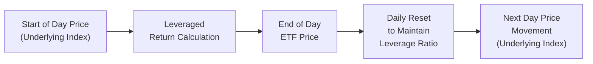

## 17.5 Risks of Daily Resets in Leveraged ETFs (Path Dependency)

Have you ever bought something that seemed like a shortcut—like a neat hack that promised big results but came with a catch? Leveraged Exchange-Traded Funds (ETFs) can sometimes feel exactly like that. They promise to multiply gains (or losses) relative to the underlying index. In principle, you might see an ETF advertised as “two times” (2×) or “three times” (3×) the returns of a given benchmark. And you might think, “Great! If the index goes up 10%, I’ll be up 20% or 30%.” But—ah—things are never that simple. The secret lies in how these products are rebalanced each day, leading to something known as “path dependency.”  

Ultimately, path dependency means the final outcome of your investment doesn’t only depend on where the market ends up, but it also hinges on the sequence of daily moves. This phenomenon can cause a leveraged ETF to provide markedly different returns from what you’d expect if you simply multiplied an index’s total return by the product’s leverage ratio. Let’s explore why.

–––––––––––––––––––––––––––––––––––––––––––––––––

### The Concept of Path Dependency
Path dependency describes a situation in which the outcome is shaped not just by the final state but by the journey taken—and in finance, the sequence of returns can have a huge impact. Most leveraged ETFs reset their leverage daily. That means each morning, the fund manager adjusts the portfolio so that the ETF maintains a consistent leverage ratio (like 2× or 3×). If it does this every day, your returns compound in a way that’s heavily influenced by how the market moves on a day-to-day basis.

• If you have a strongly trending market, you might reap outsized returns.  
• If you have a choppy, volatile market, you might see a slow erosion of value even if the index itself doesn’t move much overall.

This interplay between daily resets and compounding is the essence of path dependency. The path the market takes—up one day, down the next, up again, and so on—can have a materially different impact on your final returns than a simple buy-and-hold approach with an unleveraged product.

–––––––––––––––––––––––––––––––––––––––––––––––––

### Why Do Leveraged ETFs Reset Daily?
It might sound cumbersome to recast or rebalance the portfolio every day, but that’s exactly how these funds maintain their stated leverage ratio. Let’s say the ETF is designed to provide 2× the daily returns of the S&P/TSX 60 Index in Canada. If the index moves up or down on a particular trading day, the ETF must adjust its holdings at the close of that day—or at the start of the next day, depending on its methodology—to ensure it can deliver 2× the next day’s returns again.  

Because the underlying assets (often futures, swaps, or other derivatives) have daily price changes, the leveraged ETF has to adjust margin levels and positions to keep the leverage ratio consistent. This daily resetting mechanism is essential, but it’s also the root cause of the compounding effect that can lead to big discrepancies from an intuitive “2× total returns” expectation over longer periods.

–––––––––––––––––––––––––––––––––––––––––––––––––

### A Hypothetical Example of Path Dependency
Let’s consider a simple (and slightly exaggerated) example to illustrate how daily resets can create performance divergence.

Suppose we have a leveraged ETF that tracks the “ABC Index” at 2× leverage. We start with 100 CAD invested in both the index (unleveraged) and the leveraged ETF on Day 0.

• Day 1:  
  – The ABC Index rises by 10%.  
  – Unleveraged value: 100 CAD → 110 CAD.  
  – The 2× leveraged ETF should rise by about 20%.  
  – Leveraged ETF value: 100 CAD → 120 CAD.

So far, so good. On Day 1, the leveraged ETF is performing exactly as expected (2× the daily return).

• Day 2:  
  – The ABC Index declines by 9.09%. Why 9.09%? Because when you lose 10% from 110 CAD, that index goes down to 100 CAD again.  
  – Unleveraged value: 110 CAD → 100 CAD (effectively back to break-even).  
  – The 2× leveraged ETF should drop approximately 18.18%. But 18.18% of 120 CAD is about 21.82 CAD.  
  – Leveraged ETF value: 120 CAD → 98.18 CAD.

Notice that the unleveraged position ended up at 100 CAD, while the leveraged position ended up at 98.18 CAD. Even though the net change in the index over the two days is 0% (it went up 10% then down about 9.09% to end where it started), the leveraged product is now at 98.18 CAD, which is a -1.82% net loss over the two-day period.

This difference is due to the sequence of returns—that day one gain followed by day two’s slightly smaller percentage drop (but from a higher asset base). In real life, of course, daily changes can be more complex, and this compounding effect can get magnified over time.  

It might not seem like much in two days, but what if the market whipsaws for weeks—or months?

–––––––––––––––––––––––––––––––––––––––––––––––––

### Volatility Drag: When Choppiness Hurts
In a volatile environment, these daily resets can accelerate the fund’s losses. The phenomenon is sometimes called “volatility drag.” If the underlying index experiences big swings—up 5%, down 4%, up 6%, down 3%, up 2%, and so on—the leveraged product repeatedly gains and loses from fluctuating asset bases. Over time, it can get whittled down more than you’d expect.  

Path dependency means that if the daily sequence is chaotic, the final result often suffers. Yes, you can still have positive returns during a volatile market if the net trend is upward enough—but the daily rebalancing means an investor might see significantly less than simply “2× the overall index gain.”

–––––––––––––––––––––––––––––––––––––––––––––––––

### Opportunity in Trending Markets
However, let’s talk about the flip side. If the underlying index is on a low-volatility upward tear, or in other words, it’s steadily going up day after day (or consistently enough), the compounding effect can actually boost returns beyond what you’d expect from just 2× the net index performance. The daily resets allow the ETF to compound on each day’s gains.  

• Example:  
  – Suppose an index goes up 5% each day for five days (yes, that’s a big assumption!). The 2× leveraged ETF might do significantly better than just “2× 25%” = 50%. It could actually exceed 50% because each day’s 2× gain is stacked upon the prior day’s higher base.

In simpler terms, daily rebalancing in a strongly trending market with moderate volatility can lead to a phenomenon sometimes described as a compounding “tailwind.” If you catch the right wave, your leveraged ETF might overperform in a big way.

–––––––––––––––––––––––––––––––––––––––––––––––––

### A Quick Mermaid Diagram of Daily Reset Mechanics

Below is a simplified flowchart that outlines the daily reset process for a leveraged ETF:

• “Start of Day Price (Underlying Index)” is the opening reference point for the underlying asset or index.  
• “Leveraged Return Calculation” means the ETF applies its leverage factor (e.g., 2× or 3×) to that day’s movement.  
• “End of Day ETF Price” is the closing valuation after the leverage factor is applied.  
• “Daily Reset to Maintain Leverage Ratio” means the portfolio is rebalanced to restore or maintain the targeted leverage.  
• “Next Day Price Movement (Underlying Index)” starts the cycle all over again, which leads to potential compounding effects day by day.

–––––––––––––––––––––––––––––––––––––––––––––––––

### Real-World Observations
Let me share a personal anecdote. A friend of mine, who was navigating the markets during a pretty wild summer, bought a 2× leveraged energy sector ETF. He was all excited because he thought, “When oil prices rebound, I’ll make double (maybe triple!) what I’d make in a normal energy ETF.” Then the market gyrated—energy prices soared one week, collapsed the next—and after a few months, he looked at his balance and realized it was down significantly, even though oil was roughly where it had been when he first invested.  

He asked me, “How does that make any sense?” I gently explained, “It’s path dependency—those daily swings dragged the overall return downward.” This is a prime example of how leveraged products can mystify people when the underlying isn’t trending cleanly.  

–––––––––––––––––––––––––––––––––––––––––––––––––

### Risk Management and Suitability
Because of path dependency, leveraged ETFs are typically best suited for short-term trading strategies, tactical exposures, or hedges. Many providers and regulators caution that they’re not usually appropriate for a straightforward “buy-and-hold” portfolio, especially if your holding period extends beyond a few days or weeks.

• Advisors often emphasize product suitability and risk. You should consider daily monitoring or frequent re-evaluation if you hold these products, especially in volatile markets.  
• Watch the underlying benchmark’s stability. If it’s a calmer, trending environment, maybe you’ll be lucky. But if you sense volatility might go up or the market might whipsaw, you might need to dial back your exposure or exit entirely.

That’s also why Canadian regulatory bodies require fund companies to clearly disclose these risks in their prospectuses and marketing materials. According to the rules established by the Canadian Securities Administrators (CSA) and overseen by the Canadian Investment Regulatory Organization (CIRO), investors must be informed about the potential for performance divergence due to daily resets.

–––––––––––––––––––––––––––––––––––––––––––––––––

### Communication with Clients
If you’re an advisor or a financial service professional looking to recommend leveraged or inverse ETFs to your clients, you have a clear obligation to explain path dependency. The key is transparency.  

• Demonstrate how a leveraged ETF might behave over a single day vs. several days or weeks.  
• If possible, present a chart or table of hypothetical returns that show the potential disparity between the index’s net change and the ETF’s leveraged performance.  
• Emphasize that these products are generally for short-term or tactical moves, not for broad, long-term exposure.  

Keep in mind that CIRO reminds advisors of their responsibilities under current client relationship models (CRM), which emphasize risk disclosure, transparent fees, and firm margin guidelines. Providing real-life scenarios and referencing easy-to-use simulators, like Portfolio Visualizer or other free online tools, can help illustrate the phenomenon of path dependency under different volatility conditions.

–––––––––––––––––––––––––––––––––––––––––––––––––

### Divergence from Long-Term Buy-and-Hold
Because the leveraged ETF rebalances every day, it doesn’t track the performance of an underlying index over a longer period in a linear manner. Instead, it focuses on that index’s daily performance and compounds from there.  

• Over a multi-week or multi-month horizon, your final return can differ drastically from “2× or 3×” the index. Sometimes it can be better (in a low-volatility bull market), but often it’s worse (in a volatile, sideways market).  
• Investors might find that even though the index is back to the same spot, they’ve lost money due to the repeated drawdowns and rebalancings.  

Daily resets can also generate rebalancing costs and transaction fees for the ETF provider, which can translate into higher expense ratios for you, the investor, further pressuring your returns.

–––––––––––––––––––––––––––––––––––––––––––––––––

### Canadian Regulatory Context
CIRO (formerly IIROC and MFDA, now merged) imposes rules and guidelines to ensure that firms offering leveraged ETFs disclose path dependency. The CSA, through its National Instrument frameworks (like NI 81-102 for investment funds), sets guidelines on how these products are structured and marketed. The Ontario Securities Commission (OSC) regularly publishes “Investment Funds Practitioner” notices, which often detail the complexities of daily leveraged products and remind firms of the importance of plain-language risk disclosure.  

A few key points from recent regulatory updates:  
1. **Transparency of Risk**: Prospectuses must highlight the possibility of compounding-driven divergence.  
2. **Leverage Caps**: Products that exceed certain leverage thresholds may be subject to additional restrictions.  
3. **Suitability Requirements**: Dealers and advisors must ensure that the leveraged ETF is consistent with the client’s risk tolerance and investment time horizon.  

For more official guidance, see the notices from CIRO at https://www.ciro.ca and CSA bulletins at https://www.securities-administrators.ca.

–––––––––––––––––––––––––––––––––––––––––––––––––

### Additional Reading and Tools
If you’d like to explore path dependency further or run your own simulations:

1. **Portfolio Visualizer (https://www.portfoliovisualizer.com)** – Offers backtesting tools where you can simulate leveraged ETF strategies under various scenarios, including changes in volatility or daily returns.  
2. **Academic Papers** – Look for articles like “Daily Leverage Certificates and Path Dependence” in risk management journals, which provide theoretical discussions about the compounding effects in daily leveraged products.  
3. **CIRO & CSA Websites** – Check the updated bulletins for any changes in leveraged product regulation or disclosures.  
4. **OSC Investment Funds Practitioner Notices** – Great for clarifying how Canadian regulators expect fund providers to manage and disclose compounding and path dependency in their fact sheets and marketing materials.

–––––––––––––––––––––––––––––––––––––––––––––––––

### Realistic Case Study: An Energy ETF
Let’s walk through a more detailed example with approximate numbers to illustrate the difference between a 2× leveraged ETF and an unleveraged position over a hypothetical one-week period. This is purely hypothetical, but let’s assume the index or sector remains at the same price at week’s end as it started. However, it sees some daily swings in between.

• Starting values:  
  – Underlying index: 50 CAD per share.  
  – 2× Leveraged ETF shares: 20 CAD per share (some smaller notional).  

• Daily moves:  
  - Day 1: Index up 3% (rises from 50 to 51.50 CAD). Leveraged ETF up ~6% (20 → 21.20 CAD).  
  - Day 2: Index down 2.91% (goes from 51.50 → 50 CAD). Leveraged ETF down ~5.82%, but from 21.20 CAD. So, 21.20 × (1 - 0.0582) ≈ 19.97 CAD. Already, the investor is below the start, while the index is back to 50 CAD.  
  - Day 3: Index up 2%, from 50 → 51 CAD. Leveraged ETF up ~4%. So, 19.97 × 1.04 ≈ 20.77 CAD.  
  - Day 4: Index down 1.96%, from 51 → 50 CAD (basically seesawing). Leveraged ETF down ~3.92%. 20.77 × (1 - 0.0392) ≈ 19.95 CAD.  
  - Day 5: Index up 0%, from 50 → 50 CAD (no change). Leveraged ETF up ~0% accordingly, so it stays at 19.95 CAD.

At the end of the week, the index started at 50 CAD and ended at 50 CAD, net 0% change. The unleveraged investor is effectively back where they started (not considering any dividends or transaction costs). Meanwhile, the leveraged ETF investor is at 19.95 CAD versus the initial 20 CAD—down 0.25 CAD, or around 1.3%.  

This small difference might not be earth-shattering for a one-week hold when the market didn’t move much overall, but it can become quite significant over weeks, months, or years. And if you imagine bigger daily moves, the difference can balloon rapidly.

–––––––––––––––––––––––––––––––––––––––––––––––––

### When Does a Leveraged ETF Exceed Expectations?
We’ve been focusing on the downside scenario, but let’s be fair—there are times when a leveraged ETF does better than you might predict. Picture a scenario of relatively stable, moderate daily gains in the underlying index. Each day, the ETF might post a leveraged gain, which compounds on the previous day’s gains. Over a month or two, the results can outpace “2× the index’s net change.” Investors who time the market well might see the advantage, but timing and the underlying volatility environment are crucial.

–––––––––––––––––––––––––––––––––––––––––––––––––

### Practical Tips for Managing Path Dependency
• **Time Horizon**: If your plan is to hold longer than a day or two, pay extra attention to the daily fluctuation patterns of the underlying.  
• **Stop-Loss Orders**: In a volatile market, consider placing stop losses because leveraged ETFs can move fast.  
• **Frequent Rebalancing**: If you aim to maintain a certain exposure, you might need to do your own rebalancing on top of the fund’s internal readjustments—especially in high-volatility periods.  
• **Be Aware of Costs**: Leveraged ETFs often come with higher expense ratios and potential rebalancing costs, further impacting returns over time.  
• **Consult Regulatory Guidance**: Check bulletins from CIRO or CSA if you’re unsure about compliance or disclosure requirements when recommending leveraged or inverse ETFs to clients.

–––––––––––––––––––––––––––––––––––––––––––––––––

### Glossary
• **Path Dependency**: A property that the final outcome depends on the sequence of events (in this case, daily price changes).  
• **Volatility Drag**: The negative compounding effect when daily returns fluctuate significantly, causing leveraged or inverse ETFs to drift lower than a simple multiple of the index’s performance.  
• **Trending Market**: A market that consistently moves in one direction—either up or down—with relatively low volatility, potentially providing a compounding tailwind for leveraged products.  
• **Rebalancing Costs**: Expenses or implicit slippage associated with adjusting the portfolio daily to maintain a given leverage ratio.

–––––––––––––––––––––––––––––––––––––––––––––––––

### Final Thoughts
So, if you’re going to dip your toes into leveraged ETFs—or advise a client who wants to—you need to understand how path dependency can impact performance. The daily reset mechanism is not just a detail; it’s essential to how these funds behave. No matter what the brochure says about 2× or 3× returns, remember that real-world results can vary substantially from the simple “times two” or “times three” of the underlying.

In a sense, leveraged ETFs are powerful instruments that can help you achieve specific tactical objectives. But, like any power tool, you need the right safety gear, the right knowledge of operation, and a strategy that fits your risk appetite and time horizon. So, keep an eye on the daily moves, volatility levels, and do your due diligence—or you might be scratching your head, asking, “Why didn’t I get 2× the return I expected?”

For more details, definitely check out the official CIRO bulletins, read through the “Investment Funds Practitioner” from the OSC, and maybe run a few simulations on free tools to see how path dependency might play out under various conditions.  

And, well, if you’re feeling uncertain or still a bit anxious about it, that’s pretty normal. After all, these products aren’t typically recommended for the faint of heart, especially if you plan to hold them for extended periods. Still, they can potentially supercharge returns under the right market circumstances—just don’t underestimate the power (and risk) of daily resets, yes?

---

## Sample Exam Questions: Mastering Daily Reset Risks in Leveraged ETFs



### In a leveraged ETF, what does the term "path dependency" primarily refer to?

- [x] The outcome depends on the sequence of daily returns, not just the start and end prices.
- [ ] The structure of the ETF’s fee schedule.
- [ ] The number of shares outstanding at fund inception.
- [ ] The direct correlation between the ETF and bond market movements.

> **Explanation:** Path dependency means the ETF’s performance depends on the path (sequence) of daily returns and compounding, rather than only the net change from beginning to end.

### How do daily resets in leveraged ETFs generally affect investors over longer holding periods, especially in choppy markets?

- [ ] They always amplify returns beyond the stated leverage.
- [x] They can lead to significant performance divergence due to compounding effects.
- [ ] They completely eliminate daily volatility.
- [ ] They make leveraged ETFs perfect for a long-term buy-and-hold strategy.

> **Explanation:** Because leveraged ETFs reset daily, the compounding of gains and losses can result in a substantial performance gap compared to a simple multiple of the index, particularly in volatile or sideways markets.

### Which term describes the negative effect on returns caused by large day-to-day fluctuations in leveraged ETFs?

- [ ] Beta erosion
- [x] Volatility drag
- [ ] Gamma risk
- [ ] Implied correlation

> **Explanation:** "Volatility drag" refers to the negative impact of frequent up and down moves when daily leveraged returns compound.

### In a calm, consistently upward-trending market, how might a 2× leveraged ETF compare to exactly 2× times the index’s overall percentage gain?

- [ ] It will always return exactly 2× that of the underlying index.
- [x] It can sometimes exceed 2× due to the positive effects of compounding.
- [ ] It will underperform the underlying index in most cases.
- [ ] It always leads to a net loss when the markets trend gently upward.

> **Explanation:** In a steady uptrend with low volatility, daily compounding can compound gains in a manner that exceeds a simple 2× figure.

### Which of the following best characterizes "rebalancing costs" in the context of leveraged ETFs?

- [x] The transaction costs and potential slippage associated with maintaining a set leverage ratio each day.
- [ ] The fees investors must pay to exit the fund early.
- [ ] A regulatory fine imposed by CIRO for over-trading.
- [ ] A hidden management fee charged by the ETF sponsor only once a year.

> **Explanation:** Rebalancing costs are incurred each time the fund adjusts its positions to keep the leverage ratio intact, which may include transaction fees and bid-ask spread slippage.

### How might regulators such as CIRO and the CSA require leveraged ETF providers to handle disclosures regarding path dependency?

- [ ] No special disclosures are required for leveraged ETFs.
- [ ] Only publish the fund’s annual performance.
- [x] Clearly disclose compounding risks and how daily resets can cause divergence from the index.
- [ ] Prohibit all leveraged ETF offerings to retail investors.

> **Explanation:** Canadian regulators like CIRO and CSA require providers to detail how daily resets may lead to path-dependent outcomes, ensuring investors are aware of potential risks.

### Which statement about daily reset leverage products is true?

- [ ] They typically use no derivatives at all.
- [x] They frequently employ swaps or futures to achieve their stated leverage.
- [ ] They usually hold only common equity of the underlying index stocks.
- [ ] Daily resets only occur when the underlying index moves more than 5%.

> **Explanation:** To generate leveraged exposures, these ETFs often rely on derivatives such as swaps or futures, which are rebalanced daily.

### What happens to a 2× leveraged ETF if an index goes up 10% on Day 1 and then falls about 9.09% on Day 2, returning the index to its original value?

- [ ] The leveraged ETF will be exactly back to its original value.
- [ ] It remains unaffected by market swings due to the reset mechanism.
- [x] It ends up with a slight loss due to compounding effects.
- [ ] It will outpace the index’s overall return.

> **Explanation:** A quick sequence of up 10%, then down 9.09%, leaves the underlying index unchanged while the leveraged product typically has a small loss, illustrating path dependency.

### Why might frequent re-evaluation be prudent for an investor holding a leveraged ETF?

- [x] Because daily resets and market volatility can rapidly change the risk/return profile.
- [ ] Because the leverage ratio changes only quarterly.
- [ ] Because regulators forbid buy-and-hold strategies.
- [ ] Because the market never moves intraday.

> **Explanation:** Daily rebalancing and market volatility can significantly affect outcomes, so ongoing monitoring helps prevent unexpected losses or performance deviations.

### True or False: Leveraged ETFs are generally considered a suitable instrument for long-term, buy-and-hold strategies.

- [x] False
- [ ] True

> **Explanation:** Leveraged ETFs are usually marketed for short-term tactical trading rather than long-term buy-and-hold investing due to path dependency and volatility drag risks.


