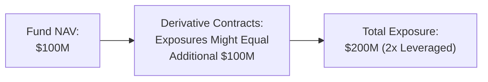
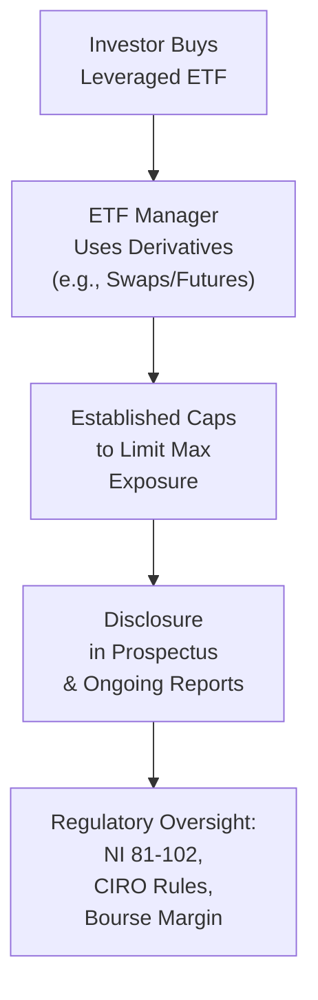

## 17.6 Regulatory Caps on Leverage & Disclosure

Leverage can be incredibly exciting when it amplifies returns—at least that’s what I heard from a friend who once boasted about doubling his gains in just a few trading sessions. Of course, I later discovered he had also doubled his losses just as quickly the following week, and that rollercoaster experience made me realize how leverage truly cuts both ways. In the world of derivative-based exchange-traded funds (ETFs), responsible leverage usage and thorough disclosure are not just “nice to have”—they’re critical. Regulators in Canada, particularly the Canadian Securities Administrators (CSA) and the Canadian Investment Regulatory Organization (CIRO), have guidelines that keep these ETFs from going off the rails. 

What follows is a deep dive into the regulatory environment that caps the amount of leverage a derivative-based ETF can use and the extensive disclosure obligations aimed at keeping investors informed. Whether you’re new to the concept of leverage or you’ve been around the block a few times with leveraged and inverse products, we’ll dig into why these regulations exist, how they work, and what they mean for everyday and institutional investors. 

––––––––––––––––––––––––––––––––––––––––––––

### The Canadian Regulatory Landscape

Canada’s investment fund industry is guided by rules designed to protect investors, ensure market integrity, and maintain financial stability. The CSA’s National Instrument 81-102 (NI 81-102) provides much of the framework for conventional mutual funds as well as certain types of ETFs, establishing limitations on how much risk these funds can take on. Meanwhile, CIRO (the result of the 2023 amalgamation of the former IIROC and MFDA) adopts and enforces guidelines with direct impact on how investment dealers can market and distribute these funds to retail investors.

Among these rules, you’ll find:

• Leverage Caps.  
• Short-Selling Limits.  
• Disclosure Requirements.  
• Continuous Reporting Obligations.  

Unlike some markets (for instance, in the United States where you might see a wide variety of “ultra-” or “triple-” leveraged ETFs on the shelf), Canada has a more conservative stance to protect investors from potentially catastrophic drawdowns. Don’t worry—we’ll dissect these specifics in detail below.

––––––––––––––––––––––––––––––––––––––––––––

### Key Caps on Leverage and Short Selling

In the context of derivative-based ETFs, “leverage” often stems from using derivatives such as futures, options, or swaps to increase exposure relative to the fund’s net asset value (NAV). While leveraging up can amplify returns, it also magnifies losses, so regulators step in to keep overall risk in check. 

#### Leverage Limits Under NI 81-102

Under NI 81-102, many types of conventional mutual funds cannot exceed a certain aggregate exposure beyond 100% of their NAV. Leveraged and inverse ETFs, which specifically aim for daily leveraged returns (for example, 2x or -1x the performance of an index), must disclose that leveraged targeting in their prospectus. In Canada, leveraged ETFs for retail investors typically target up to 2x or -2x daily returns. Some alternative mutual funds or “liquid alts” might operate under slightly different rules, but the principle remains: you can’t just crank up leverage infinitely; you’re bound by certain thresholds.

A simplified illustration of fund leverage:

Canadian investment funds that choose to exceed these limits (or use alternative structures) typically register under alternative fund categories or distribute only to accredited or institutional investors. Such structures face more robust disclosure and higher regulatory scrutiny.

#### Short-Selling Restrictions

Short selling in a derivative-based ETF can be achieved through various instruments—like short futures or swap agreements—to profit from a decline in the underlying asset price. Just like leverage, short selling can amplify gains and losses. Under NI 81-102, short-selling is limited, often to a percentage of the fund’s total assets, ensuring the fund doesn’t become overly exposed to downward price bets. 

It’s worth remembering that short positions can have theoretically unlimited risk if the underlying price skyrockets. But practically speaking, regulations, margin requirements, and the fund’s own internal risk management put caps on how far these positions can go.

––––––––––––––––––––––––––––––––––––––––––––

### Disclosure Requirements for Derivative-Based ETFs

Transparent, accurate, and timely disclosure is crucial if you’re going to invest in something as complex and potentially volatile as a leveraged or inverse ETF. The CSA and CIRO want to ensure investors are never blindsided by the avalanche of compounding effects or the nuances of daily rebalancing. So each fund must display “bright neon signs” in its documentation that highlight key risks and strategies.

#### Prospectus Disclosure

Fund managers must publish a prospectus that outlines:
1. The exact daily leverage or inverse multiple. Is it 1.5x, 2x, -1x, or something else?  
2. How derivatives—like swaps or futures—are utilized to reach this leverage or inverse goal.  
3. Risk warnings highlighting compounding, especially over periods longer than one trading day.  
4. Stress-test results or hypothetical scenarios that show worst-case outcomes—even if they seem extreme.

In the prospectus, you’ll often see disclaimers emphasizing that due to the way these products are rebalanced daily (or sometimes even more frequently), the fund may deviate substantially from its expected multiple over the long term. If an investor holds a 2x leveraged ETF for months during a volatile market, they might see returns that are significantly different (sometimes worse) than just “2x the index return.” These disclaimers aim to prevent big surprises.

#### Highlighting Compounding & Underperformance Risks

One piece of fine print that’s easy to gloss over is the explanation about how daily rebalancing can lead to “slippage.” Essentially, if the ETF aims to deliver 2x the daily return of an index, then each day’s performance is multiplied by 2. Over time, if the index oscillates up and down, daily compounding can drag the total return below what a simple 2x multiple of the index’s total return would have been. 

Let’s say, hypothetically, you hold a 2x leveraged ETF on a volatile index that goes up 10% on one day and down 9% the next:
• Day 1: +10% on the index means the leveraged ETF returns about +20%.  
• Day 2: -9% on the index means the leveraged ETF returns about -18%.  

Net effect over two days for the index is approximately +0.1% (because a 10% gain followed by a 9% loss does not net to 1% but a smaller net). But for the 2x leveraged ETF, the final result might be slightly lower than the expected 2x multiple of the net index performance. The daily rebalancing makes it complicated, and that’s exactly why regulators demand large, bold disclaimers.

––––––––––––––––––––––––––––––––––––––––––––

### Stress Testing and Continuous Disclosure

#### Stress-Testing Scenarios

Before you get the impression that disclaimers are just words in a dusty prospectus, be aware that fund managers conduct real (and hypothetical) stress tests to measure how the fund might react if markets move dramatically. These stress tests help the fund manager refine their risk mitigation strategies, set margin requirements with counterparties, and ensure that the ETF stays within regulatory leverage limits even during chaotic markets.

A typical stress test might assume a massive market swing (e.g., ±10% move in a single day) and then assess:

• Impact on the ETF’s NAV and derivative positions.  
• Liquidity to meet redemption requests under severe market pressure.  
• Counterparty risk—if the swap dealer or broker is also under stress.  

Although the details of these stress tests are often summarized in the “Risk Factors” or “Investment Strategy” sections of a fund’s continuous disclosure documents, they may also appear in Management Reports of Fund Performance (MRFPs), particularly after a time of heightened volatility.

#### Ongoing Reporting (Continuous Disclosure)

The concept of continuous disclosure means exactly what you might think: the fund can’t just tell you their approach once and expect you to be good for the next two decades. They must keep updating placings of risk, performance, and holdings on a regular basis. Some of the key documents you’ll see throughout the year include:

• Annual and Semi-Annual Financial Statements.  
• Quarterly Portfolio Disclosure Updates.  
• Management Reports of Fund Performance (MRFP).  

If the fund changes its leverage strategy—perhaps it modifies from 2x to 1.5x or expands its derivative usage to new global markets—this must be disclosed promptly so investors can decide whether to stay or exit.

––––––––––––––––––––––––––––––––––––––––––––

### Why These Regulations Exist

Let’s be real: finance is complicated enough, and adding derivatives on top can get mind-boggling at times. Regulators are tasked with making sure that unsuspecting investors don’t buy something they don’t understand and then suffer catastrophic losses that could have been prevented with better information. 

#### Investor Protection

Wrapping high leverage in a neat ETF “wrapper” could give folks the wrong impression that it’s safe just because it looks like any other stock ticker. But if you’re a retiree or an investor with moderate risk tolerance, a 2x or 3x leveraged product might put your nest egg through a wild ride. Regulators want these products to exist for sophisticated or opportunistic traders who truly understand them, but the rules are in place to ensure all buyers know what they’re getting into.

#### Market Stability

In many markets (and resulting from global financial crises), regulators noticed that exotic leveraged funds could accentuate market swings when volatility flares. During a severe downturn, the forced rebalancing of leveraged funds can create feedback loops if the ETF’s managers need to buy or sell large volumes of the underlying assets in a hurry. By setting caps and requiring robust stress-testing, the system is better able to handle surges in volatility without a meltdown. 

––––––––––––––––––––––––––––––––––––––––––––

### Real-World Example

Imagine an ETF invests in Canadian energy stocks but uses futures on crude oil to gain an extra punch of leverage: it targets 2x daily returns. If oil prices crash 8% in a few days, the derivative-based ETF might experience a meltdown that’s nearly twice as bad. Managers might face margin calls (depending on how they structured the futures positions), and the fund’s NAV could plunge faster than the underlying index. 

At that point, if the ETF is near or at its leverage cap, the managers may have to liquidate positions or drastically rebalance the portfolio, crystallizing losses and possibly triggering further downward pressure on (already depressed) underlying assets. This scenario emphasizes why these “brakes,” courtesy of NI 81-102 and CIRO guidelines, are in place—protecting both the market at large and the individual investor’s wallet.

––––––––––––––––––––––––––––––––––––––––––––

### Using Leverage Responsibly: A Mermaid Diagram

Leverage usage can be plotted visually in a simplified way:

This simplified diagram highlights the interplay among investors, fund managers, regulators, and the overarching documentation process that ensures everyone remains transparent about the level of risk.

––––––––––––––––––––––––––––––––––––––––––––

### The Role of CIRO and the Bourse de Montréal

#### CIRO Guidance and Compliance Manuals

CIRO (formerly IIROC and MFDA) is Canada’s national self-regulatory organization that oversees investment dealers and mutual fund dealers, ensuring they follow compliance rules. Currently, with derivative-based ETFs, CIRO is particularly interested in how dealers present leveraged ETF products to retail clients. For instance, advisors should:

• Explain the potential for high volatility and compounding effects.  
• Assess the client’s risk tolerance to ensure product suitability.  
• Review—and if needed, escalate—client positions if they become too large or frequent for the investor’s stated objectives.

#### Bourse de Montréal and CDCC Guidelines

The Bourse de Montréal is the primary venue for trading a variety of derivative instruments in Canada. The Canadian Derivatives Clearing Corporation (CDCC) is the clearinghouse that often sets margin requirements for futures and option contracts. While leveraged ETFs might not trade exactly like a direct futures contract, the derivatives “behind the scenes” are subject to margin rules from the Bourse and the CDCC. Those margin rules become part of the ETF’s risk control measures, ensuring the fund can meet its obligations in turbulent markets.

––––––––––––––––––––––––––––––––––––––––––––

### Practical Tips for Investors

1. **Know Your Time Horizon**: Daily leveraged ETFs can deviate quickly from expected results if held for longer than a few days.  
2. **Read the Prospectus Carefully**: Look specifically for the “Leverage Ratio” or “Inverse Multiple” and the “Risk Factors” section.  
3. **Watch Out for Fees & Expenses**: Leveraged funds often have higher management fees, including swap or futures brokerage costs.  
4. **Assess Liquidity**: Some leveraged ETFs might track less liquid markets, so the bid-ask spread can widen in volatile times.  
5. **Monitor Performance Daily**: This is not the kind of product you set and forget. Keep an eye on how the fund is rebalancing each day.  
6. **Consider Stressful Scenarios**: A 10% drop in the underlying index could become much worse in a leveraged position. Are you prepared for that?

––––––––––––––––––––––––––––––––––––––––––––

### Common Pitfalls

• **Underestimating the Impact of Daily Compounding**: A lot of folks think, “2x the index means if the index is up 10%, I get 20%.” Sure, for a single day maybe. But over two days, three days, or a really bumpy market, math does weird things.  

• **Ignoring Prospectus Warnings**: Prospectus documents can seem dense. Often, they are. But skipping them amounts to ignoring the instructions manual for a complicated gadget.  

• **Over-Leveraging Without Proper Hedging**: Some assume that just because an ETF is branded as “leveraged,” they’re fully hedged internally. Not so. In a meltdown, the ETF can face large margin calls or require forced selling.  

––––––––––––––––––––––––––––––––––––––––––––

### Additional Resources & References

• **NI 81-102** (Investment Funds): https://www.osc.ca/en/securities-law/instruments-rules-policies/8/81-102  
• **CIRO Regulations & Guidance**: https://www.ciro.ca  
• **Bourse de Montréal** – Margin Requirements: https://www.m-x.ca  
• **IOSCO Reports on ETF Disclosure**: https://www.iosco.org  
• **Open-Source Tools**: Tools like R or Python libraries (e.g., NumPy, pandas) can help you model daily compounding scenarios to see how your returns can deviate over time.

––––––––––––––––––––––––––––––––––––––––––––

### Conclusion

Leverage in derivative-based ETFs can be thrilling—until it isn’t. The regulatory caps in Canada, governed primarily by NI 81-102, along with CIRO oversight, exist to ensure that investors aren’t unwittingly buying a ticket to a financial rollercoaster without understanding the seatbelt and harness requirements. In my own experience, I’ve seen how quickly a leveraged position can sour when market volatility spikes, and trust me, you don’t want to find yourself on the wrong side of that swing without having read the risk disclosures.

So, if you’re dabbling in, or advising on, leveraged or inverse ETFs in Canada, just remember that the rules in place aren’t just bureaucratic red tape—they’re there to uphold market stability, protect portfolios from ruin, and make sure you have a fair shot at navigating these powerful but sometimes dangerous tools. Read the disclaimers, stay informed through continuous disclosures, and be mindful that the best surprises in life are, well, usually not in your investment account.

––––––––––––––––––––––––––––––––––––––––––––

## Sample Exam Questions: Regulatory Caps on Leverage & Disclosure



### Which Canadian regulatory instrument primarily governs the use of leverage in ETFs marketed to retail investors?  
- [ ] National Instrument 51-101  
- [x] National Instrument 81-102  
- [ ] National Instrument 31-103  
- [ ] National Instrument 45-106  

> **Explanation:** NI 81-102 sets most of the rules for mutual funds and certain ETFs, including leveraged and inverse products. It establishes restrictions on leverage, short selling, and disclosure.  

### What is the main purpose of disclosing compounding and underperformance risks in leveraged ETF prospectuses?  
- [ ] To encourage long-term investing   
- [x] To warn investors that daily leveraged returns may not match simple multiples over extended periods   
- [ ] To promote increased trading volumes  
- [ ] To prevent short selling activities  

> **Explanation:** The daily rebalancing feature of leveraged ETFs can significantly alter returns over longer horizons, so regulators require disclosure to warn investors up front.  

### Why do regulators set short-selling limits for derivative-based ETFs?  
- [ ] To ensure ETFs never use derivatives  
- [x] To prevent funds from taking on theoretically unlimited risk if markets rise unexpectedly  
- [ ] To improve the fund’s liquidity  
- [ ] To increase daily trading volume  

> **Explanation:** Short positions can have very high or undefined downside risk if the underlying asset’s price rises significantly. Restrictions help mitigate that risk.  

### Which of the following is a common disclosure requirement specific to leveraged ETF prospectuses?  
- [ ] Weekly disclosures of all swap counterparty agreements  
- [x] Stress-test illustrations showing performance in extreme market conditions  
- [ ] Shareholder votes on each derivative transaction  
- [ ] Documents stating the fund will outperform in sideways markets  

> **Explanation:** Regulators mandate stress-test disclosures to help investors visualize worst-case scenarios under extreme volatility.  

### Which entity clears many of the derivatives used by Canadian ETFs, thereby influencing margin and leverage rules?  
- [ ] Toronto Stock Exchange (TSX)  
- [ ] CIRO  
- [ ] Securities and Exchange Commission (SEC)  
- [x] Canadian Derivatives Clearing Corporation (CDCC)  

> **Explanation:** The CDCC is responsible for clearing derivatives in Canada, impacting how margin is calculated and enforced for funds that employ those derivatives.  

### Why is daily rebalancing often cited as a risk factor in leveraged and inverse ETFs?  
- [x] Because it can cause the ETF’s returns to stray from the expected simple multiple over time  
- [ ] Because it makes the fund tax-exempt  
- [ ] Because it guarantees a 2x return if held for more than one day  
- [ ] Because it has no effect on the ETF’s overall performance  

> **Explanation:** Daily rebalancing multiplies each day’s gain or loss separately, leading to compounding effects that can diverge from a simple multiple of cumulative returns.  

### In Canada, who enforces guidelines and compliance related to how investment dealers market leveraged ETF products?  
- [ ] Bank of Canada  
- [ ] Office of the Superintendent of Financial Institutions (OSFI)  
- [x] Canadian Investment Regulatory Organization (CIRO)  
- [ ] Financial Transactions and Reports Analysis Centre (FINTRAC)  

> **Explanation:** CIRO is the self-regulatory organization in Canada that oversees investment dealers, ensuring they comply with rules on marketing and distribution of leveraged funds.  

### Which of the following best describes the rationale behind setting leverage caps on ETF exposure?  
- [x] To protect investors from excessive drawdowns and maintain market stability  
- [ ] To force all ETF managers to eliminate derivatives from their portfolios  
- [ ] To maximize short-selling opportunities for retail investors  
- [ ] To encourage speculation in illiquid markets  

> **Explanation:** Limiting leverage reduces the likelihood of catastrophic losses to investors and reduces systemic risk.  

### What might happen when an ETF reaches or breaches its regulatory leverage cap during market turmoil?  
- [x] It may be forced to rebalance or liquidate positions to realign exposure  
- [ ] It is allowed to exceed the cap if prices fall below certain thresholds  
- [ ] It must halt trading permanently  
- [ ] It automatically passes the cost to minority shareholders  

> **Explanation:** When a fund hits its leverage cap, managers typically reduce or adjust positions to comply with regulations—potentially requiring forced selling or significant rebalancing.  

### True or False: Leveraged ETF prospectuses must provide hypothetical illustrations that show the impact of daily compounding on returns.  
- [x] True  
- [ ] False  

> **Explanation:** Under NI 81-102 and CSA guidelines, leveraged ETF managers must disclose potential outcomes, often including hypothetical examples of how compounding can cause deviation from a simple multiple of the underlying index.  


