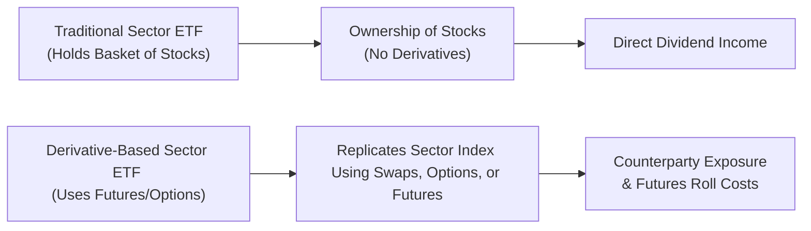

## 17.7 Volatility & Sector-Specific Derivative-Based ETFs

Imagine you’re scrolling through market news on a Monday morning and see headlines proclaiming, “Volatility on the Rise!” or “Energy Sector in Turmoil.” If your first thought is “Oh boy, how can I protect my portfolio—or even profit—from these shifting market dynamics?”, volatility and sector-specific derivative-based ETFs might pique your interest. These specialized funds often harness futures and options to capture or hedge short-term price swings in broad markets (like the S&P 500) or in narrow slices of the market (like technology, energy, or biotech). Let’s walk through what these ETFs are, how they work, and what risks and rewards they present for different types of investors.

---

### The Concept of Volatility ETFs

Volatility ETFs rose to prominence because of the market’s love-hate relationship with the VIX (Volatility Index), also known as the “fear gauge.” The VIX is a metric that tracks the implied volatility embedded in S&P 500 index options. Basically, it tries to reflect how erratic investors expect the S&P 500 to be over the near term—do they anticipate smooth sailing or choppy waters?

• The VIX itself isn’t directly investable, so to “own” or “short” volatility, you need to use futures, options, or ETFs that hold these derivatives.  
• A Volatility ETF, therefore, is designed to approximate changes in volatility using a basket of VIX futures or options (often near-month contracts).  

Early on in my own investing journey, I heard about the VIX and thought, “Well, if I buy volatility, my portfolio is protected from big downdrafts, right?” Um, it’s not quite that simple. Volatility-based ETFs can indeed rise when markets plunge, but they also face the challenges of daily rebalancing, contango (a futures-market condition where longer-dated futures are priced higher than near-term ones), and other quirks that can eat away at returns over time.

---

### Mechanics of Volatility Tracking

Volatility ETFs often roll their futures contracts, aiming to reflect a rolling exposure to short-term volatility. Yet this approach can lead to performance that diverges from “spot VIX” levels. For instance, if the market is in contango, each time the ETF “rolls” the near-month futures to the next-month futures, it might incur a loss because those next-month futures can be pricier.

• Short-term ETFs can experience severe “beta slippage” if the daily resetting process interacts with big market moves.  
• Long-term (mid-term) volatility ETFs may mitigate some of that rebalancing pain by splitting exposure across multiple futures maturities, but they might track the immediate ups and downs of the VIX less precisely.  

Here’s a high-level look at how money flows in one of these ETFs:

Like any investment, volatility ETFs come with fees (like management expenses and operating costs). And because they use derivative contracts, the portfolio manager’s skill in “rolling” or rebalancing positions and controlling transaction costs can significantly affect performance.  

---

### Sector-Specific Derivative-Based ETFs

Volatility products aren’t the only specialized derivative-based ETFs. Sector-specific derivative-based ETFs concentrate exposure in one particular segment, such as technology, healthcare, energy, or financials. Some might rely on futures, while others employ options or swaps to replicate price movements of specific sector indexes. A few might also provide leveraged or inverse exposure.  

When you see a “2x Tech ETF,” that product is trying to deliver twice the daily percentage change of a tech-heavy benchmark—often through futures or total return swaps. Likewise, an “Inverse Energy ETF” might profit when energy sector stocks or energy commodity prices fall, again using futures or options to achieve that inverse relationship.

Why might investors choose these narrower funds?

• **Focused Exposure:** Instead of holding a broad market ETF, you zoom in on, say, biotech or semiconductors.  
• **Hedging Purposes:** If you already have a big position in a technology company, you might hedge tech risk by shorting a derivative-based tech ETF or buying put options within it.  
• **Speculative Opportunities:** You might have a strong sector view—maybe you believe new energy policies will spike solar stocks—so you might buy a leveraged solar-focused ETF to amplify potential upside (and, obviously, potential downside).  

I’ve personally found it helpful to treat sector-specific ETFs like very concentrated bets—no different from, say, picking a single commodity. If the sector booms, great! But if the sector tanks because of a regulatory crackdown or a sudden global event, you’ll feel that negative jolt in a big way.

---

### Risks and Considerations

**Concentration Risk**  
Sector-specific ETFs can amplify both gains and losses. If a new regulation targets big tech, any tech-driven derivative ETF could plummet. Similarly, an energy sector ETF might be hammered by falling oil prices or rising environmental regulations.  

**Liquidity Risk**  
Specialized ETFs—especially those using derivatives—often hold instruments that might have lower trading volume and wider bid-ask spreads. This limited liquidity can lead to higher transaction costs or difficulty exiting positions quickly.  

**Correlation Dynamics**  
Adding a volatility ETF or a niche sector fund to a portfolio might change its overall correlation structure. A volatility ETF may have a low or negative correlation to equities (sometimes beneficial for diversification). However, the correlation might not hold in all markets. Meanwhile, loading up on multiple sector funds could inadvertently cause you to over-concentrate in certain industries.

**Tracking Error**  
Between rolling costs, daily resets (especially for leveraged products), and potentially illiquid options or futures, these ETFs can deviate from their stated benchmarks. If you rely solely on the ETF to replicate the index’s performance, you might be caught off guard by these unexpected divergences.  

**Leverage and Inverse Mechanics**  
Leveraged and inverse sector ETFs don’t just reflect a sector’s movement; they **multiply** it. And because many use daily rebalancing, returns over longer periods might differ significantly from the 2x or -1x daily target. This phenomenon is sometimes called the “drift” or “path dependency” effect.  

---

### Regulatory Aspects and Canadian Market References

Regulatory bodies like the Canadian Investment Regulatory Organization (CIRO) in Canada set guidelines to ensure retail investors are properly informed about the complexities of derivative-based products. Remember, references to IIROC or the MFDA are now purely historical, as these organizations were consolidated into CIRO effective June 1, 2023.  

- **Concentration Guidelines:** CIRO’s current rules encourage advisors to discuss sector or volatility concentration, emphasizing how it can crank up risk in a portfolio.  
- **Margin Requirements:** CIRO and the Bourse de Montréal specify margin rules that can vary for leveraged, inverse, or volatility-based ETFs. (For more on margin guidelines, see Chapter 23: Client Margin Requirements.)  
- **Disclosure and Suitability:** Advisors must evaluate a client’s risk tolerance and investment profile before recommending specialized funds.  

On the Bourse de Montréal, you’ll find volatility futures (like the S&P/TSX 60 VIX) and some sector derivative products, though liquidity can sometimes be less robust than in U.S. markets. Always consider that a narrower or newly listed product may have shallower order books.  

---

### Best Practices for Incorporating These ETFs

**1. Set a Clear Objective**  
Are you hedging a known risk, chasing outsized returns, or diversifying? Identify your “why” at the outset.  

**2. Understand the Underlying**  
Volatility ETFs can hold VIX futures contracts over multiple maturities. Sector ETFs might use various derivatives. Peek under the hood to confirm what you’re really buying.  

**3. Monitor Liquidity and Bid-Ask Spreads**  
During times of crisis, liquidity in specialized derivatives can vanish at the worst possible time. If you need to get in or out quickly, keep an eye on the order book.  

**4. Keep Time Horizon in Mind**  
Leveraged or short-term volatility products often require more frequent monitoring. A “buy and forget” approach can be disastrous if daily resets lead to big tracking differences.  

**5. Revisit Diversification**  
Before you add a technology ETF to your portfolio, ask: “Am I already overweight in tech stocks?” Or if you’re adding a volatility ETF, double-check how it correlates with your other holdings.  

**6. Be Aware of Contango and Roll Yield**  
If you’re holding a fund that rolls futures, especially short-maturity futures, be prepared to deal with roll costs. This can eat into returns, particularly in a steep contango environment.  

---

### Case Study: A Hypothetical Energy Sector Shake-Up

Let’s take a fictional scenario: Suppose a new global agreement drastically cuts back on non-renewable energy sources. It might instantly push oil-and-gas–focused ETFs, including derivative-based ones, into a tailspin. Investors holding a leveraged “2x Energy” ETF could see their position nosedive in a single day. Meanwhile, an “Inverse Energy ETF” might surge. If liquidity is thin in the underlying futures markets, the price of the energy ETF might experience larger gaps between the bid and ask. Moreover, roll yields on oil futures might change overnight as traders scramble to adjust.  

In such a scenario, the key is to understand that the direct effect of new regulations or shocks to the supply-demand dynamics in commodities can funnel swiftly into derivative-based ETFs. This is concentration risk at its rawest. Even if you’re bullish or bearish on energy fundamentals, you must assess whether the added leverage or the particular derivative structure is suitable for your risk appetite.

---

### Diagram: Comparing Traditional vs. Derivative-Based Sector ETF Structures

In a traditional sector ETF, the fund directly owns the shares of underlying companies in the sector. In a derivative-based ETF, the fund might enter into swap contracts with a counterparty or hold futures that track a sector index. Each route has its pros and cons, with derivative-based funds sometimes offering leveraged or inverse exposures but introducing roll costs, derivative-specific fees, and counterparty risks.

---

### Additional Resources and References

• **CIRO**: For official updates, margin requirements, and guidelines on retail distribution of specialized ETFs, visit [https://www.ciro.ca](https://www.ciro.ca).  
• **Bourse de Montréal**: Detailed data on Canadian derivatives, including volatility futures.  
• **Open-Source Data Platforms**: Sites like Yahoo Finance or TMX Money help track liquidity, bid-ask spreads, and performance of ETFs.  
• **Academic Papers on “Volatility as an Asset Class”**: Look for articles exploring how volatility-based products can be integrated into diversified portfolios.  

---

### Final Thoughts

Volatility and sector-specific derivative-based ETFs are powerful tools—kind of like jumping on a roller coaster if you love that thrilling, stomach-flipping ride. They can serve sophisticated strategies for speculation, hedging, or diversifying. But with higher potential rewards come greater risk, complexity, and sometimes unexpected costs due to derivative nuances. Before you buckle in, get crystal clear on how the ETF is structured, the liquidity of its underlying derivatives, and the regulatory environment.  

If you’re brand new to these products, consider practicing with a paper portfolio, or work closely with a qualified advisor who truly gets the ins and outs of derivative strategies. After all, no one wants to watch their portfolio twist and turn uncontrollably—unless, of course, you’re the adrenaline-seeking type with an iron stomach.

---

## Sample Exam Questions: Volatility & Sector-Specific Derivative-Based ETFs



### Compared to a broad equity ETF, a niche sector ETF typically carries which major disadvantage?

- [ ] Lower transaction costs
- [x] Higher concentration risk
- [ ] Guaranteed outperformance in that sector
- [ ] Reduced volatility relative to the market

> **Explanation:** Niche or sector-specific ETFs often concentrate in a very narrow segment of the market, substantially increasing concentration risk and potential volatility.

### When a Volatility ETF holds VIX futures contracts, what market structure can cause it to lose value even if implied volatility stays relatively stable?

- [ ] Normal backwardation
- [x] Contango
- [ ] Gamma squeeze
- [ ] Put-call parity

> **Explanation:** In contango, futures contracts for later delivery are priced higher than near-term contracts. Rolling into these higher-priced contracts can cause the ETF to incur extra costs, diminishing returns over time.

### Which of the following is most directly impacted by the daily reset feature in a leveraged or inverse volatility ETF?

- [ ] Intrinsic value of the ETF
- [ ] Underlying spot VIX index
- [x] Long-term performance tracking
- [ ] Dividends paid out by the ETF

> **Explanation:** Leveraged or inverse ETFs use daily resets, which can create a path-dependent return profile, often causing long-term returns to deviate substantially from the daily target multiple.

### If an investor wants to hedge an existing portfolio’s large allocation to energy stocks, which strategy might they consider?

- [ ] Going long a 2x Energy Sector ETF
- [x] Buying an Inverse Energy Sector ETF
- [ ] Buying more energy stocks for “averaging down”
- [ ] Purchasing shares in a broad equity ETF

> **Explanation:** Buying shares in an Inverse Energy Sector ETF can offset losses in the energy stocks, providing a hedge against price declines in the sector.

### Which risk factor is most associated with ETF strategies that rely on thinly traded underlying futures or swaps?

- [ ] Zero interior risk
- [x] Liquidity risk
- [ ] Unlimited upside potential
- [ ] High correlation with all other assets

> **Explanation:** When underlying derivatives are thinly traded, there tend to be wider bid-ask spreads and uncertain pricing, making it challenging to trade without significantly impacting prices.

### One benefit of incorporating a long volatility or VIX-linked ETF in a portfolio is:

- [ ] Guaranteed profit when stocks decline
- [x] Potential diversification benefits if it has a low or negative correlation to equity markets
- [ ] Elimination of all market risk
- [ ] Automatic gains from contango in the futures market

> **Explanation:** While volatility ETFs can rise during market drops, they’re not a guaranteed hedge. However, they can provide diversification if their correlation to equities is negative or low.

### Which regulatory body in Canada currently oversees trading and advisor recommendations for derivative-based ETFs?

- [ ] IIROC (still active)
- [ ] MFDA (still active)
- [x] CIRO
- [ ] Bank of Canada

> **Explanation:** As of June 1, 2023, the Mutual Fund Dealers Association of Canada (MFDA) and IIROC merged to form the Canadian Investment Regulatory Organization (CIRO). CIRO regulates advisors and dealers offering derivative-based ETFs.

### In a steep contango environment, a Volatility ETF that continuously rolls short-term VIX futures may experience:

- [ ] Enhanced dividend income
- [ ] Positive roll yield
- [ ] Neutral roll yield
- [x] Negative roll yield

> **Explanation:** Rolling into more expensive contracts each month in a steep contango typically causes negative roll yield, eroding fund value even if implied volatility remains flat.

### A “2x Tech ETF” aims to achieve:

- [ ] Twice the broad market return each year
- [ ] Twice the tracking error of the S&P 500
- [x] Twice the daily return of a technology index
- [ ] Half the risk of a technology index

> **Explanation:** Leveraged ETFs typically promise a multiple (such as 2x) of the daily return. Over longer periods, the actual performance may deviate from that multiple due to daily rebalancing.

### True or False: Derivative-based ETFs can eliminate all market risk if used correctly.

- [x] True
- [ ] False

> **Explanation:** Actually, this is a tricky statement. Even well-structured derivative-based ETFs cannot eliminate all market risk; they can only alter, transfer, or in some cases partially hedge it. So, the correct answer is False.  


