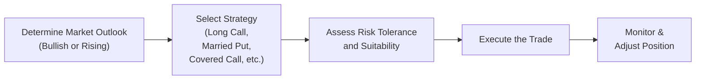

## 18.1 Introduction to Bullish Strategies

Have you ever had that feeling—like you just know a stock is about to head straight up, but you’re not entirely sure how to capitalize on that move without overcommitting your money? Trust me, I’ve been there. Years ago, I was so convinced that a particular tech company was going to take off that I went all in on the stock. Although I was right, I learned a valuable lesson: sometimes, direct stock ownership can tie up a lot of capital and might not always be the best path for your goals or your risk tolerance. Enter bullish option strategies, which allow you to profit from an expected price increase without necessarily buying the underlying asset outright.

Bullish strategies are designed to benefit when you anticipate that an underlying asset—be it a stock, an index, a commodity, or something else—will go up. Now, before we start digging into these strategies, let’s clarify something: “bullish” doesn’t always mean “infinite risk and infinite reward.” You can structure your positions with varying degrees of risk, sometimes limiting your downside, sometimes giving up a portion of your upside, and sometimes layering on a bit more complexity. This all depends on your risk tolerance, your speculation or hedging goals, and, yes, the amount of capital you’re comfortable putting on the table.

Below, we’ll explore some of the most common bullish strategies, how you might incorporate them into your overall portfolio, and important considerations around regulatory rules, especially in the Canadian marketplace. We’ll also discuss real-world examples of how these strategies can be used and, hopefully, demystify some of the more intimidating buzzwords along the way.

### Understanding the Bullish Outlook

A “bullish” view is the expectation that a market or an underlying asset is likely to rise in price over a certain period. This could be because of:

• Strong corporate earnings.  
• Encouraging macroeconomic data.  
• A promising new product release from the company.  
• Rising commodity prices (for resource-based assets).  
• Shifting sentiment among investors.  

When you’re bullish, you want strategies that either replicate or enhance the potential gains you’d get from owning the asset. Sometimes you don’t want to commit huge amounts of cash just to buy the stock, or you want to limit your potential losses if your hunch is wrong. That’s where bullish options strategies shine.

### Why Use Bullish Strategies?

You might be wondering, “But why not just buy the stock if I’m bullish?” That’s a fair question. Sometimes you do just buy the stock—especially if you’re comfortable with the capital outlay and want to hold the shares outright. That said, bullish strategies can:

• Provide leverage (granting upside exposure with relatively smaller capital).  
• Generate supplemental income (like when writing calls on a stock holding).  
• Define or partially limit downside risk (like when using protective puts).  
• Offer more customized risk-reward profiles than simply owning shares.  

For instance, if you want to keep your risk small but still benefit from a possible surge, a Long Call might be your choice. Or, if you already hold a stock and want to earn premium income, a Covered Call might be more alluring.

### Key Terminology

• Underlying Asset: The financial instrument (stock, index, commodity) that the option contract is based on.  
• Leverage: Controlling a large amount of the underlying with a relatively small cash outlay.  
• Premium: The price you pay (or collect) to buy (or write) an option.  
• Delta: Measures how much the option’s price is expected to change for a $1 change in the underlying asset’s price. Bullish strategies typically feature a net positive delta.  
• Strike Price: The price at which the underlying is purchased (for a call) or sold (for a put) in an option contract.  
• Expiration Date: The day the option contract expires if it isn’t exercised.  
• Intrinsic Value: The in-the-money portion of an option’s premium—i.e., how much an option is inherently “worth” if exercised immediately.  
• CIRO (Canadian Investment Regulatory Organization) Suitability Rules: Guidelines requiring that a recommended strategy align with a client’s risk tolerance, financial background, and objectives.  

### Common Bullish Strategies

Let’s explore the main bullish option strategies typically taught in derivatives courses and used by investors in the real world. We’ll walk through the essentials of each.

#### Long Call

The Long Call is often considered the simplest bullish options strategy. You buy a call option, paying a premium to gain the right—but not the obligation—to purchase the underlying asset at the strike price before (or on) expiration.

• Best-case scenario: The underlying asset’s price skyrockets, so your call option can be sold at a higher premium or exercised for a profit.  
• Worst-case scenario: If the market didn’t rise as expected, your maximum loss is the premium you initially paid.  

In essence, the Long Call offers leverage without unlimited downside. Because your cost is limited to the premium, you can ride potential upside, but your potential gain is indefinite if the asset’s price surges enough before expiration.

#### Married Put (Protective Put)

If you already own the underlying stock but want to protect against downward movements, you can buy a put option while holding the stock. This approach is sometimes called a Protective Put because it’s basically like insuring your stock. Though it’s more of a defensive tactic, it still carries a bullish inclination since you’re holding the underlying asset expecting it to appreciate. The put simply caps your potential losses.

• Position composition: Long Stock + Long Put.  
• Bullish perspective: If the stock rises, you gain on the stock side. The put might lose value, but your net position can still be profitable because the stock gains could outweigh the put premium.  
• Downside protection: If the stock tumbles, the gained value of the put offsets losses in the stock.  

A Married Put (or Protective Put) can be a “sleep-better-at-night” strategy for someone who believes strongly in a stock’s long-term growth but wants some short-term insurance.

#### Covered Call

A Covered Call is a way to generate extra income on a stock you already own (or are about to buy). In this strategy, you write (sell) a call option against your existing shares. You collect the premium from the call option buyer.

• If the stock price stays below the call’s strike price during the option’s life, the call expires worthless, and you keep the premium.  
• If the stock price rises above the strike price, you may end up selling your shares at that strike price (which you presumably find acceptable).  

Because you own the shares backing the short call, it’s “covered,” limiting the risk that’s typically associated with a call write. The main trade-off is that your stock might be “called away” if the price climbs above the strike price. By using Covered Calls, you modestly limit upside potential in exchange for immediate premium income.

### Real-World Scenarios

Let’s say you have a company, MapleTech Inc., that you strongly believe is about to release a game-changing product. You don’t want to tie up all your capital in shares, so you purchase calls at a strike price near the stock’s current trading level. Your logic: If MapleTech’s product launch is a hit, the stock could soar. The call provides leveraged upside at a fraction of the cost of buying shares outright. The catch, of course, is that if the product flops, you lose your premium, but the rest of your cash remains free for other investments.

Or perhaps you’ve owned MapleTech shares for years. The stock’s had a nice run, and you wouldn’t mind selling some at a higher price. You decide to write Covered Calls with a strike price slightly above the current market. If the price doesn’t get there, you pocket the premium. If MapleTech jumps above that strike price, you figure it’s a good point to exit part of your position. That’s the essence of what’s known as “enhancing yield” on your existing holdings.

### A Quick Visual of Process Flow

Sometimes it helps just to see a simplified flow of how you might decide on a bullish strategy:

You can see how each step simply leads to the next, from forming your market outlook to implementing and then diligently monitoring your chosen strategy.

### Risk Management and Considerations

Just because these strategies are bullish doesn’t mean they’re risk-free. Remember:

• Time Decay (Theta): Options lose value as they near expiration, all else being equal. For most bullish strategies like the Long Call, time decay works against you every day.  
• Volatility: Rising implied volatility can pump up option premiums, which benefits Long Call holders but can hurt those buying a put for protection since it might become pricier.  
• Strike Selection: Picking the “right” strike price is crucial. Near-the-money strikes might cost more, but they have higher deltas that offer you a more responsive payoff if the stock moves as expected.  
• Expiration Duration: Shorter-term options are cheaper but have faster time decay. Longer-term options give you more time for your idea to play out but are more expensive.  
• Opportunity Cost: Especially with Covered Calls, you sacrifice some portion of your upside if the stock price soars well beyond your strike.  

### Regulations and Suitability (CIRO Perspective)

In Canada, the newly formed Canadian Investment Regulatory Organization (CIRO) underscores that any options strategy must be suitable for a client’s financial situation, risk tolerance, and goals. This means:

• Assessing the client’s net worth.  
• Evaluating time horizon, liquidity needs, and investment objectives.  
• Determining if the client fully understands the strategy, especially in leveraged situations.  
• Adhering to margin requirements (where applicable).  
• Ensuring proper risk disclosure and obtaining signed agreements.  

Regulatory oversight aims to make sure investors aren’t taking on positions that exceed their level of expertise or capacity to manage losses. That’s also why margin requirements exist—to ensure that you have enough capital to cover potential losses if the market moves against you.

For the most up-to-date margin guidelines or specific coverage requirements, consult the official CIRO website at [https://www.ciro.ca](https://www.ciro.ca). Also, the Bourse de Montréal offers detailed contract specifications and educational materials for listed options at [https://www.m-x.ca](https://www.m-x.ca).

### Practical Example: Enhancing Existing Stock Positions

Imagine you hold 1,000 shares of a Canadian energy company that’s trading at CAD 45 per share. You believe the stock might creep up over the next month, but not necessarily skyrocket. You decide to write 10 Covered Calls (because each options contract typically covers 100 shares) at a strike of CAD 48 expiring in 30 days. You collect, say, CAD 0.50 per share in premiums. If the stock stays below CAD 48, you keep your 1,000 shares and the CAD 500 total premium (0.50 * 1,000). If the stock goes above CAD 48, you deliver your shares at CAD 48 and still keep the premium for a total effective sale price of CAD 48.50. If for some reason the stock soared to CAD 60, you wouldn’t participate in the upside beyond CAD 48 strike plus the premium. That’s the trade-off for generating income now.

### Another Example: Limited-Capital Bullish Bet

Suppose you have CAD 1,000 to invest. The stock you like is at CAD 50 per share, and you suspect it might jump to CAD 55 or more over the next two months. You can only buy 20 shares with your entire budget, or you can buy a call option. Let’s say a two-month CAD 50 Call is priced at CAD 2.50. With your CAD 1,000, you can buy four such call options (4 * 100 shares each = 400 shares notional). Your total cost is CAD 1,000 (4 * 2.50 * 100). If the stock actually goes to CAD 55, each call might be worth at least CAD 5 (intrinsic value of 55 – 50), and likely more if there’s time value left. By exiting, you could theoretically double your money or better. However, if you’re wrong and the stock doesn’t rise above CAD 50 by expiration, you lose your entire CAD 1,000. That’s the risk side of leverage.

### Common Pitfalls

• Overleverage: It’s easy to buy too many calls and magnify your losses if the asset doesn’t move as you hoped.  
• Poor Timing: Theta (time decay) is relentless, and if you’re early in your forecast, your options might decay significantly before the move happens.  
• Selling Calls Too Close to the Money: If you do a Covered Call and select a strike that’s too close to the stock’s market price, you might get assigned quickly if the asset shoots upward.  
• Neglecting to Monitor Volatility: Changes in implied volatility can dramatically affect option prices.  

### Additional Tools and Resources

• **CIRO** – [https://www.ciro.ca](https://www.ciro.ca): Canada’s main regulatory organization for investment dealers.  
• **Bourse de Montréal** – [https://www.m-x.ca](https://www.m-x.ca): For listed options and futures info, contract specs, and educational resources.  
• **The Canadian Securities Administrators (CSA)** – [https://www.securities-administrators.ca](https://www.securities-administrators.ca): National instruments, bulletins, and regulatory updates.  
• **Open-Source Financial Tools**: Websites like [www.portfoliovisualizer.com](https://www.portfoliovisualizer.com) and [www.quantconnect.com](https://www.quantconnect.com) offer free or low-cost analytics.  
• **Suggested Reading**:  
  - *Options as a Strategic Investment* by Lawrence G. McMillan.  
  - *Option Volatility & Pricing* by Sheldon Natenberg.  

### Best Practices

• Thoroughly research the underlying asset. Review fundamentals, technical signals, or economic drivers.  
• Use proper position sizing. Don’t risk capital you can’t afford to lose in leveraged strategies.  
• Understand all terms—strike price, expiration date, implied vs. historical volatility—before entering a trade.  
• Consider hedging or protective measures, like adding a put to your bullish position if appropriate.  
• Keep a watchful eye on announcements (earnings calls, product releases, interest rate updates) that could affect the asset’s price.  

### A Note on Margin and Suitability

Under CIRO rules, it’s essential to confirm the client’s profile—for instance, whether they can handle the financial demands of margin calls if the market drops. If you’re dealing with clients, you must maintain thorough documentation of suitability assessments. For self-directed investing, the onus is on you to make sure you fully understand margin requirements and potential drawdowns.

### Encouragement to Go Further

Bullish strategies can be an exciting and potentially rewarding approach, but as I learned from my early days, it’s easy to get carried away with big dreams about monstrous rallies. Make sure to balance your optimism with a healthy respect for risk. Learn the nuances, practice with examples (sometimes even paper trading is helpful), and stay updated on Canadian regulatory changes. Remember, formal education and real-world practice together are the best teacher.

If you’re pumped to learn more, be sure to read up on option greeks (especially Delta, Gamma, and Theta), because they’ll give you a more precise handle on how your option’s price might change under different market conditions. Plus, keep an eye on the Bourse de Montréal for new products or updates in margin and contract specifications.

Happy trading (and learning), and may your bullish outlook pay off!

---

## Sample Exam Questions: Mastering Bullish Strategies



### Which of the following statements best describes a primary reason for using a Long Call strategy in a bullish market?

- [x] It provides upside potential with limited downside risk (loss limited to the premium).
- [ ] It allows the investor to collect premium income if the underlying stays flat.
- [ ] It ensures a guaranteed profit if the underlying moves sideways.
- [ ] It offers the investor unlimited losses with minimal premium cost.

> **Explanation:** A Long Call offers the right to buy the underlying at the strike price, creating significant upside potential if the market rises. You only risk the premium you paid.

### When an investor owns a stock and also buys a put option on the same stock, this is commonly referred to as:

- [ ] Covered Call
- [ ] Long Straddle
- [x] Married Put (Protective Put)
- [ ] Bull Call Spread

> **Explanation:** A Married Put (or Protective Put) combines a stock holding with the purchase of a put option, insuring against a price decline.

### In a Covered Call strategy, the investor:

- [ ] Sells a put option on a stock they do not own.
- [x] Sells a call option while owning the underlying shares.
- [ ] Buys a call and a put simultaneously on the same underlying.
- [ ] Only buys call options with a bullish view.

> **Explanation:** A Covered Call involves selling (writing) a call option against an owned stock position. The strategy can generate premium income but caps upside if the stock rallies above the strike price.

### Time decay (Theta) is most detrimental to which bullish strategy?

- [x] Long Call
- [ ] Married Put
- [ ] Covered Call
- [ ] Short Call (Naked Call)

> **Explanation:** Long Call positions suffer from time decay because every day that passes reduces the time value of the option, particularly harmful if the price movement in the underlying isn’t swift.

### CIRO’s suitability rules require Canadian investment dealers to ensure an option strategy is appropriate for a client. Which factor is NOT typically part of a suitability assessment?

- [ ] The client’s risk tolerance.
- [ ] The client’s financial situation.
- [ ] The client’s goals and objectives.
- [x] The firm’s own profit margin on the trade.

> **Explanation:** Suitability is about prescribing strategies that align with the client’s unique profile—risk tolerance, objectives, and finances. The firm’s profit is not part of suitability obligations.

### Which of the following might be considered a potential drawback of employing a Covered Call strategy?

- [ ] It requires minimal upfront capital compared to buying calls.
- [ ] It allows for unlimited upside and no downside risk.
- [x] It caps the upside if the underlying stock rallies strongly.
- [ ] It eliminates any need to hold shares in the underlying.

> **Explanation:** The main downside of a Covered Call is that if the underlying stock price skyrockets, you can be forced to sell at the strike price, missing out on further gains beyond that point.

### If a stock closes below the strike price of a Covered Call at expiration, what usually happens to the call option?

- [x] It expires worthless, allowing the investor to keep the stock and the premium.
- [ ] It gets exercised automatically, forcing the investor to deliver shares.
- [ ] It is automatically rolled over to the next expiry.
- [ ] The investor must pay additional premium to close the option.

> **Explanation:** In most cases, if the call option expires out of the money, it becomes worthless. The investor retains the shares and the premium.

### In a Married Put (Protective Put), how does the put option help in mitigating risk?

- [ ] It magnifies gains if the underlying moves upward.
- [ ] It locks in unlimited profit potential above the strike.
- [x] It provides downside protection by offsetting losses in the stock below the put’s strike.
- [ ] It ensures no premium is lost if the stock remains flat.

> **Explanation:** The purchased put gains in value if the stock price falls below the strike, compensating for losses in the underlying shares.

### Which of the following is a correct statement about implied volatility (IV) and Long Calls?

- [x] Higher IV typically increases the cost (premium) of Long Calls.
- [ ] Higher IV reduces the time value portion of Long Calls to zero.
- [ ] Lower IV is always advantageous to a Long Call buyer.
- [ ] Implied volatility has no impact on option premiums.

> **Explanation:** When implied volatility is high, option premiums (including calls) tend to be more expensive due to increased perceived risk and potential price swings.

### True or False: A bullish outlook guarantees that a Long Call option position will be profitable by the expiration date.

- [x] True
- [ ] False

> **Explanation:** This is actually false. A bullish outlook doesn’t guarantee a profit; the underlying stock must rise sufficiently above the option’s strike plus the premium paid before expiration for the trade to profit. (Note that this question is intentionally tricky; the correct factual statement is that it is false. Many test-takers might mistakenly choose True if not reading carefully.)


