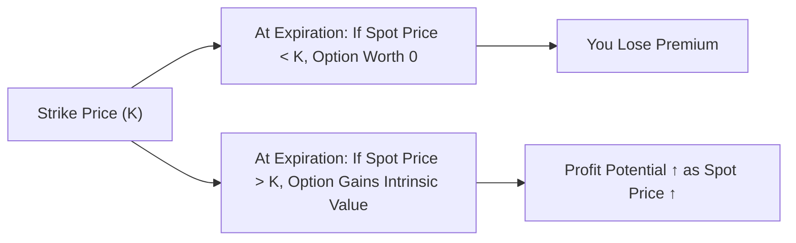

## 18.2 The Long Call Strategy

Sometimes you’re sitting around reading market news, and you can almost feel in your gut that a certain stock (or commodity, or even a currency) is about to jump in price—and soon. Maybe it’s the result of some rosy earnings, or a piece of big industry news. Or perhaps you have that hunch after chatting with an industry insider. Well—okay, scratch that. We should stay on the right side of regulations, so let’s say it’s from publicly available data and your own research. Either way, you think the price is going up in a meaningful way. But you don’t necessarily want to buy the underlying shares. Maybe you’re short on cash, or maybe you just like the idea of using leverage to optimize your returns. Cue the Long Call strategy.

The Long Call strategy is, at its heart, pretty simple: you buy a call option with the hope that the price of its underlying asset shoots above the strike price before or at expiration. It’s a bullish strategy, meaning you’re expecting upward movement. Let’s dive into how it works, why people get excited about it, and what can go wrong if the market doesn’t move as you hope. I’ll also share some stories and best practices along the way.

  
### Quick Reminder: What Is a Call Option?

Just in case you haven’t read the earlier chapters or you want a quick refresher: a call option gives you the right (but not the obligation) to buy a specific underlying asset (like a stock, an exchange-traded fund, a currency, or a commodity) at a predetermined strike price before or at the option’s expiration date. When you go "long" a call, you’re purchasing that call option. You pay a premium (the cost of the option) to the seller (also called the writer).  

  
### Core Features of the Long Call

• You pay a premium upfront. This is the maximum you can lose if the underlying price never climbs above your strike price.  
• Your profit potential is essentially unlimited. If the underlying price rockets well above your strike price, your gains on the call option can multiply quickly.  
• You have no obligation to actually buy the underlying. You can resell your call option in the market if it has appreciated in value. Or, if you do want to purchase the underlying asset at the strike price by exercising your option, that’s your choice.  

Leverage is often the big draw here. With a relatively small premium outlay, you control a position in the underlying. If you had purchased the underlying itself, you might need to spend thousands of dollars. With the call, you’re effectively controlling the same asset for a fraction of that. Of course, leverage is a two-way street. While your gains can be magnified, time decay has a constant sting that can erode your option’s value if the underlying price doesn’t move upward soon enough.

  
### A Day in the Life: My First Long Call

Back in university—well, let me be honest, it was quite a while ago—I was introduced to options in a finance club. One of my friends was so excited about the potential for a small investment to grow fast. We each tested out buying calls on our favorite stocks, which, in hindsight, was more luck-fueled than research-based. I remember paying a few hundred dollars for a call option on a tech stock. The stock soared 10% practically overnight, and my option doubled in value. I thought I was a genius. But on the next attempt, I lost my entire premium because I lacked a plan for picking a suitable strike price or expiration date. That’s the real rub: if the price doesn’t move up enough—fast enough—the time decay drips away at your option’s value.  

  
### How Does the Payoff Work?

At expiration, if the underlying’s market price is below your call’s strike price, your gain is zero in terms of the underlying payoff. Unfortunately, that means you lose the entire premium you initially paid. If the underlying’s market price is above the strike price, you have positive intrinsic value, which can lead to profits that expand as the underlying continues to rise.  

Mathematically, the **intrinsic value** of a call option at expiration is:


\text{Intrinsic Value} = \max(S_T - K, 0)


where \\(S_T\\) is the underlying price at expiration, and \\(K\\) is the strike price.

Your overall profit or loss from the Long Call is this intrinsic value minus the premium you initially paid.

  
### Diagramming the Payoff

Let’s look at a typical payoff diagram for a Long Call at expiration. This will help you visualize the potential outcomes.  

In the left branch, the spot price of the underlying ends below the strike price K, so the call option expires worthless, and you lose the premium. In the right branch, if the spot price goes above K, your option begins to gain intrinsic value.  

  
### If the Underlying Moves Up

Let’s say the strike price (K) is CAD 100. You pay a premium of CAD 3. If the underlying asset ends at CAD 110 at expiration, the intrinsic value is \\(110 - 100 = 10\\). Your profit is \\(10 - 3 = 7\\) per share. Since each standard equity option contract typically controls 100 shares, your total profit would be \\(7 \times 100 = CAD 700\\). The potential upside is only limited by how high the market can move—essentially infinite in theory, though real markets have practical limits.

  
### If the Underlying Stalls

In a painful scenario, the stock doesn’t move, or it even drops. Let’s say you paid CAD 3 in premium for the option with a strike of CAD 100. If the stock sits at CAD 95 at expiration, your call is worthless. You lose your entire CAD 3 premium per share, or CAD 300 total for one standard contract.  

  
### Key Benefits of the Long Call

• **Limited Risk**: The worst-case scenario is losing the premium you paid. You don’t need to worry about margin calls like you might with certain uncovered strategies.  
• **Substantial Upside Potential**: If the underlying leaps above your strike, your gains can accelerate nicely.  
• **Leverage**: You get to control (through options) shares worth many times the premium. This is precisely what draws many speculative traders to calls in the first place.  

  
### Potential Drawbacks to Consider

• **100% Premium Loss**: If the market goes sideways or down, you could lose your entire premium.  
• **Time Decay**: The infamous “Theta” works against you, especially for near-term options. Every day that passes chips away at the time value portion of the premium.  
• **Correct Market Movement, But Not Fast Enough**: Sometimes the underlying price does head north, but only after your option expires. You can turn out to be right in the big picture but still lose money on the call if your timing is off.  

  
### Canadian Regulatory Insights

Since we’re focusing on a Canadian context, let’s talk about the regulatory side for a moment. Calls, whether they’re on Canadian stocks or indices, are often traded on the Bourse de Montréal (Montréal Exchange). CIRO (the Canadian Investment Regulatory Organization, which replaced IIROC and the MFDA) provides margin guidelines and supervisory rules for all options strategies. Although a Long Call can be a limited-risk position, you still need to maintain enough capital in your account to pay the premium and cover any associated fees or margin requirements for other positions (if you’re combining strategies). For official information, you can check out CIRO’s notices and bulletins at:

• https://www.ciro.ca  

Montréal Exchange itself offers a range of educational tools and margin calculators. One handy resource is the Montréal Exchange’s Options Calculator. Because time decay can sometimes be tricky, plugging in your call’s details in an option pricing calculator can help you see how the option’s value might change with time, volatility, and underlying price moves.

• Montréal Exchange’s Option Calculator:  
  https://www.m-x.ca/tools_calculators_options_en.php  

  
### Choosing Your Strike Price and Expiration

Think carefully about the strike price. If you choose a strike that’s far out of the money (for instance, the underlying is currently CAD 100, and you buy a call with a strike of CAD 120), the premium might be cheaper. But you need a bigger upward move to make a profit. An in-the-money call (say, strike at CAD 95) costs more but has a higher initial intrinsic value and may require less upward movement to become profitable overall.

As for expiration, you can pick a short-term contract if you think the underlying price move is happening soon. Or you can look at a longer-term option to give yourself more time. Of course, the longer the time to expiration, the higher the premium is likely to be, all else being equal, because more time equals more uncertainty and thus more time value.

  
### Practical Example to Illustrate Time Decay

Imagine you see a stock at CAD 50 in mid-January, and you think by mid-March it’ll be at least CAD 60. You buy a one-month call option (expiring mid-February) at a CAD 52 strike for a premium of CAD 1.20. If the stock only creeps to CAD 53 by mid-February, your option might expire worthless if it hasn’t crossed your break-even point (strike plus premium). Meanwhile, if you had taken a call that expired in mid-March, you’d have extra time for the stock to make that bigger upward push to 60—though the premium for the longer duration might have been, say, CAD 2.00 per share.  

Deciding between short-term and long-term calls is a balancing act: shorter-term options are cheaper but carry the risk of time decay biting you quickly, while longer-term options cost more but give you leeway if the market takes longer to move in your favor.  

  
### Real-World Considerations and Common Pitfalls

1. **Overpaying for Volatility**: Options are heavily influenced by implied volatility. If the market expects wild swings, option premiums can be high. Make sure your expected move justifies what you pay in premium.  
2. **Neglecting Time Decay**: A classic newbie mistake is to see the underlying start inching up but forget that you also need to outrun time decay. If the underlying’s pace isn’t fast enough, the option’s time value can still wither away.  
3. **Choosing Impractical Strikes**: Far OTM (out-of-the-money) options might seduce you with their low premium, but you need a very significant rally. Think about whether that’s truly realistic.  
4. **Ignoring the Overall Portfolio Context**: If this is a directional bet in isolation, fine. But maybe your portfolio can be hedged or balanced by using some offsetting positions, like writing calls or puts on other assets.  

  
### Using Open-Source Financial Tools

There are plenty of open-source financial libraries (for instance, Python libraries like QuantLib) that can model option pricing. If you’re comfortable with a bit of coding, you can simulate scenarios with different volatilities, time frames, and underlying price estimates. This can be especially helpful in a fast-moving market or if you’re trying to refine your guess on how price or volatility changes might affect your position.

  
### Alignment with Broader Strategies

The Long Call can also be a component of other multi-leg strategies. For instance, you might combine a long call with other positions to dial in a specific risk/reward profile. A Covered Call involves owning the underlying shares while writing calls. A Bull Call Spread pairs a long call with a short call at a higher strike. While those are separate strategies, it’s helpful to grasp the pure Long Call before you layer on complexities.

  
### Tips to Handle Time Decay

• **Longer Expiration**: If you believe the move might take time to unfold, consider a slightly longer expiration to minimize the pain of time decay in the early stages.  
• **Offset with Another Strategy**: Some traders partially finance their call purchase by writing a smaller out-of-the-money put or call, effectively reducing net premium outlay (though that introduces new risk).  
• **Monitor Volatility**: If implied volatility is extremely high, consider waiting for it to come down or look for alternative structures, because high implied volatility translates to pricier option premiums.  

  
### Glossary Refresher

- **Long Call**: Buying a call option in anticipation of a price rise.  
- **Time Value**: The part of the option’s premium attributable to the time left until expiration. The more time, the greater the premium, everything else being equal.  
- **Theta (Time Decay)**: The “greek” that measures how much an option’s value decreases with each passing day, assuming everything else remains constant.  
- **Option Lifecycle**: The entire journey of an option from being newly listed, to being traded, potentially exercised or assigned, and ultimately ending with expiration if not exercised.

  
### Case Study: Tim’s Big Bet on Energy

Tim believes that the shares of a Canadian oil & gas producer (trading at CAD 40) will soon surge due to an expected jump in oil prices. So Tim buys five call option contracts (each contract represents 100 shares) with a strike of CAD 42, expiring in three months, paying a premium of CAD 2.50 per share.  

• Total premium outlay: \\(5 \text{ contracts} \times 100 \times CAD 2.50 = CAD 1{,}250.\\)  
• Suppose oil prices climb more than Tim expected, and the stock hits CAD 50 two weeks before expiration.  
• The intrinsic value of Tim’s calls is now \\(50 - 42 = 8\\) per share.  
• Each contract is worth at least CAD 8 intrinsic value, so Tim’s position is worth \\(8 \times 100 \times 5 = CAD 4{,}000.\\)  
• His profit is \\(4{,}000 - 1{,}250 = CAD 2{,}750,\\) minus any transaction costs.  

But hold on, if the stock had stayed at or below CAD 42, Tim would lose his entire premium of CAD 1{,}250.  

  
### Monitoring and Exiting the Position

A neat feature of a Long Call is you don’t have to wait until expiration. You can exit at any time by selling your call in the market—hopefully for a profit. Let’s say you see a price spike sooner than expected. You might choose to capitalize on the quick gains and not risk the underlying drifting back down before expiration.

  
### References for Further Study

• CIRO margin guidelines on option strategies and bulletins:  
  https://www.ciro.ca  

• Montréal Exchange’s Options Calculator:  
  https://www.m-x.ca/tools_calculators_options_en.php  

• “Fundamentals of Futures and Options Markets” by John C. Hull (an academic overview of pricing and foundational concepts).  

• Open-source financial libraries (e.g., QuantLib in Python) for running option simulations.  

Reading these materials and practicing with paper trading can help you get a feel for how premiums fluctuate with stock price movements, time decay, and changes in implied volatility.

  
## Sample Exam Questions: The Long Call Strategy



### Which statement best describes a Long Call strategy?

- [x] It involves buying a call option to profit from an increase in the underlying asset’s price.
- [ ] It involves selling a call option to generate premium income.
- [ ] It involves buying a put option to protect against a drop in the underlying asset’s price.
- [ ] It involves selling a put option to profit from stable or rising prices.

> **Explanation:** Going long a call means purchasing a call option, aiming to benefit from upward price movements of the underlying asset.

### What is the maximum loss a trader can incur when buying a call option?

- [x] The premium paid for the option
- [ ] The strike price of the option
- [ ] Unlimited, as with short calls
- [ ] Twice the premium paid

> **Explanation:** The risk or maximum loss with a purchased call option is limited to the premium the buyer pays initially.

### How does time decay (Theta) typically affect a long call position?

- [ ] Time decay increases the option's extrinsic value over time.
- [ ] Time decay has no effect on a long call.
- [x] Time decay generally decreases the option's value, all else being equal.
- [ ] Time decay makes long calls risk-free.

> **Explanation:** Theta measures how an option loses time value as expiration approaches, which negatively impacts the price of a long call unless the underlying moves up swiftly.

### Which factor is most important in determining the price of a long call option, aside from the underlying asset’s price?

- [ ] The corporate governance rating of the underlying company
- [x] Implied volatility of the underlying asset
- [ ] The underlying’s dividend yield only
- [ ] The number of shares authorized by the company

> **Explanation:** Implied volatility is a crucial factor that influences option premiums. A higher implied volatility typically results in higher option prices.

### If the strike price of a long call is CAD 50, and you paid a CAD 2 premium, what is your breakeven price at expiration?

- [ ] CAD 50
- [ ] CAD 48
- [ ] CAD 52.50
- [x] CAD 52

> **Explanation:** The breakeven is the strike price plus the premium paid, i.e., 50 + 2 = CAD 52.

### When might a long call strategy be considered a poor choice?

- [x] When implied volatility is extremely high, making call premiums expensive
- [ ] When there is expectation of a quick, large upswing in the underlying price
- [ ] When the trader wants to limit risk to only the premium
- [ ] When the trader wants to benefit from high leverage

> **Explanation:** If implied volatility is too high, calls can be very expensive, and it might be harder for the underlying to move enough to justify the steep premium.

### What happens if you hold a long call to expiration and the underlying price finishes below the strike price?

- [ ] You must buy the underlying at the strike price.
- [x] The option expires worthless and the premium is lost.
- [ ] The option is automatically exercised and you pay no premium.
- [ ] The position converts into a long put.

> **Explanation:** If the underlying is below the strike at expiration, a call has no intrinsic value and expires worthless, resulting in loss of the premium.

### Which of the following is an advantage of the long call strategy?

- [ ] Unlimited risk with limited upside
- [x] Limited risk with potential for substantial upside gains
- [ ] No risk of time decay
- [ ] Guaranteed profit from rising prices

> **Explanation:** The long call offers limited loss (the premium) and unlimited profit potential if the underlying price rises significantly. Time decay remains a risk, and there’s never a guarantee of profit.

### Which trader is the best candidate for a long call strategy?

- [ ] Someone expecting a modest decline in the underlying’s price
- [ ] Someone expecting the underlying to remain flat
- [x] Someone anticipating a meaningful price rally with a defined time horizon
- [ ] Someone who has no opinion on the market direction

> **Explanation:** A long call is best suited for traders who believe in a strong upward price movement within a specific timeframe.

### True or False: You must exercise a long call option if it’s in the money at expiration.

- [x] True
- [ ] False

> **Explanation:** In many jurisdictions, in-the-money equity and index calls are often auto-exercised at expiration by the clearing corporation if not closed prior—but you always have the choice to close or offset your position prior to expiration. The actual rules can vary, but typically, the buyer’s clearing broker will initiate the exercise if the option is sufficiently in the money, unless otherwise instructed by the holder.


