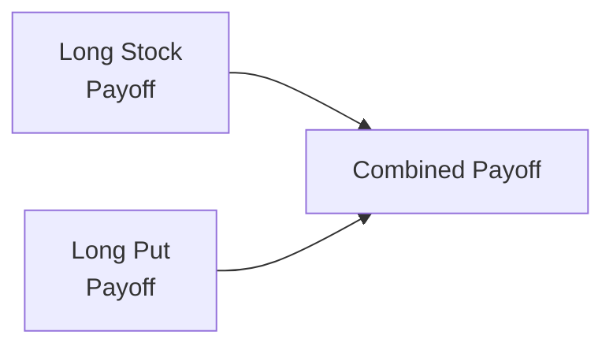
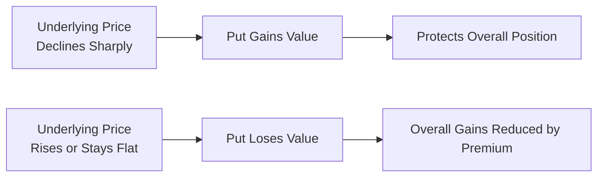

## 18.3 The Married Put (Protective Put)

Imagine you’ve been excited about a particular Canadian energy stock—maybe you strongly believe in the company's fundamentals. You pile in, buy shares, and plan to hold them for the long haul. But then, just as you’re settling in, the market enters one of its infamous rough patches. Prices tumble, and you start losing sleep, wondering, “Should I sell? Or should I continue holding and hope for a turnaround?” Well, there’s a neat little strategy that can help you manage those sleepless nights: the Married Put, often called the Protective Put. It’s a way to keep your shares in your portfolio while also locking in a form of “insurance” to protect against major drops.

Below, we’ll explore what the Married Put is, how it fits into bullish strategies, and how you might apply it to cushion your downside risk. We’ll also take a look at real-world examples, discuss some personal insights, and connect everything to official Canadian regulatory guidelines (like those from the Canadian Investment Regulatory Organization, or CIRO). Let’s jump right in.

  
**What Is a Married Put (Protective Put)?**

A Married Put is a strategy where you own shares of an underlying asset—energy stock, gold mining shares, or even a broad market ETF—and simultaneously purchase a put option on that same underlying. This put option gives you the right (but not the obligation) to sell your shares at a predetermined strike price by a set expiration date. If the underlying tanks, that put option can significantly offset your losses. If the underlying soars, you still benefit from those gains, just minus the cost of the put premium.

It’s called “married” because the underlying shares and the put option are acquired as one cohesive position. Some folks even think of the put in this strategy like “insurance,” because it can protect your capital against extreme downturns. Now, keep in mind: just like real insurance, you pay a premium (the cost of the put). That premium is essentially the maximum extra money you risk in return for peace of mind and a safety net.

  
**Why Consider a Married Put?**

• **Downside Protection**: Provides a safety net if the stock (or ETF) price plunges.  
• **Flexible Upside**: You still get to benefit if the underlying moves up, though any profit is reduced by the option premium.  
• **Psychological Comfort**: Helps manage the emotional rollercoaster of big market swings by limiting catastrophic losses.  

Sometimes, folks might say, “I’m bullish on the company, but I’m worried about short-term volatility.” Or, “I want to stay in the market but I can’t afford to risk a huge drop.” Sound familiar? Then a Married Put could be up your alley.

  
**Key Components**

• **Long Underlying**: You own (or purchase simultaneously) the shares of the stock or the units of an ETF.  
• **Long Put**: You buy a put option with a certain strike price.  
• **Strike Price**: The price at which you have the right to sell your shares if you choose.  
• **Option Expiration**: The date at which the put option expires.  

You might be thinking: “Hey, if it’s that good, why wouldn’t everyone just do it?” Great question. The short answer is: premium cost. You must pay for that put. Over time, repeated premium costs can eat into returns if the stock doesn’t end up dropping like you’d feared. It’s a trade-off: you give up some potential returns (the cost of insurance) in exchange for calmer nights if the market plunges.

  
**Practical Example**

Let’s say you purchase 100 shares of RBC (Royal Bank of Canada) at CAD 120 each. You’re bullish for the long term, but there’s a big central bank announcement next month, and the last few times announcements were made, banking stocks gyrated by 5–10%. To hedge, you buy a put option that expires in two months, with a strike price of CAD 115. Let’s assume it costs you CAD 1 per share in premium, so you pay CAD 100 for the put contract.

If RBC’s price plummets to CAD 100, your shares lose CAD 20 per share. But your put option (with a strike of CAD 115) gains intrinsic value—essentially you can sell RBC at CAD 115. So your net loss is limited:  
• For the stock: You lost CAD 20 per share (from 120 to 100).  
• For the put: You gain CAD 15 per share in intrinsic value (since you can sell at 115 while the market is 100). You paid CAD 1 for the put.  

Hence, your net loss is actually closer to (20 - 15 - 1) = CAD 4 per share. Compare that to the full CAD 20 you might have lost if you held the shares alone. That difference is your “insurance payout.”

If RBC’s shares climb to CAD 130, your put likely expires worthless. But you get to keep the profit from CAD 120 to CAD 130 on the shares—CAD 10 per share—minus that CAD 1 premium you paid. So your net profit is CAD 9 per share, as opposed to CAD 10 if you hadn’t purchased the put. Not a bad cost for what you might consider a restful night’s sleep.

  
**Risk-Reward Profile**

Let’s illustrate the payoff at expiration for a Married Put using a simple diagram. Think of the payoff in two parts: the stock payoff plus the put payoff. For a quick visualization, let’s deploy a Mermaid diagram:

However, that’s just the structural breakdown. If we want to see the payoff lines, let’s do a bit more advanced depiction:

  
**At Expiration**:  
• If the underlying is below the put strike price, you can exercise your put and sell the stock at the strike, limiting your downside.  
• If the underlying is above the put strike price, the put expires worthless. Your only cost is the premium paid, which reduces your net profit.  

  
**Suitability Considerations**

One might say, “I want some downside protection but want to keep a bullish stance. Is that me?” Possibly! Married Puts are typically suitable for:  
• Investors who have a bullish outlook on the underlying but want to limit nasty losses.  
• Individuals or funds that cannot afford large drawdowns—maybe you’re a retiree living off your portfolio or a corporate treasurer responsible for protecting capital.  
• Market participants who see a possibility of a near-term market event (earnings, major economic data release, geopolitical tension) that could cause volatility.  

But consider the cost. Because you’ll pay that premium, think carefully about:  
• Your time horizon: Are you holding these shares for a short period while expecting a big move? Or is this your “forever” hold?  
• Volatility environment: Option premiums are often more expensive in times of high uncertainty (e.g., right before big announcements, or if the VIX is high in the U.S. or HVX in Canada).  
• Strike selection: A higher strike (closer to current price) offers more protection but has a higher premium. A lower strike (far out-of-the-money) is cheaper but requires a bigger drop in the stock price before your “insurance” kicks in.  

  
**Personal Anecdote**

I recall a friend of mine, let’s call her Sarah, who had a large position in a Canadian gold mining company. She’d invested early and enjoyed nice gains, but precious metals prices can be notoriously volatile. She was thrilled on the upside but anxious about losing those hefty gains. So she decided to buy puts for the first time in her life—just a small outlay in premium each quarter. Over a year, the total cost ate into some of her gains, but when gold prices suddenly corrected, her protective puts kicked in, and she secured her profits. She often jokes, “Paying for puts is a bit like paying for condo insurance—it may feel like a waste, until you actually need it.”

  
**Regulatory Context and CIRO Guidelines**

In Canada, the primary self-regulatory body for investment dealers and mutual fund dealers is the Canadian Investment Regulatory Organization (CIRO). CIRO was formed as a result of the amalgamation of IIROC and the MFDA, both of which are now defunct. CIRO’s role is to ensure a stable, efficient market and protect investors by setting regulatory standards.

When using a Married Put strategy in a client’s portfolio, Canadian advisors must:  
• Thoroughly explain the strategy in line with CIRO guidelines on derivatives risk disclosures.  
• Demonstrate how the strategy aligns with the client’s risk profile and investment objectives (Know Your Client - KYC).  
• Provide a Risk Disclosure Statement and obtain a Derivatives Trading Agreement if the client is new to options.  
• Monitor suitability on an ongoing basis, especially if the client’s circumstances change.  

For more details, visit [CIRO’s official website](https://www.ciro.ca), which outlines the updated rules and best practices for managing client accounts, margin requirements, and reporting obligations.

  
**Using the Options Strategy Evaluation Tool**

As a side note, many Canadian discount brokerages and third-party analytics providers offer “Options Strategy Evaluation Tools.” These tools can help you compare potential outcomes across different option strategies. They often let you input:  
• The stock’s current price.  
• The desired strike.  
• The time to expiration.  
• The implied volatility.  
• Interest rates (to calculate time value and assist in more advanced metrics).  

You’ll typically see a profit-loss chart that visually shows how your portfolio might perform under various market conditions. If you’re new to options or want a second opinion, these tools can be valuable. Just keep in mind that they rely on assumptions (like implied volatility staying constant), so they’re not crystal balls—they’re rough guides.

  
**Cost of the Premium and Its Impact on Returns**

One common pitfall for Married Put novices is forgetting to track how repeated, ongoing premium costs might affect your returns. It’s tempting to keep rolling your puts (buying new puts when old ones expire) if the market stays frothy. But if you do that for months or years on end, you might find you’re paying so much premium that your net returns are subpar compared to simply holding the underlying.

A question to ask yourself:  
• How likely is a major downturn within the put’s time frame?  
• Am I comfortable sacrificing a portion of potential gains for this protection?  
• Is there a more cost-effective alternative to manage my downside (e.g., a stop-loss order, or if you’re advanced, maybe a collar strategy)?

Sometimes, a Married Put can be a short-term hedge around critical events (earnings, product launches, or macroeconomic data) rather than a permanent fixture in your portfolio.

  
**Hedging vs. Speculation**

One thing to clarify: the Married Put is primarily a hedging strategy. Hedging is about risk reduction, not profit maximization. By contrast, if you were purely speculating with puts, you’d probably buy only puts (without owning the stock) in hopes of profiting from a price decrease. In a Married Put, you already own or buy the stock, and you’re using puts to protect that long position.

  
**Best Practices and Common Pitfalls**

• **Set Clear Objectives**: Know exactly why you’re employing the Married Put—are you expecting short-term turbulence, or is continuous coverage your goal?  
• **Evaluate Strike Selection**: Balancing cost vs. the level of protection is crucial. High-strike puts offer substantial protection but can be pricey.  
• **Watch Expiration Dates**: Don’t buy too many days of time value if you’re only worried about a specific, near-term event.  
• **Continuous Monitoring**: If the market or your personal situation changes, reevaluate your put positions and either roll them or let them expire.  
• **Avoid Emotional Bias**: Sometimes, after a small market dip, you may want to double down and buy more puts. That can be okay, but make sure you’re not overpaying for extreme protection you may not need.  

  
**Margin Implications**

Since this strategy involves a long position in the underlying shares plus a long put, typically your margin usage for the underlying shares is standard. The protective put can actually reduce your overall risk profile, and in some cases, your broker might offer margin benefits. However, each brokerage calculates margin differently, and regulatory guidelines set a minimum standard. CIRO outlines margin requirements that members must follow, so brokers generally align with or exceed those minimums.

If you’re thinking about placing a Married Put in a registered account (like an RRSP), check your brokerage rules. Often, Canadian brokerages permit certain options strategies within RRSPs, but they must typically be “non-leveraged” strategies (like covered calls or protective puts). You may also run into limitations on writing naked positions—something that’s generally not allowed in retirement accounts.

  
**Real-World Market Volatility**

During volatile market periods (say, major political events or pandemics), put premiums can skyrocket because implied volatility shoots up. Buying a put in that environment might feel expensive. One approach is to wait for implied volatility to ease, but that might backfire if the underlying collapses sooner than expected. Another approach is a “low-Delta put,” which is cheaper but offers limited immediate protection. Each approach has trade-offs, so weigh them carefully.

  
**Tax Considerations for Canadian Investors**

While an in-depth tax analysis is beyond the scope of this specific topic, keep in mind that gains and losses on option positions might be treated differently depending on whether you’re considered a professional or non-professional trader, and whether the position is held in a registered account or a taxable account. Married Puts can trigger specific rules about cost base adjustments when options are exercised or expire worthless.

If you want a deeper dive on tax, Chapter 25 of this course, “Canadian Tax Aspects of Listed Options Trading,” offers more detail. Also, always consult a qualified tax advisor to ensure compliance with current CRA guidelines.

  
**Comparison to Other Strategies**

• **Covered Call**: Another popular bullish strategy accompanied by an options overlay—but instead of buying a put, you’d write (sell) a call. This caps your upside, while the Married Put preserves it.  
• **Collar**: That’s effectively a Covered Call plus a Married Put. You might buy a put to protect the downside and sell a call to offset the put’s cost. Collars reduce net premium cost but also limit upside potential more severely.  
• **Stop Loss vs. Married Put**: A simple approach to limiting losses is placing a stop-loss order. However, stop prices can be triggered by intraday volatility, and there’s no guarantee you’ll exit at your stop price if the market gaps down. The Married Put guarantees (subject to your exercise/exercise assignment) you can sell at your strike price.

  
**Regulatory & Educational Resources**

For further insights, you can check out these references:  
• [CIRO’s Regulatory Notices](https://www.ciro.ca).  
• Bourse de Montréal’s Education Page on “Protective Options Strategies”: [https://www.m-x.ca/edu_tutorials_en.php](https://www.m-x.ca/edu_tutorials_en.php).  
• “Characteristics and Risks of Standardized Options” by the Options Clearing Corporation (OCC), though remember there may be some differences between U.S. and Canadian regulation.  

Open-source financial tools, such as the “Options Strategy Evaluation” sections within R-based platforms or Python-based Jupyter notebooks with libraries like `yfinance` and `quantstats`, can help you model historical scenarios.

  
**Conclusion**

Think of a Married Put as a seatbelt for your bullish positions. You might never get into an “accident,” but if you do, that seatbelt can mitigate some nasty damage. Just be aware that seatbelts don’t come free: you pay the premium. By considering your risk tolerance, the underlying’s volatility, and your time horizon, you can decide whether the Married Put belongs in your investment arsenal.

Anyway, as with all derivative strategies, the best approach is to understand your own motivations and constraints. If you find yourself up at night worrying about a catastrophic market plunge, or if you absolutely must protect your capital from dips, the Married Put deserves a look. Otherwise, for many folks, just riding out market fluctuations might be enough. 

At the end of the day, there's no single “right answer” for every investor. Weigh the pros and cons, the premium costs, the potential return sacrifices, and then align those with your personal or corporate financial goals. May your days (and nights) be a bit less stressful as you incorporate thoughtful risk management into your bullish positions.

  
## Sample Exam Questions: Married Put Strategies and Their Uses in Portfolio Protection



### Which best describes a Married Put strategy?

- [x] Owning the underlying asset while purchasing a put option on that same underlying
- [ ] Selling a put option on a stock you do not own
- [ ] Owning a call option and a put option on the same stock
- [ ] Writing a call and a put simultaneously on a stock you own

> **Explanation:** A Married Put, also known as a Protective Put, involves a long position in the underlying plus a long put on the same security.

### Which statement about the Married Put is correct?

- [ ] It eliminates downside risk entirely at no cost.
- [x] It provides downside protection but requires the payment of a put premium.
- [ ] It prevents the investor from benefiting if the stock price goes up.
- [ ] It allows the investor to profit more than holding the stock alone if the price rises.

> **Explanation:** The Protective Put uses a paid premium to limit downside losses but still allows upside participation, albeit reduced by the cost of the put.

### In a Married Put strategy, the investor’s maximum loss is generally:

- [ ] Zero, because the put eliminates any form of downside.
- [x] Limited to the difference between the stock purchase price and the put strike (plus the premium).
- [ ] Unlimited, as the stock can always drop to zero.
- [ ] Limited only by the time value of the option.

> **Explanation:** If the underlying falls below the put strike, the investor can exercise the put, essentially locking in a minimum sale price. The put premium adds to the total cost.

### A key reason to use a Married Put rather than simply selling the stock could be:

- [x] The investor wants to stay invested in the stock for potential upside but also limit large losses.
- [ ] The investor wants to generate immediate income from the put premium.
- [ ] The investor wants to minimize commissions on trades.
- [ ] The investor has no specific view on the stock’s future direction.

> **Explanation:** Investors typically choose a Married Put when they maintain a bullish outlook but want to hedge against severe downward moves.

### Which of the following is a disadvantage of a Married Put?

- [x] It requires payment of a premium, which may reduce overall returns.
- [ ] It completely eliminates the possibility of upside gains.
- [ ] It is prohibited by CIRO for retail investors.
- [ ] It offers no downside protection whatsoever.

> **Explanation:** Married Puts allow upside gains; they do come with a cost in the form of the premium, which reduces net returns.

### Consider a scenario: You buy 100 shares at CAD 50 and simultaneously purchase a CAD 45 put for CAD 1 per share. If the stock price drops to CAD 40 at expiration, your put’s intrinsic value is:

- [x] CAD 5 per share
- [ ] CAD 0 per share
- [ ] CAD 10 per share
- [ ] CAD 50 per share

> **Explanation:** The put option has intrinsic value of (45 - 40) = CAD 5.  

### Under current CIRO guidelines, a client utilizing a Married Put in a margin account:

- [x] May see a reduction in margin requirements because the long put reduces risk.
- [ ] Always has to pay higher margin for the stock.
- [ ] Has no obligation to disclose this strategy to the dealer.
- [ ] Is not allowed to use any derivative for hedging.

> **Explanation:** Regulatory frameworks often provide margin offsets or lower margin requirements for positions that reduce a portfolio’s risk profile, such as a Married Put.

### If you “roll” a Married Put, what does it typically mean?

- [ ] Selling your stock at the current market price.
- [ ] Buying a call option to add to your stock position.
- [x] Closing out the expiring put and buying another put with a later expiration date.
- [ ] Selling a put option on a different stock for a net credit.

> **Explanation:** “Rolling” typically involves exiting your existing option (especially if nearing expiration) and establishing a new option position for continued coverage.

### Which of the following statements is true about the Married Put payoff profile at expiration?

- [ ] The maximum profit is lower than simply owning the stock by exactly the put premium.
- [ ] The maximum loss is unrestricted if the stock price drops below the put strike.
- [x] The maximum loss is limited to the strike price minus the stock purchase price plus the premium.
- [ ] The profit potential is entirely capped above the put strike.

> **Explanation:** The put sets a floor at the strike price; you lose the difference between purchase price and strike plus the premium paid.

### A Married Put is considered:

- [x] A hedging strategy designed to protect existing or newly purchased long stock positions.
- [ ] A purely speculative strategy that bets on a market crash.
- [ ] A risk-free arbitrage strategy for guaranteed profits.
- [ ] Advisory accounts are not permitted to use this strategy.

> **Explanation:** Married Puts are primarily a risk mitigation technique for a bullish stock holder, not a method for speculative gains or risk-free arbitrage.


