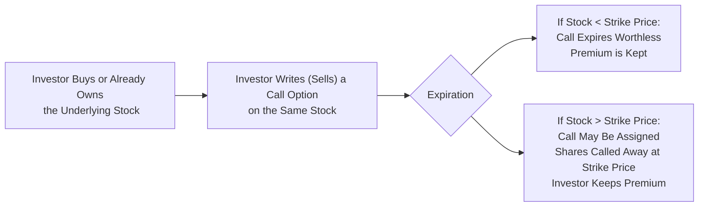

## 18.4 The Covered Call Strategy

Have you ever found yourself holding a stock that you still like but don’t feel super optimistic about its explosive growth potential? Or maybe it just trades sideways for a while, and you wish you could squeak some extra income out of it. Well, let’s chat about one of the oldest, simplest, and most popular option strategies out there: the covered call. This approach has been a favorite of both retail and institutional investors who are moderately bullish or (dare I say) neutral on a stock’s short-term upside. Let’s dig in.

### Introduction

The covered call strategy combines two elements:  
• A long position in the underlying asset (e.g., shares of a single stock).  
• A short call option on that same underlying asset (one call contract typically represents 100 shares).  

Essentially, you own the shares but simultaneously write (sell) a call option against them. In return for selling that call option, you receive a premium. If the stock remains below the strike price of the call, you pocket the premium and keep your shares. If the stock rockets above the strike price, you may have to part with your shares (they get “called away” from you at the strike price). Because of that possibility, your upside profit potential becomes limited—but at least you’ve collected that premium, no matter what.

And just so you know, I’ve tried this strategy a few times myself—often in those times when I thought a particular stock was going nowhere special in the short term. I’d initially get excited about the premium income, but occasionally the stock would unexpectedly surge beyond my strike price. Let me tell you, that pang of regret when you have to let a big winner go can sting a bit! That minor heartbreak aside, a covered call can be a neat tool in your investing arsenal—especially if you’re comfortable with a moderate outlook for the stock’s price movement.

### What Is a Covered Call?

A covered call is straightforward: hold the underlying shares and short one call option for every 100 shares. Because you already own the underlying, your obligation to deliver the shares (if assigned) is considered “covered.” The premium you receive from writing the option is essentially yours to keep, but there’s a catch: you sacrifice additional gains once the stock price crosses the call’s strike price.

Let’s define some important terms and concepts closely associated with a covered call:

- **Writing (Selling) Options**: Creating an option contract that does not yet exist in the marketplace and selling it to another market participant.  
- **Assignment**: If the call buyer exercises the option, you (the seller/writer) must deliver the underlying shares at the strike price.  
- **Opportunity Cost**: Missing out on higher gains if the underlying’s price rallies well above your strike price.  

### Why Consider a Covered Call?

Why would anyone intentionally cap their gains? Believe it or not, there are some appealing reasons to consider a covered call:

• **Income Generation**: The premium you collect can enhance returns on a stock that might otherwise be sitting idle or not paying a dividend.  
• **Partial Downside Cushion**: The premium can help offset a small dip in the stock’s market price. If the stock does drop, the loss is slightly reduced by the amount you gained via the option premium.  
• **Simple and Easy to Understand**: Among the arsenal of option strategies out there, the covered call is about as straightforward as it gets.  

But, it’s not all roses. Your big trade-off is capping that upside if the stock surges beyond the strike price. So, if you think your stock could blast way higher, a covered call might feel a bit restraining.

### Mechanics of a Covered Call

Let’s briefly outline the mechanics in a simple flow:

1. **Own the Stock**: Step one is to have the shares in your account.  
2. **Write a Call**: You then sell a call option, typically out-of-the-money (e.g., a strike price above the current market price) if you’re only mildly bullish.  
3. **Collect the Premium**: You receive cash (this is yours regardless of future price movements).  
4. **Expiration**:  
   - If the stock remains below the strike price, the option expires worthless. You keep your stock and the entire premium.  
   - If the stock surpasses the strike price, there’s a strong chance the option buyer will exercise. You must deliver the shares at the strike price. You still keep the premium, but any gains above the strike price do not go to you.  

### A Closer Look at Risk and Reward

The risk profile of a covered call can be broken down as follows:

- **Downside Risk**: You still have full exposure to the stock’s downside (minus the premium collected). If the stock collapses to zero (which is rare, but let’s be dramatic for a moment), you lose almost the entire value of your position, offset only by the call premium.  
- **Upside Potential**: Gains are capped once the stock price hits your option’s strike price. Any moves above that strike price don’t benefit you.  
- **Breakeven**: The breakeven point is effectively your stock’s purchase price minus the premium received (assuming no other fees, commissions, or complexities). If you bought your stock at $50 and received a $2 premium, your breakeven is $48.  

Here’s a straightforward numerical example:

• You own 100 shares of ABC Inc. at $50/share.  
• You write (sell) one call option with a strike at $55, receiving a $2 premium per share (a total of $200).  
• Outcome 1—ABC is below $55 at expiration (say, $53):  
  - The call option expires worthless.  
  - Your total profit is your stock appreciation from $50 to $53 ($3 x 100 = $300) plus the $200 premium, for a total of $500.  
• Outcome 2—ABC soars to $60:  
  - The call is likely assigned. You must sell at $55.  
  - You still pocket your $2 premium, so total gain is $(55 - 50) x 100 = $500 plus the $200 premium = $700.  
  - Your effective profit is capped at $7 per share ($5 capital gain + $2 premium). That’s not terrible, but you miss out on the additional $5 per share if the stock actually hits $60.  
• Outcome 3—ABC falls to $45:  
  - The call expires worthless, so you keep the $200 premium.  
  - You lose $(50 - 45) x 100 = $500 on the shares, offset by the $200 premium, so your net loss is $300.  

### Suitability and Investor Profile

A covered call is often suitable when you:

• Already own shares and expect a moderate rise or sideways movement.  
• Are looking for extra yield (premium income) on top of dividends or small capital gains.  
• Don’t mind parting with your shares at the strike price.  

This strategy might not be so great for you if:

• You anticipate a large stock explosion to the upside and want unlimited gains.  
• You want robust downside protection—remember, you only have a small cushion from the premium.  

From a regulatory standpoint in Canada:

• CIRO (Canadian Investment Regulatory Organization) has replaced the historical bodies, including IIROC and MFDA, for overseeing registered firms and individuals. You’ll want to consult CIRO’s latest guidelines for any margin or account requirements for covered calls.  
• The Bourse de Montréal (Montréal Exchange) sets margin rules for exchange-listed options in Canada (see https://www.m-x.ca).  

### Practical Margin Considerations

Generally, a covered call is considered a relatively safe strategy from a margin-lending perspective because your ownership of the underlying “covers” your obligations. That said:

• **Margin Requirements**: They can vary from broker to broker, but regulators like the Bourse de Montréal and CIRO typically have minimal margin requirements for a properly covered call, since it’s less risky than a naked call.  
• **Registered Account Limitations**: In Canada, many registered accounts (like RRSPs or TFSAs) allow covered calls under certain conditions. Regulations frequently require the covered call to be “qualified” or “covered” by the actual shares within the registered account.  

### A Real-World Anecdote

I recall a friend who owned a big stake in a Canadian energy company—and from his perspective, the stock was going nowhere for the next few months. So he wrote monthly covered calls just out-of-the-money, collecting decent premiums each time. For about six months, the stock never quite broke through those strikes, and he was delighted—this was like collecting rent on an apartment that wouldn’t sell. But then, in one fateful month, the stock soared past the strike price thanks to a surprise corporate announcement. He got assigned. Sure, he made a tidy profit, but the stock soared even higher in the following weeks. He told me he felt he’d missed out on “the mother of all oil rallies.” But overall, he was up on his position, so it wasn’t all that terrible. In fact, that’s precisely the trade-off we’re talking about: consistent income at the expense of capping the big windfall scenario.

### Step-by-Step Example

Let’s break down a concrete, step-by-step scenario for clarity:

1. **You Own Stock**: You have 1,000 shares of MapleTech Inc., bought at $80/share. Total cost basis: $80,000.  
2. **View and Outlook**: MapleTech has stable earnings, no immediate catalysts, and you believe it will trade in a range between $75 and $85 next quarter.  
3. **Covered Call Setup**:  
   • You write 10 call contracts (each contract for 100 shares).  
   • Strike Price: $85, premium per share: $2.  
   • Total Option Premium Collected: $2 x 1,000 = $2,000.  
4. **Possible Outcomes at Expiration**:  
   • Underlying Price < $85: All calls expire worthless. You keep your 1,000 shares plus the $2,000 premium. MapleTech is at $83, so your shares are worth $83,000, plus you have your $2,000 premium, for $85,000 total.  
   • Underlying Price > $85: Let’s say it moves up to $90. The calls are exercised; you must deliver your shares at $85. You lock in an overall profit on your stock of ($85 - $80) x 1,000 = $5,000 plus the $2,000 premium = $7,000 total. You miss out on the extra $5 gain per share ($90 minus $85), but that’s the classic covered call trade-off.

### Income Enhancement vs. Opportunity Cost

One of the biggest psychological hurdles with a covered call is the sense of opportunity cost. We always hear that big “What if?” voice in our heads:

• **What if the stock blasts to the moon?**  
• **What if the next earnings call triggers a 30% jump?**  

It pays to be realistic here. If your fundamental outlook is not that bullish, the covered call might help you lock in a guaranteed premium. If your stock does remain flattish or only mildly moves upward, you’ll be patting yourself on the back for generating that extra income. If, however, you truly believe MapleTech is about to double in price, then selling calls is definitely going to hamper your potential profits.

### Regulatory Guidance and Resources

In Canada, you should look at:

• **CIRO** – https://www.ciro.ca. Since January 1, 2023, the MFDA and IIROC are no longer separate organizations. CIRO is now the single national self-regulatory organization overseeing both dealer and marketplace regulation. Its guidelines on options trading, margin requirements, and suitability are your go-to resource.  
• **Bourse de Montréal** (Montréal Exchange) – https://www.m-x.ca. This is simply the main exchange for listed equity and index options in Canada. They publish margin rules, product specifications, and educational resources.  
• **CSA Bulletins** – The Canadian Securities Administrators frequently issue notices or bulletins about derivatives usage, risk disclosures, and compliance. While typically geared toward more complex derivatives, these bulletins can shed light on best practices for covered call strategies, especially within registered accounts.  

### Best Practices and Common Pitfalls

Here are some best practices to keep in mind:

• **Pick a Reasonable Strike**: Choose a strike that reflects your price target. If you’d be happy selling the shares at that price, it’s probably a decent strike.  
• **Consider Expiration**: If you want more frequent premium collection, consider near-term expirations, but realize you might get assigned more often if the strike is too low.  
• **Monitor Your Position**: Don’t just walk away. If the stock surges significantly above your strike, you might want to buy back the call (possibly at a loss) and consider rolling to a higher strike or a later expiry, if that aligns with your outlook.  
• **Stay Alert to Dividends**: If your stock pays a dividend and the call is in-the-money, sometimes the buyer of the call may choose to exercise early to lock in the dividend. That can affect you if you really wanted to keep the underlying for dividend income.  
• **Tax Implications**: In Canada, options can trigger capital gains or losses depending on how they’re classified. If you’re an active trader, the CRA may insist you treat option gains as income. Make sure to keep good records for when you close your position or get assigned.  

A couple of pitfalls:

• **Writing Calls on Stocks You Don’t Want to Sell**: If you’d be upset losing your cherished “forever hold” stock, this might not be the strategy for you.  
• **Failing to Plan for Assignment**: Investors sometimes forget assignment can happen before expiration if the call is deeply in-the-money. Don’t be caught off guard.  

### Using Tools and Platforms

Modern trading platforms often provide tools to help manage your covered calls:

- **Covered Call Screeners**: Filter out possible opportunities.  
- **Option Strategy Builders**: Simulate potential outcomes at expiration.  
- **Volatility Analytics**: Evaluate implied volatility, which can significantly impact your option premium.  

Open-source analytics libraries like [quantlib](https://www.quantlib.org/) or [pandas](https://pandas.pydata.org/) with Python can be harnessed if you’re inclined to do more advanced modeling or track historical returns. But for many folks, a standard brokerage platform with a user-friendly interface may suffice.

### Conclusion

A covered call can be a comforting way to generate extra income if you hold a stock with a mild or neutral short-term outlook. Every strategy has a trade-off, and here that trade-off is capping your upside in exchange for premium income. Yet, in many situations—particularly in a stable or modestly bullish market—it’s a proven method to bring in cash, lower breakeven points, and offset small dips.

Remember, always check your regulatory obligations under CIRO, confirm margin requirements with your broker, and ensure that a covered call suits your investment objectives. And if you’re curious to learn more, you can check out resources from the Bourse de Montréal or read some of the CSA bulletins on derivatives usage. As always, staying informed is half the battle.

So there you have it. Whether you’re craving an extra bit of yield on a sleepy stock or simply want to reduce your cost base, consider giving the covered call a look. You might just find it’s the ideal strategy for capturing that “bit of something” in your portfolio—without too much added hassle.

---

## Sample Exam Questions: Covered Call Strategy and Its Implications



### A covered call involves which of the following positions?

- [x] Owning the underlying asset and selling a call option on that asset
- [ ] Owning the underlying asset and buying a put option on that asset
- [ ] Selling a naked call option without an underlying position
- [ ] Buying both a call and a put option simultaneously

> **Explanation:** A covered call strategy requires holding the underlying stock and selling a call on the same stock, ensuring the short call is “covered.”

### Why might an investor write a covered call on a stock they already own?

- [x] To earn premium income when they have a neutral to moderately bullish outlook
- [ ] To eliminate all downside risk on their stock position
- [ ] To leverage their position for unlimited upside gains
- [ ] To protect against market downturns beyond the first 10% drop

> **Explanation:** The primary motivation is capturing premium income when expecting limited upside. The strategy only provides a small cushion, not complete downside protection.

### Suppose you buy a stock at $40 per share and write a call with a $45 strike for a $1 premium. What is your breakeven on this position, ignoring other costs?

- [ ] $41
- [ ] $42
- [x] $39
- [ ] $40

> **Explanation:** Breakeven is the stock purchase price ($40) minus the premium ($1) = $39.

### Which of the following outcomes occurs if the stock’s price exceeds the strike price at expiration for a covered call position?

- [ ] The option expires worthless, and the investor keeps the stock
- [ ] The investor must sell the underlying stock at the market price
- [x] The investor must deliver the stock at the strike price
- [ ] The position automatically rolls into a new call at a higher strike price

> **Explanation:** If the option is in-the-money at expiration, the call option buyer may exercise, forcing the seller to sell shares at the strike price.

### When writing a covered call, what best describes the “opportunity cost” an investor faces?

- [ ] The inability to rebalance their portfolio during the life of the option
- [ ] The chance of paying extra margin on the trade
- [x] Missing out on further gains above the strike price if the stock appreciates substantially
- [ ] Having to close the position prematurely if implied volatility rises

> **Explanation:** By committing to sell the stock at the strike price, the investor loses any future gains above that price.

### True or False: A covered call is generally considered more conservative than a naked call position.

- [x] True
- [ ] False

> **Explanation:** In a covered call, the underlying shares “cover” the obligation. A naked (uncovered) call exposes the investor to virtually unlimited risk if the stock’s price soars.

### Under Canadian regulations, which organization sets the primary rules for margin and trading of exchange-traded equity options?

- [ ] Canada Revenue Agency (CRA)
- [x] The Bourse de Montréal (Montréal Exchange)
- [ ] The Federal Reserve
- [ ] The Canadian Depository for Securities (CDS)

> **Explanation:** The Bourse de Montréal provides contract specifications, margin requirements, and guidelines for exchange-listed options in Canada.

### Which factor best describes the partial downside protection offered by a covered call?

- [ ] The entire stock position is hedged no matter how low the stock falls
- [ ] The premium received can offset a significant portion of any loss
- [x] The premium received can slightly offset some of the stock’s loss
- [ ] There is no downside protection at all

> **Explanation:** The premium received does help cushion some loss, but it doesn’t fully protect against a large decline in the stock’s value.

### Which of the following statements about early assignment is correct in the context of covered calls?

- [ ] Covered calls cannot be assigned early
- [ ] Early assignment can only occur at expiration
- [x] Early assignment is possible, especially if the option is deep in-the-money or a dividend record date is approaching
- [ ] Early assignment never happens unless implied volatility is zero

> **Explanation:** Option buyers have the right to exercise early, particularly if the option is deep in-the-money or if there is a dividend they aim to capture.

### True or False: You can write a covered call in some registered Canadian accounts if you already hold the shares in that same account.

- [x] True
- [ ] False

> **Explanation:** Many Canadian brokers and CIRO regulations allow covered calls in certain registered accounts, provided the underlying is properly held in the same account.


