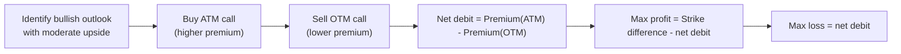
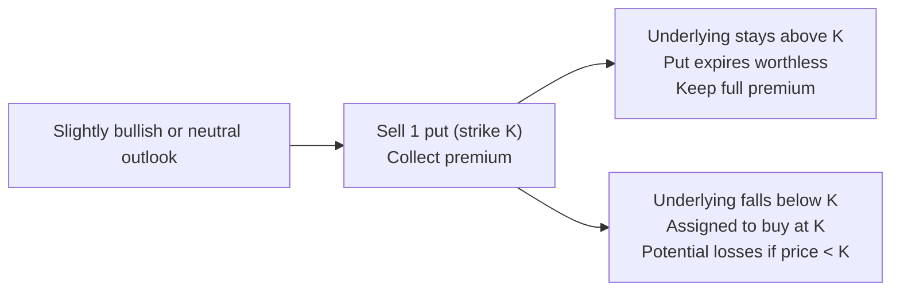

## 18.5 Additional Bullish Strategies: Bull Call Spread & Short Put

Sometimes you’re bullish, but also kinda cautious about paying too much premium on a single long call. Or you might be fine if the market wobbles a bit—maybe you’re even willing to buy a stock if it falls below a certain price. In this section, we’ll talk about two noteworthy bullish strategies—Bull Call Spreads and Short (Naked) Puts—that can help you shape your risk and reward profile. Personally, I remember getting stuck in a situation where I liked a stock’s upside but didn’t have the capital or risk appetite for a straightforward long call. A bull call spread turned out to be a neat choice back then. Let’s dive right in.

### Bull Call Spread

A bull call spread is a classic strategy for traders who anticipate a moderate upward movement in an underlying asset. You establish it by buying one call option at (or near) the money, while simultaneously selling another call option at a higher (out-of-the-money) strike. The result is a “spread” with a net debit—meaning you pay some cash up front, but less than if you had just purchased the call alone.

Why might you do this? Because you want some upside exposure but prefer not to shell out as much premium as a single unhedged call. Of course, no free lunch here: you limit your maximum profit to the difference between the two strike prices (minus the net premium you paid). But that’s often acceptable if you only foresee a moderate rally.

#### Key Mechanics

• Buy 1 call (strike price X)  
• Sell 1 call (strike price Y > X)  
• Net premium paid = Premium on long call – Premium received on short call  
• Max profit = (Y – X) – Net premium paid  
• Max loss = Net premium paid (occurs if the underlying stays below strike X at expiration)  

#### Practical Example

Let’s suppose shares of MapleTech Inc. are trading at $50. You’re modestly bullish, expecting the stock could climb to around $55 or so within the next couple of months, but you don’t see it skyrocketing to $70. A bull call spread might make sense:

• Buy 1 call with strike $50 for a premium of $3.00.  
• Sell 1 call with strike $55 for a premium of $1.25.  

Net debit spent = $3.00 – $1.25 = $1.75. That’s your maximum potential loss—if MapleTech ends below $50 at expiration, your spread finishes worthless, and you lose the $1.75 total you paid. On the upside, if MapleTech settles at or above $55 at expiration, your max profit is $3.25 (the $5.00 difference between $50 and $55, minus your $1.75 cost).

This is often referred to as a “debit spread” because you’re paying money at initiation. The trade-off is that your profit is capped, but your cost is lower than that of a standalone call.

#### Bull Call Spread Setup Diagram

Below is a simple visual flow of how a bull call spread might be constructed:

This approach can be great if you’re convinced the stock won’t rocket beyond that sold call’s strike. But if the stock leaps way above $55 in our hypothetical MapleTech example, you’d still miss out on the extra gains above $55.

### Short (Naked) Put

A short put (also called a “naked put”) is another bullish (or at least neutral-to-bullish) strategy. You earn premium by selling a put option outright, with the expectation that the underlying stays above the strike price by expiration. If you’re right and the stock remains above the strike, that entire premium is yours to keep.

But, oh boy, be aware of the downside risk: if the stock plunges below the strike, you’re basically obligated to buy it at that strike price. Some traders don’t mind this because they’re happy to own the stock anyway—they treat a short put as a cheap way to accumulate shares at a lower, (hopefully) attractive cost basis. However, if the underlying tanks, your potential loss can be large. That’s why short puts typically require significant margin or capital in your account.

#### Key Mechanics

• Sell 1 put (strike price K)  
• Premium collected up front  
• Maximum profit = Premium collected (occurs if underlying price remains above strike K at expiration)  
• Maximum loss = Potentially large if the underlying crashes to zero, since you’re obligated to buy shares at K  

#### Practical Example

Imagine you like a company called CloudBeets, trading at $40. You think $40 is fair, and you say, “I’d be fine owning it at $38 if it drops.” So you sell a put with strike $38 at a premium of $2.00. If CloudBeets stays above $38 until expiration, the put expires worthless, and you keep the $2.00. That’s your max profit. If the stock dips below $38, you might be assigned and forced to buy the shares at $38. Your break-even is $36 ($38 strike minus the $2 premium). You still keep your $2, so effectively you’re buying shares at $36. Of course, if CloudBeets collapses to $20, that’s a painful scenario, because you’d have a big unrealized loss on the shares you were assigned.

Here’s a simplified visual of how the short put works:

### Managing Risk and Margin

Both of these strategies present unique risk and margin considerations under the current Canadian Investment Regulatory Organization (CIRO) framework, which was formed by the historical amalgamation of the MFDA and IIROC. Because a short naked put could mean having to buy shares of the underlying if assigned, your brokerage typically imposes higher margin requirements. A bull call spread, on the other hand, has a defined maximum loss (the net premium), so margin requirements are usually less onerous than a short naked call or put.

If you’re curious about these specific requirements, make sure to consult resources provided by:

• Bourse de Montréal:  
  – https://www.m-x.ca  
• CIRO:  
  – https://www.ciro.ca  

These rules change from time to time, so be sure to keep up with any regulatory updates.

### Payoff Profiles

One of the best ways to “see” these strategies is to look at their payoff graphs at expiration. While we can’t do a perfect coordinate chart with text alone, we can summarize:

• Bull Call Spread:  
  – Flat line in negative territory to the left (maximum loss equals the net premium).  
  – A rising slope after strike X, up to a capped plateau at strike Y.  

• Short Put:  
  – A flat line representing max profit to the left, up to the strike price.  
  – Then a downward slope beyond that strike if the underlying drops, reflecting large potential losses.

### Real-World Considerations

You might wonder how to pick the best strikes. Well, it often involves your forecast of the underlying’s price. Some folks also turn to technical analysis or to fundamental valuation. If volatility is high, short puts can be more attractive because of the higher premiums—but that also implies bigger potential swings. 

I recall a friend who wanted to get into a certain gold mining stock that he felt was undervalued, but still found the price a bit lofty. He decided to write some puts at a lower strike to collect premium and potentially buy the shares at a discount if they dipped. He ended up assigned, but because it was a stock he fundamentally believed in, he said, “No problem—I was going to buy it anyway.” That’s the kind of logic many short-put writers have.

### Advantages and Disadvantages

#### Bull Call Spread
Advantages:  
• Less cash outlay compared to a simple long call.  
• Defined maximum risk and potential profit.  
• Useful in moderately bullish scenarios.  

Disadvantages:  
• Gains are capped if the underlying soars past the short call strike.  
• Still a net debit strategy that could expire worthless.  

#### Short Put
Advantages:  
• Immediate cash inflow.  
• Potential to acquire the underlying at an effective discount.  
• Works well in stable or rising markets.  

Disadvantages:  
• Potentially large losses if the underlying tanks.  
• Higher margin requirement (especially if it’s a naked position and not offset by other positions).  
• Obligation to buy shares at an unfavorable price if assigned.

### Canadian Regulatory and Margin Guidance

Under CIRO rules, carrying short options requires posting sufficient margin. With a short put, the clearinghouse or the brokerage firm wants to ensure you can actually buy the underlying if assigned. For a bull call spread, the margin or capital requirement is usually smaller since your maximum risk is the net premium. 

If you have further questions, definitely go to the Bourse de Montréal’s website (https://www.m-x.ca) for details on margin specifications, and check out https://www.ciro.ca for Canadian regulatory guidelines. Make sure you incorporate these rules into your risk management processes—especially if you’re dealing with large positions.

### Using Python and Open-Source Tools

Sometimes, you might want to simulate different outcomes or calculate scenario-based risk metrics such as Value at Risk (VaR) or Probability of Assignment. Python libraries like QuantLib, Pandas, and NumPy can be very handy for that. You can code up a quick script to see how your bull call spread or short put might behave under different market conditions. This can help ensure your strategy lines up with your risk tolerance.

### Additional Resources

• Bourse de Montréal’s Options Webinars:  
  – https://www.m-x.ca/edu_webinars_en.php  
• Official CIRO Website for margin and compliance updates:  
  – https://www.ciro.ca  
• Third-Party Open-Source Tools (e.g., QuantLib)  
  – https://quantlib.org  

You could also consider taking specialized courses on derivatives at your local university or an advanced educational platform. If you want to see some real-life payoff analyses, take a look at free financial charting tools that allow you to model options strategies; many exist online or via your broker’s platform.

### Best Practices and Pitfalls

• Always set a risk budget. Know how much you’re willing to lose.  
• Understand assignment risk, especially for short puts, because markets can move quickly.  
• Keep an eye on implied volatility. Vol spikes can change your option values even if the underlying barely moves.  
• Monitor margin requirements. A short put can trigger margin calls if the underlying plunges. (No one likes those dreaded phone calls from their broker!)  
• Use stop-loss or exit strategies if the underlying moves against you.  

### Conclusion

Bull Call Spreads and Short Puts are valuable additions to your bullish strategy toolkit. They can help you either reduce the cost of a bullish position (bull call spread) or generate income while offering to buy a stock at a lower price (short put). Like any derivatives strategy, these come with specific risks—and it’s best to do your homework on margin, regulatory obligations under CIRO, and your own risk tolerance before jumping in.

On a personal note, each time I’ve used a bull call spread, I’ve been pleasantly surprised by how it protected my downside while still offering a decent upside potential. Meanwhile, short puts have given me some interesting ways to earn premium in stable markets or pick up stocks at a discount. Whatever you choose, always keep a disciplined approach, monitor your positions, and regularly check with your regulatory framework.

May your trades be well-structured, well-margined, and well-researched!

---

## Sample Exam Questions: Bull Call Spread & Short Put Strategies



### When establishing a bull call spread, what is the maximum potential loss?  
- [ ] The full strike price of the underlying asset  
- [ ] Unlimited  
- [x] The net premium (debit) paid to establish the spread  
- [ ] There is no loss if the underlying moves sideways  

> **Explanation:** A bull call spread involves buying a call and simultaneously selling another call at a higher strike. The maximum loss is limited to the net premium paid if the underlying price stays below the lower strike at expiration.

### Which statement best describes the potential benefit of writing a naked (short) put?  
- [x] You collect premium upfront and might purchase the underlying at an effective discount if it drops  
- [ ] Your losses are strictly capped at the premium paid  
- [ ] You have no obligation to buy the underlying if prices fall  
- [ ] It has zero margin requirement  

> **Explanation:** Selling a put obligates you to buy the underlying if assigned. The premium received can offset some losses, effectively providing a small discount. However, margin is required and risk can be large if the underlying plunges.

### In a bull call spread, which of the following is true regarding the maximum profit?  
- [ ] There is no upper limit  
- [ ] The maximum profit equals the net premium paid  
- [x] The maximum profit is the difference between the strikes minus the net premium  
- [ ] The maximum profit equals the total premiums received  

> **Explanation:** The maximum profit of a bull call spread is (Short Call Strike – Long Call Strike) – Net Premium Paid.

### What is one key reason traders might choose a bull call spread instead of simply buying a call option?  
- [ ] To increase the cost of entering the position  
- [x] To reduce the overall premium paid by selling a higher strike call  
- [ ] To eliminate the need for margin  
- [ ] To have unlimited upside potential  

> **Explanation:** A bull call spread lowers the net cost by pairing a long call purchase with a short call sale, thereby reducing the premium outlay.

### When selling a naked put, your break-even point at expiration is:  
- [ ] Strike price plus the premium received  
- [x] Strike price minus the premium received  
- [ ] The entire strike price  
- [ ] Zero, because you have unlimited risk  

> **Explanation:** For a short put, break-even is the strike price minus the premium collected.

### Under CIRO rules, one key reason short puts may require substantial margin is:  
- [x] The potential for large downside risk if the underlying falls sharply  
- [ ] The strategy has zero risk  
- [ ] Short puts rarely lose money if the underlying drops  
- [ ] All short positions have zero margin requirements in Canada  

> **Explanation:** A short put can generate significant losses if the underlying drops far below the strike, so regulators require robust margin coverage.

### Which statement about the payoff of a naked put is correct?  
- [x] The maximum profit is limited to the premium received, while losses can be substantial  
- [ ] The payoff is identical to a long call option  
- [x] The payoff includes unlimited upside if the underlying soars  
- [ ] There is no potential loss on a naked put  

> **Explanation:** A short put’s profit is capped at the premium, and losses can be quite high if the underlying’s price plummets.

### An investor creates a bull call spread by buying a call at $2.00 premium and selling a higher-strike call at $0.75 premium. What is the net debit?  
- [ ] $0.75  
- [x] $1.25  
- [ ] $2.75  
- [ ] $3.00  

> **Explanation:** Net debit = $2.00 (long call) – $0.75 (short call) = $1.25.

### In a short put strategy, if the underlying’s price stays above the put strike at expiration:  
- [x] The investor keeps the full premium, and the put expires worthless  
- [ ] The investor suffers the maximum loss  
- [ ] The put is automatically exercised  
- [ ] The premium must be returned  

> **Explanation:** If a short put expires out-of-the-money, the seller keeps the premium as profit because no assignment occurs.

### A bull call spread is considered a:  
- [x] Debit spread  
- [ ] Credit spread  
- [ ] Risk-free arbitrage  
- [ ] Strategy with no defined risk  

> **Explanation:** You pay a net premium (a debit) to open a bull call spread, making it a debit spread.


