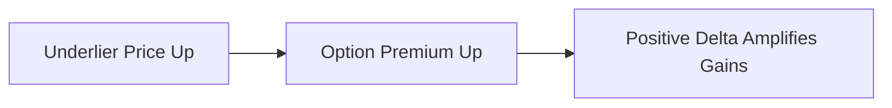
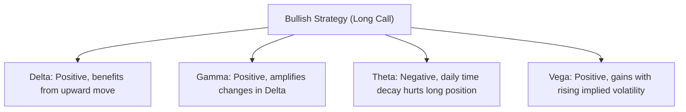

## 18.6 Greek Considerations for Bullish Strategies

So, you’ve decided to take a bullish stance with options and want to understand how each of the option “Greeks” can shape or shift the outcome of your trade. I once overheard a friend say, “I’m bullish, so I’ll just buy calls. What else do I need to know?” And, well, if only it were that simple! In reality, your potential success can depend on how well you manage the key Greeks: Delta, Gamma, Theta, and Vega. Each Greek is a mathematical measure that helps forecast how an option’s price might respond under shifting market conditions—like changes in the underlying asset’s price, passing time, or changes in implied volatility (IV).

Whether you’re a total beginner or a seasoned trader just wanting a refresher, this section will demystify these Greeks for bullish strategies. By the end, you’ll have a clearer idea of how to structure—and tweak—your bullish positions so that they respond in the ways you expect.

Most of our focus will be on long calls, protective puts, bull spreads, and covered calls, since these are some of the most common bullish strategies. But no matter which variation you choose, keeping an eye on the Greeks can help you handle big market swings, corporate earnings announcements, and macro events like interest rate decisions by the Bank of Canada.

Below, we’ll break down each Greek in simple, practical terms, highlight a few best practices, include some real-world examples, and then close with references for further learning—including CIRO regulations, Bourse de Montréal calculators, and CSA notices.

---

### Understanding Delta (Δ)

#### What Is Delta?

Delta (Δ) is arguably the most famous of the Greeks. It measures how much an option’s price is expected to change if the underlying asset’s price moves by $1. For a bullish position like a long call, the delta will be positive (typically between 0.00 and +1.00). A delta of +0.50 means that if the underlying stock or index rises by $1, the option’s premium is expected to increase by $0.50 (all else being equal).

Bullish strategies often have a positive delta because you generally want the underlying to move upwards to realize gains. The closer your call option is to being in-the-money (ITM), the closer delta approaches +1.00. Conversely, at- or out-of-the-money (OTM) calls generally have smaller deltas.

#### The Role of Delta in Bullish Strategies

• **Immediate Sensitivity**: Delta reveals the immediate sensitivity of the option’s value to changes in the price of the underlying. If you’re confident that your stock is about to move significantly higher, you might choose a call with a relatively high delta (e.g., an ITM option) to capture more of that movement.  
• **Hedge Ratio**: Delta can also serve as a hedge ratio. For instance, if you have a portfolio that is equivalent to 100 shares of a stock and you want to partially hedge that position, you could use delta to figure out how many calls or puts you need to offset your exposure.  
• **Directional Conviction**: Some traders who expect a strong bullish move prefer higher-delta calls. Investors who are less certain or think the move might be more gradual tend to choose OTM calls with lower deltas.

#### Quick Example: Balancing Delta

Imagine you buy a call option on ABC stock with a delta of +0.60. If ABC stock moves from $50 to $51, your call is expected to gain about $0.60. If you're correct and the stock surges to $55, you can see how that 0.60 delta can give you a decent payoff. However, if the stock remains stagnant or declines, that same delta no longer helps you—plus you’re fighting time decay (Theta), which we’ll talk about later.

Below is a simple diagram illustrating how positive delta usually benefits from a rise in the underlying price:

In this high-level flowchart, any upward price movement in the underlying tends to push the call premium higher. The magnitude of that push depends on the call’s delta.

---

### Understanding Gamma (Γ)

#### What Is Gamma?

Gamma (Γ) measures the rate of change in Delta itself. In other words, if the underlying moves by $1, Gamma will tell you how much Delta is expected to change. If Delta is a snapshot of how much an option’s price moves at a given moment, Gamma is the next layer: it explains how that snapshot shifts as the underlying price changes.

• A positive Gamma means that if the underlying moves up, your delta will increase; if the underlying moves down, your delta will decrease.  
• Bullish positions that are net long options (like a long call) typically have positive Gamma.

#### Why Gamma Matters for Bullish Traders

Let’s say you own an at-the-money (ATM) call option. It might start with a delta of +0.50. If the underlying rises, delta will likely move toward +1.00, meaning your option will gain sensitivity to further price increases. That’s the upside of having positive Gamma in a bullish strategy.

On the flip side, if the stock or index suddenly declines, your delta will drop—so the losses on the option may accelerate at first, though your position also becomes less and less sensitive to further downward moves compared to the underlying stock.

#### Gamma Scalping

Gamma scalping is a term you might hear from more advanced traders. It involves continuously adjusting (e.g., buying or selling shares) to keep a delta-neutral or near-delta-neutral stance, capturing intraday or intraweek swings. While this is definitely not a beginner-friendly strategy, it’s good to know that Gamma can work in your favor if you’re actively adjusting positions. However, be aware that for each day you hold a long option, Theta (time decay) will be eating away at your premium.

If you’re bullish and just holding a long call for a directional play, you might not do “Gamma scalping”; you’ll simply benefit from rising Gamma if the underlying goes your way. But if you’re a professional or active trader looking to manage or profit from day-to-day volatility, you can consider partial delta-hedging to capture short-term swings. This advanced style requires consistent monitoring and a thorough understanding of Theta and Vega costs.

---

### Understanding Theta (Θ)

#### What Is Theta?

Theta (Θ) measures an option’s time decay. It tells you how much the option’s price might decrease each day if all other factors remain constant. Because options are wasting assets (i.e., their time value erodes as the expiration date approaches), Theta is particularly important in bullish strategies where you’re long an option position.

If you hold a long call, you have a negative Theta exposure. This means each day that passes (without sufficient upward movement in the underlying) chips away at the option’s value. It’s a bit like a melting ice cube: even if the water (underlying) temperature doesn’t change much, you’re still losing valuable time.

#### Mitigating Time Decay

• **Time Your Entry**: If you believe a stock will rally strongly in the next few days, a short-term call might make sense. But if your bullish view is spread out over months, you might consider longer-dated options.  
• **Option Spreads**: Using spreads (e.g., a bull call spread) can offset some of your Theta exposure. By simultaneously buying one call and selling another at a higher strike, you reduce the net premium outlay—hence reducing your daily time decay.  
• **Covered Calls**: If you already own a stock and you sell a call option on it (the covered call strategy), you’re collecting premium. This premium income offsets time decay. Actually, in a covered call, Theta works in your favor on the short call. However, keep in mind that covered calls limit your upside if the stock really takes off.

#### Practical Example: Watching Theta Eat Away the Premium

I recall a scenario where a colleague purchased a short-dated call on a popular tech stock ahead of the company’s earnings. The company’s share price actually inched higher during the week, but it wasn’t enough to outpace the rapid time decay. By expiration, the stock had moved slightly up, but all that juicy potential profit was lost to Theta. This underscores the importance of factoring in how quickly time decay can erode the option’s premium when the underlying price doesn’t rise substantially (and quickly) enough.

---

### Understanding Vega (V)

#### What Is Vega?

Vega (V) measures how much an option’s premium might change if implied volatility (IV) shifts by 1 percentage point. With bullish strategies, especially long calls, you typically have positive Vega. That means if implied volatility rises, your call option tends to gain in value (all else being equal). Conversely, if implied volatility drops—sometimes dramatically right after earnings announcements—long calls can get hammered by a “volatility crush.”

#### Managing Vega During Bullish Setups

• **Timing Around Events**: If you anticipate that implied volatility will spike (maybe because of upcoming news or market uncertainty), it can be beneficial to enter your long options before the spike. But be prepared to exit or trim the position once the event is over if you think volatility will revert to a lower level.  
• **Bullish Positions into Earnings**: Traders often buy calls ahead of earnings to capture big upside moves. Keep in mind that IV can be very high before an earnings release, so the option premium will already be expensive. If the underlying’s price increase is modest or nonexistent, that volatility crush could wipe out a large chunk of the option’s value.  
• **Bullish Spreads**: If you’re worried about a post-event volatility crush, you could utilize strategies like a bull call spread or a call calendar spread to offset some of the Vega risk. For instance, a calendar spread might involve buying a long-dated call with a lower IV and selling a short-dated call (which hopefully has higher IV), thereby reducing your net Vega exposure.

---

### Putting It All Together: The Greeks in a Bullish Position

Now, let’s piece together how Delta, Gamma, Theta, and Vega interact in a typical bullish strategy—like a long call on a Canadian bank stock or a major Canadian index (e.g., the S&P/TSX 60 Index).

1. **Delta**: You want it to be positive, so you profit if the underlying moves up. High enough delta means your option tracks the stock more tightly but also costs more.  
2. **Gamma**: You have positive Gamma, meaning if the stock starts moving in your favor, your option’s delta will climb, further amplifying upside movements. However, if the price moves against you, your delta shrinks (saving you some pain but also limiting your rebound potential if the stock recovers).  
3. **Theta**: Time decay is working against you if you’re purely long the call. Every day that passes without a significant price increase reduces the call’s value.  
4. **Vega**: If implied volatility goes up, you gain on your call (all else being equal). But if volatility suddenly drops—like after an earnings announcement or a key economic release—the call can lose value even if the underlying price remains stable.

Below is a quick depiction of how each Greek can influence your bullish trade:

---

### Real-World Case Study: Bullish Setup on a Canadian Energy Stock

Let’s illustrate with a short case study. Suppose you’re bullish on a Canadian energy company, “CanOil Inc.” You anticipate an upcoming policy announcement that might raise oil prices. The stock currently trades at CAD 40. You decide to buy an at-the-money (ATM) call that expires in two months.

- **Delta**: Suppose it’s +0.50. If the stock pops to CAD 41 quickly, you’d see roughly a CAD 0.50 increase in the call premium (in theory). But if the stock is sluggish, you might not get that boost.  
- **Gamma**: The ATM call also has decent Gamma. If the stock surges to CAD 45, your Delta could climb toward +0.70 or +0.80, so each subsequent price move will have an even bigger impact on your call.  
- **Theta**: This is the downside—time decay will eat away at the option’s time value. Every day that passes without an upward move in the share price effectively lowers your chance of finishing in-the-money (ITM) and reduces your option premium.  
- **Vega**: If implied volatility spikes due to new energy-related legislation rumors, your ATM call might become more valuable. But if markets calm down after some ambiguous statement from the government—and implied volatility falls—your call might lose premium in a heartbeat, even if the stock price doesn’t change much.

---

### Adjusting Positions Based on Greek Analysis

Bullish traders often tweak their positions as the Greeks shift. Let’s say your call moves from out-of-the-money to in-the-money, and your delta climbs from +0.40 to +0.70. You might decide to:

1. **Roll Up**: Sell your now in-the-money call (locking in some profit) and move to a higher strike call if you think there’s more upside. This step might reduce your net delta (and net cost if you collect a credit), but also reduce your time decay or volatility exposure if you pick a shorter date.  
2. **Sell Partially**: If you’ve got multiple contracts, you could sell some to realize gains and hold the rest for potential further upside.  
3. **Set a Stop-Loss or Trailing Stop**: If you’re worried about a big drop in the underlying, you might set a mental or automated stop-loss level. Though remember, stops on options can be tricky if the market’s not very liquid.

---

### Managing Corporate and Macroeconomic Events

One classic pitfall for bullish traders is forgetting how volatility can shift before and after major announcements. For instance:

- **Earnings Announcements**: In Canada, banks often have quarterly reports that can significantly alter their stocks’ prices. Buying a call just before earnings can be appealing (because you expect big moves), but keep in mind that the implied volatility could already be high. After the announcement, even if the stock moves up, a “volatility crush” might offset part of your gains.  
- **Central Bank Decisions**: The Bank of Canada’s rate announcements can drastically change implied volatility. If you hold a bullish position on interest-rate-sensitive stocks, your option’s Vega might get a boost. Or if the announcement is a nonevent, Vega might shrink.  
- **Commodity Price Reports**: For energy and mining stocks, monthly or weekly data releases on global reserves or consumption might temporarily elevate implied volatility. Once the data is out, implied volatility can revert, shrinking your option’s premium if you’re not positioned carefully.

---

### Regulatory Framework and Tools in the Canadian Context

We’re focusing on bullish strategies with options in Canada, so here’s a quick snapshot of relevant bodies and resources.

• **CIRO**  
  Formerly IIROC and MFDA (both now defunct in their individual capacities), the Canadian Investment Regulatory Organization (CIRO) watches over investment dealers and drives market integrity in Canada. Their rules govern how derivatives can be offered to the public, margin requirements for carrying open positions, and how KYC (Know-Your-Client) processes must be done. Staying updated on CIRO’s guidelines ensures you remain compliant, especially around topics like suitability, leverage, and margin.  
  → For official CIRO updates and resources: [https://www.ciro.ca](https://www.ciro.ca)

• **Bourse de Montréal**  
  The Bourse de Montréal is Canada’s primary exchange for trading listed derivatives, including options on stocks, indexes, and ETFs. They offer user-friendly calculators like the Options Calculator that can help you see real-time estimates for Delta, Gamma, Theta, and Vega for any contract listed on the Bourse.  
  → Tool link: [https://www.m-x.ca/tools_calculators_options_en.php](https://www.m-x.ca/tools_calculators_options_en.php)

• **CSA (Canadian Securities Administrators)**  
  The CSA coordinates provincial and territorial securities regulators. They issue notices and guidelines that detail the risks of derivative instruments. For example, they might have official bulletins on the risks associated with selling or buying certain exotic options, or they might require certain risk disclosure statements to be provided to clients.  
  → CSA notices: [https://www.securities-administrators.ca](https://www.securities-administrators.ca)

• **CIPF (Canadian Investor Protection Fund)**  
  CIPF protects client assets if a member firm becomes insolvent. Keep in mind that CIPF coverage does not ensure your option strategy profits; it just covers your brokerage assets in the event your dealer fails.

---

### Common Pitfalls and Best Practices

1. **Ignoring Time Decay**: Buying near-term calls without factoring in how quickly Theta erodes the premium is a recipe for disappointment. If your bullish thesis is medium-term, consider longer expiration dates or spreads to mitigate Theta.  
2. **Underestimating Volatility Crush**: Watch out for major announcements (earnings, central bank decisions). If you purchase calls when implied volatility is already sky-high, you might see a big drop in your option’s premium even if the underlying moves a bit in your favor.  
3. **Overleveraging**: Options can be leveraged instruments. If you go “all-in” on calls, you can lose the entire premium. Make sure your strategy fits your risk tolerance and that you meet CIRO margin requirements if you’re writing or spreading options.  
4. **Failing to Adjust Greeks Mid-Trade**: Markets are dynamic. If your Delta, Gamma, or Vega exposure no longer aligns with your view, consider rolling or adjusting. Don’t be afraid to take partial profits if the underlying has already made a substantial move.

---

### Additional Resources and Further Exploration

For readers seeking more advanced insights:

- **“Options, Futures, and Other Derivatives” by John C. Hull**  
  A staple in academic and professional circles, it offers a mathematical deep dive, including how to theoretically price options, measure Greeks, and manage large derivative portfolios.
  
- **Bourse de Montréal’s Educational Resources**  
  The Bourse regularly hosts webinars and publishes educational articles on options and futures. Great for learning about both basic and advanced Greek management.

- **CSA Risk Disclosure Statements**  
  On the CSA website, you can find official statements about the risks of trading derivatives—useful for understanding the regulations around margin and suitability in Canada.

- **Open-Source Tools** (e.g., Python libraries)  
  Various Python libraries (like “QuantLib,” “NumPy,” or “Pandas”) allow you to create your own Greek calculators. While not officially endorsed by the Bourse or CIRO, these tools can be valuable for academically inclined individuals or those building their own analytics platforms.

---

## Sample Exam Questions: Greek Considerations for Bullish Strategies



### Which Greek measures how an option’s price is expected to change with a $1 move in the underlying?

- [x] Delta (Δ)
- [ ] Gamma (Γ)
- [ ] Theta (Θ)
- [ ] Vega (V)

> **Explanation:** Delta quantifies the expected change in the option’s premium for each $1 move in the underlying stock.

### A bullish option strategy with a net long call position typically has:

- [x] Positive Delta and Positive Gamma
- [ ] Negative Delta and Positive Gamma
- [ ] Positive Delta and Negative Gamma
- [ ] Negative Delta and Negative Gamma

> **Explanation:** Long calls have positive Delta (they profit from upward moves) and positive Gamma (Delta increases as the underlying price rises).

### When you hold a long call, which Greek usually works against you over time?

- [x] Theta (Θ)
- [ ] Delta (Δ)
- [ ] Gamma (Γ)
- [ ] Vega (V)

> **Explanation:** Theta represents time decay, which reduces the option’s extrinsic value each day.

### If implied volatility unexpectedly drops after an earnings announcement, how does it typically impact a bullish long call?

- [x] It can reduce the option’s premium.
- [ ] It increases the option’s premium.
- [ ] It has no impact because the underlying price didn’t move.
- [ ] It doubles the option’s gamma.

> **Explanation:** When implied volatility falls, the option’s premium typically decreases, even if the underlying price doesn’t change much.

### Which of the following best describes Gamma?

- [x] It measures the rate of change in Delta.
- [ ] It measures time decay.
- [ ] It measures exposure to volatility changes.
- [ ] It indicates how an option’s price moves with a $1 change in the underlier.

> **Explanation:** Gamma shows how Delta shifts as the underlying price changes, meaning it tracks the curvature of the option’s price response.

### In a bullish strategy, you want to benefit from an upward move in the underlying. Which Greek indicates your sensitivity to implied volatility changes?

- [x] Vega (V)
- [ ] Theta (Θ)
- [ ] Delta (Δ)
- [ ] Gamma (Γ)

> **Explanation:** Vega measures an option’s sensitivity to changes in implied volatility.

### What is the most common approach to mitigate the negative effects of Theta in a bullish call strategy?

- [x] Using a bull call spread
- [ ] Purchasing deep out-of-the-money calls
- [ ] Holding the position to expiration no matter what
- [ ] Ignoring implied volatility trends

> **Explanation:** A bull call spread offsets some of the Theta erosion by reducing the net premium paid, as you also sell an option to partially fund the long call.

### You buy a call with a Delta of +0.50. If the underlying moves up by $1, all else being equal, how much should the call’s premium change?

- [x] It should increase by about $0.50.
- [ ] It should increase by exactly $1.00.
- [ ] It should increase by about $0.25.
- [ ] It won’t change because it’s not in-the-money yet.

> **Explanation:** A Delta of +0.50 means for every $1 upward move in the underlier, the option’s premium would be expected to rise by $0.50.

### Which of the following is true about Gamma scalping?

- [x] It involves adjusting a position frequently to remain near delta-neutral and profit from price swings.
- [ ] It only applies to deep in-the-money calls.
- [ ] It is the same as covered call writing.
- [ ] It eliminates the effects of Vega.

> **Explanation:** Gamma scalping is used by active or professional traders who regularly rebalance their delta exposure to capture gains from intraday volatility.

### True or False: Buying calls ahead of a major announcement when implied volatility is very high always guarantees a profit if the underlying moves up.

- [x] False
- [ ] True

> **Explanation:** Even if the underlying moves up, a drop in implied volatility (often called a “volatility crush”) can offset or outweigh the gains from the underlying’s price appreciation.



---

 

**Disclaimer**: This content is intended for educational purposes only and does not constitute financial advice. Always consider your individual risk tolerance, consult with a qualified financial advisor if needed, and be mindful of current CIRO rules and margin requirements. The examples provided are purely illustrative and do not guarantee any future returns.
