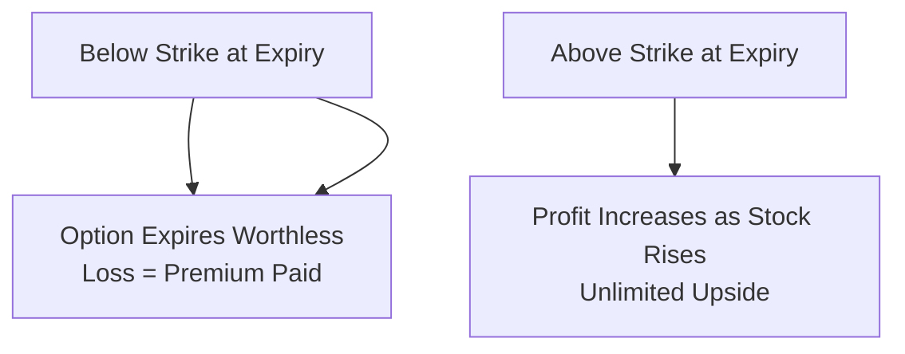
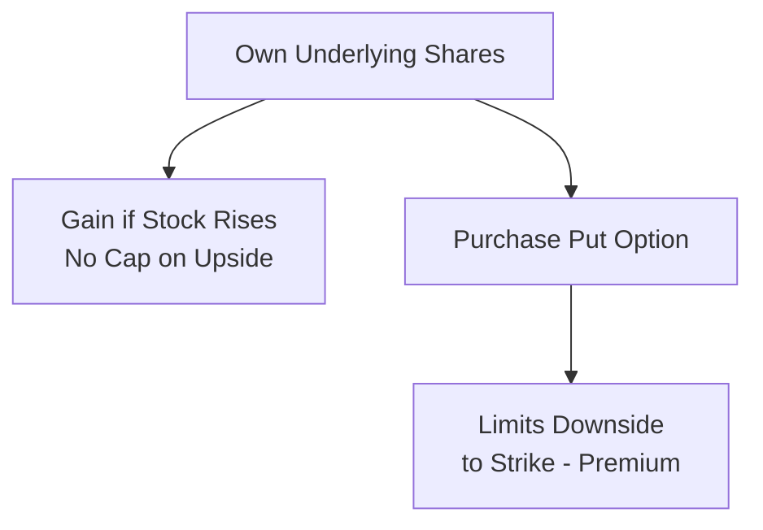
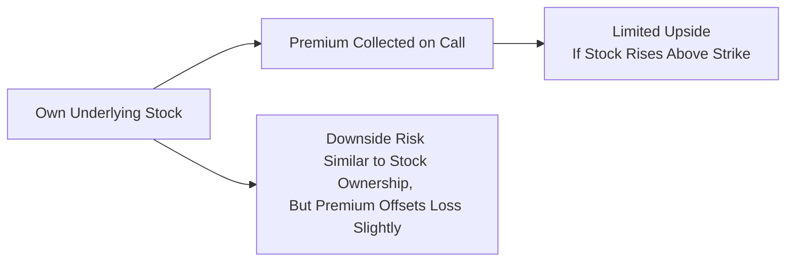
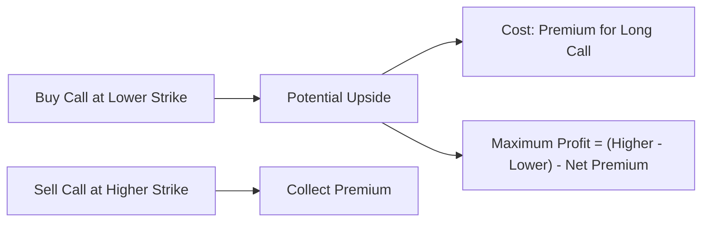
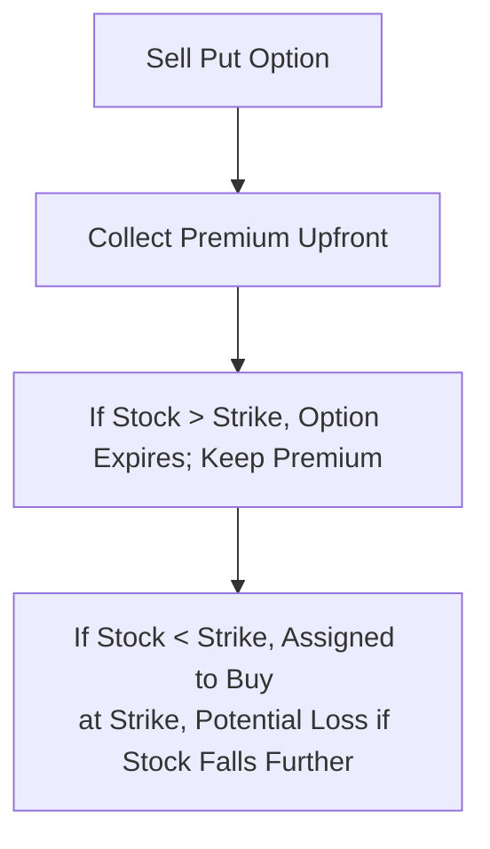

## 18.8 Risk and Reward Analysis for Bullish Strategies

Think about those moments when you look at a stock that seems like it can only go up—maybe the company just released stellar earnings, or you’ve got a hunch about booming consumer demand. If you’re anything like me, you might start picturing all the gains you’d stand to make if you positioned yourself correctly. But grabbing the right strategy from the menu takes a solid understanding of the potential risk and reward. That’s precisely what we’re going to dig into here.

This section walks through the payoff profiles of five major bullish strategies: the Long Call, the Married (Protective) Put, the Covered Call, the Bull Call Spread, and the Short Put. Each offers a unique combination of risk, reward, and margin requirements, and they’re all widely used by investors who believe a stock or an index is on an upward path. We’ll also talk about break-even points, maximum gains, and maximum losses, as well as how broader factors—like interest rates, election cycles, or big macroeconomic data releases—can impact our results in Canada’s markets.

Oh, and just so we’re crystal clear: let’s keep in mind that all references to the old IIROC or MFDA are strictly historical. Today, the Canadian Investment Regulatory Organization (CIRO) is the national self-regulator for investment dealers and marketplace integrity. This is the environment we’re in as of 2025, so we’ll tailor our discussion to align with CIRO’s guidelines, which oversee most derivatives trading in Canada.

-------------------------------------
  
### The Importance of Risk–Reward Analysis

I’ve learned (often the hard way) that it’s easy to get excited about the upside potential of bullish strategies. That’s basically “human investor” nature. The catch is that focusing only on profit potential without understanding potential losses can lead to significant heartbreak if the trade goes south. Before placing your trade:

• Assess the maximum profit you can earn.  
• Understand your maximum possible loss if your outlook proves incorrect.  
• Identify the strategy’s break-even point.  

Whether you’re using a full-service brokerage or an online platform, you’ll typically find tools (some free and open-sourced like Python’s “matplotlib” or “plotly”) that help you visualize payoff diagrams. The Montréal Exchange also provides an education center full of helpful calculators, giving you a quick snapshot of your prospective profit and loss across different possible underlying prices.

-------------------------------------

### Strategy 1: Long Call

Let’s start with the classic bullish play: buying a call option, or simply a “Long Call.” This is often the bread and butter for folks who anticipate a big upside in the underlying but don’t want to tie up capital buying the stock outright.

#### Overview
When you buy a call, you pay a premium for the right (but not the obligation) to buy the underlying asset at a set strike price before the option’s expiration date.

• **Risk**: The most you can lose on a long call is the premium paid.  
• **Reward**: Theoretically unlimited, since the underlying stock could skyrocket.  
• **Breakeven**: Strike Price + Premium Paid (ignoring commissions or fees).

#### Maximum Loss, Maximum Profit, and Break-even
• **Maximum Loss** occurs if, at expiration, the underlying price finishes below the strike. In that scenario, the call expires worthless, and you lose your entire premium.  
• **Maximum Profit** is unlimited. If the underlying moves substantially above the strike, each point above the strike (minus the premium) contributes to your profit.  
• **Break-even** is typically the strike price plus the premium (i.e., if the stock’s price ends up there, your profit or loss is zero—again, ignoring commissions).

For a quick visual, check out the simplified flowchart below:

I remember my first long call: I bought a cheap out-of-the-money call for a biotech stock that I was sure would double after a big clinical trial. The trial results flopped, and my call ended worthless. Still, I only lost the premium—my maximum damage was contained.

-------------------------------------

### Strategy 2: Married Put (Protective Put)

Imagine you already own shares of a company that you expect to keep climbing, but you’re also a bit jittery about potential short-term turbulence. A Married Put, often called a Protective Put, might be your strategy of choice.

#### Overview
In a Married Put, you hold a long stock position and purchase a put option to protect against downside risk. For each 100 shares of the stock, you typically buy one put contract.

• **Risk**: The put option limits the losses on the stock position.  
• **Reward**: The upside from the stock remains theoretically unlimited minus the cost of the put premium.  
• **Breakeven**: (Stock Purchase Price) + (Put Premium).  

#### Maximum Loss, Maximum Profit
• **Maximum Loss** is limited to (Stock Purchase Price – Put Strike Price + Premium Paid). If the stock collapses, the put’s intrinsic value will offset your stock’s losses (beyond the strike price).  
• **Maximum Profit** is essentially unlimited, as with an outright stock position. The only real downside is that you’ve effectively paid more for the stock (the original price plus the put premium).  
• **Break-even** typically is your stock cost basis plus the cost of the put premium.

Here’s a rough process flow:

This strategy can be especially popular during earnings season or those times when macro data might cause big volatility swings—like an interest rate announcement by the Bank of Canada. It gives you the peace of mind that your losses are contained, while still preserving upside potential.

-------------------------------------

### Strategy 3: Covered Call

Next on our list is a strategy that’s known equally for generating partial “synthetic dividends” as it is for limiting your big upside if the stock jumps significantly. The Covered Call might be a great way to earn extra income. Let’s explore.

#### Overview
A Covered Call involves owning the underlying stock and simultaneously writing (i.e., selling) a call option on that same stock. You collect a premium from selling the call, but you risk having to sell your stock at the strike price if the call is exercised against you.

• **Risk**: While the call premium collected lowers your net cost basis, you’re still exposed to the stock’s downside.  
• **Reward**: The premium collected plus any upside in the stock up to the strike price.  
• **Breakeven**: (Stock Purchase Price) – (Premium Received).

#### Maximum Loss, Maximum Profit
• **Maximum Loss** is the stock price dropping to zero (less the premium received), just like any stock ownership scenario.  
• **Maximum Profit** is capped if the option is called away. The call writer’s maximum profit is effectively (Strike Price – Stock Purchase Price) + Premium Received.  
• **Break-even** is your effective cost on the position, generally (Stock Purchase Price – Premium Received).

Diagrammatically:

I have a friend who sells covered calls on a slow-moving utility stock in his retirement account every month for predictable income. He doesn’t mind if the stock gets called away since he’s already satisfied with any moderate upside. This type of strategy is quite popular in stable or mildly bullish conditions.

-------------------------------------

### Strategy 4: Bull Call Spread

If you like the idea of a call option’s upside but find premiums too high or want to reduce cost, the Bull Call Spread might be up your alley. This strategy reduces your initial outlay but also caps your potential profit.

#### Overview
A Bull Call Spread is created by buying a call option at a certain strike (usually at-the-money or slightly out-of-the-money) while simultaneously writing another call at a higher strike price. Both calls typically share the same expiration.

• **Risk**: Net premium paid (the difference between what you paid for the long call and what you received from the short call).  
• **Reward**: Limited to the difference between the two strikes minus the net premium paid.  
• **Breakeven**: Lower Strike + Net Premium Paid.

#### Maximum Loss, Maximum Profit
• **Maximum Loss** is the net debit paid for the spread. If the underlying stays below your lower strike, both calls expire worthless.  
• **Maximum Profit** is the difference between the strikes (strike short call – strike long call) minus the net premium you initially paid.  
• **Break-even** is the lower call strike plus the net premium paid.

For a simplified idea:

This can be particularly appealing if you anticipate a moderate stock increase rather than a home run. For instance, if a major Canadian bank is trading at CAD 90 and you think it’ll go to about CAD 95, you can buy a 90 call and sell a 95 call, significantly reducing your net cost while aiming for that defined profit zone.

-------------------------------------

### Strategy 5: Short Put

The Short Put strategy looks bullish, but sometimes folks don’t immediately categorize it that way. It’s also called a “Naked Put.” Regardless, it’s definitely a bullish stance because you only profit if the underlying stays flat or rises above the strike.

#### Overview
Selling a put option obligates you to buy the underlying at the strike price if assigned. You’re paid a premium upfront, and you keep that money if the option expires worthless.

• **Risk**: Potentially significant if the stock plummets. You’d be forced to buy the stock at the strike, even if its market price is much lower.  
• **Reward**: The premium you initially receive.  
• **Breakeven**: Strike Price – Premium Received.

#### Maximum Loss, Maximum Profit
• **Maximum Loss** can be high if the underlying moves sharply to the downside, because your net cost of the stock will be (Strike Price – Premium Received), but the stock can theoretically go to zero.  
• **Maximum Profit** is the put premium you collected.  
• **Break-even** is the strike price minus the premium.

Diagrammatically:

This strategy is often used by investors who want to own a stock at a discount. They’re effectively saying, “I’m happy to buy shares of this company if it drops to X price.” They get paid premium for waiting. If the stock never gets that low, they keep the premium—like a consolation prize for being patient (though, ironically, the stock never got cheap enough for them to buy).

-------------------------------------

### Calculating Break-Even Points, Maximum Gain, and Maximum Loss

One of the more crucial aspects—especially under CIRO guidelines, which emphasize investor suitability—is to ensure you know exactly how to do the basic math behind break-even points, maximum gain, and maximum loss. Each of these calculations shapes your entire risk–reward perspective.  

Let’s do a simple generic formula list, ignoring commissions or fees (which also matter in real-life scenarios):

1. **Long Call**  
   • **Break-even** = Strike + Premium Paid  
   • **Max Gain** = Unlimited  
   • **Max Loss** = Premium Paid  

2. **Married Put (Protective Put)**  
   • **Break-even** = Stock Purchase Price + Put Premium  
   • **Max Gain** = Unlimited (limited only in a real world by the stock’s possible maximum price)  
   • **Max Loss** = (Stock Purchase Price – Strike Price) + Premium  

3. **Covered Call**  
   • **Break-even** = Stock Purchase Price – Premium Received  
   • **Max Gain** = (Strike Price – Stock Purchase Price) + Premium Received  
   • **Max Loss** = Stock Purchase Price – Premium Received (in theory, can go to zero)  

4. **Bull Call Spread**  
   • **Break-even** = Lower Strike + Net Premium Paid  
   • **Max Gain** = (Higher Strike – Lower Strike) – Net Premium Paid  
   • **Max Loss** = Net Premium Paid  

5. **Short Put**  
   • **Break-even** = Strike – Premium Received  
   • **Max Gain** = Premium Received  
   • **Max Loss** = Strike – Premium Received (in theory, can go to zero)  

-------------------------------------

### Impact of External Factors

Your perfect trade setup might be hammered by factors totally out of left field. Here are some heavy hitters:

- **Interest Rates**: Rising rates can cool market sentiment and compress equity valuations, sometimes leading to lower implied volatilities in certain sectors.  
- **Election Cycles**: Politics can cause big sector rotations overnight—shorting or going long can be tricky when economic policies shift.  
- **Macroeconomic Data Releases**: Non-farm payrolls, unemployment numbers, or inflation data can spike volatility. Over the last few years, we’ve seen enormous short-lived swings based on CPI announcements in both Canada and the United States.  
- **Volatility Changes**: Implied volatility can significantly impact the market price of options. Buying calls in a low-vol environment can be cheaper, but if volatility stays low, time decay can chew you up. Conversely, selling calls in a high-vol environment might net you a larger premium.  

These factors often show up when you least expect them. Perhaps that’s why many traders use scenario analysis tools—like free online payoff calculators or advanced Python-based libraries that let you plug in volatility shifts, interest rate changes, or big price moves. The learning curve can feel significant, but once you learn it, you’re far better equipped to handle market surprises.

-------------------------------------

### Glossary Recap

• **Break-Even Point**: The stock price at which the strategy yields no profit and no loss at expiration.  
• **Maximum Loss**: The worst-case scenario if the trade doesn’t go your way.  
• **Maximum Profit**: The best-case scenario if the trade does exactly what you hope it will do.  

-------------------------------------

### Practical References and Resources

- **Strategy Payoff Diagrams**: The Montréal Exchange’s Education Centre offers free diagrams and strategy guides.  
- **CIRO Resources**: Visit [https://www.ciro.ca](https://www.ciro.ca) for the latest self-regulatory guidelines on margin and option trading rules.  
- **CFA Institute**: Advanced option strategy publications, risk management white papers, plus curated continuing education courses.  
- **Open-Source Tools**: Python libraries like “matplotlib,” “plotly,” or “bokeh” to code your own payoff graphs.  

It’s always wise to run your strategy through a payoff calculator—most Canadian brokerages like Questrade, RBC Direct Investing, or TD Direct Investing (to name a few) have built-in or partner-provided tools that do a lot of the heavy lifting.

-------------------------------------

### Final Thoughts

Whether it’s a straightforward long call or a more nuanced bull call spread, each bullish strategy brings its own flavor of risk and reward. Your job is to align the chosen strategy with your market outlook, risk tolerance, and margin capacity (keeping in mind that margin requirements differ based on the type of position). If your forecast is for a modest price rise, a bull call spread might cut costs and keep you disciplined. If you’re a big believer in a stock’s future, the long call or a protective put might offer a compelling risk–reward profile.  

Anyway, the central takeaway is this: always, always do your risk analysis. Think about your personal preferences, do the math, and confirm how any strategy fits into your portfolio. That way, you’re not just riding a hunch—you’re making an informed and controlled decision. With that approach, you’ll be well-equipped to navigate Canada’s dynamic markets and keep your sails pointed toward growth.

-------------------------------------

## Sample Exam Questions: Bullish Strategies Risk and Reward Analysis



### Which of the following best describes the risk profile of a long call option?

- [ ] Significant risk of unlimited losses 
- [ ] Unlimited risk with bounded upside 
- [x] Limited loss (premium) with unlimited upside potential 
- [ ] Unlimited profit and no risk 

> **Explanation:** A long call limits loss to the premium paid but the upside is theoretically unlimited as the underlying could rise substantially.  

### When establishing a Married (Protective) Put, what is the maximum loss an investor can face?

- [ ] The total amount of the underlying stock’s purchase price 
- [x] (Stock Purchase Price – Strike Price) + Premium 
- [ ] Premium multiplied by 2 
- [ ] There is no limit to the loss 

> **Explanation:** The protective put ensures losses beyond the strike are offset by the put’s intrinsic value. The maximum loss occurs if the stock collapses and is (Stock Purchase Price – Strike Price) + Premium Paid.  

### In a covered call strategy, which component commonly limits the investor’s upside potential?

- [ ] The protective put 
- [ ] The cost of the stock 
- [ ] The short put 
- [x] The short call strike price 

> **Explanation:** By selling a call, the investor obligates themselves to sell the underlying at the strike if assigned, capping the upside.  

### Which statement is true regarding a Bull Call Spread?

- [ ] It is a zero-cost strategy that incurs no out-of-pocket expenses 
- [x] It involves buying a call and simultaneously selling a call at a higher strike 
- [ ] It provides unlimited profit potential 
- [ ] It generates a net credit upon initiation 

> **Explanation:** A bull call spread involves purchasing a call (long call) at a lower strike and writing a call (short call) at a higher strike, usually for a net debit.  

### What is the break-even point for a Bull Call Spread?

- [ ] The lower strike minus the net premium paid 
- [ ] The higher strike plus the net premium 
- [x] The lower strike plus the net premium paid 
- [ ] The midpoint between the two strikes 

> **Explanation:** The lower strike plus the net premium paid is the price the underlying must reach at expiration for the position to break even.  

### If an investor sells a put option (Short Put), what is the maximum profit?

- [x] The premium received 
- [ ] The difference between the stock price and the strike 
- [ ] There is no maximum profit 
- [ ] Unlimited, as the stock can rise indefinitely 

> **Explanation:** For a short put, the maximum profit is the premium initially received.  

### What is a common motivation for using a Short Put strategy in a bullish market?

- [x] To potentially acquire the underlying at a discount if assigned 
- [ ] To hedge an existing long stock ownership 
- [ ] To cap losses in a volatile market 
- [ ] To eliminate all risk from the position 

> **Explanation:** Traders often sell puts when they’re willing to buy shares at the strike price. If not assigned, they keep the premium as profit.  

### Which of the following factors could significantly reduce the value of a long call option even if the underlying stock does not fall?

- [ ] Stock splits 
- [ ] High dividend payouts 
- [x] Time decay (Theta) 
- [ ] Rising interest rates only 

> **Explanation:** Time decay (Theta) erodes the value of an option the closer it gets to expiration, all else being equal.  

### In a covered call strategy, how is the break-even point generally calculated?

- [ ] Stock Purchase Price + Premium Received 
- [x] Stock Purchase Price – Premium Received 
- [ ] Strike Price – Premium Received 
- [ ] Strike Price + Premium Received 

> **Explanation:** The collected premium lowers the effective cost of the stock, so the break-even is Stock Purchase Price – Premium Received.  

### True or False: Under Canadian regulations (CIRO), bullish option strategies are generally unrestricted, and no suitability requirements apply.

- [ ] True
- [x] False

> **Explanation:** CIRO requires registrants to evaluate suitability and ensure clients understand the risks before recommending or executing derivatives strategies, bullish or otherwise.  


