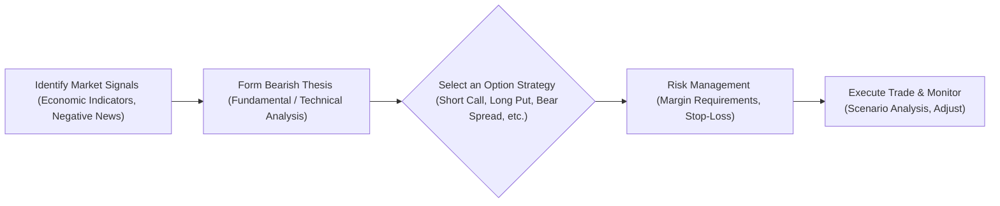

## 19.1 Understanding the Bearish Outlook

Have you ever watched a market spiral downward and felt that sinking feeling, wondering if you could somehow benefit—or at least avoid losses—from all that chaos? A “bearish outlook” is precisely that scenario where you or other investors are convinced an asset’s price is headed south. Maybe it’s the broader equity market, a particular stock you follow, or even an entire commodity sector. The bottom line is: you think the price is going down, and you want to position yourself accordingly.

Below, we’ll dig into what exactly prompts a bearish outlook, what key indicators pros usually watch to confirm their negative hunch, and how you can approach it all responsibly—especially within Canada’s CIRO regulatory framework.

––––––––––––––––––––––––––––––––––––––––––––––––

## Why “Bearish” Anyway?

First off, we sometimes hear the phrase “bear market,” which mainstream media uses whenever prices take a dive—often defined as a 20% drop from recent highs. There’s an old story that a bear swipes its paws downward when attacking, hence the negative, downward association. Etymology aside, the idea behind a bearish outlook is simple: anticipate the fall, and (if possible) earn a profit or protect existing positions as the market retraces.

––––––––––––––––––––––––––––––––––––––––––––––––

## Key Drivers of a Bearish Outlook

A lot of factors can push a trader or investor to adopt a bearish stance. Let’s look at the major drivers:

• Deteriorating Economic Indicators: Watch out for bad employment numbers, faltering GDP growth, or any red flags in inflation and manufacturing data. In Canada, negative signals about our resource sectors (like oil and gas) often spook investors, which can weigh on stocks or indexes.

• Company/Industry Headwinds: A single piece of negative corporate news—like a bad earnings report—can drag the entire sector down, especially if it hints at a broader economic downturn or a shift in consumer preferences.

• Macroeconomic Factors: Rising interest rates can choke off corporate borrowing and consumer spending. Geopolitical turmoil can disrupt supply chains and reduce consumer confidence, leading to broad-based selling.

• Technical Signals: Moving average crossovers, certain oscillator readings (like RSI in overbought territory), or big breakdowns in chart patterns (like a head-and-shoulders) can confirm a bearish technical setup.

From personal experience, I remember the 2008–2009 crisis when practically every economic indicator (job reports, housing market data) queued up to paint a bleak outlook. Everyone I knew started cutting back on spending, and that real-world “fear factor” effectively signaled a downturn. It was an eye-opener about how macro and personal finance can connect on a very real level!

––––––––––––––––––––––––––––––––––––––––––––––––

## Core Elements of Bearish Strategies

When you have that sinking feeling about a stock, an index, or the market at large, you might opt to:

• Profit From Decline: You can position yourself with derivatives that increase in value if the asset moves lower.  
• Hedge Existing Long Positions: Maybe you have a big chunk of a stock in your portfolio. You still want to keep it, but you’re worried about a short-term drop. Hedging can reduce the risk.

Examples of popular strategies to profit from declines include short-selling stock, buying put options, or deploying multi-leg options spreads with negative deltas. For instance, if you’re convinced the S&P/TSX 60 Index will drop, you might buy puts on an index ETF or even short an index future on the Montréal Exchange. All revolve around that fundamental notion: the underlying security’s price is heading down.

––––––––––––––––––––––––––––––––––––––––––––––––

## Market Indicators That Support a Bearish Thesis

You might be asking, “Well, how do I actually confirm I’m seeing a real downturn and not just a random dip?” Great question. Traders often lean on technical and fundamental analysis:

### Moving Averages
A key watch is the 50-day moving average crossing below the 200-day moving average (known as the “death cross”). While it sounds dramatic, it basically signals that short-term momentum has turned negative compared to the longer-term trend.

### Overbought Oscillators
An RSI (Relative Strength Index) above 70 (or 80, in stricter interpretations) often indicates an overbought market. If external catalysts or negative news hits when markets are overbought, it can trigger steep corrections.

### Fundamental Deterioration
On the fundamental side, negative earnings guidance, declining revenues, or an industry slump can all point to further downside. Maybe the sector is facing unstoppable technological disruption, or the entire economy is entering a higher interest rate cycle that will squeeze corporate profits.

### Macroeconomic Storm Clouds
Geopolitical tension (for instance, a trade war or a major war) can freeze global commerce. A rapid rise in commodity prices might also spark inflation, which then spooks central banks into tightening credit conditions. All of that fuels a downward forecast.

You don’t need to be an economist to catch these signals. Sometimes even reading quarterly reports or scanning mainstream financial news can give you a sense of whether corporate and consumer sentiment is souring.

––––––––––––––––––––––––––––––––––––––––––––––––

## Bearish Outlook and Risk

A quick warning: just because you see a possibility of a big decline doesn’t mean you should bet your retirement nest egg on it. Bearish strategies can carry big risks. In some cases, if you’re using margin (like in short-selling stock or writing options), you could face theoretically unlimited losses if the market rockets higher. In other words:

• “No bottom” vs. “Sky’s the limit”: When you’re shorting, the stock can rise indefinitely. That means risk can be sky-high without prudent risk management.  
• Volatility spikes: Markets can experience short-term rallies (bear market rallies) even in an overall downtrend, quickly eroding a short position’s paper gains.  
• Liquidity risk: Darkness can fall on certain small-cap or niche securities, so if you need to exit your short position quickly, you might face wide bid-ask spreads.

As a result, a thorough risk assessment and scenario analysis become super important, especially if you’re expecting the worst. Let’s talk about how to systematically do that.

––––––––––––––––––––––––––––––––––––––––––––––––

## Scenario Analysis for Bearish Trades

Scenario analysis is basically you playing “what-if.” You plug in potential underlying prices, from best case to worst case, and see how your position’s profit/loss pans out. This is especially critical when you’re dealing with derivatives or short sales, where the payoff structure might be non-linear and margin calls can come fast.

Let’s say you buy a put option on a stock currently trading at CA$100. Your put has a strike of CA$95, with an expiration in 60 days. You might check:

• What if the stock drops to CA$90 in two weeks?  
• What if it spikes to CA$110 tomorrow?  
• What if it slowly grinds lower, hitting CA$90 closer to expiry?  

You can model these scenarios using open-source tools like Python’s pandas or QuantLib libraries. They let you run quick pricing scenarios for options under different volatility assumptions. Scenario analysis also helps you keep track of time decay (theta), which can be more painful than you’d think if the move doesn’t happen quickly enough.

––––––––––––––––––––––––––––––––––––––––––––––––

## Spotlight on CIRO Requirements

Registered representatives in Canada have to abide by the Canadian Investment Regulatory Organization (CIRO) guidelines—formerly enforced by the separate IIROC and MFDA but now merged into CIRO. Here’s what this means for your bearish positioning:

• **Client Suitability:** If you’re an advisor, you have to ensure that the strategy—particularly if it’s a short or naked position—matches your client’s risk tolerance.  
• **Margin Requirements:** Short positions typically need margin, which is effectively collateral to cover potential losses. The margin requirements can change with market volatility, so keep an eye on that.  
• **Reporting:** If your short position or short option exposure is large, you might have additional reporting obligations.  
• **Documentation:** Thoroughly document the rationale for the trade, the client’s financial situation, and the risk disclosure. Bearish strategies can blow up an account if used irresponsibly, so documenting helps ensure you’re meeting professional standards.

For more info, you can head to the official CIRO website at https://www.ciro.ca/. You’ll find margin guidelines and best practices, particularly around short-selling or higher-risk derivative strategies.

––––––––––––––––––––––––––––––––––––––––––––––––

## Quick Detour: Bearish Strategies vs. Bullish Strategies

Just a quick note: in a bullish outlook, you might buy a call, sell a put, or go long on a future. The worst-case scenario is that the market tanks, and you might lose the premium or watch your futures or shares decline. In a bearish strategy, like short stock or short call, if the market soars, your losses might theoretically get out of control without a stop order or a hedge. So, ironically, you need to be even more disciplined with risk controls when you’re bearish.

––––––––––––––––––––––––––––––––––––––––––––––––

## Practical Example: Short Selling a Stock

Let’s do a simple hypothetical example. Suppose you identify a lumber company that you believe is about to report abysmal earnings due to a slowdown in housing construction. The stock trades at CA$50 right now.

• You “borrow” 100 shares from your broker (the broker charges margin and a borrow fee).  
• You sell those shares on the market at CA$50.  
• If you’re correct and the stock drops to CA$40, you buy back 100 shares at CA$40 (closing your short) and pocket a CA$10 per share profit (minus fees).  
• If you’re wrong and the stock shoots to CA$60, you’d be down CA$10 per share so far. And if it keeps going higher, your losses keep growing.

Risk management might include a stop-loss at CA$55, which attempts to limit your loss to CA$5 per share if triggered (although slippage can happen).

––––––––––––––––––––––––––––––––––––––––––––––––

## Practical Example: Buying a Put Option

Another standard approach is buying a put. Let’s say you own a huge position in a Canadian bank stock at CA$120 per share, and you’re worried about an economic downturn. You can buy a CA$115 put option expiring in two months for CA$3. If the market falls below CA$115, the put increases in value, partly offsetting the decline of your long stock holdings. Worst case? The bank rallies, and your put expires worthless, but you still keep the gains on your stock (you just lose the premium paid for the put).

––––––––––––––––––––––––––––––––––––––––––––––––

## Using Multi-Leg Bearish Spreads

Sometimes, you might want to lower the cost of a put option or fine-tune your risk. A bear put spread is a strategy:

1. Buy a put with a higher strike (more expensive).  
2. Sell a put with a lower strike (offsets some cost).  

If the stock drops, your top put gains in value, while the short put is partially offset. You have a maximum profit potential but also a lower initial cost. This structure is safer in some ways because you define your maximum risk, which might align better with your risk tolerance or margin constraints.

––––––––––––––––––––––––––––––––––––––––––––––––

## Visualizing the Bearish Process

Below is a simple Mermaid diagram showing a high-level flow of how you might approach a bearish thesis:

• Node A: You spot a negative catalyst.  
• Node B: You develop a coherent thesis that something’s about to drop.  
• Node C: You choose among shorting stock, long puts, or a spread strategy—whichever best suits your risk profile.  
• Node D: You implement risk controls, especially if you’re short an option or a stock.  
• Node E: You execute the trade, keep an eye on it, and adjust as new information or price action emerges.

––––––––––––––––––––––––––––––––––––––––––––––––

## Margin and Collateral Requirements

When engaging in bearish strategies—especially short sales or writing options—your broker will want margin. This helps protect them (and you) if the market moves against your position. CIRO sets minimum margin requirements, but your broker might impose even stricter policies. Keep in mind:

• **Volatility-Driven Adjustments:** If the underlying becomes more volatile, margin requirements may rise.  
• **Concentration Risk:** If you’re shorting heavily in a single stock, you might face higher margin demands.  
• **Cash or Securities as Collateral:** You could use cash, government bonds, or other margin-eligible securities as collateral.  

If your trade moves unfavorably, you might receive a margin call, meaning you have to deposit additional funds—or risk having your positions liquidated.

––––––––––––––––––––––––––––––––––––––––––––––––

## Common Pitfalls in Bearish Trading

1. **Jumping the Gun:** You might see a single negative headline and go all-in. Make sure you’ve done your homework—both fundamental and technical.  
2. **Ignoring Costs:** Short borrow fees on certain stocks can be huge. Also, options carry premiums that expire worthless if you misjudge timing.  
3. **Neglecting the Market’s Ability to Surprise:** Even in the darkest bear markets, “bear market rallies” can pop up. If you’re short, these rallies can burn you.  
4. **Poor Scenario Planning:** Not running enough “what-if” scenarios can lead to big surprises—like ignoring how implied volatility might collapse right after an earnings announcement.  
5. **Regulatory Missteps:** If you skip margin rules or suitable client recommendations, you’ll run afoul of CIRO guidelines. Compliance is no joke.

––––––––––––––––––––––––––––––––––––––––––––––––

## Real-World Anecdote: A Company’s Sudden Turnaround

Imagine you identified a “failing” tech company at CA$30 per share. You short it, anticipating a slide to CA$20. A week later, the company surprises the market by announcing a major partnership with a big software firm—popping the stock to CA$45. Suddenly, your short is deeply underwater, and your broker is calling you to add more margin. This scenario underscores the unpredictability of the markets and the vital importance of risk controls (like protective call options or firm stop-loss orders). It also shows you why you must keep up with the news on the companies you’re shorting—positive surprises can be just as brutal for a bear as negative surprises are for a bull.

––––––––––––––––––––––––––––––––––––––––––––––––

## A Quick Look at Tools and Resources

For deeper exploration of bearish strategies, check out:

• **CIRO:** https://www.ciro.ca/  
  - Find margin guidelines, industry advisories, and compliance manuals.  

• **Bourse de Montréal:** https://www.m-x.ca/  
  - The official Canadian derivatives exchange, offering listings on equity, index, and currency futures and options.  

• **Lawrence G. McMillan, “Options as a Strategic Investment”:**  
  - An excellent resource on advanced options strategies, including bearish plays like ratio spreads, backspreads, and more.  

• **Python-Based Libraries (QuantLib, pandas):**  
  - You can use these to model option prices under different volatility assumptions or run scenario analyses.  

If you’d like a more fundamental approach, the usual suspects (Bloomberg, Thomson Reuters, FactSet) offer reams of data to help you gauge macro trends and corporate fundamentals. But if you can’t afford those, you can often pull free data from Yahoo Finance or other open APIs—just watch for data delays or partial coverage.

––––––––––––––––––––––––––––––––––––––––––––––––

## Pulling It All Together

Being bearish isn’t just about gloom and doom; it’s a viewpoint that can help you hedge your portfolio or try to profit from a declining market. But it’s also a stance that can carry large risks, especially if you don’t manage leverage, margin, and rapid price reversals. “Confidence with caution” is a great motto here.

We encourage you to explore real market conditions, keep tracking those economic and corporate signals, and practice scenario analysis before jumping in. This is doubly important now that CIRO’s margin and suitability standards are in play. Be sure to keep client objectives and financial circumstances top of mind if you’re a registered representative.

At the end of the day, a bearish outlook can be a prudent tool if used wisely. Just remember: you don’t want to be caught on the wrong side of a short squeeze or a surprise announcement. Keep your eyes on the data, stay flexible, and plan for contingencies. If you do that, you’ll be well-prepared for whatever the market’s “bear side” throws at you.

––––––––––––––––––––––––––––––––––––––––––––––––

## Glossary

• **Bear Market:** A market condition where securities prices fall 20% or more from recent highs amid widespread pessimism.  
• **Short Position:** An investment tactic that anticipates declining asset prices; involves selling securities or options not currently owned.  
• **Margin:** Collateral required by a broker to cover potential losses on a short or leveraged position.  
• **Fundamental Analysis:** Evaluating a security by examining macroeconomic factors, industry conditions, and company-specific metrics.  
• **Technical Analysis:** Studying historical price and volume data to predict future price movements.

––––––––––––––––––––––––––––––––––––––––––––––––

## Sample Exam Questions: Bearish Options and Market Outlook



### Which of the following is the most common reason an investor adopts a bearish outlook?

- [ ] They are heavily invested in long positions.  
- [x] They expect the underlying asset's price to decline.  
- [ ] They want to hedge against inflation.  
- [ ] They expect volatility in the bond market.  

> **Explanation:** A bearish outlook arises when an investor anticipates a price drop in the underlying asset.

---

### Which scenario best illustrates a "bear market"?

- [ ] A market where stock prices rise moderately over six months.  
- [ ] A market where stock prices hover sideways with no clear trend.  
- [x] A market where equity values have fallen by more than 20% from recent highs.  
- [ ] A market where interest rates rise by a small margin.  

> **Explanation:** A classic definition of a bear market is a 20% (or greater) decline from a recent peak.

---

### In the context of CIRO’s requirements, why are margin requirements especially crucial for bearish strategies?

- [ ] They only apply to bullish strategies.  
- [ ] They eliminate the need for cash.  
- [x] Bearish strategies like short-selling or short calls can face theoretically unlimited losses.  
- [ ] They force investors to invest in low-volatility stocks only.  

> **Explanation:** Because a stock (or market) can theoretically rise indefinitely, short positions require strict margin to protect against large potential losses.

---

### Which technical indicator is often used to identify overbought conditions that can precede a bearish reversal?

- [ ] Moving Average Convergence Divergence (MACD)  
- [x] Relative Strength Index (RSI)  
- [ ] Volume Weighted Average Price (VWAP)  
- [ ] 52-week High-Low Indicator  

> **Explanation:** An RSI above 70 commonly indicates overbought conditions, which may signal an upcoming price decline.

---

### What is a primary advantage of buying a put option over short-selling the underlying stock?

- [ ] Higher potential profit if prices fall.  
- [x] Limited risk to the option premium paid.  
- [ ] No premium cost involved.  
- [ ] Dividends are still collected on the underlying.  

> **Explanation:** Buying a put caps your maximum risk at the premium, whereas shorting a stock can have unlimited downside.

---

### Which of the following factors might drive an investor to adopt a bearish outlook?

- [ ] Positive earnings surprises.  
- [ ] Dividend increases.  
- [x] Rising interest rates and deteriorating economic indicators.  
- [ ] Strong consumer confidence.  

> **Explanation:** Factors like rising interest rates and negative economic data typically encourage a bearish stance.

---

### If a trader wants to reduce the cost of a long put option, what strategy might they consider?

- [x] Bear put spread.  
- [ ] Covered call.  
- [ ] Protective put.  
- [ ] Long call diagonal.  

> **Explanation:** A bear put spread involves buying a higher strike put and selling a lower strike put, lowering the net premium.

---

### What is a potential risk of a short stock position?

- [ ] Time decay.  
- [x] Unlimited upside risk if the stock rallies.  
- [ ] Dividend reinvestment risk.  
- [ ] Zero opportunity cost.  

> **Explanation:** When shorting a stock, losses can be theoretically unlimited if the stock’s price surges upward.

---

### Why should scenario analysis be performed prior to initiating a bearish derivative position?

- [ ] To reduce brokerage commissions.  
- [x] To understand potential outcomes at various price levels and manage risk accordingly.  
- [ ] To eliminate the need for fundamental review.  
- [ ] To automatically trigger margin relief.  

> **Explanation:** Scenario analysis helps traders see how a position might fare under different price moves and plan hedges accordingly.

---

### True or False: A stock's unexpected positive announcement can cause large losses for an investor holding a short position.

- [x] True  
- [ ] False  

> **Explanation:** Positive surprises can send the stock price higher, causing potentially large losses for a short position.


