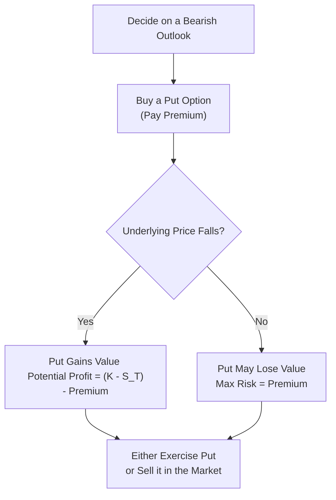
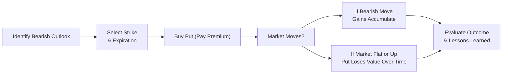

## 19.2 Strategy: Long Put

A long put is arguably one of the most straightforward ways to target a declining market using options. Maybe you’ve been there: You anticipate a stock’s price will drop, but you don’t want the open-ended risk of short selling the shares directly. Well, that’s exactly where a long put comes in handy. By purchasing a put option (rather than writing one), you get the right, but never the obligation, to sell the underlying asset at a predetermined strike price on or before the option’s expiration date.

And remember, we first introduced puts way back in Chapter 6 (Basic Features of Options). In this section, we’ll go deeper and explore the mechanics, payoff structure, risk profile, and real-world applications of buying puts. We’ll also relate it to some of the classic “Greeks,” especially Theta (time decay) and Vega (implied volatility).  

Below, we’ll break everything down step by step, weaving in some personal insights, minor anecdotes, and regulatory references to keep it practical, engaging, and relevant to the Canadian derivatives landscape.

---

### What Is a Long Put?

A long put simply means you purchase a put option on an underlying security—this security could be a stock, an index, a commodity, or even a currency. That put grants you the right to sell the underlying at the option’s strike price before expiration. If the underlying asset’s price tumbles, the value of your put option typically goes up, offering a way to profit from—or at least protect your portfolio against—a falling market.

• If the underlying’s price drops well below your strike price, the intrinsic value of your put grows significantly.  
• If the underlying’s price stays the same or goes up, your put may expire worthless, resulting in a loss of the premium you paid to buy the option.  

#### An Anecdote on Long Puts
I recall a friend—let’s call him Alex—who had some serious concerns about a tech stock he owned. Alex noticed the market was euphoric, and he suspected the company’s stock price was more hype than substance. Instead of rushing to dump all his shares, he bought put options. Sure enough, the stock ended up dropping about 20%, and those puts offset much of the decline in his portfolio—almost like a safety net that he was glad he put in place.

---

### Key Concepts and Terminology

Before diving into the mechanics, let’s do a quick glossary check (some of these terms also appear in earlier chapters but are worth revisiting in the context of a long put):

• **Put Option**: A contract granting the holder the right, but not the obligation, to sell the underlying asset at the strike price before (or on) expiration.  
• **Strike Price**: The set price at which you can exercise your right to sell the underlying asset.  
• **Premium**: The cost to purchase the option. This represents your maximum possible loss.  
• **Time Decay (Theta)**: The erosion of an option’s value as time passes, all else being equal.  
• **Implied Volatility (Vega)**: A measure of how much the market expects the underlying asset’s price to fluctuate over the life of the option.  

---

### Why Choose a Long Put?

1. **Bearish Expectations**: Perhaps the clearest reason is that you anticipate a downward move in the underlying. Say you believe a certain company’s share price is going to drop in the next few months. If you’re correct and the share price dives below your strike price, you can exercise the put (or sell it back in the market for a higher premium) for a profit.

2. **Risk Management**: A long put can act like insurance, helping hedge a long position you already own. This is somewhat similar to the “Protective Put” strategy from Chapter 18.3 (Married Put). If the market tanks, your put can offset those losses. 

3. **Limited Risk**: With a long put, your maximum risk is the premium you initially pay, plus any commissions. Unlike short selling, you won’t lose more than that outlay.

4. **Flexibility**: You can simply let the put expire if the market doesn’t move in the expected direction, and your total cost remains limited to the premium. If the market does move in your favor, you can realize profits either by exercising the option or selling it in the options market.

---

### The Payoff Profile of a Long Put

The payoff for a long put at expiration is relatively straightforward. Let’s define a few variables:

• \\( S_T \\): The underlying’s price at expiration.  
• \\( K \\): The put’s strike price.  
• \\( P \\): The premium you paid for the put.  

Your profit (or loss) at expiration (ignoring commissions) is:


\text{Profit} = \max(K - S_T, 0) - P


In words: If the underlying price \\( S_T \\) is below \\( K \\), the intrinsic value is \\( K - S_T \\). But don’t forget we subtract the premium \\( P \\) from that value. If \\( S_T \\) is above \\( K \\), the put expires worthless, and you lose the entire premium \\( P \\).

Below is a rough table summarizing key risk-reward elements:

| Strategy Parameter         | Description                                                               |
|----------------------------|---------------------------------------------------------------------------|
| **Market View**            | Bearish                                                                    |
| **Max Profit**             | Potentially significant as the underlying price falls toward zero (minus the cost of the premium). |
| **Max Loss**               | The premium paid (if the underlying settles above your strike price).     |
| **Break-Even Point**       | Strike Price \\(-\\) Premium Paid                                           |
| **Time Decay** (Theta)     | Negative (erodes the value of long puts over time if the market remains flat or rises). |
| **Implied Volatility** (Vega) | Positive (an increase in implied volatility can raise the put’s premium).   |

And here’s a simple flow diagram to visualize the key steps:

---

### Example: Calculating Potential Profit

Let’s say you buy a put option on DEF Corp. with a \\( \$50 \\) strike price for a premium of \\( \$2.00 \\). Each standard equity option generally covers 100 shares. Here’s how your potential profit or loss might look at expiration:

- **Case 1**: The stock falls to \\( \$40 \\).  
  - Intrinsic Value = \\( 50 - 40 = \$10 \\) per share.  
  - Less the premium of \\( \$2 \\), your net profit is \\( \$8 \\) per share. Since one option contract typically controls 100 shares, that’s \\( 100 \times \$8 = \$800 \\) net profit (ignoring commissions).

- **Case 2**: The stock stays around \\( \$50 \\).  
  - The put expires with no intrinsic value if the stock is at or above \\( \$50 \\).  
  - You lose your entire premium of \\( \$2 \\) per share (\\( \$200 \\) total).

- **Case 3**: The stock moves slightly downward to \\( \$48 \\).  
  - Intrinsic Value = \\( \$50 - \$48 = \$2 \\).  
  - Subtract your \\( \$2 \\) premium, so your breakeven is effectively \\( \$48 \\). That means you neither gain nor lose money (excluding transaction costs).

As you can see, if the stock collapses from \\( \$50 \\) to \\( \$30 \\) or even \\( \$20 \\), your payoff grows substantially—you keep reaping more gains as the underlying moves lower (minus the premium).

---

### Understanding Time Decay (Theta)

Time decay can be your worst enemy in a long put position if the market doesn’t move. Every day, even if the underlying price remains unchanged, your option is likely to lose a little bit of its time value. As expiration dates get closer, if the underlying asset fails to move downward enough, your put’s extrinsic (time) value melts away.

In practice, many experienced traders will choose a specific expiration date that aligns with their expected timeline for the bearish move. Too short a time frame, and the put may expire before the big drop actually occurs. Too long a time frame, and you might pay a higher premium and watch it decay while you wait. It’s a balancing act.

---

### Impact of Implied Volatility (Vega)

Implied volatility essentially tells us how much the market is forecasting the underlying’s price might swing. If implied volatility goes up after you buy the put, that put often gains value (even if the underlying’s price hasn’t moved much yet). This is because a higher implied volatility suggests a higher likelihood of large price swings, which is favorable for an option buyer.

On the flip side, if implied volatility falls—maybe because market fears subside or big unknown events have been resolved—your long put might lose value. This can happen even if the underlying price is moving down a bit, so keep that interplay in mind.  

---

### Regulatory & Margin Considerations

Unlike many other option strategies, a long put typically has relatively simple regulatory and margin requirements. In Canada, under CIRO (Canadian Investment Regulatory Organization) standards, when you buy an option, your full risk is simply the premium, so there’s no additional margin required to hold the position. You do, however, need an approved options trading account that meets suitability requirements, as discussed in Chapter 22 (Opening and Maintaining Retail Option Accounts).

• Check the [CIRO guidelines](https://www.ciro.ca/) to confirm specific rules on suitability and account approvals.  
• The [Bourse de Montréal margin calculator](https://www.m-x.ca/marc_cal_ptf_en.php) can help you see how the exchange calculates margin for single-option positions. Although for a debit strategy like buying options, the margin is often just the premium itself.  

If you’re a Canadian investor or trader, always ensure you know your firm’s rules for registering option transactions, particularly if you’re an institutional trader or dealing with large volumes. There may be additional compliance checks.

---

### Strategy Management and Exit Techniques

Many traders adopt the “set and forget” approach when buying puts, but you don’t have to do that. Here are a few ways to actively manage your position:

1. **Close the Position (Sell the Put)**: If the underlying makes the expected downward move, you can simply sell your option at a profit in the market, locking in gains. You don’t have to wait until expiration—options markets are fairly liquid, especially on actively traded stocks.

2. **Exercise the Put**: If you truly wish to sell shares of stock that you own (or plan to purchase them to sell at the strike), you can exercise your put. If you exercise, your profit is locked based on the intrinsic value at that moment. 

3. **Roll Down**: If the underlying falls significantly ahead of schedule, you might want to lock in gains by selling your current puts and buying new puts at a lower strike. This is called “rolling down.” It allows you to maintain a bearish stance while taking some cash off the table.

4. **Stop/Loss Management**: If the market is not moving downward, or if you find your forecast was incorrect, you can exit the position early to salvage some of the premium. Some folks will place stop orders if the option’s value declines to a certain threshold.  

---

### Risks and Common Pitfalls

While the maximum risk is just the premium you pay, that doesn’t mean it’s always a no-brainer. Here are some pitfalls:

1. **Misjudging Timeframe**: You might buy a short-dated put, yet the market may take longer to decline than expected. Time decay can really eat away at your premium. 
2. **Volatility Crush**: If you buy options ahead of a known event—like an earnings report—implied volatility could be quite high. After the event, volatility might drop sharply (known as a volatility crush), and your option might lose value even if the underlying price moves in your favor. 
3. **Small or No Price Movement**: The underlying might decline a little but maybe not enough to surpass your breakeven point, resulting in a loss of premium.  

---

### Practical Applications and Case Study

Let’s do a mini case study, focusing on a hypothetical scenario:

• **Company X** trades at \\( \$100 \\) per share.  
• You expect it to fall to \\( \$85 \\) or lower within the next two months due to anticipated weak earnings.  
• You buy a 2-month put with a \\( \$90 \\) strike for \\( \$3 \\) premium.  

- **Scenario A**: Earnings come out, and the stock tumbles to \\( \$80 \\). Now your put’s intrinsic value is \\( 90 - 80 = \$10 \\). You paid \\( \$3 \\), so your net profit is \\( \$7 \\) (or \\( \$700 \\) per contract). Great! Time to exit or perhaps roll down your position if you believe the stock can plunge further.  
- **Scenario B**: Earnings are surprisingly good, and the stock rallies to \\( \$105 \\). Your put might be nearly worthless, hovering around a few cents. Since you spent \\( \$3 \\) per share, you’re facing a near-total premium loss. That’s the max risk.  

---

### Regulatory & Educational Resources

• **CIRO**: For up-to-date information on suitability requirements, margin rules, and licensing, visit [https://www.ciro.ca/](https://www.ciro.ca/). Remember that CIRO replaced IIROC and the MFDA as Canada’s consolidated self-regulatory organization.  
• **Bourse de Montréal**: Their official site includes margin calculators, contract specifications, and a library of educational articles. Check their “options education” page [here](https://www.m-x.ca/options_education_en.php).  
• **“Option Volatility & Pricing” by Sheldon Natenberg**: A classic reference if you’d like deeper dives into how time decay and volatility affect your option strategies.  
• **Practice Tools**: Many online broker platforms also have paper trading modes or simulators. This allows new traders to see how a put’s value changes as the market shifts without risking actual capital.  

---

### Best Practices for a Long Put Strategy

1. **Have a Clear Price Target and Timeline**: Estimate how far and how fast you expect the underlying to fall. Pick a strike price and expiration date that suit your expectations.  
2. **Monitor Implied Volatility**: Before you buy, look at the implied volatility environment. If it’s unusually high, there’s a greater risk of a volatility drop that could cripple your put’s value.  
3. **Position Sizing**: While your risk is capped, you can still lose 100% of your investment in the premium. Make sure you’re comfortable with that potential loss.  
4. **Use Technical or Fundamental Analysis**: Many participants rely on trend lines, moving averages, or fundamental data (earnings forecasts) to validate a bearish thesis. 
5. **Review CIRO Suitability**: Always double-check if an option purchase fits your— or your client’s—risk profile, investment goals, and financial literacy level.  

---

### Additional Mermaid Diagram: Strategy Lifecycle

Here’s a simple Mermaid diagram that visually lays out the lifecycle of a Long Put trade from start to finish:

---

### Common Questions

• **How do I pick the right strike price?**  
  It depends on how big a move you expect and the amount of premium you’re willing to pay. Out-of-the-money puts are cheaper but need a larger move before crossing the break-even. At-the-money puts cost more but might gain value faster if the underlying falls.

• **Should I exercise or just sell my put?**  
  In many cases, it’s more straightforward and often more profitable from a time-value perspective to sell the option if there’s still extrinsic value. But if you plan to actually sell shares of the underlying you already hold, exercising might make sense.

• **What about short puts?**  
  That’s a different beast—the short put is a bullish or neutral strategy (you receive premium but assume the obligation to buy shares if assigned). Chapter 18.5 (Additional Bullish Strategies) touches on that.

• **Can I use a long put in a registered account like an RRSP?**  
  Rules vary, and many registered accounts have specific restrictions. Historically, certain types of option strategies (like writing uncovered calls) weren’t permitted in registered accounts. For the most part, “long options” are sometimes allowed if the broker’s policies and CIRO guidelines permit. Always confirm with your brokerage.

---

### Final Thoughts

A long put might be your simplest tool to bet on—or hedge against—a drop in an underlying’s price. The greatest advantage is the limited and clearly defined risk: you can never lose more than the premium, but the potential upside is high if the market sees significant downside movement. Of course, that doesn’t mean it’s a guaranteed money-maker: you still face the relentless march of time decay, the mysteries of implied volatility shifts, and the possibility that your forecast is just plain wrong.

Still, if you’re eyeing a big downward move—or if you’re like my friend Alex, worried about a pricey stock—buying a put can help you sleep at night knowing you have a plan to profit or protect. Continue practicing these concepts with small (or simulated) trades, expand your knowledge through official resources, and integrate the lessons from other chapters (like the Greek sensitivities from Chapter 7) to round out your perspective.

---

## Sample Exam Questions: Long Put Strategy Essentials



### Which of the following best describes the long put strategy?

- [ ] An obligation to sell an underlying asset at the strike price.
- [x] A right (but not the obligation) to sell the underlying asset at a fixed strike price.
- [ ] A bullish strategy that profits if the underlying price goes above the strike price.
- [ ] A covered strategy that requires owning the underlying asset.

> **Explanation:** A long put gives the buyer the right to sell, not the obligation. It’s purely a bearish strategy.

### What is the maximum loss associated with a long put?

- [ ] Unlimited.
- [ ] The stock price minus the strike price.
- [x] The premium paid for the put.
- [ ] The difference between the strike price and the underlying price at expiration.

> **Explanation:** You cannot lose more than the premium you initially paid for the put.

### In a long put position, how does time decay (Theta) typically affect the strategy?

- [ ] It has no effect on the strategy.
- [x] It adversely affects the holder of the put by eroding time value.
- [ ] It benefits the holder of the put as expiration approaches.
- [ ] It affects only out-of-the-money calls, not puts.

> **Explanation:** Time decay (Theta) works against you when you hold an option, because every day closer to expiration reduces the option’s extrinsic (time) value.

### Your breakeven for a long put is generally calculated as:

- [ ] Strike Price + Premium Paid.
- [ ] Strike Price + Intrinsic Value.
- [x] Strike Price - Premium Paid.
- [ ] Underlying Price - Strike Price.

> **Explanation:** For a put that you bought, the breakeven is the strike price minus the premium you paid.

### Which Greek measure indicates the long put strategy’s sensitivity to changes in implied volatility?

- [ ] Delta.
- [ ] Rho.
- [x] Vega.
- [ ] Gamma.

> **Explanation:** Vega measures how much an option’s price changes with volatility. A long put benefits when IV (implied volatility) goes up.

### If markets are expecting huge price swings in the near term, what is likely to happen to a put option’s implied volatility and, in turn, its premium?

- [x] Implied volatility tends to rise, increasing the option’s premium.
- [ ] Implied volatility tends to fall, decreasing the option’s premium.
- [ ] Implied volatility stays the same, so premium remains unchanged.
- [ ] None of the above.

> **Explanation:** Larger expected swings boost implied volatility. That usually increases option premiums, benefiting a long put.

### Which best characterizes the long put’s profit potential?

- [x] Potentially very large, as the underlying price can theoretically fall to zero.
- [ ] Limited gains capped at the strike price.
- [ ] Fixed gains determined at the opening of the position.
- [ ] Potentially limited to the equivalent call strike minus premium.

> **Explanation:** A put’s value increases as the underlying price falls toward zero, giving significant upside to the holder.

### Fresh off buying a put, you see implied volatility drop suddenly. All else being equal, how is that likely to affect your position?

- [x] The put’s value will likely decrease.
- [ ] The put’s value will not change because volatility does not affect puts.
- [ ] The put’s value will likely increase.
- [ ] The put’s value only changes if time has passed.

> **Explanation:** A drop in implied volatility reduces the extrinsic value of the option, hurting a long put.

### Which entity oversees the Canadian regulatory framework that includes options trading and margin requirements as of 2025?

- [ ] The defunct Investment Industry Regulatory Organization of Canada (IIROC).
- [ ] The defunct Mutual Fund Dealers Association (MFDA).
- [x] The Canadian Investment Regulatory Organization (CIRO).
- [ ] The Canadian Derivatives Clearing Corporation (CDCC).

> **Explanation:** IIROC and MFDA were consolidated into CIRO. CIRO is the current national self-regulatory body in Canada.

### True or False: A long put is inherently more risky than short selling the underlying stock, because you can lose more money than your initial outlay.

- [ ] True
- [x] False

> **Explanation:** When you buy a put, the most you can lose is the premium you paid. Short selling a stock, however, has theoretically unlimited risk.


