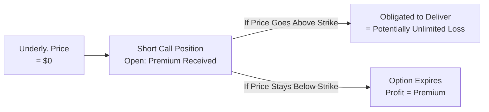

## 19.3 Strategy: Short Call (Naked Call)

Writing a short (naked) call might feel like the ultimate example of living on the edge in options trading. It’s a high-risk strategy designed to profit from a neutral-to-bearish outlook by selling (or “writing”) a call option without owning the underlying asset. Like, imagine shouting “price isn’t going anywhere!” at a stock or commodity, then hoping that you’re right—or else. In other words, selling a naked call is basically telling the market you believe the underlying cannot surpass the strike price by option expiration. Let’s walk through how it works, why people do it, and the life lessons it can teach us along the way.

### Understanding a Short Call (Naked Call)

A short call means you are writing a call option. Let’s define that:

• You receive a premium right away from the buyer.  
• If the underlying price stays below the strike price until expiration, you keep that entire premium as profit.  
• If the underlying price shoots above the strike price, you can be assigned at any time (especially in American-style options) to deliver the asset at the strike price, even if it’s trading way higher in the open market. This is when the big, scary losses can happen.

All this to say, a short call is not for the faint of heart. In the event the underlying’s price keeps soaring, the cost to buy shares back (to deliver per assignment) can go through the roof—leading to a theoretically unlimited loss.

### Why Would Anyone Write a Short (Naked) Call?

It’s a good question, right? Why jump into something like that?  

1. Premium Income: The immediate premium you collect can be relatively high, especially if implied volatility is elevated. Some traders love the allure of quick cash.  
2. Neutral to Bearish Outlook: If you think the underlying will stall or even drop, and you trust your instinct or analysis, a short call might look appealing.  
3. Time Decay Advantage: Options lose time value as expiration approaches. When you are short a call, every passing day works in your favor—provided the underlying isn’t moving in the wrong direction.

If the outlook is correct and the underlying stays below that strike, well, you might just pocket the entire premium and call it a day.

### The High-Risk Element: Theoretically Unlimited Loss

Now let’s be candid: shorting a call without owning the underlying asset has effectively no cap on how big your losses can become. Suppose you sold a call with a strike of $50, and then the stock unexpectedly heads into a sensational rally up to $80—some biotech miracle, or maybe they invented a new AI that does your laundry. Whatever the reason, you might be required to fulfill your obligation and give shares away at $50 while they’re worth $80 in the open market. You’d have to buy them at $80 (or higher if it keeps running) to honor your short call position. That difference—$30 loss per share, plus any additional rallies—could be enormous.

I remember hearing from an old colleague who shorted calls on a tech stock, confident that its price wouldn’t budge. A few surprising news releases later, she found herself with a margin call the size of a small car. Let’s just say it wasn’t the best weekend for her.

### Key Mechanics at a Glance

To see how a short call strategy flows from inception to settlement, consider this simplified diagram:

• You start by writing (selling) a call, collecting a premium.  
• If the price stays below the strike, the call expires worthless, and your profit is the premium.  
• If the price rallies, you might face assignment, forcing you to deliver the underlying asset at the strike, with unlimited theoretical downside.

### Potential Outcomes: Profit or Loss

• Maximum Profit = Premium Received  
• Maximum Loss = Theoretically unlimited

### Using an Example

Let’s do a hypothetical scenario—numbers always help.

You sell a single XYZ Company call with a strike of $60 for a premium of $2.00 (each option typically covers 100 shares). You collect $2 × 100 = $200.

• Scenario 1: By expiration, XYZ trades at $55. The strike is above the market price, so the call expires worthless. You keep $200.  
• Scenario 2: By expiration, XYZ trades at $65. You’re assigned, so you have to deliver shares at $60. If you don’t own them already, you likely have to buy them at $65 in the market, losing $5 per share minus the $2 premium. That’s $3 net loss per share, or $300 total.  
• Scenario 3: Stock skyrockets to $90. Now you’re forced to deliver them at $60, which might involve buying them at $90 if you didn’t already have shares. That’s a $30 loss per share minus the $2 premium, or $28 net. Your $2 premium pales in comparison to the huge loss.

### The Role of Margin Requirements

Because your losses can become super-sized, margin requirements for short calls can also become quite large. In Canada, CIRO (the Canadian Investment Regulatory Organization) sets baseline margin rules, and individual brokerage firms can be even more restrictive. They usually do a daily check (mark-to-market) to see if additional margin is needed. If the stock moves higher, your broker might basically say, “Pony up more funds.”  

A large margin deposit (cash or marginable securities) must be in your account to make sure you can cover catastrophic scenarios. For serious coverage, you may be asked to maintain a margin that’s typically the greater of:

• A certain percentage of the underlying’s market value, plus  
• Any in-the-money amount.  

The references below can provide more precise margin formulas, but the bottom line is: your broker wants to protect itself (and you, hopefully) from unlimited risk.

### CIRO and Canadian Regulatory Framework

Being located in Canada (or trading from here) means you’ll want to keep an eye on CIRO’s official site (https://www.ciro.ca/) to see the margin guidelines for uncovered calls. The Montréal Exchange (sometimes called the Bourse de Montréal) also publishes bulletins and margin guidelines for equity and index options. These guidelines specify:

• Minimum margin requirements for short equity calls or short index calls.  
• Ongoing capital requirements for your brokerage firm to meet.  
• Potential adjustments if your short calls are significantly in-the-money.  

Additionally, the Options Clearing Corporation (OCC) in the U.S. provides extensive free resources on margin mechanics and assignment processes (https://www.theocc.com/). Even if you’re trading in Canada, you might find the OCC’s resources valuable as many of the principles overlap, especially for cross-listed and interlisted options.

### Who Might Use Short Calls?

• **Professional or Veteran Traders**: They might have strategies that integrate short calls with net long positions or other hedges.  
• **Individuals with Very High Risk Tolerance**: Usually advanced retail folks who are absolutely sure about their forecast.  
• **Portfolio Managers**: They might have plenty of offsetting positions or underlying holdings that reduce the risk of a naked call. However, if they do indeed hold the underlying, that’s technically a “covered call,” which has a different risk profile.  

### Key Considerations Before Entering a Short Call Position

**1. Thorough Outlook**  
You want to be sure (as sure as you can be) the underlying won’t rocket upward. Fundamental or technical analysis, or even that good ol’ fashioned gut feeling, might guide you. But realize the market can do anything.

**2. Return vs. Risk**  
The best you can do is the premium when you’re right, but if you’re wrong, watch out—it can sting. So weigh the risk-return ratio carefully.

**3. Position Sizing**  
Truly professional traders only risk a small portion of their account with naked calls. It’s that old rule: Don’t bet the farm.

**4. Exit Strategy**  
Every short call writer should have a plan for closing or rolling that position if the market moves against them. This can mean buying back the short call if the underlying creeps up, or rolling into a higher strike, or maybe turning it into a spread that caps the upside risk.

### Integrating the Short Call with Other Strategies

One of the odd truths about options trading is that “naked” positions are rarely naked for the truly sophisticated. You might, for instance, use a short call in combination with a short put to form a short strangle (both are high-risk). Another more conservative approach is to quickly convert the short call into a call spread (by buying a higher-strike call) the moment you sense the market could rally.  

### Personal Anecdote: Surviving a Short Call Scare

Let me share a small (and slightly embarrassing) experience: Early on, fresh out of a derivatives training course, I sold some calls on a mid-cap tech stock that I assumed had gone stale. Then a competitor launched a takeover bid over a weekend. On Monday, the stock soared 25%. My broker gave me the dreaded margin call. I had to deposit extra funds to keep my positions afloat. Luckily, the stock only jumped once and stabilized, and I managed to close the short calls with a moderate loss. But it was an excellent, if painful, lesson: know how volatile the underlying can get!

### Risk Management Tools

• **Stop-Loss Orders**: Some traders attempt to place stop orders to buy back the option if the underlying moves above a certain level. Be careful—sometimes option liquidity can make these orders tricky.  
• **Hedging with Another Call**: Create a spread to limit your top-end exposure.  
• **Position Sizing**: Keep the short call position smaller than you think you can handle.  
• **Constant Monitoring**: Because you can be assigned at any time by an option holder, you’ll want to watch your position, especially if it moves in-the-money.  

### Regulatory Notes and Additional Resources

• **CIRO’s Margin Rules on Uncovered Options**:  
  https://www.ciro.ca/  
  (Look under regulatory publications; margin guidelines can be found in member notices and bulletins.)

• **Montréal Exchange Margin Guides**:  
  The Bourse regularly publishes bulletins on margin for both index and equity options. Check their official website for up-to-date margin rates and unique instructions on advanced strategies.

• **Options Clearing Corporation (OCC)**:  
  https://www.theocc.com/  
  Hosting free resources on how assignment works, margin methods in the U.S. context, and educational materials.

• **Canadian Securities Course (CSI)**:  
  A valuable foundation for those who want to go deeper into margin accounts, short selling, regulatory frameworks, and advanced options strategies.

### Practical Example: Rolling a Short Call

Imagine you sold an ABC $50 call for $2. Now ABC’s price rises to $53. The call you sold is now trading at $3.25, and you’re worried. You decide to “roll” your short call to avoid large losses if ABC jumps even more:

1. You buy back the original short call for $3.25 (locking in a $1.25 loss per share or $125 total, minus the initial $200 premium, leaving you at a net –$125 + $200 = +$75 so far on the trade because you initially collected $200).  
2. Simultaneously, or nearly so, you sell a new ABC call at a $55 strike, collecting, say, $2.50. Now you’ve extended your strike higher, giving you room in case ABC rises further.  

Although you’ve realized some loss on the first trade, you still have net premium credits from the combination. Rolling is a popular risk-management technique for short options to “buy time” or shift your outlook.

### Common Pitfalls

• **Ignoring Margin Calls**: This can lead to forced liquidation.  
• **Selling Too Many Calls**: Over-allocating portion of your capital to uncovered calls is asking for trouble.  
• **Market Gaps**: Sometimes the best-laid risk management can be undone by a news gap.  
• **Overconfidence**: “It’ll never happen” might be your famous last words.  

### Monitoring and Managing Naked Calls

• **Check Real-Time Quotes**: If the underlying goes near or beyond your strike, watch the option’s price carefully.  
• **Set Profit Targets**: You may choose to buy back the call early if you can lock in a decent portion of the premium.  
• **Keep an Eye on Breakeven**: For your short call, your breakeven is the strike price plus the premium received.  

### When It Works and When It Doesn’t

Short calls tend to work best in stable or slightly bearish markets with relatively high implied volatility at the time of selling. You capture premium quickly as time passes, and if the underlying just does nothing, you celebrate on expiration day. It doesn’t work well in strong bullish markets or where there’s significant risk of a surprise spike in the underlying (like a biotech stock pending FDA approval).  

### Additional Topics

For those who want to dive deeper:  

• **Short Call vs. Covered Call**: Even though they both involve selling calls, a covered call has offsetting ownership of the underlying. That changes the risk picture dramatically.  
• **Short Call vs. Bear Call Spread**: A bear call spread, at least, gives you a known maximum loss by buying a higher-strike call.  
• **Using Greeks**: Delta (sensitivity to price changes) can be extremely high if your short call is in-the-money, and gamma can cause big day-to-day swings in danger.  

### Final Thoughts

Short (naked) calls can be profitable if your outlook that the underlying price will remain below the strike is correct, but the “theoretical unlimited risk” factor cannot be understated. You need margin. You need risk management. You need nerves of steel. If you understand those aspects and can handle the capital requirements, a short call might be a strategy to generate income in a flat or declining market. If not, well, it might be safer to practice in a simulated environment first or use a more conservative strategy.

Almost all experienced traders will tell you that writing uncovered calls is a beast—so treat it with caution, respect, and a constant reevaluation of your outlook. Good luck, and always keep your exit plan in sight.

## Sample Exam Questions: Mastering the Short Call (Naked Call) Strategy



### Which statement best describes a short (naked) call option strategy?

- [x] The seller writes a call option without owning the underlying asset.
- [ ] The seller buys the underlying asset and sells a call option against it.
- [ ] The seller sells both a call option and a put option simultaneously.
- [ ] The seller buys a call option with the intention to close out later.

> **Explanation:** A short (naked) call is where the option writer does not own the underlying, resulting in a potentially unlimited loss if the underlying price rises.

### With a short (naked) call strategy, what is the maximum profit potential?

- [x] The total premium received from selling the call.
- [ ] There is no limit to the profit potential.
- [ ] It is equal to the difference between the strike price and the premium.
- [ ] It is equal to the spot price of the underlying asset at expiry.

> **Explanation:** A short call strategy can only keep the premium received if it expires out of the money. There is no additional potential gain beyond that premium.

### What would be the theoretical maximum loss for a short (naked) call?

- [ ] The difference between the strike price and the spot price.
- [ ] The premium paid to buy back the call early.
- [ ] The spread between two different strike prices.
- [x] It is theoretically unlimited, determined by how high the underlying might rise.

> **Explanation:** Since the underlying’s price can theoretically rise without limit, the short call strategy exhibits unlimited potential loss.

### If the underlying’s price remains below the strike price until expiration, what typically happens to the short call position?

- [ ] The writer is forced to exercise the call option.
- [x] The call expires worthless, and the writer keeps the premium.
- [ ] It automatically becomes a put option.
- [ ] The position is automatically assigned.

> **Explanation:** If the call is out of the money (i.e., underlying remains below the strike), it generally expires worthless, and the option writer retains the initial premium.

### Which best describes the margin requirement for a short (naked) call?

- [x] High margin requirements because of potentially unlimited losses.
- [ ] Low margin requirements because the strategy has limited risk.
- [x] A combination of a set percentage of the underlying price plus any in-the-money amount.
- [ ] Zero margin if you have a strong credit rating.

> **Explanation:** Short calls carry unlimited risk, so regulators like CIRO and brokerage firms typically require a significant margin deposit, often calculated as a percentage of the underlying price plus any in-the-money amount.

### Why might a trader consider “rolling” a short call position?

- [ ] To immediately exercise the existing call option.
- [x] To move the strike price higher or to a later expiration, reducing current risk.
- [ ] To convert the position into shares of the underlying asset.
- [ ] To benefit from an immediate assignment by the buyer.

> **Explanation:** Rolling involves buying back the existing short call and simultaneously selling another call to change the strike or expiration, aiming to mitigate risk or collect additional premium.

### Under a short (naked) call strategy, assignment can occur at any time if:

- [x] The option is an American-style call and goes in-the-money.
- [ ] The trader’s margin exceeds the regulator’s guidelines.
- [ ] The option is European-style and well out-of-the-money.
- [ ] The investor chooses to close their short position intentionally.

> **Explanation:** American-style calls can be exercised by the holder at any time once they’re in-the-money, which may force the short call writer to deliver the underlying.

### When does a short call strategy perform best?

- [ ] When the underlying’s price is expected to increase sharply.
- [x] When the underlying is expected to remain flat or slightly decline.
- [ ] When implied volatility is at historic lows.
- [ ] When interest rates are extremely high.

> **Explanation:** A short call works best if the underlying price stays below the strike and the premium you collected erodes with time. Rapid price increases in the underlying can create large losses.

### Which of the following actions might an investor take to reduce the unlimited risk of a short (naked) call?

- [ ] Sell more calls to collect more premium.
- [ ] Wait until expiration, hoping for the best.
- [ ] Convert the call to a put.
- [x] Buy another call at a higher strike to create a spread.

> **Explanation:** By purchasing a call at a higher strike, the seller caps their upside loss exposure, turning the naked call into a bear call spread with predefined maximum risk.

### True or False: Under CIRO rules, short (naked) calls typically have minimal margin requirements because the risk is well-defined.

- [ ] True
- [x] False

> **Explanation:** Because short (naked) calls can carry unlimited risk, CIRO margin requirements are anything but minimal. Investors must generally post a significant margin deposit to offset the potential for enormous losses.


