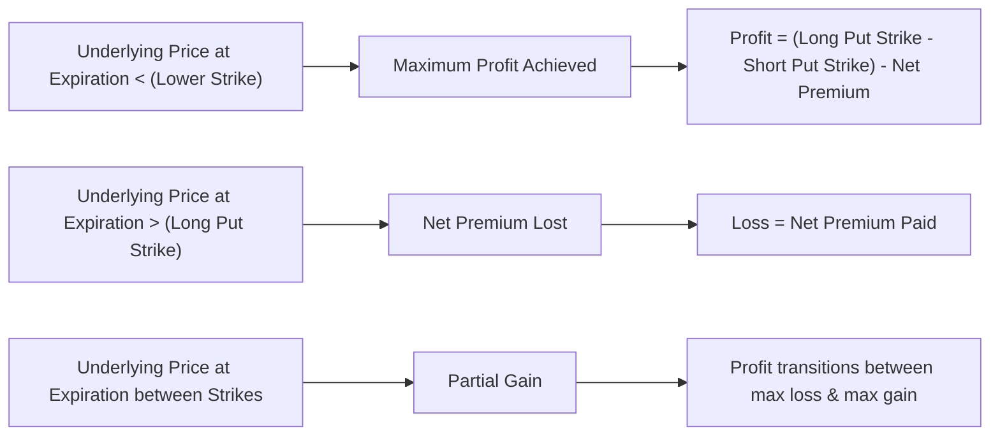

## 19.4 Strategy: Bear Put Spread

Have you ever been kinda convinced a stock was going to slide downhill in the next few weeks, but you still wanted something a little more cost-effective than a single put purchase? Let me tell you, the Bear Put Spread might be that strategy that checks off those boxes. I still remember my early days of trading when I’d get super excited about a big move down, only to realize a single put could be expensive and might eat into my capital. That’s exactly what led me to discover vertical spreads—like the Bear Put Spread.

Below, we’ll take a deep dive into how a Bear Put Spread works, why it can help reduce costs, and the rules of the game you need to be aware of (including from our friends at CIRO).

### Understanding the Bear Put Spread

A Bear Put Spread is a debit spread that helps you take advantage of a bearish outlook on a stock (or index) while keeping your initial outlay more affordable than purchasing a single long put alone. Essentially, you:

• Buy (go long) one put option at a certain strike price.  
• Write (sell) another put option at a lower strike price.  

Both options typically share the same expiration date. Because a Bear Put Spread involves buying one put and simultaneously collecting premium by selling another put, you have a net outflow of cash—yes, that’s why it’s called a “debit spread”—but it’s less than just buying the higher-strike put in isolation.

In other words, the short put helps offset part of the cost of the long put. And that’s handy if you’re working on a tighter budget or want to keep your cash commitments under control. The trade-off here is that your maximum profit is capped: if the underlying’s price falls too far (below the short put’s strike), you won’t make any additional profit.

### Why Choose a Bear Put Spread?

Let’s say you’re moderately bearish on a stock named ABC Inc. (just as an example). You think it’ll decline over the next two months because of, say, some negative earnings outlook or macroeconomic headwinds. But you aren’t entirely sure the stock’s going to plummet. A single long put might be pricey, and if the stock doesn’t fall much, you could lose a lot of that premium rather quickly.

A Bear Put Spread can help with these concerns:

1. You reduce net premium cost by selling a put at a lower strike.  
2. You still keep a directional downside view in place.  
3. You reduce your maximum loss because you’ve offset some cost.  
4. You’re capping your upside, but if you anticipate only a moderate drop, you might not mind.  

### Mechanics of a Bear Put Spread

In practical terms, you might see a Bear Put Spread described with the following strikes:

• “Long Put” = The put you buy, which has a higher strike price.  
• “Short Put” = The put you write, which has a lower strike price.  

If the underlying asset closes at or below the lower strike at expiration, guess what? You reach the maximum profit potential of the spread (which is the difference between the two strikes minus the net premium you paid). If the underlying closes above the higher strike, you lose the net premium you initially paid (the maximum loss).

#### Payoff Diagram

One of the best ways to visualize how a Bear Put Spread works is with a payoff diagram. Here’s a simple Mermaid.js flow that illustrates what happens at expiration—showing gains and losses for various underlying prices.

• If the final price is below the short put’s strike, you hit that max profit.  
• If it’s above the long put’s strike, you suffer your maximum loss.  
• If expiration lands somewhere in between, you’ll land somewhere in the partial profit range.

### Calculating Maximum Profit and Maximum Loss

• **Maximum Profit** = (Long Put Strike − Short Put Strike) − Net Premium Paid.  
  - Real-life example: Suppose you buy a put at a strike of CAD 50 for CAD 2.50 and sell a put at a strike of CAD 45 for CAD 1.00. Your net premium is CAD 1.50 (2.50 – 1.00). The difference between strikes is CAD 5. So the max profit is CAD 5 – CAD 1.50 = CAD 3.50 per share (or CAD 350 per contract, given 100 shares per contract).  

• **Maximum Loss** = Net Premium Paid.  
  - If the underlying remains above CAD 50 at expiration, both puts expire worthless, and you lose the net premium you paid—CAD 1.50 (or CAD 150 total per contract in this example).  

• **Breakeven Point** = Long Put Strike – Net Premium Paid.  
  - In the example: 50 – 1.50 = 48.50. So if the stock is at CAD 48.50 at expiration, you neither gain nor lose on the spread (ignoring commissions).

### Debit Spread and Vertical Spread

These terms are part of the fundamental lingo you’ll see in option trading:

• **Debit Spread**: A multi-leg option strategy that results in you paying money to initiate the position—like you do with a Bear Put Spread.  
• **Vertical Spread**: A strategy involving options with the same expiration date but different strike prices. A Bear Put Spread is indeed a vertical spread because you’re working with two put options expiring at the same time, but at distinct strikes.

### Real-World Example: TSX-Listed Stock

Imagine you’ve done some research on a TSX-listed mining company. Let’s call it MapleCore Mining (MCM). Suppose MCM is currently trading at CAD 75. With all the chatter about weakening commodity prices, you suspect MCM could drop to around CAD 70 by next month—maybe it continues to slip, but you’re not expecting it to be catastrophic.

You decide to initiate a Bear Put Spread by buying a put with a CAD 75 strike for CAD 4.00 and simultaneously writing a put with a CAD 70 strike for CAD 2.00. Net premium out of your pocket: CAD 2.00 (CAD 4.00 – CAD 2.00).

- Maximum Profit = (75 – 70) – 2.00 = CAD 3.00 (CAD 300 total for one contract).  
- Maximum Loss = CAD 2.00 net premium paid (CAD 200 total for one contract).  

If MCM sinks to CAD 65 by expiration, you hit your max profit. If MCM stays above CAD 75, you lose CAD 2.00. If it ends up in between, your profit is partial.

### Margin and Collateral Requirements

Even though you’re on the hook with a short put, many brokers or clearing members will recognize this as a “spread,” meaning the short leg is offset by the long leg. This typically reduces your required margin. However, the exact margin or collateral you need can vary. Under CIRO guidelines in Canada, multi-leg strategies and offsets often receive margin relief, based on how each leg reduces the overall risk. For the latest specifics, check:

• CIRO guidelines on multi-leg strategies and offsets:  
  https://www.ciro.ca/  

For some traders, it’s comforting to see that while part of your capital is tied up, the risk profile is more defined, so margin requirements are often lower than for a naked short put.

### Regulatory Considerations (CIRO)

Since January 1, 2023, the Mutual Fund Dealers Association of Canada (MFDA) and the Investment Industry Regulatory Organization of Canada (IIROC) have been amalgamated into the Canadian Investment Regulatory Organization (CIRO). CIRO is now the national self-regulatory body for investment dealers, mutual fund dealers, and marketplace integrity in Canada. While references to “IIROC” and “MFDA” are historical, remember that CIRO’s requirements on margin guidelines and best practices for multi-leg strategies—like Bear Put Spreads—are in force today.

Many new rules and clarifications revolve around ensuring fair dealings, especially relating to complex option strategies. Bear Put Spreads are not extremely complex, but any multi-leg strategy may require you to confirm your net margin requirements, the capital you need in your trading account, and your ability to manage risk properly.

### Common Pitfalls and Best Practices

• **Pitfall #1**: Trying a Bear Put Spread too close to expiration and paying higher time decay on your long put. If the stock’s volatility collapses or time value drains quickly, you might not see enough downward movement in time.  
• **Pitfall #2**: Overpaying for the spread. Always compare premiums across different strikes to see if the risk-reward ratio truly makes sense.  
• **Pitfall #3**: Not considering implied volatility. If implied volatility is super high, your option premiums might be inflated. With a Bear Put Spread, high implied volatility can be a double-edged sword—you pay more for the long put but also collect more on the short put.  

**Best Practices**:

• Use an options profit calculator to visualize your potential gains and losses. Tools like https://www.optionsprofitcalculator.com/ allow you to plug in the strikes, premiums, and days to expiration.  
• Keep an eye on liquidity. You want to make sure the underlying stock (and its options) has a reasonable amount of daily volume and tight bid-ask spreads.  
• Read up on official guidelines. CIRO’s website (https://www.ciro.ca/) keeps up-to-date policy notes, bulletins, and margin schedules.

### Adjusting a Bear Put Spread if Outlook Changes

If the market or your outlook suddenly shifts and the stock begins going up, you could consider “closing” the spread early or rolling down your strike prices (though that might lock in some loss). Conversely, if you get even more bearish, you could open an additional new Bear Put Spread at lower strikes, but watch out for the additional premium outlay and any new margin requirements. Adjustments usually cost transaction fees, so weigh that carefully.

### Glossary Recap

• **Debit Spread**: Strategy where net cash flows out at initiation (e.g., Bear Put Spread).  
• **Vertical Spread**: A strategy involving two options (call or put) with the same expiration but different strikes.  
• **Maximum Profit**: Difference between strikes minus net premium paid for that spread.  
• **Maximum Loss**: Net premium paid at initiation. Occurs if the underlying finishes above the long put strike at expiration.  
• **Collateral Requirements**: The margin needed for the short put. With a spread, one put leg offsets the other, reducing collateral.

### Additional Resources

• CIRO: https://www.ciro.ca/  
• Montréal Exchange Educational Guides on Spread Strategies: https://www.m-x.ca/options_strategies_en.php  
• Online Options Calculators: https://www.optionsprofitcalculator.com/  
• Book: “Futures and Options Markets” by Collin M. Tiffany for deeper insights into spread trading mechanics  

### Conclusion

The Bear Put Spread can be a great way to take a moderate short stance on a stock while keeping your costs a bit more contained. Sure, you’ll have to give up some potential profit in exchange, but many traders find that acceptable if confidence in a large downward swing is limited. Whether you’re brand new to spreads or just looking to refine your strategy, keep an eye on your maximum profit, maximum loss, and margin requirements. And, of course, pay attention to the evolving regulatory environment under CIRO in Canada to ensure you’re compliant with margin and disclosure rules.

If you’re curious, definitely use an online calculator to input a few scenarios. That’s often the easiest way to see how your P/L might unfold across various price outcomes at expiration. Bear Put Spreads can be a friend if you’re looking for risk-defined, cost-effective ways to ride that wave down—just be sure you understand the trade-offs before you dive in.

---

## Sample Exam Questions: Bear Put Spread Strategies



### A trader believes a stock will decline moderately over the next month. Which strategy can help reduce upfront cost compared to buying a single put?

- [ ] Short call
- [ ] Long call
- [x] Bear put spread
- [ ] Iron condor

> **Explanation:** A Bear Put Spread involves going long one put and writing another put at a lower strike, reducing the total net premium versus buying just one put.

### What is the maximum profit in a Bear Put Spread?

- [ ] Unlimited
- [ ] The net credit received
- [ ] The short put's strike price
- [x] The difference between strike prices minus the net premium paid

> **Explanation:** You buy a put at a higher strike and sell a put at a lower strike, so the maximum profit is limited to the spread between these two strikes minus the net cost.

### Which term best describes a Bear Put Spread where the net effect is money flowing out at initiation?

- [ ] Credit Spread
- [ ] Iron Butterfly
- [x] Debit Spread
- [ ] Naked Spread

> **Explanation:** Because you pay more for the higher strike put than you receive for the lower strike put, it is a debit spread.

### If the underlying's price finishes well above the long put strike at expiration, what happens?

- [ ] The short put is exercised
- [x] Both puts expire worthless
- [ ] The trader keeps the net premium
- [ ] The trader experiences unlimited loss

> **Explanation:** In a Bear Put Spread, if the stock stays above the higher strike, both puts expire worthless, and the trader's loss equals the net premium paid.

### True or False: In a Bear Put Spread, if the underlying price drops below the short put strike at expiration, the trader earns a profit equal to the difference between the strikes plus net premium.

- [ ] True
- [x] False

> **Explanation:** The maximum profit is the difference between the strikes minus the net premium (not plus the net premium).

### Which of the following is the net price the trader pays when initiating a Bear Put Spread?

- [x] Cost of the long put minus the premium received from the short put
- [ ] The entire cost of the short put plus the long put
- [ ] Only the cost of the long put
- [ ] Only the written (short) put premium

> **Explanation:** The net premium is calculated by subtracting the premium received from the short put from the premium paid for the long put.

### A Bear Put Spread will have the greatest profit when the underlying asset price:

- [ ] Remains exactly at the long put strike
- [ ] Exceeds the short put strike
- [x] Moves well below the short put strike
- [ ] Moves slightly above the long put strike

> **Explanation:** The maximum possible profit happens when the underlying finishes at or below the short put strike.

### One advantage of a Bear Put Spread over buying a single put is:

- [x] Lower net cost due to the premium received on the short put
- [ ] Potential for unlimited profit if the market collapses
- [ ] No risk of loss if the stock price increases
- [ ] Eliminating margin requirements

> **Explanation:** The short put offsets part of the long put’s cost, lowering the net cost. Though it also caps profits, it can be more affordable than buying a single put outright.

### Which reference provides Canadian regulatory guidelines for multi-leg option strategies like the Bear Put Spread?

- [ ] The Options Clearing Corporation (OCC)
- [ ] The defunct IIROC website
- [x] The Canadian Investment Regulatory Organization (CIRO)
- [ ] The SEC

> **Explanation:** CIRO is Canada’s current self-regulatory body overseeing investment dealers, including guidelines for multi-leg strategies.

### For a Bear Put Spread, which of the following is most accurate regarding margin?

- [x] Margin requirements are often lower compared to a naked short put due to the offsetting long put
- [ ] Margin requirements are identical to selling a put naked
- [ ] Margin is always zero
- [ ] No margin is required if implied volatility is high

> **Explanation:** Brokers and clearing institutions typically reduce margin requirements on spreads. The long put offsets risk on the short put, decreasing the margin needed.


