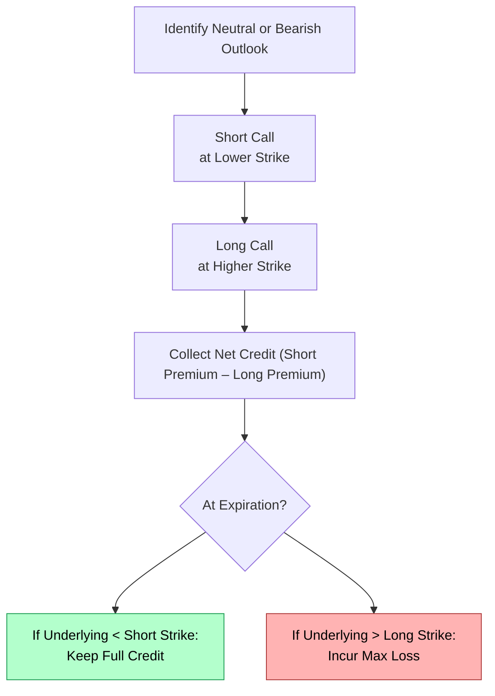

## 19.5 Strategy: Bear Call Spread

Sometimes you think that a stock—let’s call it MapleLeaf Tech—just isn’t going to soar much higher. Maybe you believe its growth is slowing or that the entire technology sector is facing headwinds. You’re leaning neutral-to-bearish on the stock’s short-term direction, but you don’t want the unlimited risk of a naked call. Sound familiar? One strategy that might come knocking is the bear call spread, which many folks also call a credit call spread.

This strategy is all about collecting a net credit up front, so you receive money on Day 1, as long as you’re willing to accept the risk that MapleLeaf Tech might surge upward and cut into your potential profits or cause a loss. Let’s unpack it step by step, so you can see how a bear call spread can fit into your toolkit. 

Understanding the Bear Call Spread  
A bear call spread is constructed by selling one call option (short call) with a lower strike price—usually near or at the money—while simultaneously buying another call option (long call) with a higher strike price. Both calls are typically for the same underlying asset and have the same expiration date.  
• You receive a net credit if the premium collected from the short call is greater than the premium paid for the long call.  
• The combined position is designed to profit if the underlying asset price stays below—or just around—the strike of your short call at expiration.  

By the way, some folks love the fancy term “credit call spread,” but it’s the same thing. Since you collect a credit on Day 1, you generally want the underlying to hover below your short call’s strike until expiration, letting you (hopefully) pocket the premium.

Key Components

Credit Spread  
A credit spread is any options strategy in which you collect a net premium (cash inflow) at onset. Here, you collect more premium from the short call than you pay for the long call. That difference ends up in your account as soon as your trade is executed—though remember, it’s not realized gains just yet.  

Spread Width  
Spread width refers to the distance between the strike prices of the short call and the long call. For example, if you short a call at a CAD 50 strike and go long another at a CAD 52 strike (both with the same expiration), then the spread width is CAD 2. This spread width places a cap on both your potential profit and your potential loss, as we’ll see in a moment.

Breakeven Point  
The breakeven point (B/E) is the short call’s strike plus the net credit you received. So, let’s say you sold a call at CAD 50, bought another at CAD 55, and netted a CAD 1 credit. You’d find your breakeven at CAD 51. As long as MapleLeaf Tech stays below CAD 51 at expiration, you’re in profitable territory (not considering transaction costs).

Risk-Reward Ratio  
The maximum profit is the net credit you collect. The maximum loss is the difference between the strikes, minus that credit. So even if MapleLeaf Tech decides to rocket higher, your loss is capped, and that’s a big safety net compared to a simple short call. One reason folks consider bear call spreads is precisely because it’s a “defined-risk trade” (the risk being limited by the long call’s strike).

Time Decay Benefit  
Because you’re net short premium, this strategy benefits from time decay (“theta” in options speak). Each day that passes with MapleLeaf Tech below your short strike, a bit more of that premium decays in your favor. Eventually, if the position expires worthless, you keep the entire net credit.

Profit and Loss Potential

If you think in pictures, it might help to visualize a payoff diagram for a bear call spread at expiration. The payoff is fairly straightforward:  
• If the underlying remains below your short call strike, both options expire worthless, and you keep the net credit.  
• If the underlying rises above the higher strike by expiration, you face the maximum loss, which is (higher strike – lower strike) – net credit.  

Below is a simple flowchart (rather than a line chart) to illustrate the trade steps involved in a bear call spread from opening to potential outcomes:

In this diagram:  
• “Short Call at Lower Strike” is your primary income driver.  
• “Long Call at Higher Strike” is your safety valve, capping potential losses.  
• Your net credit is locked in upon trade confirmation.  

Margin Considerations Under CIRO  
Because you’re short one option and long another, CIRO (Canadian Investment Regulatory Organization) margin rules often allow an “offset” that reduces margin requirements compared to a naked short call. The idea is that the long call can be used to cover or cap the risk of the short call (meaning the firm doesn’t need as high a margin buffer from you).  

Specifically, under current CIRO guidelines, the margin for a spread is generally limited to the maximum theoretical loss of the position rather than the open-ended margin required for a purely naked call. This can be especially appealing for retail investors who want to manage risk more predictably.  

Example in a Canadian Market Context

Let’s imagine you’re trading MapleLeaf Tech (ticker: MLT) at CAD 48 per share, and you expect it to remain sideways or drop slightly over the next month. Here’s a sample bear call spread:

• Sell 1 MLT Call, 1-month to expiration, strike CAD 50, for a premium of CAD 2.00.  
• Buy 1 MLT Call, same expiration, strike CAD 55, for a premium of CAD 0.50.  

Net credit = CAD (2.00 – 0.50) = CAD 1.50 (or CAD 150 total for most standard equity option contracts if 1 contract = 100 shares).  

Spread width = (55 – 50) = CAD 5.00 (or CAD 500 in “notional” for 1 contract).  

Maximum profit = net credit = CAD 1.50 per share, or CAD 150 total, if MLT finishes below CAD 50 at expiration.  

Maximum loss = spread width – credit = (5.00 – 1.50) = CAD 3.50 per share, or CAD 350 total, if MLT finishes above CAD 55 at expiration.  

Breakeven = short call strike + credit = 50 + 1.50 = CAD 51.50.  

So in this scenario, as long as MLT stays below CAD 51.50, you’ll walk away with some level of profit. Above that, you start giving back the premium you collected, and if it blasts beyond CAD 55, your loss is capped at CAD 3.50/share. 

Why Use a Bear Call Spread Instead of a Naked Call?

• Reduced Risk: If the underlying leaps upward unexpectedly, your long call helps offset those big losses that otherwise come with a naked call.  
• Lower Margin Requirement: Thanks to the protective long call, most brokers—and certainly CIRO rules for licensed dealers—recognize this as a defined-risk spread and charge less margin.  
• Predictable Profit-Loss Profile: You know exactly what you could gain or lose the moment you pull the trigger on the trade.  

It’s a bit like paying a small insurance premium for your peace of mind. That’s why so many traders prefer a bear call spread to a simple short call when they think a stock is topping out.

Time Decay Support and the Myth of “Free Money”

Because you’re net short premium, the time decay of both your short call and long call is often in your favor—particularly the short call. If the stock remains neutral or moves down, the short call’s time value declines quickly, while the long call you purchased was cheaper to begin with. You’ll often hear people say, “You get free money every day that passes and the stock doesn’t move.” Well, that’s not entirely incorrect, but remember, no strategy is free of risk. If MapleLeaf Tech experiences a sudden price spike, the “free money” concept goes out the window as your potential losses come into focus.

Common Pitfalls

• Choosing Strikes Too Close: If you choose strikes that are too close to the money or too narrow in spread width, your maximum profit is pretty small, and your breakeven might not give you enough room for the stock’s normal fluctuations.  
• Lack of Exit Plan: Don’t just set it and forget it. Have an exit plan if the stock moves against you. Sometimes it’s worth closing early and accepting a partial gain or a smaller loss.  
• Underestimating Volatility: If the stock is prone to big swings, a seemingly safe short strike can be threatened in a heartbeat.  

Case Studies and Personal Anecdotes

I still remember my first foray into bear call spreads back in my early days. I had been burned by a short call on an energy stock that soared on an unexpected jump in oil prices—ouch, that was an expensive lesson. Once I discovered spreads, I felt way more comfortable. When I traded my next neutral-to-bearish position, I sold a call while buying a higher strike call to cap the risk. Sure, that time I walked away with only 70% of what I’d have pocketed from a naked call, but I slept peacefully. And the trade ended up profitable, purely because the stock stayed below my short strike. That small “insurance premium” made all the difference in my stress level.  

It’s these kinds of real experiences that often encourage traders to switch to credit spreads. You don’t get the same adrenaline rush as you might from a high-risk naked option, but you also don’t get the same nightmares if the market runs against you.

Regulatory Requirements and Resources

• CIRO Margin Offsets: Under CIRO guidelines, licensed investment dealers may allow margin offsets due to the long call “covering” your short call’s potential upside risk. This can significantly lower the capital you need to set aside. Keep in mind each firm sets its own internal policies in compliance with CIRO.  
• Montréal Exchange – Options Strategies Modules: A fantastic free resource (https://www.m-x.ca/options_strategies_en.php) offering educational content, strategy examples, and practice modules.  
• TradingView or Charting Tools: Platforms like TradingView (https://www.tradingview.com/) can help you study price trends and find likely resistance levels to inform your choice of short strikes.  
• “Option Strategy Risk / Return” by R. McNabb: For a deeper exploration of advanced spreads and risk management. This text goes into detail on Greek sensitivities and multi-leg positions.  

Implementation Tips

• Selecting Expiration Date: If you believe the stock will stay below your short strike for a short time, you might pick an expiration that’s just a few weeks out. The beauty there is that time decay works quickly.  
• Monitoring Volatility: Implied volatility (IV) heavily affects option premiums. Ideally, you prefer to sell calls in higher volatility environments and buy calls in a less inflated volatility environment—but since you’re doing them simultaneously, it’s about the net premium.  
• Rolling the Spread: If the position is moving against you, you can sometimes roll up or out by buying back the short call and selling another short call at a higher strike or a later expiration. This approach can help manage or mitigate losses.  

Practical Example: Rolling a Bear Call Spread

Let’s say in our MapleLeaf Tech example, the stock hovers near CAD 50 but then creeps up to CAD 51. We sense trouble before expiration. We might decide to buy back the short call at the CAD 50 strike and simultaneously sell a new short call at the CAD 52.5 strike (while still holding our original long call at CAD 55). This might cost us some debit, but we push our short strike further away and reduce the chance of finishing in-the-money.

Potential Adjustments Over Time

• Buying to Close Early: If your short call has lost most of its value well before expiration (say the underlying is well below your short strike), you might close both legs early to lock in your gains.  
• Exiting the Long Call Early: Some advanced traders will close the long call if it’s out-of-the-money and worthless, saving on any remaining time value or rebalancing capital usage. However, be careful: removing the protective leg can expose you to the unlimited risk of a naked call unless you exit both legs.  

Comparison to Other Bearish Strategies

• Bear Put Spread: Another popular spread strategy for bearish investors. Unlike the bear call spread (which yields a credit), the bear put spread is a debit strategy. You pay a net premium: you buy a put at a higher strike and sell a put at a lower strike. The payoff is slightly different, but they share a similar directional bias.  
• Covered Put / Short Stock + Long Call: Actually more complex, but some advanced traders compare the risk-return to a bear call spread. Usually, a covered put requires shorting the underlying, which might not be feasible or available in all accounts.  

Monitoring, Closing, and Risk Management

As you can guess, the hallmark of a well-managed spread position is consistent monitoring. Option prices can shift quickly, especially around earnings releases or sudden news events—like MapleLeaf Tech announcing a surprising new product.  

• Set Alerts: Use your broker’s platform to alert you if the underlying crosses your short strike.  
• Mind the Time: As expiration nears, option Greeks shift quickly, and your short call can move from out-of-the-money to in-the-money in a blink.  

The main advantage is that you already have a built-in hedge (the long call), so you won’t be clobbered by a massive upside move. That said, your maximum potential loss is still real, and it hurts when it happens—just not quite as badly as a naked call.  

Conclusion

A bear call spread can be an excellent way to express a mildly bearish or neutral outlook. By collecting a net credit up front, you position yourself to profit if the market trades sideways or declines, while still capping your risk in case it rallies. With proper selection of strikes, mindful monitoring of volatility, and an understanding of the regulatory environment—including how CIRO margin offsets can help your bottom line—a bear call spread has plenty to offer for risk-conscious traders.  

That said, no strategy is a “silver bullet.” Always weigh the reward potential against the maximum loss, consider transaction costs, and keep an eye on implied volatility. And remember, if you’re worried about a company blowing the lid off with some positive surprise, a bear call spread at least ensures you’re not in for unlimited risk.  

Trade safe, stay curious, and be sure to test new strategies—like the bear call spread—in a practice environment or with smaller position sizes before jumping in. My personal anecdote is proof that once you discover credit spreads, you might never want to trade a naked call again. Good luck out there!

## Sample Exam Questions: Bear Call Spread Strategy and Key Concepts



### Which best describes the formation of a bear call spread?

- [x] Selling a call at a lower strike and buying a call at a higher strike for a net credit
- [ ] Buying a call at a lower strike and selling a call at a higher strike for a net debit
- [ ] Buying two out-of-the-money calls
- [ ] Selling a naked call, then buying back the same call

> **Explanation:** A bear call spread is a credit spread created by shorting a call near or at-the-money and simultaneously buying a call at a higher strike.

### Which of the following outcomes yields the maximum profit for a bear call spread?

- [x] The underlying remains below the short call strike price at expiration
- [ ] The underlying rallies through the higher strike
- [ ] The underlying price is significantly above both strikes at expiration
- [ ] The long call finishes in-the-money

> **Explanation:** When the underlying finishes below the short call strike, both calls expire worthless, and you keep the entire net credit.

### What is the maximum possible loss on a bear call spread?

- [ ] Unlimited, if the stock rallies sharply
- [ ] No loss is possible because it’s a credit strategy
- [x] The difference between the two strikes minus the net credit
- [ ] The net credit received

> **Explanation:** The maximum loss is capped by the spread width minus the net credit collected. That’s why the presence of a long call mitigates the risk of unlimited upside moves.

### What is the primary reason traders may choose a bear call spread over a naked call?

- [ ] To avoid paying any commissions on trades
- [ ] To eliminate all risks associated with short positions
- [x] To cap potential losses if the underlying price rises
- [ ] To secure a guaranteed profit, regardless of price movement

> **Explanation:** The key benefit over a naked call is that the long call cap prevents unlimited losses.

### When calculating the breakeven point for a bear call spread, which expression is used?

- [x] Short call strike + net credit
- [ ] Short call strike – net credit
- [ ] Long call strike – net credit
- [ ] Long call strike + net credit

> **Explanation:** Breakeven is found by adding the net credit to the short call strike price.

### Which one of the following does NOT represent a best practice in managing a bear call spread?

- [ ] Monitoring underlying price action regularly
- [ ] Closing out the trade when premium erosion has already occurred
- [x] Removing the long call to reduce commissions once the trade becomes profitable
- [ ] Checking implied volatility and time decay daily or weekly

> **Explanation:** Removing the long call turns the strategy into a naked short call, which can expose you to unlimited risk. That’s generally not advisable unless you’re prepared for that level of risk.

### In Canadian markets, which regulatory body oversees margin requirements for bear call spreads?

- [ ] NASDAQ
- [x] CIRO (Canadian Investment Regulatory Organization)
- [ ] MFDA (still existing for all derivatives oversight)
- [ ] No regulatory body; margin is unregulated

> **Explanation:** CIRO is Canada’s national self-regulatory organization for investment dealers and monitors margin guidelines. MFDA no longer exists as of 2023.

### If an investor implements a bear call spread with a CAD 1.00 net credit, a short call at CAD 60, and a long call at CAD 65, what is the maximum potential gain per share?

- [ ] CAD 5.00
- [x] CAD 1.00
- [ ] CAD 3.00
- [ ] CAD 4.00

> **Explanation:** The maximum profit is simply the net credit received, which is CAD 1.00 per share.

### Which factor most benefits a bear call spread over time?

- [x] Time decay on the short call
- [ ] Rising implied volatility on the long call
- [ ] Increasing interest rates
- [ ] Rapid upward price movements

> **Explanation:** Time decay (theta) works in favor of the net credit position if the stock stays below the short strike.

### True or False: Rolling a bear call spread means buying to close the short call and simultaneously selling another short call at a higher strike or a later expiration date.

- [x] True
- [ ] False

> **Explanation:** Rolling typically involves adjusting the strike or expiration to manage risk or maintain a desired credit, often done by buying back the threatened call and selling a new one.


