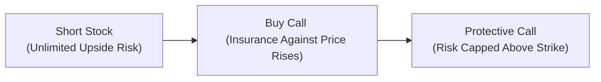
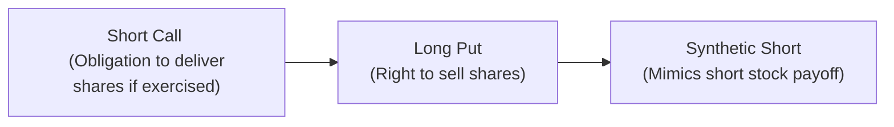
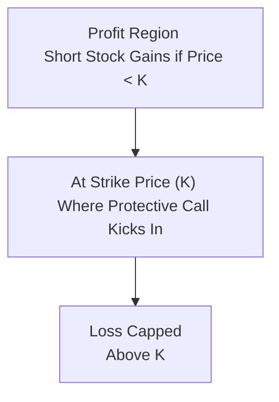

## 19.6 Protective Call or Synthetic Short

Sometimes, you’re convinced the market is heading down. Maybe you read a dismal earnings report or you just have that gut feeling. Being short a stock (selling borrowed shares) can be one way to profit if the price drops, but it comes with unlimited risk if the stock surges the other way. And that unlimited risk, trust me, can cause a few sleepless nights.

Fortunately, there are strategies to limit or more precisely shape the risk. That’s where the protective call and the synthetic short come into play. Let’s chat about what each strategy does, why you might use it, and some pitfalls you should watch out for along the way.

## Protective Call

Think of the protective call like buying insurance for your short stock. If you’ve shorted a stock and it suddenly bounces upward, a call option can help cap your loss. It feels a bit like those times you decide to buy extended warranty on your brand-new electronic gadget—maybe it costs extra, but you breathe a huge sigh of relief if something goes wrong.

### Why Protective Calls?

A short stock position has unlimited upside risk because theoretically there’s no limit to how high a stock price can go. The protective call strategy neutralizes part of that unlimited liability by purchasing a call on the same underlying stock. So if that stock skyrockets, your call gains in value, offsetting the losses on your short position. In exchange, of course, you pay the call premium.

### Mechanics of a Protective Call

• Short the stock. Borrow shares (from your brokerage or another lender) and sell them at the current market price, expecting to buy them back later at a lower price.  
• Buy a call option on the same stock, typically with the same (or longer) maturity you expect to maintain the short position.  

If the stock price stays flat or declines, you make a profit on the short stock. The call option will expire worthless (or at least near worthless if the stock has fallen significantly), and all that’s lost is the option premium you paid. If the stock rallies, you lose on the short stock, but your purchased call (the protective call) gains value, offsetting a chunk of that negative blow.

Below is a mermaid diagram illustrating the flow of setting up a protective call:

The protective call changes your payoff profile to something more manageable. You still have a net short bias, but total risk is no longer boundless.

### Example

Suppose you short 100 shares of MapleTree Inc. at CA$50 each (so you collect CA$5,000 from the short sale). You now face unlimited upside risk if MapleTree’s price suddenly climbs. To protect yourself, you choose to buy a call option on MapleTree with a strike price of CA$55, expiring in two months. Let’s say that call costs CA$1.00 per share, or CA$100 total.

• If MapleTree slides to CA$40, your short stock makes CA$10 per share (because you can buy back at CA$40), netting CA$1,000. The call expires worthless (for an additional CA$100 cost), leaving you with a net profit of CA$900.  
• If MapleTree explodes to CA$65, your short stock loses CA$15 per share (that’s a CA$1,500 loss), but the call option you own at CA$55 can be exercised (or sold in the market if it’s American-style) for a gain of CA$10 per share (CA$1,000). In that scenario, your net loss is CA$500 plus the CA$100 premium you paid, so total CA$600.

Yes, CA$600 is never a happy day, but compare that to the raw horror of facing unlimited risk on a naked short. The protective call soothes those nerves quite a bit.

### Pros and Cons

Pros:  
• Peace of mind: You gain downside profit potential with a roof on total risk.  
• Defined risk: No more losing sleep about catastrophic upward moves.  
• Straightforward: It’s a simple “one short, one long call” combination.

Cons:  
• Option premium cost: This can eat into your profits if the stock stays flat or drops slowly.  
• Time decay: The call loses extrinsic value over time, which is essentially non-recoverable if the market doesn’t move upward enough.  
• Opportunity cost: If MapleTree plummets far below your strike, you paid for protection you didn’t end up needing.

### Capital and Margin Considerations

Canadian brokers typically impose margin requirements for short-stock positions, but owning a call against that position can reduce your margin requirement. CIRO (the Canadian Investment Regulatory Organization) guidelines (https://www.ciro.ca) outline how much capital you need to set aside. Because the call provides an offset to risk, your margin can be lower than that of a naked short position. Make sure to confirm the exact margin offsets with your brokerage or consult the latest official bulletins from the Montréal Exchange. Larger institutions will have additional complexities around margin, but the principle is the same: the protective call is recognized as a valid risk-reduction technique.

### When to Use Protective Calls

• Earnings Season Rollercoaster: If you’re short a stock and it’s about to release earnings, buying a short-term call can help protect against an upside surprise.  
• High-Volatility Environment: Stocks can jump or drop rapidly. A protective call ensures you don’t get lost in the upside mania.  
• Short to Medium Term Horizons: Typically, purchasing a protective call aligns with time horizons of up to a few months. If you plan to hold your short for a year, you might roll your call option coverage as each expires.

## Synthetic Short Stock

If protective calls are about capping unlimited risk on an existing short, the synthetic short is about replicating the payoff of a short stock entirely using options. It’s a neat “hack,” if you like, for those times you’d prefer an alternative to short-selling shares outright.

### How Synthetic Shorts Work

A synthetic short stock is a combination of:
• Short Call Option  
• Long Put Option  

Both are typically at the same strike price (or very close) and same expiration date. The net effect? You collect premium from the short call, you pay premium for the long put, and your overall payoff is similar to having shorted the actual stock. 

Let’s see it visually:

Stock prices go down? You’re in the money with your put, which increases in value. Stock prices go up? Your short call heads deeper in the money, losing you money. This is effectively the same “downslope” payoff profile as shorting the actual shares.

### Example of a Synthetic Short

You want short exposure to MapleTree Inc. trading at CA$50, but prefer not to deal with short-selling the actual shares or paying stock-borrow fees. So you craft a synthetic short:

• Write (sell) a MapleTree call with a strike of CA$50 expiring in one month, collecting CA$2.00 per share premium.  
• Buy a MapleTree put with the same strike and expiration, paying CA$2.00 per share.  

Notice your net premium in this example is close to zero (in practice, it might be slightly positive or negative, depending on implied volatility skew). Once established:

• If MapleTree drops to CA$45, your put gains intrinsic value—now you can sell shares at CA$50 if you exercise. Meanwhile, your short call will become cheaper to buy back if you close it out.  
• If MapleTree surges to CA$60, that short call is now painfully deep in the money, and your put is worthless. You could face assignment on the call at any moment, forced to deliver shares at CA$50. That’s functionally the same as losing CA$10 on a short stock.  

This “synthetic short” is capital-efficient in certain margin rules because you might place less margin than if you shorted the stock outright—though it depends on the broker’s or clearing firm’s internal risk models. CIRO’s website has margin guidelines referencing advanced strategies such as synthetic positions.

### Early Assignment Risk

One big difference from simply shorting the stock is you do face early assignment risk on the short call. If interest rates and dividends significantly influence an investor’s decision to exercise a call early—and if the underlying stock is paying a big dividend tomorrow—there’s a chance your call could be exercised earlier than the option’s expiration date. If you get assigned, you must deliver the shares. Since you don’t own the shares (you were using options to replicate the short), you’d have to buy them at the then-current market price, which might be higher than your strike price.

### Real-World Applications

Institutions often turn to synthetic shorts if they want short exposure but don’t want to fuss with the operational complexities of borrowing shares. Some portfolio managers also prefer to keep short exposure “off the books” in the sense that they’re not messing with the physical share inventory. And if you’re comfortable with options, the synthetic approach feels more straightforward at times. However, keep in mind that margin rules can still be tricky and the cost structure might not always be better than shorting the actual stock, especially if implied volatility is high.

## Protective Call vs. Synthetic Short

Both strategies involve short positions and call options, but they solve quite different problems:

• Protective Call: You already hold a short stock and want to purchase a call to protect yourself.  
• Synthetic Short: You want a brand-new short stance on an underlying, but prefer to replicate that short with no physical share borrow.  

In the protective call, you reduce your risk on an existing short. In the synthetic short, you create the short exposure from scratch using options.

## Risk Management and Regulatory Considerations

Whenever you’re short, it’s essential to track your open interest and the cost of carries—especially if it’s a physically delivered option. The Montréal Exchange publishes bulletins about potential early assignments around a stock’s ex-dividend date. Keep an eye on these. RBC Global Asset Management and Mackenzie Investments sometimes release case studies on how their portfolio managers use options to manage risk on short positions. Exploring their research can provide additional practical insights.

If you’re an investment advisor in Canada, you must ensure these strategies fit within your client’s risk tolerance and align with CIRO (historic references would be IIROC or MFDA) regulations and codes of conduct. In addition, check that your client or your firm is permitted to use these strategies. Hedging rules, short-selling guidelines, and margin requirements vary. For the up-to-date references, see (https://www.ciro.ca).

## Practical Examples and a Personal Anecdote

Years ago, I had a friend (yes, typical anecdote alert) who was absolutely certain a particular oil and gas stock was going to slide. He shorted the stock without any protection. Day two, oil prices soared, the stock soared, and he ended up getting killed financially before he could react. If he’d spent a fraction of what he lost on a protective call, his outcome would’ve been vastly less tragic. Sure, he would’ve paid for an option, but it would’ve spared him a meltdown. This is why these strategies exist—for situations where you want to hedge a short stance or achieve a short stance with more precise risk management.

## Diagrams and Payoff Charts

Let’s visualize a typical payoff diagram for a protective call at expiration. The horizontal axis (X-axis) is the stock price at expiration, and the vertical axis (Y-axis) is the overall profit or loss from the combined position (short stock plus long call).

We’ll label key points:  
• Strike Price = K  
• Price at which you shorted stock = S₀  
• Price of call premium = C

(Since rendering actual payoff lines is more straightforward with an image, we’ll approximate with a flow-style chart. But keep in mind, the slope is negative until you hit the strike K, at which point your losses are capped.)

For the synthetic short payoff, your net P/L slopes downward just like a short stock. If the underlying rises, you lose money. If it falls, you gain money. The negative side is unbounded, reminiscent of a short stock risk profile.

## Margin Implications

Protective calls can lighten margin requirements on short positions since the call option you own offsets some of the risk. Meanwhile, synthetic shorts can generate interesting margin requirements: you might face a margin on both the short call and the long put. Sometimes the margin is less than shorting the stock directly—especially if the short call is considered partially covered by the long put.

Keep a close watch on market volatility, because margin requirements can jump if implied vol spikes. Post-2023, CIRO introduced more dynamic margin systems that incorporate stress testing short option positions in times of heightened volatility. Review your firm’s risk disclosures and keep enough cushion so you’re not forced to liquidate positions prematurely.

## Tools and Resources

• Montréal Exchange Exercise and Assignment Bulletins: These outline how and when options can be exercised or assigned, crucial for short call positions.  
• CIRO (https://www.ciro.ca): Offers guidance on margin and capital requirements for advanced option strategies.  
• RBC Global Asset Management or Mackenzie Investments: Their white papers exploring practical uses of complex options.  
• Online Portfolio Simulators (Interactive Brokers Paper Trading, TD Direct Investing Demo): Great places to practice placing a protective call or constructing a synthetic short.  
• Free Option Profit Calculators: Open-source financial tools like OptionsX, if you want to see the payoff visually.

## Best Practices and Pitfalls

• Don’t ignore assignment bulletins. Getting assigned on your short call can become messy if you haven’t planned for it.  
• Monitor implied volatility. If the IV is very high on calls, your protective call might be expensive, erasing potential profits if the stock does fall.  
• Roll or close positions if the underlying moves strongly. For protective calls, once you’ve “used up” the insurance, you may want to reevaluate.  
• Don’t rely just on protective calls or synthetics as a get-out-of-jail-free card. Always have a broader plan.

## Conclusion

Whether you’re simply protecting an existing short with a call option or constructing a fancy “short” position out of calls and puts, options open up all kinds of ways to shape risk. A protective call can keep you from being wiped out if your short stock leaps upward, while a synthetic short might be just the trick to get short exposure without physically borrowing shares. Both strategies come with unique margin implications, early assignment risks, and potential complexities. But if used wisely, they can be powerful additions to your trading toolbox.

Because it’s the Canadian derivatives market, always confirm you’re following the latest rules from CIRO and the Montréal Exchange to avoid margin or compliance headaches. Options should never be approached lightly—but once you have the right checks in place, a protective call or synthetic short can help you express your bearish views with greater confidence and clarity.

Now that you know how these strategies work, consider investigating them in a practice environment—like a paper trading account—before using real money. You’ll gain an intuitive grasp of how they behave and can refine your approach for real-world conditions.

---

## Sample Exam Questions: Protective Call or Synthetic Short



### Which best describes the rationale behind a protective call strategy?

- [ ] To replicate a short stock by combining a short call and long put.
- [x] To limit the upside risk on an existing short stock.
- [ ] To profit from a neutral market with minimal capital outlay.
- [ ] To fully hedge a long stock position against all possible losses.

> **Explanation:** A protective call is used to hedge an existing short stock position by purchasing a call option, capping the upside risk.

### A trader holds a short stock position and is worried about a sudden price increase. What is the primary outcome if they add a protective call?

- [ ] They eliminate all potential losses and gains.
- [x] They cap potential losses at the strike price of the call.
- [ ] They convert their position into a synthetic long.
- [ ] They significantly increase their margin requirements.

> **Explanation:** The protective call creates a maximum loss scenario once the stock price exceeds the call’s strike. You pay the premium for that peace of mind.

### In a synthetic short stock strategy, if the underlying stock skyrockets, what is the immediate risk?

- [ ] The put option becomes worthless, but the position has no risk.
- [ ] The long put gets exercised automatically, limiting risk.
- [x] The short call can be assigned early, forcing delivery of the stock.
- [ ] No risk; synthetic shorts are cash-settled.

> **Explanation:** Early assignment is a significant risk for short calls, especially if in-the-money. The trader could be obligated to deliver shares at the strike price.

### A synthetic short position is composed of:

- [ ] Short stock plus a long call.
- [x] Short call plus a long put.
- [ ] Short call plus a short put.
- [ ] Long call plus a short put.

> **Explanation:** The short call and long put, when combined at the same strike and expiry, give a payoff resembling short stock.

### What is an advantage of opening a synthetic short versus directly shorting the stock?

- [ ] No risk of early assignment or margin requirements.
- [x] Potentially more capital-efficient, with no need to borrow actual shares.
- [ ] Your gains are unlimited if the stock price goes up.
- [ ] You collect dividends while holding the synthetic short.

> **Explanation:** A common advantage is that you avoid physically borrowing the shares and possibly gain margin efficiencies. However, there is still margin and early assignment risk on the short call.

### Under Canadian regulatory standards, involving a purchased call in your short position can:

- [x] Reduce your margin requirements due to limited risk.
- [ ] Trigger a mandatory early assignment on your short call.
- [ ] Eliminate the need for any regulatory oversight.
- [ ] Have no impact on margin requirements.

> **Explanation:** The call offsets some of the risk, reducing position margin requirements per CIRO guidelines.

### Which of the following statements is TRUE about a protective call?

- [ ] A protective call eliminates the cost of carry on a short stock.
- [x] It allows the trader to benefit from the downside of the short stock while capping the upside loss.
- [ ] It is primarily used when a trader has a long stock and wants upside potential.
- [ ] It can only be established if the call and stock shares have the same expiration date.

> **Explanation:** By owning a short stock and buying a call, the trader still profits if the stock moves down but has a capped loss if it moves up.

### A short call writer is most likely to face early assignment risk when:

- [ ] The underlying stock has no dividends and time value is high.
- [x] The underlying stock is about to pay a significant dividend and the call is in-the-money.
- [ ] The trader also holds a long call in the same series.
- [ ] The option is out-of-the-money and close to expiration.

> **Explanation:** Calls are often exercised early to capture dividends if they are deep in-the-money and the time value is not greater than the dividend payout.

### Which of the following might be a reason to prefer a synthetic short over a short stock?

- [x] Potential difficulty in locating shares for a short sale.
- [ ] You want to reduce overall trading costs by collecting dividends.
- [ ] You want to increase your total margin requirements.
- [ ] You want to avoid using options altogether.

> **Explanation:** If shares are in short supply or expensive to borrow, constructing a synthetic short is an alternative path to get the same payoff.

### True or False: A protective call eliminates all possibility of loss on a short stock position.

- [ ] True
- [x] False

> **Explanation:** The trader still faces losses up to the call option’s strike plus the premium paid. The protective call limits the loss but does not eliminate it.


