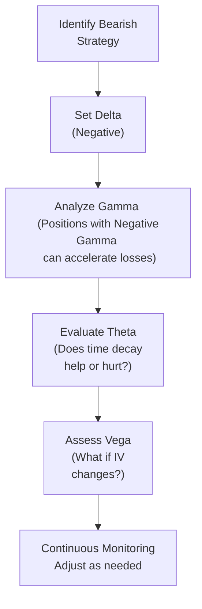

## 19.7 Greek Considerations for Bearish Strategies

Imagine sipping your morning coffee, glancing at the markets, and thinking: “Hmm, I really see this stock going down.” That’s your bearish thesis in a nutshell. But how do you manage the risk you’re about to take on when trading options from that angle? This is exactly where the Greeks come in. They’re those fancy-sounding tools—Delta, Gamma, Theta, and Vega—that help you measure how an option’s value changes with different factors. In a bearish strategy, you’ll often see negative Delta (so it profits when prices drop), but there’s more nuance to it than that. Let’s dig deeper and see how each Greek can make or break your day when the market decides to zig instead of zag.

Below, we’ll go through each Greek in the context of bearish strategies, share a few personal tales of (mis)adventures, and offer some practical tips. We’ll also highlight relevant resources and frameworks, including references to the Canadian Investment Regulatory Organization (CIRO) environment, so you’re up to speed on the compliance side if you choose to put your newfound knowledge into action.

### Understanding Bearish Greeks

Before diving in, let’s paint the big picture. When you talk about “bearish option strategies,” you’re usually looking at positions such as:

• Long Puts (buying a put option to profit from a price decline).  
• Short Calls (selling a call option to profit if the underlying stays below the strike).  
• Bear Call Spreads (selling a call option and buying another one at a higher strike).  
• Bear Put Spreads (buying a put, selling a put with lower strike).

All these moves share a common trait: they’re designed to make money when the underlying asset price falls, or at least doesn’t rise significantly. The best friend (or foe) of these strategies? The Greeks.

### Delta for Bearish Strategies

Delta (Δ) measures an option’s sensitivity to changes in the price of the underlying. In simpler terms, Delta tells you how much the option’s price changes if the underlying moves by $1.

• Negative Delta is the hallmark of short calls and long puts (the two building blocks of many bearish strategies).  
• If you’ve ever traded a long put, you might have noticed that as the stock price fell, your put’s price increased. That’s negative Delta at work.  

Back during my early trading days, I remember being so sure a particular tech stock would slide after earnings. I bought some puts with a Delta around -0.40. Translation? If the stock dropped $1, I’d expect (in theory) a $0.40 rise in the option’s price, ignoring other Greek factors for the moment. The day after earnings, the stock dropped $3, and my puts soared in value—just as Delta indicated they might. I was delighted, but needed to keep an eye on how Delta might change (enter Gamma) if the stock kept tanking.

Also, you have to remember that Delta is not static; it moves with changes in the underlying price and the passage of time. That’s exactly why we look at Gamma.

### Gamma for Bearish Strategies

Gamma (Γ) is the rate of change in Delta as the underlying’s price moves. If Delta is the speedometer of option price sensitivity, Gamma is the accelerator—showing how quickly Delta changes.  

• For long puts, Gamma is typically positive. As the underlying price drops and that put moves further in-the-money, its Delta will become more negative, potentially accelerating your gains.  
• For short calls, Gamma is negative. As the underlying price rises, your Delta becomes more positive (bad news for a short call that wants a flat or bearish market), quickly increasing your losses.  

I’ll never forget the time I sold a call option on a mining stock, hoping the price would stay range-bound. Market rumor shifted bullish on precious metals, and the stock soared higher. Suddenly, my short call was in real trouble, and negative Gamma meant my losses were ballooning faster than I’d expected. The moral of the story? Keep an eye on Gamma if your direction bet might be proven wrong.

### Theta for Bearish Strategies

Theta (Θ) represents the rate at which an option’s value decays over time, assuming all else stays the same (which, let’s be honest, is rarely the case—but we need some baseline, right?).  

• A short call position typically benefits from time decay. If the clock is ticking and the stock price isn’t going up, every day that passes usually chips away at the call’s time value in your favor.  
• Conversely, if you buy puts, you’re fighting against Theta. You want the underlying’s price to drop sooner rather than later because that put’s extrinsic value is melting each day.  

Honestly, I used to hate the phrase “options are a decaying asset.” But it’s so true. I once held a long put on a retail stock for a good three weeks hoping it would drop after dismal corporate announcements. The price basically went sideways, and then it actually rose a bit. The stock never gave me that big downward move I needed. Theta did its job, and my option lost a hefty chunk of value from pure time decay.  
 
If you’re building a bearish position and have no problem maintaining risk coverage, short calls or bear call spreads might let Theta work in your favor. But that strategy also has an immediate risk if the price surges rapidly. The key is to balance your directional view with the time horizon.  

### Vega for Bearish Strategies

Vega (ν) is all about volatility—how sensitive an option’s price is to changes in implied volatility (IV). You might hear it said, “Volatility is the lifeblood of options traders.” That can be especially true when you’re counting on some big moves in the market.

• If you buy puts (a debit strategy), you usually want volatility to rise because that can inflate the option premium.  
• If you sell calls (a credit strategy), rising volatility typically inflates the option’s premium in a not-so-fun way—higher volatility means the option you sold becomes more expensive to buy back.  

It always feels a bit weird to root for more volatility, but sometimes that’s exactly what your strategy calls for. I remember once being short a call on a small-cap biotech stock (risky!). The implied volatility spiked after the FDA announced a possible drug approval timeline. Even though the stock price didn’t move much at first, the value of my short call soared (that’s me losing money) just because of heightened implied volatility. This is where Vega can really sneak up on you.

### Putting It All Together: A Quick Process Flow

Below is a simple mermaid diagram mapping out how you might think about each Greek in a step-by-step manner for a bearish strategy:

1. You pick a bearish strategy—long put, short call, or some combination.  
2. You check the Delta, making sure you’re comfortable with how sensitive your P/L is to price changes.  
3. You review Gamma, especially if it’s negative (like on a short call), which could balloon your exposure if things go against you.  
4. You consider Theta, deciding if it helps your case (short options) or hurts you (long options).  
5. You factor in Vega, ensuring you understand what happens if implied volatility shifts.  
6. Last but not least—monitor, monitor, monitor. Markets change, volatility changes, and your personal risk appetite may shift.

### Bearish Strategy Examples in Action

Case Study 1: Long Put on Tech Stock  
• You notice a tech stock with negative press on product delays. You buy a put with a Delta of about -0.35.  
• If the price falls, you benefit as Delta becomes more negative (Gamma > 0), but you also lose value daily due to Theta.  
• If implied volatility rises (Vega > 0 for a long put), that helps your trade.  
• If the stock price moves sideways for too long, Theta will eat away at the premium.  

Case Study 2: Short Call on Mining Stock  
• You anticipate a modest or falling market for a mining company’s shares. You sell a call at a strike above the current price.  
• You’re dealing with negative Delta (around -0.30 or so), which is good if the underlying drops.  
• You also have negative Gamma, meaning if the stock soars, your losses can accelerate quickly.  
• Theta generally works in your favor—every day that passes helps you (all else being equal).  
• Rising implied volatility is a bummer since it increases the value of the short call.  

### Monitoring and Adjusting Greek Exposures

People like to say “options are dynamic,” which is just a fancy way of saying the game changes every day. You can track these movements using:

• Online broker tools like TD Direct Investing’s thinkorswim platform in Canada.  
• The Montréal Exchange’s Option Calculator (https://www.m-x.ca/option_calc_en.php).  
• Open-source tools: a Python script with QuantLib or other libraries can pull data and compute Greeks on the fly.

CIRO’s continuing education modules often delve into advanced aspects of option Greeks. If you’re a registered representative or aiming to be one, keep an eye on regulatory updates, because the knowledge expectations around derivatives deepen each year. Since January 1, 2023, the MFDA and IIROC have merged into CIRO, so references to those former bodies are now strictly historical. For official resources, check https://www.ciro.ca.

### Risk Graph (Payoff Diagram) Considerations

A risk graph shows potential profit or loss at expiration based on the underlying’s price. While it doesn’t directly show Greeks, you can see how your maximum profit and loss might look (especially for a short call, where your max profit is limited to the premium while your potential losses can be large).

I find it helpful to plot daily or weekly lines on a risk graph to see how your P/L might evolve prior to expiration—particularly if you hold a position that’s sensitive to Theta or has a high Gamma risk. Many brokerage platforms let you overlay these lines to simulate your position’s value as time passes and the underlying moves.

### Regulatory and Institutional Context

Under the new CIRO environment (post–2023), derivatives oversight remains a high priority. The Bourse de Montréal also keeps a close eye on how participants manage their derivatives positions. Large institutions often have entire teams analyzing Greek exposures intraday. Retail traders might not have that luxury—but free platforms and open-source solutions can help level the playing field.

### Glossary Recap

• Delta (Δ): First derivative of an option’s value w.r.t. changes in the underlying’s price. Negative Delta pays off if the underlying drops.  
• Gamma (Γ): Second derivative of the option’s value w.r.t. changes in the underlying’s price—reflects how Delta changes.  
• Theta (Θ): Time decay factor. Short options typically gain from Theta; long options typically lose from it.  
• Vega (ν): Sensitivity to changes in implied volatility. Volatility can be a double-edged sword, especially for short positions in calls.  
• Risk Graph (Payoff Diagram): A visual chart of potential profits or losses at expiration relative to the underlying’s price.

### Best Practices and Common Pitfalls

• Don’t ignore Gamma in short-call strategies. If you guess wrong on direction, your losses can escalate quickly.  
• For long puts, plan your exit or adjustment early—do you switch to a lower strike if the underlying moves sharply down, or do you simply close out? Time can kill your premium if you wait too long.  
• Keep an eye on implied volatility levels. Buying puts when IV is at historic highs might be extremely expensive; selling calls when IV is super low might not yield enough premium.  
• Use stops or mental triggers if the market moves against you. This is especially true for negative Gamma positions.  

### Closing Thoughts and Additional Resources

Bearish strategies can be enticing. There’s a unique thrill in seeing a market drop and feeling that your analysis was spot-on. But success in that domain depends not only on your directional call but also on effectively managing the Greeks. A healthy respect for Delta, Gamma, Theta, and Vega means you’ll have fewer sleepless nights worrying about random market fluctuations.

If you want more in-depth reading on volatility (and thus Vega), check out “Volatility Trading” by Euan Sinclair. You can also explore OptionStrat or thinkorswim for their built-in Greek calculators. Remember, if you’re in Canada and representing clients, be sure to stay on top of the CIRO continuing education modules for derivatives.

Happy trading—and, well, hopefully your negative Delta positions move in your favor!

## Sample Exam Questions: Greek Considerations for Bearish Strategies



### When implementing a short call strategy, which of the following Greek exposures is typically the largest concern?

- [ ] Positive Gamma
- [x] Negative Gamma
- [ ] Positive Vega
- [ ] Positive Delta

> **Explanation:** Short calls usually carry negative Gamma, meaning that if the underlying price rises, your Delta can become more positive very quickly, increasing potential losses.

### Which Greek captures the rate of change in Delta?

- [ ] Theta
- [x] Gamma
- [ ] Vega
- [ ] Rho

> **Explanation:** Gamma measures how fast Delta changes as the underlying’s price moves. It’s the second derivative of option value with respect to the underlying’s price.

### In a long put position with a negative Delta of -0.50, what does a $1 decrease in the stock price theoretically do to the option’s price, ignoring other factors?

- [x] Increase by $0.50
- [ ] Decrease by $0.50
- [ ] Remain unchanged
- [ ] Increase by $1.00

> **Explanation:** Delta of -0.50 means if the underlying price drops by $1, the option price is expected to rise by $0.50, all else being equal.

### For a bearish investor who wants to benefit from time decay, which of the following strategies is often preferable?

- [ ] Buying long puts
- [x] Selling calls (short calls)
- [ ] Buying call spreads
- [ ] Buying put spreads

> **Explanation:** Selling calls or writing call options benefits from time decay (positive Theta to the short seller), aligning with a bearish outlook if you expect the underlying to remain below the strike.

### An option’s sensitivity to changes in implied volatility is measured by which Greek?

- [ ] Theta
- [ ] Gamma
- [ ] Delta
- [x] Vega

> **Explanation:** Vega measures how sensitive an option’s price is to changes in implied volatility (IV). A spike in IV typically raises the cost of both puts and calls.

### If a trader is short a call and the implied volatility suddenly increases, what happens to their position’s value?

- [ ] The short call loses value and is beneficial for the trader.
- [x] The short call gains value, and the trader sees potential losses increase.
- [ ] The position is unaffected by volatility changes.
- [ ] The position automatically closes.

> **Explanation:** Higher implied volatility inflates option premiums. A higher-priced option is detrimental to someone holding a short position.

### Which Greek typically benefits short call strategies if the stock price remains constant over time?

- [x] Theta
- [ ] Gamma
- [ ] Delta
- [ ] Vega

> **Explanation:** Theta, or time decay, tends to erode the value of an option as expiration nears. Short call writers earn that decay as profit if the underlying stays relatively stable or moves down.

### A trader has a long put with a Gamma of +0.05 and a Delta of -0.30. If the underlying’s price drops, what happens to the Delta?

- [x] Delta becomes more negative.
- [ ] Delta becomes more positive.
- [ ] Gamma becomes negative.
- [ ] The trade is unaffected.

> **Explanation:** With positive Gamma (typical for long options), if the price drops, the Delta of a put option becomes more negative, increasing exposure to further downside movement.

### Why is it important to consider Theta for long put positions in a bearish strategy?

- [x] Time decay can steadily erode the premium if the underlying doesn’t move down quickly.
- [ ] Theta boosts the option’s value if the underlying remains flat.
- [ ] Theta has no impact on the value of a long put.
- [ ] Positive Theta always favors the holder of a long put.

> **Explanation:** Long options lose value each day from time decay (negative Theta), so if the underlying doesn’t drop soon, the option premium shrinks.

### True or False: Negative Gamma is the biggest risk factor for short call positions, because losses can accelerate if the underlying price moves higher.

- [x] True
- [ ] False

> **Explanation:** Negative Gamma means that as the underlying rises, the position’s Delta rapidly becomes more positive, magnifying potential losses for short call positions.


