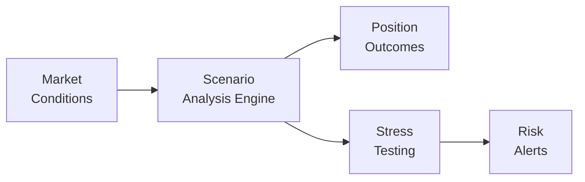

## 19.8 Scenario Analysis and Stress Testing

Sometimes, when life throws us curveballs, we catch ourselves thinking, “I really wish I had planned for that.” In trading—and especially when you’re betting on a falling (bearish) market—the equivalent thought is, “If only I had run a scenario analysis or stress test on this strategy beforehand.” So, yeah, welcome to the always-fascinating and occasionally nerve-racking world of scenario analysis and stress testing in bearish option strategies.

Bearish option strategies, such as a short call or a bear put spread, can be very effective in down markets. But what if the market rallies unexpectedly, volatility triples, or some unpredictable piece of good news sends the stock soaring? That’s where scenario analysis and stress testing come in. By simulating “what-if” conditions from mild to extreme, you can see how your strategy might hold up—or not—and decide whether you need additional hedges or whether to rethink the whole trade.

Below, we’ll break this process down step by step, bridging the theoretical with real-world examples. We’ll introduce some personal experiences, summarize official Canadian regulations, and sprinkle in a bit of anecdotal wisdom so the topic feels more like an engaging conversation rather than a lecture. Let’s dive in.

---

### Why Scenario Analysis Matters for Bearish Options

Scenario analysis is basically the practice of projecting how a position might perform under a variety of market conditions. For bearish strategies, we often map out scenarios based on changes to:

• Underlying price (a stock you assume will drop might instead stay flat or rise)  
• Implied volatility (vol spikes might increase option premiums)  
• Time horizon (how quickly or slowly the market moves in your favor—or against it)  

In a typical scenario analysis, you might ask: “What if the underlying moves 5% lower, does nothing, or jumps 10% higher?” And then you see how your short call or bear put spread’s P&L (Profit and Loss) changes.

If something big and unexpected occurs—like a sudden 15% rally—this is where you see whether your so-called “manageable risk” might blow up into a bigger drawdown than you can stomach. Bearish options can get risky, especially if you’re collecting premium on short calls without adequate hedges. So yeah, scenario analysis is your main line of defense against being unpleasantly surprised.

---

### The Basics: Stress Testing vs. Scenario Analysis

Traders sometimes use the terms scenario analysis and stress testing interchangeably, but there’s a slight difference:

• **Scenario Analysis**: Projects performance under various hypothetical market conditions—some plausible, some a bit more extreme. Think of it as a range of “realistic-ish” possibilities.  
• **Stress Test**: Focuses on severe, tail-risk-type events—like a 10–15% rally in a day, or a volatility explosion 30 points higher than usual. These are typically far outside normal historical ranges.  

They’re both super important. Scenario analysis gives you a well-rounded idea of your position’s expected performance, while stress tests show you how that same position might fare in unprecedented or highly volatile environments. If your stress test results look terrifying, it might be a sign to reduce position size, add offsetting hedges, or rethink the trade.

Regulatory bodies, including the Canadian Investment Regulatory Organization (CIRO), strongly encourage employing stress testing—particularly for complex or levered strategies. This ensures you and your clients understand worst-case scenarios and have enough capital (termed “regulatory capital” by CIRO) set aside to manage those risks.

---

### Personal Anecdote: My Surprise when the Market Jumped

I remember a time when I was overly confident in a short call option I’d sold on a mid-cap Canadian tech stock. I’d done a bit of scenario analysis—well, I thought I had—but apparently I was way too optimistic. The trade was designed to profit if the stock stayed below a certain level. It had been trading in a narrow range, so I figured I was safe.

Anyway, some surprise merger announcement shot the stock up by 20% overnight. That short call basically soared in price, leaving me with a quick—and painful—margin call. Looking back, I realized I hadn’t properly stress tested a major upside gap. And, as you might guess, I’ve never neglected stress testing since!

---

### When to Perform Scenario Analysis and Stress Testing

Scenario analysis and stress testing aren’t just for the moment you open a trade. Although you definitely want to do them at the start (to see if you can handle the worst-case scenario), it’s also wise to:

• Perform them periodically, especially if you’re in the trade for a while, or if large market events (like central bank announcements or earnings seasons) approach.  
• Revisit them if volatility changes drastically—vol spikes can hammer option sellers or reward them if they’re net long volatility.  
• Reassess after any significant changes in your portfolio. Maybe you added a new position that alters your net exposure, or perhaps your short call is now deeper in-the-money.  

In Canada, CIRO encourages members to maintain an active risk management framework. Part of that framework is regularly performing scenario analysis and stress testing on trades with significant downside (or upside) potential.

---

### Components of a Good Scenario Analysis

An easy way to remember the building blocks is: (1) Price, (2) Volatility, (3) Time, and (4) Liquidity.

1. **Price**  
   For a bear put spread, generate scenarios for different underlying prices: staying flat, dropping 5%, dropping 10%, rallying 5%, rallying 10%, or more. Identify how the spread’s value changes at each scenario.  

2. **Volatility**  
   Implied volatility can have a surprisingly big impact on options. If volatility spikes, the long put in your bear put spread might gain value (assuming your short put doesn’t offset it too much). Conversely, if volatility plunges, your net position might be worth less.  

3. **Time**  
   Consider how the position’s P&L looks if these moves happen tomorrow, or if they happen two weeks from now. Because of time decay (theta), options naturally lose time value as expiration approaches if the forecasted price move doesn’t materialize in time.  

4. **Liquidity**  
   Even if your scenario analysis looks decent on paper, a lack of liquidity might prevent you from exiting or rolling positions efficiently. This is especially relevant for less-traded underlyings or further out-of-the-money contracts. When the market is spooked, bid-ask spreads can widen, making it more expensive to adjust positions.

These four components form the backbone of robust scenario testing for bearish option strategies.  

---

### Digging Deeper into Stress Testing

Stress testing is basically scenario analysis on steroids. Maybe you’re confident a stock is going nowhere, but how would you handle an unforgiving 15% rally in a day or two? Those are the tail events that stress tests are meant to capture.

1. **Historical Shock Scenarios**  
   A popular approach is to look at big historical moves. For instance, consider the sharp rally in equities after certain major events. If you replicate that kind of market condition and see how your position’s P&L might look, you can glean pretty valuable insights.  

2. **Hypothetical Extreme Shocks**  
   Sometimes you might imagine a scenario that’s never actually happened—like a 25% single-day rally—just to see if your margin covers this doomsday outcome. If the stress test results demonstrate an unacceptably large drawdown, it’s a hint that you need to reduce your short exposure or buy some calls for protection.  

3. **Scenario Chains**  
   Another technique is to stress test your position over multiple trading days or weeks. For instance, simulate day one: a 5% rally; day two: an additional 3% rally; day three: total meltdown or reversal. This sequence-based approach can clarify how you’d fare through extended volatility or a consistently rising market when you’re short.  

---

### Practical Example: Bear Put Spread Scenario Analysis

Let’s say you’ve set up a **bear put spread** on TD Bank stock—just as an example. The stock’s currently at CAD 85. You buy a put with a strike of CAD 82 and write a put with a strike of CAD 77, both expiring in 75 days.

• **Price Scenarios**:  
  – Stock goes to CAD 75 by expiration (bearish scenario that you’re expecting).  
  – Stock stays around CAD 85 (neutral).  
  – Stock jumps to CAD 90 (bullish scenario—you’re wrong).  

• **Volatility Scenarios**:  
  – Implied volatility increases by 5 points.  
  – Implied volatility decreases by 5 points.  

• **Time**:  
  – Evaluate the position 45 days before expiration, 15 days before expiration, and at expiration.  

• **Liquidity**:  
  – Assume normal market conditions with tight bid-ask spreads.  
  – Assume a “panic scenario” with wide bid-ask spreads.  

Combining these data points, you create a grid or table that shows your approximate P&L. For instance:

| Stock Price | IV Change | Days to Expiry | Spread Value | Est. P&L   |
|-------------|----------|----------------|-------------|------------|
| 75          | +5 pts    | 45 days        | $X          | +Profit    |
| 75          | -5 pts    | 45 days        | $Y          | +LessProfit|
| 90          | +5 pts    | 15 days        | $Z          | -Loss      |
| ...         | ...       | ...            | ...         | ...        |

You’d fill in the table with actual P&L numbers using an options pricing model or an online analytics tool. This grid helps you see that if the stock unexpectedly shoots up to CAD 90, your maximum risk is typically the net debit you initially invested in the spread. Stress tests might then tack on an extreme scenario, like the stock jumping to CAD 100 in a frenzy, or implied volatility dropping drastically if the market is confident about the rally.  

---

### Watch Out for Drawdown and Regulatory Capital

A drawdown is the decline from a peak to a subsequent trough. If your scenario indicates that a short call position might face a 30% drawdown in a single day if the underlying spikes, you probably want to see if that’s within your risk tolerance and capital capabilities. CIRO rules require dealers to hold sufficient **regulatory capital** to cover potential losses—so if your trade is big enough to exceed internal risk thresholds, your firm might ring the margin-call bell.

Bearish strategies can seem low-risk if the underlying is in a clear downtrend, but markets have a habit of surprising us. Thorough scenario analysis ensures that your risk manager (who might be you if you’re a self-directed trader) is well aware of those potential pitfalls.

---

### Incorporating “Liquidity Risk”

One aspect that’s super easy to ignore in your spreadsheet-based scenario analysis is liquidity risk. But ignoring it can create illusions of safety. You might see your net theoretical P&L is manageable under various scenarios. Then, in real life, the market gaps higher, bid-ask spreads blow out, and you can’t close your position without incurring a steeper-than-expected loss. That’s how even a “planning geek” can get blindsided.

For instance, if you’re trading a short call on a thinly traded biotech stock, your scenario analysis might look fine—until you realize that once the stock suddenly doubles on an FDA approval, nobody is selling calls back to you below some outrageous premium. So, at the end of your scenario analysis, it’s wise to incorporate a liquidity discount: assume that in a turbulent environment you might have to exit your position at a bigger haircut.

---

### Real-World Stress Testing Tools

Many institutions now use sophisticated systems that automatically perform daily scenario analyses on each position. This is common at bigger Canadian banks (like RBC and TD, among others). On top of that, they have advanced stress testing frameworks that run hypothetical drastically rising- or falling-market scenarios, then measure how it affects each division’s portfolio. It’s often a requirement for internal risk oversight and also to meet broader guidelines set by the Canadian Securities Administrators (CSA).

If you’re more of a do-it-yourself person, you can still find plenty of open-source solutions (like R or Python libraries) to simulate market movements. For instance, in Python, you might run a Monte Carlo simulation with user-defined upward shocks in the underlying price, or you could factor in correlated volatility changes. This can be as simple or as complicated as you want, but keep in mind that the more robust your simulation, the clearer your understanding of potential losses (or gains).

---

### Monitoring the Position—and Knowing When to Adjust

Don’t just run these analyses once and forget about them. Let’s say you’re three weeks into your trade, and the stock has fallen a bit, so you’re making some money on your bear put spread. That’s awesome, right? But now you might want to see if an upward reversal in the underlying stock could cause you to lose all that unrealized profit. If your fresh scenario analysis suggests that an immediate 10% rally would wipe out your gains, maybe you’d consider rolling down your long put or scaling out of part of your position.

Seasoned traders also keep a close eye on implied volatility and time decay. A rising implied volatility can offset losses if the market sneaks upward but does so in a jittery fashion (in the case of a net long put). Conversely, if time is running out and your short call is creeping in-the-money, you might be confronted with a potential exercise or assignment risk you hadn’t fully accounted for initially.

---

### Aligning with CIRO Guidelines

Since January 1, 2023, the new Canadian Investment Regulatory Organization (CIRO) has been overseeing both investment dealers (formerly under IIROC) and mutual fund dealers (formerly under MFDA). They expect you to have risk management controls in place. This typically includes:

• Performing adequate scenario analysis on all material positions.  
• Stress testing to identify possible large losses and ensure adequate capital is maintained.  
• Documenting your procedures and being ready to show them to CIRO.  

If you’re part of a firm, your risk control department probably standardizes these processes. If you’re an individual using a self-directed brokerage (also under CIRO’s oversight for market integrity), you’re less formally bound by some organizational policies. However, it’s still considered a best practice for your personal financial wellbeing to run these tests.

---

### Example of a Simple Analytical Framework

Below is a basic illustration in Mermaid that captures the flow from market conditions to scenario analysis, then to stress testing and risk alerts:

• **Market Conditions**: Price levels, volatility, event risk, and liquidity.  
• **Scenario Analysis Engine**: Tools or calculators that estimate P&L.  
• **Position Outcomes**: Potential upsides, downsides, break-even points.  
• **Stress Testing**: Aggressive what-if modeling of major swings.  
• **Risk Alerts**: Warnings or triggers for adjusting trades or capital levels.  

---

### Adjusting Your Strategy

After scenario analysis and stress testing, you might:

1. **Scale Your Position**. If you see your short call is too large relative to your account size, you might scale down the position to reduce risk.   
2. **Add Protective Hedges**. For a short call, consider buying a call at a higher strike (creating a bear call spread) to cap your potential loss. For a bear put spread, you may want a small offsetting call position if you suspect volatility meltdown.  
3. **Close or Roll Early**. If time is working against you, or if the market direction or implied volatility just isn’t cooperating, you might close early or roll the position to a later expiration.  

---

### Common Pitfalls

• **Overconfidence**. Let’s say you see a stable chart or recent downtrend and assume your bearish trade is practically a “gimme.” Markets have a habit of reverting or surprising.  
• **Ignoring Volatility**. Even if you mostly trade direction, ignoring changes in implied volatility can drastically understate your risk.  
• **Forgetting Liquidity**. If your analysis only applies to some perfect world where you can instantly exit at midpoint prices, you risk real-world heartbreak.  
• **No Follow-Up**. Doing a quick scenario analysis at trade initiation but never rechecking it when the market environment changes is a recipe for trouble.  

---

### Tips on Using Open-Source Tools

• **Python**: Libraries like NumPy, pandas, and matplotlib can help you quickly run both historical simulation and Monte Carlo scenario tests. You can load in historical price and volatility data, tweak variables, and generate forward-looking stress tests.  
• **R**: Has robust packages (e.g., “quantmod,” “PerformanceAnalytics,” “tidyverse”) for reading in market data, creating hypothetical scenarios, and analyzing outcomes.  
• **Dedicated Platforms**: Many brokerages have built-in scenario analyzers. Some might be limited, but they can be a great place to start if you’re not super comfortable with coding your own solution.  

---

### Real-World Regulatory Perspective

The Canadian Securities Administrators (CSA) is the umbrella organization that coordinates provincial and territorial securities regulators. They set the high-level rules for derivatives oversight. CIRO (our integrated self-regulator) enforces these rules for investment dealer and mutual fund dealer members across Canada. That means if you’re operating in these markets, your risk processes—scenario analysis, stress testing, and so forth—should align with CSA/CIRO guidelines.

If you’re an institutional trader, your firm has an entire risk management department to comply with these rules. If you’re an individual, you rely on your brokerage’s margin policies, and you’re presumably using scenario analysis and stress tests for your own self-preservation. One of the broad aims is to ensure you can handle short-term volatility or extreme events without defaulting on those trades.

---

### Looking Ahead

In sum, scenario analysis and stress testing are key to understanding—and hopefully controlling—the potential blow-ups in a bearish option strategy. We’ve all been there: the market suddenly does the exact opposite of what we expected. Having a robust plan in place can help calm the nerves and limit the damage.

If you’re new, start by building a simple scenario table in a spreadsheet. If you’re a bit more advanced, try out a basic Python or R script. Keep refining your assumptions (especially about volatility and liquidity) to make them as close to real life as possible. That way, if a 15% rally does come out of nowhere, you’ll at least have an inkling of what that might do to your positions—and you’ll know how to react.

Remember: the best scenario analysis is worthless if you never act on its findings. If your stress test says you’re skating on thin ice, trust those results and do the prudent thing. There’s no shame in stepping back or adding a hedge. In fact, it’s probably the hallmark of a seasoned, rational trader.

---

### Key Glossary Terms

• **Scenario Analysis**: Modeling how trades perform under different market conditions (price, volatility, time).  
• **Stress Test**: Testing positions against extreme or tail-event scenarios.  
• **Drawdown**: The drop from a peak account value to a trough, expressed as a percentage.  
• **Liquidity Risk**: The threat of being unable to exit or enter trades quickly without a significant impact on price.  
• **Regulatory Capital**: The capital mandated by CIRO to ensure market integrity and that broker-dealer firms can meet potential losses.

---

### Additional Resources

• **CIRO**: Visit [https://www.ciro.ca](https://www.ciro.ca) for the latest guidelines on derivatives regulation and risk management.  
• **CSA**: Broader Canadian Securities Administrators umbrella site at [https://www.securities-administrators.ca/](https://www.securities-administrators.ca/) for federal/provincial frameworks.  
• **Open-Source Software**:  
  – Python’s “Pyfolio” or “QuantEcon” for analyzing and stress testing your trading strategies  
  – R’s “quantmod,” “PerformanceAnalytics,” or “Riskmetrics” packages for scenario-based modeling  
• **Bank Research**: RBC, TD, and other major Canadian banks often release whitepapers or research notes detailing their approach to internal stress testing.

---

## Sample Exam Questions: Scenario Analysis and Stress Testing in Bearish Option Strategies



### A scenario analysis for a bearish option strategy typically includes:
- [x] Price changes, time horizons, volatility shifts, and liquidity considerations.
- [ ] Replacing fundamental analysis with purely random guesses.
- [ ] Annual dividend yield reports only.
- [ ] Only analyzing final expiration outcomes.

> **Explanation:** Scenario analysis generally covers key market variables (price, volatility, and time) and also accounts for liquidity risk.

---

### Which of the following best describes the difference between scenario analysis and stress testing?
- [x] Scenario analysis looks at a range of plausible outcomes, while stress testing focuses on extreme or unlikely outcomes.
- [ ] Both scenario analysis and stress testing only consider mild changes in the underlying price.
- [ ] Stress testing is exclusively for bullish strategies, while scenario analysis is for bearish strategies.
- [ ] Scenario analysis can only be done for large institutions.

> **Explanation:** Scenario analysis is broader and covers various possible outcomes, while stress testing specializes in worst-case or tail-risk scenarios.

---

### While conducting scenario analysis on a bear put spread, which factor is NOT typically included?
- [ ] Price changes
- [ ] Implied volatility changes
- [ ] Time-to-expiry changes
- [x] Preferred share dividend yields

> **Explanation:** Bear put spreads are affected by the underlying price, volatility fluctuations, and time decay, but not by preferred share dividends (unless the underlying is itself a dividend-paying equity, in which case the direct effect on put option pricing is indirect and typically smaller than for calls).

---

### In a stress test, you assume a sudden 15% rally. If you hold a short call strategy, what is one possible outcome?
- [x] Significant losses if the underlying rallies well above your short call’s strike.
- [ ] Potential for unlimited gains if volatility drops.
- [ ] Neutral effect since your max loss is zero.
- [ ] A guaranteed profit if the market reverses after the rally.

> **Explanation:** A short call has theoretically unlimited upside risk. A sudden rally can push losses to extremely high levels.

---

### CIRO guidelines encourage scenario analysis at which points in a trade?
- [x] At trade initiation and periodically thereafter.
- [ ] Only at the time of final expiration.
- [x] Right after events (e.g., earnings or M&A announcements) that alter market volatility.
- [ ] Immediately prior to liquidation only.

> **Explanation:** Initial scenario analysis helps set expectations, and ongoing or event-driven analysis helps adapt to evolving market and position conditions.

---

### If a stress test shows a large potential drawdown, a trader might:
- [x] Scale down the position or add hedges.
- [ ] Ignore it on the assumption it’s only hypothetical.
- [ ] Double the position to recoup potential losses.
- [ ] Eliminate scenario analysis altogether.

> **Explanation:** When a drawdown is too large, the prudent approach is reducing position size or adding protective hedges.

---

### Liquidity risk in scenario analysis refers to:
- [x] The possibility of wider bid-ask spreads making it hard to exit at a fair price.
- [ ] A guarantee of unlimited volume at the posted price.
- [ ] The stock going bankrupt.
- [ ] None of the above.

> **Explanation:** Liquidity risk is about being unable to buy or sell without a large price impact or wide spreads.

---

### Monte Carlo simulation in Python or R for scenario analysis:
- [x] Allows traders to simulate numerous price paths and vol changes for more robust risk assessment.
- [ ] Is strictly forbidden by CIRO guidelines.
- [ ] Has no application to real-world derivatives.
- [ ] Only works for futures, not options.

> **Explanation:** Python and R can handle complex scenario modeling, giving traders deeper insights into risk.

---

### A common pitfall of scenario analysis is:
- [ ] Including multiple price levels and volatility shifts.
- [x] Overlooking extreme market moves or liquidity constraints.
- [ ] Using multiple open-source analytical tools.
- [ ] Running the analysis for multiple time horizons.

> **Explanation:** Traders often fail to factor in major tail events or large bid-ask spreads when markets get volatile.

---

### True or False: Bearish strategies cannot be stress tested because they already assume a market drop.
- [x] True 
- [ ] False

> **Explanation:** This is tricky, but in a comedic sense, the statement is so obviously false that it highlights the importance of stress testing everything, including bearish strategies, for unanticipated market rallies or volatility shifts. In simpler terms, the statement is indeed false because we can—and should—stress test everything.


