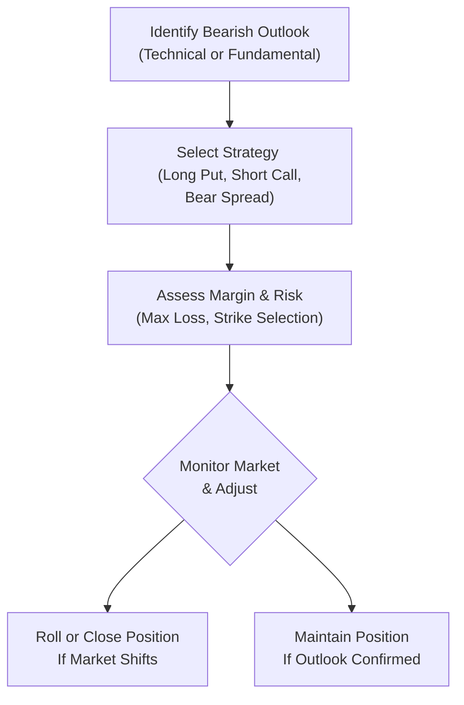

## 19.9 Concluding Remarks and Additional Resources

Bearish option strategies can be powerful tools for traders who believe a market is poised to move lower, or who want to protect their portfolios from potential downward shifts. If you’ve followed along through earlier sections of this chapter, you’ve seen how strategies like long puts, short calls, bear spreads, and protective calls can be layered with careful planning and aligned with specific market outlooks. Now it’s time to wrap up with some concluding thoughts, practical tips, and resources you can explore to sharpen your knowledge.

  
### Recap of Key Takeaways

Bearish strategies aren’t just about “profiting from doom.” They can be about prudently managing risk. Whether you’re a long-term investor wanting to hedge a portfolio or a short-term speculator looking to capitalize on volatility, these strategies give you flexibility in structuring your market exposure. Sometimes, you might deploy a long put if you suspect a major downswing in an individual stock or an index. Other times, a protective call or a bear spread can be used to strategically manage risk and cost. Always keep in mind the exact payoff profile:

• Long Put: Offers a straightforward way to profit from a decline, but the premium paid is at risk if the market goes up.  
• Short Call: Has immediate premium income potential, but can carry theoretically unlimited risk if the market rallies sharply.  
• Bear Put Spread: Reduces overall premium cost, but also caps profit potential.  
• Bear Call Spread: Generates premium while limiting upside risk, but still requires careful monitoring if the price climbs.  

Even though these outlines may sound obvious, it’s surprising how many folks forget the potential for sudden market reversals. One day, your short call might look brilliant as the stock price hovers below the strike, and the next day, a takeover offer or surprising economic data could send your underlying straight up. So, be sure you’re comfortable with the max loss scenario and, yes, always keep an eye on that margin requirement.

  
### Aligning Strategy With Client Suitability

In a regulatory environment overseen by the Canadian Investment Regulatory Organization (CIRO), understanding client suitability is more than just a box-ticking exercise. Before recommending or entering any bearish strategy, weigh the client’s:

• Financial goals (short-term speculation vs. long-term risk mitigation)  
• Time horizon (options decay over time, so how long can they hold a position before it becomes cost-inefficient?)  
• Risk tolerance (are they comfortable potentially surrendering the premium or facing unlimited losses on certain short positions?)  

Clients might say they’re ready for “anything,” but we all know that the first margin call can sometimes cause major anxiety. Ensuring alignment with the client’s comfort level and adhering to CIRO guidelines fosters a healthy investment environment and builds trust.

In my early days, I once suggested a short call strategy to a friend who was fairly new to options. He was excited about the steady income potential. Well, a big macroeconomic announcement triggered a price surge, and let’s just say he discovered the stress that comes with a margin call. We ended up rolling the call to a higher strike and later managed to break even, but the takeaway was that it pays to discuss risk up front.  

  
### Monitoring and Adjustment

Bearish strategies, like all option plays, should be actively monitored. Market dynamics can shift quickly—interest rates might be cut by a central bank, a new trade policy might go through, or a popular influencer might spark short-squeezes in certain equities. Whatever the reason, good traders adapt:

• Adjusting Strikes: If your initial strike is no longer optimal because of a big move, consider rolling to a new strike (higher or lower) more aligned with the updated environment.  
• Rolling Expirations: Time decay can be your ally or enemy. When a position is nearing expiration and you still maintain a bearish conviction, you may choose to roll forward.  
• Adding Hedges: If the market environment becomes uncertain, layering on a partial hedge (like buying an out-of-the-money call to protect your short calls) might help.  

Remember: You don’t have to “set it and forget it.” Options were always designed to be dynamic instruments. If your outlook changes, your positions can evolve too.

  
### Practical Tools for Bearish Trading

In today’s market, you’re not alone. Various platforms and tools exist to help you analyze, simulate, and execute trades with clarity:

• Real-time Market Data Feeds: Keeping tabs on price movements, implied volatility swings, and overall market sentiment in real time can significantly improve your decision-making.  
• Quantitative Modeling Software: Tools like OptionVue, MATLAB, or open-source libraries in Python (e.g., NumPy, Pandas, and certain option-pricing libraries) allow for robust scenario testing.  
• Brokerage Analysis Platforms: Many brokerages offer built-in risk analysis modules that evaluate your position’s risk-exposure to changes in underlying prices, volatilities, or time.  

At the same time, don’t underestimate the good old-fashioned chart. Some folks love predictive models; others prefer to keep it simple with trend lines and volume metrics. Find your sweet spot and stay consistent in how you evaluate trades.

  
### Regulatory Considerations Under CIRO

Any derivatives strategy in Canada must comply with the guidelines set out by CIRO. Historically, the Mutual Fund Dealers Association of Canada (MFDA) and the Investment Industry Regulatory Organization of Canada (IIROC) oversaw these areas, but as of January 1, 2023, they amalgamated into CIRO. Keep the following in mind:

• Position Limits and Reporting: For certain option classes, you may need to watch your position size to avoid surpassing regulatory thresholds.  
• Margin Requirements: CIRO sets minimum margin guidelines, which your firm may make more stringent.  
• Suitability Assessments: As noted above, CIRO’s rules for ensuring each trade matches client objectives remain paramount. Nothing is more important than a thorough Know Your Client (KYC) process.  

These considerations aren’t just for compliance departments. They help keep markets stable and protect investors—and, in many ways, protect you from undue risk as well.

  
### A Quick Look at Bearish Strategy Payoff

Let’s visualize how some of these bearish strategies might look in terms of payoff diagrams. Below is a simple Mermaid.js flow diagram illustrating an example process (not the payoff graph itself, but a conceptual process) for how you might decide on a bearish strategy and manage it:

1) You start with a bearish outlook on the market after analyzing technical indicators (like chart patterns) or fundamental indicators (like economic reports).  
2) You then select a strategy—maybe it’s a short call if you expect the price to stay below a certain threshold, or a bear put spread if you want a defined risk.  
3) Next, you check your margin requirements and define your max possible loss so you’re fully aware of capital set aside.  
4) As the market moves, you continuously monitor whether your assumptions hold.  
5) If your assumption proves incorrect or the environment changes dramatically, you can roll or close. Otherwise, you might maintain your position until it expires or hits your profit target.

  
### Real-World Pitfalls and Lessons

• Volatility Surprises: A short call strategy might look safe—until an unforeseen event skyrockets the underlying. Even if the final outcome is a net profit, the margin calls in between can be emotionally (and sometimes financially) draining.  
• Over-Leveraging: Options provide leverage, which can be beneficial if you’re highly confident in a sharp move. But always remember that leverage cuts both ways.  
• Neglecting Time Decay: Especially in strategies that involve buying puts, you have to be mindful of how quickly the option value can erode if the underlying doesn’t move down soon enough or if implied volatility falls.  

  
### Glossary Recap

• Bearish Bias: Having an overall view that prices will likely move lower.  
• Rolling Options: Closing an existing option position and simultaneously opening a new one at a different strike or expiration date.  
• Portfolio Hedging: Using derivatives (like puts or futures) to offset potential losses in a broad portfolio of stocks or other assets.  
• Client Suitability: Ensuring the chosen strategy matches a client’s profile, including risk tolerance, time horizon, liquidity needs, and financial goals (mandated by CIRO).  
• Position Monitoring: Regularly checking open trades to ensure they align with the market outlook and adjusting if needed.

  
### Additional Resources for Growth

If you’re serious about implementing or advising clients on bearish strategies, continuous learning is your best friend. Markets evolve, and so should your knowledge base. Check out these resources:

• CIRO’s Rulebook on Derivatives:  
  Stay up-to-date with the official stance on margin, position limits, and more at:  
  [https://www.ciro.ca](https://www.ciro.ca)  

• Bourse de Montréal’s Derivatives Market Summaries:  
  The Bourse provides summaries, as well as product specs, to keep you in the loop on changes and new contract launches.

• “McMillan on Options” by Lawrence G. McMillan:  
  A classic that delves into advanced strategies, risk management, and real-world case studies.  

• Free Academic Courses from Coursera or edX:  
  Search for “Derivatives” or “Options Pricing” to find structured learning from universities.  

• Python Libraries (open-source):  
  Tools like NumPy, Pandas, and specialized libraries such as “Quantlib” can help you build your own scenario analysis or pricing models.  

  
### A Word on Next Steps

Bearish trading strategies aren’t a standalone discipline; they fit within a broader tapestry of portfolio management, risk assessment, and the psychological aspects of trading. Use them as a means of expressing a careful view or hedging, and be mindful of your broader financial plan. Each market environment is different. Sometimes a small shift in interest rates changes the entire calculus for an option strategy. Or a global event might spark enough volatility that well-timed puts make a big difference in portfolio performance.

Take the time to experiment (in paper trading environments, of course!) with different approaches. Compare how a bear put spread behaves versus a short call in identical market scenarios. Understand that margin requirements can differ substantially, and so can the psychological comfort of running large short positions. The best approach is the one that lines up with your market outlook, personal or client risk tolerance, and your willingness to actively manage positions.

After all, professional baseball players have a batting coach. Musicians keep practicing chord progressions. There’s no shame in refining your craft over and over again. Keep reading, keep practicing, and keep applying the lessons from your successes and your facedown fiascos (we all have them!).

## Sample Exam Questions: Bearish Option Strategies and Risk Management



### Which statement best describes the importance of margin requirements for a short call strategy?

- [ ] They are irrelevant because the maximum loss is always capped.
- [ ] They only apply to long option positions.
- [x] They ensure the trader has sufficient capital to cover potential losses if the underlying price rises.
- [ ] They only apply to market makers and not retail traders.

> **Explanation:** A short call can theoretically lead to unlimited losses should the underlying asset’s price surge. CIRO mandates margin requirements to ensure investors and traders have enough capital on hand to cover potential risk.

### What is one primary motivator for traders to consider rolling a short call position?

- [ ] They want to avoid receiving any premium credit from the options market.
- [ ] They have reached the maximum profit potential and want to lock in a loss.
- [x] They want to move the strike price or extend the expiration if the market outlook changes.
- [ ] Rolling short calls is illegal under CIRO rules.

> **Explanation:** Rolling a short call often involves buying back the current short call and selling a new one, potentially with a different strike or expiration, to better align with an updated market outlook or to mitigate risk.

### A trader buys a long put to protect a portfolio of tech stocks. Which of the following best describes this approach?

- [ ] It is a bullish approach intended to capitalize on rising markets.
- [ ] It completely eliminates all risks associated with the stock holdings.
- [x] It seeks to offset losses in the tech portfolio if the underlying stocks drop in value.
- [ ] It immediately ensures a profit regardless of what happens in the market.

> **Explanation:** A long put can protect a portfolio from market downturns by providing downside protection. However, there is still a net cost (the premium) and potential basis risk if the stock moves differently than the put.

### Bear put spreads are typically used to:

- [x] Limit the total premium outlay while profiting from a downward move.
- [ ] Provide unlimited upside profit potential in a declining market.
- [ ] Minimize margin usage on bullish option plays.
- [ ] Generate guaranteed profits in volatile markets.

> **Explanation:** Bear put spreads involve buying one put and selling another with a lower strike, thereby reducing the upfront premium without allowing unlimited profit potential. It’s a controlled-risk way to bet on a decline.

### If an investor is primarily concerned with unlimited upside risk, which bearish strategy might be the riskiest?

- [ ] Bear put spread.
- [x] Naked short call.
- [ ] Long put.
- [ ] Protective call.

> **Explanation:** A naked (uncovered) short call has theoretically unlimited upside risk if the underlying moves sharply higher. Conversely, strategies like bear put spreads and long puts have limited risk.

### Which resource is most likely to provide official guidelines on derivatives margin requirements in Canada?

- [ ] A social media influencer’s blog post.
- [ ] A non-Canadian futures exchange.
- [x] CIRO’s official rulebook on derivatives.
- [ ] Historical data from IIROC that is no longer updated.

> **Explanation:** CIRO’s rulebook details official margin guidelines for Canadian markets. IIROC is a predecessor SRO, so its resources have been consolidated under CIRO’s authority.

### In implementing a short call strategy, a CIRO-regulated advisor must ensure:

- [ ] The client has no other positions in their account.
- [x] It aligns with the client’s risk tolerance, time horizon, and overall investment profile.
- [ ] The client invests only in calls, no puts allowed.
- [ ] No documentation or disclaimers are necessary.

> **Explanation:** Under CIRO rules, an advisor must assess a client’s specific financial goals, liquidity needs, risk tolerance, and time horizon before recommending any derivatives strategy.

### A protective call is generally used when:

- [ ] An investor expects the market to remain perfectly flat.
- [x] The investor wishes to hedge a short equity position against a possible rally.
- [ ] The investor wants unlimited profit upside if the underlying plunges.
- [ ] The investor wants to immediately lock in risk-free gains.

> **Explanation:** A protective call is often used by someone who is short the underlying and wants to hedge against a potential rise in the stock price, limiting potential losses.

### Which statement about time decay (theta) is true for bearish strategies that involve buying options?

- [x] Time decay works against the purchaser of an option as expiration approaches.
- [ ] Time decay only affects short options, not long positions.
- [ ] Time decay is negligible and rarely influences profitability.
- [ ] Time decay benefits the long put holder when the market is flat.

> **Explanation:** Time decay decreases option value as expiration nears, generally working against long options unless the underlying moves in a favorable, timely manner.

### True or False: Rolling an option position means letting it expire worthless and immediately taking a futures position.

- [ ] False
- [x] True

> **Explanation:** Technically, rolling typically means closing out (buying or selling back) the existing option and simultaneously opening a new position for a later expiration or different strike. Sometimes folks speak casually about letting one option expire and opening a new position, but in strict terms, it usually refers to a coordinated transaction. The statement above is accurate enough in that “rolling” is about adjusting the position, but it does not necessarily involve a futures position—some might simplify the concept to that approach, though.



You are now equipped with a thorough understanding of various bearish option strategies, the risks these strategies entail, and the importance of aligning with regulatory guidelines from CIRO. Keep refining your knowledge using the references we discussed—each session spent exploring strategies, rules, and tools will help you grow into a more confident and responsible derivatives participant. Above all, remember that timely monitoring, a robust understanding of max loss, and a willingness to adapt remain the best allies for anyone venturing into bearish option trades. Good luck, stay curious, and here’s to continued learning and prudent risk management!
