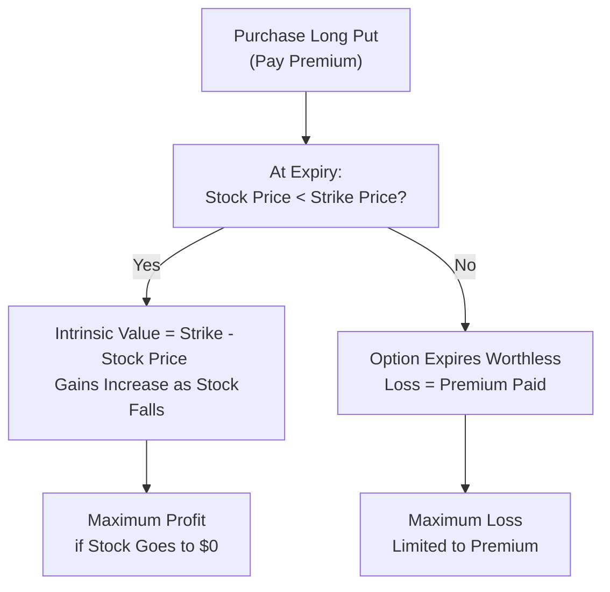
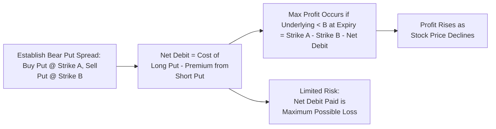

## Chapter 19: Bearish Option Strategies

Bearish option strategies can be a pretty fascinating topic for folks who expect a stock or broader market to drop. Sometimes, you’re convinced a company’s earnings are oversold hype, or maybe your cousin keeps bragging about shorting the market right before an earnings miss—whatever the reason, it’s good to know the core mechanics. And trust me, not all bearish approaches are created equal. Some are straightforward, like just buying a put, while others get fancy, like the Bear Call Spread.

Below, we’ll explore some of the most common bearish strategies, examine how they work, and consider their pros, cons, and risk considerations. We’ll also mention how these strategies line up with Canadian regulatory standards under the Canadian Investment Regulatory Organization (CIRO). By the way, if you’re reading earlier chapters, skip back to Chapter 18 for bullish strategies or reference Chapter 23 on margin requirements for more details about deposit and capital guidelines. 

---

### Introduction

When we say “bearish,” we’re talking about expecting a decline in the price of an asset—often a stock, an Exchange-Traded Fund (ETF), or even an index. Options provide numerous ways to profit from—or protect against—falling markets. Why would you use options instead of simply short selling a stock outright? Well:

• Limited Risk (Sometimes): Some bearish options positions, like a long put, let you cap your downside at the premium paid.  
• Strategic Flexibility: Options can be tailored to your outlook, whether you expect a big drop or a moderate decline.  
• Leverage: Options can offer leverage, allowing you to potentially amplify returns on smaller capital outlays (though we all know leverage swings both ways).

Yet every approach has its own payoff structure, margin requirement, and emotional baggage. Let’s walk through each in detail.

---

### Understanding the Bearish Outlook

A “bearish outlook” is simply a fancy way of saying: “I think the market (or a specific underlying) is going down.” But how much? And how quickly? If you believe the underlying might slowly decline over a month, that’s different from thinking it’ll crash in a week. In the same way, choosing a strategy depends heavily on how strongly you believe in the downward move, the time horizon, and your risk tolerance.

Bearish option strategies primarily focus on:

• Profiting from downward moves in the underlying’s price.  
• Hedging an existing long position (like a protective strategy for your existing portfolio).  
• Locking in gains on shares that you suspect will fall in value soon.

---

### The Long Put Strategy

If there’s one staple in the realm of bearish strategies, it’s owning a long put. When you buy a put option, you have the right—but not the obligation—to sell shares of the underlying asset at a specific strike price before or at expiration (depending on whether it’s an American or European style option).

#### How It Works

• You pay a premium for the put contract.  
• If the underlying’s market price falls below your put’s strike price, the option’s intrinsic value increases.  
• Your maximum profit occurs if the underlying’s price drops all the way to zero (pretty extreme scenario in reality, but theoretically possible).  
• Your maximum loss is limited to the premium you paid.

Let’s say you buy a put on TechXYZ stock with a strike price of CAD 50 for a premium of CAD 2. If TechXYZ falls to CAD 40 by expiration, your put will, in theory, be worth at least CAD 10 at expiry (CAD 50 strike – CAD 40 stock price). Your net profit would be CAD 10 – CAD 2 = CAD 8 (per share, multiplied by the contract’s lot size, typically 100 shares in many markets, but check the specifics on Bourse de Montréal listings).

#### Example Payoff Diagram (Conceptual Flow)

Below is a simple flowchart that demonstrates the relationship between stock price and a long put’s potential outcomes. It's not a line graph, but it should give a sense of how your payoff evolves:

#### Personal Anecdote

Believe it or not, my first real-life brush with a long put was on a mining stock. They had all these optimistic press releases, but supply chain issues had me feeling suspicious. I grabbed a few puts because I couldn’t short the stock easily at the time. Sure enough, the stock took a tumble. My puts? They soared in value, cushioning my portfolio from the overall correction that followed.

---

### The Short Call (Naked Call) Strategy

Naked calls are not for the faint of heart. A short call involves writing (or selling) a call option on a stock you do not own. You collect a premium upfront; however, if the stock’s price rises above your strike, the call buyer can exercise and require you to deliver shares at the strike—potentially a near-infinite risk if the stock skyrockets.

Think of it like promising to sell your neighbor your car at CAD 20,000 if they come up with the cash in the next two weeks—except you don’t even own the car yet. If the resale value suddenly shoots way up to CAD 40,000, you’re in a jam.

#### How It Works

• You receive a premium when writing the call.  
• If the stock stays below the strike price at expiry, that premium is all yours to keep.  
• If it goes above, your potential loss can theoretically become very, very large as you need to procure shares on the open market at a higher price to deliver at the strike.

Because of these unlimited risks, the short naked call is often subject to stricter margin requirements. CIRO guidelines typically require that your account has significant equity or margin to cover potential losses, as spelled out in Chapter 23 of this text.

#### Real-World Example

Let’s say you write a call on MapleAir Inc. with a strike price of CAD 50, collecting a CAD 2 premium per share. If MapleAir stays below CAD 50 by expiry, the option expires worthless, and you pocket CAD 2 × 100 shares = CAD 200. That’s your best-case scenario.

But if MapleAir soars to CAD 60, your short call would be ITM (in-the-money) by CAD 10. Potentially, you’re down CAD 8 net because you collected CAD 2 but must settle a CAD 10 loss. Suppose it doesn’t stop there: if MapleAir trades higher, your losses keep growing.

This unlimited upside risk is precisely why many people balk at the idea of a naked call. So, if you’re using it as a bearish strategy, be sure your convictions are strong—and your risk appetite is huge.

---

### Bear Put Spread

For those who think “Long put is too expensive, but short call is too dangerous,” the Bear Put Spread might provide a decent middle ground. The Bear Put Spread involves buying a put (with a higher strike) and simultaneously selling a put (with a lower strike) on the same underlying and the same expiration date.

#### How It Works

• Buy a put at strike price A. This part is your “long put.”  
• Sell a put at strike price B (lower than A). This partially offsets the cost of the long put.  
• Net premium is lower than that of just a long put, but so is your maximum profit.  
• You profit if the stock declines below strike B by expiration, up to a certain maximum.

Here’s a hypothetical: buy a put on Redwood Corp at strike CAD 50 for CAD 3, and sell a put at strike CAD 45 for CAD 1. Your net cost is CAD 2 (CAD 3 – CAD 1). The max value of this spread at expiry is CAD 5 (the difference between strikes). So, your best-case scenario is a net profit of CAD 3 (CAD 5 – CAD 2) if Redwood Corp finishes below CAD 45.

#### Quick Payoff Illustration

This strategy is often used when you suspect a moderate decline (not a catastrophic crash). It’s more cost-effective than a standalone long put but does cap your gains.

---

### Bear Call Spread

If you want to initiate a moderately bearish stance but also prefer to limit your risk, consider the Bear Call Spread. It’s essentially the opposite of the Bull Call Spread:

• You sell (write) a call at Strike A (lower strike).  
• You buy a call at Strike B (higher strike).  
• You receive a net credit.  

If the stock remains below Strike A by expiration, both calls expire worthless, and you keep your credit. If the stock rises above Strike B, your losses are capped by the long call you bought. This is an improvement over the short naked call in terms of limiting losses, but it also limits potential profit to the net credit received.

#### Example

1. Sell a call at CAD 50 for a premium of CAD 2.  
2. Buy a call at CAD 55 for CAD 0.50.  
3. Net credit = CAD 1.50 per share (CAD 2 – CAD 0.50).  
4. If the stock stays below CAD 50, you keep the CAD 1.50.  
5. If it rallies above CAD 55, your net loss is limited to the difference between strikes (CAD 5) minus the CAD 1.50 you collected, which is CAD 3.50 per share.

Margin requirements are generally lower for spreads than for naked positions. Under CIRO rules, this strategy is recognized as a “defined-risk strategy,” making it more accessible to a wider range of retail and institutional traders.

---

### Protective Call or Synthetic Short

A Protective Call is a lesser-known approach to “hedge” a short stock position. Wait, hedge a short stock? Sure. If you’re short shares, your risk is a large upward rally. Buying a call option effectively caps that rally risk.

Meanwhile, a Synthetic Short can be created by combining a short call and a long put on the same strike and expiry. It can emulate the payoff of an outright short position in the underlying. However, you need to be mindful of the margin and liquidity constraints that come with each leg. The plus side with a synthetic short is that it may tie up less capital compared to a direct short stock position.

---

### Greek Considerations for Bearish Strategies

The “Greeks” can add nuance to how you handle your bearish trades:

• Delta: Tells you how much your option’s price changes for every $1 change in the underlying. For a long put, delta is negative (the put gains value when the stock price drops). For a short call, delta is positive for the buyer and negative for the seller.  

• Gamma: Measures how quickly Delta changes. If you’re long options (calls or puts), Gamma is positive. If you’re short, Gamma is negative.  

• Theta: Reflects time decay. Short options might benefit from Theta, especially if the underlying isn’t moving much, while long options positions typically lose a bit of value every day if time passes without a beneficial price move.  

• Vega: Sensitivity to implied volatility (IV). If you’re long a put, you want volatility (Vega) to go up because it makes your put more valuable. If you’re short a call, you might want volatility to stay stable or drop.  

In a typical Bear Put Spread, you have a positive Gamma on the long put and a negative Gamma on the short put, which partially offsets. The net effect: you still benefit from downward movement, but not as dramatically as a plain long put might.

---

### Scenario Analysis and Stress Testing

It’s never enough to “just have a hunch.” Scenario analysis is especially crucial for bearish strategies, because if you’re wrong and the market rallies, your losses can pile up. Tools to consider:

• **What-If Simulations**: Many trading platforms now let you plug in hypothetical scenarios—If the underlying climbs 10%, if implied volatility drops by 5%, etc.  

• **Stress Testing**: Consider extreme moves. What if the underlying rallies 30%? Naked calls can get hammered, but a bear call spread might still be less egregious.  

• **Margin Impact**: On any big rally, how much margin does your broker or clearing firm require? Will you face margin calls? See Chapter 23 for more on margin rules under CIRO oversight.  

• **Time Decay**: A short call or short put in a spread might benefit from time decay if the market stands still. But a long put will see gradual premium decay if the downward move you predicted doesn’t materialize quickly.

---

### A Short Glossary of Key Terms

• **Bearish**: Expecting a downward price movement.  
• **Naked Call**: Writing a call option without owning the underlying, exposing yourself to potentially unlimited risk.  
• **Spread**: An options strategy that involves simultaneously buying and/or selling multiple options on the same underlying.  
• **Strike Price**: The exercise price of an option.  
• **CIRO**: The Canadian Investment Regulatory Organization, responsible for overseeing investment dealers, mutual fund dealers, and marketplaces in Canada.  
• **ITM (In-the-Money)**: An option with intrinsic value (put strike above current stock price or call strike below current stock price).  
• **Margin**: Collateral pledged to cover potential losses on a trade.  
• **Synthetic Short**: A position comprised of a short call and a long put with the same strike and expiry, designed to mimic a short position in the underlying.  

---

### Additional References and Resources

1. **CIRO (https://www.ciro.ca)**: The primary self-regulatory body for Canadian investment dealers. Check out their website for the latest compliance bulletins on options trading, margin requirements, and investor protection.  
2. **Bourse de Montréal (https://m-x.ca)**: For real-time quotes, contract specifications, trading hours, and educational materials on Canadian options.  
3. **Options Clearing Corporation (OCC)**: While it’s U.S.-based, the OCC site has excellent resources and learning tools that apply to many North American markets.  
4. **Chapter 23: Client Margin Requirements**: Explore margin rules, stress testing client portfolios, and guidelines on complex option strategies.  
5. **Chapter 18: Bullish Strategies**: A valuable comparison point to see the flipside of the coin (e.g., bull spreads vs. bear spreads).

---

### Conclusion

Bearish option strategies can be powerful ways to profit, hedge, or speculate in falling markets. From the straightforward (like a long put) to the more complex (Bear Spreads, Synthetic Short), each approach carries its own risk/reward tradeoff. One of my closest friends used a Bear Put Spread on a big tech name just a couple of weeks before an earnings miss—and let’s just say her gains covered the cost of her new laptop.

But these strategies require discipline. Keep an eye on your risk via margin requirements and possible short squeezes if the market goes against your position. Use scenario analysis to ensure that an unexpected price spike doesn’t ruin your day—or your capital. Above all, always consult updated CIRO guidelines and ensure your approach meets your broker’s approval and your own personal risk tolerance.

---

## Sample Exam Questions: Bearish Option Strategies Mastery Quiz



### Which of the following best describes the maximum loss for a Long Put option strategy?

- [ ] Unlimited
- [x] Limited to the premium paid
- [ ] Limited to the strike price minus the premium
- [ ] The difference between the underlying price and the strike

> **Explanation:** A Long Put strategy has a maximum loss equal to the premium paid. If the underlying’s price remains above the strike at expiration, the put option expires worthless, meaning the premium is lost but nothing more.

### Which of the following strategies carries theoretically unlimited risk?

- [ ] Bear Put Spread
- [ ] Bear Call Spread
- [x] Short (Naked) Call
- [ ] Long Put

> **Explanation:** A Short (Naked) Call can expose the seller to unlimited risk because a stock’s price can theoretically keep rising with no upper bound.

### In a Bear Put Spread, your maximum profit equals:

- [x] The difference between the strikes minus the net premium paid
- [ ] The total premium paid
- [ ] The difference between the underlying’s price and the higher strike
- [ ] Unlimited

> **Explanation:** The Bear Put Spread’s maximum profit is capped at (Strike A – Strike B – Net Debit). Buying a higher-strike put and selling a lower-strike put creates a spread whose maximum value is the difference between the two strike prices.

### Why might an investor choose a Bear Call Spread over a Short (Naked) Call?

- [x] To limit potential losses
- [ ] To generate a higher net credit
- [ ] Because it offers unlimited profit potential
- [ ] To reduce commissions to zero

> **Explanation:** A Bear Call Spread limits potential losses by owning a higher strike call, capping the upside risk if the market rallies above that strike.

### Which is an example of a Synthetic Short Position?

- [ ] Buying a put option alone
- [x] Buying a put and selling a call at the same strike and expiration
- [ ] Selling a put and selling a call simultaneously
- [ ] Owning the underlying and selling a call

> **Explanation:** A Synthetic Short is created by combining a short call and a long put with the same strike price and expiration, mirroring a short stock’s payoff.

### Under CIRO regulations, margin requirements for a Short (Naked) Call are generally:

- [x] Higher than a call spread
- [ ] Lower than a call spread
- [ ] Identical to a long call
- [ ] Determined solely by the investor’s net worth

> **Explanation:** Because Naked Calls can carry unlimited risk, CIRO sets higher margin requirements for them than for a call spread or a long option.

### When examining Greek exposures in Bear Strategies, how does Theta generally affect a Bear Put Spread?

- [ ] Increases the net cost over time
- [x] Partially offsets time decay due to the short leg
- [ ] Eliminates Gamma risk
- [ ] Remains unchanged

> **Explanation:** In a Bear Put Spread, you buy one put and sell another. The short put collects premium daily (positive Theta), partially offsetting the time decay cost (negative Theta) of the long put.

### What’s the primary benefit of using scenario analysis for a bearish position?

- [x] It helps you understand potential outcomes if the market rallies or volatility changes.
- [ ] It removes the need for margin.
- [ ] It guarantees a profit if the model is accurate.
- [ ] It defers taxes on any gains.

> **Explanation:** Scenario analysis shows how the trade might perform under various market conditions, such as a surprising upside move or a drop in implied volatility, which is crucial for risk mitigation.

### Which statement is true regarding a Protective Call strategy?

- [ ] It is used to profit from upward moves in the underlying stock.
- [ ] It involves selling a call to mitigate a short stock position.
- [x] It limits the upside risk on a short stock position.
- [ ] It requires no margin because you are protected.

> **Explanation:** A Protective Call is purchased to hedge a short stock. If the stock unexpectedly rallies, the call offsets some or all of the losses on the short position.

### True or False: A Bear Call Spread results in a net debit to the trader.

- [ ] True
- [x] False

> **Explanation:** A Bear Call Spread results in a net credit. You receive a premium on the short call that’s partially offset by paying a smaller premium for the long call, but the net is typically positive (a credit).


